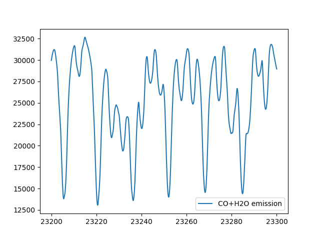

Casual Emission Spectrum
------------------------------

The difficulty with high-dispersion spectral analysis is that it takes a lot of work to make a small example spectrum. In my personal experience, it is surprisingly annoying to quickly find out if, for example, the water line was here or not during an observation. `AutoRT <../exojax/exojax.spec.html#exojax.spec.autospec.AutoRT>`_ was made for that purpose. Here is an example to quickly make the spectrum assuming water, CO, and CIA. 

.. code:: ipython3
	  
   import numpy as np
   import matplotlib.pyplot as plt
   from exojax.spec import AutoRT
   from exojax.spec.rtransfer import nugrid
   
   nus,wav,res=nugrid(23200,23300,1000,"AA") #compute a spectrum in 23200-23300 AA
   Parr=np.logspace(-8,2,100)
   Tarr = 1270.*(Parr/1.0)**0.1 #T-P profile 
   
   autort=AutoRT(nus,1.e5,2.33,Tarr,Parr) #g=1.e5 cm/s2, mmw=2.33
   autort.addcia("H2-H2",0.74,0.74)       #CIA, mmr(H)=0.74                        
   autort.addmol("ExoMol","CO",0.01,crit=1.e-45)  #CO line, mmr(CO)=0.01   
   autort.addmol("ExoMol","H2O",0.004,crit=1.e-40)  #H2O line, mmr(H2O)=0.004 

   F=autort.rtrun()
   F=autort.spectrum(nus,100000.0,18.0,0.0) #R=100,000 and Vsini=18km/s
   plt.plot(wav[::-1],F,label="CO+H2O emission")
   plt.legend()
   plt.show()

