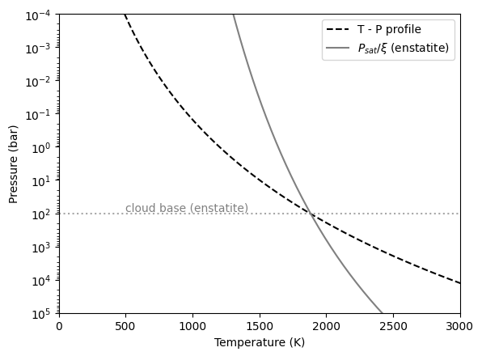
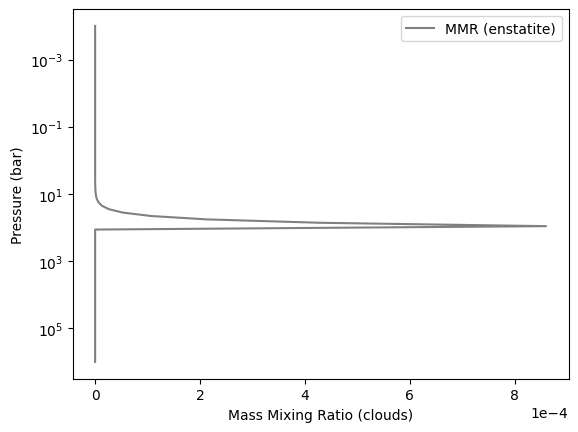
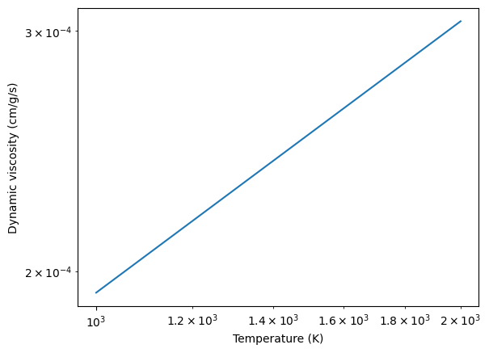
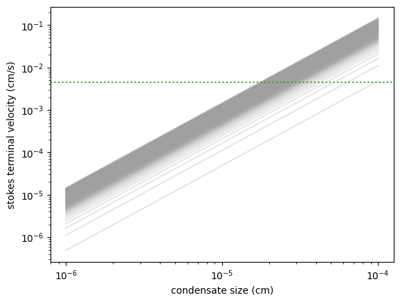
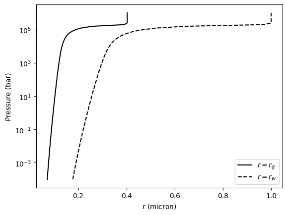
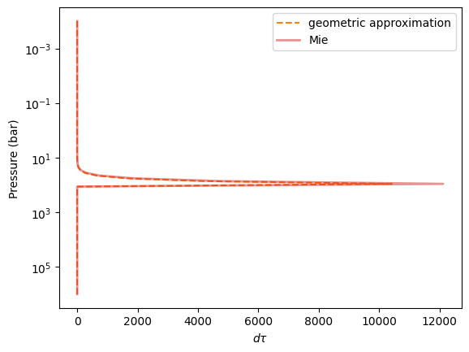
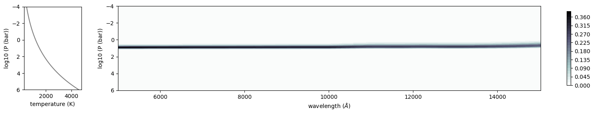
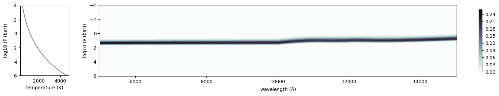
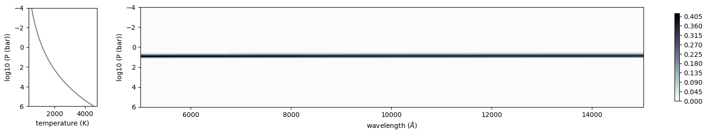
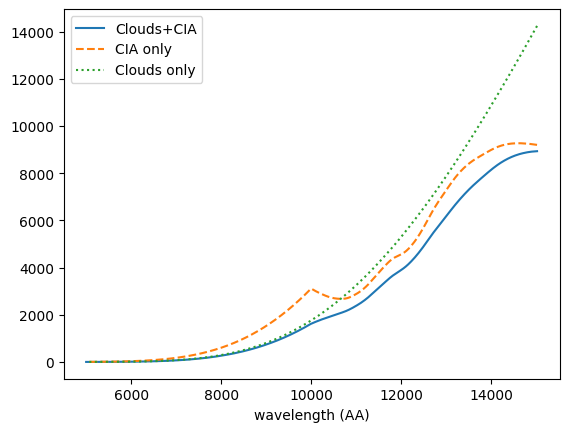

Ackerman and Marley Cloud Model
===============================

Here, we try to compute a cloud opacity using Ackerman and Marley Model.
Although ``atmphys.AmpAmcloud`` can easily compute the parameters of the
AM model, we here try to run the methods one by one. We consider
enstatite (MgSiO3).

.. code:: ipython3

    import os
    os.environ["MIEPYTHON_USE_JIT"] = "1"

    from jax import config
    config.update("jax_enable_x64", True)

    import jax.numpy as jnp
    import matplotlib.pyplot as plt
    import numpy as np

Sets a simple atmopheric model. We need the density of atmosphere.

.. code:: ipython3

    from exojax.utils.constants import kB, m_u
    from exojax.atm.atmprof import pressure_layer_logspace
    from exojax.utils.astrofunc import gravity_jupiter

    Parr, dParr, k = pressure_layer_logspace(
        log_pressure_top=-4.0, log_pressure_btm=6.0, nlayer=100
    )
    alpha = 0.097
    T0 = 1200.0
    Tarr = T0 * (Parr) ** alpha

    mu = 2.3  # mean molecular weight
    R = kB / (mu * m_u)
    rho = Parr * 1.0e6 / (R * Tarr)  # bar to dyn/cm^2

    gravity = gravity_jupiter(1.0, 1.0)

The solar abundance can be obtained using utils.zsol.nsol. Here, we
assume a maximum mol Mixing Ratio for MgSiO3 and Fe from solar
abundance.

.. code:: ipython3

    from exojax.utils.zsol import nsol

    n = nsol()  #solar abundance
    MolMR_enstatite = np.min([n["Mg"], n["Si"], n["O"] / 3])
    MolMR_Fe = n["Fe"]

.. parsed-literal::

    Database for solar abundance =  AAG21
    Asplund, M., Amarsi, A. M., & Grevesse, N. 2021, arXiv:2105.01661

Vapor saturation pressures can be obtained using atm.psat

.. code:: ipython3

    from exojax.atm.psat import psat_enstatite_AM01

    P_enstatite = psat_enstatite_AM01(Tarr)

Computes a cloud base pressure.

.. code:: ipython3

    from exojax.atm.amclouds import compute_cloud_base_pressure

    Pbase_enstatite = compute_cloud_base_pressure(Parr, P_enstatite, MolMR_enstatite)

The cloud base is located at the intersection of a TP profile and the
vapor saturation puressure devided by VMR.

.. code:: ipython3

    plt.plot(Tarr, Parr, color="black", ls="dashed", label="T - P profile")
    plt.plot(Tarr,
             P_enstatite / MolMR_enstatite,
             label="$P_{sat}/\\xi$ (enstatite)",
             color="gray")
    plt.axhline(Pbase_enstatite, color="gray", alpha=0.7, ls="dotted")
    plt.text(500, Pbase_enstatite * 0.8, "cloud base (enstatite)", color="gray")

    plt.yscale("log")
    plt.ylim(1.e-4, 1.e5)
    plt.xlim(0, 3000)
    plt.gca().invert_yaxis()
    plt.legend()
    plt.xlabel("Temperature (K)")
    plt.ylabel("Pressure (bar)")
    plt.savefig("pbase.pdf", bbox_inches="tight", pad_inches=0.0)
    plt.savefig("pbase.png", bbox_inches="tight", pad_inches=0.0)
    plt.show()

Compute Mass Mixing Ratio (MMRs) of clouds. In this block, we first
convert mol mixing ratio of condensates to MMR, then computes a cloud
profile.

.. code:: ipython3

    from exojax.atm.amclouds import mixing_ratio_cloud_profile
    from exojax.database.molinfo  import molmass_isotope
    from exojax.atm.atmconvert import vmr_to_mmr
    fsed = 3.
    muc_enstatite = molmass_isotope("MgSiO3", db_HIT=False)
    MMRbase_enstatite = vmr_to_mmr(MolMR_enstatite, muc_enstatite,mu)
    MMRc_enstatite = mixing_ratio_cloud_profile(Parr, Pbase_enstatite, fsed, MMRbase_enstatite)

The followings are the base pressures for enstatite and Fe.

.. code:: ipython3

    print(Pbase_enstatite)

.. parsed-literal::

    104.67461942592885

Here is the MMR distribution.

.. code:: ipython3

    plt.figure()
    plt.gca().get_xaxis().get_major_formatter().set_powerlimits([-3, 3])
    plt.plot(MMRc_enstatite, Parr, color="gray", label="MMR (enstatite)")

    plt.yscale("log")
    #plt.ylim(1.e-7, 10000)
    plt.gca().invert_yaxis()
    plt.legend()
    plt.xlabel("Mass Mixing Ratio (clouds)")
    plt.ylabel("Pressure (bar)")
    plt.savefig("mmrcloud.pdf", bbox_inches="tight", pad_inches=0.0)
    plt.savefig("mmrcloud.png", bbox_inches="tight", pad_inches=0.0)
    plt.show()

Computes dynamic viscosity in H2 atmosphere (cm/g/s)

.. code:: ipython3

    from exojax.atm.viscosity import eta_Rosner, calc_vfactor

    T = np.logspace(np.log10(1000), np.log10(2000))
    vfactor, Tr = calc_vfactor("H2")
    eta = eta_Rosner(T, vfactor)

.. code:: ipython3

    plt.plot(T, eta)
    plt.xscale("log")
    plt.yscale("log")
    plt.xlabel("Temperature (K)")
    plt.ylabel("Dynamic viscosity (cm/g/s)")
    plt.show()

The pressure scale height can be computed using atm.atmprof.Hatm.

.. code:: ipython3

    from exojax.atm.atmprof import pressure_scale_height
    T = 1000  #K
    print("scale height=", pressure_scale_height(1.e5, T, mu), "cm")

.. parsed-literal::

    scale height= 361498.24864271906 cm

We need the substance density of condensates.

.. code:: ipython3

    from exojax.atm.condensate import condensate_substance_density, name2formula

    deltac_enstatite = condensate_substance_density[name2formula["enstatite"]]

Let’s compute the terminal velocity. We can compute the terminal
velocity of cloud particle using atm.vterm.vf. vmap is again applied to
vf.

.. code:: ipython3

    from exojax.atm.viscosity import calc_vfactor, eta_Rosner
    from exojax.atm.vterm import terminal_velocity
    from jax import vmap

    vfactor, trange = calc_vfactor(atm="H2")
    rarr = jnp.logspace(-6, -4, 2000)  #cm
    drho = deltac_enstatite - rho
    eta_fid = eta_Rosner(Tarr, vfactor)

    g = gravity
    vf_vmap = vmap(terminal_velocity, (None, None, 0, 0, 0))
    vfs = vf_vmap(rarr, g, eta_fid, drho, rho)

Kzz/L will be used to calibrate :math:`r_w`. following Ackerman and
Marley 2001

.. code:: ipython3

    #sigmag:sigmag parameter (geometric standard deviation) in the lognormal distribution of condensate size, defined by (9) in AM01, must be sigmag > 1

    Kzz = 1.e5  #cm2/s
    sigmag = 2.0 # > 1
    alphav = 1.3
    L = pressure_scale_height(g, 1500, mu)

.. code:: ipython3

    Kzz/L

.. parsed-literal::

    0.004570934639843326

.. code:: ipython3

    for i in range(0, len(Tarr)):
        plt.plot(rarr, vfs[i, :], alpha=0.2, color="gray")
    plt.xscale("log")
    plt.yscale("log")
    plt.axhline(Kzz / L, label="Kzz/H", color="C2", ls="dotted")
    plt.ylabel("stokes terminal velocity (cm/s)")
    plt.xlabel("condensate size (cm)")

.. parsed-literal::

    Text(0.5, 0, 'condensate size (cm)')

Find the intersection.

.. code:: ipython3

    from exojax.atm.amclouds import find_rw

    vfind_rw = vmap(find_rw, (None, 0, None), 0)
    rw = vfind_rw(rarr, vfs, Kzz / L)

Then, :math:`r_g` can be computed from :math:`r_w` and other quantities.

.. code:: ipython3

    from exojax.atm.amclouds import get_rg

    rg = get_rg(rw, fsed, alphav, sigmag)

.. code:: ipython3

    plt.plot(rg * 1.e4, Parr, label="$r=r_g$", color="black")
    plt.plot(rw * 1.e4, Parr, ls="dashed", label="$r=r_w$", color="black")
    #plt.ylim(1.e-7, 10000)
    plt.xlabel("$r$ (micron)")
    plt.ylabel("Pressure (bar)")
    plt.yscale("log")
    plt.savefig("rgrw.png")
    plt.legend()

.. parsed-literal::

    <matplotlib.legend.Legend at 0x764d677068d0>

These processes can be reprodced using ``AmpAmcloud``, which uses
``PdbCloud`` as one of the input arguments. Here, we show an example:

.. code:: ipython3

    from exojax.atm.atmphys import AmpAmcloud
    from exojax.database.pardb  import PdbCloud
    pdb_enstatite = PdbCloud("MgSiO3")
    pdb_Fe = PdbCloud("Fe")

    amp = AmpAmcloud(pdb_enstatite,bkgatm="H2")
    rg, MMRc = amp.calc_ammodel(Parr,Tarr,mu,muc_enstatite,gravity,fsed,sigmag,Kzz,MMRbase_enstatite,alphav=alphav)

.. parsed-literal::

    .database/particulates/virga/virga.zip  exists. Remove it if you wanna re-download and unzip.
    Refractive index file found:  .database/particulates/virga/MgSiO3.refrind
    Miegrid file does not exist at  .database/particulates/virga/miegrid_lognorm_MgSiO3.mg.npz
    Generate miegrid file using pdb.generate_miegrid if you use Mie scattering
    .database/particulates/virga/virga.zip  exists. Remove it if you wanna re-download and unzip.
    Refractive index file found:  .database/particulates/virga/Fe.refrind
    Miegrid file does not exist at  .database/particulates/virga/miegrid_lognorm_Fe.mg.npz
    Generate miegrid file using pdb.generate_miegrid if you use Mie scattering

For the opacity comparison below, use a fixed geometric mean radius of 1
micrometer at every layer. We compare the geometric approximation with
Mie scattering at the same radius, distribution width, cloud abundance,
and gravity.

.. code:: ipython3

    from exojax.rt.layeropacity import layer_optical_depth_cloudgeo

    rg = 1.0e-4  # fixed 1 micrometer radius for both opacity calculations
    dtau_enstatite = layer_optical_depth_cloudgeo(
        dParr, deltac_enstatite, MMRc_enstatite, rg, sigmag, gravity
    )

The Mie scattering can be computed using ``OpaMie``.

.. code:: ipython3

    from exojax.utils.grids import wavenumber_grid
    from exojax.utils.grids import wav2nu

    N = 1000
    wavelength_start = 5000.0  # AA
    wavelength_end = 15000.0  # AA

    margin = 10  # cm-1
    nus_start = wav2nu(wavelength_end, unit="AA") - margin
    nus_end = wav2nu(wavelength_start, unit="AA") + margin
    nugrid, wav, res = wavenumber_grid(nus_start, nus_end, N, xsmode="lpf", unit="cm-1")

    from exojax.opacity import OpaMie

    opa_enstatite = OpaMie(pdb_enstatite, nugrid)

    # beta0, betasct, g = opa.mieparams_vector(rg,sigmag) # if you've already generated miegrid
    beta0, betasct, g = opa_enstatite.mieparams_vector_direct(
        rg, sigmag
    )  # computes Mie parameters directly using miepython

    from exojax.rt.layeropacity import layer_optical_depth_clouds_lognormal

    dtau_enstatite_mie = layer_optical_depth_clouds_lognormal(
        dParr, beta0, deltac_enstatite, MMRc_enstatite, rg, sigmag, gravity
    )

.. parsed-literal::

    /home/kawahara/exojax/src/exojax/utils/grids.py:249: UserWarning: Resolution may be too small. R=907.6757560767178
      warnings.warn("Resolution may be too small. R=" + str(resolution), UserWarning)

.. parsed-literal::

    xsmode =  lpf
    xsmode assumes ESLOG in wavenumber space: xsmode=lpf
    Your wavelength grid is in ***  descending  *** order
    The wavenumber grid is in ascending order by definition.
    Please be careful when you use the wavelength grid.

.. parsed-literal::

The geometric approximation neglects the wavelength dependence of the
Mie extinction efficiency. The profiles below show the resulting
difference for the same cloud distribution.

.. code:: ipython3

    fig = plt.figure()
    ax=fig.add_subplot(111)
    plt.plot(dtau_enstatite, Parr, color="C1", ls="dashed", label="geometric approximation")
    plt.plot(np.median(dtau_enstatite_mie,axis=1), Parr, color="C3", label="Mie",alpha=0.5,lw=2)
    plt.legend()
    plt.yscale("log")
    plt.xlabel("$d\\tau$")
    plt.ylabel("Pressure (bar)")
    #plt.xscale("log")
    plt.gca().invert_yaxis()
    plt.show()

Let’s compare with CIA

.. code:: ipython3

    #CIA

    from exojax.database import contdb
    cdbH2H2 = contdb.CdbCIA('.database/H2-H2_2011.cia', nugrid)

.. parsed-literal::

    Load CIA:  H2-H2

.. code:: ipython3

    from exojax.rt.layeropacity import layer_optical_depth_CIA
    from exojax.atm.atmconvert import mmr_to_vmr

    mmrH2 = 0.74
    molmassH2 = molmass_isotope("H2")
    vmrH2 = mmr_to_vmr(mmrH2, molmassH2, mu)
    dtaucH2H2 = layer_optical_depth_CIA(
        nugrid,
        Tarr,
        Parr,
        dParr,
        vmrH2,
        vmrH2,
        mu,
        gravity,
        cdbH2H2.nucia,
        cdbH2H2.tcia,
        cdbH2H2.logac,
    )

.. code:: ipython3

    dtau = dtaucH2H2 + dtau_enstatite_mie

.. code:: ipython3

    from exojax.plot.atmplot import plotcf

    plotcf(nugrid, dtau, Tarr, Parr, dParr, unit="AA")
    plt.show()

.. code:: ipython3

    from exojax.plot.atmplot import plotcf

    plotcf(nugrid, dtaucH2H2, Tarr, Parr, dParr, unit="AA")
    plt.show()

.. code:: ipython3

    from exojax.plot.atmplot import plotcf

    plotcf(nugrid,
           dtau_enstatite_mie,
           Tarr,
           Parr,
           dParr,
           unit="AA")
    plt.show()

.. code:: ipython3

    from exojax.rt import planck
    from exojax.rt.rtransfer import rtrun_emis_pureabs_fbased2st as rtrun
    #from exojax.rt.rtransfer import rtrun_emis_pureabs_ibased as rtrun
    sourcef = planck.piBarr(Tarr, nugrid)
    F0 = rtrun(dtau, sourcef)
    F0CIA = rtrun(dtaucH2H2, sourcef)
    F0cl = rtrun(dtau_enstatite_mie, sourcef)

Compare the cloud and CIA contributions to the emission spectrum. This
example treats cloud extinction as absorption; modeling multiple
scattering requires a scattering radiative-transfer solver.

.. code:: ipython3

    plt.plot(wav, F0, label="Clouds+CIA")
    plt.plot(wav, F0CIA, label="CIA only", ls="dashed")
    plt.plot(wav, F0cl, label="Clouds only", ls="dotted")
    plt.xlabel("wavelength (AA)")
    plt.legend()
    plt.show()

