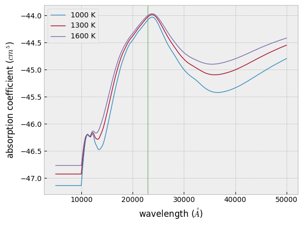

CIA coefficient
===============

.. code:: ipython3

    from exojax.spec.rtransfer import nugrid
    nus,wav,res=nugrid(5000,50000,1000,unit="AA")
    from exojax.spec import contdb
    cdbH2H2=contdb.CdbCIA('.database/H2-H2_2011.cia',nus)

.. parsed-literal::

    xsmode assumes ESLOG in wavenumber space: mode=lpf
    H2-H2

.. parsed-literal::

    /home/kawahara/anaconda3/lib/python3.8/site-packages/exojax-1.1.3-py3.8.egg/exojax/spec/check_nugrid.py:16: UserWarning: Resolution may be too small. R=433.86018742134854
      warnings.warn('Resolution may be too small. R=' + str(resolution),

logacia can provide an absorption coeffcient as a function of
temperature

.. code:: ipython3

    from exojax.spec.hitrancia import logacia
    import jax.numpy as jnp
    Tfix=jnp.array([1000.0,1300.0,1600.0])
    lc=logacia(Tfix,nus,cdbH2H2.nucia,cdbH2H2.tcia,cdbH2H2.logac)

plotting…

.. code:: ipython3

    import matplotlib.pyplot as plt
    import seaborn
    plt.style.use('bmh')
    for i in range(0,len(Tfix)):
        plt.plot(wav[::-1],lc[i,:],lw=1,label=str(int(Tfix[i]))+" K")
    plt.axvspan(22876.0,23010.0,alpha=0.3,color="green")
    plt.xlabel("wavelength ($\\AA$)")
    plt.ylabel("absorption coefficient ($cm^5$)")
    plt.legend()
    plt.savefig("cia.png")

.. code:: ipython3

    #max value
    import numpy as np
    1.e8/nus[np.argmax(lc[1,:])]

.. parsed-literal::

    23858.80474469375

