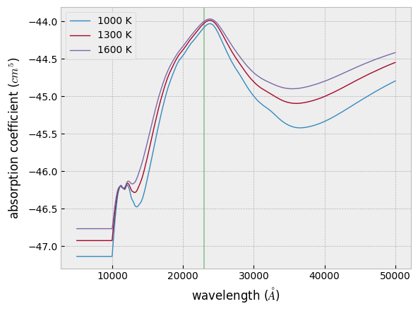

CIA coefficient
===============

Collisional Induced Absorption (CIA) refers to the phenomenon where
temporary interactions between molecules during collisions induce a
transient dipole moment, enabling the absorption of radiation that would
not occur in isolated molecules. This mechanism is particularly
significant in environments with non-polar molecules, such as H22 and
He, where typical dipole-induced transitions are absent.

In the context of planetary and brown dwarf atmospheres, CIA is
particularly important as a source of continuum opacity in the spectra
of hydrogen-rich gas planets. In ExoJAX, the ``CdbCIA`` class can be
used for database I/O to access CIA data provided by HITRAN.

For examples of actual usage, please refer to resources such as the `get
started <get_started.html>`__ guide.

.. code:: ipython3

    from exojax.utils.grids import wavenumber_grid
    
    nu_grid, wav, res = wavenumber_grid(5000, 50000, 1000, unit="AA", xsmode="lpf")
    
    from exojax.spec import contdb
    cdbH2H2 = contdb.CdbCIA(".database/H2-H2_2011.cia", nu_grid)

.. parsed-literal::

    xsmode =  lpf
    xsmode assumes ESLOG in wavenumber space: xsmode=lpf
    ======================================================================
    The wavenumber grid should be in ascending order.
    The users can specify the order of the wavelength grid by themselves.
    Your wavelength grid is in ***  descending  *** order
    ======================================================================
    H2-H2

For opacity calculations, the
`OpaCIA <../exojax/exojax.spec.html#exojax.spec.opacont.OpaCIA>`__ class
is available.

.. code:: ipython3

    from exojax.spec.opacont import OpaCIA
    opacia = OpaCIA(cdbH2H2, nu_grid=nu_grid)

Let’s calculate (the logarithm of) the CIA absorption coefficient at
three different temperatures. To compute them all at once, you can use
``opa.logacia_matrix``. (If you want to calculate it for a single
temperature, you can use ``opa.logacia_vector`` instead.)

.. code:: ipython3

    import jax.numpy as jnp
    Tfix = jnp.array([1000.0, 1300.0, 1600.0])
    
    lc = opacia.logacia_matrix(Tfix)

.. code:: ipython3

    import matplotlib.pyplot as plt
    
    plt.style.use("bmh")
    for i in range(0, len(Tfix)):
        plt.plot(wav, lc[i, :], lw=1, label=str(int(Tfix[i])) + " K")
    plt.axvspan(22876.0, 23010.0, alpha=0.3, color="green")
    plt.xlabel("wavelength ($\\AA$)")
    plt.ylabel("absorption coefficient ($cm^5$)")
    plt.legend()
    plt.savefig("cia.png")

In practice, this simply performs interpolation within the CIA database
grid. ``cdb.tcia`` contains the temperature axis, ``cdb.nucia`` holds
the wavenumber values, and ``cdb.logac`` stores the logarithmic
absorption coefficients.

.. code:: ipython3

    from exojax.spec.hitrancia import interp_logacia_vector
    lc = interp_logacia_vector(Tfix, nu_grid, cdbH2H2.nucia, cdbH2H2.tcia, cdbH2H2.logac).T

