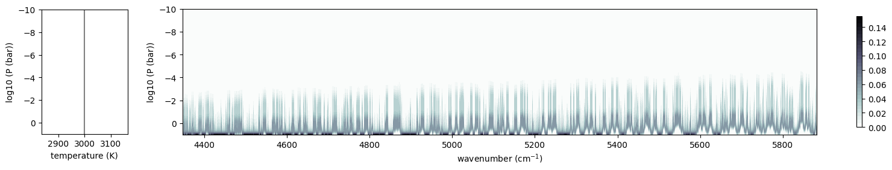
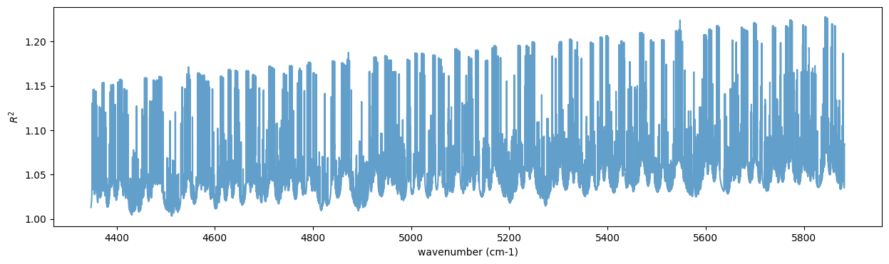

Reduces Device Memory Usage by Dividing and Stitching the Wavenumber Grid (:math:`\nu` - stitching)
===================================================================================================

Hajime Kawahara March 1st (2025)

Here, we explain the method of reducing GPU device memory usage by
dividing the wavenumber grid (:math:`\nu` - stitching). This approach is
particularly effective for transmission spectroscopy, where
`opart <get_started_opart.html>`__ cannot be used. When applying this
method, `forward-mode
differentiation <get_started_opart.html#optimization-of-opart-using-forward-differentiation>`__
should be used for derivatives. While :math:`\nu` - stitching `can be
performed manually <Open_Close_Cross_Section.html>`__, we describe the
procedure using :math:`\nu` - stitching in ``OpaPremodit`` in this
section.

Currently, the only opacity calculator that supports
:math:`\nu`-stitching is PreMODIT (v2.0), which can be used with
``OpaPremodit``.

.. code:: ipython3

    from exojax.opacity.opacalc import OpaPremodit
    from exojax.utils.grids import wavenumber_grid
    from exojax.spec.api import MdbExomol
    from exojax.spec.atmrt import ArtTransPure
    import jax.numpy as jnp
    
    
    from jax import config 
    config.update("jax_enable_x64", True)

.. parsed-literal::

    /home/kawahara/anaconda3/lib/python3.10/site-packages/pandas/core/arrays/masked.py:60: UserWarning: Pandas requires version '1.3.6' or newer of 'bottleneck' (version '1.3.5' currently installed).
      from pandas.core import (
    /home/kawahara/exojax/src/exojax/spec/dtau_mmwl.py:13: FutureWarning: dtau_mmwl might be removed in future.
      warnings.warn("dtau_mmwl might be removed in future.", FutureWarning)

In this example, the OH molecule is used to compute opacity over the
1.7–2.3 micron range, divided into 300,000 segments, with 300
atmospheric layers. At the time of creating this notebook, the
computation was performed on a gaming laptop with 8GB of device memory.

.. code:: ipython3

    N=300000
    nus, wav, res = wavenumber_grid(17000.0, 23000.0, N, unit="AA", xsmode="premodit")
    print("resolution=",res)
    mdb = MdbExomol(".database/OH/16O-1H/MoLLIST/", nus)

.. parsed-literal::

    /home/kawahara/exojax/src/exojax/spec/unitconvert.py:63: UserWarning: Both input wavelength and output wavenumber are in ascending order.
      warnings.warn(
    /home/kawahara/exojax/src/exojax/utils/molname.py:197: FutureWarning: e2s will be replaced to exact_molname_exomol_to_simple_molname.
      warnings.warn(
    /home/kawahara/exojax/src/exojax/utils/molname.py:91: FutureWarning: exojax.utils.molname.exact_molname_exomol_to_simple_molname will be replaced to radis.api.exomolapi.exact_molname_exomol_to_simple_molname.
      warnings.warn(
    /home/kawahara/exojax/src/exojax/utils/molname.py:91: FutureWarning: exojax.utils.molname.exact_molname_exomol_to_simple_molname will be replaced to radis.api.exomolapi.exact_molname_exomol_to_simple_molname.
      warnings.warn(

.. parsed-literal::

    xsmode =  premodit
    xsmode assumes ESLOG in wavenumber space: xsmode=premodit
    Your wavelength grid is in ***  descending  *** order
    The wavenumber grid is in ascending order by definition.
    Please be careful when you use the wavelength grid.
    resolution= 992451.1535950146
    HITRAN exact name= (16O)H
    radis engine =  vaex
    Molecule:  OH
    Isotopologue:  16O-1H
    ExoMol database:  None
    Local folder:  .database/OH/16O-1H/MoLLIST
    Transition files: 
    	 => File 16O-1H__MoLLIST.trans
    Broadener:  H2
    The default broadening parameters are used.

.. parsed-literal::

    /home/kawahara/anaconda3/lib/python3.10/site-packages/radis-0.16-py3.10.egg/radis/api/exomolapi.py:1527: UserWarning: Could not load `16O-1H__H2.broad`. The default broadening parameters are used.
    
      warnings.warn(

.. code:: ipython3

    art = ArtTransPure(pressure_top=1.e-10, pressure_btm=1.e1, nlayer=300) #300 OK
    Tarr = jnp.ones_like(art.pressure)*3000.0
    Parr = art.pressure

.. parsed-literal::

    integration:  simpson
    Simpson integration, uses the chord optical depth at the lower boundary and midppoint of the layers.

.. parsed-literal::

    /home/kawahara/exojax/src/exojax/spec/atmrt.py:53: UserWarning: nu_grid is not given. specify nu_grid when using 'run' 
      warnings.warn(

Now, we proceed with the opacity calculation. Here, the wavenumber range
is divided into 20 segments, and the opacity is computed by summing over
them using OLA. The parameter ``cutwing`` specifies where to truncate
the line wings. In this case, ``cutwing`` is set to 0.015, meaning the
truncation occurs at 0.015 times the wavenumber grid spacing, which
corresponds to approximately 20 cm-1.

Please refer to `this section <Open_Close_Cross_Section.html>`__ for the
mechanism of OLA-based combination.

.. code:: ipython3

    ndiv=20
    opas = OpaPremodit(mdb, nus, nstitch=ndiv, auto_trange=[500,1300], cutwing = 0.015)
    xsm_s = opas.xsmatrix(Tarr, Parr)

.. parsed-literal::

    OpaPremodit: params automatically set.
    default elower grid trange (degt) file version: 2
    Robust range: 485.7803992045456 - 1334.4906506037173 K
    OpaPremodit: Tref_broadening is set to  806.2257748298548 K
    # of reference width grid :  4
    # of temperature exponent grid : 2

.. parsed-literal::

    uniqidx: 100%|██████████| 2/2 [00:00<00:00, 5482.75it/s]

.. parsed-literal::

    Premodit: Twt= 1049.0651485510987 K Tref= 539.7840596059918 K
    Making LSD:|####################| 100%

.. parsed-literal::

    

.. parsed-literal::

    OpaPremodit: Stitching mode is used: nstitch = 20
    cross section is calculated in the stitching mode.
    wing cut width =  [19.66940912454993, 26.732490348052124] cm-1

.. parsed-literal::

    2025-03-01 18:59:24.343399: W external/xla/xla/hlo/transforms/simplifiers/hlo_rematerialization.cc:3021] Can't reduce memory use below 3.15GiB (3379151558 bytes) by rematerialization; only reduced to 3.52GiB (3775929320 bytes), down from 3.52GiB (3775948936 bytes) originally

You can check the wing-cut wavenumber :math:`\Delta \nu \sim 20` cm-1.

.. code:: ipython3

    from exojax.utils.astrofunc import gravity_jupiter
    mmr = jnp.ones_like(Parr)*0.01
    g = gravity_jupiter(1.0,1.0)
    dtau = art.opacity_profile_xs(xsm_s,mmr,mdb.molmass,g)

Let’s check the contribution function. It is clear that lines are
present across a wide wavenumber range.

.. code:: ipython3

    from exojax.plot.atmplot import plotcf
    cf = plotcf(nus, dtau, Tarr, Parr, art.dParr)

Let’s calculate the transmitted light spectrum.

.. code:: ipython3

    from exojax.utils.constants import RJ
    mmw = jnp.ones_like(Parr)*2.0
    r2 = art.run(dtau, Tarr, mmw, RJ, g)

.. code:: ipython3

    import matplotlib.pyplot as plt
    
    plt.figure(figsize=(15, 4))
    plt.plot(nus, r2, alpha=0.7)
    plt.ylabel("$R^2$")
    plt.xlabel("wavenumber (cm-1)")

.. parsed-literal::

    Text(0.5, 0, 'wavenumber (cm-1)')

That’s it!

