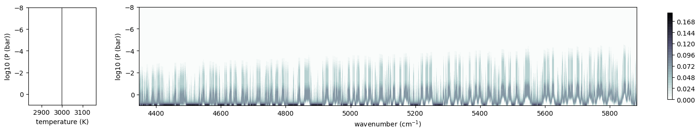
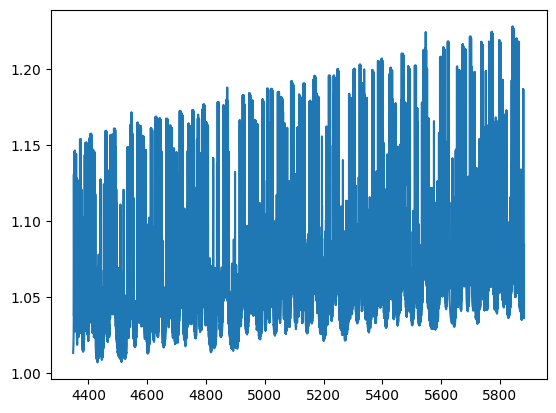

.. code:: ipython3

    from exojax.spec.opastitch import OpaPremoditStitch
    from exojax.utils.grids import wavenumber_grid
    from exojax.spec.api import MdbExomol
    from exojax.spec.atmrt import ArtTransPure
    import numpy as np
    import jax.numpy as jnp
    
    
    from jax import config 
    config.update("jax_enable_x64", True)

.. parsed-literal::

    /home/kawahara/anaconda3/lib/python3.10/site-packages/pandas/core/arrays/masked.py:60: UserWarning: Pandas requires version '1.3.6' or newer of 'bottleneck' (version '1.3.5' currently installed).
      from pandas.core import (
    /home/kawahara/exojax/src/exojax/spec/dtau_mmwl.py:13: FutureWarning: dtau_mmwl might be removed in future.
      warnings.warn("dtau_mmwl might be removed in future.", FutureWarning)

.. code:: ipython3

    N=300000
    nus, wav, res = wavenumber_grid(17000.0, 23000.0, N, unit="AA", xsmode="premodit")
    print("resolution=",res)
    mdb = MdbExomol(".database/OH/16O-1H/MoLLIST/", nus)

.. parsed-literal::

    xsmode =  premodit
    xsmode assumes ESLOG in wavenumber space: xsmode=premodit
    Your wavelength grid is in ***  descending  *** order
    The wavenumber grid is in ascending order by definition.
    Please be careful when you use the wavelength grid.
    resolution= 992451.1535950146
    HITRAN exact name= (16O)H
    radis engine =  vaex

.. parsed-literal::

    /home/kawahara/exojax/src/exojax/spec/unitconvert.py:63: UserWarning: Both input wavelength and output wavenumber are in ascending order.
      warnings.warn(
    /home/kawahara/exojax/src/exojax/utils/molname.py:197: FutureWarning: e2s will be replaced to exact_molname_exomol_to_simple_molname.
      warnings.warn(
    /home/kawahara/exojax/src/exojax/utils/molname.py:91: FutureWarning: exojax.utils.molname.exact_molname_exomol_to_simple_molname will be replaced to radis.api.exomolapi.exact_molname_exomol_to_simple_molname.
      warnings.warn(
    /home/kawahara/exojax/src/exojax/utils/molname.py:91: FutureWarning: exojax.utils.molname.exact_molname_exomol_to_simple_molname will be replaced to radis.api.exomolapi.exact_molname_exomol_to_simple_molname.
      warnings.warn(

.. parsed-literal::

    Molecule:  OH
    Isotopologue:  16O-1H
    ExoMol database:  None
    Local folder:  .database/OH/16O-1H/MoLLIST
    Transition files: 
    	 => File 16O-1H__MoLLIST.trans
    Broadener:  H2
    The default broadening parameters are used.

.. parsed-literal::

    /home/kawahara/anaconda3/lib/python3.10/site-packages/radis-0.16-py3.10.egg/radis/api/exomolapi.py:1527: UserWarning: Could not load `16O-1H__H2.broad`. The default broadening parameters are used.
    
      warnings.warn(

.. code:: ipython3

    art = ArtTransPure(pressure_top=1.e-8, pressure_btm=1.e1, nlayer=200)
    Tarr = jnp.ones_like(art.pressure)*3000.0
    Parr = art.pressure

.. parsed-literal::

    integration:  simpson
    Simpson integration, uses the chord optical depth at the lower boundary and midppoint of the layers.

.. parsed-literal::

    /home/kawahara/exojax/src/exojax/spec/atmrt.py:53: UserWarning: nu_grid is not given. specify nu_grid when using 'run' 
      warnings.warn(

.. code:: ipython3

    ndiv=20
    opas = OpaPremoditStitch(mdb, nus, ndiv, auto_trange=[500,1300], cutwing = 0.5)
    xsm_s = opas.xsmatrix(Tarr, Parr)

.. parsed-literal::

    /home/kawahara/exojax/src/exojax/spec/initspec.py:280: UserWarning: Some of the line centers are outside of the wavenumber grid.
      warnings.warn(
    /home/kawahara/exojax/src/exojax/spec/initspec.py:282: UserWarning: All of the line center should be within wavenumber grid for PreMODIT/MODIT/DIT.
      warnings.warn(

.. parsed-literal::

    OpaPremodit: params automatically set.
    default elower grid trange (degt) file version: 2
    Robust range: 485.7803992045456 - 1334.4906506037173 K
    OpaPremodit: Tref_broadening is set to  806.2257748298548 K
    # of reference width grid :  4
    # of temperature exponent grid : 2

.. parsed-literal::

    uniqidx: 0it [00:00, ?it/s]
    /home/kawahara/exojax/src/exojax/spec/initspec.py:280: UserWarning: Some of the line centers are outside of the wavenumber grid.
      warnings.warn(
    /home/kawahara/exojax/src/exojax/spec/initspec.py:282: UserWarning: All of the line center should be within wavenumber grid for PreMODIT/MODIT/DIT.
      warnings.warn(

.. parsed-literal::

    Premodit: Twt= 1049.0651485510987 K Tref= 539.7840596059918 K
    Making LSD:|####################| 100%
    cross section (xsvector/xsmatrix) is calculated in the open mode. The aliasing part can be used.
    OpaPremodit: params automatically set.
    default elower grid trange (degt) file version: 2
    Robust range: 485.7803992045456 - 1334.4906506037173 K
    OpaPremodit: Tref_broadening is set to  806.2257748298548 K
    # of reference width grid :  4
    # of temperature exponent grid : 2

.. parsed-literal::

    uniqidx: 0it [00:00, ?it/s]
    /home/kawahara/exojax/src/exojax/spec/initspec.py:280: UserWarning: Some of the line centers are outside of the wavenumber grid.
      warnings.warn(
    /home/kawahara/exojax/src/exojax/spec/initspec.py:282: UserWarning: All of the line center should be within wavenumber grid for PreMODIT/MODIT/DIT.
      warnings.warn(

.. parsed-literal::

    Premodit: Twt= 1049.0651485510987 K Tref= 539.7840596059918 K
    Making LSD:|####################| 100%
    cross section (xsvector/xsmatrix) is calculated in the open mode. The aliasing part can be used.
    OpaPremodit: params automatically set.
    default elower grid trange (degt) file version: 2
    Robust range: 485.7803992045456 - 1334.4906506037173 K
    OpaPremodit: Tref_broadening is set to  806.2257748298548 K
    # of reference width grid :  4
    # of temperature exponent grid : 2

.. parsed-literal::

    uniqidx: 0it [00:00, ?it/s]

.. parsed-literal::

    Premodit: Twt= 1049.0651485510987 K Tref= 539.7840596059918 K
    Making LSD:|####################| 100%
    cross section (xsvector/xsmatrix) is calculated in the open mode. The aliasing part can be used.
    OpaPremodit: params automatically set.
    default elower grid trange (degt) file version: 2
    Robust range: 485.7803992045456 - 1334.4906506037173 K
    OpaPremodit: Tref_broadening is set to  806.2257748298548 K

.. parsed-literal::

    
    /home/kawahara/exojax/src/exojax/spec/initspec.py:280: UserWarning: Some of the line centers are outside of the wavenumber grid.
      warnings.warn(
    /home/kawahara/exojax/src/exojax/spec/initspec.py:282: UserWarning: All of the line center should be within wavenumber grid for PreMODIT/MODIT/DIT.
      warnings.warn(

.. parsed-literal::

    # of reference width grid :  4
    # of temperature exponent grid : 2

.. parsed-literal::

    uniqidx: 0it [00:00, ?it/s]

.. parsed-literal::

    Premodit: Twt= 1049.0651485510987 K Tref= 539.7840596059918 K
    Making LSD:|####################| 100%

.. parsed-literal::

    /home/kawahara/exojax/src/exojax/spec/initspec.py:280: UserWarning: Some of the line centers are outside of the wavenumber grid.
      warnings.warn(
    /home/kawahara/exojax/src/exojax/spec/initspec.py:282: UserWarning: All of the line center should be within wavenumber grid for PreMODIT/MODIT/DIT.
      warnings.warn(

.. parsed-literal::

    cross section (xsvector/xsmatrix) is calculated in the open mode. The aliasing part can be used.
    OpaPremodit: params automatically set.
    default elower grid trange (degt) file version: 2
    Robust range: 485.7803992045456 - 1334.4906506037173 K
    OpaPremodit: Tref_broadening is set to  806.2257748298548 K
    # of reference width grid :  4
    # of temperature exponent grid : 2

.. parsed-literal::

    uniqidx: 0it [00:00, ?it/s]

.. parsed-literal::

    Premodit: Twt= 1049.0651485510987 K Tref= 539.7840596059918 K
    Making LSD:|####################| 100%

.. parsed-literal::

    /home/kawahara/exojax/src/exojax/spec/initspec.py:280: UserWarning: Some of the line centers are outside of the wavenumber grid.
      warnings.warn(
    /home/kawahara/exojax/src/exojax/spec/initspec.py:282: UserWarning: All of the line center should be within wavenumber grid for PreMODIT/MODIT/DIT.
      warnings.warn(

.. parsed-literal::

    cross section (xsvector/xsmatrix) is calculated in the open mode. The aliasing part can be used.
    OpaPremodit: params automatically set.
    default elower grid trange (degt) file version: 2
    Robust range: 485.7803992045456 - 1334.4906506037173 K
    OpaPremodit: Tref_broadening is set to  806.2257748298548 K
    # of reference width grid :  4
    # of temperature exponent grid : 2

.. parsed-literal::

    uniqidx: 0it [00:00, ?it/s]

.. parsed-literal::

    Premodit: Twt= 1049.0651485510987 K Tref= 539.7840596059918 K
    Making LSD:|####################| 100%
    cross section (xsvector/xsmatrix) is calculated in the open mode. The aliasing part can be used.
    OpaPremodit: params automatically set.
    default elower grid trange (degt) file version: 2
    Robust range: 485.7803992045456 - 1334.4906506037173 K
    OpaPremodit: Tref_broadening is set to  806.2257748298548 K
    # of reference width grid :  4
    # of temperature exponent grid : 2

.. parsed-literal::

    /home/kawahara/exojax/src/exojax/spec/initspec.py:280: UserWarning: Some of the line centers are outside of the wavenumber grid.
      warnings.warn(
    /home/kawahara/exojax/src/exojax/spec/initspec.py:282: UserWarning: All of the line center should be within wavenumber grid for PreMODIT/MODIT/DIT.
      warnings.warn(
    uniqidx: 100%|██████████| 1/1 [00:00<00:00, 11618.57it/s]

.. parsed-literal::

    Premodit: Twt= 1049.0651485510987 K Tref= 539.7840596059918 K
    Making LSD:|####################| 100%

.. parsed-literal::

    /home/kawahara/exojax/src/exojax/spec/initspec.py:280: UserWarning: Some of the line centers are outside of the wavenumber grid.
      warnings.warn(
    /home/kawahara/exojax/src/exojax/spec/initspec.py:282: UserWarning: All of the line center should be within wavenumber grid for PreMODIT/MODIT/DIT.
      warnings.warn(

.. parsed-literal::

    cross section (xsvector/xsmatrix) is calculated in the open mode. The aliasing part can be used.
    OpaPremodit: params automatically set.
    default elower grid trange (degt) file version: 2
    Robust range: 485.7803992045456 - 1334.4906506037173 K
    OpaPremodit: Tref_broadening is set to  806.2257748298548 K
    # of reference width grid :  4
    # of temperature exponent grid : 2

.. parsed-literal::

    uniqidx: 0it [00:00, ?it/s]

.. parsed-literal::

    Premodit: Twt= 1049.0651485510987 K Tref= 539.7840596059918 K
    Making LSD:|####################| 100%

.. parsed-literal::

    
    /home/kawahara/exojax/src/exojax/spec/initspec.py:280: UserWarning: Some of the line centers are outside of the wavenumber grid.
      warnings.warn(

.. parsed-literal::

    cross section (xsvector/xsmatrix) is calculated in the open mode. The aliasing part can be used.
    OpaPremodit: params automatically set.
    default elower grid trange (degt) file version: 2
    Robust range: 485.7803992045456 - 1334.4906506037173 K
    OpaPremodit: Tref_broadening is set to  806.2257748298548 K

.. parsed-literal::

    /home/kawahara/exojax/src/exojax/spec/initspec.py:282: UserWarning: All of the line center should be within wavenumber grid for PreMODIT/MODIT/DIT.
      warnings.warn(

.. parsed-literal::

    # of reference width grid :  4
    # of temperature exponent grid : 2

.. parsed-literal::

    uniqidx: 0it [00:00, ?it/s]

.. parsed-literal::

    Premodit: Twt= 1049.0651485510987 K Tref= 539.7840596059918 K
    Making LSD:|####################| 100%
    cross section (xsvector/xsmatrix) is calculated in the open mode. The aliasing part can be used.
    OpaPremodit: params automatically set.
    default elower grid trange (degt) file version: 2

.. parsed-literal::

    
    /home/kawahara/exojax/src/exojax/spec/initspec.py:280: UserWarning: Some of the line centers are outside of the wavenumber grid.
      warnings.warn(
    /home/kawahara/exojax/src/exojax/spec/initspec.py:282: UserWarning: All of the line center should be within wavenumber grid for PreMODIT/MODIT/DIT.
      warnings.warn(

.. parsed-literal::

    Robust range: 485.7803992045456 - 1334.4906506037173 K
    OpaPremodit: Tref_broadening is set to  806.2257748298548 K
    # of reference width grid :  4
    # of temperature exponent grid : 2

.. parsed-literal::

    uniqidx: 0it [00:00, ?it/s]

.. parsed-literal::

    Premodit: Twt= 1049.0651485510987 K Tref= 539.7840596059918 K
    Making LSD:|####################| 100%

.. parsed-literal::

    /home/kawahara/exojax/src/exojax/spec/initspec.py:280: UserWarning: Some of the line centers are outside of the wavenumber grid.
      warnings.warn(
    /home/kawahara/exojax/src/exojax/spec/initspec.py:282: UserWarning: All of the line center should be within wavenumber grid for PreMODIT/MODIT/DIT.
      warnings.warn(

.. parsed-literal::

    cross section (xsvector/xsmatrix) is calculated in the open mode. The aliasing part can be used.
    OpaPremodit: params automatically set.
    default elower grid trange (degt) file version: 2
    Robust range: 485.7803992045456 - 1334.4906506037173 K
    OpaPremodit: Tref_broadening is set to  806.2257748298548 K
    # of reference width grid :  4
    # of temperature exponent grid : 2

.. parsed-literal::

    uniqidx: 0it [00:00, ?it/s]

.. parsed-literal::

    Premodit: Twt= 1049.0651485510987 K Tref= 539.7840596059918 K
    Making LSD:|####################| 100%

.. parsed-literal::

    /home/kawahara/exojax/src/exojax/spec/initspec.py:280: UserWarning: Some of the line centers are outside of the wavenumber grid.
      warnings.warn(
    /home/kawahara/exojax/src/exojax/spec/initspec.py:282: UserWarning: All of the line center should be within wavenumber grid for PreMODIT/MODIT/DIT.
      warnings.warn(

.. parsed-literal::

    cross section (xsvector/xsmatrix) is calculated in the open mode. The aliasing part can be used.
    OpaPremodit: params automatically set.
    default elower grid trange (degt) file version: 2
    Robust range: 485.7803992045456 - 1334.4906506037173 K
    OpaPremodit: Tref_broadening is set to  806.2257748298548 K
    # of reference width grid :  4
    # of temperature exponent grid : 2

.. parsed-literal::

    uniqidx: 0it [00:00, ?it/s]

.. parsed-literal::

    Premodit: Twt= 1049.0651485510987 K Tref= 539.7840596059918 K
    Making LSD:|--------------------| 0%

.. parsed-literal::

    

.. parsed-literal::

    Making LSD:|####################| 100%

.. parsed-literal::

    /home/kawahara/exojax/src/exojax/spec/initspec.py:280: UserWarning: Some of the line centers are outside of the wavenumber grid.
      warnings.warn(
    /home/kawahara/exojax/src/exojax/spec/initspec.py:282: UserWarning: All of the line center should be within wavenumber grid for PreMODIT/MODIT/DIT.
      warnings.warn(

.. parsed-literal::

    cross section (xsvector/xsmatrix) is calculated in the open mode. The aliasing part can be used.
    OpaPremodit: params automatically set.
    default elower grid trange (degt) file version: 2
    Robust range: 485.7803992045456 - 1334.4906506037173 K
    OpaPremodit: Tref_broadening is set to  806.2257748298548 K
    # of reference width grid :  4
    # of temperature exponent grid : 2

.. parsed-literal::

    uniqidx: 0it [00:00, ?it/s]

.. parsed-literal::

    Premodit: Twt= 1049.0651485510987 K Tref= 539.7840596059918 K
    Making LSD:|--------------------| 0%

.. parsed-literal::

    

.. parsed-literal::

    Making LSD:|####################| 100%
    cross section (xsvector/xsmatrix) is calculated in the open mode. The aliasing part can be used.
    OpaPremodit: params automatically set.
    default elower grid trange (degt) file version: 2

.. parsed-literal::

    /home/kawahara/exojax/src/exojax/spec/initspec.py:280: UserWarning: Some of the line centers are outside of the wavenumber grid.
      warnings.warn(
    /home/kawahara/exojax/src/exojax/spec/initspec.py:282: UserWarning: All of the line center should be within wavenumber grid for PreMODIT/MODIT/DIT.
      warnings.warn(

.. parsed-literal::

    Robust range: 485.7803992045456 - 1334.4906506037173 K
    OpaPremodit: Tref_broadening is set to  806.2257748298548 K
    # of reference width grid :  4
    # of temperature exponent grid : 2

.. parsed-literal::

    uniqidx: 100%|██████████| 1/1 [00:00<00:00, 8612.53it/s]

.. parsed-literal::

    Premodit: Twt= 1049.0651485510987 K Tref= 539.7840596059918 K
    Making LSD:|####################| 100%

.. parsed-literal::

    /home/kawahara/exojax/src/exojax/spec/initspec.py:280: UserWarning: Some of the line centers are outside of the wavenumber grid.
      warnings.warn(
    /home/kawahara/exojax/src/exojax/spec/initspec.py:282: UserWarning: All of the line center should be within wavenumber grid for PreMODIT/MODIT/DIT.
      warnings.warn(

.. parsed-literal::

    cross section (xsvector/xsmatrix) is calculated in the open mode. The aliasing part can be used.
    OpaPremodit: params automatically set.
    default elower grid trange (degt) file version: 2
    Robust range: 485.7803992045456 - 1334.4906506037173 K
    OpaPremodit: Tref_broadening is set to  806.2257748298548 K
    # of reference width grid :  4
    # of temperature exponent grid : 2

.. parsed-literal::

    uniqidx: 0it [00:00, ?it/s]

.. parsed-literal::

    Premodit: Twt= 1049.0651485510987 K Tref= 539.7840596059918 K
    Making LSD:|####################| 100%
    cross section (xsvector/xsmatrix) is calculated in the open mode. The aliasing part can be used.
    OpaPremodit: params automatically set.
    default elower grid trange (degt) file version: 2

.. parsed-literal::

    
    /home/kawahara/exojax/src/exojax/spec/initspec.py:280: UserWarning: Some of the line centers are outside of the wavenumber grid.
      warnings.warn(
    /home/kawahara/exojax/src/exojax/spec/initspec.py:282: UserWarning: All of the line center should be within wavenumber grid for PreMODIT/MODIT/DIT.
      warnings.warn(

.. parsed-literal::

    Robust range: 485.7803992045456 - 1334.4906506037173 K
    OpaPremodit: Tref_broadening is set to  806.2257748298548 K
    # of reference width grid :  4
    # of temperature exponent grid : 2

.. parsed-literal::

    uniqidx: 0it [00:00, ?it/s]

.. parsed-literal::

    Premodit: Twt= 1049.0651485510987 K Tref= 539.7840596059918 K
    Making LSD:|####################| 100%
    cross section (xsvector/xsmatrix) is calculated in the open mode. The aliasing part can be used.
    OpaPremodit: params automatically set.
    default elower grid trange (degt) file version: 2
    Robust range: 485.7803992045456 - 1334.4906506037173 K
    OpaPremodit: Tref_broadening is set to  806.2257748298548 K
    # of reference width grid :  4
    # of temperature exponent grid : 2

.. parsed-literal::

    /home/kawahara/exojax/src/exojax/spec/initspec.py:280: UserWarning: Some of the line centers are outside of the wavenumber grid.
      warnings.warn(
    /home/kawahara/exojax/src/exojax/spec/initspec.py:282: UserWarning: All of the line center should be within wavenumber grid for PreMODIT/MODIT/DIT.
      warnings.warn(
    uniqidx: 0it [00:00, ?it/s]

.. parsed-literal::

    Premodit: Twt= 1049.0651485510987 K Tref= 539.7840596059918 K
    Making LSD:|####################| 100%
    cross section (xsvector/xsmatrix) is calculated in the open mode. The aliasing part can be used.
    OpaPremodit: params automatically set.
    default elower grid trange (degt) file version: 2
    Robust range: 485.7803992045456 - 1334.4906506037173 K
    OpaPremodit: Tref_broadening is set to  806.2257748298548 K

.. parsed-literal::

    /home/kawahara/exojax/src/exojax/spec/initspec.py:280: UserWarning: Some of the line centers are outside of the wavenumber grid.
      warnings.warn(
    /home/kawahara/exojax/src/exojax/spec/initspec.py:282: UserWarning: All of the line center should be within wavenumber grid for PreMODIT/MODIT/DIT.
      warnings.warn(

.. parsed-literal::

    # of reference width grid :  4
    # of temperature exponent grid : 2

.. parsed-literal::

    uniqidx: 0it [00:00, ?it/s]

.. parsed-literal::

    Premodit: Twt= 1049.0651485510987 K Tref= 539.7840596059918 K
    Making LSD:|####################| 100%
    cross section (xsvector/xsmatrix) is calculated in the open mode. The aliasing part can be used.
    OpaPremodit: params automatically set.
    default elower grid trange (degt) file version: 2
    Robust range: 485.7803992045456 - 1334.4906506037173 K
    OpaPremodit: Tref_broadening is set to  806.2257748298548 K

.. parsed-literal::

    /home/kawahara/exojax/src/exojax/spec/initspec.py:280: UserWarning: Some of the line centers are outside of the wavenumber grid.
      warnings.warn(
    /home/kawahara/exojax/src/exojax/spec/initspec.py:282: UserWarning: All of the line center should be within wavenumber grid for PreMODIT/MODIT/DIT.
      warnings.warn(

.. parsed-literal::

    # of reference width grid :  4
    # of temperature exponent grid : 2

.. parsed-literal::

    uniqidx: 0it [00:00, ?it/s]

.. parsed-literal::

    Premodit: Twt= 1049.0651485510987 K Tref= 539.7840596059918 K
    Making LSD:|####################| 100%
    cross section (xsvector/xsmatrix) is calculated in the open mode. The aliasing part can be used.
    OpaPremodit: params automatically set.
    default elower grid trange (degt) file version: 2
    Robust range: 485.7803992045456 - 1334.4906506037173 K
    OpaPremodit: Tref_broadening is set to  806.2257748298548 K

.. parsed-literal::

    /home/kawahara/exojax/src/exojax/spec/initspec.py:280: UserWarning: Some of the line centers are outside of the wavenumber grid.
      warnings.warn(
    /home/kawahara/exojax/src/exojax/spec/initspec.py:282: UserWarning: All of the line center should be within wavenumber grid for PreMODIT/MODIT/DIT.
      warnings.warn(

.. parsed-literal::

    # of reference width grid :  4
    # of temperature exponent grid : 2

.. parsed-literal::

    uniqidx: 0it [00:00, ?it/s]

.. parsed-literal::

    Premodit: Twt= 1049.0651485510987 K Tref= 539.7840596059918 K
    Making LSD:|####################| 100%
    cross section (xsvector/xsmatrix) is calculated in the open mode. The aliasing part can be used.

.. code:: ipython3

    print(xsm_s.shape), mdb.molmass

.. parsed-literal::

    (200, 300000)

.. parsed-literal::

    (None, 17.00274)

.. code:: ipython3

    from exojax.utils.astrofunc import gravity_jupiter
    mmr = jnp.ones_like(Parr)*0.01
    g = gravity_jupiter(1.0,1.0)
    dtau = art.opacity_profile_xs(xsm_s,mmr,mdb.molmass,g)

.. code:: ipython3

    from exojax.plot.atmplot import plotcf
    plotcf(nus, dtau, Tarr, Parr, art.dParr)

.. parsed-literal::

    Array([[1.97650795e-19, 1.97676809e-19, 1.97695833e-19, ...,
            5.91997093e-10, 6.14140209e-10, 6.00202669e-10],
           [2.43423092e-19, 2.43449301e-19, 2.43480598e-19, ...,
            6.56970251e-10, 6.81543629e-10, 6.66076409e-10],
           [2.99799342e-19, 2.99831899e-19, 2.99854835e-19, ...,
            7.29074375e-10, 7.56344742e-10, 7.39179957e-10],
           ...,
           [1.22700111e-01, 1.22696862e-01, 1.22693597e-01, ...,
            2.72327805e-02, 2.67659134e-02, 2.71003107e-02],
           [1.49024274e-01, 1.49015197e-01, 1.49006080e-01, ...,
            2.41963976e-02, 2.37929635e-02, 2.41064741e-02],
           [1.80416719e-01, 1.80398098e-01, 1.80379395e-01, ...,
            2.04440504e-02, 2.01167876e-02, 2.03986421e-02]], dtype=float64)

.. code:: ipython3

    from exojax.utils.constants import RJ
    mmw = jnp.ones_like(Parr)*2.0
    r2 = art.run(dtau, Tarr, mmw, RJ, g)

.. code:: ipython3

    import matplotlib.pyplot as plt
    plt.plot(nus, r2)

.. parsed-literal::

    [<matplotlib.lines.Line2D at 0x78963dfe6710>]

