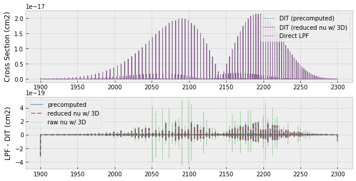
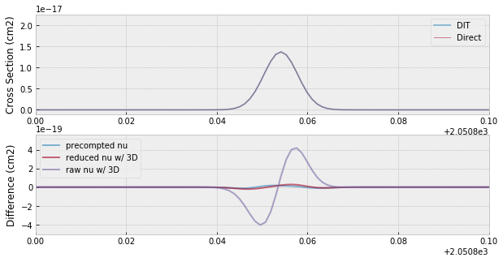

Cross Section for Many Lines using DIT
==================================================================================================

We demonstarte the `Discrete Integral Transform <https://www.sciencedirect.com/science/article/abs/pii/S0022407320310049>`_ (DIT) method proposed by
D.C.M van den Bekeroma and E.Pannier. DIT takes advantage especially for
the case that the number of the molecular line is large (typically >
10,000). We here compare the results by DIT with the direct computation
(LPF).

.. code:: ipython3

    import numpy as np
    import seaborn as sns
    import matplotlib.pyplot as plt
    import jax.numpy as jnp
    plt.style.use('bmh')

.. parsed-literal::

    /home/kawahara/anaconda3/lib/python3.7/site-packages/statsmodels/tools/_testing.py:19: FutureWarning: pandas.util.testing is deprecated. Use the functions in the public API at pandas.testing instead.
      import pandas.util.testing as tm

.. code:: ipython3

    from exojax.spec.hitran import SijT, doppler_sigma, gamma_hitran, gamma_natural
    from exojax.spec import moldb
    
    # Setting wavenumber bins and loading HITRAN database
    nus=np.linspace(1900.0,2300.0,350000,dtype=np.float64) 
    mdbCO=moldb.MdbHit('05_hit12.par',nus)
    
    # set T, P and partition function
    Mmol=28.01 # molecular weight
    Tfix=1000.0 # we assume T=1000K
    Pfix=1.e-3 # we compute P=1.e-3 bar
    Ppart=Pfix #partial pressure of CO. here we assume a 100% CO atmosphere.
    qt=mdbCO.Qr_layer_HAPI([Tfix])[0]
    
    # compute Sij, gamma_L, sigmaD 
    Sij=SijT(Tfix,mdbCO.logsij0,mdbCO.nu_lines,mdbCO.elower,qt)
    gammaL = gamma_hitran(Pfix,Tfix, Ppart, mdbCO.n_air, \
                          mdbCO.gamma_air, mdbCO.gamma_self) \
    + gamma_natural(mdbCO.A)
    sigmaD=doppler_sigma(mdbCO.nu_lines,Tfix,Mmol)

DIT uses a grid of sigmaD, gammaL, and wavenumber. set_ditgrid makes a
1D grid for sigmaD and gamma.

.. code:: ipython3

    from exojax.spec.dit import set_ditgrid
    sigmaD_grid=set_ditgrid(sigmaD)
    gammaL_grid=set_ditgrid(gammaL)
    
    # we can change the resolution using res option
    #sigmaD_grid=set_ditgrid(sigmaD,res=0.1)
    #gammaL_grid=set_ditgrid(gammaL,res=0.1)

.. code:: ipython3

    #show the grids
    plt.plot(sigmaD,gammaL,".")
    for i in sigmaD_grid:
        plt.axvline(i,lw=1,alpha=0.5,color="C1")
    for i in gammaL_grid:
        plt.axhline(i,lw=1,alpha=0.5,color="C1")

.. image:: DITxs/output_6_0.png

For DIT in exojax, we also need to specify Nfold and precompute
“dLarray”. The aliasing effect may results in some negative values in
the computed cross section, in particular, when the grid resolution is
comparable or smaller than to the line width. We can avoid this effect
by including the aliased part of the distribution. Nfold is the number
of aliasing to be included. dLarray is just a list (1,2,3,…,Nfold)/dnu,
where dnu is the wavenumber interval. We can use dit.make_dLarray to
compute dLarray.

I note that the concept of "folding" can be understood in a deeper level by reading `the discussion <https://github.com/radis/radis/issues/186#issuecomment-764465580>`_ by D.C.M van den Bekeroma.

.. code:: ipython3

    from exojax.spec.dit import make_dLarray
    Nfold=1
    dnu=nus[1]-nus[0]
    dLarray=make_dLarray(Nfold,dnu)

For the wavenumber grid, we need to be careful for the truncation error.
One of the conservative ways is to use numpy.float64 for the computation
For this case, npnc1D (=numpy neibouring contribution 1D) is used to
prepare a precomputed grid using numpy.float64. Then, dit.xsvector can
use to compute the cross section. But, this is a bit time-consuming.

.. code:: ipython3

    from exojax.spec.dit import xsvector, npnc1D
    nu_ncf=npnc1D(mdbCO.nu_lines,nus) #precompute NC for wavenumber
    xs=xsvector(nu_ncf,sigmaD,gammaL,Sij,nus,sigmaD_grid,gammaL_grid,dLarray)

.. parsed-literal::

    100%|██████████| 350000/350000 [00:05<00:00, 66588.59it/s]

Instead, we can compute a 3D grid for sigmaD,gammaL, wavenumber,
simultaneously, using dit.xsvector3D. In this case, we should be
careful. Here, we subtract large number from both wavenumber grids and
line centers to avoid the truncatino error. This is faster than
precomputed NCF.

.. code:: ipython3

    #If you want to compute nu in JAX/GPU, be careful for the precision of wavenumber.
    #reduce the digit 
    from exojax.spec.dit import xsvector3D
    dfnus=nus-np.median(nus) #remove median
    dfnu_lines=mdbCO.nu_lines-np.median(nus) #remove median
    xs3D=xsvector3D(dfnu_lines,sigmaD,gammaL,Sij,dfnus,sigmaD_grid,gammaL_grid,dLarray)

To see the effect of the truncation error, we also here compute the
cross section using the raw wavenumber and line center

.. code:: ipython3

    #This may lead a large error
    xs_bad=xsvector3D(mdbCO.nu_lines,sigmaD,gammaL,Sij,nus,sigmaD_grid,gammaL_grid,dLarray)

Also, we here try the direct computation using LPF for the comparison
purpose

.. code:: ipython3

    from exojax.spec import xsection
    xsv=xsection(nus,mdbCO.nu_lines,sigmaD,gammaL,Sij,memory_size=30) 

.. parsed-literal::

    100%|██████████| 63/63 [00:01<00:00, 32.43it/s]

The difference is <~ 1%.

.. code:: ipython3

    fig=plt.figure(figsize=(10,5))
    ax=fig.add_subplot(211)
    plt.plot(nus,xs,lw=1,alpha=0.5,label="DIT (precomputed)")
    plt.plot(nus,xs3D,lw=1,alpha=0.5,label="DIT (reduced nu w/ 3D)")
    plt.plot(nus,xsv,lw=1,alpha=0.5,label="Direct LPF")
    plt.legend(loc="upper right")
    plt.ylabel("Cross Section (cm2)")
    ax=fig.add_subplot(212)
    plt.plot(nus,xsv-xs,lw=2,alpha=0.5,label="precomputed")
    plt.plot(nus,xsv-xs3D,lw=2,alpha=0.5,ls="dashed",label="reduced nu w/ 3D")
    plt.plot(nus,xsv-xs_bad,lw=1,alpha=0.5,ls="dotted",color="green",label="raw nu w/ 3D")
    plt.ylabel("LPF - DIT (cm2)")
    plt.legend(loc="upper left")
    plt.show()

But, the use of the raw wavenumber for 3D exhibits larger errors

.. code:: ipython3

    fig=plt.figure(figsize=(10,5))
    ax=fig.add_subplot(211)
    plt.plot(nus,xs,lw=2,alpha=0.5,label="DIT")
    plt.plot(nus,xsv,lw=1,alpha=0.5,label="Direct")
    plt.legend(loc="upper right")
    plt.xlim(2050.8,2050.9)
    plt.ylabel("Cross Section (cm2)")
    ax=fig.add_subplot(212)
    plt.plot(nus,xsv-xs,lw=2,alpha=0.6,label="precompted nu")
    plt.plot(nus,xsv-xs3D,lw=2,alpha=0.6,label="reduced nu w/ 3D")
    plt.plot(nus,xsv-xs_bad,lw=2,alpha=0.6,label="raw nu w/ 3D")
    plt.legend(loc="upper left")
    plt.ylabel("Difference (cm2)")
    plt.xlim(2050.8,2050.9)
    #plt.yscale("log")
    plt.savefig("fine_grid.png")

