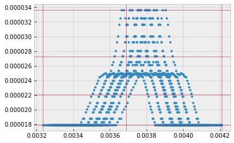

Cross Section using DIT
==================================================================================================
*Update: July 11/2021, Hajime Kawahara*

We demonstarte the `Discrete Integral Transform <https://www.sciencedirect.com/science/article/abs/pii/S0022407320310049>`_ (DIT) method proposed by
D.C.M van den Bekeroma and E.Pannier. DIT takes advantage especially for
the case that the number of the molecular line is large (typically >
10,000). We here compare the results by DIT with the direct computation
(LPF).

.. code:: ipython3

    import numpy as np
    import seaborn as sns
    import matplotlib.pyplot as plt
    import jax.numpy as jnp
    plt.style.use('bmh')

.. code:: ipython3

    from exojax.spec.hitran import SijT, doppler_sigma, gamma_hitran, gamma_natural
    from exojax.spec import moldb
    
    # Setting wavenumber bins and loading HITRAN database
    nus=np.linspace(1900.0,2300.0,350000,dtype=np.float64) 
    mdbCO=moldb.MdbHit('05_hit12.par',nus)
    
    # set T, P and partition function
    Mmol=28.01 # molecular weight
    Tfix=1000.0 # we assume T=1000K
    Pfix=1.e-3 # we compute P=1.e-3 bar
    Ppart=Pfix #partial pressure of CO. here we assume a 100% CO atmosphere.
    qt=mdbCO.qr_interp_lines(Tfix)
    
    # compute Sij, gamma_L, sigmaD 
    Sij=SijT(Tfix,mdbCO.logsij0,mdbCO.nu_lines,mdbCO.elower,qt)
    gammaL = gamma_hitran(Pfix,Tfix, Ppart, mdbCO.n_air, \
                          mdbCO.gamma_air, mdbCO.gamma_self) \
    + gamma_natural(mdbCO.A)
    sigmaD=doppler_sigma(mdbCO.nu_lines,Tfix,Mmol)

DIT uses a grid of sigmaD, gammaL, and wavenumber. ditgrid_log_interval makes a 1D grid for sigmaD and gamma.

.. code:: ipython3

    from exojax.spec.set_ditgrid import ditgrid_log_interval
    sigmaD_grid=ditgrid_log_interval(sigmaD)
    gammaL_grid=ditgrid_log_interval(gammaL)
    
    # we can change the resolution using res option
    #sigmaD_grid=ditgrid_log_interval(sigmaD,dit_grid_resolution=0.1)
    #gammaL_grid=ditgrid_log_interval(gammaL,dit_grid_resolution=0.1)

.. code:: ipython3

    #show the grids
    plt.plot(sigmaD,gammaL,".")
    for i in sigmaD_grid:
        plt.axvline(i,lw=1,alpha=0.5,color="C1")
    for i in gammaL_grid:
        plt.axhline(i,lw=1,alpha=0.5,color="C1")

We need to precompute the contribution for wavenumber and pmarray. These
can be computed using `init_dit <../exojax/exojax.spec.html#exojax.spec.initspec.init_dit>`_:

.. code:: ipython3
    
    from exojax.spec import initspec
    cnu,indexnu,pmarray=initspec.init_dit(mdbCO.nu_lines,nus)

Then, you can compute the cross section as
    
.. code:: ipython3
    
    from exojax.spec.dit import xsvector
    xs=xsvector(cnu,indexnu,pmarray,sigmaD,gammaL,Sij,nus,sigmaD_grid,gammaL_grid)

