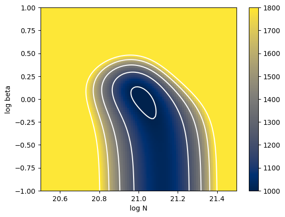

Why Differentiable Spectral Modeling?
=====================================

Last Update: January 19th (2025) Hajime Kawahara

`ExoJAX <https://github.com/HajimeKawahara/exojax>`__ is a
differentiable spectral model written in
`JAX <https://jax.readthedocs.io/en/latest/>`__. Here, we aim to provide
a brief introduction to what can be achieved with differentiable models
for users who may not be familiar with `Differentiable
Programming <https://arxiv.org/abs/2403.14606>`__ (DP).

Here, as the simplest example of a spectrum, we use an absorption
spectrum consisting of a single hypothetical absorption line of a
molecule X. This absorption line follows a Voigt profile, characterized
by a line profile centered at ``nu0`` , determined by the
temperature-dependent core width ``beta`` and the temperature- and
pressure-dependent wing width ``gamma`` . The cross-section is given as
follows:

.. code:: ipython3

    import jax.numpy as jnp
    import matplotlib.pyplot as plt
    from exojax.spec import voigt
    
    beta = 1.0
    gamma = 1.0
    line_strength = 1.e-20 #cm2
    nu0 = 1000.0
    nu_grid = jnp.linspace(nu0-20,nu0+20,1000)
    
    
    sigma = line_strength*voigt(nu_grid - nu0,beta,gamma)
    
    plt.plot(nu_grid, sigma) 
    plt.xlabel("wavenumber (cm$^{-1}$)")
    plt.ylabel("cross section (cm$^2$)")

.. parsed-literal::

    Text(0, 0.5, 'cross section (cm$^2$)')

.. image:: Differentiable_Programming_files/Differentiable_Programming_4_1.png

When light with a flat spectrum $ f_0 $ passes through a region filled
with molecule X at a number density $ n $ over a path length $ L $, the
transmitted spectrum is given by $ f_0
:raw-latex:`\exp`(-:raw-latex:`\tau`\ *:raw-latex:`\nu`) $, where the
optical depth $ :raw-latex:`\tau`*\ :raw-latex:`\nu `= n L
:raw-latex:`\sigma`\ *:raw-latex:`\nu `$. Using the column density $ N =
n L $, this can be expressed as $f*\ :raw-latex:`\nu `= f_0
:raw-latex:`\exp{(-N \sigma_\nu )}` $.

.. code:: ipython3

    f0 = jnp.ones_like(nu_grid)
    n = 1.e17
    L = 1.e4
    N = n*L
    f = f0*jnp.exp(-sigma*N)
    
    plt.plot(nu_grid, f)
    plt.show()

.. image:: Differentiable_Programming_files/Differentiable_Programming_6_0.png

Observed spectra always contain statistical errors. Here, we simplify by
assuming wavenumber-independent Gaussian noise and add noise
accordingly.

.. code:: ipython3

    import numpy as np
    sigma_noise = 0.1
    np.random.seed(0)
    fobs = f + np.random.normal(0.0,sigma_noise,len(f))
    plt.plot(nu_grid, fobs, ".")
    plt.show()

.. image:: Differentiable_Programming_files/Differentiable_Programming_8_0.png

Now, what can a differentiable spectral model do with this observed
spectrum? Let’s first assume that ``gamma`` is known and focus on
estimating ``N`` and ``beta``.

.. code:: ipython3

    def fmodel(N,beta):
        gamma=1.0
        nu0 = 1000.0
        sigma = line_strength*voigt(nu_grid - nu0,beta,gamma)
        f = f0*jnp.exp(-sigma*N)
        return f

gradient-based optimization
---------------------------

In a differentiable spectral model, gradient-based optimization is
possible. Specifically, when $ :raw-latex:`\chi`^2 $ is expressed as a
function of ``N`` (normalized by 1e21) and ``beta``, we can compute the
gradients of $ :raw-latex:`\chi`^2 $ with respect to ``N`` and ``beta``.
This allows us to determine the next step that minimizes
$:raw-latex:`\chi`^2 $, following the same principle as descending along
the slope of a hill toward the valley bottom.

.. code:: ipython3

    def chi2_fmodel(logN,logbeta):
        """differentiable chi2 function
        Args:
            logN (float): log surface density
            logbeta (float): log beta
    
        Returns:
            float: chi2
        """
        f = fmodel(10**logN,10**logbeta)
        return jnp.sum((f-fobs)**2/sigma_noise**2)

.. code:: ipython3

    Narray = jnp.linspace(20.5,21.5,100)
    betaarray = jnp.linspace(-1,1,100)
    
    from jax import vmap
    vmapchi2 = vmap(vmap(chi2_fmodel,(0,None),0),(None,0),0)
    chi2arr = vmapchi2(Narray,betaarray)
    
    a = plt.imshow(chi2arr[::-1,:], extent=(Narray[0], Narray[-1], betaarray[0], betaarray[-1]), aspect='auto', cmap='cividis', vmin=1000, vmax=1800)
    cb = plt.colorbar(a)
    plt.contour( Narray, betaarray, chi2arr, levels=[1000,1200,1400,1600,1800], colors='white')
    plt.xlabel("log N")
    plt.ylabel("log beta")

.. parsed-literal::

    Text(0, 0.5, 'log beta')

The key point here is that the $ :raw-latex:`\chi`^2 $ defined using a
differentiable spectral model is itself differentiable with respect to
the parameters.

.. code:: ipython3

    from jax import grad
    dchi2 = grad(chi2_fmodel,argnums=(0,1))
    logNinit = 20.75
    logbetainit = 0.5
    dchi2(logNinit,logbetainit)

.. parsed-literal::

    (Array(-5780.8774, dtype=float32, weak_type=True),
     Array(4569.641, dtype=float32, weak_type=True))

