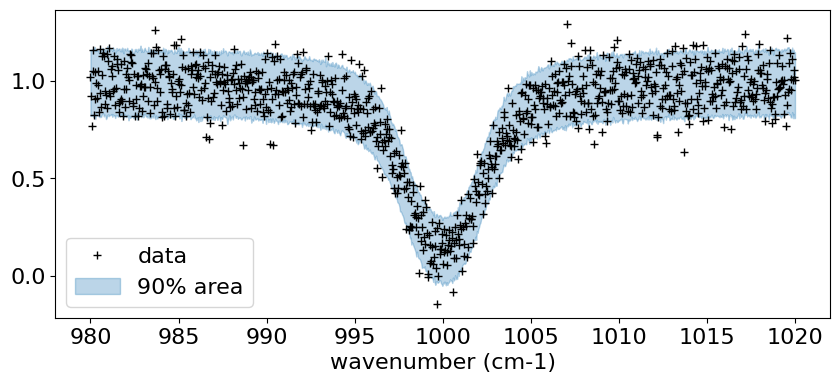

Why Differentiable Spectral Modeling?
=====================================

Last Update: Febrary 4th (2025) Hajime Kawahara

`ExoJAX <https://github.com/HajimeKawahara/exojax>`__ is a
differentiable spectral model written in
`JAX <https://jax.readthedocs.io/en/latest/>`__. Here, we aim to provide
a brief introduction to what can be achieved with differentiable models
for users who may not be familiar with `Differentiable
Programming <https://arxiv.org/abs/2403.14606>`__ (DP).

Here, as the simplest example of a spectrum, we use an absorption
spectrum consisting of a single hypothetical absorption line of a
molecule X. This absorption line follows a Voigt profile, characterized
by a line profile centered at ``nu0`` , determined by the
temperature-dependent core width ``beta`` and the temperature- and
pressure-dependent wing width ``gamma`` . The cross-section is given as
follows:

.. code:: ipython3

    import jax.numpy as jnp
    import matplotlib.pyplot as plt
    from exojax.spec import voigt
    
    logbeta = 1.0
    gamma = 1.0
    line_strength = 1.e-20 #cm2
    nu0 = 1000.0
    nu_grid = jnp.linspace(nu0-20,nu0+20,1000)
    
    sigma = line_strength*voigt(nu_grid - nu0,logbeta,gamma)
    
    plt.plot(nu_grid, sigma) 
    plt.xlabel("wavenumber (cm$^{-1}$)")
    plt.ylabel("cross section (cm$^2$)")

.. parsed-literal::

    Text(0, 0.5, 'cross section (cm$^2$)')

.. image:: Differentiable_Programming_files/Differentiable_Programming_4_1.png

When light with a flat spectrum :math:`f_0` passes through a region
filled with molecule X at a number density :math:`n` over a path length
:math:`L`, the transmitted spectrum is given by
:math:`f_0 \exp(-\tau_\nu)`, where the optical depth
:math:`\tau_\nu = n L \sigma_\nu`. Using the column density
:math:`N = n L`, this can be expressed as
:math:`f_\nu = f_0 \exp{(-N \sigma_\nu )}`.

.. code:: ipython3

    f0 = jnp.ones_like(nu_grid)
    n = 1.e17
    L = 1.e4
    logN = n*L
    f = f0*jnp.exp(-sigma*logN)
    
    plt.plot(nu_grid, f)
    plt.show()

.. image:: Differentiable_Programming_files/Differentiable_Programming_6_0.png

Observed spectra always contain statistical errors. Here, we simplify by
assuming wavenumber-independent Gaussian noise and add noise
accordingly.

.. code:: ipython3

    import numpy as np
    sigma_noise = 0.1
    np.random.seed(72)
    fobs = f + np.random.normal(0.0,sigma_noise,len(f))
    plt.plot(nu_grid, fobs, ".",alpha=0.3)
    plt.show()

Now, what can a differentiable spectral model do with this observed
spectrum? Let’s first assume that ``gamma`` is known and focus on
estimating ``N`` and ``beta``.

.. code:: ipython3

    def fmodel(N,beta):
        gamma=1.0
        nu0 = 1000.0
        sigma = line_strength*voigt(nu_grid - nu0,beta,gamma)
        f = f0*jnp.exp(-sigma*N)
        return f

Gradient-based Optimization
---------------------------

In a differentiable spectral model, gradient-based optimization is
possible. Specifically, when :math:`\chi^2` is expressed as a function
of ``N`` (normalized by 1e21) and ``beta``, we can compute the gradients
of :math:`\chi^2` with respect to ``N`` and ``beta``. This allows us to
determine the next step that minimizes :math:`\chi^2`, following the
same principle as descending along the slope of a hill toward the valley
bottom.

.. code:: ipython3

    def chi2_fmodel(params):
        """differentiable chi2 function
        Args:
            params: logN (float), log surface density, logbeta (float), log beta
    
        Returns:
            float: chi2
        """
        logN, logbeta = params
        f = fmodel(10**logN,10**logbeta)
        return jnp.sum((f-fobs)**2/sigma_noise**2)

Here, let’s first check the distribution of :math:`\chi^2`. However,
this is only feasible because the parameter space is two-dimensional in
this case. In general, such an approach would be challenging.

.. code:: ipython3

    Narray = jnp.linspace(20.5, 21.5, 100)
    betaarray = jnp.linspace(-1, 1, 100)
    
    
    # unpacks parameters
    def chi2_fmodel_unpackpar(logN, logbeta):
        return chi2_fmodel(jnp.array([logN, logbeta]))
    
    
    from jax import vmap
    
    vmapchi2 = vmap(vmap(chi2_fmodel_unpackpar, (0, None), 0), (None, 0), 0)
    chi2arr = vmapchi2(Narray, betaarray)
    
    a = plt.imshow(
        chi2arr[::-1, :],
        extent=(Narray[0], Narray[-1], betaarray[0], betaarray[-1]),
        aspect="auto",
        cmap="cividis",
        vmin=1000,
        vmax=1800,
    )
    cb = plt.colorbar(a)
    levels = [1000, 1200, 1400, 1600, 1800, 2000]
    plt.contour(Narray, betaarray, chi2arr, levels=levels, colors="white")
    plt.xlabel("log N")
    plt.ylabel("log beta")

.. parsed-literal::

    Text(0, 0.5, 'log beta')

The key point here is that the :math:`\chi^2` defined using a
differentiable spectral model is itself differentiable with respect to
the parameters.

.. code:: ipython3

    from jax import grad
    dchi2 = grad(chi2_fmodel)
    logNinit = 20.75
    logbetainit = 0.5
    params_init = jnp.array([logNinit,logbetainit])
    dchi2(params_init)

.. parsed-literal::

    Array([-5261.481 ,  4553.8516], dtype=float32)

Let’s perform gradient-based optimization using the (differentiable)
:math:`\chi^2` as the cost function. The simplest gradient optimization
method, steepest gradient descent, starts from an initial value and
updates the parameters in the negative gradient direction. The step size
:math:`\eta` determines the magnitude of each update step.

:math:`{\bf p}_n = {\bf p}_{n-1} - \eta \left( \frac{ d {\bf \chi^2}}{d {\bf p}} \right)_{n-1}`

.. code:: ipython3

    eta = 1.e-5
    Nstep = 30 
    params = jnp.copy(params_init)
    trajectory = []
    for i in range(Nstep):
        trajectory.append(params)
        params = params - eta*dchi2(params)
    
    trajectory = jnp.array(trajectory)
        

Let’s plot the trajectory of parameter updates using the steepest
gradient descent method. You can observe the parameters being updated
toward the local minimum. It’s interesting to experiment with different
values of :math:`\eta`. If :math:`\eta` is too large, the updates
overshoot and oscillate across the valley, while if it’s too small, the
descent toward the minimum becomes very slow. However, with an
appropriate step size, the optimization proceeds efficiently.

.. code:: ipython3

    def plot_trajectory(trajectory):
        plt.contour(
        Narray,
        betaarray,
        chi2arr,
        levels=levels,
        colors="gray",
    )
        plt.xlabel("log N")
        plt.ylabel("log beta")
        plt.plot(trajectory[:, 0], trajectory[:, 1], ".", color="C1")
        plt.plot(trajectory[:, 0], trajectory[:, 1], color="C1", alpha=0.3)
        for i in range(5):
            plt.text(trajectory[i, 0], trajectory[i, 1], str(i), fontsize=8, color="green")
    
    plot_trajectory(trajectory)

In JAX, `various gradient optimization
techniques <https://optax.readthedocs.io/en/latest/api/optimizers.html>`__
can be easily implemented using
`Optax <https://optax.readthedocs.io/en/latest/index.html>`__. Here,
we’ll use one of the commonly used optimizers, ADAM, to find the
parameters that minimize (or more precisely, locally minimize)
:math:`\chi^2`.

.. code:: ipython3

    import optax
    
    solver = optax.adam(learning_rate=0.02)
    opt_state = solver.init(params_init)
    Nstep = 30
    params = jnp.copy(params_init)
    
    trajectory_adam = []
    for i in range(Nstep):
        trajectory_adam.append(params)
        grad = dchi2(params)
        updates, opt_state = solver.update(grad, opt_state, params)
        params = optax.apply_updates(params, updates)
    
    plot_trajectory(jnp.array(trajectory_adam))    

Using the updated parameters to predict the spectrum results in the
following:

.. code:: ipython3

    
    plt.plot(nu_grid, fobs, ".", alpha=0.3)
    plt.plot(nu_grid, fmodel(10**params[0],10**params[1]), color="C0")
    plt.show()

MCMC sampling using HMC-NUTS
----------------------------

Formal Explanation of HMC-NUTS

Hamiltonian Monte Carlo (HMC) is a Markov Chain Monte Carlo (MCMC)
technique designed to efficiently sample from complex posterior
distributions, often encountered in Bayesian inference. Unlike simpler
methods such as Metropolis-Hastings or Gibbs sampling, HMC leverages
concepts from physics, specifically Hamiltonian dynamics, to guide the
sampling process. By introducing an auxiliary momentum variable and
simulating the system’s energy-conserving trajectories, HMC is able to
make larger, more informed proposals in the parameter space, thereby
reducing the autocorrelation in the samples and improving the overall
efficiency. This can be particularly helpful in high-dimensional
inference problems common in astronomy (e.g., inferring orbital
parameters of multiple exoplanets), where naive random-walk behavior can
lead to very slow convergence.

The No-U-Turn Sampler (NUTS) is an extension of HMC that addresses a
practical challenge: choosing the trajectory length (i.e., how long the
Hamiltonian system is simulated before making a new proposal). Picking
this length by hand can be difficult and problem-dependent. NUTS
automatically determines how far to run the Hamiltonian dynamics in each
iteration by building a balanced tree of possible trajectories and
stopping when it detects a “U-turn” in the parameter space, indicating
that further exploration would start retracing its path. This adaptation
helps ensure that you sample efficiently without requiring manual tuning
of trajectory lengths. In practice, many modern Bayesian software
packages (like Stan, PyMC, and Numpyro) implement NUTS by default, which
makes it widely accessible for astronomers who need robust sampling
methods for their complex models.

The formal explanation of HMC-NUTS above was generated by ChatGPT o1
(sorry)! In essence, HMC-NUTS is the de facto standard MCMC method in
Bayesian statistics. To sample using HMC-NUTS, the model must be
differentiable, and the models we’ve written so far are, of course,
differentiable. To apply HMC-NUTS to models written in JAX, libraries
such as NumPyro and BlackJAX can be used. Here, we’ll use NumPyro.

.. code:: ipython3

    from numpyro.infer import MCMC, NUTS
    import numpyro
    import numpyro.distributions as dist
    from jax import random

.. code:: ipython3

    def model(y):
        logN = numpyro.sample('logN', dist.Uniform(20.5, 21.5))
        logbeta = numpyro.sample('logbeta', dist.Uniform(-1, 1))
        sigmain = numpyro.sample('sigmain', dist.Exponential(10.0))
        N = 10**logN
        beta = 10**logbeta
        mu = fmodel(N,beta)
        numpyro.sample('y', dist.Normal(mu, sigmain), obs=y)

.. code:: ipython3

    rng_key = random.PRNGKey(0)
    rng_key, rng_key_ = random.split(rng_key)
    num_warmup, num_samples = 1000, 2000
    kernel = NUTS(model)
    mcmc = MCMC(kernel, num_warmup=num_warmup, num_samples=num_samples)
    mcmc.run(rng_key_, y=fobs)
    mcmc.print_summary()

.. parsed-literal::

    sample: 100%|██████████| 3000/3000 [00:08<00:00, 361.90it/s, 3 steps of size 6.79e-01. acc. prob=0.91] 

.. parsed-literal::

    
                    mean       std    median      5.0%     95.0%     n_eff     r_hat
          logN     20.99      0.01     20.99     20.97     21.01   1217.43      1.00
       logbeta      0.01      0.03      0.02     -0.03      0.06   1406.41      1.00
       sigmain      0.10      0.00      0.10      0.10      0.11   1592.57      1.00
    
    Number of divergences: 0

.. parsed-literal::

    

.. code:: ipython3

    import arviz
    from numpyro.diagnostics import hpdi
    from numpyro.infer import Predictive

.. code:: ipython3

    # SAMPLING
    posterior_sample = mcmc.get_samples()
    pred = Predictive(model, posterior_sample, return_sites=['y'])
    predictions = pred(rng_key_, y=None)
    median_mu1 = jnp.median(predictions['y'], axis=0)
    hpdi_mu1 = hpdi(predictions['y'], 0.9)

.. code:: ipython3

    # PLOT
    fig, ax = plt.subplots(nrows=1, ncols=1, figsize=(10, 4))
    #ax.plot(nu_grid, median_mu1, color='C0')
    ax.plot(nu_grid, fobs, '+', color='black', label='data')
    ax.fill_between(nu_grid,
                    hpdi_mu1[0],
                    hpdi_mu1[1],
                    alpha=0.3,
                    interpolate=True,
                    color='C0',
                    label='90% area')
    
    plt.xlabel('wavenumber (cm-1)', fontsize=16)
    plt.legend(fontsize=16)
    plt.tick_params(labelsize=16)
    plt.show()

.. code:: ipython3

    pararr = ["logN", "logbeta", "sigmain"]
    arviz.plot_pair(
        arviz.from_numpyro(mcmc),
        kind="kde",
        divergences=False,
        marginals=True,
        reference_values={"logN": 21.0, "logbeta": 0.0, "sigmain": 0.1},
    )

.. parsed-literal::

    array([[<Axes: ylabel='logN'>, <Axes: >, <Axes: >],
           [<Axes: ylabel='logbeta'>, <Axes: >, <Axes: >],
           [<Axes: xlabel='logN', ylabel='sigmain'>,
            <Axes: xlabel='logbeta'>, <Axes: xlabel='sigmain'>]], dtype=object)

Here, we used a simple absorption line spectrum, so the HMC execution
time should be within a few seconds to a few minutes. ExoJAX can compute
**emission spectra, reflection spectra, and transmission spectra** from
atmospheric layers, all of which are differentiable and can be used for
Bayesian analysis with HMC, just like in this example.

For more details, please start by referring to `Getting Started
Guide <get_started.html>`__.

When the model is differentiable, inference methods other than HMC that
utilize gradients are also possible. Next, as an example, let’s try
Stochastic Variational Inference (SVI).

.. code:: ipython3

    from numpyro.infer import SVI
    from numpyro.infer import Trace_ELBO
    import numpyro.optim as optim
    from numpyro.infer.autoguide import AutoMultivariateNormal
    
    guide = AutoMultivariateNormal(model)
    optimizer = optim.Adam(0.01)
    svi = SVI(model, guide, optimizer, loss=Trace_ELBO())

SVI is faster compared to HMC.

.. code:: ipython3

    num_steps = 10000
    rng_key = random.PRNGKey(0)
    rng_key, rng_key_run = random.split(rng_key)
    svi_result = svi.run(rng_key_run, num_steps, y=fobs)

.. parsed-literal::

    100%|██████████| 10000/10000 [00:04<00:00, 2037.36it/s, init loss: -102.3971, avg. loss [9501-10000]: -840.5520]

.. code:: ipython3

    params = svi_result.params
    predictive_posterior = Predictive(
        model,
        guide=guide,
        params=params,
        num_samples=2000,
        return_sites=pararr,
    )
    posterior_sample = predictive_posterior(rng_key, y=None)

Let’s compare the posterior distributions of **HMC (orange)** and **SVI
(green)**.

.. code:: ipython3

    import arviz
    idata = arviz.from_dict(posterior=posterior_sample)
    
    axes = arviz.plot_pair(
        arviz.from_numpyro(mcmc),
        var_names=pararr,
        kind="kde",
        marginals=True,
        show=False,
        kde_kwargs={"contourf_kwargs":{"cmap":"plasma","alpha":0.5},"contour_kwargs":{"alpha":0}},
        marginal_kwargs={"color":"orange"},
    )
    axes2 = arviz.plot_pair(
        idata,
        ax = axes,
        var_names=pararr,
        kind="kde",
        marginals=True,
        show=False,
        reference_values={"logN": 21.0, "logbeta": 0.0, "sigmain": 0.1},
        kde_kwargs={"contourf_kwargs":{"alpha":0.5,"cmap":"viridis"}, "contour_kwargs":{"alpha":0}},
        marginal_kwargs={"color":"green"}
    )
    plt.show()

Please refer to the `SVI getting started
guide <get_started_svi.html>`__.

Here, we introduced both HMC and SVI, but inference methods that do not
rely on differentiation, such as Nested Sampling, are also efficient
thanks to JAX’s XLA acceleration. See `this
guide <get_started_ns.html>`__ for more details.

Conclusion
~~~~~~~~~~

In summary, differentiable models greatly expand the possibilities for
retrieval inference!

