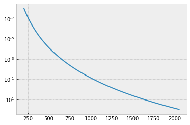
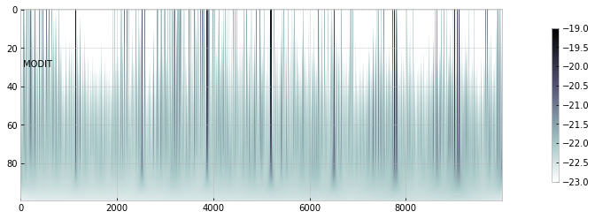
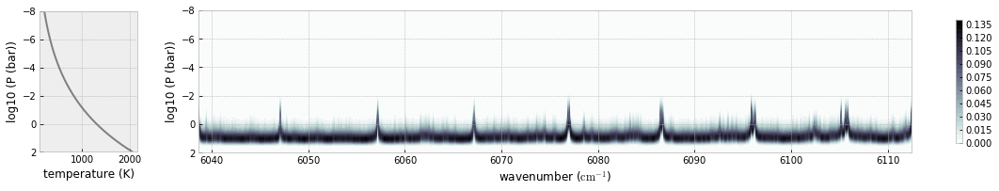
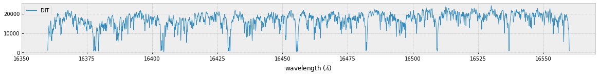
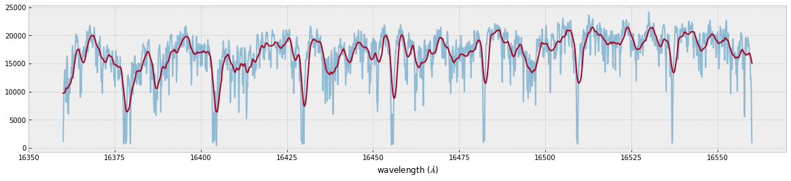

Forward Modeling of CH4 emission 
=================================================================================
*Update: July 17/2021, Hajime Kawahara*

.. code:: ipython3

    from exojax.spec import rtransfer as rt
    from exojax.spec import dit, modit
    from exojax.spec import lpf

.. code:: ipython3

    #ATMOSPHERE                                                                     
    NP=100
    T0=1295.0 #K
    Parr, dParr, k=rt.pressure_layer(NP=NP)
    Tarr = T0*(Parr)**0.1

A T-P profile we assume is …

.. code:: ipython3

    import matplotlib.pyplot as plt
    plt.style.use('bmh')
    plt.plot(Tarr,Parr)
    plt.yscale("log")
    plt.gca().invert_yaxis()
    plt.show()

We set a wavenumber grid using nugrid.

.. code:: ipython3

    from exojax.spec.rtransfer import nugrid
    nus,wav,R=nugrid(16360,16560,10000,unit="AA",xsmode="modit")

.. parsed-literal::

    nugrid is log: mode= modit

Loading a molecular database of CH4 and CIA (H2-H2)…

.. code:: ipython3

    from exojax.spec import moldb, contdb
    mdbCH4=moldb.MdbExomol('.database/CH4/12C-1H4/YT10to10/',nus,crit=1.e-30)
    cdbH2H2=contdb.CdbCIA('.database/H2-H2_2011.cia',nus)

.. parsed-literal::

    Background atmosphere:  H2
    Reading transition file
    .broad is used.
    Broadening code level= a1
    default broadening parameters are used for  12  J lower states in  29  states
    H2-H2

So many lines we have....

.. code:: ipython3

    len(mdbCH4.A)

.. parsed-literal::

    140031

.. code:: ipython3

    from exojax.spec import molinfo
    molmassCH4=molinfo.molmass("CH4")

Computing the relative partition function,

.. code:: ipython3

    from jax import vmap
    qt=vmap(mdbCH4.qr_interp)(Tarr)

Pressure and Natural broadenings

.. code:: ipython3

    from jax import jit
    from exojax.spec.exomol import gamma_exomol
    from exojax.spec import gamma_natural
    
    gammaLMP = jit(vmap(gamma_exomol,(0,0,None,None)))\
            (Parr,Tarr,mdbCH4.n_Texp,mdbCH4.alpha_ref)
    gammaLMN=gamma_natural(mdbCH4.A)
    gammaLM=gammaLMP+gammaLMN[None,:]

Doppler broadening

.. code:: ipython3

    from exojax.spec import normalized_doppler_sigma
    import numpy as np
    nsigmaDl=normalized_doppler_sigma(Tarr,molmassCH4,R)[:,np.newaxis]

And line strength

.. code:: ipython3

    from exojax.spec import SijT
    SijM=jit(vmap(SijT,(0,None,None,None,0)))\
        (Tarr,mdbCH4.logsij0,mdbCH4.nu_lines,mdbCH4.elower,qt)

.. code:: ipython3

    dv_lines=mdbCH4.nu_lines/R
    ngammaLM=gammaLM/dv_lines
    dv=nus/R

MODIT

.. code:: ipython3

    dgm_ngammaL=dit.dgmatrix(ngammaLM,0.2)

.. code:: ipython3

    #show the DIT grids 
    from exojax.plot.ditplot import plot_dgmn
    plot_dgmn(Parr,dgm_ngammaL,ngammaLM,0,6)

.. parsed-literal::

    2

.. image:: MODITch4/output_22_1.png

.. code:: ipython3

    Nfold=1

.. code:: ipython3

    from jax import jit
    import numpy as np
    dLarray=dit.make_dLarray(Nfold,1)
    # 3D version
    xsmmodit=modit.xsmatrix(mdbCH4.nu_lines-np.median(nus),nsigmaDl,ngammaLM,\
    SijM,nus-np.median(nus),dgm_ngammaL,dLarray,dv_lines,dv)

.. code:: ipython3

    import numpy as np
    fig=plt.figure(figsize=(20,4))
    ax=fig.add_subplot(111)
    c=plt.imshow(np.log10(xsmmodit),cmap="bone_r",vmin=-23,vmax=-19)
    plt.colorbar(c,shrink=0.8)
    plt.text(50,30,"MODIT")
    ax.set_aspect(0.4/ax.get_data_ratio())
    plt.show()

computing delta tau for CH4

.. code:: ipython3

    from exojax.spec.rtransfer import dtauM
    import jax.numpy as jnp
    Rp=0.88
    Mp=33.2
    g=2478.57730044555*Mp/Rp**2
    #g=1.e5 #gravity cm/s2
    MMR=0.0059 #mass mixing ratio
    
    # 0-padding for negative values
    xsmnp=np.array(xsmmodit)
    print(len(xsmnp[xsmnp<0.0]))
    xsmnp[xsmnp<0.0]=0.0
    xsmditc=jnp.array(xsmnp)
    #-------------------------------
    
    dtaum=dtauM(dParr,xsmditc,MMR*np.ones_like(Tarr),molmassCH4,g)

.. parsed-literal::

    0

computing delta tau for CIA

.. code:: ipython3

    from exojax.spec.rtransfer import dtauCIA
    mmw=2.33 #mean molecular weight
    mmrH2=0.74
    molmassH2=molinfo.molmass("H2")
    vmrH2=(mmrH2*mmw/molmassH2) #VMR
    dtaucH2H2=dtauCIA(nus,Tarr,Parr,dParr,vmrH2,vmrH2,\
                mmw,g,cdbH2H2.nucia,cdbH2H2.tcia,cdbH2H2.logac)

The total delta tau is a summation of them

.. code:: ipython3

    dtau=dtaum+dtaucH2H2

you can plot a contribution function using exojax.plot.atmplot

.. code:: ipython3

    from exojax.plot.atmplot import plotcf
    plotcf(nus,dtau,Tarr,Parr,dParr)
    plt.show()

radiative transfering…

.. code:: ipython3

    from exojax.spec import planck
    from exojax.spec.rtransfer import rtrun
    sourcef = planck.piBarr(Tarr,nus)
    F0=rtrun(dtau,sourcef)

.. code:: ipython3

    fig=plt.figure(figsize=(20,4))
    ax=fig.add_subplot(211)
    plt.plot(wav[::-1],F0,lw=1,label="DIT")
    plt.legend()
    plt.xlabel("wavelength ($\AA$)")
    plt.savefig("ch4.png")

MODIT uses ESLOG as the wavenunmber grid. We can directly apply the
response to the raw spectrum.

.. code:: ipython3

    from exojax.spec import response
    from exojax.utils.constants import c
    import jax.numpy as jnp
    
    wavd=jnp.linspace(16360,16560,1500) #observational wavelength grid
    nusd = 1.e8/wavd[::-1]
    
    RV=10.0 #RV km/s
    vsini=20.0 #Vsini km/s
    u1=0.0 #limb darkening u1
    u2=0.0 #limb darkening u2
    
    Rinst=100000.
    beta=c/(2.0*np.sqrt(2.0*np.log(2.0))*Rinst) #IP sigma need check 
    
    Frot=response.rigidrot(nus,F0,vsini,u1,u2)
    F=response.ipgauss_sampling(nusd,nus,Frot,beta,RV)

.. code:: ipython3

    fig=plt.figure(figsize=(20,4))
    plt.plot(wav[::-1],F0,alpha=0.5)
    plt.plot(wavd[::-1],F)
    plt.xlabel("wavelength ($\AA$)")
    plt.savefig("moditCH4.png")

