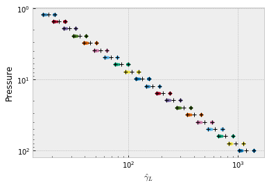
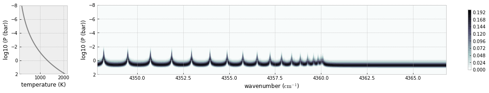
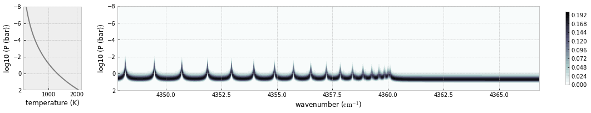
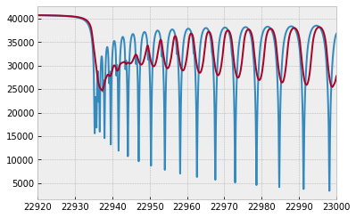

Forward Modelling of a Many Lines Spectrum using MODIT
======================================================
*Update: July 17/2021, Hajime Kawahara*

Here, we try to compute a emission spectrum using MODIT.

.. code:: ipython3

    from exojax.spec import rtransfer as rt
    from exojax.spec import dit, modit
    from exojax.spec import lpf
    import numpy as np
    import matplotlib.pyplot as plt
    plt.style.use('bmh')

.. code:: ipython3

    #ATMOSPHERE                                                                     
    NP=100
    T0=1295.0 #K
    Parr, dParr, k=rt.pressure_layer(NP=NP)
    Tarr = T0*(Parr)**0.1

We set a wavenumber grid using nugrid. Specify xsmode=“dit” though it is
not mandatory. DIT uses FFT, so the (internal) wavenumber grid should be
linear. But, you can also use a nonlinear grid. In this case, the
interpolation (jnp.interp) is used.

.. code:: ipython3

    from exojax.spec.rtransfer import nugrid
    nus,wav,R=nugrid(22900,23000,10000,unit="AA",xsmode="modit")

.. parsed-literal::

    nugrid is log: mode= modit

Loading a molecular database of CO and CIA (H2-H2)…

.. code:: ipython3

    from exojax.spec import moldb, contdb
    mdbCO=moldb.MdbExomol('.database/CO/12C-16O/Li2015',nus)
    cdbH2H2=contdb.CdbCIA('.database/H2-H2_2011.cia',nus)

.. parsed-literal::

    Background atmosphere:  H2
    Reading transition file
    .broad is used.
    Broadening code level= a0
    default broadening parameters are used for  71  J lower states in  152  states
    H2-H2

.. code:: ipython3

    from exojax.spec import molinfo
    molmassCO=molinfo.molmass("CO")

Computing the relative partition function,

.. code:: ipython3

    from jax import vmap
    qt=vmap(mdbCO.qr_interp)(Tarr)

Pressure and Natural broadenings

.. code:: ipython3

    from jax import jit
    from exojax.spec.exomol import gamma_exomol
    from exojax.spec import gamma_natural
    
    gammaLMP = jit(vmap(gamma_exomol,(0,0,None,None)))\
            (Parr,Tarr,mdbCO.n_Texp,mdbCO.alpha_ref)
    gammaLMN=gamma_natural(mdbCO.A)
    gammaLM=gammaLMP+gammaLMN[None,:]

MODIT uses the normalized gammaL.

.. code:: ipython3

    dv_lines=mdbCO.nu_lines/R
    ngammaLM=gammaLM/dv_lines
    
    dv=nus/R

normalized Doppler broadening is common for the lines, so we compute the
vector for the layers.

.. code:: ipython3

    from exojax.spec import normalized_doppler_sigma
    nsigmaDl=normalized_doppler_sigma(Tarr,molmassCO,R)[:,np.newaxis]

And line strength

.. code:: ipython3

    from exojax.spec import SijT
    SijM=jit(vmap(SijT,(0,None,None,None,0)))\
        (Tarr,mdbCO.logsij0,mdbCO.nu_lines,mdbCO.elower,qt)

MODIT requires the grids of ngammaL, and wavenumber. For the emission
spectrum, this grids should be prepared for each layer. dit.dgmatrix can
compute these grids.

.. code:: ipython3

    dgm_ngammaL=dit.dgmatrix(ngammaLM)
    #you can change the resolution 
    #dgm_gammaL=dit.dgmatrix(ngammaLM,res=0.1)

We can check how the grids are set for each layers using
plot.ditplot.plot_dgm

.. code:: ipython3

    #show the DIT grids 
    from exojax.plot.ditplot import plot_dgmn
    plot_dgmn(Parr,dgm_ngammaL,ngammaLM,80,100)

.. parsed-literal::

    /home/kawahara/anaconda3/lib/python3.7/site-packages/statsmodels/tools/_testing.py:19: FutureWarning: pandas.util.testing is deprecated. Use the functions in the public API at pandas.testing instead.
      import pandas.util.testing as tm

.. parsed-literal::

    3

We need to specify Nfold. But, I do not want to check Nfold for each
layer.

.. code:: ipython3

    #
    Nfold=1

For MODIT in exojax, we also need to precompute “dLarray”. The aliasing
effect may results in some negative values in the computed cross
section, in particular, when the grid resolution is comparable or
smaller than to the line width. We can avoid this effect by including
the aliased part of the distribution. Nfold is the number of aliasing to
be included. dLarray is just a list (1,2,3,…,Nfold), where dnu is the
wavenumber interval. We can use dit.make_dLarray to compute dLarray.

.. code:: ipython3

    dLarray=dit.make_dLarray(Nfold,1)

We can compute a 2D grid for ngammaL, wavenumber, simultaneously, using
modit.xsvector. We should be careful for the truncation error of
wavenumber. Here, we subtract large number from both wavenumber grids
and line centers to avoid the truncatino error.

.. code:: ipython3

    xsmmodit=modit.xsmatrix(mdbCO.nu_lines-np.median(nus),nsigmaDl,ngammaLM,\
    SijM,nus-np.median(nus),dgm_ngammaL,dLarray,dv_lines,dv)

We also compute the cross section using the direct computation (LPF) for
the comparison purpose.

.. code:: ipython3

    #direct LPF for comparison
    
    #we need sigmaDM for LPF
    from exojax.spec import doppler_sigma
    sigmaDM=jit(vmap(doppler_sigma,(None,0,None)))\
            (mdbCO.nu_lines,Tarr,molmassCO)
    
    from exojax.spec import make_numatrix0
    from exojax.spec.lpf import xsmatrix
    numatrix=make_numatrix0(nus,mdbCO.nu_lines)
    xsmdirect=xsmatrix(numatrix,sigmaDM,gammaLM,SijM)

Let’s see the cross section matrix!

.. code:: ipython3

    import numpy as np
    import matplotlib.pyplot as plt
    fig=plt.figure(figsize=(20,4))
    ax=fig.add_subplot(211)
    c=plt.imshow(np.log10(xsmmodit),cmap="bone_r",vmin=-23,vmax=-19)
    plt.colorbar(c,shrink=0.8)
    plt.text(50,30,"MODIT")
    
    ax.set_aspect(0.1/ax.get_data_ratio())
    ax=fig.add_subplot(212)
    c=plt.imshow(np.log10(xsmdirect),cmap="bone_r",vmin=-23,vmax=-19)
    plt.colorbar(c,shrink=0.8)
    plt.text(50,30,"DIRECT")
    ax.set_aspect(0.1/ax.get_data_ratio())
    plt.show()

.. parsed-literal::

    /home/kawahara/anaconda3/lib/python3.7/site-packages/ipykernel_launcher.py:5: RuntimeWarning: divide by zero encountered in log10
      """
    /home/kawahara/anaconda3/lib/python3.7/site-packages/ipykernel_launcher.py:5: RuntimeWarning: invalid value encountered in log10
      """

.. image:: MODITrt/output_32_1.png

computing delta tau for CO

.. code:: ipython3

    from exojax.spec.rtransfer import dtauM
    Rp=0.88
    Mp=33.2
    g=2478.57730044555*Mp/Rp**2
    #g=1.e5 #gravity cm/s2
    MMR=0.0059 #mass mixing ratio
    dtaum=dtauM(dParr,xsmmodit,MMR*np.ones_like(Tarr),molmassCO,g)

.. code:: ipython3

    dtaumdirect=dtauM(dParr,xsmdirect,MMR*np.ones_like(Tarr),molmassCO,g)

computing delta tau for CIA

.. code:: ipython3

    from exojax.spec.rtransfer import dtauCIA
    mmw=2.33 #mean molecular weight
    mmrH2=0.74
    molmassH2=molinfo.molmass("H2")
    vmrH2=(mmrH2*mmw/molmassH2) #VMR
    dtaucH2H2=dtauCIA(nus,Tarr,Parr,dParr,vmrH2,vmrH2,\
                mmw,g,cdbH2H2.nucia,cdbH2H2.tcia,cdbH2H2.logac)

The total delta tau is a summation of them

.. code:: ipython3

    dtau=dtaum+dtaucH2H2
    dtaudirect=dtaumdirect+dtaucH2H2

you can plot a contribution function using exojax.plot.atmplot

.. code:: ipython3

    from exojax.plot.atmplot import plotcf
    plotcf(nus,dtau,Tarr,Parr,dParr)
    plt.show()

radiative transfering…

.. code:: ipython3

    from exojax.spec import planck
    from exojax.spec.rtransfer import rtrun
    sourcef = planck.piBarr(Tarr,nus)
    F0=rtrun(dtau,sourcef)
    F0direct=rtrun(dtaudirect,sourcef)

The difference is very small except around the edge (even for this it’s
only 1%).

.. code:: ipython3

    fig=plt.figure()
    ax=fig.add_subplot(211)
    plt.plot(wav[::-1],F0,label="MODIT")
    plt.plot(wav[::-1],F0direct,ls="dashed",label="direct")
    plt.legend()
    ax=fig.add_subplot(212)
    plt.plot(wav[::-1],(F0-F0direct)/np.median(F0direct)*100,label="MODIT")
    plt.legend()
    plt.ylabel("residual (%)")
    plt.xlabel("wavelength ($\AA$)")
    plt.show()

MODIT uses ESLOG as the wavenumebr grid. So, we can directly apply the
response.

applying an instrumental response and planet/stellar rotation to the raw
spectrum

.. code:: ipython3

    from exojax.spec import response
    from exojax.utils.constants import c
    import jax.numpy as jnp
    
    wavd=jnp.linspace(22920,23000,500) #observational wavelength grid
    nusd = 1.e8/wavd[::-1]
    
    RV=10.0 #RV km/s
    vsini=20.0 #Vsini km/s
    u1=0.0 #limb darkening u1
    u2=0.0 #limb darkening u2
    
    Rinst=100000.
    beta=c/(2.0*np.sqrt(2.0*np.log(2.0))*Rinst) #IP sigma need check 
    
    Frot=response.rigidrot(nus,F0,vsini,u1,u2)
    F=response.ipgauss_sampling(nusd,nus,Frot,beta,RV)

.. code:: ipython3

    plt.plot(wav[::-1],F0)
    plt.plot(wavd[::-1],F)
    plt.xlim(22920,23000)

.. parsed-literal::

    (22920, 23000)

