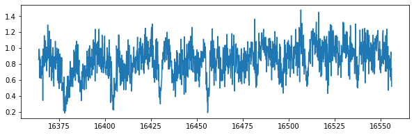
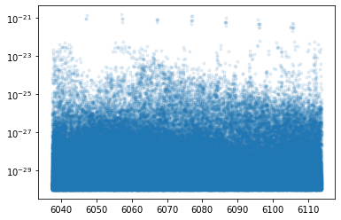
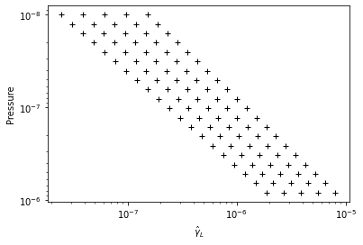
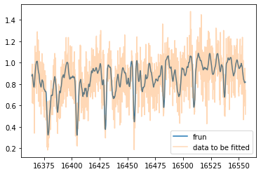
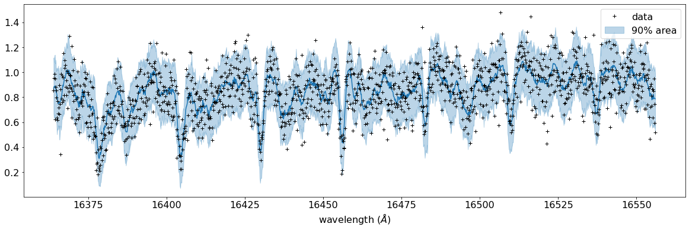
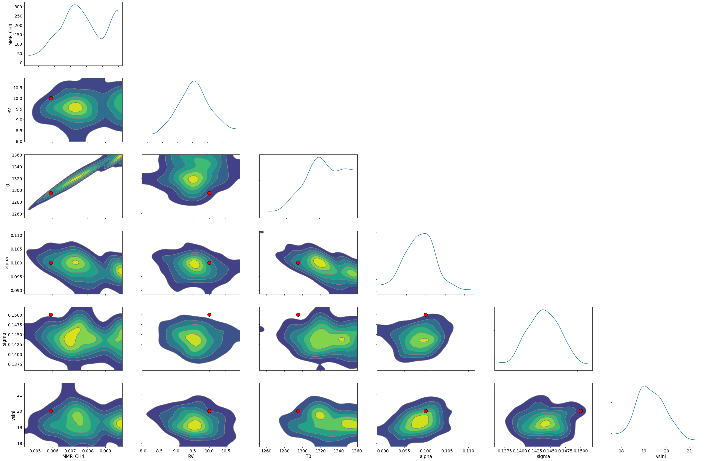

Reverse Modeling of an Emission Spectrum w/ Many Lines
======================================================================

*Septempber 4th (2021) Hajime Kawahara*

We try to fit an emission spectrum model to the mock data in which many
methane lines exist. This situation mocks a T-type brown dwarf.

.. code:: ipython3

    import pandas as pd
    import numpy as np
    import matplotlib.pyplot as plt
    import jax.numpy as jnp

Loading the mock data generated by XXX.

.. code:: ipython3

    dat=pd.read_csv("spectrum_ch4.txt",delimiter=",",names=("wav","flux"))

Inject an additional Gaussian noise into the spectrum

.. code:: ipython3

    wavd=dat["wav"].values[30:-30]
    flux=dat["flux"].values[30:-30]
    nusd=jnp.array(1.e8/wavd[::-1]) #wavenumber
    sigmain=0.15
    norm=20000
    nflux=flux/norm+np.random.normal(0,sigmain,len(wavd))
    plt.figure(figsize=(10,3))
    plt.plot(wavd[::-1],nflux)

.. parsed-literal::

    [<matplotlib.lines.Line2D at 0x7fd438015df0>]

Let’s set a model atmospheric layers, wavenumber range for the model, an
instrument,

.. code:: ipython3

    from exojax.spec.rtransfer import pressure_layer,nugrid
    from exojax.utils.constants import c
    from exojax.utils.instfunc import R2STD
    
    NP=100
    Parr, dParr, k=pressure_layer(NP=NP)
    Nx=5000
    nus,wav,res=nugrid(np.min(wavd)-5.0,np.max(wavd)+5.0,Nx,unit="AA",xsmode="modit")
    
    Rinst=100000. #instrumental spectral resolution
    beta_inst=R2STD(Rinst)  #equivalent to beta=c/(2.0*np.sqrt(2.0*np.log(2.0))*R)

.. parsed-literal::

    nugrid is log: mode= modit

Loading molecular database, CIA, and define some values.

.. code:: ipython3

    from exojax.spec import moldb, contdb
    from exojax.spec import molinfo
    
    mmw=2.33 #mean molecular weight
    
    mdbCH4=moldb.MdbExomol('.database/CH4/12C-1H4/YT10to10/',nus,crit=1.e-30)
    molmassCH4=molinfo.molmass("CH4")
    
    cdbH2H2=contdb.CdbCIA('.database/H2-H2_2011.cia',nus)
    molmassH2=molinfo.molmass("H2")
    mmrH2=0.74
    vmrH2=(mmrH2*mmw/molmassH2) #VMR
    Mp = 33.2 

.. parsed-literal::

    Background atmosphere:  H2
    Reading transition file
    .broad is used.
    Broadening code level= a1
    default broadening parameters are used for  12  J lower states in  29  states
    H2-H2

Check the line strength of the lines..

.. code:: ipython3

    plt.plot(mdbCH4.nu_lines,mdbCH4.Sij0,".",alpha=0.1)
    plt.yscale("log")

Define some arrays for the model.

.. code:: ipython3

    #reference pressure for a T-P model                                             
    Pref=1.0 #bar
    ONEARR=np.ones_like(Parr)
    ONEWAV=jnp.ones_like(nflux)

Initialize MODIT

.. code:: ipython3

    from exojax.spec import initspec
    cnu,indexnu,R,pmarray=initspec.init_modit(mdbCH4.nu_lines,nus)

Do not confuse R with Rinst. R is the spectral resolution of the raw
spectral model, which should be higher than Rinst, while Rinst is the
instrumental spectral resolution.

.. code:: ipython3

    Rinst, R

.. parsed-literal::

    (100000.0, 407349.0039001706)

We need to set DIT grid matrix (DGM), but, a temperature profile varies
during sampling. So we check max/min of profiles. setdgm_exomol can
automatically set DGM based on the T-P model and given ranges.

.. code:: ipython3

    # Precomputing gdm_ngammaL                                                                                              
    from exojax.spec.modit import setdgm_exomol
    from jax import jit, vmap
    
    fT = lambda T0,alpha: T0[:,None]*(Parr[None,:]/Pref)**alpha[:,None]
    T0_test=np.array([1000.0,1500.0,1000.0,1500.0])
    alpha_test=np.array([0.2,0.2,0.05,0.05])
    res=0.2
    dgm_ngammaL=setdgm_exomol(mdbCH4,fT,Parr,R,molmassCH4,res,T0_test,alpha_test)

.. code:: ipython3

    #show the DIT grids 
    from exojax.plot.ditplot import plot_dgmn
    plot_dgmn(Parr,dgm_ngammaL,None,0,20)

We here use numpyro as a PPL (probabilistic programming language).

.. code:: ipython3

    from jax import random
    import numpyro.distributions as dist
    import numpyro
    from numpyro.infer import MCMC, NUTS
    from numpyro.infer import Predictive
    from numpyro.diagnostics import hpdi

Then, construct the model, but, this is the most complex part of the
retrieval. To support this process, exojax provides modit.exomol to get
the line intensity, normalized widths. Here the user-defined functino
frun returns a spectral model.

.. code:: ipython3

    from exojax.spec.modit import exomol,xsmatrix
    from exojax.spec.rtransfer import dtauM, dtauCIA, rtrun
    from exojax.spec import planck, response

.. code:: ipython3

    def frun(Tarr,MMR_CH4,Mp,Rp,u1,u2,RV,vsini):
        g=2478.57730044555*Mp/Rp**2
        SijM,ngammaLM,nsigmaDl=exomol(mdbCH4,Tarr,Parr,R,molmassCH4)
        xsm=xsmatrix(cnu,indexnu,R,pmarray,nsigmaDl,ngammaLM,SijM,nus,dgm_ngammaL)
        dtaum=dtauM(dParr,jnp.abs(xsm),MMR_CH4*ONEARR,molmassCH4,g)
    
        #CIA                                                                                                                
        dtaucH2H2=dtauCIA(nus,Tarr,Parr,dParr,vmrH2,vmrH2,mmw,g,cdbH2H2.nucia,cdbH2H2.tcia,cdbH2H2.logac)
        dtau=dtaum+dtaucH2H2
        sourcef = planck.piBarr(Tarr,nus)
        F0=rtrun(dtau,sourcef)/norm
        Frot=response.rigidrot(nus,F0,vsini,u1,u2)
        mu=response.ipgauss_sampling(nusd,nus,Frot,beta_inst,RV)
        return mu

Test plot using frun

.. code:: ipython3

    T0=1295.0 #K                                                                                                        
    Tarr = T0*(Parr/Pref)**0.1
    mu=frun(Tarr,MMR_CH4=0.0058,Mp=33.5,Rp=0.88,u1=0.0,u2=0.0,RV=10.0,vsini=20.0)
    plt.plot(wavd[::-1],mu,label="frun")
    plt.plot(wavd[::-1],nflux,alpha=0.3,label="data to be fitted")
    plt.legend()
    plt.show()

Let’s define the model for a HMC.

.. code:: ipython3

    Mp=33.2
    Rp=0.88
    #we assume we know gravity here.
    
    def model_c(y1):
        #Rp = numpyro.sample('Rp', dist.Uniform(0.87,0.89))
        RV = numpyro.sample('RV', dist.Uniform(5.0,15.1))
        MMR_CH4 = numpyro.sample('MMR_CH4', dist.Uniform(0.0,0.01))
        T0 = numpyro.sample('T0', dist.Uniform(1200.0,1500.0))
        alpha=numpyro.sample('alpha', dist.Uniform(0.05,0.15))
        vsini = numpyro.sample('vsini', dist.Uniform(15.0,25.0)) 
        sigma = numpyro.sample('sigma',dist.Exponential(1.0))
        #sigma = sigma*0.05
        u1=0.0
        u2=0.0                                                                                                 
        Tarr = T0*(Parr/Pref)**alpha  
        
    
        mu=frun(Tarr,MMR_CH4,Mp,Rp,u1,u2,RV,vsini)
        numpyro.sample("y1", dist.Normal(mu, sigma), obs=y1)

.. code:: ipython3

    rng_key = random.PRNGKey(0)
    rng_key, rng_key_ = random.split(rng_key)
    num_warmup, num_samples = 100, 200
    kernel = NUTS(model_c,forward_mode_differentiation=True,max_tree_depth=7) #Here I set max_tree_depth because I did not have time to wait.
    mcmc = MCMC(kernel, num_warmup=num_warmup, num_samples=num_samples)
    mcmc.run(rng_key_, y1=nflux)

.. parsed-literal::

    sample: 100%|██████████████████████████████| 300/300 [39:02<00:00,  7.81s/it, 63 steps of size 2.89e-02. acc. prob=0.96]

.. code:: ipython3

    posterior_sample = mcmc.get_samples()
    pred = Predictive(model_c,posterior_sample,return_sites=["y1"])
    predictions = pred(rng_key_,y1=None)
    median_mu1 = jnp.median(predictions["y1"],axis=0)
    hpdi_mu1 = hpdi(predictions["y1"], 0.9)                                      
    fig, ax = plt.subplots(nrows=1, ncols=1, figsize=(20,6.0))
    ax.plot(wavd[::-1],median_mu1,color="C0")
    ax.plot(wavd[::-1],nflux,"+",color="black",label="data")
    ax.fill_between(wavd[::-1], hpdi_mu1[0], hpdi_mu1[1], alpha=0.3, interpolate=True,color="C0",label="90% area")
    plt.xlabel("wavelength ($\AA$)",fontsize=16)
    plt.legend(fontsize=16)
    plt.tick_params(labelsize=16)

.. code:: ipython3

    import arviz
    refs={};refs["RV"]=10.0;refs["T0"]=1295;refs["MMR_CH4"]=0.0059;refs["alpha"]=0.1;refs["vsini"]=20.0;refs["sigma"]=0.15;
    arviz.plot_pair(arviz.from_numpyro(mcmc),kind='kde',divergences=False,marginals=True,
                   reference_values=refs,reference_values_kwargs={'color':"red", "marker":"o", "markersize":12})
    plt.show()

