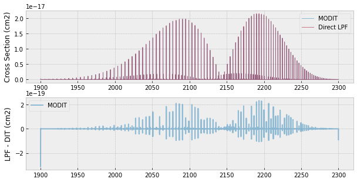
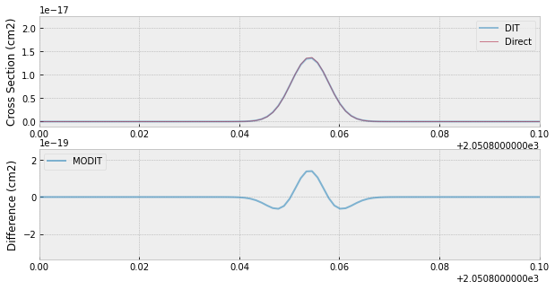

Cross Section for Many Lines using MODIT
========================================

*Update: September 3/2021, Hajime Kawahara*

We demonstarte the Modified Discrete Integral Transform (MODIT), which
is the modified version of DIT for exojax. MODIT uses the evenly-spaced
logarithm grid (ESLOG) as a wavenumber dimension. MODIT takes advantage
especially for the case that the number of the molecular line is large
(typically > 1000). We here compare the results by MODIT with the
direct computation (LPF).

.. code:: ipython3

    import numpy as np
    import seaborn as sns
    import matplotlib.pyplot as plt
    import jax.numpy as jnp
    plt.style.use('bmh')

.. code:: ipython3

    from exojax.spec.hitran import SijT, doppler_sigma, gamma_hitran, gamma_natural
    from exojax.spec import moldb
    
    # Setting wavenumber bins and loading HITRAN database
    nus=np.logspace(np.log10(1900.0),np.log10(2300.0),350000,dtype=np.float64)
    R=(len(nus)-1)/np.log(nus[-1]/nus[0]) #resolution
    
    mdbCO=moldb.MdbHit('05_hit12.par',nus)
    # set T, P and partition function
    Mmol=28.01 # molecular weight
    Tfix=1000.0 # we assume T=1000K
    Pfix=1.e-3 # we compute P=1.e-3 bar
    Ppart=Pfix #partial pressure of CO. here we assume a 100% CO atmosphere.
    qt=mdbCO.qr_interp_lines(Tfix)
    
    # compute Sij, gamma_L, sigmaD
    Sij=SijT(Tfix,mdbCO.logsij0,mdbCO.nu_lines,mdbCO.elower,qt)
    gammaL = gamma_hitran(Pfix,Tfix, Ppart, mdbCO.n_air, \
                          mdbCO.gamma_air, mdbCO.gamma_self) \
    + gamma_natural(mdbCO.A)

MODIT uses the normalized quantities by
:math:`d \nu_\mathrm{line} \equiv \nu/R`,
where R is the
spectral resolution. In this case, the normalized Doppler width
(nsigmaD) is common for the same isotope,
:math:`\sqrt{\frac{k_B T}{m_u M}}*R`,
where
:math:`M`
is molecular mass
:math:`m_u`
is the atomic mass unit.
This can be computed using `hitran.normalized_doppler_sigma <../exojax/exojax.spec.html#exojax.spec.hitran.normalized_doppler_sigma>`_. Then, we use a 2D DIT grid
with the dimensions of the normalized gammaL and ESLOG grid
:math:`q = R \log{\nu}`.

.. code:: ipython3

    from exojax.spec.hitran import normalized_doppler_sigma
    dv_lines=mdbCO.nu_lines/R
    nsigmaD=normalized_doppler_sigma(Tfix,Mmol,R)
    ngammaL=gammaL/dv_lines

MODIT uses a grid of ngammaL, and wavenumber. `ditgrid_log_interval <../exojax/exojax.spec.html#exojax.spec.modit.ditgrid>`_ makes a 1D grid for ngamma.

.. code:: ipython3

    from exojax.spec.set_ditgrid import ditgrid_log_interval
    ngammaL_grid=ditgrid_log_interval(ngammaL)
    
    # we can change the resolution using res option
    #ngammaL_grid=ditgrid_log_interval(ngammaL,dit_grid_resolution=0.1)

.. code:: ipython3

    #show the grids
    plt.plot(mdbCO.nu_lines,ngammaL,".")
    for i in ngammaL_grid:
        plt.axhline(i,lw=1,alpha=0.5,color="C1")
    plt.xlabel("wavenumber")
    plt.ylabel("normalized gammaL")

We need to precompute the contribution for wavenumber and pmarray. These
can be computed using `init_modit <../exojax/exojax.spec.html#exojax.spec.initspec.init_modit>`_:

.. code:: ipython3

    from exojax.spec import initspec 
    cnu,indexnu,R,pmarray=initspec.init_modit(mdbCO.nu_lines,nus)

Let’s compute the cross sectio using
`modit.xsvector <../exojax/exojax.spec.html#exojax.spec.modit.xsvector>`_.

.. code:: ipython3

    from exojax.spec.modit import xsvector
    xs=xsvector(cnu,indexnu,R,pmarray,nsigmaD,ngammaL,Sij,nus,ngammaL_grid)

Also, we here try the direct computation using LPF for the comparison
purpose

.. code:: ipython3

    from exojax.spec import xsection
    sigmaD=doppler_sigma(mdbCO.nu_lines,Tfix,Mmol)
    xsv=xsection(nus,mdbCO.nu_lines,sigmaD,gammaL,Sij,memory_size=30)

.. parsed-literal::

    100%|███████████████████████████████████████████| 63/63 [00:02<00:00, 27.13it/s]

.. code:: ipython3

    fig=plt.figure(figsize=(10,5))
    ax=fig.add_subplot(211)
    plt.plot(nus,xs,lw=1,alpha=0.5,label="MODIT")
    plt.plot(nus,xsv,lw=1,alpha=0.5,label="Direct LPF")
    plt.legend(loc="upper right")
    plt.ylabel("Cross Section (cm2)")
    ax=fig.add_subplot(212)
    plt.plot(nus,xsv-xs,lw=2,alpha=0.5,label="MODIT")
    plt.ylabel("LPF - DIT (cm2)")
    plt.legend(loc="upper left")
    plt.show()

There is about 1 % deviation between LPF and MODIT.

.. code:: ipython3

    fig=plt.figure(figsize=(10,5))
    ax=fig.add_subplot(211)
    plt.plot(nus,xs,lw=2,alpha=0.5,label="DIT")
    plt.plot(nus,xsv,lw=1,alpha=0.5,label="Direct")
    plt.legend(loc="upper right")
    plt.xlim(2050.8,2050.9)
    plt.ylabel("Cross Section (cm2)")
    ax=fig.add_subplot(212)
    plt.plot(nus,xsv-xs,lw=2,alpha=0.6,label="MODIT")
    plt.legend(loc="upper left")
    plt.ylabel("Difference (cm2)")
    plt.xlim(2050.8,2050.9)
    plt.savefig("fine_grid.png")

