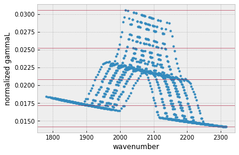
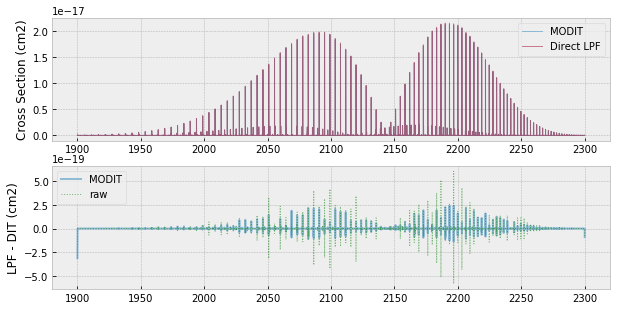
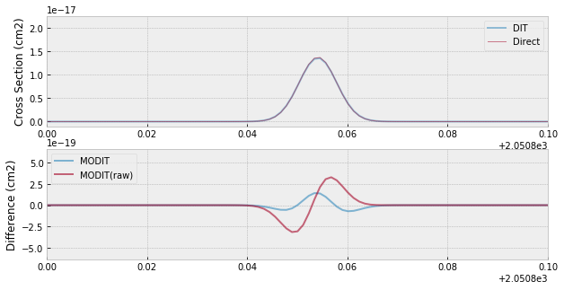

Cross Section for Many Lines using MODIT
=============================================================================================================
*Update: July 17/2021, Hajime Kawahara*

We demonstarte the Modified Discrete Integral Transform (MODIT), which
is the modified version of DIT for exojax. MODIT uses the evenly-spaced
logarithm grid (ESLOG) as a wavenumber dimension. MODIT takes advantage
especially for the case that the number of the molecular line is large
(typically > 10,000). We here compare the results by MODIT with the
direct computation (LPF).

.. code:: ipython3

    import numpy as np
    import seaborn as sns
    import matplotlib.pyplot as plt
    import jax.numpy as jnp
    plt.style.use('bmh')

.. code:: ipython3

    from exojax.spec.hitran import SijT, doppler_sigma, gamma_hitran, gamma_natural
    from exojax.spec import moldb
    
    # Setting wavenumber bins and loading HITRAN database
    nus=np.logspace(np.log10(1900.0),np.log10(2300.0),350000,dtype=np.float64) 
    R=(len(nus)-1)/np.log(nus[-1]/nus[0]) #resolution
    
    mdbCO=moldb.MdbHit('05_hit12.par',nus)
    # set T, P and partition function
    Mmol=28.01 # molecular weight
    Tfix=1000.0 # we assume T=1000K
    Pfix=1.e-3 # we compute P=1.e-3 bar
    Ppart=Pfix #partial pressure of CO. here we assume a 100% CO atmosphere.
    qt=mdbCO.Qr_layer_HAPI([Tfix])[0]
    
    # compute Sij, gamma_L, sigmaD 
    Sij=SijT(Tfix,mdbCO.logsij0,mdbCO.nu_lines,mdbCO.elower,qt)
    gammaL = gamma_hitran(Pfix,Tfix, Ppart, mdbCO.n_air, \
                          mdbCO.gamma_air, mdbCO.gamma_self) \
    + gamma_natural(mdbCO.A)

MODIT uses the normalized quantities by wavenumber/R, where R is the
spectral resolution. In this case, the normalized Doppler width
(nsigmaD) is common for the same isotope. Then, we use a 2D DIT grid
with the normalized gammaL and q = R log(nu).

.. code:: ipython3

    from exojax.spec.hitran import normalized_doppler_sigma                 
    dv_lines=mdbCO.nu_lines/R
    nsigmaD=normalized_doppler_sigma(Tfix,Mmol,R)
    ngammaL=gammaL/dv_lines

MODIT uses a grid of ngammaL, and wavenumber. set_ditgrid makes a 1D
grid for ngamma.

.. code:: ipython3

    from exojax.spec.dit import set_ditgrid
    ngammaL_grid=set_ditgrid(ngammaL)
    
    # we can change the resolution using res option
    #ngammaL_grid=set_ditgrid(ngammaL,res=0.1)

.. code:: ipython3

    #show the grids
    plt.plot(mdbCO.nu_lines,ngammaL,".")
    for i in ngammaL_grid:
        plt.axhline(i,lw=1,alpha=0.5,color="C1")
    plt.xlabel("wavenumber")
    plt.ylabel("normalized gammaL")

.. parsed-literal::

    Text(0, 0.5, 'normalized gammaL')

For MODIT in exojax, we also need to specify Nfold and precompute
“dLarray”. The aliasing effect may results in some negative values in
the computed cross section, in particular, when the grid resolution is
comparable or smaller than to the line width. We can avoid this effect
by including the aliased part of the distribution. Nfold is the number
of aliasing to be included. dLarray is just a list (1,2,3,…,Nfold),
where dnu is the wavenumber interval. We can use dit.make_dLarray to
compute dLarray.

.. code:: ipython3

    from exojax.spec.dit import make_dLarray
    Nfold=1
    dLarray=make_dLarray(Nfold,1)

We can compute a 2D grid for ngammaL, wavenumber, simultaneously, using
modit.xsvector. We should be careful. Here, we subtract large number
from both wavenumber grids and line centers to avoid the truncatino
error.

.. code:: ipython3

    #If you want to compute nu in JAX/GPU, be careful for the precision of wavenumber.
    #reduce the digit 
    from exojax.spec.modit import xsvector
    dfnus=nus-np.median(nus) #remove median
    dfnu_lines=mdbCO.nu_lines-np.median(nus) #remove median
    dv=nus/R #delta wavenumber grid
    xs=xsvector(dfnu_lines,nsigmaD,ngammaL,Sij,dfnus,ngammaL_grid,dLarray,dv_lines,dv)

To see the effect of the truncation error, we also here compute the
cross section using the raw wavenumber and line center

.. code:: ipython3

    #This may lead a large error
    xs_bad=xsvector(mdbCO.nu_lines,nsigmaD,ngammaL,Sij,nus,ngammaL_grid,dLarray,dv_lines,dv)

Also, we here try the direct computation using LPF for the comparison
purpose

.. code:: ipython3

    from exojax.spec import xsection
    xsv=xsection(nus,mdbCO.nu_lines,sigmaD,gammaL,Sij,memory_size=30) 

.. parsed-literal::

    100%|██████████| 63/63 [00:01<00:00, 47.99it/s]

The difference is <~ 1%.

.. code:: ipython3

    fig=plt.figure(figsize=(10,5))
    ax=fig.add_subplot(211)
    plt.plot(nus,xs,lw=1,alpha=0.5,label="MODIT")
    plt.plot(nus,xsv,lw=1,alpha=0.5,label="Direct LPF")
    plt.legend(loc="upper right")
    plt.ylabel("Cross Section (cm2)")
    ax=fig.add_subplot(212)
    plt.plot(nus,xsv-xs,lw=2,alpha=0.5,label="MODIT")
    plt.plot(nus,xsv-xs_bad,lw=1,alpha=0.5,ls="dotted",color="green",label="raw")
    plt.ylabel("LPF - DIT (cm2)")
    plt.legend(loc="upper left")
    plt.show()

But, the use of the raw wavenumber for 3D exhibits larger errors

.. code:: ipython3

    fig=plt.figure(figsize=(10,5))
    ax=fig.add_subplot(211)
    plt.plot(nus,xs,lw=2,alpha=0.5,label="DIT")
    plt.plot(nus,xsv,lw=1,alpha=0.5,label="Direct")
    plt.legend(loc="upper right")
    plt.xlim(2050.8,2050.9)
    plt.ylabel("Cross Section (cm2)")
    ax=fig.add_subplot(212)
    plt.plot(nus,xsv-xs,lw=2,alpha=0.6,label="MODIT")
    plt.plot(nus,xsv-xs_bad,lw=2,alpha=0.6,label="MODIT(raw)")
    plt.legend(loc="upper left")
    plt.ylabel("Difference (cm2)")
    plt.xlim(2050.8,2050.9)
    #plt.yscale("log")
    plt.savefig("fine_grid.png")

