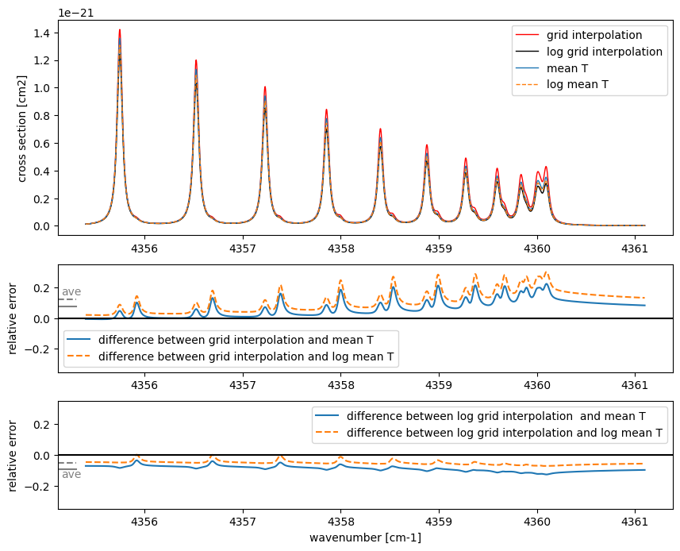

Why ExoJAX Prefers On-Demand Opacity Calculation?
=================================================

Last Update: January 23rd (2025) Hajime Kawahara

One of ExoJAX’s key features is its ability to compute molecular
cross-sections on demand by reading the latest molecular databases,
rather than relying on pre-generated table data. Here, we explain the
rationale behind this strategy.

The following outlines the standard procedure for calculating
cross-sections in ExoJAX. First, define the wavenumber range
(`utils.grid.wavenumber_grid <../exojax/exojax.utils.html#exojax.utils.grids.wavenumber_grid>`__),
then load the molecular database (`Molecular and Atomic
Databases <../userguide/mdb.html>`__). Next, create an instance
specifying the method for computing opacity (`Opacity Calculator
Class <userguide/opacalc.html>`__). There are several options for
opacity calculation methods, depending on factors such as the number of
lines. Finally, by providing temperature and pressure, the cross-section
can be calculated.

Currently, molecular databases such as
`ExoMol <https://www.exomol.com/>`__ and
`HITRAN/HITEMP <https://hitran.org/>`__ are continuously being improved.
ExoJAX’s ability to compute cross-sections directly from the molecular
database level offers the advantage of always utilizing the latest
versions of these databases.

.. code:: ipython3

    import matplotlib.pyplot as plt
    from exojax.utils.grids import wavenumber_grid
    from exojax.database.api  import MdbExomol
    from exojax.opacity import OpaDirect
    
    nu_grid, wav, res = wavenumber_grid(22930, 22960, 2000, xsmode="lpf", unit="AA")
    mdb = MdbExomol('.database/CO/12C-16O/Li2015', nurange=nu_grid)
    opa = OpaDirect(mdb, nu_grid)
    
    t0 = 900.0 #K
    t1 = 1200.0 #K
    p0 = 1.e0 #bar
    
    xs_t0 = opa.xsvector(t0,p0)
    xs_t1 = opa.xsvector(t1,p0)
    
    fig = plt.figure(figsize=(10,3))
    plt.plot(nu_grid,xs_t0,label="T="+str(t0)+"K")
    plt.plot(nu_grid,xs_t1,label="T="+str(t1)+"K")
    plt.xlabel("wavenumber (cm-1)")
    plt.ylabel("cross section (cm2)")
    plt.legend()
    plt.show()

.. parsed-literal::

    xsmode =  lpf
    xsmode assumes ESLOG in wavenumber space: xsmode=lpf
    ======================================================================
    The wavenumber grid should be in ascending order.
    The users can specify the order of the wavelength grid by themselves.
    Your wavelength grid is in ***  descending  *** order
    ======================================================================
    HITRAN exact name= (12C)(16O)
    radis engine =  vaex

.. parsed-literal::

    /home/kawahara/exojax/src/exojax/utils.grids.py:63: UserWarning: Both input wavelength and output wavenumber are in ascending order.
      warnings.warn(
    /home/kawahara/exojax/src/exojax/utils/molname.py:197: FutureWarning: e2s will be replaced to exact_molname_exomol_to_simple_molname.
      warnings.warn(
    /home/kawahara/exojax/src/exojax/utils/molname.py:91: FutureWarning: exojax.utils.molname.exact_molname_exomol_to_simple_molname will be replaced to radis.api.exomolapi.exact_molname_exomol_to_simple_molname.
      warnings.warn(
    /home/kawahara/exojax/src/exojax/utils/molname.py:91: FutureWarning: exojax.utils.molname.exact_molname_exomol_to_simple_molname will be replaced to radis.api.exomolapi.exact_molname_exomol_to_simple_molname.
      warnings.warn(

.. parsed-literal::

    Molecule:  CO
    Isotopologue:  12C-16O
    Background atmosphere:  H2
    ExoMol database:  None
    Local folder:  .database/CO/12C-16O/Li2015
    Transition files: 
    	 => File 12C-16O__Li2015.trans
    Broadening code level: a0

.. parsed-literal::

    /home/kawahara/anaconda3/lib/python3.10/site-packages/radis-0.15.2-py3.10.egg/radis/api/exomolapi.py:685: AccuracyWarning: The default broadening parameter (alpha = 0.07 cm^-1 and n = 0.5) are used for J'' > 80 up to J'' = 152
      warnings.warn(

In this way, ExoJAX directly computes opacity from molecular databases,
allowing users to trace spectral features back to specific lines and
analyze how they depend on temperature and pressure.

Here, let’s take a single example to examine the properties of a
spectral line. In this wavenumber region of carbon monoxide, the
spectrum shows some structure. What kind of lines are responsible for
these features? By increasing the temperature to 3000 K, additional
lines become visible. Plotting the rotational quantum numbers
(:math:`J`) reveals that these lines exhibit gradual changes in
:math:`J`. The difference in rotational quantum numbers between
transitions is :math:`\Delta J=+1`, indicating that these lines are part
of the R-branch. For further details, refer to `R-branch and P-branch of
CO <branch.html>`__.

When plotting the line strengths at different temperatures, it becomes
evident that as the temperature increases, the strength of lines with
higher rotational quantum numbers also increases, making these lines
more prominent. Additionally, the lower energy levels of high-:math:`J`
lines indeed have significantly larger values, confirming that these
lines are only visible at higher temperatures.

By tracing back to the molecular database, we can gain a deeper
understanding of the spectrum in this manner.

.. code:: ipython3

    import numpy as np
    Thot = 3000.0 #K
    xs_thot = opa.xsvector(Thot,p0)
    mask = np.isfinite(mdb.line_strength(Thot)) #mask for finite values
    
    fig = plt.figure(figsize=(10,7.5))
    ax = fig.add_subplot(511)
    ax.plot(nu_grid,xs_t1,label="T="+str(t1)+"K")
    ax.plot(nu_grid,xs_thot,label="T="+str(Thot)+"K")
    ax.set_xlim(nu_grid[0],nu_grid[-1])
    ax.set_ylabel("cross section (cm2)")
    ax.legend()
    
    ax3 = fig.add_subplot(512)
    ax3.plot(mdb.nu_lines[mask], mdb.jlower[mask], ".", label="Jlower")
    ax3.set_xlim(nu_grid[0],nu_grid[-1])
    ax3.set_ylabel("Jlower")
    ax3.legend()
    
    ax4 = fig.add_subplot(513)
    ax4.plot(mdb.nu_lines[mask], mdb.jupper[mask] - mdb.jlower[mask], ".", label="$\Delta$J")
    ax4.set_xlim(nu_grid[0],nu_grid[-1])
    ax4.set_ylabel("$\Delta$J")
    ax4.legend()
    
    ax2 = fig.add_subplot(514)
    ax2.plot(mdb.nu_lines, mdb.line_strength(t1), "+", label=str(t1)+"K")
    ax2.plot(mdb.nu_lines, mdb.line_strength(Thot), ".", label=str(Thot)+"K")
    ax2.set_xlim(nu_grid[0],nu_grid[-1])
    ax2.set_ylabel("line strength (cm)")
    ax2.legend()
    
    
    ax5 = fig.add_subplot(515)
    ax5.plot(mdb.nu_lines[mask], mdb.elower[mask], ".", label="elower")
    ax5.set_xlim(nu_grid[0],nu_grid[-1])
    ax5.set_ylabel("E")
    ax5.legend()
    ax5.set_xlabel("wavenumber (cm-1)")
    
    plt.show()

In addition to the benefits of allowing users to always utilize the
latest molecular databases and track the assumptions and methods used to
compute cross-sections, on-demand computation also eliminates
interpolation errors inherent in table-based data. Next, let’s examine
this error with a simple example.

Errors Associated with Interpolating Table Data
-----------------------------------------------

When calculating opacity using precomputed table data, it is necessary
to interpolate cross-sections from neighboring temperature grid points
to obtain the cross-section at the desired temperature and pressure.
Here, we fix the pressure at 1 bar and compare the interpolated
cross-section at an intermediate temperature ``tc``, derived from the
cross-sections at 900 K and 1200 K, with the cross-section directly
calculated at ``tc``. For the direct calculation at the intermediate
temperature, we will compare two approaches: the arithmetic mean and the
logarithmic mean.For interpolating the cross-sections, let’s consider
two approaches: the arithmetic mean and the logarithmic mean.

.. code:: ipython3

    import numpy as np
    
    t0 = 900.0
    t1 = 1200.0
    tc = (t1 + t0) / 2.0  # linear interpolation
    tc_log = 10 ** ((np.log10(t1) + np.log10(t0)) / 2.0)  # log interpolation
    
    xs00 = opa.xsvector(t0, p0)
    xs10 = opa.xsvector(t1, p0)
    
    # grid interpolation (mean and log mean)
    averaged_xs = (xs00 + xs10) / 2.0
    averaged_xs_log = 10**((np.log10(xs00) + np.log10(xs10)) / 2.0)
    
    
    #direct calculation
    xs = opa.xsvector(tc, p0)
    xs_log = opa.xsvector(tc_log, p0)
    
    
    #diffrence
    diff = np.mean(averaged_xs)/np.mean(xs) - 1.0
    diff_log_lin = np.mean(averaged_xs_log)/np.mean(xs) - 1.0
    diff_lin_log = np.mean(averaged_xs)/np.mean(xs_log) - 1.0
    diff_log_log = np.mean(averaged_xs_log)/np.mean(xs_log) - 1.0
    xmin = 0
    xmax = 0.03
    
    f, (ax, ax2, ax3) = plt.subplots(3, 1, gridspec_kw={"height_ratios": [2, 1, 1]}, figsize=(10, 8))
    
    ax.plot(nu_grid, averaged_xs, label="grid interpolation", lw=1, color="red")
    ax.plot(nu_grid, averaged_xs_log, label="log grid interpolation", lw=1, color="black")
    
    ax.plot(nu_grid, xs, label="mean T", ls="solid", lw=1)
    ax.plot(nu_grid, xs_log, label="log mean T", ls="dashed", lw=1)
    
    ax2.plot(nu_grid, averaged_xs / xs - 1.0, label="difference between grid interpolation and mean T", ls="solid") 
    ax2.plot(nu_grid, averaged_xs / xs_log - 1.0, label="difference between grid interpolation and log mean T", ls="dashed")
    ax2.text(nu_grid[0] - 0.25, 0.15, "ave", color="gray")
    ax2.axhline(diff, color="gray", ls = "solid", xmin=xmin, xmax=xmax)
    ax2.axhline(diff_lin_log, color="gray", ls = "dashed", xmin=xmin, xmax=xmax)
    
    
    ax3.plot(nu_grid, averaged_xs_log / xs - 1.0, label="difference between log grid interpolation  and mean T", ls="solid") 
    ax3.plot(nu_grid, averaged_xs_log / xs_log - 1.0, label="difference between log grid interpolation and log mean T", ls="dashed")
    ax3.text(nu_grid[0] - 0.25, -0.15, "ave", color="gray")
    ax3.axhline(diff_log_lin, color="gray", ls = "solid",  xmin=xmin, xmax=xmax)
    ax3.axhline(diff_log_log, color="gray", ls = "dashed", xmin=xmin, xmax=xmax)
    
    
    ax.legend()
    ax2.set_ylim(-0.35, 0.35)
    ax2.legend()
    ax2.axhline(0.0, color="k")
    
    ax3.set_ylim(-0.35, 0.35)
    ax3.legend()
    ax3.axhline(0.0, color="k")
    
    ax.set_ylabel("cross section [cm2]")
    ax3.set_xlabel("wavenumber [cm-1]")
    ax2.set_ylabel("relative error")
    ax3.set_ylabel("relative error")
    plt.show()

With a temperature grid of 300 K intervals, the arithmetic mean
introduces an error of about 20–30%, while the logarithmic mean reduces
the error to about 5–10%. If table data is used, it would be better to
perform interpolation in this case using logarithmic values for both
temperature and cross-sections. A noteworthy point is that, whether
using the arithmetic mean or the logarithmic mean, the relative error is
consistently either positive or negative across all wavenumbers. This
suggests that the error originates from the line strength and indicates
that it could serve as a source of systematic error, even in cases with
low spectral resolution.

Next, let’s consider the case of fixing the temperature at 900 K and
interpolating the pressure. Since pressure has a high dynamic range, it
is necessary to use a logarithmic grid. Here, we will interpolate using
1 bar and 10 bar as the grid points.

.. code:: ipython3

    t0 = 900.0
    p0 = 1.e0
    p1 = 1.e1
    pc_log = 10 ** ((np.log10(p1) + np.log10(p0)) / 2.0)  # log interpolation
    
    xs00 = opa.xsvector(t0, p0)
    xs01 = opa.xsvector(t0, p1)
    
    # grid interpolation (mean and log mean)
    averaged_xs = (xs00 + xs01) / 2.0
    averaged_xs_log = 10**((np.log10(xs00) + np.log10(xs01)) / 2.0)
    
    #diffrence
    diff = np.mean(averaged_xs)/np.mean(xs) - 1.0
    diff_log = np.mean(averaged_xs_log)/np.mean(xs) - 1.0
    
    #direct calculation
    xs = opa.xsvector(t0, pc_log)
    
    f, (ax, ax2, ax3) = plt.subplots(3, 1, gridspec_kw={"height_ratios": [2, 1, 1]}, figsize=(10, 7))
    
    ax.plot(nu_grid, averaged_xs, label="grid interpolation", lw=2, color="C0", ls="dashed")
    ax.plot(nu_grid, averaged_xs_log, label="log grid interpolation", lw=2, color="C1", ls="dotted")
    
    ax.plot(nu_grid, xs, label="log mean P", ls="solid", lw=2, color="C2")
    ax2.plot(nu_grid, averaged_xs / xs - 1.0, label="difference between grid interpolation and log mean P", ls="solid", color="C0") 
    ax2.text(nu_grid[0] - 0.25, -0.16, "ave", color="C0")
    ax2.axhline(diff, color="C0", ls = "solid",  xmin=xmin, xmax=xmax)
    
    ax3.plot(nu_grid, averaged_xs_log / xs - 1.0, label="difference between log grid interpolation and log mean P", ls="solid", color="C1") 
    ax3.text(nu_grid[0] - 0.25, -0.3, "ave", color="C1")
    ax3.axhline(diff_log, color="C1", ls = "solid",  xmin=xmin, xmax=xmax)
                
    ax.legend()
    ax2.set_ylim(-0.8, 0.8)
    ax2.legend()
    ax2.axhline(0.0, color="k")
    
    ax3.set_ylim(-0.8, 0.8)
    ax3.legend()
    ax3.axhline(0.0, color="k")
    
    ax.set_ylabel("cross section [cm2]")
    ax3.set_xlabel("wavenumber [cm-1]")
    ax2.set_ylabel("relative error")
    ax3.set_ylabel("relative error")
    plt.show()

For pressure interpolation, the tail of the line profile is affected,
resulting in an error profile different from that of temperature
interpolation. Since line strength remains unchanged during pressure
interpolation, the impact may be relatively minor in cases without
high-resolution spectroscopy (middle panel). However, this advantage is
lost when cross-section interpolation is performed in logarithmic space
due to nonlinear effects (bottom panel).

As shown, using precomputed table data can introduce non-negligible
errors in cross-section calculations, especially for high-resolution
spectra. While narrowing the grid intervals can mitigate this issue, it
leads to increased memory usage. To address this problem, ExoJAX aims to
compute cross-sections on demand for the given temperature and pressure.
Additionally, for cases where lower precision is acceptable, table data
can still be generated and utilized as needed.

