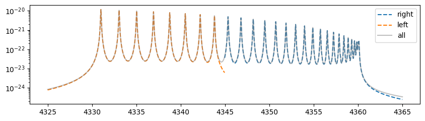
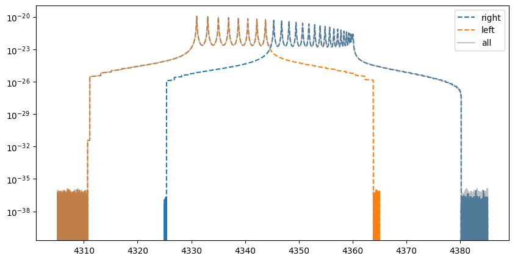
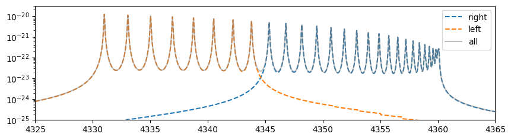
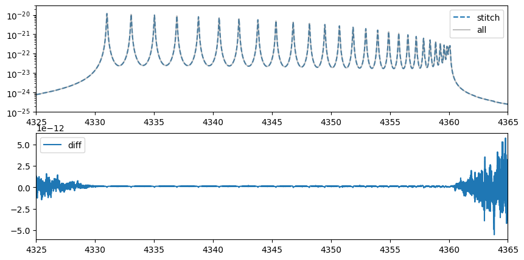
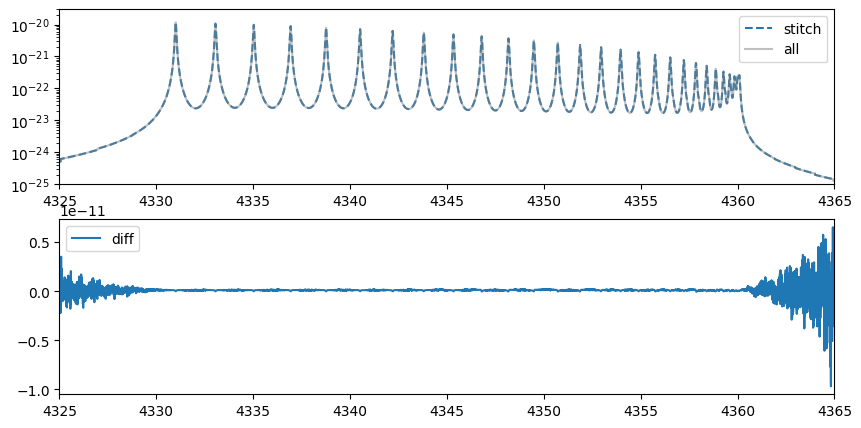

Wavenumber Grid Stitching, and Open and Closed Cross Sections
=============================================================

2025/2/20 Hajime Kawahara

.. code:: ipython3

    
    from jax import config
    
    config.update("jax_enable_x64", True)

Here, we consider the wavenumber-direction stitching of the cross
section. We define a wavenumber grid of length (2N) before stitching, as
well as two wavenumber grids of length (N) each, obtained by splitting
the original grid. Can the cross sections be computed separately on
these subdivided wavenumber grids and then combined?

.. code:: ipython3

    from exojax.utils.grids import wavenumber_grid
    from exojax.test.emulate_mdb import mock_mdb
    
    mdb = mock_mdb("exomol")
    filter_length_oneside = 10000
    nu_grid, _, _ = wavenumber_grid(4325.0, 4365.0, 2*filter_length_oneside, xsmode="premodit")
    
    nu_grid_left = nu_grid[0:filter_length_oneside]
    nu_grid_right = nu_grid[filter_length_oneside:]

.. parsed-literal::

    /home/kawahara/anaconda3/lib/python3.10/site-packages/pandas/core/arrays/masked.py:60: UserWarning: Pandas requires version '1.3.6' or newer of 'bottleneck' (version '1.3.5' currently installed).
      from pandas.core import (

.. parsed-literal::

    xsmode =  modit
    xsmode assumes ESLOG in wavenumber space: xsmode=modit
    Your wavelength grid is in ***  ascending  *** order
    The wavenumber grid is in ascending order by definition.
    Please be careful when you use the wavelength grid.
    radis== 0.15.2
    HITRAN exact name= (12C)(16O)
    radis engine =  vaex

.. parsed-literal::

    /home/kawahara/exojax/src/exojax/spec/unitconvert.py:63: UserWarning: Both input wavelength and output wavenumber are in ascending order.
      warnings.warn(
    /home/kawahara/exojax/src/exojax/spec/unitconvert.py:63: UserWarning: Both input wavelength and output wavenumber are in ascending order.
      warnings.warn(
    /home/kawahara/exojax/src/exojax/spec/api.py:135: UserWarning: The current version of radis does not support broadf_download (requires >=0.16).
      warnings.warn(msg, UserWarning)
    /home/kawahara/exojax/src/exojax/utils/molname.py:197: FutureWarning: e2s will be replaced to exact_molname_exomol_to_simple_molname.
      warnings.warn(
    /home/kawahara/exojax/src/exojax/utils/molname.py:91: FutureWarning: exojax.utils.molname.exact_molname_exomol_to_simple_molname will be replaced to radis.api.exomolapi.exact_molname_exomol_to_simple_molname.
      warnings.warn(
    /home/kawahara/exojax/src/exojax/utils/molname.py:91: FutureWarning: exojax.utils.molname.exact_molname_exomol_to_simple_molname will be replaced to radis.api.exomolapi.exact_molname_exomol_to_simple_molname.
      warnings.warn(

.. parsed-literal::

    Molecule:  CO
    Isotopologue:  12C-16O
    Background atmosphere:  H2
    ExoMol database:  None
    Local folder:  CO/12C-16O/SAMPLE
    Transition files: 
    	 => File 12C-16O__SAMPLE.trans
    Broadener:  H2
    Broadening code level: a0
    DataFrame (self.df) available.
    xsmode =  premodit
    xsmode assumes ESLOG in wavenumber space: xsmode=premodit
    Your wavelength grid is in ***  descending  *** order
    The wavenumber grid is in ascending order by definition.
    Please be careful when you use the wavelength grid.

.. parsed-literal::

    /home/kawahara/anaconda3/lib/python3.10/site-packages/radis-0.15.2-py3.10.egg/radis/api/exomolapi.py:685: AccuracyWarning: The default broadening parameter (alpha = 0.07 cm^-1 and n = 0.5) are used for J'' > 80 up to J'' = 152
      warnings.warn(

We will calculate the cross sections for each of these three types of
wavenumber grids using PreMODIT.

.. code:: ipython3

    from exojax.spec.opacalc import OpaPremodit
    
    T=1000.0 #K
    P=1.0 #bar
    
    opa_close_right = OpaPremodit(
        mdb=mdb,
        nu_grid=nu_grid_right,
        dit_grid_resolution=0.2,
        auto_trange=[400.0, 1500.0],
        alias="close",
    )
    xsv_close_right = opa_close_right.xsvector(T,P)
    
    opa_close_left = OpaPremodit(
        mdb=mdb,
        nu_grid=nu_grid_left,
        dit_grid_resolution=0.2,
        auto_trange=[400.0, 1500.0],
        alias="close",
    )
    xsv_close_left = opa_close_left.xsvector(T,P)
    
    
    opa_close_all = OpaPremodit(
        mdb=mdb,
        nu_grid=nu_grid,
        dit_grid_resolution=0.2,
        auto_trange=[400.0, 1500.0],
        alias="close",
    )
    xsv_close_all= opa_close_all.xsvector(T,P)
    

.. parsed-literal::

    /home/kawahara/exojax/src/exojax/spec/opacalc.py:270: UserWarning: dit_grid_resolution is not None. Ignoring broadening_parameter_resolution.
      warnings.warn(

.. parsed-literal::

    OpaPremodit: params automatically set.
    default elower grid trange (degt) file version: 2
    Robust range: 393.5569458240504 - 1647.2060977798956 K
    OpaPremodit: Tref_broadening is set to  774.5966692414833 K

.. parsed-literal::

    /home/kawahara/exojax/src/exojax/spec/initspec.py:280: UserWarning: Some of the line centers are outside of the wavenumber grid.
      warnings.warn(
    /home/kawahara/exojax/src/exojax/spec/initspec.py:282: UserWarning: All of the line center should be within wavenumber grid for PreMODIT/MODIT/DIT.
      warnings.warn(

.. parsed-literal::

    # of reference width grid :  3
    # of temperature exponent grid : 2

.. parsed-literal::

    uniqidx: 100%|██████████| 2/2 [00:00<00:00, 16163.02it/s]

.. parsed-literal::

    Premodit: Twt= 457.65619999186345 K Tref= 1108.1485374361412 K
    Making LSD:|#####---------------| 25%

.. parsed-literal::

    

.. parsed-literal::

    Making LSD:|####################| 100%
    cross section (xsvector/xsmatrix) is calculated in the closed mode. The aliasing part cannnot be used.

.. parsed-literal::

    /home/kawahara/exojax/src/exojax/spec/opacalc.py:270: UserWarning: dit_grid_resolution is not None. Ignoring broadening_parameter_resolution.
      warnings.warn(
    /home/kawahara/exojax/src/exojax/spec/initspec.py:280: UserWarning: Some of the line centers are outside of the wavenumber grid.
      warnings.warn(
    /home/kawahara/exojax/src/exojax/spec/initspec.py:282: UserWarning: All of the line center should be within wavenumber grid for PreMODIT/MODIT/DIT.
      warnings.warn(

.. parsed-literal::

    OpaPremodit: params automatically set.
    default elower grid trange (degt) file version: 2
    Robust range: 393.5569458240504 - 1647.2060977798956 K
    OpaPremodit: Tref_broadening is set to  774.5966692414833 K
    # of reference width grid :  3
    # of temperature exponent grid : 2

.. parsed-literal::

    uniqidx: 100%|██████████| 1/1 [00:00<00:00, 7084.97it/s]

.. parsed-literal::

    Premodit: Twt= 457.65619999186345 K Tref= 1108.1485374361412 K
    Making LSD:|####################| 100%
    cross section (xsvector/xsmatrix) is calculated in the closed mode. The aliasing part cannnot be used.

.. parsed-literal::

    /home/kawahara/exojax/src/exojax/spec/opacalc.py:270: UserWarning: dit_grid_resolution is not None. Ignoring broadening_parameter_resolution.
      warnings.warn(

.. parsed-literal::

    OpaPremodit: params automatically set.
    default elower grid trange (degt) file version: 2
    Robust range: 393.5569458240504 - 1647.2060977798956 K
    OpaPremodit: Tref_broadening is set to  774.5966692414833 K
    # of reference width grid :  3
    # of temperature exponent grid : 2

.. parsed-literal::

    uniqidx: 100%|██████████| 2/2 [00:00<00:00, 4911.36it/s]

.. parsed-literal::

    Premodit: Twt= 457.65619999186345 K Tref= 1108.1485374361412 K
    Making LSD:|####################| 100%
    cross section (xsvector/xsmatrix) is calculated in the closed mode. The aliasing part cannnot be used.

The cross sections computed after wavenumber splitting do not fully
match those computed without splitting, particularly around the
splitting points and near the endpoints. This discrepancy arises from
the following reasons.

In the default cross-section calculation of PreMODIT and MODIT, the
Voigt profile convolution is performed using FFT. To eliminate aliasing
effects, a buffer region of the same size as the computational domain is
allocated, storing aliasing contributions from both sides. Since this
buffer region is unnecessary for an individual wavenumber grid, it does
not appear in the output. This calculation mode is referred to as the
“closed aliasing mode.”

However, profile leakage from outside the wavenumber grid cannot be
accounted for. As a result, around the splitting points, mutual leakage
between the left and right wavenumber grids is ignored, leading to
discrepancies in the computed cross sections at these points.
Additionally, the mismatch near the endpoints occurs because the default
assumption is that the Voigt profile’s influence extends over a region
equal to the size of one side of the wavenumber grid. Consequently, when
the lengths of the wavenumber grids differ, slight discrepancies arise
in the tail regions of the computed cross sections.

.. code:: ipython3

    import matplotlib.pyplot as plt
    fig = plt.figure(figsize=(10, 2.55))
    plt.plot(nu_grid_right, xsv_close_right, ls="--", label="right")
    plt.plot(nu_grid_left, xsv_close_left, ls="--", label="left")
    plt.plot(nu_grid, xsv_close_all,alpha=0.5, color="gray", label="all")
    plt.yscale("log")
    plt.legend()
    plt.show()

The solution is to compute the aliasing region beyond the boundaries of
the wavenumber domain and then sum the overlapping regions from
different wavenumber domains afterward. This approach corresponds to the
overlap-and-add (OLA) method.

To achieve this, the convolution must be computed in an open manner by
including buffer regions on both sides of the wavenumber domain.
PreMODIT/MODIT supports this approach through the **open aliasing
mode**, which can be enabled by setting ``alias="open"``. Additionally,
the extent of the Voigt profile beyond one side of the wavenumber domain
can be specified using the ``cutwing`` parameter.

.. code:: ipython3

    opa_open_right = OpaPremodit(
        mdb=mdb,
        nu_grid=nu_grid_right,
        dit_grid_resolution=0.2,
        auto_trange=[400.0, 1500.0],
        alias="open",
        cutwing=1.0,
    )
    xsv_open_right = opa_open_right.xsvector(T,P)
    
    opa_open_left = OpaPremodit(
        mdb=mdb,
        nu_grid=nu_grid_left,
        dit_grid_resolution=0.2,
        auto_trange=[400.0, 1500.0],
        alias="open",
        cutwing=1.0,
    )
    xsv_open_left = opa_open_left.xsvector(T,P)
    
    opa_open_all = OpaPremodit(
        mdb=mdb,
        nu_grid=nu_grid,
        dit_grid_resolution=0.2,
        auto_trange=[400.0, 1500.0],
        alias="open",
        cutwing=0.5,
    )
    xsv_open_all= opa_open_all.xsvector(T,P)

.. parsed-literal::

    /home/kawahara/exojax/src/exojax/spec/opacalc.py:270: UserWarning: dit_grid_resolution is not None. Ignoring broadening_parameter_resolution.
      warnings.warn(
    /home/kawahara/exojax/src/exojax/spec/initspec.py:280: UserWarning: Some of the line centers are outside of the wavenumber grid.
      warnings.warn(
    /home/kawahara/exojax/src/exojax/spec/initspec.py:282: UserWarning: All of the line center should be within wavenumber grid for PreMODIT/MODIT/DIT.
      warnings.warn(

.. parsed-literal::

    OpaPremodit: params automatically set.
    default elower grid trange (degt) file version: 2
    Robust range: 393.5569458240504 - 1647.2060977798956 K
    OpaPremodit: Tref_broadening is set to  774.5966692414833 K
    # of reference width grid :  3
    # of temperature exponent grid : 2

.. parsed-literal::

    uniqidx: 100%|██████████| 2/2 [00:00<00:00, 9903.91it/s]

.. parsed-literal::

    Premodit: Twt= 457.65619999186345 K Tref= 1108.1485374361412 K
    Making LSD:|####################| 100%
    cross section (xsvector/xsmatrix) is calculated in the open mode. The aliasing part can be used.

.. parsed-literal::

    /home/kawahara/exojax/src/exojax/spec/opacalc.py:270: UserWarning: dit_grid_resolution is not None. Ignoring broadening_parameter_resolution.
      warnings.warn(
    /home/kawahara/exojax/src/exojax/spec/initspec.py:280: UserWarning: Some of the line centers are outside of the wavenumber grid.
      warnings.warn(
    /home/kawahara/exojax/src/exojax/spec/initspec.py:282: UserWarning: All of the line center should be within wavenumber grid for PreMODIT/MODIT/DIT.
      warnings.warn(

.. parsed-literal::

    OpaPremodit: params automatically set.
    default elower grid trange (degt) file version: 2
    Robust range: 393.5569458240504 - 1647.2060977798956 K
    OpaPremodit: Tref_broadening is set to  774.5966692414833 K
    # of reference width grid :  3
    # of temperature exponent grid : 2

.. parsed-literal::

    uniqidx: 100%|██████████| 1/1 [00:00<00:00, 5127.51it/s]

.. parsed-literal::

    Premodit: Twt= 457.65619999186345 K Tref= 1108.1485374361412 K
    Making LSD:|####################| 100%
    cross section (xsvector/xsmatrix) is calculated in the open mode. The aliasing part can be used.

.. parsed-literal::

    /home/kawahara/exojax/src/exojax/spec/opacalc.py:270: UserWarning: dit_grid_resolution is not None. Ignoring broadening_parameter_resolution.
      warnings.warn(

.. parsed-literal::

    OpaPremodit: params automatically set.
    default elower grid trange (degt) file version: 2
    Robust range: 393.5569458240504 - 1647.2060977798956 K
    OpaPremodit: Tref_broadening is set to  774.5966692414833 K
    # of reference width grid :  3
    # of temperature exponent grid : 2

.. parsed-literal::

    uniqidx: 100%|██████████| 2/2 [00:00<00:00, 3227.63it/s]

.. parsed-literal::

    Premodit: Twt= 457.65619999186345 K Tref= 1108.1485374361412 K
    Making LSD:|####################| 100%
    cross section (xsvector/xsmatrix) is calculated in the open mode. The aliasing part can be used.

.. code:: ipython3

    
    import matplotlib.pyplot as plt
    fig = plt.figure(figsize=(10, 5))
    plt.plot(opa_open_right.nu_grid_extended, xsv_open_right, ls="--", label="right")
    plt.plot(opa_open_left.nu_grid_extended, xsv_open_left, ls="--", label="left")
    plt.plot(opa_open_all.nu_grid_extended, xsv_open_all,alpha=0.5, color="gray", label="all")
    plt.yscale("log")
    plt.legend()
    plt.show()

.. code:: ipython3

    import matplotlib.pyplot as plt
    fig = plt.figure(figsize=(10, 2.5))
    ax = fig.add_subplot(111)
    plt.plot(opa_open_right.nu_grid_extended, xsv_open_right, ls="--", label="right")
    plt.plot(opa_open_left.nu_grid_extended, xsv_open_left, ls="--", label="left")
    plt.plot(opa_open_all.nu_grid_extended, xsv_open_all,alpha=0.5, color="gray", label="all")
    plt.yscale("log")
    plt.xlim(nu_grid[0],nu_grid[-1])
    plt.ylim(1.0e-25,3.0e-20)
    plt.legend()
    plt.show()

After performing the stitching, it is confirmed that the computed
results closely match those obtained in the original wavenumber domain.

.. code:: ipython3

    xsv_open_stitch = xsv_open_left[filter_length_oneside:3*filter_length_oneside]+xsv_open_right[0:2*filter_length_oneside]

.. code:: ipython3

    
    
    
    import matplotlib.pyplot as plt
    fig = plt.figure(figsize=(10, 5))
    ax = fig.add_subplot(211)
    plt.plot(nu_grid, xsv_open_stitch, color="C0", ls="dashed", label="stitch")
    plt.plot(nu_grid, xsv_open_all[filter_length_oneside:3*filter_length_oneside],alpha=0.5, color="gray", label="all")
    plt.yscale("log")
    plt.xlim(nu_grid[0],nu_grid[-1])
    plt.ylim(1.0e-25,3.0e-20)
    plt.legend()
    ax = fig.add_subplot(212)
    plt.plot(nu_grid, xsv_open_all[filter_length_oneside:3*filter_length_oneside]/xsv_open_stitch -1.0, color="C0", label="diff")
    plt.xlim(nu_grid[0],nu_grid[-1])
    plt.legend()
    plt.show()

We can use functions in ``signal.ola`` packages for stitching the open
cross sections, instead of the manual stitching.

.. code:: ipython3

    from exojax.signal.ola import overlap_and_add
    from exojax.signal.ola import ola_output_length
    
    import jax.numpy as jnp
    xsv_matrix = jnp.vstack([xsv_open_left,xsv_open_right])
    output_length = ola_output_length(xsv_matrix.shape[0], opa_open_left.div_length , opa_open_left.filter_length)
    xsv_ola_stitch = overlap_and_add(xsv_matrix,output_length, opa_open_left.div_length) 

.. code:: ipython3

    import matplotlib.pyplot as plt
    fig = plt.figure(figsize=(10, 5))
    ax = fig.add_subplot(211)
    plt.plot(opa_open_all.nu_grid_extended, xsv_ola_stitch, color="C0", ls="dashed", label="stitch")
    plt.plot(opa_open_all.nu_grid_extended, xsv_open_all,alpha=0.5, color="gray", label="all")
    plt.yscale("log")
    plt.xlim(nu_grid[0],nu_grid[-1])
    plt.ylim(1.0e-25,3.0e-20)
    plt.legend()
    ax = fig.add_subplot(212)
    plt.plot(opa_open_all.nu_grid_extended[filter_length_oneside:3*filter_length_oneside], xsv_open_all[filter_length_oneside:3*filter_length_oneside]/xsv_ola_stitch[filter_length_oneside:3*filter_length_oneside] -1.0, color="C0", label="diff")
    plt.xlim(nu_grid[0],nu_grid[-1])
    plt.legend()
    plt.show()

Then, we change the cutwing to 0.5, that is we cut the wing at a half of
div_length. The corresponding (non stitch) xsv should have cutwing=0.25
because the length of signal is 2 x of that for stitching.

.. code:: ipython3

    opa_open_right = OpaPremodit(
        mdb=mdb,
        nu_grid=nu_grid_right,
        dit_grid_resolution=0.2,
        auto_trange=[400.0, 1500.0],
        alias="open",
        cutwing=0.5,
    )
    xsv_open_right = opa_open_right.xsvector(T,P)
    
    opa_open_left = OpaPremodit(
        mdb=mdb,
        nu_grid=nu_grid_left,
        dit_grid_resolution=0.2,
        auto_trange=[400.0, 1500.0],
        alias="open",
        cutwing=0.5,
    )
    xsv_open_left = opa_open_left.xsvector(T,P)
    xsv_matrix = jnp.vstack([xsv_open_left,xsv_open_right])
    output_length = ola_output_length(xsv_matrix.shape[0], opa_open_left.div_length , opa_open_left.filter_length)
    xsv_ola_stitch = overlap_and_add(xsv_matrix,output_length, opa_open_left.div_length) 
    
    opa_open_all = OpaPremodit(
        mdb=mdb,
        nu_grid=nu_grid,
        dit_grid_resolution=0.2,
        auto_trange=[400.0, 1500.0],
        alias="open",
        cutwing=0.25,
    )
    xsv_open_all= opa_open_all.xsvector(T,P)

.. parsed-literal::

    /home/kawahara/exojax/src/exojax/spec/opacalc.py:270: UserWarning: dit_grid_resolution is not None. Ignoring broadening_parameter_resolution.
      warnings.warn(
    /home/kawahara/exojax/src/exojax/spec/initspec.py:280: UserWarning: Some of the line centers are outside of the wavenumber grid.
      warnings.warn(
    /home/kawahara/exojax/src/exojax/spec/initspec.py:282: UserWarning: All of the line center should be within wavenumber grid for PreMODIT/MODIT/DIT.
      warnings.warn(

.. parsed-literal::

    OpaPremodit: params automatically set.
    default elower grid trange (degt) file version: 2
    Robust range: 393.5569458240504 - 1647.2060977798956 K
    OpaPremodit: Tref_broadening is set to  774.5966692414833 K
    # of reference width grid :  3
    # of temperature exponent grid : 2

.. parsed-literal::

    uniqidx: 100%|██████████| 2/2 [00:00<00:00, 11507.01it/s]
    /home/kawahara/exojax/src/exojax/spec/opacalc.py:270: UserWarning: dit_grid_resolution is not None. Ignoring broadening_parameter_resolution.
      warnings.warn(

.. parsed-literal::

    Premodit: Twt= 457.65619999186345 K Tref= 1108.1485374361412 K
    Making LSD:|####################| 100%
    cross section (xsvector/xsmatrix) is calculated in the open mode. The aliasing part can be used.
    OpaPremodit: params automatically set.
    default elower grid trange (degt) file version: 2
    Robust range: 393.5569458240504 - 1647.2060977798956 K
    OpaPremodit: Tref_broadening is set to  774.5966692414833 K

.. parsed-literal::

    /home/kawahara/exojax/src/exojax/spec/initspec.py:280: UserWarning: Some of the line centers are outside of the wavenumber grid.
      warnings.warn(
    /home/kawahara/exojax/src/exojax/spec/initspec.py:282: UserWarning: All of the line center should be within wavenumber grid for PreMODIT/MODIT/DIT.
      warnings.warn(

.. parsed-literal::

    # of reference width grid :  3
    # of temperature exponent grid : 2

.. parsed-literal::

    uniqidx: 100%|██████████| 1/1 [00:00<00:00, 7145.32it/s]

.. parsed-literal::

    Premodit: Twt= 457.65619999186345 K Tref= 1108.1485374361412 K
    Making LSD:|--------------------| 0%

.. parsed-literal::

    /home/kawahara/exojax/src/exojax/spec/opacalc.py:270: UserWarning: dit_grid_resolution is not None. Ignoring broadening_parameter_resolution.
      warnings.warn(

.. parsed-literal::

    Making LSD:|####################| 100%
    cross section (xsvector/xsmatrix) is calculated in the open mode. The aliasing part can be used.
    OpaPremodit: params automatically set.
    default elower grid trange (degt) file version: 2
    Robust range: 393.5569458240504 - 1647.2060977798956 K
    OpaPremodit: Tref_broadening is set to  774.5966692414833 K
    # of reference width grid :  3
    # of temperature exponent grid : 2

.. parsed-literal::

    uniqidx: 100%|██████████| 2/2 [00:00<00:00, 5384.22it/s]

.. parsed-literal::

    Premodit: Twt= 457.65619999186345 K Tref= 1108.1485374361412 K
    Making LSD:|####################| 100%
    cross section (xsvector/xsmatrix) is calculated in the open mode. The aliasing part can be used.

We trim the unused alising left and right parts from the xsv:

.. code:: ipython3

    xsv_ola_stitch_trim = xsv_ola_stitch[opa_open_left.filter_length_oneside:-opa_open_left.filter_length_oneside]
    xsv_open_all_trim = xsv_open_all[opa_open_all.filter_length_oneside:-opa_open_all.filter_length_oneside]

.. code:: ipython3

    import matplotlib.pyplot as plt
    fig = plt.figure(figsize=(10, 5))
    ax = fig.add_subplot(211)
    plt.plot(nu_grid, xsv_ola_stitch_trim, color="C0", ls="dashed", label="stitch")
    plt.plot(nu_grid, xsv_open_all_trim,alpha=0.5, color="gray", label="all")
    plt.yscale("log")
    plt.xlim(nu_grid[0],nu_grid[-1])
    plt.ylim(1.0e-25,3.0e-20)
    plt.legend()
    ax = fig.add_subplot(212)
    plt.plot(nu_grid, xsv_open_all_trim/xsv_ola_stitch_trim -1.0, color="C0", label="diff")
    plt.xlim(nu_grid[0],nu_grid[-1])
    plt.legend()
    plt.show()
    

