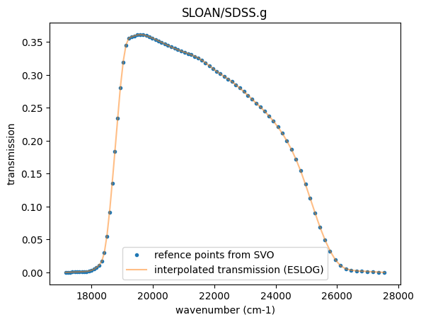

SopPhoto: Computes Apparent Magnitude
=====================================

Hajime Kawahara March 5th 2025

In ExoJAX, computed spectra can be easily converted into photometric
information, specifically apparent magnitude. This is achieved using
``SopPhoto``, one of the spectral operators. By default, the calculation
is performed using filter functions provided by
`SVO <http://svo2.cab.inta-csic.es/theory/fps/>`__. In this example, the
SDSS G-band filter is used.

.. code:: ipython3

    from exojax.postproc.specop import SopPhoto    
    
    filter_name = "SLOAN/SDSS.g"
    sop_photo = SopPhoto(filter_name, download=True)

.. parsed-literal::

    /home/kawahara/anaconda3/lib/python3.10/site-packages/pandas/core/arrays/masked.py:60: UserWarning: Pandas requires version '1.3.6' or newer of 'bottleneck' (version '1.3.5' currently installed).
      from pandas.core import (

.. parsed-literal::

    filter_id =  SLOAN/SDSS.g
    You can check the available filters at http://svo2.cab.inta-csic.es/theory/fps/
    resolution_photo= 6123.2
    save  .database/filter/svo/SLOAN/SDSS.g.csv
    save  .database/filter/svo/SLOAN/SDSS.g.info.csv
    xsmode =  premodit
    xsmode assumes ESLOG in wavenumber space: xsmode=premodit
    Your wavelength grid is in ***  descending  *** order
    The wavenumber grid is in ascending order by definition.
    Please be careful when you use the wavelength grid.

.. parsed-literal::

    /home/kawahara/exojax/src/exojax/utils.grids.py:82: UserWarning: Both input wavelength and output wavenumber are in ascending order.
      warnings.warn(
    /home/kawahara/exojax/src/exojax/utils/grids.py:170: UserWarning: Resolution may be too small. R=6123.03886194115
      warnings.warn("Resolution may be too small. R=" + str(resolution), UserWarning)

When ``SopPhoto`` is called, it calculates the transmission curve by
interpolating the transmission data obtained from SVO onto the
wavenumber grid in ESLOG base; ``nu_grid_filter``,
``transmission_filter``. These interpolated transmissions can be
directly used for ``opa`` calculations. The resolution can be adjusted
by specifying the factor by which the original resolution is increased
using ``up_resolution_factor``.

.. code:: ipython3

    import matplotlib.pyplot as plt
    plt.plot(sop_photo.nu_ref, sop_photo.transmission_ref, ".", label="refence points from SVO")
    plt.plot(sop_photo.nu_grid_filter, sop_photo.transmission_filter, alpha=0.5,label="interpolated transmission (ESLOG)")
    plt.legend()
    plt.title(sop_photo.filter_id)
    plt.xlabel("wavenumber (cm-1)")
    plt.ylabel("transmission")
    plt.show()

In this example, let’s compute the apparent magnitude (which is
essentially the absolute magnitude!) of a blackbody sphere with the same
temperature as the Sun placed at 10 pc.

Recall the flux from a black body sphere with a radius R, temperature T
at distance of d is given by

:math:`f_\nu = \pi B_\nu (T) \frac{R^2}{d^2}`

where :math:`B_\nu (T)` is the Planck function.

.. code:: ipython3

    
    # Sun
    from exojax.rt.planck import piB
    from exojax.utils.constants import RJ, Rs
    from exojax.utils.constants import pc
    
    flux = piB(5772.0, sop_photo.nu_grid_filter) * (Rs/RJ) ** 2 / (10.0) ** 2 * (RJ / pc)**2 #erg/s/cm2/cm-1
    
    mag = sop_photo.apparent_magnitude(flux)
    print(mag)

.. parsed-literal::

    5.3326893

