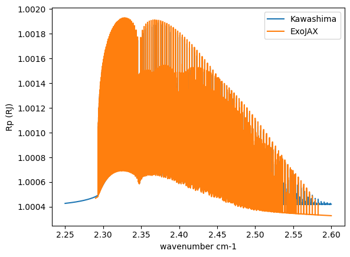

Computes Transmission Spectra (beta release)
============================================

We compute a high-resolution transmission spectrum using HITRAN CO and
compare it with the results by the different method (by Yui Kawashima).
Note that ``ArtTransPure`` is ``art`` for the transmission spectrum.

.. code:: ipython3

    from jax.config import config
    import pandas as pd
    import numpy as np
    from exojax.utils.grids import wavenumber_grid
    from exojax.spec.opacalc import OpaModit
    from exojax.spec.atmrt import ArtTransPure
    from exojax.utils.constants import RJ, Rs
    from exojax.spec.api import MdbHitran
    from exojax.utils.astrofunc import gravity_jupiter
        
    config.update("jax_enable_x64", True)

.. parsed-literal::

    /home/kawahara/exojax/src/exojax/spec/dtau_mmwl.py:14: FutureWarning: dtau_mmwl might be removed in future.
      warnings.warn("dtau_mmwl might be removed in future.", FutureWarning)

To load a reference spectrum, we make the following method.

.. code:: ipython3

    def read_kawashima_data(filename):
        dat = pd.read_csv(filename, delimiter="   ")
        wav = dat["Wavelength[um]"]
        mask = (wav > 2.25) & (wav < 2.6)
        return wav[mask], dat["Rp/Rs"][mask]

The ref file should be in ExoJAX repo.

.. code:: ipython3

    filename = "/home/kawahara/exojax/tests/integration/comparison/transmission/spectrum/CO100percent_500K.dat"

Here is the core code. We define ``art`` using ``ArtTransPure``.
``art.constant_mmr_profile`` sets the mass mixing ratio layer profile to
a constant value. Here we assume 100% CO everywhere. For a transmission
spectrum, the constant gravity assumption is not good approximation. So,
we need to compute the gravity profile. ``art.gravity_profile`` does it.
After computing opacity, we can use ``art.run`` to generate the
transmission spectrum.

.. code:: ipython3

    def compare_with_kawashima_code():
        mu_fid = 28.00863 #mean molecular weight
        T_fid = 500.
    
        Nx = 300000
        nu_grid, wav, res = wavenumber_grid(22900.0,
                                            26000.0,
                                            Nx,
                                            unit="AA",
                                            xsmode="modit")
    
        art = ArtTransPure(pressure_top=1.e-15, pressure_btm=1.e1, nlayer=100)
        art.change_temperature_range(490.0, 510.0)
        Tarr = T_fid * np.ones_like(art.pressure)
        mmr_arr = art.constant_mmr_profile(1.0)
        gravity_btm = gravity_jupiter(1.0, 1.0)
        radius_btm = RJ
    
        mdb = MdbHitran('CO', nu_grid, gpu_transfer=True)
        mmw = mu_fid * np.ones_like(art.pressure)
        gravity = art.gravity_profile(Tarr, mmw, radius_btm, gravity_btm)
    
        #HITRAN CO has not so many lines. So we use MODIT here instead of PreMODIT
        opa = OpaModit(mdb=mdb, nu_grid=nu_grid, Tarr_list=Tarr, Parr=art.pressure)
        xsmatrix = opa.xsmatrix(Tarr, art.pressure)
        dtau = art.opacity_profile_lines(xsmatrix, mmr_arr, opa.mdb.molmass,
                                         gravity)
    
        Rp2 = art.run(dtau, Tarr, mmw, radius_btm, gravity_btm)
        return nu_grid, np.sqrt(Rp2) * radius_btm / Rs

Compares the results. Not so bad. Note that the Kawashima-san’s
reference includes the Rayleigh scattering, but we do not. That makes
this small difference.

.. code:: ipython3

    import matplotlib.pyplot as plt
    
    wav, rprs = read_kawashima_data(filename)
    diffmode = 1
    nus_hitran, Rp_hitran = compare_with_kawashima_code()
    from exojax.spec.unitconvert import nu2wav
    wav_exojax = nu2wav(nus_hitran, unit="um", wavelength_order="ascending")
    fig = plt.figure()
    ax = fig.add_subplot(111)
    ax.plot(wav, rprs * Rs / RJ, label="Kawashima")
    #plt.yscale("log")
    ax.plot(wav_exojax[::-1], Rp_hitran * Rs / RJ, label="ExoJAX")
    plt.legend()
    
    plt.xlabel("wavenumber cm-1")
    #plt.ylim(-0.07, 0.07)
    plt.legend()
    plt.ylabel("Rp (RJ)")
    
    plt.savefig("comparison.png")
    plt.show()

.. parsed-literal::

    /tmp/ipykernel_40805/4154571916.py:2: ParserWarning: Falling back to the 'python' engine because the 'c' engine does not support regex separators (separators > 1 char and different from '\s+' are interpreted as regex); you can avoid this warning by specifying engine='python'.
      dat = pd.read_csv(filename, delimiter="   ")

.. parsed-literal::

    xsmode =  modit
    xsmode assumes ESLOG in wavenumber space: mode=modit
    ======================================================================
    We changed the policy of the order of wavenumber/wavelength grids
    wavenumber grid shluld be in ascending order and now 
    users can specify the order of the wavelength grid by themselves.
    Your wavelength grid is in ***  descending  *** order
    This might causes the bug if you update ExoJAX. 
    Note that the older ExoJAX assumes ascending order as wavelength grid.
    ======================================================================

.. parsed-literal::

    /home/kawahara/exojax/src/exojax/spec/atmrt.py:43: UserWarning: nu_grid is not given. specify nu_grid when using 'run' 
      warnings.warn(

.. parsed-literal::

    k= 0.6892612104349697
    k= 0.6892612104349697

