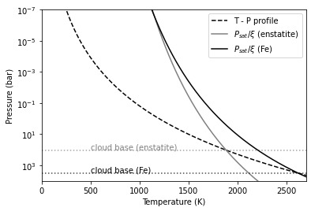
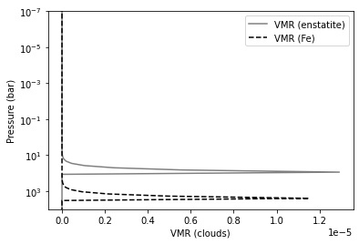
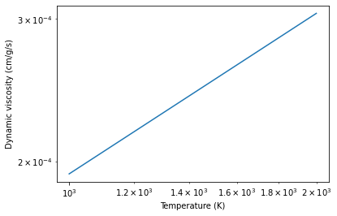
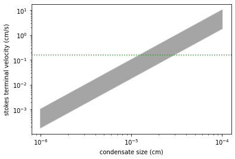
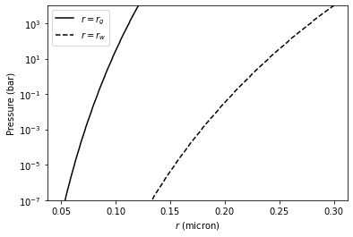
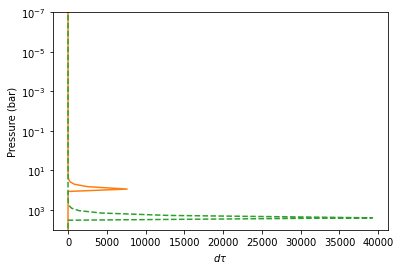
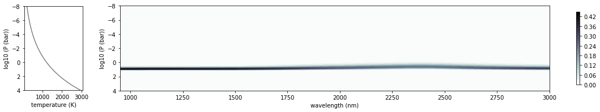
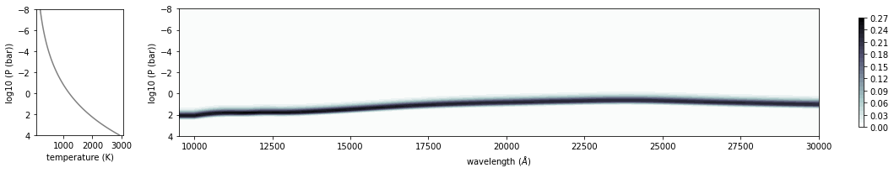
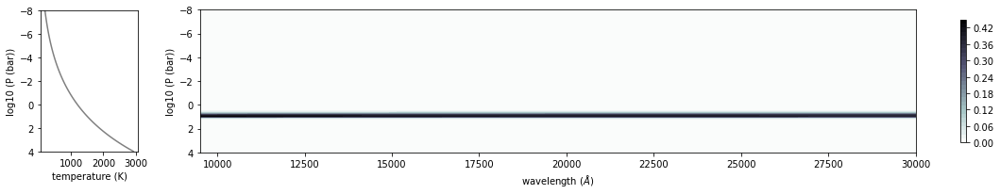
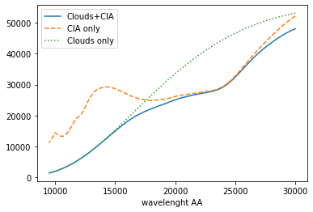

Ackerman and Marley Cloud Model
===============================

*Sep 6 (2021) Hajime Kawahara*

Here, we try to compute a cloud opacity using Ackerman and Marley Model.
We consider enstatite (MgSiO3) and Fe clouds.

.. code:: ipython3

    from exojax.atm import amclouds
    import jax.numpy as jnp
    import matplotlib.pyplot as plt
    import numpy as np

Setting a simple atmopheric model. We need the density of atmosphere.

.. code:: ipython3

    from exojax.spec import rtransfer as rt
    from exojax.utils.constants import kB,m_u
    
    NP=100
    Parr, dParr, k=rt.pressure_layer(NP=NP,logPtop=-8.,logPbtm=4.0)
    alpha=0.097
    T0=1200.
    Tarr=T0*(Parr)**alpha
    
    mu=2.0 # mean molecular weight
    R=kB/(mu*m_u)
    rho=Parr/(R*Tarr)

The solar abundance can be obtained using utils.zsol.nsol. Here, we
assume a maximum VMR for MgSiO3 and Fe from solar abundance.

.. code:: ipython3

    from exojax.utils.zsol import nsol
    n=nsol() #solar abundance
    VMR_enstatite=np.min([n["Mg"],n["Si"],n["O"]/3])
    VMR_Fe=n["Fe"]

Vapor saturation pressures can be obtained using atm.psat

.. code:: ipython3

    from exojax.atm.psat import Psat_enstatite_AM01, Psat_Fe_solid
    P_enstatite=Psat_enstatite_AM01(Tarr)
    P_fe_sol=Psat_Fe_solid(Tarr)

Compute a cloud base pressure.

.. code:: ipython3

    from exojax.atm.amclouds import get_Pbase
    Pbase_enstatite=get_Pbase(Parr,P_enstatite,VMR_enstatite)
    Pbase_Fe_sol=get_Pbase(Parr,P_fe_sol,VMR_Fe)

The cloud base is located at the intersection of a TP profile and the
vapor saturation puressure devided by VMR.

.. code:: ipython3

    import matplotlib.pyplot as plt
    plt.plot(Tarr,Parr,color="black",ls="dashed",label="T - P profile")
    plt.plot(Tarr,P_enstatite/VMR_enstatite,label="$P_{sat}/\\xi$ (enstatite)",color="gray")
    plt.axhline(Pbase_enstatite,color="gray",alpha=0.7,ls="dotted")
    plt.text(500,Pbase_enstatite*0.8,"cloud base (enstatite)",color="gray")
    
    plt.plot(Tarr,P_fe_sol/VMR_Fe,label="$P_{sat}/\\xi$ (Fe)",color="black")
    plt.axhline(Pbase_Fe_sol,color="black",alpha=0.7,ls="dotted")
    plt.text(500,Pbase_Fe_sol*0.8,"cloud base (Fe)",color="black")
    
    plt.yscale("log")
    plt.ylim(1.e-7,10000)
    plt.xlim(0,2700)
    plt.gca().invert_yaxis()
    plt.legend()
    plt.xlabel("Temperature (K)")
    plt.ylabel("Pressure (bar)")
    plt.savefig("pbase.pdf", bbox_inches="tight", pad_inches=0.0)
    plt.savefig("pbase.png", bbox_inches="tight", pad_inches=0.0)
    plt.show()

Compute VMRs of clouds. Because Parr is an array, we apply jax.vmap to
atm.amclouds.VMRclouds.

.. code:: ipython3

    from jax import vmap
    from exojax.atm.amclouds import VMRcloud
    
    get_VMRc=vmap(VMRcloud,(0,None,None,None),0)
    
    fsed=3
    VMRbase_enstatite=VMR_enstatite
    VMRc_enstatite=get_VMRc(Parr,Pbase_enstatite,fsed,VMR_enstatite)
    
    VMRbase_Fe=VMR_Fe
    VMRc_Fe=get_VMRc(Parr,Pbase_Fe_sol,fsed,VMR_Fe)

Here is the VMR distribution.

.. code:: ipython3

    import seaborn as sns
    import matplotlib.pyplot as plt
    
    plt.figure()
    plt.gca().get_xaxis().get_major_formatter().set_powerlimits([-3,3])
    plt.plot(VMRc_enstatite,Parr,color="gray",label="VMR (enstatite)")
    plt.plot(VMRc_Fe,Parr,color="black",ls="dashed",label="VMR (Fe)")
    
    plt.yscale("log")
    plt.ylim(1.e-7,10000)
    plt.gca().invert_yaxis()
    plt.legend()
    plt.xlabel("VMR (clouds)")
    plt.ylabel("Pressure (bar)")
    plt.savefig("vmrcloud.pdf", bbox_inches="tight", pad_inches=0.0)
    plt.savefig("vmrcloud.png", bbox_inches="tight", pad_inches=0.0)
    plt.show()

Compute dynamic viscosity in H2 atmosphere (cm/g/s)

.. code:: ipython3

    from exojax.atm.viscosity import eta_Rosner,calc_vfactor
    T=np.logspace(np.log10(1000),np.log10(2000))
    vfactor,Tr=calc_vfactor("H2")
    eta=eta_Rosner(T,vfactor)

.. code:: ipython3

    plt.plot(T,eta)
    plt.xscale("log")
    plt.yscale("log")
    plt.xlabel("Temperature (K)")
    plt.ylabel("Dynamic viscosity (cm/g/s)")
    plt.show()

The pressure scale height can be computed using atm.atmprof.Hatm.

.. code:: ipython3

    from exojax.atm.atmprof import Hatm
    T=1000 #K
    mu=2 #mean molecular weight
    print("scale height=",Hatm(1.e5,T,mu),"cm")

.. parsed-literal::

    scale height= 415722.9931793715 cm

We need a density of condensates.

.. code:: ipython3

    rhoc_enstatite=3.192 #g/cm3 Lodders and Fegley (1998)
    rhoc_Fe=7.875
    
    from exojax.spec.molinfo import molmass
    mu=molmass("H2")
    muc_enstatite=molmass("MgSiO3")
    muc_Fe=molmass("Fe")

Let’s compute the terminal velocity. We can compute the terminalvelocity of cloud particle using `atm.vterm.vf <../exojax/exojax.atm.html#exojax.atm.vterm.vf>`_. See ":doc:`../userguide/vterm`" in the userguide for the details.
vmap is again applied to
vf.

.. code:: ipython3

    from exojax.atm.viscosity import calc_vfactor, eta_Rosner
    from exojax.atm.vterm import vf
    from jax import vmap
    
    vfactor, trange=calc_vfactor(atm="H2")
    rarr=jnp.logspace(-6,-4,2000) #cm
    drho=rhoc_enstatite-rho
    eta_fid=eta_Rosner(Tarr,vfactor)
    
    g=1.e5
    vf_vmap=vmap(vf,(None,None,0,0,0))
    vfs=vf_vmap(rarr,g,eta_fid,drho,rho)

Kzz/L will be used to calibrate :math:`r_w`. following Ackerman and
Marley 2001

.. code:: ipython3

    Kzz=1.e5 #cm2/s
    sigmag=2.0
    alphav=1.3
    L=Hatm(g,1500,mu)

.. code:: ipython3

    Kzz/L

.. parsed-literal::

    0.16163647693888086

.. code:: ipython3

    for i in range(0,len(Tarr)):
        plt.plot(rarr,vfs[i,:],alpha=0.2,color="gray")
    plt.xscale("log")
    plt.yscale("log")
    plt.axhline(Kzz/L,label="Kzz/H",color="C2",ls="dotted")
    plt.ylabel("stokes terminal velocity (cm/s)")
    plt.xlabel("condensate size (cm)")

.. parsed-literal::

    Text(0.5, 0, 'condensate size (cm)')

Find the intersection.

.. code:: ipython3

    from exojax.atm.amclouds import find_rw
    vfind_rw=vmap(find_rw,(None,0,None),0)
    rw=vfind_rw(rarr,vfs,Kzz/L)

Then, :math:`r_g` can be computed from :math:`r_w` and other quantities.

.. code:: ipython3

    from exojax.atm.amclouds import get_rg 
    rg=get_rg(rw,fsed,alphav,sigmag)

.. code:: ipython3

    plt.plot(rg*1.e4,Parr,label="$r=r_g$",color="black")
    plt.plot(rw*1.e4,Parr,ls="dashed",label="$r=r_w$",color="black")
    plt.ylim(1.e-7,10000)
    plt.xlabel("$r$ (micron)")
    plt.ylabel("Pressure (bar)")
    plt.yscale("log")
    plt.savefig("rgrw.png")
    plt.legend()

.. parsed-literal::

    <matplotlib.legend.Legend at 0x7f82142a7f40>

We found here the particle size is basically sub-micron. So, we should
use the Rayleigh scattering. But, here, we try to use the geometric
cross section instead though this is wrong.

.. warning::
   
   The following lines will be updated using the Rayleigh scattering.
   This is just a test. 

.. code:: ipython3

    from exojax.atm.amclouds import dtau_cloudgeo
    
    dtau_enstatite=dtau_cloudgeo(Parr,muc_enstatite,rhoc_enstatite,mu,VMRc_enstatite,rg,sigmag,g)
    dtau_Fe=dtau_cloudgeo(Parr,muc_Fe,rhoc_Fe,mu,VMRc_Fe,rg,sigmag,g)

.. code:: ipython3

    plt.plot(dtau_enstatite,Parr,color="C1")
    plt.plot(dtau_Fe,Parr,color="C2",ls="dashed")
    plt.yscale("log")
    plt.ylim(1.e-7,10000)
    plt.xlabel("$d\\tau$")
    plt.ylabel("Pressure (bar)")
    #plt.xscale("log")
    plt.gca().invert_yaxis()

Let’s compare with CIA

.. code:: ipython3

    #CIA
    from exojax.spec.rtransfer import nugrid
    nus,wav,res=nugrid(9500,30000,1000,unit="AA")
    from exojax.spec import contdb
    cdbH2H2=contdb.CdbCIA('.database/H2-H2_2011.cia',nus)

.. parsed-literal::

    nugrid is log: mode= lpf
    WARNING: resolution may be too small. R= 868.7669794117727
    H2-H2

.. code:: ipython3

    from exojax.spec.rtransfer import dtauCIA
    mmw=2.33 #mean molecular weight
    mmrH2=0.74
    molmassH2=molmass("H2")
    vmrH2=(mmrH2*mmw/molmassH2) #VMR
    dtaucH2H2=dtauCIA(nus,Tarr,Parr,dParr,vmrH2,vmrH2,\
                mmw,g,cdbH2H2.nucia,cdbH2H2.tcia,cdbH2H2.logac)

.. code:: ipython3

    dtau=dtaucH2H2+dtau_enstatite[:,None]+dtau_Fe[:,None]

.. code:: ipython3

    from exojax.plot.atmplot import plotcf
    plotcf(nus,dtau,Tarr,Parr,dParr,unit="nm")
    plt.show()

.. code:: ipython3

    from exojax.plot.atmplot import plotcf
    plotcf(nus,dtaucH2H2,Tarr,Parr,dParr,unit="AA")
    plt.show()

.. code:: ipython3

    from exojax.plot.atmplot import plotcf
    plotcf(nus,dtau_enstatite[:,None]+np.zeros_like(dtaucH2H2),Tarr,Parr,dParr,unit="AA")
    plt.show()

.. code:: ipython3

    from exojax.spec import planck
    from exojax.spec.rtransfer import rtrun
    sourcef = planck.piBarr(Tarr,nus)
    F0=rtrun(dtau,sourcef)
    F0CIA=rtrun(dtaucH2H2,sourcef)
    F0cl=rtrun(dtau_enstatite[:,None]+np.zeros_like(dtaucH2H2),sourcef)

.. code:: ipython3

    plt.plot(wav[::-1],F0,label="Clouds+CIA")
    plt.plot(wav[::-1],F0CIA,label="CIA only",ls="dashed")
    plt.plot(wav[::-1],F0cl,label="Clouds only",ls="dotted")
    plt.xlabel("wavelenght AA")
    plt.legend()
    plt.show()

