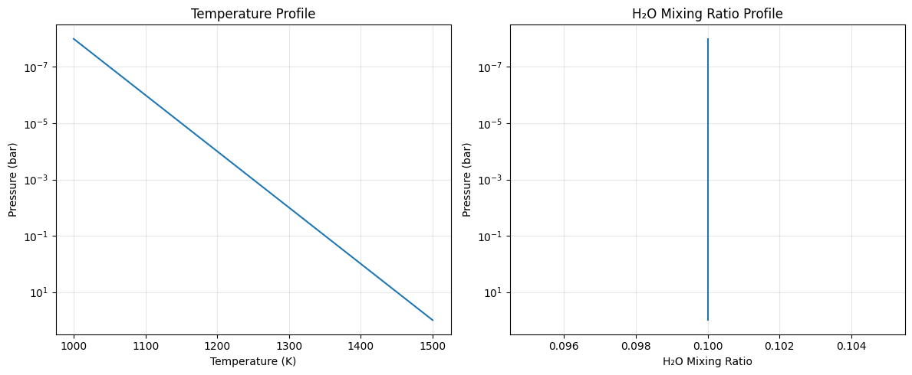
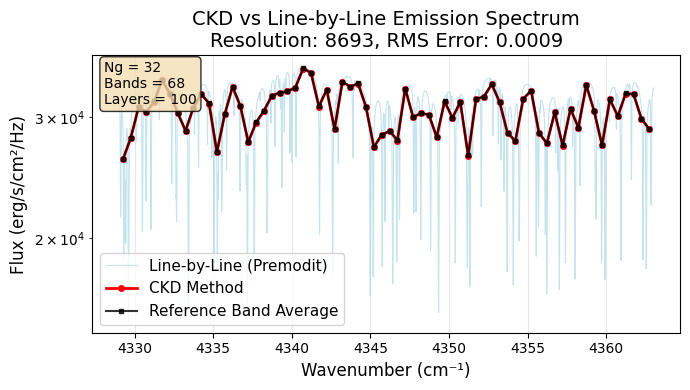

CKD Emission Tutorial: ArtEmisPure with OpaCKD
==============================================

Hajime Kawahara with Claude Code, July 1 (2025)

This tutorial demonstrates how to use the Correlated K-Distribution
(CKD) method for atmospheric emission calculations with ExoJAX. The CKD
method provides significant computational speedup by pre-computing
opacity tables and using quadrature integration over g-ordinates.

What is CKD?
------------

Correlated K-Distribution (CKD) is a method that: - Pre-computes opacity
tables on temperature-pressure grids - Groups spectral lines by
absorption strength (k-distribution) - Uses Gauss-Legendre quadrature to
integrate over g-ordinates - Provides band-averaged spectra with much
faster computation

.. code:: ipython3

    # Import required packages
    import numpy as np
    import matplotlib.pyplot as plt
    from jax import config
    
    # ExoJAX imports
    from exojax.test.emulate_mdb import mock_mdbExomol, mock_wavenumber_grid
    from exojax.opacity import OpaCKD, OpaPremodit
    from exojax.rt import ArtEmisPure
    
    # Enable 64-bit precision for accurate calculations
    config.update("jax_enable_x64", True)
    
    print("ExoJAX CKD Tutorial: Emission Spectroscopy")
    print("===========================================")

.. parsed-literal::

    ExoJAX CKD Tutorial: Emission Spectroscopy
    ===========================================

1. Setup Atmospheric Model and Molecular Database
-------------------------------------------------

First, we’ll set up our atmospheric model and molecular opacity
database.

.. code:: ipython3

    # Setup wavenumber grid and molecular database
    nu_grid, wav, res = mock_wavenumber_grid()
    print(f"Wavenumber grid: {len(nu_grid)} points from {nu_grid[0]:.1f} to {nu_grid[-1]:.1f} cm⁻¹")
    print(f"Spectral resolution: {res:.1f}")
    
    # Create mock H2O molecular database
    mdb = mock_mdbExomol("H2O")
    print(f"Molecular database: {mdb.nurange[0]:.1f} - {mdb.nurange[1]:.1f} cm⁻¹")
    
    # Setup atmospheric radiative transfer
    art = ArtEmisPure(
        pressure_top=1.0e-8, 
        pressure_btm=1.0e2, 
        nlayer=100, 
        nu_grid=nu_grid
    )
    
    print(f"Atmospheric layers: {art.nlayer}")
    print(f"Pressure range: {art.pressure_top:.1e} - {art.pressure_btm:.1e} bar")

.. parsed-literal::

    xsmode =  modit
    xsmode assumes ESLOG in wavenumber space: xsmode=modit
    Your wavelength grid is in ***  ascending  *** order
    The wavenumber grid is in ascending order by definition.
    Please be careful when you use the wavelength grid.
    Wavenumber grid: 20000 points from 4329.0 to 4363.0 cm⁻¹
    Spectral resolution: 2556525.8
    xsmode =  modit
    xsmode assumes ESLOG in wavenumber space: xsmode=modit
    Your wavelength grid is in ***  ascending  *** order
    The wavenumber grid is in ascending order by definition.
    Please be careful when you use the wavelength grid.
    radis== 0.15.2
    HITRAN exact name= H2(16O)
    radis engine =  vaex

.. parsed-literal::

    /home/kawahara/exojax/src/exojax/utils/grids.py:85: UserWarning: Both input wavelength and output wavenumber are in ascending order.
      warnings.warn(
    /home/kawahara/exojax/src/exojax/utils/grids.py:85: UserWarning: Both input wavelength and output wavenumber are in ascending order.
      warnings.warn(
    /home/kawahara/exojax/src/exojax/utils/grids.py:85: UserWarning: Both input wavelength and output wavenumber are in ascending order.
      warnings.warn(
    /home/kawahara/exojax/src/exojax/utils/grids.py:85: UserWarning: Both input wavelength and output wavenumber are in ascending order.
      warnings.warn(
    /home/kawahara/exojax/src/exojax/database/api.py:134: UserWarning: The current version of radis does not support broadf_download (requires >=0.16).
      warnings.warn(msg, UserWarning)
    /home/kawahara/exojax/src/exojax/utils/molname.py:197: FutureWarning: e2s will be replaced to exact_molname_exomol_to_simple_molname.
      warnings.warn(
    /home/kawahara/exojax/src/exojax/utils/molname.py:91: FutureWarning: exojax.utils.molname.exact_molname_exomol_to_simple_molname will be replaced to radis.api.exomolapi.exact_molname_exomol_to_simple_molname.
      warnings.warn(
    /home/kawahara/exojax/src/exojax/utils/molname.py:91: FutureWarning: exojax.utils.molname.exact_molname_exomol_to_simple_molname will be replaced to radis.api.exomolapi.exact_molname_exomol_to_simple_molname.
      warnings.warn(

.. parsed-literal::

    Molecule:  H2O
    Isotopologue:  1H2-16O
    Background atmosphere:  H2
    ExoMol database:  None
    Local folder:  H2O/1H2-16O/SAMPLE
    Transition files: 
    	 => File 1H2-16O__SAMPLE__04300-04400.trans
    Broadener:  H2
    Broadening code level: a1
    DataFrame (self.df) available.
    Molecular database: 4329.0 - 4363.0 cm⁻¹
    rtsolver:  ibased
    Intensity-based n-stream solver, isothermal layer (e.g. NEMESIS, pRT like)
    Atmospheric layers: 100
    Pressure range: 1.0e-08 - 1.0e+02 bar

2. Define Atmospheric Profile
-----------------------------

We’ll create a simple atmospheric profile with temperature and mixing
ratio.

.. code:: ipython3

    # Create atmospheric temperature profile
    Tarr = np.linspace(1000.0, 1500.0, 100)  # Linear temperature profile
    mmr_arr = np.full(100, 0.1)  # Constant H2O mixing ratio
    gravity = 2478.57  # Surface gravity (cm/s²)
    
    # Plot atmospheric profile
    fig, (ax1, ax2) = plt.subplots(1, 2, figsize=(12, 5))
    
    # Temperature profile
    ax1.semilogy(Tarr, art.pressure)
    ax1.set_xlabel('Temperature (K)')
    ax1.set_ylabel('Pressure (bar)')
    ax1.set_title('Temperature Profile')
    ax1.grid(True, alpha=0.3)
    ax1.invert_yaxis()
    
    # Mixing ratio profile
    ax2.semilogy(mmr_arr, art.pressure)
    ax2.set_xlabel('H₂O Mixing Ratio')
    ax2.set_ylabel('Pressure (bar)')
    ax2.set_title('H₂O Mixing Ratio Profile')
    ax2.grid(True, alpha=0.3)
    ax2.invert_yaxis()
    
    plt.tight_layout()
    plt.show()
    
    print(f"Temperature range: {np.min(Tarr):.0f} - {np.max(Tarr):.0f} K")
    print(f"H2O mixing ratio: {mmr_arr[0]:.1f} (constant)")

.. parsed-literal::

    Temperature range: 1000 - 1500 K
    H2O mixing ratio: 0.1 (constant)

3. Setup Standard Line-by-Line Opacity Calculator
-------------------------------------------------

First, we’ll compute the standard high-resolution spectrum using
line-by-line calculations.

.. code:: ipython3

    # Initialize standard opacity calculator (Premodit)
    base_opa = OpaPremodit(mdb, nu_grid, auto_trange=[500.0, 1500.0])
    
    # Compute line-by-line cross-sections and emission spectrum
    print("\nComputing line-by-line emission spectrum...")
    xsmatrix = base_opa.xsmatrix(Tarr, art.pressure)
    dtau = art.opacity_profile_xs(xsmatrix, mmr_arr, base_opa.mdb.molmass, gravity)
    F0_lbl = art.run(dtau, Tarr)
    
    print(f"Line-by-line spectrum computed!")

.. parsed-literal::

    OpaPremodit: params automatically set.
    default elower grid trange (degt) file version: 2
    Robust range: 485.7803992045456 - 1514.171191195336 K
    OpaPremodit: Tref_broadening is set to  866.0254037844389 K
    max value of  ngamma_ref_grid : 25.22068521876662
    min value of  ngamma_ref_grid : 14.029708313440466
    ngamma_ref_grid grid : [14.02970695 16.24522392 18.81060491 21.78110064 25.22068787]
    max value of  n_Texp_grid : 0.541
    min value of  n_Texp_grid : 0.216
    n_Texp_grid grid : [0.21599999 0.3785     0.54100007]

.. parsed-literal::

    uniqidx: 100%|██████████| 4/4 [00:00<00:00, 19021.79it/s]

.. parsed-literal::

    Premodit: Twt= 1108.7151960064205 K Tref= 570.4914318566549 K
    Making LSD:|####################| 100%
    
    Computing line-by-line emission spectrum...
    Line-by-line spectrum computed!

.. parsed-literal::

    

4. Setup CKD Opacity Calculator
-------------------------------

Now we’ll initialize the CKD opacity calculator and pre-compute the
opacity tables.

.. code:: ipython3

    # Initialize CKD opacity calculator
    opa_ckd = OpaCKD(
        base_opa,           # Base opacity calculator
        Ng=32,              # Number of g-ordinates for quadrature
        band_width=0.5      # Spectral band width
    )
    
    print(f"CKD Opacity Calculator Setup:")
    print(f"  Number of g-ordinates (Ng): {opa_ckd.Ng}")
    print(f"  Band width: {opa_ckd.band_width}")
    print(f"  Number of spectral bands: {len(opa_ckd.nu_bands)}")
    print(f"  Spectral range: {opa_ckd.nu_bands[0]:.1f} - {opa_ckd.nu_bands[-1]:.1f} cm⁻¹")
    
    # Pre-compute CKD tables on temperature-pressure grid
    print("\nPre-computing CKD tables...")
    NTgrid = 10
    NPgrid = 10
    T_grid = np.linspace(np.min(Tarr), np.max(Tarr), NTgrid)
    P_grid = np.logspace(
        np.log10(np.min(art.pressure)),
        np.log10(np.max(art.pressure)),
        NPgrid,
    )
    
    opa_ckd.precompute_tables(T_grid, P_grid)
    
    print(f"CKD tables computed on {NTgrid}×{NPgrid} T-P grid")
    print(f"Temperature grid: {T_grid[0]:.0f} - {T_grid[-1]:.0f} K")
    print(f"Pressure grid: {P_grid[0]:.1e} - {P_grid[-1]:.1e} bar")

.. parsed-literal::

    CKD Opacity Calculator Setup:
      Number of g-ordinates (Ng): 32
      Band width: 0.5
      Number of spectral bands: 68
      Spectral range: 4329.3 - 4362.8 cm⁻¹
    
    Pre-computing CKD tables...
    Generated g-grid: 32 points, range [0.0014, 0.9986]
    Processing 68 spectral bands...
      Band 1: [4329.0, 4329.5] cm⁻¹, 295 frequencies
      Band 2: [4329.5, 4330.0] cm⁻¹, 294 frequencies
      Band 3: [4330.0, 4330.5] cm⁻¹, 294 frequencies
      Band 4: [4330.5, 4331.0] cm⁻¹, 294 frequencies
      Band 5: [4331.0, 4331.5] cm⁻¹, 294 frequencies
      Band 6: [4331.5, 4332.0] cm⁻¹, 294 frequencies
      Band 7: [4332.0, 4332.5] cm⁻¹, 294 frequencies
      Band 8: [4332.5, 4333.0] cm⁻¹, 294 frequencies
      Band 9: [4333.0, 4333.5] cm⁻¹, 294 frequencies
      Band 10: [4333.5, 4334.0] cm⁻¹, 295 frequencies
      Band 11: [4334.0, 4334.5] cm⁻¹, 294 frequencies
      Band 12: [4334.5, 4335.0] cm⁻¹, 294 frequencies
      Band 13: [4335.0, 4335.5] cm⁻¹, 294 frequencies
      Band 14: [4335.5, 4336.0] cm⁻¹, 294 frequencies
      Band 15: [4336.0, 4336.5] cm⁻¹, 294 frequencies
      Band 16: [4336.5, 4337.0] cm⁻¹, 294 frequencies
      Band 17: [4337.0, 4337.5] cm⁻¹, 294 frequencies
      Band 18: [4337.5, 4338.0] cm⁻¹, 294 frequencies
      Band 19: [4338.0, 4338.5] cm⁻¹, 294 frequencies
      Band 20: [4338.5, 4339.0] cm⁻¹, 295 frequencies
      Band 21: [4339.0, 4339.5] cm⁻¹, 294 frequencies
      Band 22: [4339.5, 4340.0] cm⁻¹, 294 frequencies
      Band 23: [4340.0, 4340.5] cm⁻¹, 294 frequencies
      Band 24: [4340.5, 4341.0] cm⁻¹, 294 frequencies
      Band 25: [4341.0, 4341.5] cm⁻¹, 294 frequencies
      Band 26: [4341.5, 4342.0] cm⁻¹, 294 frequencies
      Band 27: [4342.0, 4342.5] cm⁻¹, 294 frequencies
      Band 28: [4342.5, 4343.0] cm⁻¹, 294 frequencies
      Band 29: [4343.0, 4343.5] cm⁻¹, 294 frequencies
      Band 30: [4343.5, 4344.0] cm⁻¹, 295 frequencies
      Band 31: [4344.0, 4344.5] cm⁻¹, 294 frequencies
      Band 32: [4344.5, 4345.0] cm⁻¹, 294 frequencies
      Band 33: [4345.0, 4345.5] cm⁻¹, 294 frequencies
      Band 34: [4345.5, 4346.0] cm⁻¹, 294 frequencies
      Band 35: [4346.0, 4346.5] cm⁻¹, 294 frequencies
      Band 36: [4346.5, 4347.0] cm⁻¹, 294 frequencies
      Band 37: [4347.0, 4347.5] cm⁻¹, 294 frequencies
      Band 38: [4347.5, 4348.0] cm⁻¹, 294 frequencies
      Band 39: [4348.0, 4348.5] cm⁻¹, 295 frequencies
      Band 40: [4348.5, 4349.0] cm⁻¹, 294 frequencies
      Band 41: [4349.0, 4349.5] cm⁻¹, 294 frequencies
      Band 42: [4349.5, 4350.0] cm⁻¹, 294 frequencies
      Band 43: [4350.0, 4350.5] cm⁻¹, 294 frequencies
      Band 44: [4350.5, 4351.0] cm⁻¹, 294 frequencies
      Band 45: [4351.0, 4351.5] cm⁻¹, 294 frequencies
      Band 46: [4351.5, 4352.0] cm⁻¹, 294 frequencies
      Band 47: [4352.0, 4352.5] cm⁻¹, 294 frequencies
      Band 48: [4352.5, 4353.0] cm⁻¹, 294 frequencies
      Band 49: [4353.0, 4353.5] cm⁻¹, 295 frequencies
      Band 50: [4353.5, 4354.0] cm⁻¹, 294 frequencies
      Band 51: [4354.0, 4354.5] cm⁻¹, 294 frequencies
      Band 52: [4354.5, 4355.0] cm⁻¹, 294 frequencies
      Band 53: [4355.0, 4355.5] cm⁻¹, 294 frequencies
      Band 54: [4355.5, 4356.0] cm⁻¹, 294 frequencies
      Band 55: [4356.0, 4356.5] cm⁻¹, 294 frequencies
      Band 56: [4356.5, 4357.0] cm⁻¹, 294 frequencies
      Band 57: [4357.0, 4357.5] cm⁻¹, 294 frequencies
      Band 58: [4357.5, 4358.0] cm⁻¹, 294 frequencies
      Band 59: [4358.0, 4358.5] cm⁻¹, 295 frequencies
      Band 60: [4358.5, 4359.0] cm⁻¹, 294 frequencies
      Band 61: [4359.0, 4359.5] cm⁻¹, 294 frequencies
      Band 62: [4359.5, 4360.0] cm⁻¹, 294 frequencies
      Band 63: [4360.0, 4360.5] cm⁻¹, 294 frequencies
      Band 64: [4360.5, 4361.0] cm⁻¹, 294 frequencies
      Band 65: [4361.0, 4361.5] cm⁻¹, 294 frequencies
      Band 66: [4361.5, 4362.0] cm⁻¹, 294 frequencies
      Band 67: [4362.0, 4362.5] cm⁻¹, 294 frequencies
      Band 68: [4362.5, 4363.0] cm⁻¹, 295 frequencies
    Creating CKD table info...
    CKD precomputation complete! Ready for interpolation.
    Table dimensions: T=10, P=10, g=32, bands=68
    CKD tables computed on 10×10 T-P grid
    Temperature grid: 1000 - 1500 K
    Pressure grid: 1.0e-08 - 1.0e+02 bar

5. Compute CKD Emission Spectrum
--------------------------------

Now we’ll compute the emission spectrum using the CKD method.

.. code:: ipython3

    # Get CKD cross-section tensor and compute CKD spectrum
    print("Computing CKD emission spectrum...")
    xs_ckd = opa_ckd.xstensor_ckd(Tarr, art.pressure)
    dtau_ckd = art.opacity_profile_xs_ckd(
        xs_ckd, mmr_arr, base_opa.mdb.molmass, gravity
    )
    
    print(f"CKD optical depth tensor shape: {dtau_ckd.shape}")
    print(f"  Layers: {dtau_ckd.shape[0]}")
    print(f"  G-ordinates: {dtau_ckd.shape[1]}")
    print(f"  Spectral bands: {dtau_ckd.shape[2]}")
    
    # Run CKD emission calculation
    F0_ckd = art.run_ckd(
        dtau_ckd, Tarr, opa_ckd.ckd_info.weights, opa_ckd.nu_bands
    )
    
    print(f"\nCKD spectrum computed!")
    print(f"CKD flux shape: {F0_ckd.shape}")
    print(f"CKD flux range: [{np.min(F0_ckd):.2e}, {np.max(F0_ckd):.2e}] erg/s/cm²/Hz")

.. parsed-literal::

    Computing CKD emission spectrum...
    CKD optical depth tensor shape: (100, 32, 68)
      Layers: 100
      G-ordinates: 32
      Spectral bands: 68
    
    CKD spectrum computed!
    CKD flux shape: (68,)
    CKD flux range: [2.61e+04, 3.53e+04] erg/s/cm²/Hz

6. Compute Reference Band Averages
----------------------------------

To validate the CKD results, we’ll compute reference band averages from
the line-by-line spectrum.

.. code:: ipython3

    # Compute reference band averages by direct integration
    print("Computing reference band averages...")
    flux_average_reference = []
    band_edges = opa_ckd.band_edges
    
    for band_idx in range(len(opa_ckd.nu_bands)):
        # Create mask for frequencies within this band
        mask = (band_edges[band_idx, 0] <= nu_grid) & (
            nu_grid < band_edges[band_idx, 1]
        )
        # Arithmetic average over the band
        flux_average_reference.append(np.mean(F0_lbl[mask]))
    
    flux_average_reference = np.array(flux_average_reference)
    
    print(f"Reference band averages computed for {len(flux_average_reference)} bands")

.. parsed-literal::

    Computing reference band averages...
    Reference band averages computed for 68 bands

7. Compare Results and Validate Accuracy
----------------------------------------

Let’s compare the CKD results with both the high-resolution line-by-line
spectrum and the reference band averages.

.. code:: ipython3

    # Calculate accuracy metrics
    res = np.sqrt(np.sum((F0_ckd - flux_average_reference)**2)/len(F0_ckd))/np.mean(flux_average_reference)
    max_relative_error = np.max(np.abs((F0_ckd - flux_average_reference) / flux_average_reference))
    mean_relative_error = np.mean(np.abs((F0_ckd - flux_average_reference) / flux_average_reference))
    
    print(f"CKD Accuracy Assessment:")
    print(f"  RMS relative error: {res:.4f}")
    print(f"  Maximum relative error: {max_relative_error:.4f}")
    print(f"  Mean relative error: {mean_relative_error:.4f}")
    
    # Calculate spectral resolution
    resolution = opa_ckd.nu_bands[0]/(band_edges[0, 1] - band_edges[0, 0])
    print(f"  Effective resolution: {resolution:.1f}")
    
    # Check if accuracy meets typical requirements
    accuracy_threshold = 0.05  # 5% error threshold
    if res < accuracy_threshold:
        print(f"✓ CKD accuracy meets requirement (< {accuracy_threshold:.1%})")
    else:
        print(f"⚠ CKD error exceeds threshold ({accuracy_threshold:.1%})")

.. parsed-literal::

    CKD Accuracy Assessment:
      RMS relative error: 0.0009
      Maximum relative error: 0.0018
      Mean relative error: 0.0008
      Effective resolution: 8692.6
    ✓ CKD accuracy meets requirement (< 5.0%)

8. Visualize Results
--------------------

Finally, let’s create a comprehensive comparison plot showing all three
spectra.

.. code:: ipython3

    # Create comparison plot
    plt.figure(figsize=(7, 4))
    
    # Plot line-by-line spectrum (high resolution)
    plt.plot(nu_grid, F0_lbl, 
             label="Line-by-Line (Premodit)", 
             alpha=0.7, linewidth=0.8, color='lightblue')
    
    # Plot CKD spectrum
    plt.plot(opa_ckd.nu_bands, F0_ckd, 
             'o-', label="CKD Method", 
             markersize=4, linewidth=2, color='red')
    
    # Plot reference band averages
    plt.plot(opa_ckd.nu_bands, flux_average_reference, 
             's-', label="Reference Band Average", 
             markersize=3, linewidth=1.5, color='black', alpha=0.8)
    
    plt.xlabel('Wavenumber (cm⁻¹)', fontsize=12)
    plt.ylabel('Flux (erg/s/cm²/Hz)', fontsize=12)
    plt.title(f'CKD vs Line-by-Line Emission Spectrum\n'
              f'Resolution: {resolution:.0f}, RMS Error: {res:.4f}', fontsize=14)
    plt.legend(fontsize=11)
    plt.grid(True, alpha=0.3)
    plt.yscale('log')
    
    # Add text box with key parameters
    textstr = f'Ng = {opa_ckd.Ng}\nBands = {len(opa_ckd.nu_bands)}\nLayers = {art.nlayer}'
    props = dict(boxstyle='round', facecolor='wheat', alpha=0.8)
    plt.text(0.02, 0.98, textstr, transform=plt.gca().transAxes, fontsize=10,
             verticalalignment='top', bbox=props)
    
    plt.tight_layout()
    plt.show()
    
    # Save the figure
    plt.savefig(f"ckd_emission_comparison_res{resolution:.0f}.png", 
                dpi=300, bbox_inches='tight')
    print(f"Figure saved as: ckd_emission_comparison_res{resolution:.0f}.png")

.. parsed-literal::

    Figure saved as: ckd_emission_comparison_res8693.png

.. parsed-literal::

    <Figure size 640x480 with 0 Axes>

9. Performance Comparison
-------------------------

Let’s demonstrate the computational speedup achieved by the CKD method.

.. code:: ipython3

    import time
    
    # Time line-by-line calculation
    start_time = time.time()
    for _ in range(5):  # Multiple runs for better timing
        xsmatrix = base_opa.xsmatrix(Tarr, art.pressure)
        dtau = art.opacity_profile_xs(xsmatrix, mmr_arr, base_opa.mdb.molmass, gravity)
        F0_lbl_timing = art.run(dtau, Tarr)
    lbl_time = (time.time() - start_time) / 5
    
    # Time CKD calculation (excluding table pre-computation)
    start_time = time.time()
    for _ in range(5):
        xs_ckd = opa_ckd.xstensor_ckd(Tarr, art.pressure)
        dtau_ckd = art.opacity_profile_xs_ckd(xs_ckd, mmr_arr, base_opa.mdb.molmass, gravity)
        F0_ckd_timing = art.run_ckd(dtau_ckd, Tarr, opa_ckd.ckd_info.weights, opa_ckd.nu_bands)
    ckd_time = (time.time() - start_time) / 5
    
    speedup = lbl_time / ckd_time
    
    print(f"Performance Comparison:")
    print(f"  Line-by-Line time: {lbl_time:.3f} seconds")
    print(f"  CKD time: {ckd_time:.3f} seconds")
    print(f"  Speedup factor: {speedup:.1f}×")
    print(f"  Spectral points: {len(nu_grid)} → {len(opa_ckd.nu_bands)} ({len(opa_ckd.nu_bands)/len(nu_grid):.1%})")

.. parsed-literal::

    Performance Comparison:
      Line-by-Line time: 0.130 seconds
      CKD time: 0.075 seconds
      Speedup factor: 1.7×
      Spectral points: 20000 → 68 (0.3%)

Summary
-------

This tutorial demonstrated how to use the CKD method with ExoJAX for
emission spectroscopy:

Key Steps:
~~~~~~~~~~

1. **Setup**: Initialize atmospheric model and molecular database
2. **Profile**: Define temperature and mixing ratio profiles
3. **Line-by-Line**: Compute high-resolution reference spectrum
4. **CKD Setup**: Initialize CKD calculator and pre-compute tables
5. **CKD Calculation**: Compute band-averaged spectrum using CKD
6. **Validation**: Compare CKD results with reference data
7. **Visualization**: Plot comparison and analyze accuracy

