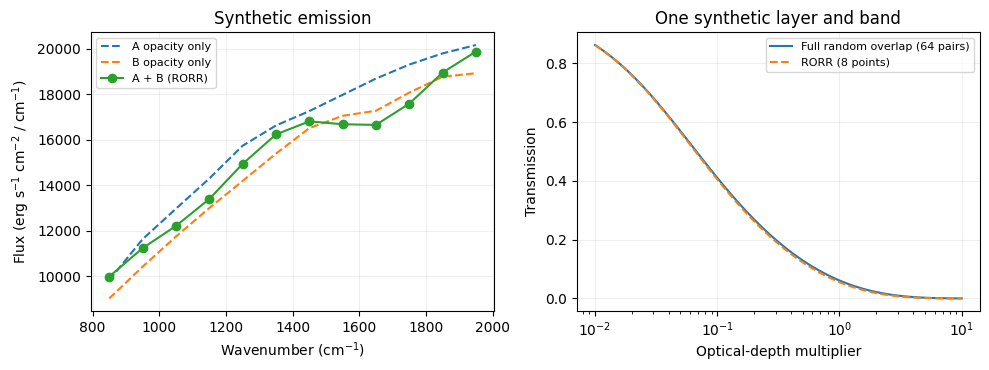

CKD mixtures with random overlap, resorting and rebinning
=========================================================

This tutorial combines two species with ``mix_ckd_rorr``, computes an
emission spectrum, and checks abundance and temperature derivatives. It
runs offline using small **synthetic CKD tables**. Species A and B are
invented absorbers; their spectra and errors are not predictions for
real molecules.

Why mixing needs an overlap assumption
--------------------------------------

In line-by-line calculations, optical depths add at the same wavenumber.
CKD instead sorts absorption strengths within each band. Its cumulative
probability coordinate, :math:`g`, no longer identifies a wavenumber.
Adding independently tabulated species at the same :math:`g` assumes
that their strongest and weakest absorption coincide.

**Random overlap** assumes independent absorption strengths within each
band. For two species, all pairs have

.. math:: \tau_{ij} = \tau_{A,i} + \tau_{B,j},\qquad p_{ij}=w_iw_j.

No random numbers are used. Keeping every combination would require
:math:`N_g^S` points for :math:`S` species. **RORR** sorts each pairwise
mixture by optical depth and averages it back to :math:`N_g` points
before adding the next species. See `Amundsen et al. (2017), Section
3.2 <https://arxiv.org/abs/1610.01389>`__ for the overlap methods and
their assumptions.

The output points are weighted means over cumulative probability
intervals whose widths are the original ``weights``. They are not
samples of a new distribution evaluated at the original Gauss-Legendre
nodes. Pass the same weights to radiative transfer. This construction
preserves mean optical depth, but not generally transmission, which
depends on :math:`\exp(-\tau)`.

.. code:: ipython3

    import numpy as np
    import matplotlib.pyplot as plt
    import jax
    import jax.numpy as jnp

    from exojax.opacity import OpaCKD
    from exojax.opacity.ckd.contracts import CKDTableInfo
    from exojax.opacity.ckd.core import gauss_legendre_grid
    from exojax.opacity.ckd.mixing import (
        mix_ckd_rorr,
        validate_ckd_mixture_tables,
    )
    from exojax.rt import ArtEmisPure
    from exojax.rt.layeropacity import layer_optical_depth_ckd

    jax.config.update("jax_enable_x64", True)

Prepare compatible tables
-------------------------

All species must have the same number of points, normalized positive
weights, band edges, and ordered band centers. Their temperature and
pressure grids can differ: each table is interpolated independently. Run
``validate_ckd_mixture_tables`` once during setup, outside ``jax.jit``.

For this offline example only, we populate ``OpaCKD.load_only()`` with
explicit ``CKDTableInfo`` objects. In applications, load saved molecular
tables with ``OpaCKD.from_saved_tables`` as shown at the end.

.. code:: ipython3

    ng = 8
    ggrid, weights = gauss_legendre_grid(ng)
    edges = jnp.linspace(800.0, 2000.0, 13)  # Wavenumber, cm^-1
    band_edges = jnp.stack((edges[:-1], edges[1:]), axis=1)
    nu_bands = jnp.mean(band_edges, axis=1)

    def synthetic_table(species):
        # These smooth distributions have no associated molecular line list.
        tgrid = jnp.array([450.0, 1450.0] if species == 0
                          else [400.0, 850.0, 1500.0])
        pgrid = jnp.array([1.e-4, 0.02, 30.0] if species == 0
                          else [1.e-4, 30.0])
        center = 1100.0 if species == 0 else 1650.0
        band_shape = 1.6 * jnp.exp(-((nu_bands - center) / 220.0) ** 2)
        log_k = (
            -56.6 + band_shape[None, None, None, :]
            + (2.4 + 0.7 * species) * (2.0 * ggrid[None, None, :, None] - 1.0)
            + (0.25 - 0.6 * species) * (tgrid[:, None, None, None] / 1000.0 - 1.0)
            + (0.12 + 0.04 * species) * jnp.log(pgrid[None, :, None, None])
        )
        opa = OpaCKD.load_only()
        opa.ckd_info = CKDTableInfo(
            log_kggrid=log_k, ggrid=ggrid, weights=weights,
            T_grid=tgrid, P_grid=pgrid,
            nu_bands=nu_bands, band_edges=band_edges,
        )
        opa.Ng = ng
        opa.nu_bands = nu_bands
        opa.band_edges = band_edges
        opa.ready = True
        return opa

    opas = [synthetic_table(0), synthetic_table(1)]  # Keep this order fixed.
    validate_ckd_mixture_tables(opas)
    for label, opa in zip(("A", "B"), opas):
        print(f"Species {label}: (NT, NP, Ng, Nband) = {opa.ckd_info.log_kggrid.shape}")

.. parsed-literal::

    Species A: (NT, NP, Ng, Nband) = (2, 3, 8, 12)
    Species B: (NT, NP, Ng, Nband) = (3, 2, 8, 12)

Convert each species to optical depth, then mix
-----------------------------------------------

``mix_ckd_rorr`` accepts optical depths of shape
``(Nspecies, Nlayer, Ng, Nband)`` and returns ``(Nlayer, Ng, Nband)``.
Inputs must be finite and nonnegative. Ordinary CKD tables are sorted
along the ``Ng`` axis for each species, layer, and band.

For a volume mixing ratio (VMR), ``layer_optical_depth_ckd`` requires
the **mean molecular weight of the atmosphere**. For a mass mixing ratio
(MMR), it requires the **molecular mass of the absorber**. Mixing
optical depths keeps this conversion separate from the RORR step.

Here the background gas has mean molecular weight 2.3, and the invented
absorbers have molecular masses 18 and 44. Their VMRs determine the
background fraction and the atmospheric mean molecular weight. The
chosen VMRs sum to less than one.

.. code:: ipython3

    art = ArtEmisPure(
        pressure_top=0.002, pressure_btm=3.0, nlayer=8,
        nu_grid=nu_bands, nstream=4,
    )
    base_temperature = jnp.linspace(650.0, 1250.0, art.nlayer)
    molecular_masses = jnp.array([18.0, 44.0])
    background_mmw = 2.3
    gravity = 1000.0  # cm s^-2

    def species_optical_depths(log_vmr, log_temperature_scale):
        vmr = jnp.exp(log_vmr)
        temperature = base_temperature * jnp.exp(log_temperature_scale)
        mmw = background_mmw * (1.0 - jnp.sum(vmr)) + vmr @ molecular_masses
        dtau_species = jnp.stack([
            layer_optical_depth_ckd(
                art.dParr,
                opa.xstensor_ckd(temperature, art.pressure),
                vmr[i], mmw, gravity,
            )
            for i, opa in enumerate(opas)
        ])
        return dtau_species, temperature, mmw

    log_vmr = jnp.log(jnp.array([0.007, 0.012]))
    dtau_species, temperature, mmw = species_optical_depths(log_vmr, 0.0)
    dtau_mix = mix_ckd_rorr(dtau_species, weights)
    flux_mix = art.run_ckd(dtau_mix, temperature, weights, nu_bands)

    # The weighted mean optical depth is conserved independently in every layer/band.
    mean_before = jnp.einsum("slgb,g->lb", dtau_species, weights)
    mean_after = jnp.einsum("lgb,g->lb", dtau_mix, weights)
    np.testing.assert_allclose(mean_after, mean_before, rtol=1.e-12, atol=1.e-12)
    print("Species / mixture shapes:", dtau_species.shape, dtau_mix.shape)
    print(f"Atmospheric mean molecular weight: {float(mmw):.4f}")

.. parsed-literal::

    rtsolver:  ibased
    Intensity-based n-stream solver, isothermal layer (e.g. NEMESIS, pRT like)
    Species / mixture shapes: (2, 8, 8, 12) (8, 8, 12)
    Atmospheric mean molecular weight: 2.9103

Inspect the spectrum and the compression error
----------------------------------------------

The left panel compares the mixture to calculations with just one
species’ opacity, holding the atmosphere and its mean molecular weight
fixed. These curves illustrate the workflow, not real molecular spectra.

The right panel isolates compression error in **one layer and one
band**. Its full random-overlap reference uses all :math:`N_g^2` pairs,
whereas RORR uses :math:`N_g` means. A dimensionless path multiplier
scales the optical depth. This comparison does not measure the accuracy
of the random-overlap assumption against a line-by-line mixture.

.. code:: ipython3

    flux_single = [
        art.run_ckd(dtau, temperature, weights, nu_bands)
        for dtau in dtau_species
    ]
    layer, band = -1, 5
    pair_tau = (
        dtau_species[0, layer, :, band][:, None]
        + dtau_species[1, layer, :, band][None, :]
    )
    pair_weights = weights[:, None] * weights[None, :]
    path = jnp.logspace(-2.0, 1.0, 100)
    transmission_ro = jnp.sum(
        pair_weights[None, :, :] * jnp.exp(-path[:, None, None] * pair_tau),
        axis=(1, 2),
    )
    transmission_rorr = jnp.sum(
        weights[None, :] * jnp.exp(-path[:, None] * dtau_mix[layer, :, band]),
        axis=1,
    )

    fig, axes = plt.subplots(1, 2, figsize=(10, 3.8))
    for label, flux in zip(("A opacity only", "B opacity only"), flux_single):
        axes[0].plot(nu_bands, flux, "--", label=label)
    axes[0].plot(nu_bands, flux_mix, "o-", label="A + B (RORR)")
    axes[0].set(xlabel=r"Wavenumber (cm$^{-1}$)",
                ylabel=r"Flux (erg s$^{-1}$ cm$^{-2}$ / cm$^{-1}$)",
                title="Synthetic emission")
    axes[1].semilogx(path, transmission_ro, label="Full random overlap (64 pairs)")
    axes[1].semilogx(path, transmission_rorr, "--", label="RORR (8 points)")
    axes[1].set(xlabel="Optical-depth multiplier", ylabel="Transmission",
                title="One synthetic layer and band")
    for ax in axes:
        ax.legend(fontsize=8)
        ax.grid(alpha=0.2)
    fig.tight_layout()
    plt.show()
    print("Maximum absolute transmission compression error in this example:",
          f"{float(jnp.max(jnp.abs(transmission_rorr - transmission_ro))):.3e}")

.. parsed-literal::

    Maximum absolute transmission compression error in this example: 6.347e-03

Differentiate the full forward model
------------------------------------

Keep interpolation, VMR-to-optical-depth conversion, mixing, and
radiative transfer inside the differentiated function. The example below
checks derivatives of the log summed band flux with respect to log VMR
A, log VMR B, and log temperature scale. The mean molecular weight
changes with VMR and contributes to these derivatives.

For fixed sorting order and fixed weights, rebinning is linear in the
input optical depths. JAX differentiates through the selected order.
**The model is not globally smooth**: sorting-order changes and ties can
give different one-sided derivatives. Interpolation also has slope
changes at table grid boundaries; outside a table, the existing
interpolator uses boundary values. Check gradients away from these
boundaries and stay within the table’s physical range when fitting data.

.. code:: ipython3

    @jax.jit
    def log_flux_sum(parameters):
        dtau, temperature, _ = species_optical_depths(parameters[:2], parameters[2])
        mixed = mix_ckd_rorr(dtau, weights)
        flux = art.run_ckd(mixed, temperature, weights, nu_bands)
        return jnp.log(jnp.sum(flux))

    parameters = jnp.concatenate((log_vmr, jnp.array([0.0])))
    automatic = jax.jit(jax.grad(log_flux_sum))(parameters)
    step = 1.e-5
    directions = jnp.eye(len(parameters))
    finite_difference = jnp.stack([
        (log_flux_sum(parameters + step * direction)
         - log_flux_sum(parameters - step * direction)) / (2.0 * step)
        for direction in directions
    ])
    np.testing.assert_allclose(automatic, finite_difference, rtol=2.e-5, atol=1.e-8)
    print("                         autodiff     finite difference")
    for label, ad, fd in zip(("log VMR A", "log VMR B", "log T scale"),
                             automatic, finite_difference):
        print(f"{label:>15s}       {float(ad): .8f}       {float(fd): .8f}")

.. parsed-literal::

                             autodiff     finite difference
          log VMR A       -0.04015220       -0.04015220
          log VMR B       -0.05325233       -0.05325233
        log T scale        2.36654619        2.36654619

An exactly absent species can be represented by an all-zero optical
depth tensor: the mixer does not take logarithms or divide by the total
abundance. A log-VMR parameterization itself only represents positive
VMRs, so use a linear abundance parameter when testing the zero
boundary. Do not remove a species with an abundance-dependent Python
branch inside a fit. Zero-opacity ties retain the same
piecewise-derivative limitation as other ties.

.. code:: ipython3

    transparent_second = dtau_species.at[1].set(0.0)
    np.testing.assert_allclose(
        mix_ckd_rorr(transparent_second, weights), dtau_species[0],
        rtol=1.e-12, atol=1.e-12,
    )
    print("A transparent second species leaves the first distribution unchanged.")

.. parsed-literal::

    A transparent second species leaves the first distribution unchanged.

Use molecular tables and assess accuracy
----------------------------------------

Replace the synthetic ``opas`` with compatible saved tables, for
example:

.. code:: python

   opas = [OpaCKD.from_saved_tables(path) for path in species_table_paths]
   validate_ckd_mixture_tables(opas)
   weights = opas[0].ckd_info.weights
   nu_bands = opas[0].nu_bands

Set the molecular masses, abundance profiles, and atmospheric model for
these species. Evaluate each table on the same atmospheric layers, stack
the resulting optical depths, and call the same mixer.
``ArtTransPure.run_ckd`` can also consume the mixed tensor and weights;
supply its temperature, mean molecular weight, radius, and gravity
arguments as in the CKD transmission tutorial.

For precomputation, use identical spectral coverage, band edges,
quadrature settings, and band ordering across species. Matching band
centers alone is insufficient. The pressure-broadening assumptions
belong to the individual tables: mixing cannot change them to match a
new background composition.

If a continuum such as CIA is adequately constant within each band, add
its layer optical depth to every mixed point before transfer:

.. code:: python

   dtau_total = mix_ckd_rorr(dtau_species, weights) + dtau_continuum[:, None, :]

Here ``dtau_continuum`` has shape ``(Nlayer, Nband)`` and already
includes its abundance and density factors. A continuum varying strongly
within a band needs a more resolved treatment.

Keep these sources of error separate:

-  **Overlap assumption:** independent molecular distributions do not
   recover the actual line positions. Compare against a line-by-line
   mixture for representative temperatures, pressures, and compositions.
-  **Compression:** compare RORR with full random overlap for a few
   species and vary ``Ng``. Mean optical-depth conservation alone is
   insufficient to establish spectral accuracy.
-  **Vertical correlation:** using the same mixed probability rank
   across layers assumes correlated absorption ordering. Test cases
   where different species dominate at different heights.

For three or more species, intermediate compression makes the result
depend on the input species order. Choose and retain a fixed order;
sorting species dynamically by abundance introduces additional changes
in the forward model. The finite-difference agreement above verifies the
local derivative of this approximate model, not its accuracy for a real
atmosphere.
