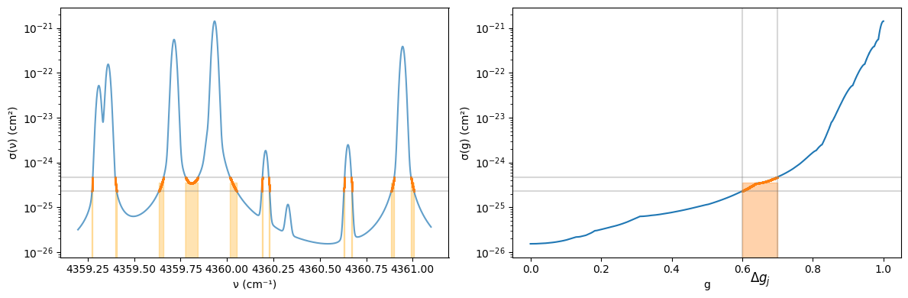
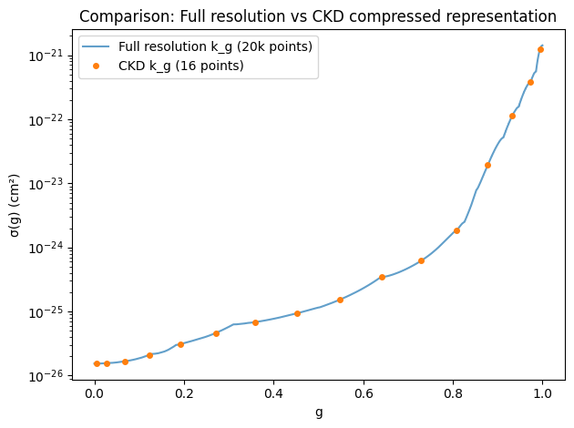
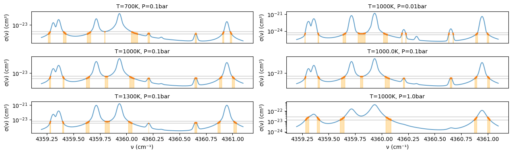

Correlated-k Distribution
=========================

The Correlated-k Distribution (CKD) method originated in the 1960s when
Malkmus introduced the probability distribution of absorption
coefficients and proposed the “k-distribution method” for averaging
molecular band absorption [1]. Subsequently, in 1989, Goody et
al. presented the idea of rearranging k values to preserve spectral
order even when the atmosphere is vertically inhomogeneous, which became
the core of the technique called “correlated” k-distribution [2]. In
1991, Lacis & Oinas organized the specific implementation for radiative
transfer equations and performed accuracy verification, leading to its
adoption as a standard method in climate models and planetary
atmospheric calculations [3]. A good reference for correlated
k-distribution can be found, for example, in Liou’s textbook[4].

-  [1] Wo Malkmus. Random lorentz band model with exponential-tailed s-
   1 line-intensity distribution function. Journal of the Optical
   Society of America, 57(3):323–329, 196
-  [2] Richard Goody, Robert West, Luke Chen, and David Crisp. The
   correlated-k method for radiation calculations in nonhomogeneous
   atmospheres. JQSRT, 42:539–550, December 1989.
-  [3] A. A. Lacis and V. Oinas. A description of the correlated-k
   distribution method for modelling nongray gaseous absorption, thermal
   emission, and multiple scattering in vertically inhomogeneous
   atmospheres. JGR, 96:9027–9064, May 1991.
-  [4] An introduction to atmospheric radiation, volume 84. Elsevier,
   2002.

The cross-section σ(ν) (or opacity) is a non-injective function when
viewed over a wavenumber region broader than the line width, meaning
that multiple ν values exist that take the same value σ’ = σ(ν) (Figure
1, left). The non-injectivity increases as the wavelength range expands.
Therefore, it is natural to describe information based on the values of
σ rather than ν. For example, consider integrating a non-negative
function f(σ(ν)) ≥ 0 over some wavenumber width. In Riemann integration,
this is:

:math:`I = \int_\mathrm{min}^\mathrm{max} f(\sigma(\nu)) d \nu \approx \sum_i f(\sigma(\nu_i)) \Delta \nu_i`

where the domain is divided in the ν direction and summed. However, as
non-injectivity increases, the same σ values must be summed repeatedly.
Therefore, we consider performing integration by focusing on the measure
of the range. Now, we divide the range into mutually non-overlapping
sets. For example, let Aⱼ be the set of domain ν that has a range within
the infinitesimal region Δσ containing σ = σⱼ. The range can be
expressed as:

:math:`V = \bigcup_{j=0}^{n} A_j`

Using the characteristic function for set A:

:math:`\chi_A (\nu) = \begin{cases}  1, & \text{if } \nu \in A \\  0, & \text{if } \nu \notin A \end{cases}`

we consider the (non-negative) simple function:

:math:`s(\nu) = \sum_j^n f_j \chi_{A_j}(\nu)`

where 0 ≤ f₀ < f₁ < ⋯ < fₙ. The Lebesgue integral is defined as:

:math:`\int_V s(\nu) d \nu = \sum_{j=0}^n f_j \, m_d (A_j)`

where m_d(Aⱼ) is the measure of set Aⱼ. Using this concept, we consider
performing integration. For the range sets, we bin the range from
minimum to maximum values and order them as j = 0, 1, ⋯ from bottom to
top. Let σⱼ be the representative value of each set. By approximating
f(σ(ν)) with a simple function:

:math:`f(\sigma(\nu)) \approx s(\nu) = \sum_j^n f(\sigma_j) \chi_{A_j}(\nu)`

we get:

:math:`\int_V f(\sigma(\nu)) d \nu \approx \int_V s(\nu) d \nu = \sum_j f(\sigma_j) \Delta m_j \\  = (\nu_\mathrm{max} - \nu_\mathrm{min}) \sum_j f(\sigma_j) \Delta g_j`

where we set the measure of each set as Δmⱼ = (νₘₐₓ - νₘᵢₙ) Δgⱼ. This
final expression can be viewed as an approximation of the (Riemann)
integral:

:math:`(\nu_\mathrm{max} - \nu_\mathrm{min}) \int_0^1 f(\sigma(g)) dg`

If the sets are made infinitely fine, both expressions match, giving:

:math:`\int_V f(\sigma(\nu)) d \nu = (\nu_\mathrm{max} - \nu_\mathrm{min}) \int_0^1 f(\sigma(g)) dg`

This σⱼ takes bins from the smaller values of the range, and Δmⱼ
represents the measure of the corresponding domain, i.e., the length of
the corresponding ν space in the domain.

.. code:: ipython3

    from exojax.test.emulate_mdb import mock_mdbExomol, mock_wavenumber_grid
    from exojax.opacity.premodit.api import OpaPremodit
    from exojax.opacity.ckd.api import OpaCKD
    from exojax.opacity.ckd.core import compute_g_ordinates
    import jax.numpy as jnp
    import matplotlib.pyplot as plt
    from jax import config
    
    config.update("jax_enable_x64", True)
    
    nus, wav, res = mock_wavenumber_grid(lambda0=22930.0, lambda1=22940.0, Nx=20000)
    mdb = mock_mdbExomol("H2O")
    opa = OpaPremodit(mdb, nus, auto_trange=[500.0, 1500.0])

.. parsed-literal::

    xsmode =  modit
    xsmode assumes ESLOG in wavenumber space: xsmode=modit
    Your wavelength grid is in ***  ascending  *** order
    The wavenumber grid is in ascending order by definition.
    Please be careful when you use the wavelength grid.
    xsmode =  modit
    xsmode assumes ESLOG in wavenumber space: xsmode=modit
    Your wavelength grid is in ***  ascending  *** order
    The wavenumber grid is in ascending order by definition.
    Please be careful when you use the wavelength grid.
    HITRAN exact name= H2(16O)
    radis engine =  vaex

.. parsed-literal::

    /home/kawahara/exojax/src/exojax/utils/grids.py:85: UserWarning: Both input wavelength and output wavenumber are in ascending order.
      warnings.warn(
    /home/kawahara/exojax/src/exojax/utils/grids.py:85: UserWarning: Both input wavelength and output wavenumber are in ascending order.
      warnings.warn(
    /home/kawahara/exojax/src/exojax/utils/grids.py:85: UserWarning: Both input wavelength and output wavenumber are in ascending order.
      warnings.warn(
    /home/kawahara/exojax/src/exojax/utils/grids.py:85: UserWarning: Both input wavelength and output wavenumber are in ascending order.
      warnings.warn(
    /home/kawahara/exojax/src/exojax/utils/molname.py:197: FutureWarning: e2s will be replaced to exact_molname_exomol_to_simple_molname.
      warnings.warn(
    /home/kawahara/exojax/src/exojax/utils/molname.py:91: FutureWarning: exojax.utils.molname.exact_molname_exomol_to_simple_molname will be replaced to radis.api.exomolapi.exact_molname_exomol_to_simple_molname.
      warnings.warn(
    /home/kawahara/exojax/src/exojax/utils/molname.py:91: FutureWarning: exojax.utils.molname.exact_molname_exomol_to_simple_molname will be replaced to radis.api.exomolapi.exact_molname_exomol_to_simple_molname.
      warnings.warn(

.. parsed-literal::

    Molecule:  H2O
    Isotopologue:  1H2-16O
    ExoMol database:  None
    Local folder:  H2O/1H2-16O/SAMPLE
    Transition files: 
    	 => File 1H2-16O__SAMPLE__04300-04400.trans
    Broadener:  H2
    Broadening code level: a1
    DataFrame (self.df) available.
    OpaPremodit: params automatically set.
    default elower grid trange (degt) file version: 2
    Robust range: 485.7803992045456 - 1514.171191195336 K
    OpaPremodit: Tref_broadening is set to  866.0254037844389 K

.. parsed-literal::

    /home/kawahara/exojax/src/exojax/opacity/initspec.py:423: UserWarning: Some of the line centers are outside of the wavenumber grid.
      warnings.warn("Some of the line centers are outside of the wavenumber grid.")
    /home/kawahara/exojax/src/exojax/opacity/initspec.py:424: UserWarning: All of the line center should be within wavenumber grid for PreMODIT/MODIT/DIT.
      warnings.warn(

.. parsed-literal::

    max value of  ngamma_ref_grid : 408.3653171415405
    min value of  ngamma_ref_grid : 255.5370493260595
    ngamma_ref_grid grid : [251.71289062 291.46240259 337.48898319 390.7838979  452.4949646 ]
    max value of  n_Texp_grid : 0.457
    min value of  n_Texp_grid : 0.218
    n_Texp_grid grid : [0.21599999 0.3785     0.54100007]

.. parsed-literal::

    uniqidx: 100%|██████████| 3/3 [00:00<00:00, 33465.19it/s]

.. parsed-literal::

    Premodit: Twt= 1108.7151960064205 K Tref= 570.4914318566549 K
    Making LSD:|####################| 100%

.. parsed-literal::

    

In practice, σ(g) can be obtained by finely dividing σ(ν) into a table,
sorting it, and normalizing it to 0-1.

.. code:: ipython3

    def sample_g(nus, xsv, j_pickup, Ng=10):
        idx, k_g, g = compute_g_ordinates(xsv)
        
        edges = jnp.linspace(0.0, 1.0, Ng + 1)
        cut_idx = jnp.searchsorted(g, edges)
        
        nus_segments = [nus[idx[cut_idx[i]:cut_idx[i+1]]] for i in range(Ng)]
        xsv_segments = [xsv[idx[cut_idx[i]:cut_idx[i+1]]] for i in range(Ng)]
        
        k_low = k_g[cut_idx[j_pickup]]
        k_high = k_g[cut_idx[j_pickup+1]-1]
        k_med = (k_low + k_high) * 0.5
        mask = (xsv >= k_low) & (xsv < k_high)
        
        return {
            'k_g': k_g, 'g': g, 'edges': edges, 'cut_idx': cut_idx,
            'nus_segments': nus_segments, 'xsv_segments': xsv_segments,
            'k_med': k_med, 'mask': mask
        }

The following figure shows σ(g) obtained in this way. In other words, it
is the cumulative distribution function of σ. Since it is sorted, it
becomes a monotonically increasing function. The name “k-distribution”
likely derives from using this distribution function with opacity (often
represented by k). The shaded region in Figure illustrates the
contribution from Δgⱼ when f(σ) = σ, shown in both ν-f space (left) and
g-f space (right). In the left figure, the measure Δmⱼ is the sum of
regions where shading overlaps on the ν axis. Dividing this by (νₘₐₓ -
νₘᵢₙ) corresponds to Δgⱼ in the right figure.

.. code:: ipython3

    
    
    def plot_xsv(nus, xsv, nus_segments, xsv_segments, j, k_med, mask):
        plt.plot(nus, xsv, alpha=0.7)
        plt.fill_between(nus, xsv.min()*0.1, k_med, where=mask, alpha=0.3, color='orange')
        plt.plot(nus_segments[j], xsv_segments[j], '.', markersize=2)
        plt.yscale('log')
        plt.ylabel('σ(ν) (cm²)')
        plt.ylim(xsv.min()*0.5, xsv.max()*2)
        plt.axhline(result['xsv_segments'][j_pickup].max(), alpha=0.3, color="gray")
        plt.axhline(result['xsv_segments'][j_pickup].min(), alpha=0.3, color="gray")
    
    T, P, j_pickup = 1000.0, 0.01, 6
    xsv = opa.xsvector(T, P)
    result = sample_g(nus, xsv, j_pickup)
    
    fig, (ax1, ax2) = plt.subplots(1, 2, figsize=(12, 4))
    
    plt.sca(ax1)
    plot_xsv(nus, xsv, result['nus_segments'], result['xsv_segments'], j_pickup, result['k_med'], result['mask'])
    
    plt.xlabel('ν (cm⁻¹)')
    
    plt.sca(ax2)
    plt.plot(result['g'], result['k_g'])
    plt.plot(result['g'][result['cut_idx'][j_pickup]:result['cut_idx'][j_pickup+1]], result['xsv_segments'][j_pickup], '.', markersize=2)
    plt.axhline(result['xsv_segments'][j_pickup].max(), alpha=0.3, color="gray")
    plt.axhline(result['xsv_segments'][j_pickup].min(), alpha=0.3, color="gray")
    plt.axvline(result['edges'][j_pickup], alpha=0.3, color="gray")
    plt.axvline(result['edges'][j_pickup + 1], alpha=0.3, color="gray")
    plt.text((result['edges'][j_pickup] + result['edges'][j_pickup + 1]) / 2, xsv.min()*0.1, "$\\Delta g_j$", 
             horizontalalignment="center", verticalalignment="bottom", fontsize=12)
    plt.yscale('log')
    plt.xlabel('g')
    plt.ylabel('σ(g) (cm²)')
    plt.ylim(xsv.min()*0.5, xsv.max()*2)
    plt.fill_between(
        # nus, k_low, k_high,
        [result['edges'][j_pickup], result['edges'][j_pickup+1]],
        xsv.min()*0.1*jnp.ones(2),
        result['k_med'],
        step="mid",
        color="tab:orange",
        alpha=0.35,
    )
    
    plt.tight_layout()
    plt.show()

Figure 1: Left: Water cross-section shown in wavenumber space. Right:
Same cross-section shown in g space. The orange region shows
cross-sections belonging to the region (Δgᵢ) in g space from g =
0.6-0.7.

Once σ(g) is obtained through sorting, the evaluation of the right side
of Equation (10) can utilize standard numerical integration methods,
such as Gauss-Legendre Quadrature. In ExoJAX, we have ``OpaCKD`` as the
CKD module. Using ``OpaCKD``, we will demonstrate how CKD works.

.. code:: ipython3

    opa_ckd = OpaCKD(opa, band_width=nus[-1]-nus[0], Ng=16)
    T_grid = jnp.array([700.0, 1000.0, 1300.0])
    P_grid = jnp.array([0.001, 0.01, 0.1])
    
    opa_ckd.precompute_tables(T_grid, P_grid)

.. parsed-literal::

    Generated g-grid: 16 points, range [0.0053, 0.9947]
    Processing 1 spectral bands...
      Band 1: [4359.2, 4361.1] cm⁻¹, 20000 frequencies
    Creating CKD table info...
    CKD precomputation complete! Ready for interpolation.
    Table dimensions: T=3, P=3, g=16, bands=1

.. code:: ipython3

    ggrid = opa_ckd.ckd_info.ggrid
    xsckd = opa_ckd.xsvector(1000.0, 0.01)
    
    # For fair comparison, interpolate result['k_g'] to the same g-grid as CKD
    
    fig = plt.figure()
    plt.plot(result['g'], result['k_g'], alpha=0.7, label='Full resolution k_g (20k points)')
    plt.plot(ggrid, xsckd, 'o', markersize=4, label='CKD k_g (16 points)')
    plt.yscale('log')
    plt.xlabel('g')
    plt.ylabel('σ(g) (cm²)')
    plt.legend()
    plt.title('Comparison: Full resolution vs CKD compressed representation')
    plt.tight_layout()
    plt.show()
    

Correlated k-distribution Method
--------------------------------

While the above considered integration for a single layer, radiative
transfer involves different opacities for each layer, which are
integrated in the wavenumber direction. If this can be replaced by
integration for each set Δgⱼ, computational cost reduction can be
expected in situations with strong non-injectivity. In other words, the
orange parts in Figure 1 (left) can be treated as similar opacity levels
and solved together for radiative transfer. However, for this to work,
the set of ν corresponding to Δgⱼ must always match across all layers.
This assumption is called comonotonicity, and it holds regardless of how
Δgⱼ is chosen if the order of ν when arranged by range (σ) values always
matches. The “correlation” in the correlated k-distribution method
assumes such comonotonic correlation between layers. This is equivalent
to assuming the Fréchet-Hoeffding upper bound in copula theory. The
following figure illustrates Δgⱼ when temperature and pressure are
varied. As seen in this example, the sets roughly match for line
centers, but the agreement deteriorates in the wings.

.. code:: ipython3

    conditions = [(700, 0.1), (1000, 0.01), (1000, 0.1), (1000.0, 0.1), (1300, 0.1), (1000, 1.0)]
    
    fig, axes = plt.subplots(3, 2, figsize=(13, 4))
    axes = axes.flatten()
    
    for i, (T, P) in enumerate(conditions):
        plt.sca(axes[i])
        xsv = opa.xsvector(T, P)
        result = sample_g(nus, xsv, 6)
        plot_xsv(nus, xsv, result['nus_segments'], result['xsv_segments'], 6, result['k_med'], result['mask'])
        plt.title(f'T={T}K, P={P}bar', fontsize=10)
        if i < 4:
            axes[i].xaxis.set_ticklabels([])
            axes[i].axes.get_xaxis().set_ticks([])
    
        if i >= 4:
            plt.xlabel('ν (cm⁻¹)')
    
    plt.tight_layout()
    plt.show()

Figure 2: Left: Cross-sections belonging to the region (Δgᵢ) in g space
from g = 0.6-0.7 shown in orange when temperature is varied to 700,
1000, 1300K at pressure 0.1 bar. This Δgᵢ adopts the same one as in
Figure 1. Right: Cross-sections belonging to Δgᵢ shown in orange when
temperature is fixed at 1000K and pressure is changed to 0.01, 0.1, 1
bar.

