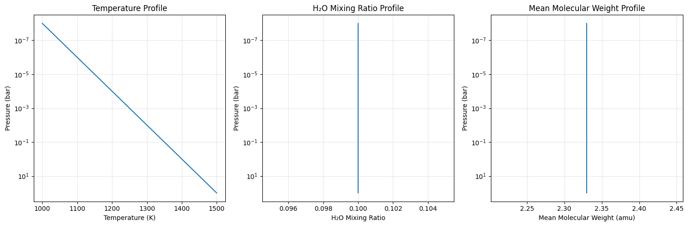
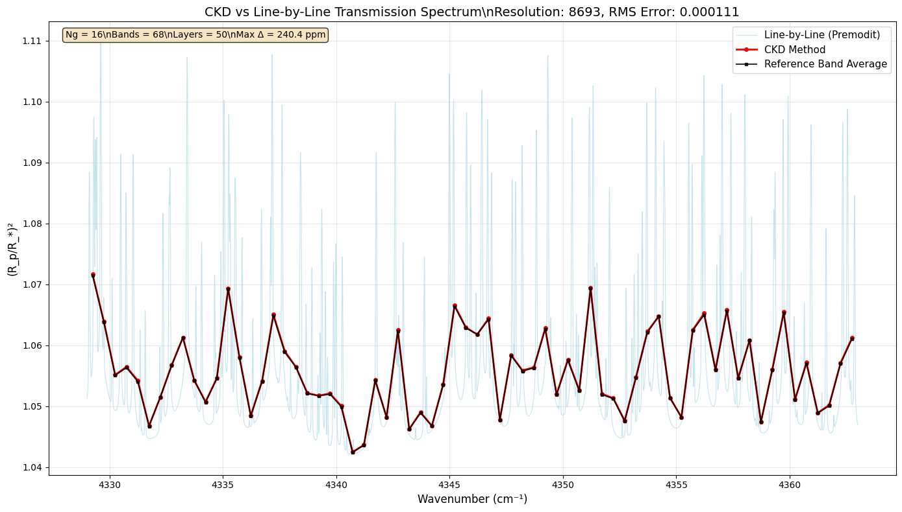

CKD Transmission Tutorial: ArtTransPure with OpaCKD
===================================================

Hajime Kawahara with Claude Code, July 2 (2025)

This tutorial demonstrates how to use the Correlated K-Distribution
(CKD) method for atmospheric transmission calculations with ExoJAX.
Transmission spectroscopy is a key technique for characterizing
exoplanet atmospheres by observing starlight passing through the
planetary atmosphere.

.. code:: ipython3

    # Import required packages
    import numpy as np
    import matplotlib.pyplot as plt
    from jax import config
    
    # ExoJAX imports
    from exojax.test.emulate_mdb import mock_mdbExomol, mock_wavenumber_grid
    from exojax.opacity import OpaCKD, OpaPremodit
    from exojax.rt import ArtTransPure
    from exojax.test.data import get_testdata_filename, TESTDATA_CO_EXOMOL_PREMODIT_TRANSMISSION_REF
    
    # Enable 64-bit precision for accurate calculations
    config.update("jax_enable_x64", True)
    
    print("ExoJAX CKD Tutorial: Transmission Spectroscopy")
    print("=============================================")

.. parsed-literal::

    ExoJAX CKD Tutorial: Transmission Spectroscopy
    =============================================

1. Setup Atmospheric Model and Molecular Database
-------------------------------------------------

First, we’ll set up our atmospheric model for transmission spectroscopy
calculations.

.. code:: ipython3

    # Setup wavenumber grid and molecular database
    nu_grid, wav, res = mock_wavenumber_grid()
    print(f"Wavenumber grid: {len(nu_grid)} points from {nu_grid[0]:.1f} to {nu_grid[-1]:.1f} cm⁻¹")
    print(f"Spectral resolution: {res:.1f}")
    
    # Create mock H2O molecular database
    mdb = mock_mdbExomol("H2O")
    print(f"Molecular database: {mdb.nurange[0]:.1f} - {mdb.nurange[1]:.1f} cm⁻¹")
    
    # Setup atmospheric radiative transfer for transmission
    art = ArtTransPure(
        pressure_top=1.0e-8, 
        pressure_btm=1.0e2, 
        nlayer=50,  # Fewer layers for transmission calculations
        integration="simpson"  # Simpson integration for better accuracy
    )
    
    print(f"Atmospheric layers: {art.nlayer}")
    print(f"Pressure range: {art.pressure_top:.1e} - {art.pressure_btm:.1e} bar")
    print(f"Integration method: {art.integration}")

.. parsed-literal::

    xsmode =  modit
    xsmode assumes ESLOG in wavenumber space: xsmode=modit
    Your wavelength grid is in ***  ascending  *** order
    The wavenumber grid is in ascending order by definition.
    Please be careful when you use the wavelength grid.
    Wavenumber grid: 20000 points from 4329.0 to 4363.0 cm⁻¹
    Spectral resolution: 2556525.8
    xsmode =  modit
    xsmode assumes ESLOG in wavenumber space: xsmode=modit
    Your wavelength grid is in ***  ascending  *** order
    The wavenumber grid is in ascending order by definition.
    Please be careful when you use the wavelength grid.
    radis== 0.15.2
    HITRAN exact name= H2(16O)
    radis engine =  vaex

.. parsed-literal::

    /home/kawahara/exojax/src/exojax/utils/grids.py:85: UserWarning: Both input wavelength and output wavenumber are in ascending order.
      warnings.warn(
    /home/kawahara/exojax/src/exojax/utils/grids.py:85: UserWarning: Both input wavelength and output wavenumber are in ascending order.
      warnings.warn(
    /home/kawahara/exojax/src/exojax/utils/grids.py:85: UserWarning: Both input wavelength and output wavenumber are in ascending order.
      warnings.warn(
    /home/kawahara/exojax/src/exojax/utils/grids.py:85: UserWarning: Both input wavelength and output wavenumber are in ascending order.
      warnings.warn(
    /home/kawahara/exojax/src/exojax/database/api.py:134: UserWarning: The current version of radis does not support broadf_download (requires >=0.16).
      warnings.warn(msg, UserWarning)
    /home/kawahara/exojax/src/exojax/utils/molname.py:197: FutureWarning: e2s will be replaced to exact_molname_exomol_to_simple_molname.
      warnings.warn(
    /home/kawahara/exojax/src/exojax/utils/molname.py:91: FutureWarning: exojax.utils.molname.exact_molname_exomol_to_simple_molname will be replaced to radis.api.exomolapi.exact_molname_exomol_to_simple_molname.
      warnings.warn(
    /home/kawahara/exojax/src/exojax/utils/molname.py:91: FutureWarning: exojax.utils.molname.exact_molname_exomol_to_simple_molname will be replaced to radis.api.exomolapi.exact_molname_exomol_to_simple_molname.
      warnings.warn(

.. parsed-literal::

    Molecule:  H2O
    Isotopologue:  1H2-16O
    Background atmosphere:  H2
    ExoMol database:  None
    Local folder:  H2O/1H2-16O/SAMPLE
    Transition files: 
    	 => File 1H2-16O__SAMPLE__04300-04400.trans
    Broadener:  H2
    Broadening code level: a1
    DataFrame (self.df) available.
    Molecular database: 4329.0 - 4363.0 cm⁻¹
    integration:  simpson
    Simpson integration, uses the chord optical depth at the lower boundary and midppoint of the layers.
    Atmospheric layers: 50
    Pressure range: 1.0e-08 - 1.0e+02 bar
    Integration method: simpson

.. parsed-literal::

    /home/kawahara/exojax/src/exojax/rt/common.py:40: UserWarning: nu_grid is not given. specify nu_grid when using 'run' 
      warnings.warn(

2. Define Atmospheric and Planetary Parameters
----------------------------------------------

We’ll create atmospheric profiles and define planetary parameters for
transmission calculations.

.. code:: ipython3

    # Create atmospheric profiles
    Tarr = np.linspace(1000.0, 1500.0, 50)  # Temperature profile
    mmr_arr = np.full(50, 0.1)  # Constant H2O mixing ratio
    mean_molecular_weight = np.full(50, 2.33)  # Mean molecular weight (H2-dominated)
    
    # Planetary parameters (Jupiter-like)
    radius_btm = 6.9e9  # Planet radius at bottom of atmosphere (cm)
    gravity = 2478.57   # Surface gravity (cm/s²)
    
    # Plot atmospheric profiles
    fig, (ax1, ax2, ax3) = plt.subplots(1, 3, figsize=(15, 5))
    
    # Temperature profile
    ax1.semilogy(Tarr, art.pressure)
    ax1.set_xlabel('Temperature (K)')
    ax1.set_ylabel('Pressure (bar)')
    ax1.set_title('Temperature Profile')
    ax1.grid(True, alpha=0.3)
    ax1.invert_yaxis()
    
    # Mixing ratio profile
    ax2.semilogy(mmr_arr, art.pressure)
    ax2.set_xlabel('H₂O Mixing Ratio')
    ax2.set_ylabel('Pressure (bar)')
    ax2.set_title('H₂O Mixing Ratio Profile')
    ax2.grid(True, alpha=0.3)
    ax2.invert_yaxis()
    
    # Mean molecular weight profile
    ax3.semilogy(mean_molecular_weight, art.pressure)
    ax3.set_xlabel('Mean Molecular Weight (amu)')
    ax3.set_ylabel('Pressure (bar)')
    ax3.set_title('Mean Molecular Weight Profile')
    ax3.grid(True, alpha=0.3)
    ax3.invert_yaxis()
    
    plt.tight_layout()
    plt.show()
    
    print(f"Temperature range: {np.min(Tarr):.0f} - {np.max(Tarr):.0f} K")
    print(f"H2O mixing ratio: {mmr_arr[0]:.1f} (constant)")
    print(f"Mean molecular weight: {mean_molecular_weight[0]:.2f} amu (constant)")
    print(f"Planet radius: {radius_btm/6.9e9:.1f} R_Jupiter")
    print(f"Surface gravity: {gravity:.0f} cm/s² ({gravity/2478.57:.1f} × Jupiter)")

.. parsed-literal::

    Temperature range: 1000 - 1500 K
    H2O mixing ratio: 0.1 (constant)
    Mean molecular weight: 2.33 amu (constant)
    Planet radius: 1.0 R_Jupiter
    Surface gravity: 2479 cm/s² (1.0 × Jupiter)

3. Setup Standard Line-by-Line Opacity Calculator
-------------------------------------------------

First, we’ll compute the standard high-resolution transmission spectrum
using line-by-line calculations.

.. code:: ipython3

    # Initialize standard opacity calculator (Premodit)
    base_opa = OpaPremodit(mdb, nu_grid, auto_trange=[800.0, 1600.0])
    print(f"Base opacity calculator: {base_opa.__class__.__name__}")
    
    # Compute line-by-line cross-sections and transmission spectrum
    print("\nComputing line-by-line transmission spectrum...")
    xsmatrix = base_opa.xsmatrix(Tarr, art.pressure)
    dtau = art.opacity_profile_xs(xsmatrix, mmr_arr, base_opa.mdb.molmass, gravity)
    transit_lbl = art.run(dtau, Tarr, mean_molecular_weight, radius_btm, gravity)
    
    print(f"Line-by-line spectrum computed!")
    print(f"Transit radius ratio range: [{np.min(transit_lbl):.6f}, {np.max(transit_lbl):.6f}]")
    print(f"Transit depth variation: {(np.max(transit_lbl) - np.min(transit_lbl))*1e6:.0f} ppm")

.. parsed-literal::

    OpaPremodit: params automatically set.
    default elower grid trange (degt) file version: 2
    Robust range: 771.9537482657882 - 1647.2060977798953 K
    OpaPremodit: Tref_broadening is set to  1131.3708498984759 K
    max value of  ngamma_ref_grid : 21.825321843011604
    min value of  ngamma_ref_grid : 13.242701248020088
    ngamma_ref_grid grid : [13.24270058 15.00453705 17.00077107 19.26258809 21.8253231 ]
    max value of  n_Texp_grid : 0.541
    min value of  n_Texp_grid : 0.216
    n_Texp_grid grid : [0.21599999 0.54100007]

.. parsed-literal::

    uniqidx:   0%|          | 0/3 [00:00<?, ?it/s]uniqidx: 100%|██████████| 3/3 [00:00<00:00, 8473.34it/s]

.. parsed-literal::

    Premodit: Twt= 1383.2165049575465 K Tref= 840.335329973883 K
    Making LSD:|####################| 100%
    Base opacity calculator: OpaPremodit
    
    Computing line-by-line transmission spectrum...

.. parsed-literal::

    

.. parsed-literal::

    Line-by-line spectrum computed!
    Transit radius ratio range: [1.042101, 1.109748]
    Transit depth variation: 67647 ppm

4. Setup CKD Opacity Calculator and Compute Transmission
--------------------------------------------------------

Now we’ll initialize the CKD opacity calculator and compute the CKD
transmission spectrum.

.. code:: ipython3

    # Initialize CKD opacity calculator
    opa_ckd = OpaCKD(
        base_opa,           # Base opacity calculator
        Ng=16,              # Number of g-ordinates for quadrature
        band_width=0.5      # Spectral band width
    )
    
    print(f"CKD Opacity Calculator Setup:")
    print(f"  Number of g-ordinates (Ng): {opa_ckd.Ng}")
    print(f"  Band width: {opa_ckd.band_width}")
    print(f"  Number of spectral bands: {len(opa_ckd.nu_bands)}")
    print(f"  Spectral range: {opa_ckd.nu_bands[0]:.1f} - {opa_ckd.nu_bands[-1]:.1f} cm⁻¹")
    
    # Pre-compute CKD tables on temperature-pressure grid
    print("\nPre-computing CKD tables...")
    T_grid = np.linspace(np.min(Tarr), np.max(Tarr), 10)
    P_grid = np.logspace(np.log10(np.min(art.pressure)), np.log10(np.max(art.pressure)), 10)
    opa_ckd.precompute_tables(T_grid, P_grid)
    
    # Get CKD cross-section tensor and compute CKD spectrum
    print("Computing CKD transmission spectrum...")
    xs_ckd = opa_ckd.xstensor_ckd(Tarr, art.pressure)
    dtau_ckd = art.opacity_profile_xs_ckd(xs_ckd, mmr_arr, base_opa.mdb.molmass, gravity)
    transit_ckd = art.run_ckd(dtau_ckd, Tarr, mean_molecular_weight, radius_btm, gravity, opa_ckd.ckd_info.weights)
    
    print(f"CKD spectrum computed!")
    print(f"CKD transit range: [{np.min(transit_ckd):.6f}, {np.max(transit_ckd):.6f}]")

.. parsed-literal::

    CKD Opacity Calculator Setup:
      Number of g-ordinates (Ng): 16
      Band width: 0.5
      Number of spectral bands: 68
      Spectral range: 4329.3 - 4362.8 cm⁻¹
    
    Pre-computing CKD tables...
    Generated g-grid: 16 points, range [0.0053, 0.9947]
    Processing 68 spectral bands...
      Band 1: [4329.0, 4329.5] cm⁻¹, 295 frequencies
      Band 2: [4329.5, 4330.0] cm⁻¹, 294 frequencies
      Band 3: [4330.0, 4330.5] cm⁻¹, 294 frequencies
      Band 4: [4330.5, 4331.0] cm⁻¹, 294 frequencies
      Band 5: [4331.0, 4331.5] cm⁻¹, 294 frequencies
      Band 6: [4331.5, 4332.0] cm⁻¹, 294 frequencies
      Band 7: [4332.0, 4332.5] cm⁻¹, 294 frequencies
      Band 8: [4332.5, 4333.0] cm⁻¹, 294 frequencies
      Band 9: [4333.0, 4333.5] cm⁻¹, 294 frequencies
      Band 10: [4333.5, 4334.0] cm⁻¹, 295 frequencies
      Band 11: [4334.0, 4334.5] cm⁻¹, 294 frequencies
      Band 12: [4334.5, 4335.0] cm⁻¹, 294 frequencies
      Band 13: [4335.0, 4335.5] cm⁻¹, 294 frequencies
      Band 14: [4335.5, 4336.0] cm⁻¹, 294 frequencies
      Band 15: [4336.0, 4336.5] cm⁻¹, 294 frequencies
      Band 16: [4336.5, 4337.0] cm⁻¹, 294 frequencies
      Band 17: [4337.0, 4337.5] cm⁻¹, 294 frequencies
      Band 18: [4337.5, 4338.0] cm⁻¹, 294 frequencies
      Band 19: [4338.0, 4338.5] cm⁻¹, 294 frequencies
      Band 20: [4338.5, 4339.0] cm⁻¹, 295 frequencies
      Band 21: [4339.0, 4339.5] cm⁻¹, 294 frequencies
      Band 22: [4339.5, 4340.0] cm⁻¹, 294 frequencies
      Band 23: [4340.0, 4340.5] cm⁻¹, 294 frequencies
      Band 24: [4340.5, 4341.0] cm⁻¹, 294 frequencies
      Band 25: [4341.0, 4341.5] cm⁻¹, 294 frequencies
      Band 26: [4341.5, 4342.0] cm⁻¹, 294 frequencies
      Band 27: [4342.0, 4342.5] cm⁻¹, 294 frequencies
      Band 28: [4342.5, 4343.0] cm⁻¹, 294 frequencies
      Band 29: [4343.0, 4343.5] cm⁻¹, 294 frequencies
      Band 30: [4343.5, 4344.0] cm⁻¹, 295 frequencies
      Band 31: [4344.0, 4344.5] cm⁻¹, 294 frequencies
      Band 32: [4344.5, 4345.0] cm⁻¹, 294 frequencies
      Band 33: [4345.0, 4345.5] cm⁻¹, 294 frequencies
      Band 34: [4345.5, 4346.0] cm⁻¹, 294 frequencies
      Band 35: [4346.0, 4346.5] cm⁻¹, 294 frequencies
      Band 36: [4346.5, 4347.0] cm⁻¹, 294 frequencies
      Band 37: [4347.0, 4347.5] cm⁻¹, 294 frequencies
      Band 38: [4347.5, 4348.0] cm⁻¹, 294 frequencies
      Band 39: [4348.0, 4348.5] cm⁻¹, 295 frequencies
      Band 40: [4348.5, 4349.0] cm⁻¹, 294 frequencies
      Band 41: [4349.0, 4349.5] cm⁻¹, 294 frequencies
      Band 42: [4349.5, 4350.0] cm⁻¹, 294 frequencies
      Band 43: [4350.0, 4350.5] cm⁻¹, 294 frequencies
      Band 44: [4350.5, 4351.0] cm⁻¹, 294 frequencies
      Band 45: [4351.0, 4351.5] cm⁻¹, 294 frequencies
      Band 46: [4351.5, 4352.0] cm⁻¹, 294 frequencies
      Band 47: [4352.0, 4352.5] cm⁻¹, 294 frequencies
      Band 48: [4352.5, 4353.0] cm⁻¹, 294 frequencies
      Band 49: [4353.0, 4353.5] cm⁻¹, 295 frequencies
      Band 50: [4353.5, 4354.0] cm⁻¹, 294 frequencies
      Band 51: [4354.0, 4354.5] cm⁻¹, 294 frequencies
      Band 52: [4354.5, 4355.0] cm⁻¹, 294 frequencies
      Band 53: [4355.0, 4355.5] cm⁻¹, 294 frequencies
      Band 54: [4355.5, 4356.0] cm⁻¹, 294 frequencies
      Band 55: [4356.0, 4356.5] cm⁻¹, 294 frequencies
      Band 56: [4356.5, 4357.0] cm⁻¹, 294 frequencies
      Band 57: [4357.0, 4357.5] cm⁻¹, 294 frequencies
      Band 58: [4357.5, 4358.0] cm⁻¹, 294 frequencies
      Band 59: [4358.0, 4358.5] cm⁻¹, 295 frequencies
      Band 60: [4358.5, 4359.0] cm⁻¹, 294 frequencies
      Band 61: [4359.0, 4359.5] cm⁻¹, 294 frequencies
      Band 62: [4359.5, 4360.0] cm⁻¹, 294 frequencies
      Band 63: [4360.0, 4360.5] cm⁻¹, 294 frequencies
      Band 64: [4360.5, 4361.0] cm⁻¹, 294 frequencies
      Band 65: [4361.0, 4361.5] cm⁻¹, 294 frequencies
      Band 66: [4361.5, 4362.0] cm⁻¹, 294 frequencies
      Band 67: [4362.0, 4362.5] cm⁻¹, 294 frequencies
      Band 68: [4362.5, 4363.0] cm⁻¹, 295 frequencies
    Creating CKD table info...
    CKD precomputation complete! Ready for interpolation.
    Table dimensions: T=10, P=10, g=16, bands=68
    Computing CKD transmission spectrum...
    CKD spectrum computed!
    CKD transit range: [1.042468, 1.071653]

5. Compare Results and Visualize
--------------------------------

Let’s compare the CKD results with the line-by-line spectrum and compute
band averages for validation.

.. code:: ipython3

    # Compute reference band averages by direct integration
    print("Computing reference band averages...")
    transit_avg = []
    band_edges = opa_ckd.band_edges
    
    for band_idx in range(len(opa_ckd.nu_bands)):
        mask = (band_edges[band_idx, 0] <= nu_grid) & (nu_grid < band_edges[band_idx, 1])
        transit_avg.append(np.mean(transit_lbl[mask]))
    
    transit_avg = np.array(transit_avg)
    
    # Calculate accuracy metrics
    res = np.sqrt(np.sum((transit_ckd - transit_avg)**2)/len(transit_ckd))/np.mean(transit_avg)
    max_relative_error = np.max(np.abs((transit_ckd - transit_avg) / transit_avg))
    resolution = opa_ckd.nu_bands[0]/(band_edges[0, 1] - band_edges[0, 0])
    transit_diff_ppm = np.abs((transit_ckd - transit_avg) * 1e6)
    
    print(f"CKD Accuracy Assessment:")
    print(f"  RMS relative error: {res:.6f}")
    print(f"  Maximum relative error: {max_relative_error:.6f}")
    print(f"  Effective resolution: {resolution:.1f}")
    print(f"  Maximum transit depth difference: {np.max(transit_diff_ppm):.1f} ppm")
    print(f"  Mean transit depth difference: {np.mean(transit_diff_ppm):.1f} ppm")

.. parsed-literal::

    Computing reference band averages...
    CKD Accuracy Assessment:
      RMS relative error: 0.000111
      Maximum relative error: 0.000226
      Effective resolution: 8692.6
      Maximum transit depth difference: 240.4 ppm
      Mean transit depth difference: 105.1 ppm

6. Visualize Transmission Spectra Comparison
--------------------------------------------

.. code:: ipython3

    # Create comparison plot
    plt.figure(figsize=(14, 8))
    
    # Plot line-by-line spectrum (high resolution)
    plt.plot(nu_grid, transit_lbl, 
             label="Line-by-Line (Premodit)", 
             alpha=0.7, linewidth=0.8, color='lightblue')
    
    # Plot CKD spectrum
    plt.plot(opa_ckd.nu_bands, transit_ckd, 
             'o-', label="CKD Method", 
             markersize=4, linewidth=2, color='red')
    
    # Plot reference band averages
    plt.plot(opa_ckd.nu_bands, transit_avg, 
             's-', label="Reference Band Average", 
             markersize=3, linewidth=1.5, color='black', alpha=0.8)
    
    plt.xlabel('Wavenumber (cm⁻¹)', fontsize=12)
    plt.ylabel('(R_p/R_*)²', fontsize=12)
    plt.title(f'CKD vs Line-by-Line Transmission Spectrum\\n'
              f'Resolution: {resolution:.0f}, RMS Error: {res:.6f}', fontsize=14)
    plt.legend(fontsize=11)
    plt.grid(True, alpha=0.3)
    
    # Add text box with key parameters
    textstr = f'Ng = {opa_ckd.Ng}\\nBands = {len(opa_ckd.nu_bands)}\\nLayers = {art.nlayer}\\nMax Δ = {np.max(transit_diff_ppm):.1f} ppm'
    props = dict(boxstyle='round', facecolor='wheat', alpha=0.8)
    plt.text(0.02, 0.98, textstr, transform=plt.gca().transAxes, fontsize=10,
             verticalalignment='top', bbox=props)
    
    plt.tight_layout()
    plt.show()
    
    # Save the figure
    plt.savefig(f"ckd_transmission_comparison_res{resolution:.0f}.png", 
                dpi=300, bbox_inches='tight')
    print(f"Figure saved as: ckd_transmission_comparison_res{resolution:.0f}.png")

.. parsed-literal::

    Figure saved as: ckd_transmission_comparison_res8693.png

.. parsed-literal::

    <Figure size 640x480 with 0 Axes>

Summary
-------

This tutorial demonstrated how to use the CKD method with ExoJAX for
transmission spectroscopy:

Key Steps:
~~~~~~~~~~

1. **Setup**: Initialize atmospheric model and molecular database for
   transmission
2. **Profiles**: Define temperature, mixing ratio, and planetary
   parameters
3. **Line-by-Line**: Compute high-resolution transmission spectrum
4. **CKD Setup**: Initialize CKD calculator and pre-compute tables
5. **CKD Calculation**: Compute band-averaged transmission spectrum
   using CKD
6. **Validation**: Compare CKD results with line-by-line band averages
7. **Visualization**: Plot comparison and analyze accuracy in ppm

