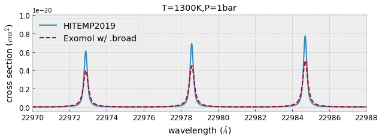
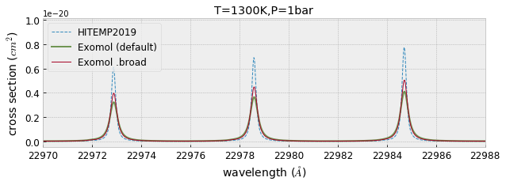

Comparing HITEMP and ExoMol
---------------------------

.. code:: ipython3

    from exojax.spec import xsection
    from exojax.spec.hitran import SijT, doppler_sigma, gamma_hitran, gamma_natural
    from exojax.spec.exomol import gamma_exomol
    from exojax.spec import moldb
    import numpy as np
    import seaborn as sns
    import matplotlib.pyplot as plt
    plt.style.use('bmh')

First of all, set a wavenumber bin in the unit of wavenumber (cm-1).
Here we set the wavenumber range as :math:`1000 \le \nu \le 10000`
(1/cm) with the resolution of 0.01 (1/cm).

We call moldb instance with the path of par file. If the par file does
not exist, moldb will try to download it from HITRAN website.

.. code:: ipython3

    # Setting wavenumber bins and loading HITEMP database
    wav=np.linspace(22930.0,23000.0,4000,dtype=np.float64) #AA
    nus=1.e8/wav[::-1] #cm-1
    mdbCO_HITEMP=moldb.MdbHit('~/exojax/data/CO/05_HITEMP2019.par.bz2',nus)

.. parsed-literal::

    bunziping

.. code:: ipython3

    emf='~/exojax/data/CO/12C-16O/Li2015'
    mdbCO_Li2015=moldb.MdbExomol(emf,nus)

.. parsed-literal::

    Background atmosphere:  H2
    Reading transition file
    Broadening code level= a0
    default broadening parameters are used for  71  J lower states in  152  states

Define molecular weight of CO (:math:`\sim 12+16=28`), temperature (K),
and pressure (bar). Also, we here assume the 100 % CO atmosphere,
i.e. the partial pressure = pressure.

.. code:: ipython3

    from exojax.spec import molinfo
    Mmol=molinfo.molmass("CO") # molecular weight
    Tfix=1300.0 # we assume T=1300K
    Pfix=0.99 # we compute P=1 bar=0.99+0.1
    Ppart=0.01 #partial pressure of CO. here we assume a 1% CO atmosphere (very few). 

partition function ratio :math:`q(T)` is defined by

:math:`q(T) = Q(T)/Q(T_{ref})`; :math:`T_{ref}`\ =296 K

Here, we use the partition function from HAPI

.. code:: ipython3

    qt_HITEMP=mdbCO_HITEMP.qr_interp_lines(Tfix)
    qt_Li2015=mdbCO_Li2015.qr_interp(Tfix)

Let us compute the line strength S(T) at temperature of Tfix.

:math:`S (T;s_0,\nu_0,E_l,q(T)) = S_0 \frac{Q(T_{ref})}{Q(T)} \frac{e^{- h c E_l /k_B T}}{e^{- h c E_l /k_B T_{ref}}} \frac{1- e^{- h c \nu /k_B T}}{1-e^{- h c \nu /k_B T_{ref}}}= q_r(T)^{-1} e^{ s_0 - c_2 E_l (T^{-1} - T_{ref}^{-1})} \frac{1- e^{- c_2 \nu_0/ T}}{1-e^{- c_2 \nu_0/T_{ref}}}`

:math:`s_0=\log_{e} S_0` : logsij0

:math:`\nu_0`: nu_lines

:math:`E_l` : elower

Why the input is :math:`s_0 = \log_{e} S_0` instead of :math:`S_0` in
SijT? This is because the direct value of :math:`S_0` is quite small and
we need to use float32 for jax.

.. code:: ipython3

    Sij_HITEMP=SijT(Tfix,mdbCO_HITEMP.logsij0,mdbCO_HITEMP.nu_lines,\
             mdbCO_HITEMP.elower,qt_HITEMP)
    Sij_Li2015=SijT(Tfix,mdbCO_Li2015.logsij0,mdbCO_Li2015.nu_lines,\
                    mdbCO_Li2015.elower,qt_Li2015)

Then, compute the Lorentz gamma factor (pressure+natural broadening)

:math:`\gamma_L = \gamma^p_L + \gamma^n_L`

where the pressure broadning (HITEMP)

:math:`\gamma^p_L = (T/296K)^{-n_{air}} [ \alpha_{air} ( P - P_{part})/P_{atm} + \alpha_{self} P_{part}/P_{atm}]`

:math:`P_{atm}`: 1 atm in the unit of bar (i.e. = 1.01325)

or

the pressure broadning (ExoMol)

:math:`\gamma^p_L = \alpha_{ref} ( T/T_{ref})^{-n_{texp}} ( P/P_{ref}),`

and the natural broadening

:math:`\gamma^n_L = \frac{A}{4 \pi c}`

.. code:: ipython3

    gammaL_HITEMP = gamma_hitran(Pfix,Tfix, Ppart, mdbCO_HITEMP.n_air, \
                          mdbCO_HITEMP.gamma_air, mdbCO_HITEMP.gamma_self) \
    + gamma_natural(mdbCO_HITEMP.A) 
    
    gammaL_Li2015 = gamma_exomol(Pfix,Tfix,mdbCO_Li2015.n_Texp,mdbCO_Li2015.alpha_ref)\
    + gamma_natural(mdbCO_Li2015.A) 

Thermal broadening

:math:`\sigma_D^{t} = \sqrt{\frac{k_B T}{M m_u}} \frac{\nu_0}{c}`

.. code:: ipython3

    # thermal doppler sigma
    sigmaD_HITEMP=doppler_sigma(mdbCO_HITEMP.nu_lines,Tfix,Mmol)
    sigmaD_Li2015=doppler_sigma(mdbCO_Li2015.nu_lines,Tfix,Mmol)

Then, the line center…

In HITRAN database, a slight pressure shift can be included using
:math:`\delta_{air}`: :math:`\nu_0(P) = \nu_0 + \delta_{air} P`. But
this shift is quite a bit.

.. code:: ipython3

    #line center
    nu0_HITEMP=mdbCO_HITEMP.nu_lines
    nu0_Li2015=mdbCO_Li2015.nu_lines

Although it depends on your GPU, you might need to devide the
computation into multiple loops because of the limitation of the GPU
memory. Here we assume 30MB for GPU memory (not exactly, memory size for
numatrix).

.. code:: ipython3

    xsv_HITEMP=xsection(nus,nu0_HITEMP,sigmaD_HITEMP,gammaL_HITEMP\
                         ,Sij_HITEMP,memory_size=30) #use 30MB GPU MEMORY for numax
    xsv_Li2015=xsection(nus,nu0_Li2015,sigmaD_Li2015,gammaL_Li2015\
                         ,Sij_Li2015,memory_size=30) #use 30MB GPU MEMORY for numax

.. parsed-literal::

    100%|██████████| 12/12 [00:08<00:00,  1.31it/s]
    100%|██████████| 1/1 [00:00<00:00,  1.08it/s]

.. code:: ipython3

    fig=plt.figure(figsize=(10,3))
    ax=fig.add_subplot(111)
    plt.plot(wav[::-1],xsv_HITEMP,lw=2,label="HITEMP2019")
    plt.plot(wav[::-1],xsv_Li2015,lw=2,ls="dashed",label="Exomol w/ .broad")
    plt.xlim(22970,22988)
    plt.xlabel("wavelength ($\AA$)",fontsize=14)
    plt.ylabel("cross section ($cm^{2}$)",fontsize=14)
    plt.legend(loc="upper left",fontsize=14)
    plt.tick_params(labelsize=12)
    plt.savefig("co_comparison.pdf", bbox_inches="tight", pad_inches=0.0)
    plt.savefig("co_comparison.png", bbox_inches="tight", pad_inches=0.0)
    plt.title("T=1300K,P=1bar")
    plt.show()

Here, we test to use the default broadening parameters in def file of
exomol

.. code:: ipython3

    gammaL_Li2015_def = gamma_exomol(Pfix,Tfix,mdbCO_Li2015.n_Texp_def,mdbCO_Li2015.alpha_ref_def)\
    + gamma_natural(mdbCO_Li2015.A) 
    xsv_Li2015_def=xsection(nus,nu0_Li2015,sigmaD_Li2015,gammaL_Li2015_def\
                         ,Sij_Li2015,memory_size=30) #use 30MB GPU MEMORY for numax

.. parsed-literal::

    100%|██████████| 1/1 [00:00<00:00, 20.04it/s]

.. parsed-literal::

    No .broad file is given.

.. parsed-literal::

    

Plot it!

.. code:: ipython3

    fig=plt.figure(figsize=(10,3))
    ax=fig.add_subplot(111)
    plt.plot(wav[::-1],xsv_HITEMP,lw=1,ls="dashed",label="HITEMP2019")
    plt.plot(wav[::-1],xsv_Li2015_def,color="C3",lw=2,alpha=0.75,label="Exomol (default)")
    plt.plot(wav[::-1],xsv_Li2015,lw=1,label="Exomol .broad")
    
    plt.xlim(22970,22988)
    plt.xlabel("wavelength ($\AA$)",fontsize=14)
    plt.ylabel("cross section ($cm^{2}$)",fontsize=14)
    plt.legend(loc="upper left",fontsize=12)
    plt.tick_params(labelsize=12)
    plt.savefig("co_comparison.pdf", bbox_inches="tight", pad_inches=0.0)
    plt.savefig("co_comparison.png", bbox_inches="tight", pad_inches=0.0)
    plt.title("T=1300K,P=1bar")
    plt.show()

.. code:: ipython3

    np.min(gammaL_HITEMP),np.max(gammaL_HITEMP)

.. parsed-literal::

    (DeviceArray(0.01456154, dtype=float32),
     DeviceArray(0.02531094, dtype=float32))

.. code:: ipython3

    np.min(gammaL_Li2015),np.max(gammaL_Li2015)

.. parsed-literal::

    (DeviceArray(0.02603155, dtype=float32),
     DeviceArray(0.03306796, dtype=float32))

.. code:: ipython3

    np.min(gammaL_Li2015_def),np.max(gammaL_Li2015_def)

.. parsed-literal::

    (DeviceArray(0.03306796, dtype=float32),
     DeviceArray(0.03306796, dtype=float32))

