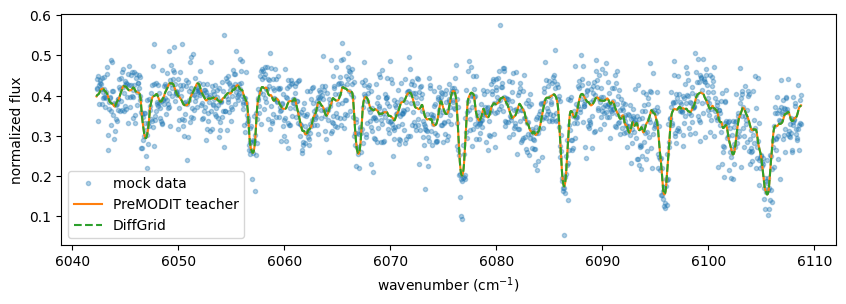
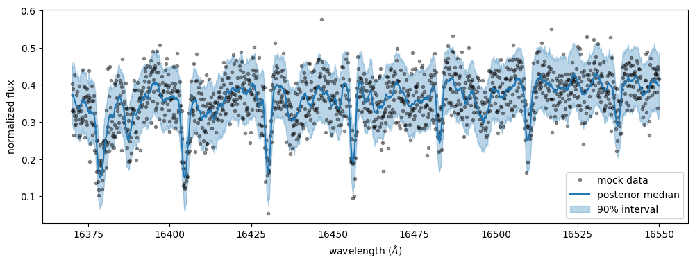
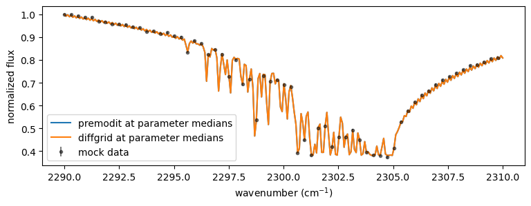

HMC-NUTS retrieval with DiffGrid
================================

This tutorial fits a high-resolution methane emission spectrum with
HMC-NUTS using the pressure-layer aligned ``OpaDiffgrid`` opacity
calculator. It follows the same physical example and inference flow as
the corresponding PreMODIT tutorial: a power-law temperature profile,
CH\ :math:`_4` line opacity, H\ :math:`_2`–H\ :math:`_2`
collision-induced absorption (CIA), rotational broadening, and an
instrumental response.

DiffGrid stores :math:`\log \sigma` and
:math:`\partial \log \sigma/\partial(1/T)` at fixed atmospheric
pressures. The table is built once from a differentiable opacity
calculator; here, ``OpaPremodit`` is the teacher. NUTS then
differentiates the ordinary JAX cubic Hermite interpolation used by
``OpaDiffgrid``.

The example uses the wavelength sampling and physical setup of the
methane mock spectrum in the PreMODIT retrieval tutorial. To keep the
mock observation exactly consistent with the current radiative-transfer
implementation, its noiseless flux is generated below with the current
``OpaPremodit`` teacher. The YT10to10 line list is not packaged with
ExoJAX and is downloaded by ``MdbExomol`` when it is not already
available locally.

The workflow is:

1. create the observation sampling grid,
2. build the PreMODIT teacher and the pressure-aligned DiffGrid table,
3. generate a reproducible mock observation and verify the interpolation
   in units of its noise,
4. run one DiffGrid HMC-NUTS retrieval, and
5. inspect the posterior predictive spectrum and parameter correlations.

The table construction and NUTS cells are intended for a GPU. Use more
chains and samples than this tutorial for scientific inference.

.. code:: ipython3

    import arviz as az
    import jax
    from jax import config
    config.update("jax_enable_x64", True)

    import jax.numpy as jnp
    import matplotlib.pyplot as plt
    import numpy as np
    import numpyro
    import numpyro.distributions as dist
    import pandas as pd
    from numpyro.diagnostics import hpdi
    from numpyro.infer import MCMC, NUTS, Predictive
    from numpyro.infer.initialization import init_to_value

    from exojax.database import molinfo
    from exojax.database.cia.api import CdbCIA
    from exojax.database.exomol.api import MdbExomol
    from exojax.opacity import OpaCIA, OpaDiffgrid, OpaPremodit
    from exojax.postproc.response import ipgauss_sampling
    from exojax.postproc.spin_rotation import convolve_rigid_rotation
    from exojax.rt import ArtEmisPure
    from exojax.utils.astrofunc import gravity_jupiter
    from exojax.utils.grids import velocity_grid, wavenumber_grid
    from exojax.utils.instfunc import resolution_to_gaussian_std

    jax.devices()

.. parsed-literal::

    [CudaDevice(id=0)]

Observation sampling grid
-------------------------

We create the same observation coordinates as the PreMODIT example.
After constructing the current teacher, we generate the noiseless flux
at known parameters and add Gaussian noise with a fixed NumPy seed.
Generating the mock in the same run avoids coupling the retrieval to
historical changes in the radiative-transfer implementation.

.. code:: ipython3

    number_of_observed_wavenumbers = 1500
    nu_data, wavelength_data, _ = wavenumber_grid(
        16370.0,
        16550.0,
        number_of_observed_wavenumbers,
        unit="AA",
        xsmode="modit",
        wavelength_order="ascending",
    )

    noise_sigma = 0.05
    flux_scale = 20000.0

.. parsed-literal::

    xsmode =  modit
    xsmode assumes ESLOG in wavenumber space: xsmode=modit
    Your wavelength grid is in ***  ascending  *** order
    The wavenumber grid is in ascending order by definition.
    Please be careful when you use the wavelength grid.

.. parsed-literal::

    /home/kawahara/exojax/src/exojax/utils/grids.py:85: UserWarning: Both input wavelength and output wavenumber are in ascending order.
      warnings.warn(
    /home/kawahara/exojax/src/exojax/utils/grids.py:249: UserWarning: Resolution may be too small. R=137073.85617245853
      warnings.warn("Resolution may be too small. R=" + str(resolution), UserWarning)

Spectral grid and atmosphere
----------------------------

DiffGrid is tied to the exact pressure layers used at construction. Its
temperature nodes must cover every layer temperature that can be
evaluated during inference.

Here, ``ArtEmisPure.powerlaw_temperature`` clips the temperature profile
to 400–1500 K. We use the same limits for the PreMODIT teacher and the
DiffGrid table.

.. code:: ipython3

    number_of_wavenumbers = 7500
    nu_grid, wavelength_grid, resolution = wavenumber_grid(
        np.min(wavelength_data) - 10.0,
        np.max(wavelength_data) + 10.0,
        number_of_wavenumbers,
        unit="AA",
        xsmode="diffgrid",
        wavelength_order="ascending",
    )

    temperature_min = 400.0
    temperature_max = 1500.0
    art = ArtEmisPure(
        nu_grid=nu_grid,
        pressure_top=1.0e-8,
        pressure_btm=1.0e2,
        nlayer=100,
    )
    art.change_temperature_range(temperature_min, temperature_max)

    planet_mass = 33.2
    instrument_resolution = 100000.0
    instrument_beta = resolution_to_gaussian_std(instrument_resolution)

.. parsed-literal::

    xsmode =  diffgrid
    xsmode assumes ESLOG in wavenumber space: xsmode=diffgrid
    Your wavelength grid is in ***  ascending  *** order
    The wavenumber grid is in ascending order by definition.
    Please be careful when you use the wavelength grid.
    rtsolver:  ibased
    Intensity-based n-stream solver, isothermal layer (e.g. NEMESIS, pRT like)

.. parsed-literal::

    /home/kawahara/exojax/src/exojax/utils/grids.py:249: UserWarning: Resolution may be too small. R=617160.1067701889
      warnings.warn("Resolution may be too small. R=" + str(resolution), UserWarning)

Build the DiffGrid opacity
--------------------------

YT10to10 contains about 80 million transitions in this spectral
interval, so loading the database and constructing the teacher can take
time. The PreMODIT settings below mirror the corresponding example and
define the mock observation used in this run. The teacher is needed only
while the DiffGrid table is built.

Cubic Hermite interpolation is performed in inverse temperature. We
therefore place the nodes uniformly in :math:`1/T`. The example starts
with 21 nodes; the validation below determines whether that is
sufficient for the intended noise level.

.. code:: ipython3

    mdb = MdbExomol(
        ".database/CH4/12C-1H4/YT10to10/",
        nurange=nu_grid,
        gpu_transfer=False,
    )
    print("number of CH4 lines:", len(mdb.nu_lines))

    teacher = OpaPremodit(
        mdb=mdb,
        nu_grid=nu_grid,
        diffmode=1,
        auto_trange=(temperature_min, temperature_max),
        broadening_resolution={"mode": "manual", "value": 0.2},
        wavelength_order="ascending",
    )

    number_of_temperature_nodes = 21
    inverse_temperature_nodes = np.linspace(
        1.0 / temperature_max,
        1.0 / temperature_min,
        number_of_temperature_nodes,
    )
    temperature_nodes = 1.0 / inverse_temperature_nodes

    opa = OpaDiffgrid(
        teacher,
        temperature_grid=temperature_nodes,
        pressure_grid=np.asarray(art.pressure),
    )
    jax.block_until_ready(opa.log_cross_section_grid)
    jax.block_until_ready(opa.log_cross_section_derivative_grid)

    # Validate once outside JIT or NUTS. Compiled calls omit pressure.
    opa.check_pressure_grid(art.pressure)
    print("DiffGrid table shape:", opa.log_cross_section_grid.shape)

.. parsed-literal::

    radis== 0.15.2
    HITRAN exact name= (12C)(1H)4
    HITRAN exact name= (12C)(1H)4
    radis engine =  pytables

.. parsed-literal::

    /home/kawahara/exojax/src/exojax/database/_common/radis_adapter.py:63: UserWarning: The current version of radis does not support broadf_download (requires >=0.16).
      warnings.warn(msg, UserWarning)
    /home/kawahara/exojax/src/exojax/utils/molname.py:197: FutureWarning: e2s will be replaced to exact_molname_exomol_to_simple_molname.
      warnings.warn(
    /home/kawahara/exojax/src/exojax/utils/molname.py:91: FutureWarning: exojax.utils.molname.exact_molname_exomol_to_simple_molname will be replaced to radis.api.exomolapi.exact_molname_exomol_to_simple_molname.
      warnings.warn(
    /home/kawahara/exojax/src/exojax/utils/molname.py:63: UserWarning: No isotope number identified.
      warnings.warn("No isotope number identified.", UserWarning)
    /home/kawahara/exojax/src/exojax/utils/molname.py:91: FutureWarning: exojax.utils.molname.exact_molname_exomol_to_simple_molname will be replaced to radis.api.exomolapi.exact_molname_exomol_to_simple_molname.
      warnings.warn(
    /home/kawahara/exojax/src/exojax/database/molinfo/mass.py:48: UserWarning: exact molecule name is not Exomol nor HITRAN form.
      warnings.warn("exact molecule name is not Exomol nor HITRAN form.")
    /home/kawahara/exojax/src/exojax/database/molinfo/mass.py:49: UserWarning: No molmass available
      warnings.warn("No molmass available", UserWarning)

.. parsed-literal::

    Molecule:  CH4
    Isotopologue:  12C-1H4
    Background atmosphere:  H2
    ExoMol database:  None
    Local folder:  .database/CH4/12C-1H4/YT10to10
    Transition files:
         => File 12C-1H4__YT10to10__06000-06100.trans
         => File 12C-1H4__YT10to10__06100-06200.trans
    Broadener:  H2
    Broadening code level: a1

.. parsed-literal::

    /home/kawahara/miniconda3/lib/python3.12/site-packages/radis-0.15.2-py3.12.egg/radis/api/exomolapi.py:685: AccuracyWarning: The default broadening parameter (alpha = 0.0488 cm^-1 and n = 0.4) are used for J'' > 16 up to J'' = 40
      warnings.warn(

.. parsed-literal::

    number of CH4 lines: 80505310
    default elower grid trange (degt) file version: 2
    Robust range: 393.5569458240504 - 1647.2060977798953 K

.. parsed-literal::

    /home/kawahara/exojax/src/exojax/utils/grids.py:85: UserWarning: Both input wavelength and output wavenumber are in ascending order.
      warnings.warn(

.. parsed-literal::

    max value of  ngamma_ref_grid : 4.119208887336048
    min value of  ngamma_ref_grid : 3.3534157619544067
    ngamma_ref_grid grid : [3.35341549 3.71664096 4.11920929]
    max value of  n_Texp_grid : 0.5
    min value of  n_Texp_grid : 0.4
    n_Texp_grid grid : [0.39999998 0.50000006]
    Premodit: Twt= 483.67862012986944 K Tref= 1171.1891720056747 K
    DiffGrid table shape: (100, 21, 7500)

Continuum and spectral response
-------------------------------

We add H\ :math:`_2`–H\ :math:`_2` CIA and apply the same rotational and
instrumental broadening as in the PreMODIT retrieval example.

.. code:: ipython3

    cia_database = CdbCIA(
        ".database/H2-H2_2011.cia",
        nurange=nu_grid,
    )
    opa_cia = OpaCIA(cdb=cia_database, nu_grid=nu_grid)

    mean_molecular_weight = 2.33
    hydrogen_mass_mixing_ratio = 0.74
    hydrogen_molecular_mass = molinfo.molmass_isotope("H2")
    hydrogen_volume_mixing_ratio = (
        hydrogen_mass_mixing_ratio
        * mean_molecular_weight
        / hydrogen_molecular_mass
    )

    maximum_vsini = 100.0
    velocity_array = velocity_grid(resolution, maximum_vsini)

.. parsed-literal::

    Load CIA:  H2-H2

Forward model, mock observation, and interpolation check
--------------------------------------------------------

Inside the compiled DiffGrid model, call ``xsmatrix(temperature)``
without a pressure argument. Pressure is already bound to the table, and
traced pressure arguments are intentionally rejected.

The teacher spectrum at the generating parameters becomes the noiseless
mock observation. Before discarding the teacher, we also compare it with
DiffGrid at those parameters and at all four corners of the temperature
prior. The relevant scale is the observational uncertainty, rather than
a relative error in very weak individual cross sections. If the maximum
difference is not negligible compared with ``noise_sigma``, increase
``number_of_temperature_nodes`` and rebuild the table.

.. code:: ipython3

    def forward_model(
        opacity,
        temperature,
        methane_mass_mixing_ratio,
        radius,
        radial_velocity,
        vsini,
    ):
        gravity = gravity_jupiter(Rp=radius, Mp=planet_mass)

        if opacity.method == "diffgrid":
            cross_section = opacity.xsmatrix(temperature)
        else:
            cross_section = opacity.xsmatrix(temperature, art.pressure)

        methane_profile = art.constant_mmr_profile(
            methane_mass_mixing_ratio
        )
        optical_depth_methane = art.opacity_profile_xs(
            cross_section,
            methane_profile,
            opacity.molmass,
            gravity,
        )

        log_cia = opa_cia.logacia_matrix(temperature)
        optical_depth_cia = art.opacity_profile_cia(
            log_cia,
            temperature,
            hydrogen_volume_mixing_ratio,
            hydrogen_volume_mixing_ratio,
            mean_molecular_weight,
            gravity,
        )

        raw_flux = art.run(
            optical_depth_methane + optical_depth_cia,
            temperature,
        ) / flux_scale
        rotational_flux = convolve_rigid_rotation(
            raw_flux,
            velocity_array,
            vsini,
            u1=0.0,
            u2=0.0,
        )
        return ipgauss_sampling(
            nu_data,
            nu_grid,
            rotational_flux,
            instrument_beta,
            radial_velocity,
            velocity_array,
        )

    truth = {
        "radius": 0.88,
        "radial_velocity": 10.0,
        "methane_mass_mixing_ratio": 0.0059,
        "temperature_at_1bar": 1200.0,
        "temperature_index": 0.1,
        "vsini": 20.0,
    }

    temperature_at_1bar_bounds = (1000.0, 1500.0)
    temperature_index_bounds = (0.05, 0.2)
    validation_profiles = [
        (
            "mock parameters",
            truth["temperature_at_1bar"],
            truth["temperature_index"],
        ),
        *(
            (f"prior corner {T0:.0f} K, {alpha:.2f}", T0, alpha)
            for T0 in temperature_at_1bar_bounds
            for alpha in temperature_index_bounds
        ),
    ]
    validation_error_in_noise = {}
    for label, T0, alpha in validation_profiles:
        temperature = art.powerlaw_temperature(T0, alpha)
        arguments = (
            temperature,
            truth["methane_mass_mixing_ratio"],
            truth["radius"],
            truth["radial_velocity"],
            truth["vsini"],
        )
        candidate_diffgrid_flux = forward_model(opa, *arguments)
        candidate_teacher_flux = forward_model(teacher, *arguments)
        jax.block_until_ready(candidate_diffgrid_flux)
        jax.block_until_ready(candidate_teacher_flux)
        validation_error_in_noise[label] = float(
            jnp.max(
                jnp.abs(candidate_diffgrid_flux - candidate_teacher_flux)
            )
            / noise_sigma
        )
        if label == "mock parameters":
            diffgrid_flux = candidate_diffgrid_flux
            teacher_flux = candidate_teacher_flux

    noise_rng = np.random.default_rng(1)
    observed_flux = np.asarray(teacher_flux) + noise_rng.normal(
        0.0, noise_sigma, len(nu_data)
    )

    print(
        pd.Series(
            validation_error_in_noise,
            name="maximum interpolation error / noise",
        )
    )

    plt.figure(figsize=(10, 3))
    plt.plot(nu_data, observed_flux, ".", alpha=0.35, label="mock data")
    plt.plot(nu_data, teacher_flux, label="PreMODIT teacher")
    plt.plot(
        nu_data,
        diffgrid_flux,
        "--",
        label="DiffGrid",
    )
    plt.xlabel("wavenumber (cm$^{-1}$)")
    plt.ylabel("normalized flux")
    plt.legend()
    plt.show()

    # The retrieval no longer needs the teacher or the line database.
    del teacher, mdb

.. parsed-literal::

    mock parameters              0.000210
    prior corner 1000 K, 0.05    0.000029
    prior corner 1000 K, 0.20    0.000213
    prior corner 1500 K, 0.05    0.000625
    prior corner 1500 K, 0.20    0.000344
    Name: maximum interpolation error / noise, dtype: float64

NumPyro model
-------------

We infer the radius, radial velocity, methane mass mixing ratio,
temperature normalization and index, and projected rotation speed. The
opacity calculation in every likelihood evaluation now uses only
``OpaDiffgrid``.

.. code:: ipython3

    def model(observation=None):
        radius = numpyro.sample(
            "radius",
            dist.Uniform(0.4, 1.2),
        )
        radial_velocity = numpyro.sample(
            "radial_velocity",
            dist.Uniform(5.0, 15.0),
        )
        methane_mass_mixing_ratio = numpyro.sample(
            "methane_mass_mixing_ratio",
            dist.Uniform(0.0, 0.015),
        )
        temperature_at_1bar = numpyro.sample(
            "temperature_at_1bar",
            dist.Uniform(*temperature_at_1bar_bounds),
        )
        temperature_index = numpyro.sample(
            "temperature_index",
            dist.Uniform(*temperature_index_bounds),
        )
        vsini = numpyro.sample(
            "vsini",
            dist.Uniform(15.0, 25.0),
        )

        temperature = art.powerlaw_temperature(
            temperature_at_1bar,
            temperature_index,
        )
        prediction = forward_model(
            opa,
            temperature,
            methane_mass_mixing_ratio,
            radius,
            radial_velocity,
            vsini,
        )
        numpyro.sample(
            "spectrum",
            dist.Normal(prediction, noise_sigma),
            obs=observation,
        )

Run HMC-NUTS
------------

This tutorial uses one chain, 500 warmup steps, and 1000 posterior
samples. Because this is a synthetic-data demonstration, adaptation
starts at the known generating point; this affects warmup, not the
posterior target. A dense mass matrix adapts to the strong correlations
among the six parameters. The table build is a one-time cost; it is
amortized over the many forward and gradient evaluations performed by
NUTS. Use dispersed initial points, multiple independent chains, and
longer runs for a scientific analysis.

.. code:: ipython3

    number_of_warmup = 500
    number_of_samples = 1000
    kernel = NUTS(
        model,
        init_strategy=init_to_value(values=truth),
        dense_mass=True,
        target_accept_prob=0.95,
        max_tree_depth=10,
        forward_mode_differentiation=False,
    )
    mcmc = MCMC(
        kernel,
        num_warmup=number_of_warmup,
        num_samples=number_of_samples,
    )
    mcmc.run(
        jax.random.PRNGKey(0),
        observation=jnp.asarray(observed_flux),
    )
    mcmc.print_summary()

.. parsed-literal::

    sample: 100%|███████████████████████████| 1500/1500 [16:22<00:00,  1.53it/s, 511 steps of size 7.50e-03. acc. prob=0.97]

.. parsed-literal::

                                     mean       std    median      5.0%     95.0%     n_eff     r_hat
      methane_mass_mixing_ratio      0.01      0.00      0.01      0.00      0.01    299.86      1.00
                radial_velocity     10.77      0.51     10.76      9.85     11.53    837.65      1.00
                         radius      0.78      0.19      0.75      0.50      1.10    252.57      1.00
            temperature_at_1bar   1180.15     20.56   1179.64   1146.29   1211.86    732.60      1.00
              temperature_index      0.10      0.00      0.10      0.09      0.11    658.57      1.00
                          vsini     19.79      0.80     19.76     18.62     21.20    735.47      1.00

    Number of divergences: 0

Posterior predictive spectrum
-----------------------------

We draw posterior predictive spectra, summarize the central 90%
interval, and inspect the joint parameter posterior. The red markers in
the pair plot show the parameters used to generate the mock observation
in this notebook.

.. code:: ipython3

    posterior_samples = mcmc.get_samples()
    predictive = Predictive(
        model,
        posterior_samples,
        return_sites=["spectrum"],
    )
    predictions = predictive(
        jax.random.PRNGKey(1),
        observation=None,
    )
    median_spectrum = jnp.median(
        predictions["spectrum"],
        axis=0,
    )
    spectrum_interval = hpdi(
        predictions["spectrum"],
        0.9,
    )

.. code:: ipython3

    fig, axis = plt.subplots(figsize=(12, 4))
    axis.plot(
        wavelength_data[::-1],
        observed_flux,
        ".",
        color="black",
        alpha=0.4,
        label="mock data",
    )
    axis.plot(
        wavelength_data[::-1],
        median_spectrum,
        color="C0",
        label="posterior median",
    )
    axis.fill_between(
        wavelength_data[::-1],
        spectrum_interval[0],
        spectrum_interval[1],
        color="C0",
        alpha=0.3,
        label="90% interval",
    )
    axis.set_xlabel("wavelength ($\\AA$)")
    axis.set_ylabel("normalized flux")
    axis.legend()
    plt.show()

    az.plot_pair(
        az.from_numpyro(mcmc, log_likelihood=False),
        var_names=[
            "radius",
            "temperature_at_1bar",
            "temperature_index",
            "methane_mass_mixing_ratio",
            "vsini",
            "radial_velocity",
        ],
        kind="kde",
        divergences=True,
        marginals=True,
        reference_values=truth,
        reference_values_kwargs={
            "color": "red",
            "marker": "o",
            "markersize": 8,
        },
    )
    plt.show()

Reference benchmark against on-the-fly PreMODIT
-----------------------------------------------

The manual runner at
``tests/benchmark/run_diffgrid_nuts_benchmark_gpu.csh`` compares DiffGrid
with PreMODIT cross sections evaluated on the fly. Both methods used the
same serialized mock observation, forward model, priors, initial point,
random seed, and NUTS configuration. Each method ran in a fresh Python
process with XLA GPU preallocation disabled. The runs used 64-bit
arithmetic on an NVIDIA RTX 6000 Ada Generation GPU with ExoJAX
2.4.1.dev41+g69dc7ccc2, JAX 0.6.2, and NumPyro 0.16.1. The NUTS
configuration was one chain, 500 warmup steps, 1000 posterior samples, a
dense mass matrix, a target acceptance probability of 0.95, and a
maximum tree depth of 10.

.. list-table:: Measured performance for the same retrieval problem
   :header-rows: 1

   * - Metric
     - On-the-fly PreMODIT
     - DiffGrid
     - DiffGrid result
   * - Measured retrieval subtotal (s)
     - 4476.30
     - 805.94
     - 5.55 times faster
   * - Compile and warmup (s)
     - 1573.26
     - 289.17
     - 5.44 times faster
   * - Cold sampling call (s)
     - 2899.34
     - 514.07
     - 5.64 times faster
   * - Cold sampling time per leapfrog step (ms)
     - 10.239
     - 1.551
     - 6.60 times faster
   * - Median compiled potential-and-gradient evaluation (ms)
     - 10.946
     - 2.241
     - 4.88 times faster
   * - Peak device memory (GiB)
     - 1.519
     - 0.444
     - 70.75 percent lower
   * - Divergences
     - 0
     - 0
     - Same

The measured retrieval subtotal is the sum of opacity loading, model
setup, compile and warmup, and the cold sampling call; it excludes
process startup, preparation, diagnostics, and the isolated gradient
benchmark. The DiffGrid table had 21 nodes uniformly spaced in inverse
temperature between 400 and 1500 K, a shape of ``(100, 21, 7500)``, and
a payload of 252,000,000 bytes (240.3 MiB). Its incremental construction
took 2.071 s after the PreMODIT teacher was available, excluding
molecular-database loading, teacher construction, and serialization.
The gradient row is the median of five compiled potential-and-gradient
evaluations at the generating point. From those timings, the
construction cost is recovered after about 238 evaluations. The largest
flux difference over the mock parameters and the four temperature-prior
corners was ``6.25e-4`` times the per-pixel noise standard deviation.

The sampling calls include compilation of the sampling scan on first
use. NUTS also selected different trajectory lengths: 283,172 total
leapfrog steps for PreMODIT and 331,406 for DiffGrid. The per-step and
isolated-gradient measurements therefore provide important context for
the wall times. Peak device memory is the fresh-process JAX allocator
statistic, not total memory reported by ``nvidia-smi``. These are
single-chain, single-seed measurements on one GPU; both performance and
the five-profile interpolation check are specific to this example.

Notes for production retrievals
-------------------------------

-  A DiffGrid table is valid only for the pressure profile used to
   construct it. Rebuild the table if the number of layers or any layer
   pressure changes.
-  Every temperature evaluated by the likelihood must remain inside the
   table range. This example enforces that condition with
   ``art.change_temperature_range``; other parameterizations should
   derive the full prior temperature envelope explicitly.
-  Repeat the error-in-noise check with the actual database, atmospheric
   model, priors, and noise level. Increase the inverse-temperature node
   density until interpolation error is negligible for the inference.
-  The PreMODIT teacher and molecular database may be released after
   construction. A saved DiffGrid archive can later be loaded without
   either object.
-  Use the same JAX precision when saving and loading a table, or load
   with ``strict=False`` only after deciding that dtype conversion is
   acceptable.
-  The appropriate number of nodes and the speed-up are model-, grid-,
   backend-, and hardware-dependent.
