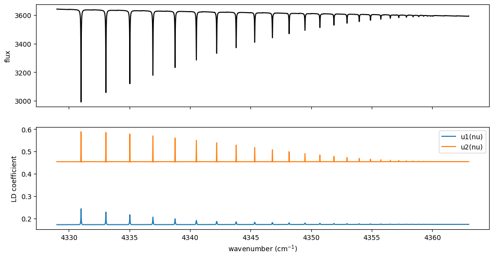
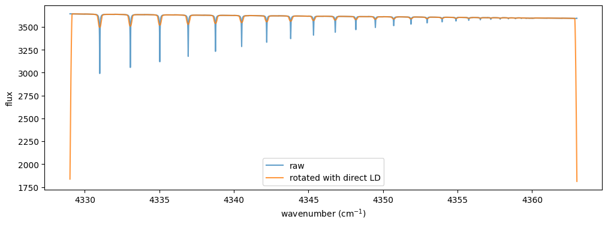
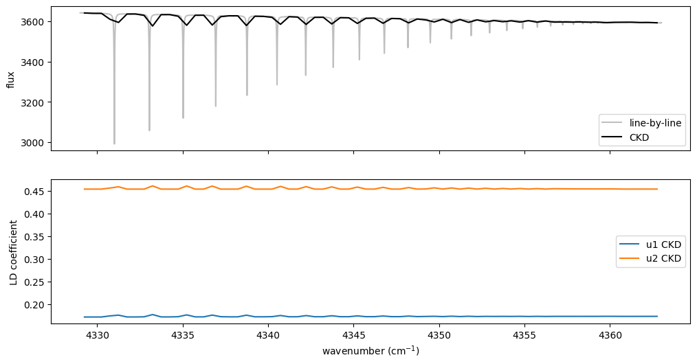

Direct Limb Darkening from Intensity-Based Emission
===================================================

Last update: August 2026, for ExoJAX 2.6.0

This tutorial shows how to derive quadratic limb-darkening coefficients
directly from the angular intensities computed by the intensity-based
emission solver. The workflow follows the standard ``get_started``
emission example: CO molecular absorption plus H2-H2 CIA continuum
opacity.

The key point is that ``ArtEmisPure`` with ``rtsolver="ibased"``
internally computes emergent intensities at Gauss-Legendre quadrature
points. ExoJAX can expose those intensities as ``I(mu, nu)`` and fit the
quadratic law

.. code:: text

   I(mu) / I(1) = 1 - u1 (1 - mu) - u2 (1 - mu)^2

without treating ``u1`` and ``u2`` as free post-processing parameters.

This notebook assumes the same local databases as the getting-started
emission tutorials:

-  ``.database/CO/12C-16O/Li2015``
-  ``.database/H2-H2_2011.cia``

Use ``nstream >= 6`` for a quadratic fit because the upward hemisphere
has ``N' = nstream / 2`` quadrature points.

.. code:: ipython3

    from jax import config
    config.update("jax_enable_x64", True)
    
    import matplotlib.pyplot as plt
    import numpy as np
    import jax.numpy as jnp

1. Build the Same CO + CIA Emission Model as ``get_started``
------------------------------------------------------------

Use a moderate grid so that the tutorial runs quickly while keeping the
setup close to the standard emission workflow.

.. code:: ipython3

    from exojax.utils.grids import wavenumber_grid
    
    Nnus = 20000
    nu_grid, wav, resolution = wavenumber_grid(
        22920.0,
        23100.0,
        Nnus,
        unit="AA",
        xsmode="premodit",
        wavelength_order="ascending",
    )
    print(f"Nnu = {len(nu_grid)}, resolution = {resolution:.1f}")

.. parsed-literal::

    xsmode =  premodit
    xsmode assumes ESLOG in wavenumber space: xsmode=premodit
    Your wavelength grid is in ***  ascending  *** order
    The wavenumber grid is in ascending order by definition.
    Please be careful when you use the wavelength grid.
    Nnu = 20000, resolution = 2556525.8

.. parsed-literal::

    /home/kawahara/exojax/src/exojax/utils/grids.py:85: UserWarning: Both input wavelength and output wavenumber are in ascending order.
      warnings.warn(

.. code:: ipython3

    from exojax.database.exomol.api import MdbExomol
    from exojax.opacity import OpaPremodit
    
    mdb = MdbExomol(".database/CO/12C-16O/Li2015", nurange=nu_grid)
    molmass = mdb.molmass
    snapshot = mdb.to_snapshot()
    del mdb
    
    opa = OpaPremodit.from_snapshot(
        snapshot,
        nu_grid,
        auto_trange=(500.0, 1500.0),
        dit_grid_resolution=1.0,
    )

.. parsed-literal::

    radis== 0.15.2
    HITRAN exact name= (12C)(16O)
    radis engine =  pytables
    		 => Downloading from http://www.exomol.com/db/CO/12C-16O/Li2015/12C-16O__Li2015.def

.. parsed-literal::

    /home/kawahara/exojax/src/exojax/database/_common/radis_adapter.py:63: UserWarning: The current version of radis does not support broadf_download (requires >=0.16).
      warnings.warn(msg, UserWarning)
    /home/kawahara/exojax/src/exojax/utils/molname.py:197: FutureWarning: e2s will be replaced to exact_molname_exomol_to_simple_molname.
      warnings.warn(
    /home/kawahara/exojax/src/exojax/utils/molname.py:91: FutureWarning: exojax.utils.molname.exact_molname_exomol_to_simple_molname will be replaced to radis.api.exomolapi.exact_molname_exomol_to_simple_molname.
      warnings.warn(
    /home/kawahara/exojax/src/exojax/utils/molname.py:91: FutureWarning: exojax.utils.molname.exact_molname_exomol_to_simple_molname will be replaced to radis.api.exomolapi.exact_molname_exomol_to_simple_molname.
      warnings.warn(

.. parsed-literal::

    		 => Downloading from http://www.exomol.com/db/CO/12C-16O/Li2015/12C-16O__Li2015.pf
    		 => Downloading from http://www.exomol.com/db/CO/12C-16O/Li2015/12C-16O__Li2015.states.bz2
    		 => Downloading from http://www.exomol.com/db/CO/12C-16O/12C-16O__H2.broad
    		 => Downloading from http://www.exomol.com/db/CO/12C-16O/12C-16O__He.broad
    		 => Downloading from http://www.exomol.com/db/CO/12C-16O/12C-16O__air.broad
    Note: Caching states data to the pytables format. After the second time, it will become much faster.
    Molecule:  CO
    Isotopologue:  12C-16O
    Background atmosphere:  H2
    ExoMol database:  None
    Local folder:  .database/CO/12C-16O/Li2015
    Transition files: 
    	 => File 12C-16O__Li2015.trans
    		 => Downloading from http://www.exomol.com/db/CO/12C-16O/Li2015/12C-16O__Li2015.trans.bz2
    		 => Caching the *.trans.bz2 file to the pytables (*.h5) format. After the second time, it will become much faster.
    		 => You can deleted the 'trans.bz2' file by hand.
    Broadener:  H2
    Broadening code level: a0
    default elower grid trange (degt) file version: 2
    Robust range: 485.7803992045456 - 1514.171191195336 K

.. parsed-literal::

    /home/kawahara/miniconda3/lib/python3.12/site-packages/radis-0.15.2-py3.12.egg/radis/api/exomolapi.py:685: AccuracyWarning: The default broadening parameter (alpha = 0.07 cm^-1 and n = 0.5) are used for J'' > 80 up to J'' = 152
      warnings.warn(
    /home/kawahara/exojax/src/exojax/opacity/premodit/core.py:28: UserWarning: dit_grid_resolution is not None. Ignoring broadening_parameter_resolution.
      warnings.warn(

.. parsed-literal::

    max value of  ngamma_ref_grid : 24.16668486178811
    min value of  ngamma_ref_grid : 20.063716461253346
    ngamma_ref_grid grid : [20.06371498 24.16668701]
    max value of  n_Texp_grid : 0.658
    min value of  n_Texp_grid : 0.5
    n_Texp_grid grid : [0.49999997 0.65800005]

.. parsed-literal::

    uniqidx: 0it [00:00, ?it/s]

.. parsed-literal::

    Premodit: Twt= 1108.7151960064205 K Tref= 570.4914318566549 K
    Making LSD: [####################] 100%

.. code:: ipython3

    from exojax.rt import ArtEmisPure
    from exojax.utils.astrofunc import gravity_jupiter
    
    art = ArtEmisPure(
        pressure_top=1.0e-5,
        pressure_btm=1.0e1,
        nlayer=100,
        nu_grid=nu_grid,
        rtsolver="ibased",
        nstream=8,
    )
    art.change_temperature_range(400.0, 1500.0)
    
    Tarr = art.clip_temperature(art.powerlaw_temperature(900.0, 0.1))
    mmr_profile = art.constant_mmr_profile(1.0e-5)
    gravity = gravity_jupiter(1.0, 10.0)

.. parsed-literal::

    rtsolver:  ibased
    Intensity-based n-stream solver, isothermal layer (e.g. NEMESIS, pRT like)

.. code:: ipython3

    from exojax.database.contdb import CdbCIA
    from exojax.opacity import OpaCIA
    
    cdb = CdbCIA(".database/H2-H2_2011.cia", nurange=nu_grid)
    opacia = OpaCIA(cdb, nu_grid=nu_grid)
    
    xsmatrix = opa.xsmatrix(Tarr, art.pressure)
    logacia_matrix = opacia.logacia_matrix(Tarr)
    
    dtau_co = art.opacity_profile_xs(xsmatrix, mmr_profile, molmass, gravity)
    vmrH2 = 0.855
    mmw = 2.33
    dtau_cia = art.opacity_profile_cia(logacia_matrix, Tarr, vmrH2, vmrH2, mmw, gravity)
    dtau = dtau_co + dtau_cia

.. parsed-literal::

    Downloading HITRAN CIA data...
    Load CIA:  H2-H2

2. Compute Flux and Limb Darkening in One RT Pass
-------------------------------------------------

``run_with_limb_darkening`` runs the intensity-based RT once. It returns
the flux and wavelength-dependent quadratic coefficients ``u1(nu)`` and
``u2(nu)`` derived from the same ``I(mu, nu)`` used for the flux
integral.

.. code:: ipython3

    flux, u1_nu, u2_nu = art.run_with_limb_darkening(dtau, Tarr)
    flux_check = art.run(dtau, Tarr)
    print("max relative flux difference =", np.max(np.abs(flux / flux_check - 1.0)))
    print("u1 shape =", u1_nu.shape, "u2 shape =", u2_nu.shape)

.. parsed-literal::

    max relative flux difference = 0.0
    u1 shape = (20000,) u2 shape = (20000,)

.. code:: ipython3

    fig, axes = plt.subplots(2, 1, figsize=(12, 6), sharex=True)
    axes[0].plot(nu_grid, flux, color="black")
    axes[0].set_ylabel("flux")
    axes[1].plot(nu_grid, u1_nu, label="u1(nu)")
    axes[1].plot(nu_grid, u2_nu, label="u2(nu)")
    axes[1].set_xlabel("wavenumber (cm$^{-1}$)")
    axes[1].set_ylabel("LD coefficient")
    axes[1].legend()
    plt.show()

The existing rigid-rotation operator uses scalar ``u1`` and ``u2``,
because it assumes one rotation kernel over the modeled spectral
segment. A practical first-order choice is to flux-weight the
wavelength-dependent coefficients over the segment.

.. code:: ipython3

    from exojax.postproc.limb_darkening import average_limb_darkening_coefficients
    from exojax.postproc.specop import SopRotation
    
    u1_scalar, u2_scalar = average_limb_darkening_coefficients(u1_nu, u2_nu, flux)
    print("flux-weighted u1, u2 =", float(u1_scalar), float(u2_scalar))
    
    sop_rot = SopRotation(nu_grid, vsini_max=100.0)
    vsini = 10.0
    flux_rot = sop_rot.rigid_rotation(flux, vsini, u1_scalar, u2_scalar)

.. parsed-literal::

    flux-weighted u1, u2 = 0.1729588823832821 0.454857167340709

.. code:: ipython3

    fig = plt.figure(figsize=(12, 4))
    plt.plot(nu_grid, flux, label="raw", alpha=0.7)
    plt.plot(nu_grid, flux_rot, label="rotated with direct LD", alpha=0.8)
    plt.xlabel("wavenumber (cm$^{-1}$)")
    plt.ylabel("flux")
    plt.legend()
    plt.show()

3. CKD Emission
---------------

For CKD, ``run_ckd_with_limb_darkening`` returns band fluxes and
band-wise limb-darkening coefficients. The example below applies CKD to
the CO opacity. The CIA optical depth is sampled at the band centers and
broadcast over the CKD g-ordinates before being added.

.. code:: ipython3

    from exojax.opacity import OpaCKD
    
    opa_ckd = OpaCKD(opa, Ng=16, band_width=0.5)
    T_grid = np.linspace(float(np.min(Tarr)), float(np.max(Tarr)), 10)
    P_grid = np.logspace(np.log10(float(np.min(art.pressure))), np.log10(float(np.max(art.pressure))), 10)
    opa_ckd.precompute_tables(T_grid, P_grid)
    
    xs_ckd = opa_ckd.xstensor_ckd(Tarr, art.pressure)
    dtau_co_ckd = art.opacity_profile_xs_ckd(xs_ckd, mmr_profile, molmass, gravity)
    
    # Add CIA at the CKD band centers. jnp.interp operates along one vector,
    # so map it over atmospheric layers.
    dtau_cia_bands = jnp.vstack([
        jnp.interp(opa_ckd.nu_bands, nu_grid, dtau_cia_layer)
        for dtau_cia_layer in dtau_cia
    ])
    dtau_ckd = dtau_co_ckd + dtau_cia_bands[:, None, :]
    
    flux_ckd, u1_ckd, u2_ckd = art.run_ckd_with_limb_darkening(
        dtau_ckd,
        Tarr,
        opa_ckd.ckd_info.weights,
        opa_ckd.nu_bands,
    )
    print("CKD flux shape =", flux_ckd.shape)
    print("CKD u1 shape =", u1_ckd.shape)

.. parsed-literal::

    Generated g-grid: 16 points, range [0.0053, 0.9947]
    Processing 68 spectral bands...
      Band 1: [4329.0, 4329.5] cm⁻¹, 295 frequencies
      Band 2: [4329.5, 4330.0] cm⁻¹, 294 frequencies
      Band 3: [4330.0, 4330.5] cm⁻¹, 294 frequencies
      Band 4: [4330.5, 4331.0] cm⁻¹, 294 frequencies
      Band 5: [4331.0, 4331.5] cm⁻¹, 294 frequencies
      Band 6: [4331.5, 4332.0] cm⁻¹, 294 frequencies
      Band 7: [4332.0, 4332.5] cm⁻¹, 294 frequencies
      Band 8: [4332.5, 4333.0] cm⁻¹, 294 frequencies
      Band 9: [4333.0, 4333.5] cm⁻¹, 294 frequencies
      Band 10: [4333.5, 4334.0] cm⁻¹, 295 frequencies
      Band 11: [4334.0, 4334.5] cm⁻¹, 294 frequencies
      Band 12: [4334.5, 4335.0] cm⁻¹, 294 frequencies
      Band 13: [4335.0, 4335.5] cm⁻¹, 294 frequencies
      Band 14: [4335.5, 4336.0] cm⁻¹, 294 frequencies
      Band 15: [4336.0, 4336.5] cm⁻¹, 294 frequencies
      Band 16: [4336.5, 4337.0] cm⁻¹, 294 frequencies
      Band 17: [4337.0, 4337.5] cm⁻¹, 294 frequencies
      Band 18: [4337.5, 4338.0] cm⁻¹, 294 frequencies
      Band 19: [4338.0, 4338.5] cm⁻¹, 294 frequencies
      Band 20: [4338.5, 4339.0] cm⁻¹, 295 frequencies
      Band 21: [4339.0, 4339.5] cm⁻¹, 294 frequencies
      Band 22: [4339.5, 4340.0] cm⁻¹, 294 frequencies
      Band 23: [4340.0, 4340.5] cm⁻¹, 294 frequencies
      Band 24: [4340.5, 4341.0] cm⁻¹, 294 frequencies
      Band 25: [4341.0, 4341.5] cm⁻¹, 294 frequencies
      Band 26: [4341.5, 4342.0] cm⁻¹, 294 frequencies
      Band 27: [4342.0, 4342.5] cm⁻¹, 294 frequencies
      Band 28: [4342.5, 4343.0] cm⁻¹, 294 frequencies
      Band 29: [4343.0, 4343.5] cm⁻¹, 294 frequencies
      Band 30: [4343.5, 4344.0] cm⁻¹, 295 frequencies
      Band 31: [4344.0, 4344.5] cm⁻¹, 294 frequencies
      Band 32: [4344.5, 4345.0] cm⁻¹, 294 frequencies
      Band 33: [4345.0, 4345.5] cm⁻¹, 294 frequencies
      Band 34: [4345.5, 4346.0] cm⁻¹, 294 frequencies
      Band 35: [4346.0, 4346.5] cm⁻¹, 294 frequencies
      Band 36: [4346.5, 4347.0] cm⁻¹, 294 frequencies
      Band 37: [4347.0, 4347.5] cm⁻¹, 294 frequencies
      Band 38: [4347.5, 4348.0] cm⁻¹, 294 frequencies
      Band 39: [4348.0, 4348.5] cm⁻¹, 295 frequencies
      Band 40: [4348.5, 4349.0] cm⁻¹, 294 frequencies
      Band 41: [4349.0, 4349.5] cm⁻¹, 294 frequencies
      Band 42: [4349.5, 4350.0] cm⁻¹, 294 frequencies
      Band 43: [4350.0, 4350.5] cm⁻¹, 294 frequencies
      Band 44: [4350.5, 4351.0] cm⁻¹, 294 frequencies
      Band 45: [4351.0, 4351.5] cm⁻¹, 294 frequencies
      Band 46: [4351.5, 4352.0] cm⁻¹, 294 frequencies
      Band 47: [4352.0, 4352.5] cm⁻¹, 294 frequencies
      Band 48: [4352.5, 4353.0] cm⁻¹, 294 frequencies
      Band 49: [4353.0, 4353.5] cm⁻¹, 295 frequencies
      Band 50: [4353.5, 4354.0] cm⁻¹, 294 frequencies
      Band 51: [4354.0, 4354.5] cm⁻¹, 294 frequencies
      Band 52: [4354.5, 4355.0] cm⁻¹, 294 frequencies
      Band 53: [4355.0, 4355.5] cm⁻¹, 294 frequencies
      Band 54: [4355.5, 4356.0] cm⁻¹, 294 frequencies
      Band 55: [4356.0, 4356.5] cm⁻¹, 294 frequencies
      Band 56: [4356.5, 4357.0] cm⁻¹, 294 frequencies
      Band 57: [4357.0, 4357.5] cm⁻¹, 294 frequencies
      Band 58: [4357.5, 4358.0] cm⁻¹, 294 frequencies
      Band 59: [4358.0, 4358.5] cm⁻¹, 295 frequencies
      Band 60: [4358.5, 4359.0] cm⁻¹, 294 frequencies
      Band 61: [4359.0, 4359.5] cm⁻¹, 294 frequencies
      Band 62: [4359.5, 4360.0] cm⁻¹, 294 frequencies
      Band 63: [4360.0, 4360.5] cm⁻¹, 294 frequencies
      Band 64: [4360.5, 4361.0] cm⁻¹, 294 frequencies
      Band 65: [4361.0, 4361.5] cm⁻¹, 294 frequencies
      Band 66: [4361.5, 4362.0] cm⁻¹, 294 frequencies
      Band 67: [4362.0, 4362.5] cm⁻¹, 294 frequencies
      Band 68: [4362.5, 4363.0] cm⁻¹, 295 frequencies
    Creating CKD table info...
    CKD precomputation complete! Ready for interpolation.
    Table dimensions: T=10, P=10, g=16, bands=68
    CKD flux shape = (68,)
    CKD u1 shape = (68,)

.. code:: ipython3

    fig, axes = plt.subplots(2, 1, figsize=(12, 6), sharex=True)
    axes[0].plot(nu_grid, flux, color="gray", alpha=0.5, label="line-by-line")
    axes[0].plot(opa_ckd.nu_bands, flux_ckd, color="black", label="CKD")
    axes[0].set_ylabel("flux")
    axes[0].legend()
    axes[1].plot(opa_ckd.nu_bands, u1_ckd, label="u1 CKD")
    axes[1].plot(opa_ckd.nu_bands, u2_ckd, label="u2 CKD")
    axes[1].set_xlabel("wavenumber (cm$^{-1}$)")
    axes[1].set_ylabel("LD coefficient")
    axes[1].legend()
    plt.show()

4. Layer-Wise ``OpartEmisPure``
-------------------------------

``OpartEmisPure`` can derive direct limb darkening as well. The only
difference is that the user-supplied layer update function should call
``update_layer_intensity`` instead of ``update_layer``. This stores the
``(N_mu, N_nu)`` intensity carry while still avoiding a full
``(N_layer, N_nu)`` opacity matrix.

.. code:: ipython3

    from exojax.rt import OpartEmisPure
    from exojax.rt.layeropacity import single_layer_optical_depth, single_layer_optical_depth_CIA
    
    class OpaLayer:
        def __init__(self, nu_grid, snapshot, molmass):
            self.nu_grid = nu_grid
            self.molmass = molmass
            self.opa_co = OpaPremodit.from_snapshot(
                snapshot,
                self.nu_grid,
                auto_trange=(500.0, 1500.0),
                dit_grid_resolution=1.0,
                allow_32bit=True,
            )
            self.cdb_cia = CdbCIA(".database/H2-H2_2011.cia", nurange=self.nu_grid)
            self.opa_cia = OpaCIA(self.cdb_cia, nu_grid=self.nu_grid)
            self.gravity = gravity_jupiter(1.0, 10.0)
            self.vmrH2 = 0.855
            self.mmw = 2.33
    
        def __call__(self, params):
            temperature, pressure, dP, mixing_ratio = params
            xsv_co = self.opa_co.xsvector(temperature, pressure)
            dtau_co = single_layer_optical_depth(
                dP, xsv_co, mixing_ratio, self.molmass, self.gravity
            )
            logacia_vector = self.opa_cia.logacia_vector(temperature)
            dtau_cia = single_layer_optical_depth_CIA(
                temperature,
                pressure,
                dP,
                self.vmrH2,
                self.vmrH2,
                self.mmw,
                self.gravity,
                logacia_vector,
            )
            return dtau_co + dtau_cia

.. code:: ipython3

    opalayer = OpaLayer(nu_grid, snapshot, molmass)
    opart = OpartEmisPure(
        opalayer,
        pressure_top=1.0e-5,
        pressure_btm=1.0e1,
        nlayer=100,
        nstream=8,
    )
    opart.change_temperature_range(400.0, 1500.0)
    
    def layer_update_function_intensity(carry_tauintensity, params):
        carry_tauintensity = opart.update_layer_intensity(carry_tauintensity, params)
        return carry_tauintensity, None
    
    Tarr_opart = opart.clip_temperature(opart.powerlaw_temperature(900.0, 0.1))
    mmr_profile_opart = opart.constant_mmr_profile(1.0e-5)
    layer_params = [Tarr_opart, opart.pressure, opart.dParr, mmr_profile_opart]
    
    flux_opart, u1_opart, u2_opart = opart.run_with_limb_darkening(
        layer_params,
        layer_update_function_intensity,
    )
    print("Opart flux shape =", flux_opart.shape)
    print("Opart u1 shape =", u1_opart.shape)

.. parsed-literal::

    default elower grid trange (degt) file version: 2
    Robust range: 485.7803992045456 - 1514.171191195336 K
    max value of  ngamma_ref_grid : 24.16668486178811
    min value of  ngamma_ref_grid : 20.063716461253346
    ngamma_ref_grid grid : [20.06371498 24.16668701]
    max value of  n_Texp_grid : 0.658
    min value of  n_Texp_grid : 0.5
    n_Texp_grid grid : [0.49999997 0.65800005]

.. parsed-literal::

    uniqidx: 0it [00:00, ?it/s]

.. parsed-literal::

    Premodit: Twt= 1108.7151960064205 K Tref= 570.4914318566549 K
    Making LSD: [####################] 100%

.. parsed-literal::

    Load CIA:  H2-H2
    Opart flux shape = (20000,)
    Opart u1 shape = (20000,)

Notes
-----

-  ``run_intensity`` and ``run_with_limb_darkening`` currently apply to
   the isothermal-layer ``ibased`` pure-absorption solver.
-  Use ``nstream >= 6`` for quadratic limb darkening. The default
   ``nstream=8`` gives four upward quadrature points.
-  ``u1(nu)`` and ``u2(nu)`` are wavelength dependent. The current
   ``SopRotation.rigid_rotation`` kernel accepts scalar coefficients, so
   use a representative average when connecting direct LD to the
   existing rotation postprocess.
-  A fully wavelength-dependent rotational integral would require a
   different operator, because the local spectrum and limb darkening
   both depend on ``mu``.
