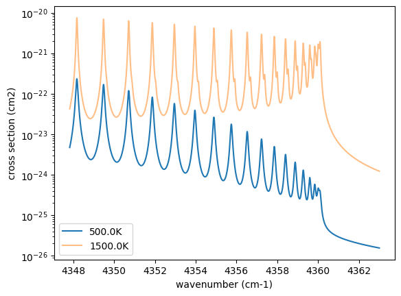
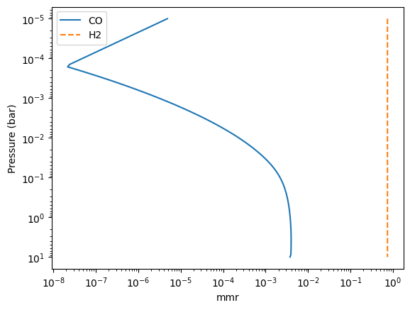
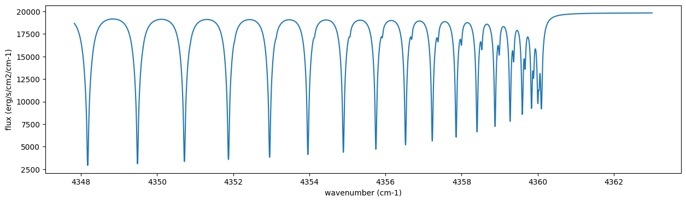
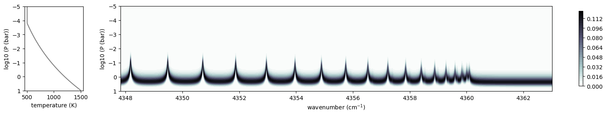
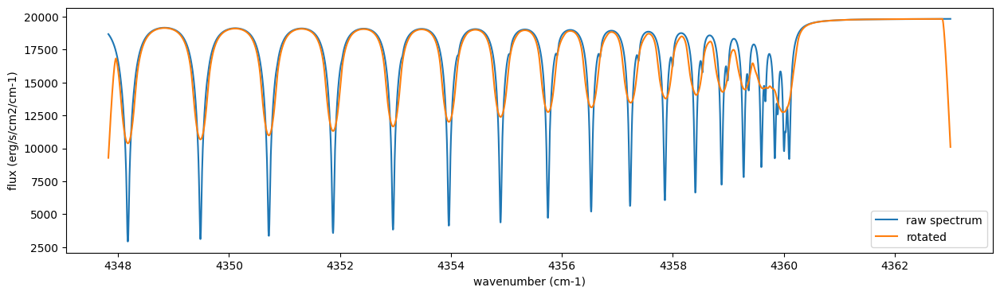
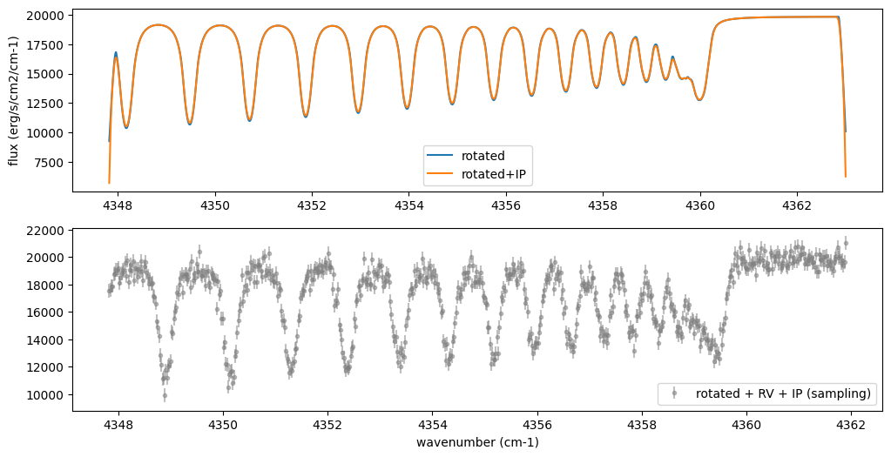

Emission Spectroscopy with Equilibirum Chemistry
================================================

Last update: March 23th (2026) Hajime Kawahara for v2.1

In this getting started guide, we will use ExoJAX to simulate a
high-resolution emission spectrum from an atmosphere with CO molecular
absorption and hydrogen molecule CIA continuum absorption as the opacity
sources. We assume the thermochemical equilibrium. We will then add
appropriate noise to the simulated spectrum to create a mock spectrum
and perform spectral retrieval using NumPyro’s HMC NUTS.

To compute Thermo Chemical Equilibrium (TCE), we use a differentiable
TCE calculator,
`ExoGibbs <https://github.com/HajimeKawahara/exogibbs>`__ (v0.3.9)

First, we recommend 64-bit if you do not think about numerical errors.
Use jax.config to set 64-bit. (But note that 32-bit is sufficient in
most cases. Consider to use 32-bit (faster, less device memory) for your
real use case.)

.. code:: ipython3

    from jax import config
    config.update("jax_enable_x64", True)

1. Loading a molecular database using mdb
-----------------------------------------

ExoJAX has an API for molecular databases, called ``mdb`` (or ``adb``
for atomic datbases). Prior to loading the database, define the
wavenumber range first.

.. code:: ipython3

    from exojax.utils.grids import wavenumber_grid
    
    nu_grid, wav, resolution = wavenumber_grid(
        22920.0, 23000.0, 3500, unit="AA", xsmode="premodit"
    )
    print("Resolution=", resolution)

.. parsed-literal::

    xsmode =  premodit
    xsmode assumes ESLOG in wavenumber space: xsmode=premodit
    Your wavelength grid is in ***  descending  *** order
    The wavenumber grid is in ascending order by definition.
    Please be careful when you use the wavelength grid.
    Resolution= 1004211.9840291934

.. parsed-literal::

    /home/kawahara/exojax/src/exojax/utils/grids.py:85: UserWarning: Both input wavelength and output wavenumber are in ascending order.
      warnings.warn(

Then, let’s load the molecular database. We here use Carbon monoxide in
Exomol. ``CO/12C-16O/Li2015`` means
``Carbon monoxide/ isotopes = 12C + 16O / database name``. You can check
the database name in the ExoMol website (https://www.exomol.com/).

.. code:: ipython3

    from exojax.database.exomol.api import MdbExomol
    mdb = MdbExomol(".database/CO/12C-16O/Li2015", nurange=nu_grid)

.. parsed-literal::

    /home/kawahara/exojax/src/exojax/utils/molname.py:197: FutureWarning: e2s will be replaced to exact_molname_exomol_to_simple_molname.
      warnings.warn(
    /home/kawahara/exojax/src/exojax/utils/molname.py:91: FutureWarning: exojax.utils.molname.exact_molname_exomol_to_simple_molname will be replaced to radis.api.exomolapi.exact_molname_exomol_to_simple_molname.
      warnings.warn(
    /home/kawahara/exojax/src/exojax/utils/molname.py:91: FutureWarning: exojax.utils.molname.exact_molname_exomol_to_simple_molname will be replaced to radis.api.exomolapi.exact_molname_exomol_to_simple_molname.
      warnings.warn(

.. parsed-literal::

    HITRAN exact name= (12C)(16O)
    radis engine =  pytables
    Molecule:  CO
    Isotopologue:  12C-16O
    ExoMol database:  None
    Local folder:  .database/CO/12C-16O/Li2015
    Transition files: 
    	 => File 12C-16O__Li2015.trans
    Broadener:  H2
    Broadening code level: a0

.. parsed-literal::

    /home/kawahara/miniconda3/lib/python3.12/site-packages/radis-0.16-py3.12.egg/radis/api/exomolapi.py:687: AccuracyWarning: The default broadening parameter (alpha = 0.07 cm^-1 and n = 0.5) are used for J'' > 80 up to J'' = 152
      warnings.warn(

2. Computation of the Cross Section using opa
---------------------------------------------

ExoJAX has various opacity calculator classes, so-called ``opa``. Here,
we use a memory-saved opa, ``OpaPremodit``. We assume the robust
tempreature range we will use is 500-1500K.

.. code:: ipython3

    from exojax.opacity import OpaPremodit
    opa = OpaPremodit(mdb, nu_grid, auto_trange=[500.0, 1500.0], dit_grid_resolution=1.0)

.. parsed-literal::

    /home/kawahara/exojax/src/exojax/opacity/premodit/core.py:28: UserWarning: dit_grid_resolution is not None. Ignoring broadening_parameter_resolution.
      warnings.warn(

.. parsed-literal::

    default elower grid trange (degt) file version: 2
    Robust range: 485.7803992045456 - 1514.171191195336 K
    max value of  ngamma_ref_grid : 9.450919102366303
    min value of  ngamma_ref_grid : 7.881095721823979
    ngamma_ref_grid grid : [7.88109541 9.4509201 ]
    max value of  n_Texp_grid : 0.658
    min value of  n_Texp_grid : 0.5
    n_Texp_grid grid : [0.49999997 0.65800005]

.. parsed-literal::

    uniqidx: 0it [00:00, ?it/s]

.. parsed-literal::

    Premodit: Twt= 1108.7151960064205 K Tref= 570.4914318566549 K
    Making LSD:|####################| 100%

.. parsed-literal::

    

Then let’s compute cross section for two different temperature 500 and
1500 K for P=1.0 bar. opa.xsvector can do that!

.. code:: ipython3

    P = 1.0  # bar
    T_1 = 500.0  # K
    xsv_1 = opa.xsvector(T_1, P)  # cm2
    
    T_2 = 1500.0  # K
    xsv_2 = opa.xsvector(T_2, P)  # cm2

Plot them. It can be seen that different lines are stronger at different
temperatures.

.. code:: ipython3

    import matplotlib.pyplot as plt
    
    plt.plot(nu_grid, xsv_1, label=str(T_1) + "K")  # cm2
    plt.plot(nu_grid, xsv_2, alpha=0.5, label=str(T_2) + "K")  # cm2
    plt.yscale("log")
    plt.legend()
    plt.xlabel("wavenumber (cm-1)")
    plt.ylabel("cross section (cm2)")
    plt.show()

3. Atmospheric Radiative Transfer
---------------------------------

ExoJAX can solve the radiative transfer and derive the emission
spectrum. To do so, ExoJAX has ``art`` class. ``ArtEmisPure`` means
Atomospheric Radiative Transfer for Emission with Pure absorption. So,
``ArtEmisPure`` does not include scattering. We set the number of the
atmospheric layer to 200 (nlayer) and the pressure at bottom and top
atmosphere to 100 and 1.e-5 bar.

Since v1.5, one can choose the rtsolver (radiative transfer solver) from
the flux-based 2 stream solver (``fbase2st``) and the intensity-based
n-stream sovler (``ibased``). Use ``rtsolver`` option. In the latter
case, the number of the stream (``nstream``) can be specified. Note that
the default rtsolver for the pure absorption (i.e. no scattering nor
reflection) has been ``ibased`` since v1.5. In our experience,
``ibased`` is faster and more accurate than ``fbased``.

.. code:: ipython3

    from exojax.rt import ArtEmisPure
    
    art = ArtEmisPure(
        nu_grid=nu_grid,
        pressure_btm=1.0e1,
        pressure_top=1.0e-5,
        nlayer=100,
        rtsolver="ibased",
        nstream=8,
    )

.. parsed-literal::

    rtsolver:  ibased
    Intensity-based n-stream solver, isothermal layer (e.g. NEMESIS, pRT like)

Let’s assume the power law temperature model, within 500 - 1500 K.

:math:`T = T_0 P^\alpha`

where :math:`T_0=1200` K and :math:`\alpha=0.1`.

.. code:: ipython3

    art.change_temperature_range(500.0, 1500.0)
    Tarr = art.powerlaw_temperature(1200.0, 0.1)

Sets chemistry presets

.. code:: ipython3

    from exogibbs.presets.fastchem import chemsetup
    # chemical setup
    chem = chemsetup()
    idx_co = chem.species.index("C1O1")
    print("idx for CO=",idx_co, "JANAF name", chem.species[idx_co])  # check index of CO
    idx_h2 = chem.species.index("H2")
    print("idx for H2=",idx_h2, "JANAF name", chem.species[idx_h2])  # check index of H2
    print("element:", chem.elements)

.. parsed-literal::

    restricting species to those composed of the default elements only.
    fastchem presets in ExoGibbs
    number of species: 523 elements: 28 molecules: 495
    idx for CO= 102 JANAF name C1O1
    idx for H2= 331 JANAF name H2
    element: ('Al', 'Ar', 'C', 'Ca', 'Cl', 'Co', 'Cr', 'Cu', 'F', 'Fe', 'Ge', 'H', 'He', 'K', 'Mg', 'Mn', 'N', 'Na', 'Ne', 'Ni', 'O', 'P', 'S', 'Si', 'Ti', 'V', 'Zn', 'e-')

Sets solar abundance (AAG21) as the elemental vector. Do not forget e-!

.. code:: ipython3

    from exojax.utils.zsol import nsol
    import jax.numpy as jnp
    solar_abundance = nsol()
    nsol_vector = jnp.array([solar_abundance[el] for el in chem.elements[:-1]]) # no solar abundance for e-
    element_vector = jnp.append(nsol_vector, 0) 
        
    print("element_vector:", element_vector)

.. parsed-literal::

    Database for solar abundance =  AAG21
    Asplund, M., Amarsi, A. M., & Grevesse, N. 2021, arXiv:2105.01661
    element_vector: [2.48498877e-06 2.21474857e-06 2.66271344e-04 1.84214763e-06
     1.88505676e-07 8.04126604e-08 3.84879191e-07 1.39741188e-08
     2.31912646e-08 2.66271344e-05 3.84879191e-09 9.23260873e-01
     7.57398483e-02 1.08473694e-07 3.27585319e-05 2.42842352e-07
     6.24200958e-05 1.53223166e-06 1.06004531e-04 1.46326987e-06
     4.52193620e-04 2.37314585e-07 1.21709487e-05 2.98761362e-05
     8.61637180e-08 7.33372179e-09 3.35215762e-08 0.00000000e+00]

The mass mixing ratio of CO (MMR) should be computed based on the
thermochemical equilibirum.

.. code:: ipython3

    from exogibbs.api import get_default_equilibrium_grid_path
    from exogibbs.api import load_equilibrium_grid_netcdf
    from exogibbs.api.equilibrium import (
        EquilibriumOptions,
        GridEquilibriumInitializer,
        equilibrium_profile,
    )
    
    from exojax.atm.atmconvert import vmr_to_mmr
    from exojax.database.molinfo.mass import isotope_molmass
    
    # Thermodynamic conditions
    Pref = 1.0  # bar, reference pressure
    
    grid_path = get_default_equilibrium_grid_path("fastchem")
    grid = load_equilibrium_grid_netcdf(str(grid_path))
    initializer = GridEquilibriumInitializer(grid=grid, preset_name="fastchem")
    method = "vmap_cold"
    opts = EquilibriumOptions(epsilon_crit=1e-11, max_iter=1000, method=method)
    
    res = equilibrium_profile(
        chem,
        Tarr,
        art.pressure,
        element_vector,
        Pref=Pref,
        initializer=initializer,
        options=opts,
    )
    nk_result = res.x
    vmr_co = nk_result[:, idx_co]
    vmr_h2 = nk_result[:, idx_h2]
    
    mean_molecular_weight = 2.33  ## assume constant (not accurate)
    molmass = isotope_molmass("12C-16O")
    mmr_profile = vmr_to_mmr(vmr_co, molmass, mean_molecular_weight)
    mmr_profile_h2 = vmr_to_mmr(vmr_h2, isotope_molmass("1H2"), mean_molecular_weight)
    
    import matplotlib.pyplot as plt
    
    fig = plt.figure()
    ax = fig.add_subplot(111)
    ax.plot(mmr_profile, art.pressure, label="CO")
    ax.plot(mmr_profile_h2, art.pressure, ls="--", label="H2")
    
    ax.invert_yaxis()
    ax.legend()
    ax.set_xscale("log")
    ax.set_yscale("log")
    ax.set_xlabel("mmr")
    ax.set_ylabel("Pressure (bar)")
    plt.show()

.. parsed-literal::

    HITRAN exact name= (12C)(16O)
    HITRAN exact name= H2

.. parsed-literal::

    /home/kawahara/exojax/src/exojax/utils/molname.py:91: FutureWarning: exojax.utils.molname.exact_molname_exomol_to_simple_molname will be replaced to radis.api.exomolapi.exact_molname_exomol_to_simple_molname.
      warnings.warn(
    /home/kawahara/exojax/src/exojax/utils/molname.py:91: FutureWarning: exojax.utils.molname.exact_molname_exomol_to_simple_molname will be replaced to radis.api.exomolapi.exact_molname_exomol_to_simple_molname.
      warnings.warn(

Surface gravity is also important quantity of the atmospheric model,
which is a function of planetary radius and mass. Here we assume 1 RJ
and 10 MJ.

.. code:: ipython3

    from exojax.utils.astrofunc import gravity_jupiter
    
    gravity = gravity_jupiter(1.0, 10.0)

In addition to the CO cross section, we would consider `collisional
induced
absorption <https://en.wikipedia.org/wiki/Collision-induced_absorption_and_emission>`__
(CIA) as a continuum opacity. ``cdb`` class can be used.

.. code:: ipython3

    from exojax.database.contdb  import CdbCIA
    from exojax.opacity import OpaCIA
    
    cdb = CdbCIA(".database/H2-H2_2011.cia", nurange=nu_grid)
    opacia = OpaCIA(cdb, nu_grid=nu_grid)

.. parsed-literal::

    Load CIA:  H2-H2

Before running the radiative transfer, we need cross sections for
layers, called ``xsmatrix`` for CO and ``logacia_matrix`` for CIA
(strictly speaking, the latter is not cross section but coefficient
because CIA intensity is proportional density square). See
`here <CIA_opacity.html>`__ for the details.

.. code:: ipython3

    xsmatrix = opa.xsmatrix(Tarr, art.pressure)
    logacia_matrix = opacia.logacia_matrix(Tarr)

Convert them to opacity

.. code:: ipython3

    dtau_CO = art.opacity_profile_xs(xsmatrix, mmr_profile, mdb.molmass, gravity)
    #vmrH2 = 0.855  # VMR of H2
    dtaucia = art.opacity_profile_cia(logacia_matrix, Tarr, vmr_h2, vmr_h2, mean_molecular_weight, gravity)

Add two opacities.

.. code:: ipython3

    dtau = dtau_CO + dtaucia

Then, run the radiative transfer. As you can see, the emission spectrum
has been generated. This spectrum shows a region near 4360 cm-1, or
around 22940 AA, where CO features become increasingly dense. This
region is referred to as the band head. If you’re interested in why the
band head occurs, please refer to `Quatum states of Carbon Monoxide and
Fortrat Diagram <Fortrat.html>`__.

.. code:: ipython3

    F = art.run(dtau, Tarr)
    
    fig = plt.figure(figsize=(15, 4))
    plt.plot(nu_grid, F)
    plt.xlabel("wavenumber (cm-1)")
    plt.ylabel("flux (erg/s/cm2/cm-1)")
    plt.show()

You can check the contribution function too! You should check if the
dominant contribution is within the layer. If not, you need to change
``pressure_top`` and ``pressure_btm`` in ``ArtEmisPure``

.. code:: ipython3

    from exojax.plot.atmplot import plotcf

.. code:: ipython3

    cf = plotcf(nu_grid, dtau, Tarr, art.pressure, art.dParr)

4. Spectral Operators: rotational broadening, instrumental profile, Doppler velocity shift and so on, any operation on spectra.
-------------------------------------------------------------------------------------------------------------------------------

The above spectrum is called “raw spectrum” in ExoJAX. The effects
applied to the raw spectrum is handled in ExoJAX by the spectral
operator (``sop``). First, we apply the spin rotational broadening of a
planet.

.. code:: ipython3

    from exojax.postproc.specop import SopRotation
    
    sop_rot = SopRotation(nu_grid, vsini_max=100.0)
    
    vsini = 10.0
    u1 = 0.0
    u2 = 0.0
    Frot = sop_rot.rigid_rotation(F, vsini, u1, u2)

.. code:: ipython3

    fig = plt.figure(figsize=(15, 4))
    plt.plot(nu_grid, F, label="raw spectrum")
    plt.plot(nu_grid, Frot, label="rotated")
    plt.xlabel("wavenumber (cm-1)")
    plt.ylabel("flux (erg/s/cm2/cm-1)")
    plt.legend()
    plt.show()

Then, the instrumental profile with relative radial velocity shift is
applied. Also, we need to match the computed spectrum to the data grid.
This process is called ``sampling`` (but just interpolation though).
Below, let’s perform a simulation that includes noise for use in later
analysis.

.. code:: ipython3

    from exojax.postproc.specop import SopInstProfile
    from exojax.utils.instfunc import resolution_to_gaussian_std
    
    sop_inst = SopInstProfile(nu_grid, vrmax=1000.0)
    
    RV = 40.0  # km/s
    resolution_inst =70000.0
    beta_inst = resolution_to_gaussian_std(resolution_inst)
    Finst = sop_inst.ipgauss(Frot, beta_inst)
    nu_obs = nu_grid[::5][:-50]
    
    
    from numpy.random import normal
    noise = 500.0
    Fobs = sop_inst.sampling(Finst, RV, nu_obs) + normal(0.0, noise, len(nu_obs))

.. code:: ipython3

    fig = plt.figure(figsize=(12, 6))
    ax = fig.add_subplot(211)
    plt.plot(nu_grid, Frot, label="rotated")
    plt.plot(nu_grid, Finst, label="rotated+IP")
    plt.ylabel("flux (erg/s/cm2/cm-1)")
    plt.legend()
    ax = fig.add_subplot(212)
    plt.errorbar(nu_obs, Fobs, noise, fmt=".", label="rotated + RV + IP (sampling)", color="gray",alpha=0.5)
    plt.xlabel("wavenumber (cm-1)")
    plt.legend()
    plt.show()

5. Retrieval of an Emission Spectrum
------------------------------------

Next, let’s perform a “retrieval” on the simulated spectrum created
above. Retrieval involves estimating the parameters of an atmospheric
model in the form of a posterior distribution based on the spectrum. To
do this, we first need a model. Here, we have compiled the forward
modeling steps so far and defined the model as follows. The spectral
model has six parameters.

.. code:: ipython3

    
    def fspec(T0, alpha, g, RV, vsini, b_element_vector_in):
        #molecule
        Tarr = art.powerlaw_temperature(T0, alpha)
        xsmatrix = opa.xsmatrix(Tarr, art.pressure)
        
        # MMR profile from equilibrium chemistry
        res = equilibrium_profile(chem, Tarr, art.pressure, b_element_vector_in, Pref=Pref, options=opts)
        nk_result = res.x
        vmr_co = nk_result[:, idx_co]
        mmr_arr = vmr_to_mmr(vmr_co, molmass, mean_molecular_weight)
        vmr_h2 = nk_result[:, idx_h2]
        #opacity
        dtau = art.opacity_profile_xs(xsmatrix, mmr_arr, molmass, g)
        #continuum
        logacia_matrix = opacia.logacia_matrix(Tarr)
        dtaucH2H2 = art.opacity_profile_cia(logacia_matrix, Tarr, vmr_h2, vmr_h2,
                                            mean_molecular_weight, g)
        #total tau
        dtau = dtau + dtaucH2H2
        F = art.run(dtau, Tarr)
        Frot = sop_rot.rigid_rotation(F, vsini, u1, u2)
        Finst = sop_inst.ipgauss(Frot, beta_inst)
        mu = sop_inst.sampling(Finst, RV, nu_obs)
        return mu

Let’s verify that spectra are being generated from ``fspec`` with
various parameter sets.

.. code:: ipython3

    fig = plt.figure(figsize=(12, 3))
    
    plt.plot(nu_obs, fspec(1200.0, 0.09,  gravity_jupiter(1.0, 1.0), 40.0, 10.0, element_vector),label="model")
    plt.plot(nu_obs, fspec(1100.0, 0.12,  gravity_jupiter(1.0, 10.0), 20.0, 5.0, element_vector),label="model")

.. parsed-literal::

    [<matplotlib.lines.Line2D at 0x75555849cf20>]

.. image:: equilibrium_chemistry_files/equilibrium_chemistry_53_1.png

NumPyro is a probabilistic programming language (PPL), which requires
the definition of a probabilistic model. In the probabilistic model
``model_prob`` defined below, the prior distributions of each parameter
are specified. The previously defined spectral model is used within this
probabilistic model as a function that provides the mean :math:`\mu`.
The spectrum is assumed to be generated according to a Gaussian
distribution with this mean and a standard deviation :math:`\sigma`.
i.e. :math:`f(\nu_i) \sim \mathcal{N}(\mu(\nu_i; {\bf p}), \sigma^2 I)`,
where :math:`{\bf p}` is the spectral model parameter set, which are the
arguments of ``fspec``.

.. code:: ipython3

    from numpyro.infer import MCMC, NUTS
    import numpyro.distributions as dist
    import numpyro
    from jax import random

.. parsed-literal::

    /home/kawahara/miniconda3/lib/python3.12/site-packages/tqdm/auto.py:21: TqdmWarning: IProgress not found. Please update jupyter and ipywidgets. See https://ipywidgets.readthedocs.io/en/stable/user_install.html
      from .autonotebook import tqdm as notebook_tqdm

.. code:: ipython3

    from exogibbs.api.chemistry import element_indices_by_name, update_element_vector
    # Compute indices once (outside jit/NumPyro tracing)
    _idx_CO = element_indices_by_name(chem, ['C', 'O'])
    _idx_C, _idx_O = map(int, list(_idx_CO))

.. code:: ipython3

    
    def model_prob(spectrum):
    
        # atmospheric/spectral model parameters priors
        logg = numpyro.sample("logg", dist.Uniform(4.0, 5.0))
        RV = numpyro.sample("RV", dist.Uniform(35.0, 45.0))
        T0 = numpyro.sample("T0", dist.Uniform(1000.0, 1500.0))
        alpha = numpyro.sample("alpha", dist.Uniform(0.05, 0.2))
        vsini = numpyro.sample("vsini", dist.Uniform(5.0, 15.0))
        logZ = numpyro.sample("logZ", dist.Uniform(-1.0, 1.0))  #  logC [solar]
        scale = 10**logZ
        
        # Build element vector in a JAX-safe way (scale C/O; set e- to 0)
        element_vector_in = update_element_vector(
            element_vector,
            scale_indices=jnp.array([_idx_C,_idx_O]),
            scales=jnp.array([scale,scale]),
            )
    
        mu = fspec(T0, alpha, 10**logg, RV, vsini, element_vector_in)
    
        # noise model parameters priors
        sigmain = numpyro.sample("sigmain", dist.Exponential(1.0e-3))
    
        numpyro.sample("spectrum", dist.Normal(mu, sigmain), obs=spectrum)

Note that we did not account for the effects of limb darkening. However,
in actual analyses, one possible approach might be to use an
uninformative prior, such as the one proposed by Kipping.

.. code:: python

       from exojax.postproc.limb_darkening import ld_kipping
       q1 = numpyro.sample('q1', dist.Uniform(0.0,1.0))
       q2 = numpyro.sample('q2', dist.Uniform(0.0,1.0))
       u1,u2 = ld_kipping(q1,q2)

Now, let’s define NUTS and start sampling.

.. code:: ipython3

    rng_key = random.PRNGKey(0)
    rng_key, rng_key_ = random.split(rng_key)
    num_warmup, num_samples = 500, 1000
    #kernel = NUTS(model_prob, forward_mode_differentiation=True)
    kernel = NUTS(model_prob, forward_mode_differentiation=False)

Since this process will take several hours, feel free to go for a long
lunch break!

.. code:: ipython3

    mcmc = MCMC(kernel, num_warmup=num_warmup, num_samples=num_samples)
    mcmc.run(rng_key_, spectrum=Fobs)
    mcmc.print_summary()

.. parsed-literal::

    sample: 100%|██████████| 1500/1500 [20:52:48<00:00, 50.11s/it, 511 steps of size 5.38e-03. acc. prob=0.95]    

.. parsed-literal::

    
                    mean       std    median      5.0%     95.0%     n_eff     r_hat
            RV     39.97      0.09     39.97     39.82     40.11    567.18      1.00
            T0   1207.49     20.79   1204.33   1175.80   1241.14    185.37      1.04
         alpha      0.11      0.02      0.11      0.07      0.15    213.67      1.04
          logZ     -0.03      0.10     -0.03     -0.19      0.14    223.38      1.03
          logg      4.35      0.20      4.34      4.02      4.67    220.31      1.03
       sigmain    519.94     14.67    519.52    496.87    545.15    497.82      1.00
         vsini     10.01      0.19     10.02      9.67     10.28    409.20      1.00
    
    Number of divergences: 0

.. parsed-literal::

    

After returning from your long lunch, if you’re lucky and the sampling
is complete, let’s write a predictive model for the spectrum.

.. code:: ipython3

    from numpyro.diagnostics import hpdi
    from numpyro.infer import Predictive
    import jax.numpy as jnp

.. code:: ipython3

    # SAMPLING
    posterior_sample = mcmc.get_samples()
    pred = Predictive(model_prob, posterior_sample, return_sites=['spectrum'])
    predictions = pred(rng_key_, spectrum=None)
    median_mu1 = jnp.median(predictions['spectrum'], axis=0)
    hpdi_mu1 = hpdi(predictions['spectrum'], 0.9)

.. code:: ipython3

    
    fig, ax = plt.subplots(nrows=1, ncols=1, figsize=(15, 4.5))
    ax.plot(nu_obs, median_mu1, color='C1')
    ax.fill_between(nu_obs,
                    hpdi_mu1[0],
                    hpdi_mu1[1],
                    alpha=0.3,
                    interpolate=True,
                    color='C1',
                    label='90% area')
    ax.errorbar(nu_obs, Fobs, noise, fmt=".", label="mock spectrum", color="black",alpha=0.5)
    plt.xlabel('wavenumber (cm-1)', fontsize=16)
    plt.legend(fontsize=14)
    plt.tick_params(labelsize=14)
    plt.show()

.. image:: equilibrium_chemistry_files/equilibrium_chemistry_66_0.png

.. code:: ipython3

    #save the result
    import arviz
    idata = arviz.from_numpyro(mcmc,
        posterior_predictive=predictions, coords = {"wavenumber": nu_obs,},dims = {"spectrum": ["wavenumber"],})
    arviz.to_netcdf(idata, "posterior_logZ.nc")

.. parsed-literal::

    'posterior_logZ.nc'

You can see that the predictions are working very well! Let’s also
display a corner plot. Here, we’ve used ArviZ for visualization.

.. code:: ipython3

    import arviz
    pararr = ['T0', 'alpha', 'logg', 'logZ', 'vsini', 'RV']
    arviz.plot_pair(arviz.from_numpyro(mcmc),
                    kind='kde',
                    divergences=False,
                    marginals=True)
    plt.show()

.. image:: equilibrium_chemistry_files/equilibrium_chemistry_69_0.png

We see the strong degeneracy between metalicity and gravity!!!

