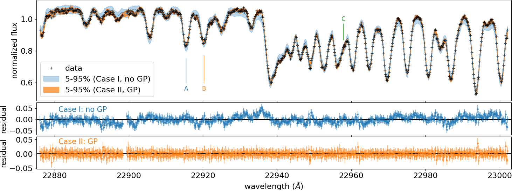

|:cat:|  Bayes Inference of a Real Spectrum of Luhman 16A  
--------------------------------------------------------------------
*Update: Nov 10/2021, Hajime Kawahara*

The full code for the HMC-NUTS fitting using NumPyro to the high-dispersion spectrum of Luhman 16A (`Crossfield+2014 <https://www.nature.com/articles/nature12955?proof=t>`_) is given in examples/LUH16A/FidEMbug/fit.py. I confirmed the code worked using `NVIDIA A100 <https://www.nvidia.com/en-us/data-center/a100/>`_ or `V100 <https://www.nvidia.com/en-us/data-center/v100/>`_. As the goal of this tutorial, we want to fit the exojax model to the high-dispersion data as

.. image:: results.png

and get a posterior sampling. See the directories of examples/LUH16A/FidEMbu (Case I, w/o a GP) or examples/LUH16A/FidEMbug (Case II, w/ a GP) for the full python codes.

First, we import basic modules and some modules from jax,

.. code:: python3
	  
	  # Basic modules
	  import numpy as np
	  import pandas as pd
	  import matplotlib.pyplot as plt
	  
	  # JAX
	  import jax.numpy as jnp
	  from jax import random

and, many modules and functions from ExoJAX.
	  
.. code:: python3
	  
	  # ExoJAX
	  from exojax.spec import initspec, planck, moldb, contdb, response, molinfo
	  from exojax.spec.lpf import xsvector, xsmatrix, exomol
	  from exojax.spec.exomol import gamma_exomol
	  from exojax.spec.hitrancia import read_cia, logacia 
	  from exojax.spec.rtransfer import rtrun, dtauM, dtauCIA, nugrid, pressure_layer
	  from exojax.plot.atmplot import  plot_maxpoint
	  from exojax.spec.evalline import reduceline_exomol
	  from exojax.spec.limb_darkening import ld_kipping
	  from exojax.utils.afunc import getjov_gravity
	  from exojax.utils.instfunc import R2STD
	  from exojax.utils.constants import RJ, pc

If you want to model a correlated noise by a gaussian process (GP), also call this one.

.. code:: python3
	  
	  # CASE II	  	  	  	      	  	  	  	  	      
	  from exojax.utils.gpkernel import gpkernel_RBF

To fit the model to real high-resolution spectra, we usually need some information on absolute flux. Here, we just use the value from the mid-resolution spectrum.

.. code:: python3
	  	  
	  # FLUX reference
	  Fabs_REF2=2.7e-12 #absolute flux (i.e. flux@10pc) erg/s/cm2/um Burgasser+ 1303.7283 @2.29um
	  fac0=RJ**2/((10.0*pc)**2)  #nomralize by RJ
	  Fref=(2.29**2)*Fabs_REF2/fac0/1.e4 #erg/cm2/s/cm-1 @ 2.3um

Loading the real data of Luhman-16A by Crossfield+2014.
	  
.. code:: python3
	  	  
	  # Loading spectrum
	  dat=pd.read_csv("../data/luhman16a_spectra_detector1.csv",delimiter=",")
	  wavd=(dat["wavelength_micron"].values)*1.e4 #AA
	  nusd=1.e8/wavd[::-1]
	  fobs=(dat["normalized_flux"].values)[::-1]
	  err=(dat["err_normalized_flux"].values)[::-1]

Here we define the atmospheric layer (100 layers) and some qunatities for the atmospheric model.

.. code:: python3
	  	  	  
	  # ATMOSPHERIC LAYER
	  Pref=1.0 # Reference pressure for a T-P model (bar)
	  NP=100
	  Parr, dParr, k=pressure_layer(NP=NP)
	  mmw=2.33 #mean molecular weight
	  ONEARR=np.ones_like(Parr) #ones_array for MMR
	  molmassCO=molinfo.molmass("CO") #molecular mass (CO)
	  molmassH2O=molinfo.molmass("H2O") #molecular mass (H2O)

Assuming the instrumental resolution... Yes, beta is the standard deviation of the Gaussian.
	  
.. code:: python3
	  	  	  
	  # Instrument
	  beta=R2STD(100000.) #std of gaussian from R=100000.

Here, we set the wavenumber grid, with the target range between ws and we AA, but having a margin +- 5 AA. 

.. code:: python3
	  	  	  	  
	  # Loading Molecular datanase and  Reducing Molecular Lines
	  Nx=4500    # number of wavenumber bins (nugrid) for fit
	  ws=22876.0 # AA
	  we=23010.0 # AA
	  nus,wav,res=nugrid(ws-5.0,we+5.0,Nx,unit="AA")

Some masking.
	  
.. code:: python3
	  	  	  	  	  
	  # Masking data
	  mask=(ws<wavd[::-1])*(wavd[::-1]<we) # data fitting range
	  mask=mask*((22898.5>wavd[::-1])+(wavd[::-1]>22899.5))  # Additional mask to remove a strong telluric
	  fobsx=fobs[mask]
	  nusdx=nusd[mask]
	  wavdx=1.e8/nusdx[::-1]
	  errx=err[mask]

Loading exomol databases for CO and H2O...
	  
.. code:: python3
	  	  	  	  	  
	  # Loading molecular database 
	  mdbCO=moldb.MdbExomol('.database/CO/12C-16O/Li2015',nus) 
	  mdbH2O=moldb.MdbExomol('.database/H2O/1H2-16O/POKAZATEL',nus,crit=1.e-46) 

and CIA from HITRAN.
	  
.. code:: python3	  	  	  	  	 
	  
	  # LOADING CIA
	  mmrH2=0.74
	  mmrHe=0.25
	  molmassH2=molinfo.molmass("H2")
	  molmassHe=molinfo.molmass("He")
	  vmrH2=(mmrH2*mmw/molmassH2)
	  vmrHe=(mmrHe*mmw/molmassHe)
	  cdbH2H2=contdb.CdbCIA('.database/H2-H2_2011.cia',nus)
	  cdbH2He=contdb.CdbCIA('.database/H2-He_2011.cia',nus)

This example uses the direct LPF. So, one might reduce weak lines to save the computational time. But how? we have a simple function for that purpose. Assuming a constant T model, we can exclude the lines below the CIA photosphere.
	  
.. code:: python3	  	  	  	  	 
	  	  
	  # Reducing Molecular Lines
	  def Tmodel(Parr,T0):
	  """ Constant T model
	  """
	  return T0*np.ones_like(Parr)
	  
	  # Reference physical quantities
	  g=10**(5.0)
	  maxMMR_CO=0.01
	  maxMMR_H2O=0.005
	  
	  # CO 
	  mask_CO,maxcf,maxcia=reduceline_exomol(mdbCO,Parr,dParr,mmw,g,vmrH2,cdbH2H2,maxMMR_CO,molmassCO,Tmodel,[1700.0]) #only 1700K
	  plot_maxpoint(mask_CO,Parr,maxcf,maxcia,mol="CO")
	  plt.savefig("maxpoint_CO.pdf", bbox_inches="tight", pad_inches=0.0)
	  
	  # H2O
	  T0xarr=list(range(500,1800,100))
	  mask_H2O,maxcf,maxcia=reduceline_exomol(mdbH2O,Parr,dParr,mmw,g,vmrH2,cdbH2H2,maxMMR_H2O,molmassH2O,Tmodel,T0xarr) #only 1700K
	  plot_maxpoint(mask_H2O,Parr,maxcf,maxcia,mol="H2O")
	  plt.savefig("maxpoint_H2O.pdf", bbox_inches="tight", pad_inches=0.0)

The initialization of the direct LPF (or just precompute nu matrix).
	  
.. code:: python3	  	  	  	  	 
	  	  	  
	  # Initialization of direct LPF
	  numatrix_CO=initspec.init_lpf(mdbCO.nu_lines,nus)    
	  numatrix_H2O=initspec.init_lpf(mdbH2O.nu_lines,nus)

We are now ready for an HMC-NUTS fitting!
	  
.. code:: python3	  	  	  	  	 
	  	  	  	  
	  # HMC-NUTS FITTING PART
	  from numpyro import sample
	  import numpyro.distributions as dist
	  from numpyro.infer import MCMC, NUTS
	  from numpyro.infer import Predictive
	  from numpyro.diagnostics import hpdi
	  
	  # Some constants for fitting
	  baseline=1.07 #(baseline for a CIA photosphere in the observed (normaized) spectrum)
	  maxMMR_CO=0.01
	  maxMMR_H2O=0.005

Define the model.
	  
.. code:: python3	  	  	  	  	 
	  	  	  	  
	  # Model
	  def model_c(nu1,y1,e1):
	      Rp = sample('Rp', dist.Uniform(0.5,1.5))
	      Mp = sample('Mp', dist.Normal(33.5,0.3))
	      RV = sample('RV', dist.Uniform(26.0,30.0))
	      MMR_CO = sample('MMR_CO', dist.Uniform(0.0,maxMMR_CO))
	      MMR_H2O = sample('MMR_H2O', dist.Uniform(0.0,maxMMR_H2O))
	      T0 = sample('T0', dist.Uniform(1000.0,1700.0))
	      alpha = sample('alpha', dist.Uniform(0.05,0.15))
	      vsini = sample('vsini', dist.Uniform(10.0,20.0))    
	      
	      # Kipping Limb Darkening Prior
	      q1 = sample('q1', dist.Uniform(0.0,1.0))
	      q2 = sample('q2', dist.Uniform(0.0,1.0))
	      u1,u2=ld_kipping(q1,q2)

If you want to model a correlated noise by a GP, set the GP hyperparameters

.. code:: python3
	  
	  #def model_c(nu1,y1,e1): (continued)
	  # CASE II	  	  	  	      	  	  	  	  	         
	      #GP
	      logtau = sample('logtau', dist.Uniform(-1.5,0.5)) #tau=1 <=> 5A
	      tau=10**(logtau)
	      loga = sample('loga', dist.Uniform(-4.0,-2.0))
	      a=10**(loga)

Otherwise, define sigma in an independent gaussian:

.. code:: python3	

   	  #def model_c(nu1,y1,e1): (continued)
	  # CASE I	  	  	  	      	  	  	  	  	     
              sigma = numpyro.sample('sigma', dist.Exponential(10.0))

Set gravity using radius and mass in the Jovian unit.

.. code:: python3	

   	  #def model_c(nu1,y1,e1): (continued)
	      
	      #gravity
	      g=getjov_gravity(Rp,Mp)

And here we assume a power-law type temperature model. This can be relaxed.	      

.. code:: python3	

   	  #def model_c(nu1,y1,e1): (continued)
	    
	      #T-P model//
	      Tarr = T0*(Parr/Pref)**alpha 

`spec.lpf.exomol <../exojax/exojax.spec.html#exojax.spec.lpf.exomol>`_ is a convenient way to obtain the quantities for line profile.
   
.. code:: python3
	  
	  #def model_c(nu1,y1,e1): (continued)
          
	      #CO
	      SijM_CO,gammaLM_CO,sigmaDM_CO=exomol(mdbCO,Tarr,Parr,molmassCO)
	      xsm_CO=xsmatrix(numatrix_CO,sigmaDM_CO,gammaLM_CO,SijM_CO) 
	      dtaumCO=dtauM(dParr,xsm_CO,MMR_CO*ONEARR,molmassCO,g)
	      
	      #H2O
	      SijM_H2O,gammaLM_H2O,sigmaDM_H2O=exomol(mdbH2O,Tarr,Parr,molmassH2O)
	      xsm_H2O=xsmatrix(numatrix_H2O,sigmaDM_H2O,gammaLM_H2O,SijM_H2O) 
	      dtaumH2O=dtauM(dParr,xsm_H2O,MMR_H2O*ONEARR,molmassH2O,g)
	      
	      #CIA
	      dtaucH2H2=dtauCIA(nus,Tarr,Parr,dParr,vmrH2,vmrH2,\
              mmw,g,cdbH2H2.nucia,cdbH2H2.tcia,cdbH2H2.logac)
	      dtaucH2He=dtauCIA(nus,Tarr,Parr,dParr,vmrH2,vmrHe,\
              mmw,g,cdbH2He.nucia,cdbH2He.tcia,cdbH2He.logac)
	      
	      dtau=dtaumCO+dtaumH2O+dtaucH2H2+dtaucH2He    
	      sourcef = planck.piBarr(Tarr,nus)
	      Ftoa=Fref/Rp**2
	      F0=rtrun(dtau,sourcef)/baseline/Ftoa

	      Frot=response.rigidrot(nus,F0,vsini,u1,u2)
	      mu=response.ipgauss_sampling(nu1,nus,Frot,beta,RV)

Here, in the case of a GP modeling of the noise, just define the GP kernel and use dist.MultivariateNormal. So simple!
	  
.. code:: python3
	  
	  #def model_c(nu1,y1,e1): (continued)
	  # CASE II	  	  	  	      	  	  	  	  	      
	      cov=gpkernel_RBF(nu1,tau,a,e1)
	      sample("y1", dist.MultivariateNormal(loc=mu, covariance_matrix=cov), obs=y1)

Or you prefer an independent Gaussan?

.. code:: python3
	  
	  #def model_c(nu1,y1,e1): (continued)
	  # CASE I	  	  	  	      
	      cov=gpkernel_RBF(nu1,tau,a,e1)
              errall=jnp.sqrt(e1**2+sigma**2)
              sample(tag, dist.Normal(mu, errall), obs=y)

Then, run the HMC-NUTS.
	     
.. code:: python3	  	  	  	  	 
	  	  	  	  
	  #Running a HMC-NUTS
	  rng_key = random.PRNGKey(0)
	  rng_key, rng_key_ = random.split(rng_key)
	  num_warmup, num_samples = 500, 1000
	  kernel = NUTS(model_c,forward_mode_differentiation=True)
	  mcmc = MCMC(kernel, num_warmup=num_warmup, num_samples=num_samples)
	  mcmc.run(rng_key_, nu1=nusdx, y1=fobsx, e1=errx)
	  print("end HMC")

That's all! The rest part is just for saving and plotting.
	     
.. code:: python3	  	  	  	  	 
	  	  	  	  	  
	  # Post-processing
	  posterior_sample = mcmc.get_samples()
	  np.savez("npz/savepos.npz",[posterior_sample])
	  
	  pred = Predictive(model_c,posterior_sample,return_sites=["y1"])
	  nu = nus
	  predictions = pred(rng_key_,nu1=nu,y1=None,e1=errx)
	  median_mu = jnp.median(predictions["y1"],axis=0)
	  hpdi_mu = hpdi(predictions["y1"], 0.9)
	  np.savez("npz/saveplotpred.npz",[wavdx,fobsx,errx,median_mu,hpdi_mu])

Arviz is very useful for plotting, such as the corner plot, the trace plot and so on. 
	  
.. code:: python3	  	  	  	  	 
	  	  	  	  	  	  
	  # ARVIZ part
	  import arviz
	  rc = {
	  "plot.max_subplots": 1024,
	  }
	  
	  try:
	      arviz.rcParams.update(rc)
	      arviz.plot_pair(arviz.from_numpyro(mcmc),kind='kde',divergences=False,marginals=True) 
	      plt.savefig("npz/cornerall.png")
	      except:
	      print("failed corner")
	  
	  try:
	      pararr=["Mp","Rp","T0","alpha","MMR_CO","MMR_H2O","vsini","RV","q1","q2","logtau","loga"]
	      arviz.plot_trace(mcmc, var_names=pararr)
	      plt.savefig("npz/trace.png")
	  except:
	      print("failed trace")

	  

Credible interval for the GP case (CASE II)
========================================================

Here, we show an example to compute the credible interval of the prdiction including a GP. See Appendix F in Paper I (Kawahara+2021) for more details.

The probability of the prediction
:math:`{\bf d}^\ast`
for an arbitrary wavenumber vector
:math:`{\bf \nu}^\ast` conditioned on the given data
:math:`{\bf d}` is expressed as 

:math:`p({\bf d}^\ast|{\bf d}) =  {\mathcal N} ({F}({\bf \nu}^\ast) + K_{\times}^\top K_\sigma^{-1} ({\bf d} - {F}({\bf \nu}))  K_{\ast,\sigma} - K_\times^\top K_\sigma^{-1} K_\times)`

where

:math:`(K_{\times})_{ij} = a \,  {k}(|\nu_i-\nu^\ast_j|;\tau)`

:math:`(K_{\sigma})_{ij} = a \,  {k}(|\nu_i-\nu_j|;\tau)  + \sigma_{e,i}^2 \delta_{ij}`

:math:`(K_{\ast,\sigma})_{ij} = a \,  {k}(|\nu^\ast_i-\nu^\ast_j|;\tau) + (\sigma_{e,i}^\ast)^2 \delta_{ij}`

where
:math:`\delta_{ij}`
is the Kronecker delta. Then the code should be like the below.

.. code:: python3
	  
   mu = #the spectral model (skipeed here)
   cov = gpkernel_RBF(t,t,tau,a) + jnp.diag(err**2)
   covx= gpkernel_RBF(t,td,tau,a)
   covxx = gpkernel_RBF(td,td,tau,a) + jnp.diag(err**2)
   A=scipy.linalg.solve(cov,fobsx-mu,assume_a="pos")
   IKw = scipy.linalg.inv(cov)
   
   gp=covx@A
   newcov=covxx - covx@IKw@covx.T

For instance, the same wavenumber grid for t and td can be used.
   
.. code:: python3
	  
   t=nusdx 
   td=nusdx

An HMC simulation provides a sampling of the other parameters
:math:`{\bf \theta}^\dagger`
than the GP parameters. Then, the prediction can be sampled by

:math:`{\bf d}^\ast_k \sim  {\mathcal N} ({F}({\bf \nu}^\ast; {\bf \theta}^\dagger_k) + K_{\times}^\top K_\sigma^{-1} ({\bf d} - {F}({\bf \nu}; {\bf \theta}^\dagger_k)) K_{\ast,\sigma} - K_\times^\top K_\sigma^{-1} K_\times)`

where

:math:`{\bf \theta}^\dagger_k`
is the k-th sampling of
:math:`{\bf \theta}^\dagger`
. The credible interval can be computed using the sampling given by the anove Equation. This prediction includes independent Gaussian noise
:math:`\sigma_{e,i}^\ast`
. When we adopt
:math:`\sigma_{e,i}^\ast = 0`
, This equation simply provides the prediction of the spectral model + trend.

Then, one can get a sampling using multivariate_normal in scipy.stat as 
   
.. code:: python3
	  
   from scipy.stats import multivariate_normal as smn
   mkgp = smn(mean=gp ,cov=newcov , allow_singular =True).rvs(1).T

Computing the HPDI, we get the orange area in the following figure:

Layer-by-Layer Modelling
==============================

We can also model the temperature profile (and a VMR) by a layer-by-layer model instead of the power-law model. In this case, add a small identity matrix to the RBF kernel to prevent overflow such as 

.. code:: python3
   
   def modelcov(t,tau,a):
	  fac=1.e-5 #small value
	  Dt = t - jnp.array([t]).T
	  K=a*jnp.exp(-(Dt)**2/2/(tau**2))+a*fac*jnp.identity(NP)
   return K

Then, use dist.MultivariateNormal to model the prior of the temperature layers:

.. code:: python3
	  
	  # Model
	  def model_c(nu1,y1,e1):
	      Rp = sample('Rp', dist.Uniform(0.5,1.5))
	      Mp = sample('Mp', dist.Normal(33.5,0.3))
	      RV = sample('RV', dist.Uniform(26.0,30.0))
	      MMR_CO = sample('MMR_CO', dist.Uniform(0.0,maxMMR_CO))
	      MMR_H2O = sample('MMR_H2O', dist.Uniform(0.0,maxMMR_H2O))

	      #Layer-by-layer T-P model
	      lnsT=6.0
	      sT=10**lnsT
	      lntaup=0.5
	      taup=10**lntaup
	      
	      cov=modelcov(lnParr,taup,sT)
	      T0 =  numpyro.sample('T0', dist.Uniform(1000,1600))
	      Tarr=numpyro.sample("Tarr", dist.MultivariateNormal(loc=ONEARR, covariance_matrix=cov))+T0
	      
	      #(continued)
