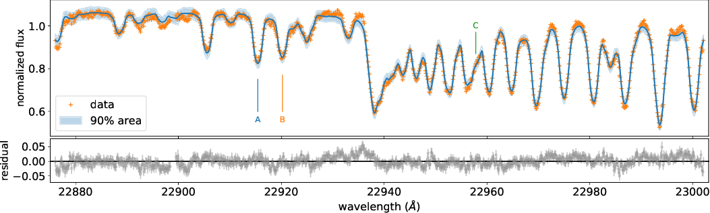
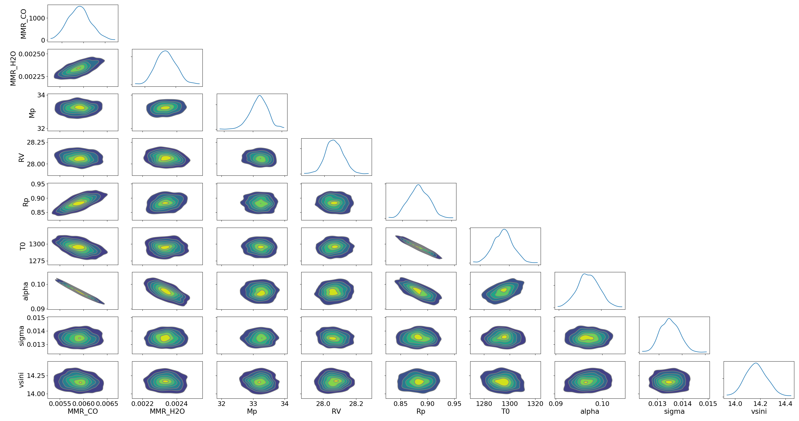

|:cat:|  Bayes Inference of a Real Spectrum of Luhman 16A  
--------------------------------------------------------------------
*Update: May 27/2021, Hajime Kawahara*

The full code for the HMC-NUTS fitting using NumPyro to the high-dispersion spectrum of Luhman 16A (`Crossfield+2014 <https://www.nature.com/articles/nature12955?proof=t>`_) is given in examples/LUH16A/FidEMb/fit.py. I confirmed the code worked using `NVIDIA A100 <https://www.nvidia.com/en-us/data-center/a100/>`_ or `V100 <https://www.nvidia.com/en-us/data-center/v100/>`_, at least. When using A100, it took 8.5 hr. Here, I explain some parts of the code. As the goal of  this tutorial, we want to fit the exojax model to the high-dispersion data as

and get a posterior sampling.

We use a 100 atmospheric layer model for radiative transfer.

.. code:: python3
	  
	  NP=100
	  Parr, dParr, k=rt.pressure_layer(NP=NP)

In the following function, we mask the data, load the molecular databases, exclude unnecessary lines. The reason why we define this part as a independent function is one can easily extend the code to a multiple orders fitting although here we fit the model to a single order of the spectrum.   
	  
.. code:: python3
	  
	  def ap(fobs,nusd,ws,we,Nx):
	      mask=(ws<wavd[::-1])*(wavd[::-1]<we)
	      
In the *ap* function, we define the wavenumber grid using `nugrid <../exojax/exojax.spec.html#exojax.spec.rtransfer.nugrid>`_ and call `moldb.MdbExomol <../exojax/exojax.spec.html#exojax.spec.moldb.MdbExomol>`_ for both CO and H2O. So, we use Li2015 for CO and POKAZATEL for H2O from ExoMol. We also load the CIA database using `contdb.CdbCIA <../exojax/exojax.spec.html#exojax.spec.contdb.CdbCIA>`_ .

.. code:: python3
	  
	  nus,wav,res=nugrid(ws-5.0,we+5.0,Nx,unit="AA")
	  #loading molecular database 
	  mdbCO=moldb.MdbExomol('.database/CO/12C-16O/Li2015',nus) 
	  mdbH2O=moldb.MdbExomol('.database/H2O/1H2-16O/POKAZATEL',nus,crit=1.e-45) 
	  #LOADING CIA
	  cdbH2H2=contdb.CdbCIA('.database/H2-H2_2011.cia',nus)
	  cdbH2He=contdb.CdbCIA('.database/H2-He_2011.cia',nus)

The following part excludes unnecessary lines comparing a CIA photosphere and line strengths assuming a T0c=1700K isothermal atmosphere for CO. For H2O, we change the temperature range because the line strenght of H2O is sensitive to the temperature. 

.. code:: python3

	  Tarr = T0c*np.ones_like(Parr)    
	  qt=vmap(mdbCO.qr_interp)(Tarr)
	  gammaLMP = jit(vmap(gamma_exomol,(0,0,None,None)))\
          (Parr,Tarr,mdbCO.n_Texp,mdbCO.alpha_ref)
	  gammaLMN=gamma_natural(mdbCO.A)
	  gammaLM=gammaLMP+gammaLMN[None,:]
	  SijM=jit(vmap(SijT,(0,None,None,None,0)))\
          (Tarr,mdbCO.logsij0,mdbCO.nu_lines,mdbCO.elower,qt)
	  sigmaDM=jit(vmap(doppler_sigma,(None,0,None)))\
          (mdbCO.nu_lines,Tarr,molmassCO)        
	  mask_CO,maxcf,maxcia=mask_weakline(mdbCO,Parr,dParr,Tarr,SijM,gammaLM,sigmaDM,maxMMR_CO*ONEARR,molmassCO,mmw,g,vmrH2,cdbH2H2)
	  mdbCO.masking(mask_CO)

We need to precompute nu-matrices. These matrices will be used in a HMC-NUTS fitting.

.. code:: python3

	  #nu matrix
	  numatrix_CO=make_numatrix0(nus,mdbCO.nu_lines)    
	  numatrix_H2O=make_numatrix0(nus,mdbH2O.nu_lines)

The following is the NumPyro part.

.. code:: python3

	  def model_c(nu1,y1,e1):
	      Rp = numpyro.sample('Rp', dist.Uniform(0.5,1.5))
	      Mp = numpyro.sample('Mp', dist.Normal(33.5,0.3))
	      sigma = numpyro.sample('sigma', dist.Exponential(0.1))

Again, for the extension to the multi order fitting, we define the *obyo* function, which defines the spectrum model (y0) for each order, though we here use a single order.   

.. code:: python3

	  def obyo(y,tag,nusd,nus,numatrix_CO,numatrix_H2O,mdbCO,mdbH2O,cdbH2H2,cdbH2He):

The following part defines the opacity model. The line strength, pressure and natural boradening, thermal broadening, and compute cross section by `rtransfer.xsmatrix <../exojax/exojax.spec.html#exojax.spec.autospec.AutoXS.xsmatrix>`_ .

.. code:: python3
	  
	  #CO
          SijM_CO=jit(vmap(SijT,(0,None,None,None,0)))\
              (Tarr,mdbCO.logsij0,mdbCO.dev_nu_lines,mdbCO.elower,qt_CO)
          gammaLMP_CO = jit(vmap(gamma_exomol,(0,0,None,None)))\
              (Parr,Tarr,mdbCO.n_Texp,mdbCO.alpha_ref)
	  gammaLMN_CO=gamma_natural(mdbCO.A)
          gammaLM_CO=gammaLMP_CO+gammaLMN_CO[None,:]
          sigmaDM_CO=jit(vmap(doppler_sigma,(None,0,None)))\
              (mdbCO.dev_nu_lines,Tarr,molmassCO)    
          xsm_CO=xsmatrix(numatrix_CO,sigmaDM_CO,gammaLM_CO,SijM_CO) 
          dtaumCO=dtauM(dParr,xsm_CO,MMR_CO*ONEARR,molmassCO,g)
	  
The source function is a Planck function multiplied by pi. A raw spectrum is computed using  `rtransfer.rtrun <../exojax/exojax.spec.html#exojax.spec.rtransfer.rtrun>`_. Then, the rotational broadening and the instrumental profile are applied. The last sentence defines the likelihood.

.. code:: python3
	  
        sourcef = planck.piBarr(Tarr,nus)
        Ftoa=Fref/Rp**2
        F0=rtrun(dtau,sourcef)/baseline/Ftoa        
        Frot=response.rigidrot(nus,F0,vsini,u1,u2)
        mu=response.ipgauss_sampling(nusd,nus,Frot,beta,RV)        
        errall=jnp.sqrt(e1**2+sigma**2)
        numpyro.sample(tag, dist.Normal(mu, errall), obs=y)

Finally, we run a HMC-NUTS!

.. code:: python3

	  #Running a HMC-NUTS
	  rng_key = random.PRNGKey(0)
	  rng_key, rng_key_ = random.split(rng_key)
	  num_warmup, num_samples = 500, 1000
	  kernel = NUTS(model_c,forward_mode_differentiation=True)
	  mcmc = MCMC(kernel, num_warmup, num_samples)
	  mcmc.run(rng_key_, nu1=nusd1, y1=fobs1, e1=err1)

The posterior can be visualized using arviz, for instance. 

.. code:: python3
	  
	  posterior_sample = mcmc.get_samples()
	  arviz.plot_pair(arviz.from_numpyro(mcmc),kind='kde',divergences=False,marginals=True) 

Here is the results.
   

Here is the 5-95 \% interval.

That's it. Using the posterior sampling, we can compute other quantities such as C/O ratio.
