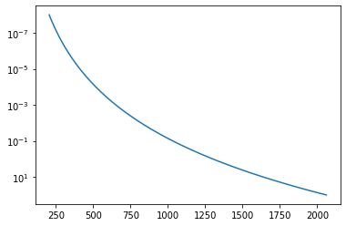
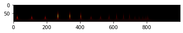
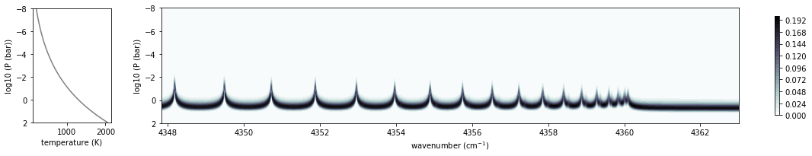
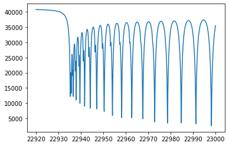
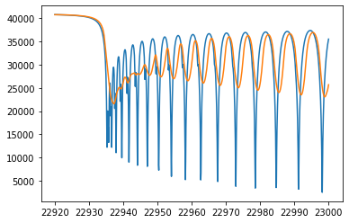

Forward Modelling of an Emission Spectrum
========================================
*Update: June 1/2021, Hajime Kawahara*

First, we set a planet atmosphere model as

:math:`T = T_0 P^{0.1}`

in the unit of K and bar for T and P.
      
.. code:: ipython3

    from exojax.spec import rtransfer as rt

.. code:: ipython3

    #ATMOSPHERE                                                                     
    NP=100
    T0=1300.0 #K
    Parr, dParr, k=rt.pressure_layer(NP=NP)
    Tarr = T0*(Parr)**0.1

A T-P profile we assume is like that.

.. code:: ipython3

    import matplotlib.pyplot as plt
    plt.plot(Tarr,Parr)
    plt.yscale("log")
    plt.gca().invert_yaxis()
    plt.show()

We set a wavenumber grid using `nugrid <../exojax/exojax.spec.html#exojax.spec.rtransfer.nugrid>`_. Note that `nugrid <../exojax/exojax.spec.html#exojax.spec.rtransfer.nugrid>`_ sets the wavenumber grid evenly spaced in log space. We need such the grid to apply an instrumental and rotational responses to a raw spectrum. 

.. code:: ipython3

    from exojax.spec.rtransfer import nugrid
    nus,wav,res=nugrid(22920,23000,1000,unit="AA")

Loading a molecular database of CO and CIA (H2-H2)...

.. code:: ipython3

    from exojax.spec import moldb, contdb
    mdbCO=moldb.MdbExomol('.database/CO/12C-16O/Li2015',nus)
    cdbH2H2=contdb.CdbCIA('.database/H2-H2_2011.cia',nus)

.. parsed-literal::

    Background atmosphere:  H2
    Reading transition file
    Broadening code level= a0
    default broadening parameters are used for  71  J lower states in  152  states
    H2-H2

The molecular mass is given as
    
.. code:: ipython3

    from exojax.spec import molinfo
    molmassCO=molinfo.molmass("CO")

Computing the normalized partition function :math:`q_t = Q(T)/Q(T_\mathrm{ref})` ...

.. code:: ipython3

    from jax import vmap
    qt=vmap(mdbCO.qr_interp)(Tarr)

Computing the gamma parameters for the pressure and natural broadenings...

.. code:: ipython3

    from jax import jit
    from exojax.spec.exomol import gamma_exomol
    from exojax.spec import gamma_natural
    
    gammaLMP = jit(vmap(gamma_exomol,(0,0,None,None)))\
            (Parr,Tarr,mdbCO.n_Texp,mdbCO.alpha_ref)
    gammaLMN=gamma_natural(mdbCO.A)
    gammaLM=gammaLMP+gammaLMN[None,:]

The sigma for the Doppler broadening is given as

.. code:: ipython3

    from exojax.spec import doppler_sigma
    sigmaDM=jit(vmap(doppler_sigma,(None,0,None)))\
            (mdbCO.nu_lines,Tarr,molmassCO)

We also compute the line strength matrix as

.. code:: ipython3

    from exojax.spec import SijT
    SijM=jit(vmap(SijT,(0,None,None,None,0)))\
        (Tarr,mdbCO.logsij0,mdbCO.nu_lines,mdbCO.elower,qt)

nu matrix is a matrix that contains wavenumber grids around line centers.

.. code:: ipython3

    from exojax.spec import make_numatrix0
    numatrix=make_numatrix0(nus,mdbCO.nu_lines)

Providing numatrix, thermal broadening, gamma, and line strength, we can
compute cross section.

.. code:: ipython3

    from exojax.spec.lpf import xsmatrix
    xsm=xsmatrix(numatrix,sigmaDM,gammaLM,SijM)

xsmatrix has the shape of (# of layers, # of nu grid)

.. code:: ipython3

    import numpy as np
    np.shape(xsm)

.. parsed-literal::

    (100, 1000)

So, this is a visualization of xsmatrix.

.. code:: ipython3

    import numpy as np
    plt.imshow(xsm,cmap="afmhot")
    plt.show()

We compute delta tau (tau in layers) for CO,

.. code:: ipython3

    from exojax.spec.rtransfer import dtauM
    g=1.e5 #gravity cm/s2
    MMR=0.01 #mass mixing ratio
    dtaum=dtauM(dParr,xsm,MMR*np.ones_like(Tarr),molmassCO,g)

and  delta tau for CIA

.. code:: ipython3

    from exojax.spec.rtransfer import dtauCIA
    mmw=2.33 #mean molecular weight
    mmrH2=0.74
    molmassH2=molinfo.molmass("H2")
    vmrH2=(mmrH2*mmw/molmassH2) #VMR
    dtaucH2H2=dtauCIA(nus,Tarr,Parr,dParr,vmrH2,vmrH2,\
                mmw,g,cdbH2H2.nucia,cdbH2H2.tcia,cdbH2H2.logac)

The total delta tau is a summation of them

.. code:: ipython3

    dtau=dtaum+dtaucH2H2

We can plot a contribution function using exojax.plot.atmplot as

.. code:: ipython3

    from exojax.plot.atmplot import plotcf
    plotcf(nus,dtau,Tarr,Parr,dParr)
    plt.show()

We perform a radiative transfer. Here, the source function is the Planck function (multiplied by pi).

.. code:: ipython3

    from exojax.spec import planck
    from exojax.spec.rtransfer import rtrun
    sourcef = planck.piBarr(Tarr,nus)
    F0=rtrun(dtau,sourcef)

.. code:: ipython3

    plt.plot(wav[::-1],F0)

We apply an instrumental response and planet/stellar rotation to the raw
spectrum as

.. code:: ipython3

    from exojax.spec import response
    from exojax.utils.constants import c
    import jax.numpy as jnp
    
    wavd=jnp.linspace(22920,23000,500) #observational wavelength grid
    nusd = 1.e8/wavd[::-1]
    
    RV=10.0 #RV km/s
    vsini=20.0 #Vsini km/s
    u1=0.0 #limb darkening u1
    u2=0.0 #limb darkening u2
    
    R=100000.
    beta=c/(2.0*np.sqrt(2.0*np.log(2.0))*R) #IP sigma need check 
    
    Frot=response.rigidrot(nus,F0,vsini,u1,u2)
    F=response.ipgauss_sampling(nusd,nus,Frot,beta,RV)

Finally, we get an emission spectrum model.
    
.. code:: ipython3

    plt.plot(wav[::-1],F0)
    plt.plot(wavd[::-1],F)

Save it!
	   
.. code:: ipython3
	  
    np.savetxt("spectrum.txt",np.array([wavd,F]).T,delimiter=",")	  

This data is used in the next section ":doc:`reverse_modeling`".
