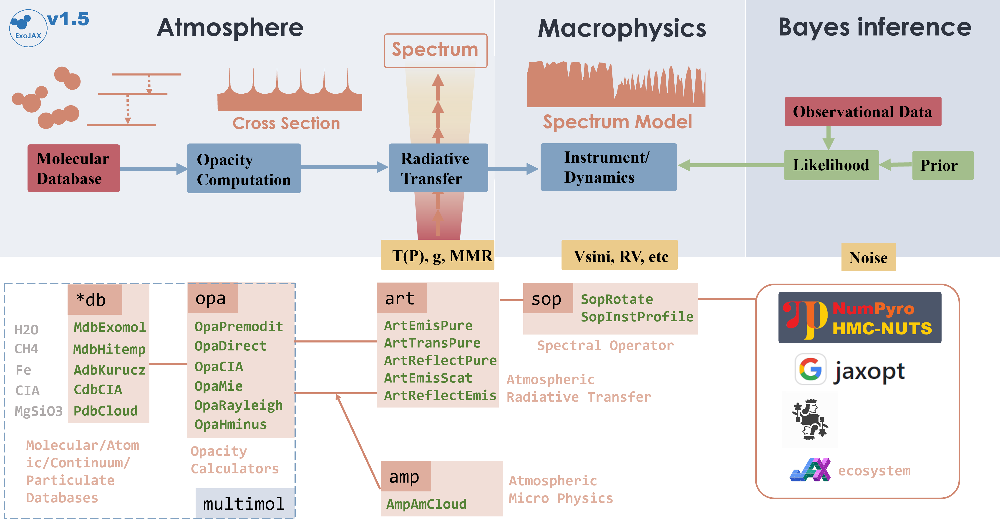
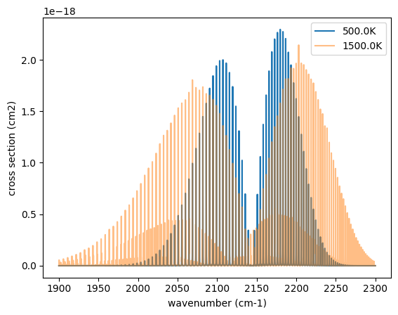
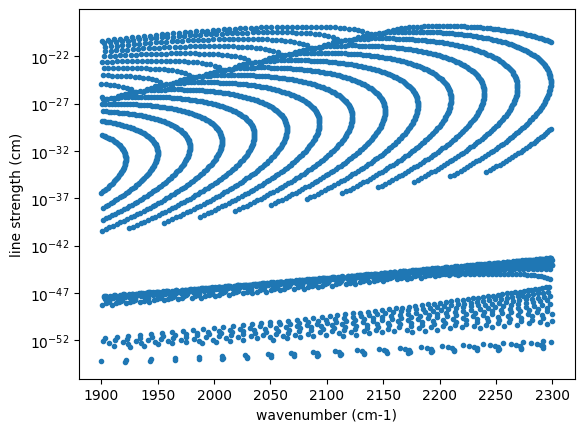
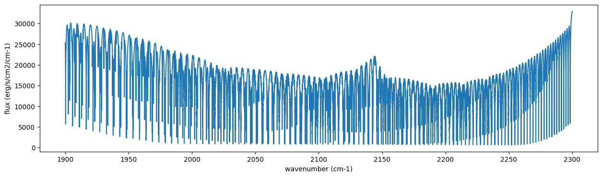
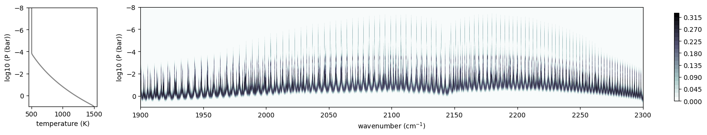
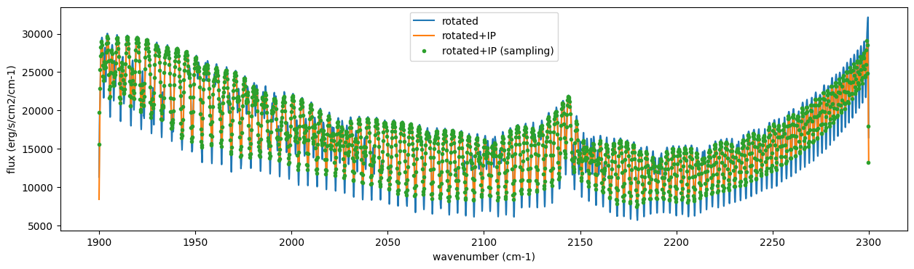

Get Started
===========

Last update: September 9th (2023) Hajime Kawahara for v1.5

First, we recommend 64-bit if you do not think about numerical errors.
Use jax.config to set 64-bit. (But note that 32-bit is sufficient in
most cases. Consider to use 32-bit (faster, less device memory) for your
real use case.)

.. code:: ipython3

    from jax import config
    config.update("jax_enable_x64", True)

The following schematic figure explains how ExoJAX works; (1) loading
databases (``*db``), (2) calculating opacity (``opa``), (3) running
atmospheric radiative transfer (``art``), (4) applying operations on the
spectrum (``sop``)

.. code:: ipython3

    from IPython.display import Image
    Image("../exojax.png")

1. Loading a molecular database using mdb.
------------------------------------------

ExoJAX has an API for molecular databases, called ``mdb`` (or ``adb``
for atomic datbases). Prior to loading the database, define the
wavenumber range first.

.. code:: ipython3

    from exojax.utils.grids import wavenumber_grid
    
    nu_grid, wav, resolution = wavenumber_grid(1900.,
                                               2300.,
                                               100000,
                                               unit="cm-1",
                                               xsmode="premodit")

.. parsed-literal::

    xsmode =  premodit
    xsmode assumes ESLOG in wavenumber space: mode=premodit
    ======================================================================
    We changed the policy of the order of wavenumber/wavelength grids
    wavenumber grid should be in ascending order and now 
    users can specify the order of the wavelength grid by themselves.
    Your wavelength grid is in ***  descending  *** order
    This might causes the bug if you update ExoJAX. 
    Note that the older ExoJAX assumes ascending order as wavelength grid.
    ======================================================================

.. parsed-literal::

    /home/kawahara/exojax/src/exojax/utils/grids.py:145: UserWarning: Resolution may be too small. R=523403.606697253
      warnings.warn('Resolution may be too small. R=' + str(resolution),

Then, let’s load the molecular database. We here use Carbon monoxide in
Exomol. ``CO/12C-16O/Li2015`` means
``Carbon monoxide/ isotopes = 12C + 16O / database name``. You can check
the database name in the ExoMol website (https://www.exomol.com/).

.. code:: ipython3

    from exojax.spec.api import MdbExomol
    
    mdb = MdbExomol(".database/CO/12C-16O/Li2015", nurange=nu_grid)

.. parsed-literal::

    /home/kawahara/exojax/src/exojax/utils/molname.py:178: FutureWarning: e2s will be replaced to exact_molname_exomol_to_simple_molname.
      warnings.warn(

.. parsed-literal::

    HITRAN exact name= (12C)(16O)
    Molecule:  CO
    Isotopologue:  12C-16O
    Background atmosphere:  H2
    ExoMol database:  None
    Local folder:  .database/CO/12C-16O/Li2015
    Transition files: 
    	 => File 12C-16O__Li2015.trans
    #        i_upper    i_lower    A          nu_lines      gup    jlower    jupper    elower      Sij0
    0        84         42         1.155e-06  2.405586      3      0         1         66960.7124  3.811968891483239e-164
    1        83         41         1.161e-06  2.441775      3      0         1         65819.903   9.66302808612315e-162
    2        82         40         1.162e-06  2.477774      3      0         1         64654.9206  2.743839242930895e-159
    3        81         39         1.159e-06  2.513606      3      0         1         63465.8042  8.733228323835037e-157
    4        80         38         1.152e-06  2.549292      3      0         1         62252.5793  3.1152203985525016e-154
    ...      ...        ...        ...        ...           ...    ...       ...       ...         ...
    125,491  306        253        7.164e-10  22147.135424  15     6         7         80.7354     1.8282485560395954e-31
    125,492  474        421        9.852e-10  22147.86595   23     10        11        211.4041    2.0425455628245774e-31
    125,493  348        295        7.72e-10   22147.897299  17     7         8         107.6424    1.9589545214604644e-31
    125,494  432        379        9.056e-10  22148.262711  21     9         10        172.978     2.0662209079393328e-31
    125,495  390        337        8.348e-10  22148.273111  19     8         9         138.3903    2.03878272167021e-31
    Broadening code level: a0

.. parsed-literal::

    /home/kawahara/exojax/src/radis/radis/api/exomolapi.py:607: AccuracyWarning: The default broadening parameter (alpha = 0.07 cm^-1 and n = 0.5) are used for J'' > 80 up to J'' = 152
      warnings.warn(

2. Computation of the Cross Section using opa
---------------------------------------------

ExoJAX has various opacity calculator classes, so-called ``opa``. Here,
we use a memory-saved opa, ``OpaPremodit``. We assume the robust
tempreature range we will use is 500-1500K.

.. code:: ipython3

    from sys import version
    from exojax.spec.opacalc import OpaPremodit
    
    opa = OpaPremodit(mdb, nu_grid, auto_trange=[500.0, 1500.0],dit_grid_resolution=1.0)

.. parsed-literal::

    /home/kawahara/exojax/src/exojax/spec/opacalc.py:171: UserWarning: dit_grid_resolution is not None. Ignoring broadening_parameter_resolution.
      warnings.warn(

.. parsed-literal::

    OpaPremodit: params automatically set.
    default elower grid trange (degt) file version: 2
    Robust range: 485.7803992045456 - 1514.171191195336 K
    Tref changed: 296.0K->570.4914318566549K
    OpaPremodit: Tref_broadening is set to  866.0254037844389 K
    # of reference width grid :  2
    # of temperature exponent grid : 2

.. parsed-literal::

    uniqidx: 0it [00:00, ?it/s]

.. parsed-literal::

    Premodit: Twt= 1108.7151960064205 K Tref= 570.4914318566549 K
    Making LSD:|####################| 100%

.. parsed-literal::

    

Then let’s compute cross section for two different temperature 500 and
1500 K for P=1.0 bar. opa.xsvector can do that!

.. code:: ipython3

    P = 1.0 #bar
    T_1 = 500.0 #K
    xsv_1 = opa.xsvector(T_1, P) #cm2
    
    T_2 = 1500.0 #K
    xsv_2 = opa.xsvector(T_2, P) #cm2

Plot them. It can be seen that different lines are stronger at different
temperatures.

.. code:: ipython3

    import matplotlib.pyplot as plt
    plt.plot(nu_grid,xsv_1,label=str(T_1)+"K") #cm2
    plt.plot(nu_grid,xsv_2,alpha=0.5,label=str(T_2)+"K") #cm2
    plt.legend()
    plt.xlabel("wavenumber (cm-1)")
    plt.ylabel("cross section (cm2)")
    plt.show()

You can also plot the line strengths at T=1500K. We can first change the
``mdb`` reference temperature and then plot the line intensity.

.. code:: ipython3

    mdb.change_reference_temperature(T_2)
    plt.plot(mdb.nu_lines,mdb.line_strength_ref,".")
    plt.xlabel("wavenumber (cm-1)")
    plt.ylabel("line strength (cm)")
    plt.yscale("log")
    plt.show()

.. parsed-literal::

    Tref changed: 570.4914318566549K->1500.0K

3. Atmospheric Radiative Transfer
---------------------------------

ExoJAX can solve the radiative transfer and derive the emission
spectrum. To do so, ExoJAX has ``art`` class. ``ArtEmisPure`` means
Atomospheric Radiative Transfer for Emission with Pure absorption. So,
``ArtEmisPure`` does not include scattering. We set the number of the
atmospheric layer to 200 (nlayer) and the pressure at bottom and top
atmosphere to 100 and 1.e-5 bar.

Since v1.5, one can choose the rtsolver (radiative transfer solver) from
the flux-based 2 stream solver (``fbase2st``) and the intensity-based
n-stream sovler (``ibased``). Use ``rtsolver`` option. In the latter
case, the number of the stream (``nstream``) can be specified.

.. code:: ipython3

    from exojax.spec.atmrt import ArtEmisPure
    art = ArtEmisPure(nu_grid=nu_grid, pressure_btm=1.e1, pressure_top=1.e-8, nlayer=75, rtsolver="ibased", nstream=8)

.. parsed-literal::

    rtsolver:  ibased
    Intensity-based n-stream solver, isothermal layer (e.g. NEMESIS, pRT like)

.. parsed-literal::

    /home/kawahara/exojax/src/exojax/spec/dtau_mmwl.py:14: FutureWarning: dtau_mmwl might be removed in future.
      warnings.warn("dtau_mmwl might be removed in future.", FutureWarning)

Let’s assume the power law temperature model, within 500 - 1500 K.

:math:`T = T_0 P^\alpha`

where :math:`T_0=1200` K and :math:`\alpha=0.1`.

.. code:: ipython3

    art.change_temperature_range(500.0, 1500.0)
    Tarr = art.powerlaw_temperature(1200.0,0.1)

Also, the mass mixing ratio of CO (MMR) should be defined.

.. code:: ipython3

    mmr_profile = art.constant_mmr_profile(0.01)

Surface gravity is also important quantity of the atmospheric model,
which is a function of planetary radius and mass. Here we assume 1 RJ
and 10 MJ.

.. code:: ipython3

    from exojax.utils.astrofunc import gravity_jupiter
    gravity = gravity_jupiter(1.0,10.0)

In addition to the CO cross section, we would consider `collisional
induced
absorption <https://en.wikipedia.org/wiki/Collision-induced_absorption_and_emission>`__
(CIA) as a continuum opacity. ``cdb`` class can be used.

.. code:: ipython3

    from exojax.spec.contdb import CdbCIA
    from exojax.spec.opacont import OpaCIA
    
    cdb = CdbCIA(".database/H2-H2_2011.cia",nurange=nu_grid)
    opacia = OpaCIA(cdb, nu_grid=nu_grid)

.. parsed-literal::

    H2-H2

Before running the radiative transfer, we need cross sections for
layers, called ``xsmatrix`` for CO and ``logacia_matrix`` for CIA
(strictly speaking, the latter is not cross section but coefficient
because CIA intensity is proportional density square).

.. code:: ipython3

    xsmatrix = opa.xsmatrix(Tarr, art.pressure)
    logacia_matrix = opacia.logacia_matrix(Tarr)

Convert them to opacity

.. code:: ipython3

    dtau_CO = art.opacity_profile_xs(xsmatrix, mmr_profile, mdb.molmass, gravity)
    vmrH2 = 0.855 #VMR of H2
    mmw = 2.33 # mean molecular weight of the atmosphere
    dtaucia = art.opacity_profile_cia(logacia_matrix, Tarr, vmrH2, vmrH2, mmw, gravity)

Add two opacities.

.. code:: ipython3

    dtau = dtau_CO + dtaucia

Then, run the radiative transfer

.. code:: ipython3

    F = art.run(dtau, Tarr)
    
    fig=plt.figure(figsize=(15,4))
    plt.plot(nu_grid,F)
    plt.xlabel("wavenumber (cm-1)")
    plt.ylabel("flux (erg/s/cm2/cm-1)")
    plt.show()

.. parsed-literal::

    Gaussian Quadrature Parameters: 
    mu =  [0.06943184 0.33000948 0.66999052 0.93056816]
    weight = [0.17392742 0.32607258 0.32607258 0.17392742]

You can check the contribution function too! You should check if the
dominant contribution is within the layer. If not, you need to change
``pressure_top`` and ``pressure_btm`` in ``ArtEmisPure``

.. code:: ipython3

    from exojax.plot.atmplot import plotcf

.. code:: ipython3

    cf=plotcf(nu_grid, dtau, Tarr,art.pressure, art.dParr)

Spectral Operators: rotational broadening, instrumental profile, Doppler velocity shift and so on, any operation on spectra.
----------------------------------------------------------------------------------------------------------------------------

The above spectrum is called “raw spectrum” in ExoJAX. The effects
applied to the raw spectrum is handled in ExoJAX by the spectral
operator (``sop``). First, we apply the spin rotational broadening of a
planet.

.. code:: ipython3

    from exojax.spec.specop import SopRotation
    sop_rot = SopRotation(nu_grid, vsini_max=100.0)
    
    vsini = 50.0
    u1=0.0
    u2=0.0 
    Frot = sop_rot.rigid_rotation(F, vsini, u1, u2) 

.. parsed-literal::

    /home/kawahara/exojax/src/exojax/utils/grids.py:145: UserWarning: Resolution may be too small. R=523403.606697253
      warnings.warn('Resolution may be too small. R=' + str(resolution),

.. code:: ipython3

    fig=plt.figure(figsize=(15,4))
    plt.plot(nu_grid,F, label="raw spectrum")
    plt.plot(nu_grid,Frot, label="rotated")
    plt.xlabel("wavenumber (cm-1)")
    plt.ylabel("flux (erg/s/cm2/cm-1)")
    plt.legend()
    plt.show()

.. image:: get_started_files/get_started_45_0.png

Then, the instrumental profile with relative radial velocity shift is
applied. Also, we need to match the computed spectrum to the data grid.
This process is called ``sampling`` (but just interpolation though).

.. code:: ipython3

    from exojax.spec.specop import SopInstProfile
    from exojax.utils.instfunc import resolution_to_gaussian_std
    sop_inst = SopInstProfile(nu_grid, vrmax=1000.0)
    
    RV=40.0 #km/s
    resolution_inst = 3000.0
    beta_inst = resolution_to_gaussian_std(resolution_inst)
    Finst = sop_inst.ipgauss(Frot, beta_inst)
    nu_obs = nu_grid[::50]
    Fobs = sop_inst.sampling(Finst, RV, nu_obs)

.. parsed-literal::

    /home/kawahara/exojax/src/exojax/utils/grids.py:145: UserWarning: Resolution may be too small. R=523403.606697253
      warnings.warn('Resolution may be too small. R=' + str(resolution),

.. code:: ipython3

    fig=plt.figure(figsize=(15,4))
    plt.plot(nu_grid,Frot, label="rotated")
    plt.plot(nu_grid,Finst, label="rotated+IP")
    plt.plot(nu_obs,Fobs, ".", label="rotated+IP (sampling)")
    
    
    plt.xlabel("wavenumber (cm-1)")
    plt.ylabel("flux (erg/s/cm2/cm-1)")
    plt.legend()
    plt.show()

That’s it.

