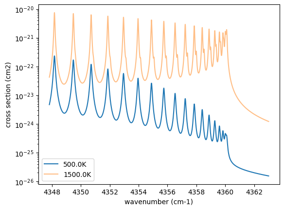

Getting Started with Simulating the Emission Spectrum
=====================================================

Last update: January 26th (2025) Hajime Kawahara for v2.0

In this getting started guide, we will use ExoJAX to simulate a
high-resolution emission spectrum from an atmosphere with CO molecular
absorption and hydrogen molecule CIA continuum absorption as the opacity
sources. We will then add appropriate noise to the simulated spectrum to
create a mock spectrum and perform spectral retrieval using NumPyro’s
HMC NUTS.

The author wrote this Jupyter notebook on a gaming laptop equipped with
an RTX 3080 GPU, so it is recommended to use a machine with similar or
higher GPU specifications. However, except for the HMC NUTS part, the
code should also work on lower-spec systems. Now, let’s get started!

First, we recommend 64-bit if you do not think about numerical errors.
Use jax.config to set 64-bit. (But note that 32-bit is sufficient in
most cases. Consider to use 32-bit (faster, less device memory) for your
real use case.)

.. code:: ipython3

    from jax import config
    config.update("jax_enable_x64", True)

The following schematic figure explains how ExoJAX works; (1) loading
databases (``*db``), (2) calculating opacity (``opa``), (3) running
atmospheric radiative transfer (``art``), (4) applying operations on the
spectrum (``sop``)

In this “getting started” guide, there are two opacity sources, CO and
CIA. Their respective databases, ``mdb`` and ``cdb``, are converted by
``opa`` into the opacity of each atmospheric layer, which is then used
in the radiative transfer calculation performed by ``art``. Finally,
``sop`` convolves the rotational effects and instrumental profiles,
generating the emission spectrum.

``mdb``/``cdb`` –> ``opa`` –> ``art`` –> ``sop`` —> spectrum

This spectral model is incorporated into the probabilistic model in
NumPyro, and retrieval is performed by sampling using HMC-NUTS.

.. figure:: https://secondearths.sakura.ne.jp/exojax/figures/exojax_get_started.png
   :alt: Figure. Structure of ExoJAX

   Figure. Structure of ExoJAX

1. Loading a molecular database using mdb
-----------------------------------------

ExoJAX has an API for molecular databases, called ``mdb`` (or ``adb``
for atomic datbases). Prior to loading the database, define the
wavenumber range first.

.. code:: ipython3

    from exojax.utils.grids import wavenumber_grid
    
    nu_grid, wav, resolution = wavenumber_grid(
        22920.0, 23000.0, 3500, unit="AA", xsmode="premodit"
    )
    print("Resolution=", resolution)

.. parsed-literal::

    xsmode =  premodit
    xsmode assumes ESLOG in wavenumber space: xsmode=premodit
    ======================================================================
    The wavenumber grid should be in ascending order.
    The users can specify the order of the wavelength grid by themselves.
    Your wavelength grid is in ***  descending  *** order
    ======================================================================
    Resolution= 1004211.9840291934

.. parsed-literal::

    /home/kawahara/exojax/src/exojax/spec/unitconvert.py:63: UserWarning: Both input wavelength and output wavenumber are in ascending order.
      warnings.warn(

Then, let’s load the molecular database. We here use Carbon monoxide in
Exomol. ``CO/12C-16O/Li2015`` means
``Carbon monoxide/ isotopes = 12C + 16O / database name``. You can check
the database name in the ExoMol website (https://www.exomol.com/).

.. code:: ipython3

    from exojax.spec.api import MdbExomol
    mdb = MdbExomol(".database/CO/12C-16O/Li2015", nurange=nu_grid)

.. parsed-literal::

    /home/kawahara/exojax/src/exojax/utils/molname.py:197: FutureWarning: e2s will be replaced to exact_molname_exomol_to_simple_molname.
      warnings.warn(
    /home/kawahara/exojax/src/exojax/utils/molname.py:91: FutureWarning: exojax.utils.molname.exact_molname_exomol_to_simple_molname will be replaced to radis.api.exomolapi.exact_molname_exomol_to_simple_molname.
      warnings.warn(
    /home/kawahara/exojax/src/exojax/utils/molname.py:91: FutureWarning: exojax.utils.molname.exact_molname_exomol_to_simple_molname will be replaced to radis.api.exomolapi.exact_molname_exomol_to_simple_molname.
      warnings.warn(

.. parsed-literal::

    HITRAN exact name= (12C)(16O)
    radis engine =  vaex
    Molecule:  CO
    Isotopologue:  12C-16O
    Background atmosphere:  H2
    ExoMol database:  None
    Local folder:  .database/CO/12C-16O/Li2015
    Transition files: 
    	 => File 12C-16O__Li2015.trans
    Broadening code level: a0

.. parsed-literal::

    /home/kawahara/anaconda3/lib/python3.10/site-packages/radis-0.15.2-py3.10.egg/radis/api/exomolapi.py:685: AccuracyWarning: The default broadening parameter (alpha = 0.07 cm^-1 and n = 0.5) are used for J'' > 80 up to J'' = 152
      warnings.warn(

2. Computation of the Cross Section using opa
---------------------------------------------

ExoJAX has various opacity calculator classes, so-called ``opa``. Here,
we use a memory-saved opa, ``OpaPremodit``. We assume the robust
tempreature range we will use is 500-1500K.

.. code:: ipython3

    from exojax.spec.opacalc import OpaPremodit
    opa = OpaPremodit(mdb, nu_grid, auto_trange=[500.0, 1500.0], dit_grid_resolution=1.0)

.. parsed-literal::

    /home/kawahara/exojax/src/exojax/spec/opacalc.py:215: UserWarning: dit_grid_resolution is not None. Ignoring broadening_parameter_resolution.
      warnings.warn(

.. parsed-literal::

    OpaPremodit: params automatically set.
    default elower grid trange (degt) file version: 2
    Robust range: 485.7803992045456 - 1514.171191195336 K
    OpaPremodit: Tref_broadening is set to  866.0254037844389 K
    # of reference width grid :  2
    # of temperature exponent grid : 2

.. parsed-literal::

    uniqidx: 0it [00:00, ?it/s]

.. parsed-literal::

    Premodit: Twt= 1108.7151960064205 K Tref= 570.4914318566549 K
    Making LSD:|####################| 100%

.. parsed-literal::

    

Then let’s compute cross section for two different temperature 500 and
1500 K for P=1.0 bar. opa.xsvector can do that!

.. code:: ipython3

    P = 1.0  # bar
    T_1 = 500.0  # K
    xsv_1 = opa.xsvector(T_1, P)  # cm2
    
    T_2 = 1500.0  # K
    xsv_2 = opa.xsvector(T_2, P)  # cm2

Plot them. It can be seen that different lines are stronger at different
temperatures.

.. code:: ipython3

    import matplotlib.pyplot as plt
    
    plt.plot(nu_grid, xsv_1, label=str(T_1) + "K")  # cm2
    plt.plot(nu_grid, xsv_2, alpha=0.5, label=str(T_2) + "K")  # cm2
    plt.yscale("log")
    plt.legend()
    plt.xlabel("wavenumber (cm-1)")
    plt.ylabel("cross section (cm2)")
    plt.show()

3. Atmospheric Radiative Transfer
---------------------------------

ExoJAX can solve the radiative transfer and derive the emission
spectrum. To do so, ExoJAX has ``art`` class. ``ArtEmisPure`` means
Atomospheric Radiative Transfer for Emission with Pure absorption. So,
``ArtEmisPure`` does not include scattering. We set the number of the
atmospheric layer to 200 (nlayer) and the pressure at bottom and top
atmosphere to 100 and 1.e-5 bar.

Since v1.5, one can choose the rtsolver (radiative transfer solver) from
the flux-based 2 stream solver (``fbase2st``) and the intensity-based
n-stream sovler (``ibased``). Use ``rtsolver`` option. In the latter
case, the number of the stream (``nstream``) can be specified. Note that
the default rtsolver for the pure absorption (i.e. no scattering nor
reflection) has been ``ibased`` since v1.5. In our experience,
``ibased`` is faster and more accurate than ``fbased``.

.. code:: ipython3

    from exojax.spec.atmrt import ArtEmisPure
    
    art = ArtEmisPure(
        nu_grid=nu_grid,
        pressure_btm=1.0e1,
        pressure_top=1.0e-5,
        nlayer=100,
        rtsolver="ibased",
        nstream=8,
    )

.. parsed-literal::

    rtsolver:  ibased
    Intensity-based n-stream solver, isothermal layer (e.g. NEMESIS, pRT like)

Let’s assume the power law temperature model, within 500 - 1500 K.

:math:`T = T_0 P^\alpha`

where :math:`T_0=1200` K and :math:`\alpha=0.1`.

.. code:: ipython3

    art.change_temperature_range(500.0, 1500.0)
    Tarr = art.powerlaw_temperature(1200.0, 0.1)

Also, the mass mixing ratio of CO (MMR) should be defined.

.. code:: ipython3

    mmr_profile = art.constant_mmr_profile(0.01)

Surface gravity is also important quantity of the atmospheric model,
which is a function of planetary radius and mass. Here we assume 1 RJ
and 10 MJ.

.. code:: ipython3

    from exojax.utils.astrofunc import gravity_jupiter
    
    gravity = gravity_jupiter(1.0, 10.0)

In addition to the CO cross section, we would consider `collisional
induced
absorption <https://en.wikipedia.org/wiki/Collision-induced_absorption_and_emission>`__
(CIA) as a continuum opacity. ``cdb`` class can be used.

.. code:: ipython3

    from exojax.spec.contdb import CdbCIA
    from exojax.spec.opacont import OpaCIA
    
    cdb = CdbCIA(".database/H2-H2_2011.cia", nurange=nu_grid)
    opacia = OpaCIA(cdb, nu_grid=nu_grid)

.. parsed-literal::

    H2-H2

Before running the radiative transfer, we need cross sections for
layers, called ``xsmatrix`` for CO and ``logacia_matrix`` for CIA
(strictly speaking, the latter is not cross section but coefficient
because CIA intensity is proportional density square). See
`here <CIA_opacity.html>`__ for the details.

.. code:: ipython3

    xsmatrix = opa.xsmatrix(Tarr, art.pressure)
    logacia_matrix = opacia.logacia_matrix(Tarr)

Convert them to opacity

.. code:: ipython3

    dtau_CO = art.opacity_profile_xs(xsmatrix, mmr_profile, mdb.molmass, gravity)
    vmrH2 = 0.855  # VMR of H2
    mmw = 2.33  # mean molecular weight of the atmosphere
    dtaucia = art.opacity_profile_cia(logacia_matrix, Tarr, vmrH2, vmrH2, mmw, gravity)

Add two opacities.

.. code:: ipython3

    dtau = dtau_CO + dtaucia

Then, run the radiative transfer. As you can see, the emission spectrum
has been generated. This spectrum shows a region near 4360 cm-1, or
around 22940 AA, where CO features become increasingly dense. This
region is referred to as the band head. If you’re interested in why the
band head occurs, please refer to `Quatum states of Carbon Monoxide and
Fortrat Diagram <Fortrat.html>`__.

.. code:: ipython3

    F = art.run(dtau, Tarr)
    
    fig = plt.figure(figsize=(15, 4))
    plt.plot(nu_grid, F)
    plt.xlabel("wavenumber (cm-1)")
    plt.ylabel("flux (erg/s/cm2/cm-1)")
    plt.show()

You can check the contribution function too! You should check if the
dominant contribution is within the layer. If not, you need to change
``pressure_top`` and ``pressure_btm`` in ``ArtEmisPure``

.. code:: ipython3

    from exojax.plot.atmplot import plotcf

.. code:: ipython3

    cf = plotcf(nu_grid, dtau, Tarr, art.pressure, art.dParr)

4. Spectral Operators: rotational broadening, instrumental profile, Doppler velocity shift and so on, any operation on spectra.
-------------------------------------------------------------------------------------------------------------------------------

The above spectrum is called “raw spectrum” in ExoJAX. The effects
applied to the raw spectrum is handled in ExoJAX by the spectral
operator (``sop``). First, we apply the spin rotational broadening of a
planet.

.. code:: ipython3

    from exojax.spec.specop import SopRotation
    
    sop_rot = SopRotation(nu_grid, vsini_max=100.0)
    
    vsini = 10.0
    u1 = 0.0
    u2 = 0.0
    Frot = sop_rot.rigid_rotation(F, vsini, u1, u2)

.. code:: ipython3

    fig = plt.figure(figsize=(15, 4))
    plt.plot(nu_grid, F, label="raw spectrum")
    plt.plot(nu_grid, Frot, label="rotated")
    plt.xlabel("wavenumber (cm-1)")
    plt.ylabel("flux (erg/s/cm2/cm-1)")
    plt.legend()
    plt.show()

Then, the instrumental profile with relative radial velocity shift is
applied. Also, we need to match the computed spectrum to the data grid.
This process is called ``sampling`` (but just interpolation though).
Below, let’s perform a simulation that includes noise for use in later
analysis.

.. code:: ipython3

    from exojax.spec.specop import SopInstProfile
    from exojax.utils.instfunc import resolution_to_gaussian_std
    
    sop_inst = SopInstProfile(nu_grid, vrmax=1000.0)
    
    RV = 40.0  # km/s
    resolution_inst =70000.0
    beta_inst = resolution_to_gaussian_std(resolution_inst)
    Finst = sop_inst.ipgauss(Frot, beta_inst)
    nu_obs = nu_grid[::5][:-50]
    
    
    from numpy.random import normal
    noise = 500.0
    Fobs = sop_inst.sampling(Finst, RV, nu_obs) + normal(0.0, noise, len(nu_obs))

.. code:: ipython3

    fig = plt.figure(figsize=(12, 6))
    ax = fig.add_subplot(211)
    plt.plot(nu_grid, Frot, label="rotated")
    plt.plot(nu_grid, Finst, label="rotated+IP")
    plt.ylabel("flux (erg/s/cm2/cm-1)")
    plt.legend()
    ax = fig.add_subplot(212)
    plt.errorbar(nu_obs, Fobs, noise, fmt=".", label="rotated + RV + IP (sampling)", color="gray",alpha=0.5)
    plt.xlabel("wavenumber (cm-1)")
    plt.legend()
    plt.show()

.. image:: get_started_files/get_started_45_0.png

5. Retrieval of an Emission Spectrum
------------------------------------

Next, let’s perform a “retrieval” on the simulated spectrum created
above. Retrieval involves estimating the parameters of an atmospheric
model in the form of a posterior distribution based on the spectrum. To
do this, we first need a model. Here, we have compiled the forward
modeling steps so far and defined the model as follows. The spectral
model has six parameters.

.. code:: ipython3

    def fspec(T0, alpha, mmr, g, RV, vsini):
        #molecule
        Tarr = art.powerlaw_temperature(T0, alpha)
        xsmatrix = opa.xsmatrix(Tarr, art.pressure)
        mmr_arr = art.constant_mmr_profile(mmr)
        dtau = art.opacity_profile_xs(xsmatrix, mmr_arr, opa.mdb.molmass, g)
        #continuum
        logacia_matrix = opacia.logacia_matrix(Tarr)
        dtaucH2H2 = art.opacity_profile_cia(logacia_matrix, Tarr, vmrH2, vmrH2,
                                            mmw, g)
        #total tau
        dtau = dtau + dtaucH2H2
        F = art.run(dtau, Tarr)
        Frot = sop_rot.rigid_rotation(F, vsini, u1, u2)
        Finst = sop_inst.ipgauss(Frot, beta_inst)
        mu = sop_inst.sampling(Finst, RV, nu_obs)
        return mu

Let’s verify that spectra are being generated from ``fspec`` with
various parameter sets.

.. code:: ipython3

    fig = plt.figure(figsize=(12, 3))
    
    plt.plot(nu_obs, fspec(1200.0, 0.09, 0.01, gravity_jupiter(1.0, 1.0), 40.0, 10.0),label="model")
    plt.plot(nu_obs, fspec(1100.0, 0.12, 0.01, gravity_jupiter(1.0, 10.0), 20.0, 5.0),label="model")

.. parsed-literal::

    [<matplotlib.lines.Line2D at 0x77fcf8b386a0>]

NumPyro is a probabilistic programming language (PPL), which requires
the definition of a probabilistic model. In the probabilistic model
``model_prob`` defined below, the prior distributions of each parameter
are specified. The previously defined spectral model is used within this
probabilistic model as a function that provides the mean :math:`\mu`.
The spectrum is assumed to be generated according to a Gaussian
distribution with this mean and a standard deviation :math:`\sigma`.
i.e. :math:`f(\nu_i) \sim \mathcal{N}(\mu(\nu_i; {\bf p}), \sigma^2 I)`,
where :math:`{\bf p}` is the spectral model parameter set, which are the
arguments of ``fspec``.

.. code:: ipython3

    from numpyro.infer import MCMC, NUTS
    import numpyro.distributions as dist
    import numpyro
    from jax import random

.. code:: ipython3

    def model_prob(spectrum):
    
        #atmospheric/spectral model parameters priors
        logg = numpyro.sample('logg', dist.Uniform(4.0, 5.0))
        RV = numpyro.sample('RV', dist.Uniform(35.0, 45.0))
        mmr = numpyro.sample('MMR', dist.Uniform(0.0, 0.015))
        T0 = numpyro.sample('T0', dist.Uniform(1000.0, 1500.0))
        alpha = numpyro.sample('alpha', dist.Uniform(0.05, 0.2))
        vsini = numpyro.sample('vsini', dist.Uniform(5.0, 15.0))
        mu = fspec(T0, alpha, mmr, 10**logg, RV, vsini)
    
        #noise model parameters priors
        sigmain = numpyro.sample('sigmain', dist.Exponential(1.e-3)) 
    
        numpyro.sample('spectrum', dist.Normal(mu, sigmain), obs=spectrum)

Note that we did not account for the effects of limb darkening. However,
in actual analyses, one possible approach might be to use an
uninformative prior, such as the one proposed by Kipping.

.. code:: python

       from exojax.spec.limb_darkening import ld_kipping
       q1 = numpyro.sample('q1', dist.Uniform(0.0,1.0))
       q2 = numpyro.sample('q2', dist.Uniform(0.0,1.0))
       u1,u2 = ld_kipping(q1,q2)

Now, let’s define NUTS and start sampling.

.. code:: ipython3

    rng_key = random.PRNGKey(0)
    rng_key, rng_key_ = random.split(rng_key)
    num_warmup, num_samples = 500, 1000
    #kernel = NUTS(model_prob, forward_mode_differentiation=True)
    kernel = NUTS(model_prob, forward_mode_differentiation=False)

Since this process will take several hours, feel free to go for a long
lunch break!

.. code:: ipython3

    mcmc = MCMC(kernel, num_warmup=num_warmup, num_samples=num_samples)
    mcmc.run(rng_key_, spectrum=Fobs)
    mcmc.print_summary()

.. parsed-literal::

    sample: 100%|██████████| 1500/1500 [3:32:24<00:00,  8.50s/it, 255 steps of size 2.63e-02. acc. prob=0.94]  

.. parsed-literal::

    
                    mean       std    median      5.0%     95.0%     n_eff     r_hat
           MMR      0.01      0.00      0.01      0.01      0.01    301.05      1.00
            RV     39.95      0.06     39.95     39.84     40.05    675.86      1.00
            T0   1196.47      6.93   1196.30   1183.85   1206.73    400.13      1.00
         alpha      0.10      0.00      0.10      0.09      0.10    335.22      1.00
          logg      4.45      0.06      4.45      4.37      4.56    354.23      1.00
       sigmain    472.25     13.78    471.80    451.90    495.79    837.97      1.00
         vsini      9.79      0.17      9.79      9.54     10.10    351.43      1.00
    
    Number of divergences: 0

After returning from your long lunch, if you’re lucky and the sampling
is complete, let’s write a predictive model for the spectrum.

.. code:: ipython3

    from numpyro.diagnostics import hpdi
    from numpyro.infer import Predictive
    import jax.numpy as jnp

.. code:: ipython3

    # SAMPLING
    posterior_sample = mcmc.get_samples()
    pred = Predictive(model_prob, posterior_sample, return_sites=['spectrum'])
    predictions = pred(rng_key_, spectrum=None)
    median_mu1 = jnp.median(predictions['spectrum'], axis=0)
    hpdi_mu1 = hpdi(predictions['spectrum'], 0.9)

.. code:: ipython3

    
    fig, ax = plt.subplots(nrows=1, ncols=1, figsize=(15, 4.5))
    ax.plot(nu_obs, median_mu1, color='C1')
    ax.fill_between(nu_obs,
                    hpdi_mu1[0],
                    hpdi_mu1[1],
                    alpha=0.3,
                    interpolate=True,
                    color='C1',
                    label='90% area')
    ax.errorbar(nu_obs, Fobs, noise, fmt=".", label="mock spectrum", color="black",alpha=0.5)
    plt.xlabel('wavenumber (cm-1)', fontsize=16)
    plt.legend(fontsize=14)
    plt.tick_params(labelsize=14)
    plt.show()

You can see that the predictions are working very well! Let’s also
display a corner plot. Here, we’ve used ArviZ for visualization.

.. code:: ipython3

    import arviz
    pararr = ['T0', 'alpha', 'logg', 'MMR', 'vsini', 'RV']
    arviz.plot_pair(arviz.from_numpyro(mcmc),
                    kind='kde',
                    divergences=False,
                    marginals=True)
    plt.show()

The correlation between ``T0`` and ``alpha`` arises because both are
parameters of the temperature model. The degeneracy between MMR and
``logg`` occurs because, in the case of molecular absorption alone,
opacity depends only on the ratio :math:`\text{MMR}/g`, leading to
complete degeneracy. However, the presence of CIA breaks this
degeneracy. For more details, please refer to `Kawashima et
al. <https://arxiv.org/abs/2410.11561>`__

6. Modeling correlated noise with a Gaussian Process
----------------------------------------------------

In actual spectra, in addition to uncorrelated noise such as shot noise,
correlated noise often exists due to various factors. For this case,
let’s consider using a Gaussian Process (GP) as the probabilistic model
for analysis. Here, we will employ a probabilistic model that assumes
the noise distribution of the observed spectrum follows a multivariate
Gaussian distribution.

A multivariate Gaussian distribution is defined by its mean and
covariance matrix, :math:`\Sigma`. While the mean is provided by the
spectral model, the challenge lies in how to model the covariance
matrix.

:math:`{\bf f}({\boldsymbol{\nu}}) \sim \mathcal{N}(\mu({\boldsymbol{\nu}}; {\bf p}), \Sigma)`

In this case, we consider noise where closer wavenumbers exhibit
stronger correlations. For example, the covariance matrix can be modeled
using an RBF kernel, which takes the distance between wavenumbers as a
variable. In this approach, the correlation length and amplitude become
the parameters of the probabilistic model.

However, since uncorrelated noise may also be present, a diagonal term
is added to the covariance matrix. The intensity of the uncorrelated
noise is expressed as :math:`\sigma^2`. Written mathematically, the
covariance matrix is as follows.

:math:`k(\nu_i-\nu_j; a, \tau, \sigma) = a \exp{\left[- \frac{(\nu_i - \nu_j)^2}{2 \tau^2} \right]} + \sigma^2 \delta_{ij}`

Although ExoJAX version 2 and later provide built-in functions for GPs,
we will explicitly define the functions here for clarity.

.. code:: ipython3

    # from exojax.utils.gpkernel import gpkernel_RBF
    
    def gpkernel_RBF(x, scale, amplitude, err):
        """RBF kernel with diagnoal error.
    
        Args:
            x (array): variable vector (N)
            scale (float): scale parameter
            amplitude (float) : amplitude (scalar)
            err (1D array): diagnonal error vector (N)
    
        Returns:
            kernel
        """
    
        diff = x - jnp.array([x]).T
        return amplitude * jnp.exp(-((diff) ** 2) / 2 / (scale**2)) + jnp.diag(err**2)

Now, let’s generate correlated noise using a GP with an RBF kernel. By
sampling from ``dist.MultivariateNormal`` with zero mean and the
covariance matrix generated from the kernel, we can create correlated
noise alone (top panel in the figure below). Similarly, by using the
spectral model as the mean and sampling from ``dist.MultivariateNormal``
with the covariance matrix generated from the kernel, we can generate a
mock spectrum with correlated noise included (bottom panel).

Note that we constructed the GP in wavenumber space, but depending on
the instrument specifications, it might be more appropriate to model it
in wavelength space.

.. code:: ipython3

    # correltaed noise only
    cov = gpkernel_RBF(nu_obs, 1.0, 500**2, noise*jnp.ones_like(nu_obs))
    noise_model = dist.MultivariateNormal(loc=jnp.zeros_like(nu_obs), covariance_matrix=cov)
    correlated_noise = numpyro.sample("correlated_noise", noise_model, rng_key=random.PRNGKey(20))
    
    # spectrum model with the correlated noise
    spec_noise_model = dist.MultivariateNormal(loc=sop_inst.sampling(Finst, RV, nu_obs), covariance_matrix=cov)
    Fobs_cn = numpyro.sample("speccn", spec_noise_model, rng_key=random.PRNGKey(20))
    
    fig = plt.figure(figsize=(12, 6))
    ax = fig.add_subplot(211)
    plt.errorbar(nu_obs, correlated_noise, noise, fmt=".", label="correlated noise", color="gray",alpha=0.5)
    plt.legend()
    ax = fig.add_subplot(212)
    plt.errorbar(nu_obs, Fobs_cn, noise, fmt=".", label="spectrum with correlated noise", color="gray",alpha=0.5)
    plt.xlabel("wavenumber (cm-1)")
    plt.legend()
    plt.show()

Let’s perform a retrieval on this mock spectrum with correlated noise.

.. code:: ipython3

    def model_prob_gp(spectrum):
    
        # atmospheric/spectral model parameters priors
        logg = numpyro.sample("logg", dist.Uniform(4.0, 5.0))
        RV = numpyro.sample("RV", dist.Uniform(35.0, 45.0))
        mmr = numpyro.sample("MMR", dist.Uniform(0.0, 0.015))
        T0 = numpyro.sample("T0", dist.Uniform(1000.0, 1500.0))
        alpha = numpyro.sample("alpha", dist.Uniform(0.05, 0.2))
        vsini = numpyro.sample("vsini", dist.Uniform(5.0, 15.0))
        mu = fspec(T0, alpha, mmr, 10**logg, RV, vsini)
    
        # GP
        tau = numpyro.sample("tau", dist.LogUniform(0.1, 10.0))  # tau=1 <=> 1cm-1
        a = numpyro.sample("a", dist.LogUniform(1.e4, 1.e8))  # 100-10000
    
        # noise model parameters priors
        sigmain = numpyro.sample("sigmain", dist.Exponential(1.0e-3))
        cov = gpkernel_RBF(nu_obs, tau, a, sigmain*jnp.ones_like(nu_obs))
    
        numpyro.sample(
            "spectrum", dist.MultivariateNormal(loc=mu, covariance_matrix=cov), obs=spectrum
        )

.. code:: ipython3

    rng_key = random.PRNGKey(0)
    rng_key, rng_key_ = random.split(rng_key)
    num_warmup, num_samples = 500, 1000
    #kernel = NUTS(model_prob, forward_mode_differentiation=True)
    kernel = NUTS(model_prob_gp, forward_mode_differentiation=False)

.. code:: ipython3

    mcmc_gp = MCMC(kernel, num_warmup=num_warmup, num_samples=num_samples)
    mcmc_gp.run(rng_key_, spectrum=Fobs_cn)
    mcmc_gp.print_summary()

.. parsed-literal::

    sample: 100%|██████████| 1500/1500 [2:07:48<00:00,  5.11s/it, 63 steps of size 5.27e-02. acc. prob=0.94]  

.. parsed-literal::

    
                    mean       std    median      5.0%     95.0%     n_eff     r_hat
           MMR      0.01      0.00      0.01      0.01      0.01    322.95      1.00
            RV     39.98      0.07     39.98     39.85     40.09    606.25      1.00
            T0   1206.44     16.22   1205.89   1181.20   1233.32    369.54      1.00
         alpha      0.09      0.01      0.09      0.08      0.11    383.62      1.00
          loga      5.80      0.24      5.78      5.41      6.13    500.14      1.00
          logg      4.38      0.15      4.38      4.12      4.59    338.18      1.00
        logtau      0.10      0.05      0.10      0.01      0.18    553.31      1.00
       sigmain    493.56     13.30    493.22    470.74    514.01   1024.11      1.00
         vsini     10.02      0.20     10.02      9.66     10.32    445.02      1.00
    
    Number of divergences: 0

Below, we display the credible interval calculated using ``Predictive``,
as done earlier. In this case, it appears that the interval does not
adequately encompass the data. This is because the GP itself is being
sampled as part of the error, meaning it does not represent a
realization consistent with the given data.

.. code:: ipython3

    # SAMPLING
    posterior_sample_gp = mcmc_gp.get_samples()
    pred_gp = Predictive(model_prob_gp, posterior_sample_gp, return_sites=['spectrum'])
    predictions_gp = pred_gp(rng_key_, spectrum=None)
    median_mu2 = jnp.median(predictions_gp['spectrum'], axis=0)
    hpdi_mu2 = hpdi(predictions_gp['spectrum'], 0.9)
    
    fig, ax = plt.subplots(nrows=1, ncols=1, figsize=(15, 4.5))
    ax.plot(nu_obs, median_mu2, color='C1')
    ax.fill_between(nu_obs,
                    hpdi_mu2[0],
                    hpdi_mu2[1],
                    alpha=0.3,
                    interpolate=True,
                    color='C1',
                    label='90% area')
    ax.errorbar(nu_obs, Fobs_cn, noise, fmt=".", label="mock spectrum", color="black",alpha=0.5)
    plt.xlabel('wavenumber (cm-1)', fontsize=16)
    plt.legend(fontsize=14)
    plt.tick_params(labelsize=14)
    plt.show()

Therefore, we perform sampling with the GP as the model. The mean and
covariance of the GP as a model can be calculated as follows. For
details on these equations, refer to Appendix F of `Paper
I <https://arxiv.org/abs/2105.14782>`__ or `this
memo <https://secondearths.sakura.ne.jp/exojax/jaxgp.pdf>`__ created by
one of the authors (H.K.). From ExoJAX version 2 onward, this function
is included in ``utils.gpkernel``.

.. code:: ipython3

    #from exojax.utils.gpkernel import average_covariance_gpmodel # available later than version 2.0
    
    from jax import jit
    @jit
    def average_covariance_gpmodel(x, data, model, scale, amplitude, err):
        """computes average and covariance of GP model
        
        Args:
            x (array): variable vector (N)
            data (array): data vector (N)
            scale (float): scale parameter
            amplitude (float) : amplitude (scalar)
            err (1D array): diagnonal error vector (N)
    
        Returns:
            _type_: average, covariance
        """
        cov = gpkernel_RBF(x, scale, amplitude, err)
        covx = gpkernel_RBF(x, scale, amplitude, jnp.zeros_like(x))
        A = jnp.linalg.solve(cov, data - model)
        IKw = jnp.linalg.inv(cov)
        return model + covx @ A, cov - covx @ IKw @ covx.T
    

Next, for each GP hyperparameter (scale, amplitude, diagonal components)
sampled by HMC, we calculate the mean and covariance of the GP model.
From these, we resample the predictions using ``MultivariateNormal``. In
this way, we can compute predictions based on the GP model for a
specified number of samples (``num_samples``).

.. code:: ipython3

    import tqdm
    scale_sampling = posterior_sample_gp["tau"]
    amplitude_sampling = posterior_sample_gp["a"]
    err_sampling = jnp.array(posterior_sample_gp["sigmain"])[:,None]*jnp.ones((num_samples, len(nu_obs)))
    prediction_spectrum = predictions_gp["spectrum"]
    key = random.PRNGKey(20)
    
    #from exojax.utils.gpkernel import sampling_prediction # available later than version 2.0
    def sampling_prediction(
        x,
        data,
        scale_sampling,
        amplitude_sampling,
        err_sampling,
        prediction_spectrum,
        key,
    ):
        num_samples = len(scale_sampling)
        gp_predictions = []
        for i in tqdm.tqdm(range(0, num_samples)):
            ave, cov = average_covariance_gpmodel(
                x,
                data,
                prediction_spectrum[i],
                scale_sampling[i],
                amplitude_sampling[i],
                err_sampling[i],
            )
            mn = dist.MultivariateNormal(loc=ave, covariance_matrix=cov)
            key, _ = random.split(key)
            mk = numpyro.sample("mk", mn, rng_key=key)
    
            gp_predictions.append(mk)
        return jnp.array(gp_predictions)
    
    
    gp_predictions = sampling_prediction(
        nu_obs,
        Fobs_cn,
        scale_sampling,
        amplitude_sampling,
        err_sampling,
        prediction_spectrum,
        key,
    )

.. parsed-literal::

      0%|          | 0/1000 [00:00<?, ?it/s]100%|██████████| 1000/1000 [00:16<00:00, 60.09it/s]

All that remains is to calculate the median and HPDI and plot them as
before.

.. code:: ipython3

    median_muys = jnp.median(gp_predictions, axis=0)
    hpdi_muys = hpdi(gp_predictions, 0.9)
    
    fig, ax = plt.subplots(nrows=1, ncols=1, figsize=(15, 4.5))
    ax.plot(nu_obs, median_muys, color='C1')
    ax.fill_between(nu_obs,
                    hpdi_muys[0],
                    hpdi_muys[1],
                    alpha=0.3,
                    interpolate=True,
                    color='C1',
                    label='90% area')
    ax.errorbar(nu_obs, Fobs_cn, noise, fmt=".", label="mock spectrum", color="black",alpha=0.5)
    plt.xlabel('wavenumber (cm-1)', fontsize=16)
    plt.legend(fontsize=14)
    plt.tick_params(labelsize=14)
    plt.show()

The essential advantage of using the GP model lies in its ability to
account for correlated noise when calculating the posterior distribution
(not in the apparent reduction of residuals with the data, so be mindful
of this!). Let’s create a corner plot to verify the results.

.. code:: ipython3

    plt.figure(figsize=(4, 4))
    ax = arviz.plot_kde(
        posterior_sample_gp["logg"],
        values2=posterior_sample_gp["MMR"],
        contourf_kwargs={"cmap": "viridis"},
        contour_kwargs={"colors": "white","alpha":0.1},
    )
    ax2 = arviz.plot_kde(
        posterior_sample["logg"],
        values2=posterior_sample["MMR"],
        contourf_kwargs={"cmap": "gray"},
        contour_kwargs={"colors": "white","alpha":0},
    )
    ax.set_xlabel("logg")
    ax.set_ylabel("MMR")

.. parsed-literal::

    Text(0, 0.5, 'MMR')

That’s it!

