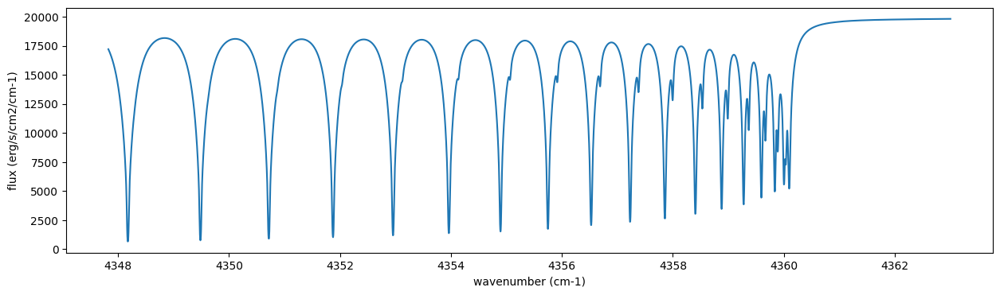

Nested Sampling of an Emission Spectrum Using JAXNS
===================================================

Last update: September 2026, Hajime Kawahara, for ExoJAX 2.5.0

This guide performs retrieval of an emission spectrum using `nested
sampling <https://en.wikipedia.org/wiki/Nested_sampling_algorithm>`__.
It follows the same forward-modeling workflow as `Getting Started with
Emission Spectroscopy <get_started.html>`__, but uses nested sampling
instead of HMC-NUTS for parameter inference.

Both sampler tutorials now read one saved, seeded mock observation and
use one shared retrieval model. Prepare the case with the commands in
Section 5 before running the observation cell. This update has not rerun
the full CO/database retrieval. Earlier forward-model figures are
retained from the previous execution; outputs from the changed
observation and subsequent retrieval cells have been cleared.

This notebook enables 64-bit mode in JAX. This is useful for numerical
stability in retrieval examples, although 32-bit mode is often
sufficient and can be faster with lower device-memory use in production
workflows.

.. code:: ipython3

    from jax import config
    config.update("jax_enable_x64", True)

    from pathlib import Path
    import sys

    # Open this notebook inside an ExoJAX source checkout.
    repo_root = next(
        path for path in (Path.cwd(), *Path.cwd().parents)
        if (path / "examples" / "compare_samplers.py").is_file()
    )
    sys.path.insert(0, str(repo_root / "examples"))


The schematic below summarizes the ExoJAX workflow:

1. load databases (``*db``),
2. compute opacity (``opa``),
3. run atmospheric radiative transfer (``art``), and
4. apply spectral operations (``sop``).

In this guide, CO and CIA provide the opacity sources. Their databases,
``mdb`` and ``cdb``, are converted by ``opa`` into layer opacities. The
radiative-transfer object ``art`` computes the raw spectrum, and ``sop``
applies rotational, instrumental, and velocity operations.

``mdb``/``cdb`` -> ``opa`` -> ``art`` -> ``sop`` -> spectrum

The same spectral model is later embedded in a probabilistic model for
retrieval.

.. figure:: https://secondearths.sakura.ne.jp/exojax/figures/exojax_get_started.png
   :alt: Figure. Structure of ExoJAX

   Figure. Structure of ExoJAX

1. Loading a molecular database using mdb
-----------------------------------------

ExoJAX provides molecular database APIs called ``mdb`` and atomic
database APIs called ``adb``. Define the wavenumber grid before loading
a database.

.. code:: ipython3

    from exojax.utils.grids import wavenumber_grid

    nu_grid, wav, resolution = wavenumber_grid(
        22920.0, 23000.0, 3500, unit="AA", xsmode="premodit"
    )
    print("Resolution=", resolution)


.. parsed-literal::

    xsmode =  premodit
    xsmode assumes ESLOG in wavenumber space: xsmode=premodit
    Your wavelength grid is in ***  descending  *** order
    The wavenumber grid is in ascending order by definition.
    Please be careful when you use the wavelength grid.
    Resolution= 1004211.9840291934


.. parsed-literal::

    /home/kawahara/exojax/src/exojax/utils/grids.py:85: UserWarning: Both input wavelength and output wavenumber are in ascending order.
      warnings.warn(


Next, load the molecular database. This example uses carbon monoxide
from ExoMol. The path ``CO/12C-16O/Li2015`` means
``molecule / isotopologue / database name``. Database names can be
checked on the `ExoMol website <https://www.exomol.com/>`__.

.. code:: ipython3

    from exojax.database.exomol.api import MdbExomol
    mdb = MdbExomol(".database/CO/12C-16O/Li2015", nurange=nu_grid)
    molmass = mdb.molmass


.. parsed-literal::

    /home/kawahara/exojax/src/exojax/utils/molname.py:197: FutureWarning: e2s will be replaced to exact_molname_exomol_to_simple_molname.
      warnings.warn(
    /home/kawahara/exojax/src/exojax/utils/molname.py:91: FutureWarning: exojax.utils.molname.exact_molname_exomol_to_simple_molname will be replaced to radis.api.exomolapi.exact_molname_exomol_to_simple_molname.
      warnings.warn(
    /home/kawahara/exojax/src/exojax/utils/molname.py:91: FutureWarning: exojax.utils.molname.exact_molname_exomol_to_simple_molname will be replaced to radis.api.exomolapi.exact_molname_exomol_to_simple_molname.
      warnings.warn(


.. parsed-literal::

    HITRAN exact name= (12C)(16O)
    radis engine =  vaex
    Molecule:  CO
    Isotopologue:  12C-16O
    ExoMol database:  None
    Local folder:  .database/CO/12C-16O/Li2015
    Transition files:
    	 => File 12C-16O__Li2015.trans
    Broadener:  H2
    Broadening code level: a0


.. parsed-literal::

    /home/kawahara/anaconda3/lib/python3.10/site-packages/radis/api/exomolapi.py:727: AccuracyWarning: The default broadening parameter (alpha = 0.07 cm^-1 and n = 0.5) are used for J'' > 80 up to J'' = 152
      warnings.warn(


2. Computation of the Cross Section using opa
---------------------------------------------

ExoJAX provides several opacity calculator classes, collectively called
``opa``. Here we use the memory-efficient ``OpaPremodit`` calculator. We
set the temperature range used by the calculator to 500-1500 K.

.. code:: ipython3

    from exojax.opacity import OpaPremodit
    snap = mdb.to_snapshot()
    del mdb
    opa = OpaPremodit.from_snapshot(snap, nu_grid, auto_trange=[500.0, 1500.0], dit_grid_resolution=1.0)


.. parsed-literal::

    /home/kawahara/exojax/src/exojax/opacity/premodit/core.py:28: UserWarning: dit_grid_resolution is not None. Ignoring broadening_parameter_resolution.
      warnings.warn(


.. parsed-literal::

    default elower grid trange (degt) file version: 2
    Robust range: 485.7803992045456 - 1514.171191195336 K
    max value of  ngamma_ref_grid : 9.450919102366303
    min value of  ngamma_ref_grid : 7.881095721823979
    ngamma_ref_grid grid : [7.88109541 9.4509201 ]
    max value of  n_Texp_grid : 0.658
    min value of  n_Texp_grid : 0.5
    n_Texp_grid grid : [0.49999997 0.65800005]


.. parsed-literal::

    uniqidx: 0it [00:00, ?it/s]

.. parsed-literal::

    Premodit: Twt= 1108.7151960064205 K Tref= 570.4914318566549 K
    Making LSD: 100%


Compute cross sections at 500 K and 1500 K for a pressure of 1.0 bar
using ``opa.xsvector``.

.. code:: ipython3

    P = 1.0  # bar
    T_1 = 500.0  # K
    xsv_1 = opa.xsvector(T_1, P)  # cm2

    T_2 = 1500.0  # K
    xsv_2 = opa.xsvector(T_2, P)  # cm2

Plotting the cross sections shows that different lines dominate at
different temperatures.

.. code:: ipython3

    import matplotlib.pyplot as plt

    plt.plot(nu_grid, xsv_1, label=str(T_1) + "K")  # cm2
    plt.plot(nu_grid, xsv_2, alpha=0.5, label=str(T_2) + "K")  # cm2
    plt.yscale("log")
    plt.legend()
    plt.xlabel("wavenumber (cm-1)")
    plt.ylabel("cross section (cm2)")
    plt.show()


.. image:: get_started_ns_files/get_started_ns_16_0.png


3. Atmospheric Radiative Transfer
---------------------------------

ExoJAX solves radiative transfer and returns the emission spectrum
through an ``art`` object. ``ArtEmisPure`` means atmospheric radiative
transfer for emission with pure absorption, without scattering. Here we
use 100 atmospheric layers whose representative pressures range from
1.0e-5 bar at the top to 10 bar at the bottom.

Since v1.5, ExoJAX supports both the flux-based two-stream solver
(``fbased2st``) and the intensity-based n-stream solver (``ibased``).
This example uses ``rtsolver="ibased"``.

.. code:: ipython3

    from exojax.rt import ArtEmisPure

    art = ArtEmisPure(
        nu_grid=nu_grid,
        pressure_btm=1.0e1,
        pressure_top=1.0e-5,
        nlayer=100,
        rtsolver="ibased",
        nstream=8,
    )


.. parsed-literal::

    rtsolver:  ibased
    Intensity-based n-stream solver, isothermal layer (e.g. NEMESIS, pRT like)


Assume a power-law temperature profile between 500 K and 1500 K:

:math:`T = T_0 P^{\alpha}`,

where :math:`T_0 = 1200` K and :math:`\alpha = 0.1`.

.. code:: ipython3

    art.change_temperature_range(500.0, 1500.0)
    Tarr = art.powerlaw_temperature(1200.0, 0.1)

Also, the mass mixing ratio of CO (MMR) should be defined.

.. code:: ipython3

    mmr_profile = art.constant_mmr_profile(0.01)

Surface gravity is another key atmospheric parameter. It depends on
planetary radius and mass. Here we assume 1 Jupiter radius and 10
Jupiter masses.

.. code:: ipython3

    from exojax.utils.astrofunc import gravity_jupiter

    gravity = gravity_jupiter(1.0, 10.0)

In addition to CO absorption, include `collision-induced
absorption <https://en.wikipedia.org/wiki/Collision-induced_absorption_and_emission>`__
(CIA) as continuum opacity. CIA data are handled with a ``cdb`` object.

.. code:: ipython3

    from exojax.database.contdb  import CdbCIA
    from exojax.opacity import OpaCIA

    cdb = CdbCIA(".database/H2-H2_2011.cia", nurange=nu_grid)
    opacia = OpaCIA(cdb, nu_grid=nu_grid)


.. parsed-literal::

    H2-H2


Before running radiative transfer, compute layer quantities:
``xsmatrix`` for CO and ``logacia_matrix`` for CIA. Strictly speaking,
CIA uses an absorption coefficient rather than a cross section because
its intensity is proportional to density squared. See `CIA
opacity <CIA_opacity.html>`__ for details.

.. code:: ipython3

    xsmatrix = opa.xsmatrix(Tarr, art.pressure)
    logacia_matrix = opacia.logacia_matrix(Tarr)

Convert the layer quantities into optical depth.

.. code:: ipython3

    dtau_CO = art.opacity_profile_xs(xsmatrix, mmr_profile, molmass, gravity)
    vmrH2 = 0.855  # VMR of H2
    mmw = 2.33  # mean molecular weight of the atmosphere
    dtaucia = art.opacity_profile_cia(logacia_matrix, Tarr, vmrH2, vmrH2, mmw, gravity)

Add the molecular and continuum optical depths.

.. code:: ipython3

    dtau = dtau_CO + dtaucia

Run the radiative-transfer solver to generate the emission spectrum. The
dense CO features near 4360 cm-1, or about 22940 AA, form a band head.
For the line-physics background, see `Quantum states of Carbon Monoxide
and Fortrat Diagram <Fortrat.html>`__.

.. code:: ipython3

    F = art.run(dtau, Tarr)

    fig = plt.figure(figsize=(15, 4))
    plt.plot(nu_grid, F)
    plt.xlabel("wavenumber (cm-1)")
    plt.ylabel("flux (erg/s/cm2/cm-1)")
    plt.show()





The contribution function is useful for checking whether the dominant
emitting layers are inside the modeled pressure range. If not, adjust
``pressure_top`` or ``pressure_btm`` in ``ArtEmisPure``.

.. code:: ipython3

    from exojax.plot.atmplot import plotcf

.. code:: ipython3

    cf = plotcf(nu_grid, dtau, Tarr, art.pressure, art.dParr)


.. image:: get_started_ns_files/get_started_ns_38_0.png


4. Spectral Operators
---------------------

Spectral operators apply effects such as rotational broadening,
instrumental broadening, Doppler velocity shifts, and sampling onto an
observational grid.

The spectrum produced by radiative transfer is the raw spectrum. ExoJAX
applies post-processing effects with spectral operators (``sop``).
First, apply rotational broadening from planetary spin.

.. code:: ipython3

    from exojax.postproc.specop import SopRotation

    sop_rot = SopRotation(nu_grid, vsini_max=100.0)

    vsini = 10.0
    u1 = 0.0
    u2 = 0.0
    Frot = sop_rot.rigid_rotation(F, vsini, u1, u2)

.. code:: ipython3

    fig = plt.figure(figsize=(15, 4))
    plt.plot(nu_grid, F, label="raw spectrum")
    plt.plot(nu_grid, Frot, label="rotated")
    plt.xlabel("wavenumber (cm-1)")
    plt.ylabel("flux (erg/s/cm2/cm-1)")
    plt.legend()
    plt.show()


.. image:: get_started_ns_files/get_started_ns_42_0.png


Next, apply the instrumental profile and relative radial-velocity shift.
Evaluating the model on the observed wavenumber grid is called
``sampling`` in ExoJAX. The physical operations remain visible below,
while the observation itself is loaded from the case prepared once for
both samplers.

.. code:: ipython3

    from exojax.postproc.specop import SopInstProfile
    from exojax.utils.instfunc import resolution_to_gaussian_std
    from compare_samplers import load_context

    sop_inst = SopInstProfile(nu_grid, vrmax=1000.0)
    RV = 40.0  # km/s
    resolution_inst = 70000.0
    beta_inst = resolution_to_gaussian_std(resolution_inst)
    Finst = sop_inst.ipgauss(Frot, beta_inst)

    # Both sampler tutorials read the observation prepared once by the CLI.
    case_dir = repo_root / "output" / "co_sampler_comparison"
    case_metadata, case_data, model_context = load_context(case_dir)
    nu_obs = case_data["nu_obs"]
    Fobs = case_data["observed_flux"]
    noise = float(case_data["noise_sigma"])
    print("Shared saved case:", case_dir)


.. code:: ipython3

    fig = plt.figure(figsize=(12, 6))
    ax = fig.add_subplot(211)
    plt.plot(nu_grid, Frot, label="rotated")
    plt.plot(nu_grid, Finst, label="rotated+IP")
    plt.ylabel("flux (erg/s/cm2/cm-1)")
    plt.legend()
    ax = fig.add_subplot(212)
    plt.errorbar(nu_obs, Fobs, noise, fmt=".", label="rotated + RV + IP (sampling)", color="gray",alpha=0.5)
    plt.xlabel("wavenumber (cm-1)")
    plt.legend()
    plt.show()

5. Retrieval of an Emission Spectrum
------------------------------------

Next, retrieve atmospheric parameters from the saved mock spectrum. The
explanatory steps above show how opacity, radiative transfer, and
spectral operations fit together. The shared forward factory below
applies those same steps using the saved case, so both sampler entry
points use identical physical inputs.

.. code:: ipython3

    from _co_retrieval import make_forward, make_numpyro_model

    # The saved case supplies the same opacities and operators for both samplers.
    fspec = make_forward(model_context)


Check that ``fspec`` generates spectra for different parameter sets.

.. code:: ipython3

    fig = plt.figure(figsize=(12, 3))

    plt.plot(nu_obs, fspec(1200.0, 0.09, 0.01, gravity_jupiter(1.0, 1.0), 40.0, 10.0),label="model")
    plt.plot(nu_obs, fspec(1100.0, 0.12, 0.01, gravity_jupiter(1.0, 10.0), 20.0, 5.0),label="model")

Both sampler entry points use the same forward model, prior
specifications, and normalized likelihood. The six physical priors are
``logg ~ Uniform(4, 5)``, ``RV ~ Uniform(35, 45)`` km/s,
``MMR ~ Uniform(0, 0.015)``, ``T0 ~ Uniform(1000, 1500)`` K,
``alpha ~ Uniform(0.05, 0.2)``, and ``vsini ~ Uniform(5, 15)`` km/s.
Here ``logg`` is the base-10 logarithm of gravity in cm/s2; MMR and
``alpha`` are dimensionless.

The noise standard deviation has the original
``sigmain ~ Exponential(1e-3)`` prior, whose mean is 1000 in the flux
units erg/s/cm2/cm-1. The saved mock observation uses a standard
deviation of 500 in these same units. The normalized likelihood is a
product of independent Gaussian densities, with mean ``fspec`` and
standard deviation ``sigmain``; its normalization is included when
calculating evidence.

NUTS transforms these physical parameters to unconstrained coordinates.
JAXNS uses a unit-cube prior transform. Offline tests check that their
physical-space likelihoods and normalized priors agree, including the
transformations’ Jacobians.

.. code:: ipython3

    from jax import random
    import numpy as np
    from compare_samplers import load_run


.. code:: ipython3

    model_prob = make_numpyro_model(fspec)


Run the sampler comparison from the source checkout
~~~~~~~~~~~~~~~~~~~~~~~~~~~~~~~~~~~~~~~~~~~~~~~~~~~

Prepare one observation with seed 0, then run each sampler in a separate
process. Run these commands from the repository root; adjust the
database paths if needed. Preparation preserves this tutorial’s CO
atmosphere, spectral grid, and priors. Both tutorials load the resulting
``output/co_sampler_comparison`` case.

.. code:: bash

   python examples/compare_samplers.py prepare --output-dir output/co_sampler_comparison --seed 0 --mdb-path .database/CO/12C-16O/Li2015 --cia-path .database/H2-H2_2011.cia
   python examples/compare_samplers.py run --output-dir output/co_sampler_comparison --method nuts --run-id repeat-0 --seed 0
   python examples/compare_samplers.py run --output-dir output/co_sampler_comparison --method jaxns --run-id repeat-0 --seed 0
   python examples/compare_samplers.py summarize --output-dir output/co_sampler_comparison --run-id repeat-0

Use a new run ID and seed for independent repetitions. Keep the saved
case unchanged. Reports link the observation and model hashes to the
settings and sampler-specific diagnostics; a short smoke run does not
demonstrate convergence. NUTS chain diagnostics and JAXNS weighted
samples, evidence uncertainty, and stopping conditions measure different
properties. A NUTS runtime does not measure evidence performance, and
the number of equal-weight draws resampled from nested output is not its
weighted ESS.

The numerical comparison lives in
```examples/compare_samplers.py`` <https://github.com/HajimeKawahara/exojax/blob/develop/examples/compare_samplers.py>`__.
See the `NUTS tutorial <get_started.html>`__, `nested-sampling
tutorial <get_started_ns.html>`__, and the separate `SVI
tutorial <get_started_svi.html>`__. SVI and the Gaussian-process
extension are outside this comparison.

Read a completed nested-sampling run
~~~~~~~~~~~~~~~~~~~~~~~~~~~~~~~~~~~~

JAXNS is an optional dependency used by the CLI adapter. Load its saved
weighted result after the run finishes; the report preserves the raw
weights, evidence uncertainty, and termination status. Inspect those
diagnostics before interpreting posterior plots.

The optional adapter targets JAXNS 2.6.9. Its small CPU check used
JAX/JAXlib 0.6.2, NumPyro 0.19.0, and ``tfp-nightly``
0.26.0.dev20260907. To reproduce that dependency combination, install it
in a separate virtual environment with ExoJAX available:

.. code:: bash

   python -m pip install 'jaxns==2.6.9' 'jax[cpu]==0.6.2' 'tfp-nightly==0.26.0.dev20260907' 'numpyro==0.19.0' 'numpy<2.5'

This dependency check and the small CPU smoke run do not establish
convergence or performance for the full CO retrieval.

.. code:: ipython3

    nested_report, nested_arrays = load_run(case_dir, "jaxns", "repeat-0")
    print(nested_report["nested"])


For this predictive illustration only, resample the weighted posterior
into 1000 equal-weight draws. This count is a plotting choice, not a
nested-sampling ESS or additional independent information. The saved
result retains the original weights.

.. code:: ipython3

    from numpyro.diagnostics import hpdi
    from numpyro.infer import Predictive
    import jax.numpy as jnp

.. code:: ipython3

    weights = nested_arrays["weights"]
    indices = np.random.default_rng(3).choice(len(weights), size=1000, p=weights)
    posterior_sample = {
        name: jnp.asarray(nested_arrays["samples__" + name][indices])
        for name in case_metadata["priors"]
    }
    pred = Predictive(model_prob, posterior_sample, return_sites=["spectrum"])
    predictions = pred(random.PRNGKey(0), spectrum=None)
    median_mu1 = jnp.median(predictions["spectrum"], axis=0)
    hpdi_mu1 = hpdi(predictions["spectrum"], 0.9)


.. code:: ipython3

    fig, ax = plt.subplots(nrows=1, ncols=1, figsize=(15, 4.5))
    ax.plot(nu_obs, median_mu1, color='C1')
    ax.fill_between(nu_obs,
                    hpdi_mu1[0],
                    hpdi_mu1[1],
                    alpha=0.3,
                    interpolate=True,
                    color='C1',
                    label='90% area')
    ax.errorbar(nu_obs, Fobs, noise, fmt=".", label="mock spectrum", color="black",alpha=0.5)
    plt.xlabel('wavenumber (cm-1)', fontsize=16)
    plt.legend(fontsize=14)
    plt.tick_params(labelsize=14)
    plt.show()

After running the saved comparison, inspect the predictive intervals
against the common mock observation. The corner plot below uses the same
illustrative resampled draws.

.. code:: ipython3

    import arviz
    pararr = ['T0', 'alpha', 'logg', 'MMR', 'vsini', 'RV']
    arviz.plot_pair(posterior_sample,
                    kind='kde',
                    divergences=False,
                    marginals=True)
    plt.show()

This completes the nested-sampling getting-started workflow.
