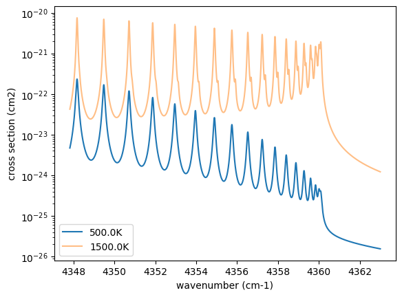

Nested Sampling of an Emission Spectrum Using JAXNS
===================================================

Last update: Febrary 2nd (2025) Hajime Kawahara for v2.0

In this guide, we perform retrieval of an emission spectrum using
`nested
sampling <https://ja.wikipedia.org/wiki/Nested_sampling_algorithm>`__.
The structure is the same as in the `getting
started <get_started.html>`__ guide, except that we use nested sampling
instead of HMC-NUTS; i.e. we will use ExoJAX to simulate a
high-resolution emission spectrum from an atmosphere with CO molecular
absorption and hydrogen molecule CIA continuum absorption as the opacity
sources. We will then add appropriate noise to the simulated spectrum to
create a mock spectrum and perform spectral retrieval using the nested
sampling.

Here, we use `JAXNS <https://github.com/Joshuaalbert/jaxns>`__, which is
bundled with NumPyro, as the sampler. Notably, apart from the final
retrieval step, most of the code remains the same as in the HMC-NUTS
case.

First, we recommend 64-bit if you do not think about numerical errors.
Use jax.config to set 64-bit. (But note that 32-bit is sufficient in
most cases. Consider to use 32-bit (faster, less device memory) for your
real use case.)

.. code:: ipython3

    from jax import config
    config.update("jax_enable_x64", True)

The following schematic figure explains how ExoJAX works; (1) loading
databases (``*db``), (2) calculating opacity (``opa``), (3) running
atmospheric radiative transfer (``art``), (4) applying operations on the
spectrum (``sop``)

In this guide, there are two opacity sources, CO and CIA. Their
respective databases, ``mdb`` and ``cdb``, are converted by ``opa`` into
the opacity of each atmospheric layer, which is then used in the
radiative transfer calculation performed by ``art``. Finally, ``sop``
convolves the rotational effects and instrumental profiles, generating
the emission spectrum.

``mdb``/``cdb`` –> ``opa`` –> ``art`` –> ``sop`` —> spectrum

This spectral model is incorporated into the probabilistic model in
NumPyro with JAXNS, and retrieval is performed by sampling using nested
sampling.

.. figure:: https://secondearths.sakura.ne.jp/exojax/figures/exojax_ns.png
   :alt: Figure. Structure of ExoJAX

   Figure. Structure of ExoJAX

1. Loading a molecular database using mdb
-----------------------------------------

ExoJAX has an API for molecular databases, called ``mdb`` (or ``adb``
for atomic datbases). Prior to loading the database, define the
wavenumber range first.

.. code:: ipython3

    from exojax.utils.grids import wavenumber_grid
    
    nu_grid, wav, resolution = wavenumber_grid(
        22920.0, 23000.0, 3500, unit="AA", xsmode="premodit"
    )
    print("Resolution=", resolution)

.. parsed-literal::

    xsmode =  premodit
    xsmode assumes ESLOG in wavenumber space: xsmode=premodit
    ======================================================================
    The wavenumber grid should be in ascending order.
    The users can specify the order of the wavelength grid by themselves.
    Your wavelength grid is in ***  descending  *** order
    ======================================================================
    Resolution= 1004211.9840291934

.. parsed-literal::

    /home/kawahara/exojax/src/exojax/spec/unitconvert.py:63: UserWarning: Both input wavelength and output wavenumber are in ascending order.
      warnings.warn(

Then, let’s load the molecular database. We here use Carbon monoxide in
Exomol. ``CO/12C-16O/Li2015`` means
``Carbon monoxide/ isotopes = 12C + 16O / database name``. You can check
the database name in the ExoMol website (https://www.exomol.com/).

.. code:: ipython3

    from exojax.spec.api import MdbExomol
    mdb = MdbExomol(".database/CO/12C-16O/Li2015", nurange=nu_grid)

.. parsed-literal::

    /home/kawahara/exojax/src/exojax/utils/molname.py:197: FutureWarning: e2s will be replaced to exact_molname_exomol_to_simple_molname.
      warnings.warn(
    /home/kawahara/exojax/src/exojax/utils/molname.py:91: FutureWarning: exojax.utils.molname.exact_molname_exomol_to_simple_molname will be replaced to radis.api.exomolapi.exact_molname_exomol_to_simple_molname.
      warnings.warn(
    /home/kawahara/exojax/src/exojax/utils/molname.py:91: FutureWarning: exojax.utils.molname.exact_molname_exomol_to_simple_molname will be replaced to radis.api.exomolapi.exact_molname_exomol_to_simple_molname.
      warnings.warn(

.. parsed-literal::

    HITRAN exact name= (12C)(16O)
    radis engine =  vaex
    Molecule:  CO
    Isotopologue:  12C-16O
    Background atmosphere:  H2
    ExoMol database:  None
    Local folder:  .database/CO/12C-16O/Li2015
    Transition files: 
    	 => File 12C-16O__Li2015.trans
    Broadening code level: a0

.. parsed-literal::

    /home/kawahara/exojax/src/radis/radis/api/exomolapi.py:685: AccuracyWarning: The default broadening parameter (alpha = 0.07 cm^-1 and n = 0.5) are used for J'' > 80 up to J'' = 152
      warnings.warn(

2. Computation of the Cross Section using opa
---------------------------------------------

ExoJAX has various opacity calculator classes, so-called ``opa``. Here,
we use a memory-saved opa, ``OpaPremodit``. We assume the robust
tempreature range we will use is 500-1500K.

.. code:: ipython3

    from exojax.opacity.opacalc import OpaPremodit
    opa = OpaPremodit(mdb, nu_grid, auto_trange=[500.0, 1500.0], dit_grid_resolution=1.0)

.. parsed-literal::

    OpaPremodit: params automatically set.
    default elower grid trange (degt) file version: 2
    Robust range: 485.7803992045456 - 1514.171191195336 K
    OpaPremodit: Tref_broadening is set to  866.0254037844389 K

.. parsed-literal::

    /home/kawahara/exojax/src/exojax/spec/opacalc.py:215: UserWarning: dit_grid_resolution is not None. Ignoring broadening_parameter_resolution.
      warnings.warn(

.. parsed-literal::

    # of reference width grid :  2
    # of temperature exponent grid : 2

.. parsed-literal::

    uniqidx: 0it [00:00, ?it/s]

.. parsed-literal::

    Premodit: Twt= 1108.7151960064205 K Tref= 570.4914318566549 K
    Making LSD:|####################| 100%

.. parsed-literal::

    

Then let’s compute cross section for two different temperature 500 and
1500 K for P=1.0 bar. opa.xsvector can do that!

.. code:: ipython3

    P = 1.0  # bar
    T_1 = 500.0  # K
    xsv_1 = opa.xsvector(T_1, P)  # cm2
    
    T_2 = 1500.0  # K
    xsv_2 = opa.xsvector(T_2, P)  # cm2

Plot them. It can be seen that different lines are stronger at different
temperatures.

.. code:: ipython3

    import matplotlib.pyplot as plt
    
    plt.plot(nu_grid, xsv_1, label=str(T_1) + "K")  # cm2
    plt.plot(nu_grid, xsv_2, alpha=0.5, label=str(T_2) + "K")  # cm2
    plt.yscale("log")
    plt.legend()
    plt.xlabel("wavenumber (cm-1)")
    plt.ylabel("cross section (cm2)")
    plt.show()

3. Atmospheric Radiative Transfer
---------------------------------

ExoJAX can solve the radiative transfer and derive the emission
spectrum. To do so, ExoJAX has ``art`` class. ``ArtEmisPure`` means
Atomospheric Radiative Transfer for Emission with Pure absorption. So,
``ArtEmisPure`` does not include scattering. We set the number of the
atmospheric layer to 200 (nlayer) and the pressure at bottom and top
atmosphere to 100 and 1.e-5 bar.

Since v1.5, one can choose the rtsolver (radiative transfer solver) from
the flux-based 2 stream solver (``fbase2st``) and the intensity-based
n-stream sovler (``ibased``). Use ``rtsolver`` option. In the latter
case, the number of the stream (``nstream``) can be specified. Note that
the default rtsolver for the pure absorption (i.e. no scattering nor
reflection) has been ``ibased`` since v1.5. In our experience,
``ibased`` is faster and more accurate than ``fbased``.

.. code:: ipython3

    from exojax.rt.atmrt import ArtEmisPure
    
    art = ArtEmisPure(
        nu_grid=nu_grid,
        pressure_btm=1.0e1,
        pressure_top=1.0e-5,
        nlayer=100,
        rtsolver="ibased",
        nstream=8,
    )

.. parsed-literal::

    rtsolver:  ibased
    Intensity-based n-stream solver, isothermal layer (e.g. NEMESIS, pRT like)

.. parsed-literal::

    /home/kawahara/exojax/src/exojax/spec/dtau_mmwl.py:13: FutureWarning: dtau_mmwl might be removed in future.
      warnings.warn("dtau_mmwl might be removed in future.", FutureWarning)

Let’s assume the power law temperature model, within 500 - 1500 K.

:math:`T = T_0 P^\alpha`

where :math:`T_0=1200` K and :math:`\alpha=0.1`.

.. code:: ipython3

    art.change_temperature_range(500.0, 1500.0)
    Tarr = art.powerlaw_temperature(1200.0, 0.1)

Also, the mass mixing ratio of CO (MMR) should be defined.

.. code:: ipython3

    mmr_profile = art.constant_mmr_profile(0.01)

Surface gravity is also important quantity of the atmospheric model,
which is a function of planetary radius and mass. Here we assume 1 RJ
and 10 MJ.

.. code:: ipython3

    from exojax.utils.astrofunc import gravity_jupiter
    
    gravity = gravity_jupiter(1.0, 10.0)

In addition to the CO cross section, we would consider `collisional
induced
absorption <https://en.wikipedia.org/wiki/Collision-induced_absorption_and_emission>`__
(CIA) as a continuum opacity. ``cdb`` class can be used.

.. code:: ipython3

    from exojax.spec.contdb import CdbCIA
    from exojax.opacity.opacont import OpaCIA
    
    cdb = CdbCIA(".database/H2-H2_2011.cia", nurange=nu_grid)
    opacia = OpaCIA(cdb, nu_grid=nu_grid)

.. parsed-literal::

    H2-H2

Before running the radiative transfer, we need cross sections for
layers, called ``xsmatrix`` for CO and ``logacia_matrix`` for CIA
(strictly speaking, the latter is not cross section but coefficient
because CIA intensity is proportional density square). See
`here <CIA_opacity.html>`__ for the details.

.. code:: ipython3

    xsmatrix = opa.xsmatrix(Tarr, art.pressure)
    logacia_matrix = opacia.logacia_matrix(Tarr)

Convert them to opacity

.. code:: ipython3

    dtau_CO = art.opacity_profile_xs(xsmatrix, mmr_profile, mdb.molmass, gravity)
    vmrH2 = 0.855  # VMR of H2
    mmw = 2.33  # mean molecular weight of the atmosphere
    dtaucia = art.opacity_profile_cia(logacia_matrix, Tarr, vmrH2, vmrH2, mmw, gravity)

Add two opacities.

.. code:: ipython3

    dtau = dtau_CO + dtaucia

Then, run the radiative transfer. As you can see, the emission spectrum
has been generated. This spectrum shows a region near 4360 cm-1, or
around 22940 AA, where CO features become increasingly dense. This
region is referred to as the band head. If you’re interested in why the
band head occurs, please refer to `Quatum states of Carbon Monoxide and
Fortrat Diagram <Fortrat.html>`__.

.. code:: ipython3

    F = art.run(dtau, Tarr)
    
    fig = plt.figure(figsize=(15, 4))
    plt.plot(nu_grid, F)
    plt.xlabel("wavenumber (cm-1)")
    plt.ylabel("flux (erg/s/cm2/cm-1)")
    plt.show()

You can check the contribution function too! You should check if the
dominant contribution is within the layer. If not, you need to change
``pressure_top`` and ``pressure_btm`` in ``ArtEmisPure``

.. code:: ipython3

    from exojax.plot.atmplot import plotcf

.. code:: ipython3

    cf = plotcf(nu_grid, dtau, Tarr, art.pressure, art.dParr)

4. Spectral Operators: rotational broadening, instrumental profile, Doppler velocity shift and so on, any operation on spectra.
-------------------------------------------------------------------------------------------------------------------------------

The above spectrum is called “raw spectrum” in ExoJAX. The effects
applied to the raw spectrum is handled in ExoJAX by the spectral
operator (``sop``). First, we apply the spin rotational broadening of a
planet.

.. code:: ipython3

    from exojax.spec.specop import SopRotation
    
    sop_rot = SopRotation(nu_grid, vsini_max=100.0)
    
    vsini = 10.0
    u1 = 0.0
    u2 = 0.0
    Frot = sop_rot.rigid_rotation(F, vsini, u1, u2)

.. code:: ipython3

    fig = plt.figure(figsize=(15, 4))
    plt.plot(nu_grid, F, label="raw spectrum")
    plt.plot(nu_grid, Frot, label="rotated")
    plt.xlabel("wavenumber (cm-1)")
    plt.ylabel("flux (erg/s/cm2/cm-1)")
    plt.legend()
    plt.show()

Then, the instrumental profile with relative radial velocity shift is
applied. Also, we need to match the computed spectrum to the data grid.
This process is called ``sampling`` (but just interpolation though).
Below, let’s perform a simulation that includes noise for use in later
analysis.

.. code:: ipython3

    from exojax.spec.specop import SopInstProfile
    from exojax.utils.instfunc import resolution_to_gaussian_std
    
    sop_inst = SopInstProfile(nu_grid, vrmax=1000.0)
    
    RV = 40.0  # km/s
    resolution_inst =70000.0
    beta_inst = resolution_to_gaussian_std(resolution_inst)
    Finst = sop_inst.ipgauss(Frot, beta_inst)
    nu_obs = nu_grid[::5][:-50]
    
    
    from numpy.random import normal
    noise = 500.0
    Fobs = sop_inst.sampling(Finst, RV, nu_obs) + normal(0.0, noise, len(nu_obs))

.. code:: ipython3

    fig = plt.figure(figsize=(12, 6))
    ax = fig.add_subplot(211)
    plt.plot(nu_grid, Frot, label="rotated")
    plt.plot(nu_grid, Finst, label="rotated+IP")
    plt.ylabel("flux (erg/s/cm2/cm-1)")
    plt.legend()
    ax = fig.add_subplot(212)
    plt.errorbar(nu_obs, Fobs, noise, fmt=".", label="rotated + RV + IP (sampling)", color="gray",alpha=0.5)
    plt.xlabel("wavenumber (cm-1)")
    plt.legend()
    plt.show()

5. Retrieval of an Emission Spectrum
------------------------------------

Next, let’s perform a “retrieval” on the simulated spectrum created
above. Retrieval involves estimating the parameters of an atmospheric
model in the form of a posterior distribution based on the spectrum. To
do this, we first need a model. Here, we have compiled the forward
modeling steps so far and defined the model as follows. The spectral
model has six parameters.

.. code:: ipython3

    def fspec(T0, alpha, mmr, g, RV, vsini):
        #molecule
        Tarr = art.powerlaw_temperature(T0, alpha)
        xsmatrix = opa.xsmatrix(Tarr, art.pressure)
        mmr_arr = art.constant_mmr_profile(mmr)
        dtau = art.opacity_profile_xs(xsmatrix, mmr_arr, opa.mdb.molmass, g)
        #continuum
        logacia_matrix = opacia.logacia_matrix(Tarr)
        dtaucH2H2 = art.opacity_profile_cia(logacia_matrix, Tarr, vmrH2, vmrH2,
                                            mmw, g)
        #total tau
        dtau = dtau + dtaucH2H2
        F = art.run(dtau, Tarr)
        Frot = sop_rot.rigid_rotation(F, vsini, u1, u2)
        Finst = sop_inst.ipgauss(Frot, beta_inst)
        mu = sop_inst.sampling(Finst, RV, nu_obs)
        return mu

Let’s verify that spectra are being generated from ``fspec`` with
various parameter sets.

.. code:: ipython3

    fig = plt.figure(figsize=(12, 3))
    
    plt.plot(nu_obs, fspec(1200.0, 0.09, 0.01, gravity_jupiter(1.0, 1.0), 40.0, 10.0),label="model")
    plt.plot(nu_obs, fspec(1100.0, 0.12, 0.01, gravity_jupiter(1.0, 10.0), 20.0, 5.0),label="model")

.. parsed-literal::

    [<matplotlib.lines.Line2D at 0x7f24fc2bd0a0>]

NumPyro is a probabilistic programming language (PPL), which requires
the definition of a probabilistic model. In the probabilistic model
``model_prob`` defined below, the prior distributions of each parameter
are specified. The previously defined spectral model is used within this
probabilistic model as a function that provides the mean :math:`\mu`.
The spectrum is assumed to be generated according to a Gaussian
distribution with this mean and a standard deviation :math:`\sigma`.
i.e. :math:`f(\nu_i) \sim \mathcal{N}(\mu(\nu_i; {\bf p}), \sigma^2 I)`,
where :math:`{\bf p}` is the spectral model parameter set, which are the
arguments of ``fspec``.

.. code:: ipython3

    import numpyro.distributions as dist
    import numpyro
    from jax import random
    from numpyro.contrib.nested_sampling import NestedSampler

.. parsed-literal::

    2025-02-02 18:08:47.555832: E external/local_xla/xla/stream_executor/cuda/cuda_fft.cc:477] Unable to register cuFFT factory: Attempting to register factory for plugin cuFFT when one has already been registered
    WARNING: All log messages before absl::InitializeLog() is called are written to STDERR
    E0000 00:00:1738487327.576968  203197 cuda_dnn.cc:8310] Unable to register cuDNN factory: Attempting to register factory for plugin cuDNN when one has already been registered
    E0000 00:00:1738487327.583472  203197 cuda_blas.cc:1418] Unable to register cuBLAS factory: Attempting to register factory for plugin cuBLAS when one has already been registered

.. code:: ipython3

    def model_prob(spectrum):
    
        #atmospheric/spectral model parameters priors
        logg = numpyro.sample('logg', dist.Uniform(4.0, 5.0))
        RV = numpyro.sample('RV', dist.Uniform(35.0, 45.0))
        mmr = numpyro.sample('MMR', dist.Uniform(0.0, 0.015))
        T0 = numpyro.sample('T0', dist.Uniform(1000.0, 1500.0))
        alpha = numpyro.sample('alpha', dist.Uniform(0.05, 0.2))
        vsini = numpyro.sample('vsini', dist.Uniform(5.0, 15.0))
        mu = fspec(T0, alpha, mmr, 10**logg, RV, vsini)
    
        #noise model parameters priors
        sigmain = numpyro.sample('sigmain', dist.Exponential(1.e-3)) 
    
        return numpyro.sample('spectrum', dist.Normal(mu, sigmain), obs=spectrum)

Next, we define and run the nested sampler. Here, we can use
``NestedSampler``, a wrapper for JAXNS. It took about 1 hours using
A100.

.. code:: ipython3

    ns = NestedSampler(model_prob)
    ns.run(random.PRNGKey(0), Fobs)

.. parsed-literal::

    INFO:jaxns:Number of Markov-chains set to: 175

After returning from your long lunch, if you’re lucky and the sampling
is complete, let’s write a predictive model for the spectrum.

.. code:: ipython3

    from numpyro.diagnostics import hpdi
    from numpyro.infer import Predictive
    import jax.numpy as jnp

.. code:: ipython3

    posterior_sample = ns.get_samples(random.PRNGKey(3), num_samples=1000)
    pred = Predictive(model_prob, posterior_sample, return_sites=['spectrum'])
    predictions = pred(random.PRNGKey(0), spectrum=None)
    median_mu1 = jnp.median(predictions['spectrum'], axis=0)
    hpdi_mu1 = hpdi(predictions['spectrum'], 0.9)

.. code:: ipython3

    fig, ax = plt.subplots(nrows=1, ncols=1, figsize=(15, 4.5))
    ax.plot(nu_obs, median_mu1, color='C1')
    ax.fill_between(nu_obs,
                    hpdi_mu1[0],
                    hpdi_mu1[1],
                    alpha=0.3,
                    interpolate=True,
                    color='C1',
                    label='90% area')
    ax.errorbar(nu_obs, Fobs, noise, fmt=".", label="mock spectrum", color="black",alpha=0.5)
    plt.xlabel('wavenumber (cm-1)', fontsize=16)
    plt.legend(fontsize=14)
    plt.tick_params(labelsize=14)
    plt.show()

You can see that the predictions are working very well! Let’s also
display a corner plot. Here, we’ve used ArviZ for visualization.

.. code:: ipython3

    import arviz
    pararr = ['T0', 'alpha', 'logg', 'MMR', 'vsini', 'RV']
    arviz.plot_pair(posterior_sample,
                    kind='kde',
                    divergences=False,
                    marginals=True)
    plt.show()

That’s it!

