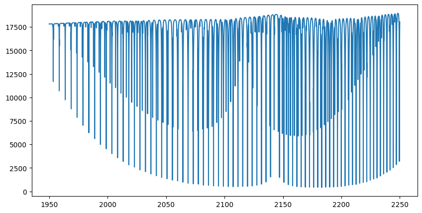
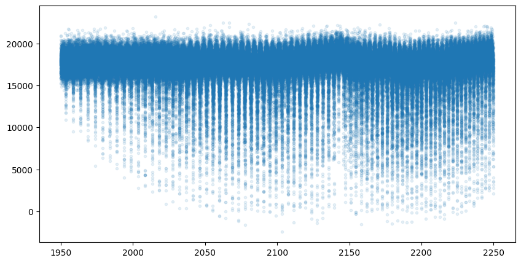
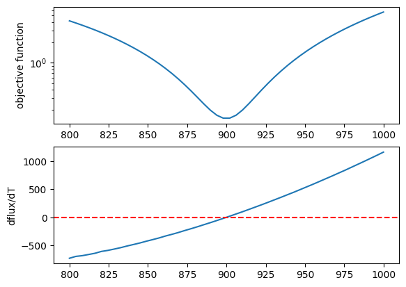
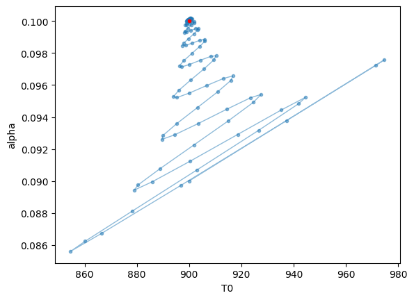
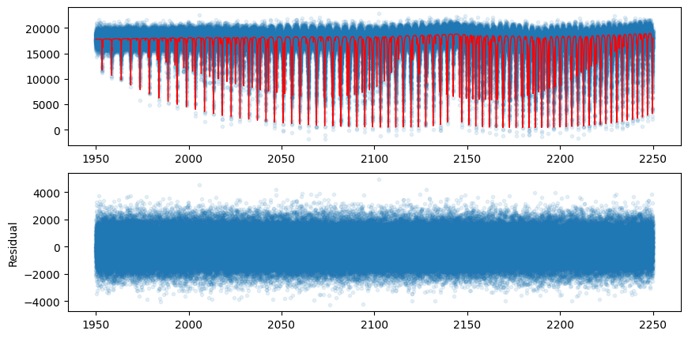

Getting Started with Opart; GPU memory-efficient Emission Spectrum
==================================================================

Last update: January 14th (2025) Hajime Kawahara

This is a device memory efficient version of `Getting Started with
Simulating the Emission Spectra <get_started.html>`__!

Note: It is worth noting that batch execution of this notebook
(``jupyter nbconvert --to script get_started_opart.ipynb; python get_started_opart.py``)
was successfully performed on a laptop equipped with an RTX 3080 (8GB
device memory).　The device memory usage was approximately 2.4 GB.

First, we recommend 64-bit if you do not think about numerical errors.
Use jax.config to set 64-bit. (But note that 32-bit is sufficient in
most cases. Consider to use 32-bit (faster, less device memory) for your
real use case.)

.. code:: ipython3

    #if you wanna monitor the device memory use, you can use jax_smi
    #from jax_smi import initialise_tracking
    #initialise_tracking()

.. code:: ipython3

    from jax import config
    config.update("jax_enable_x64", True)

One approach to reducing device memory usage is to calculate the opacity
layer by layer and advance the radiative transfer by one layer at a
time. To achieve this, it is necessary to integrate the opacity
calculator (``opa``) and the radiative transfer (``art``), leading to
the use of the ``opart`` class (opa + art). Here, we demonstrate the
calculation of a pure absorption emission spectrum using ``opart``.

1. Computes an Emission Spectrum using ``opart``
------------------------------------------------

The user needs to define a class, ``OpaLayer``, that specifies how to
calculate opacity for each layer. The ``OpaLayer`` class must define at
least an ``__init__`` method and a ``__call__`` method. Additionally,
``self.nu_grid`` must be defined. In this example, molecular absorption
by CO and the CIA continuum opacity of H2 are defined for each layer.
The ``__call__`` method should take the parameters of a layer as input
and return the optical depth (delta tau) for that layer.

Note that you can also use the
`nu-stitching <Cross_Section_using_OpaStitch.html>`__ option in
``OpaPremodit`` if you want to cut the wing.

.. code:: ipython3

    from exojax.spec.api import MdbExomol
    from exojax.spec.contdb import CdbCIA
    from exojax.opacity.opacalc import OpaPremodit
    from exojax.opacity.opacont import OpaCIA
    from exojax.rt.layeropacity import single_layer_optical_depth
    from exojax.rt.layeropacity import single_layer_optical_depth_CIA
    from exojax.utils.grids import wavenumber_grid
    from exojax.utils.astrofunc import gravity_jupiter
    
    
    class OpaLayer:
        # user defined class, needs to define self.nugrid
        def __init__(self, Nnus=150000):
            self.nu_grid, self.wav, self.resolution = wavenumber_grid(
                1950.0, 2250.0, Nnus, unit="cm-1", xsmode="premodit"
            )
            # sets mdb for CO
            self.mdb_co = MdbExomol(".database/CO/12C-16O/Li2015", nurange=self.nu_grid)
            self.opa_co = OpaPremodit(
                self.mdb_co,
                self.nu_grid,
                auto_trange=[500.0, 1500.0],
                dit_grid_resolution=1.0,
                #nstitch=10, # nu-stitch option
                #cutwing=0.015, #nu-stitch option
                allow_32bit=True
            )
            # sets CIA
            self.cdb_cia = CdbCIA(".database/H2-H2_2011.cia",nurange=self.nu_grid)
            self.opa_cia = OpaCIA(self.cdb_cia, nu_grid=self.nu_grid)
            # other parameters (optiohal)        
            self.gravity = gravity_jupiter(1.0, 10.0)
            self.vmrH2 = 0.855 # VMR for H2
            self.mmw = 2.33 # mean molecular weight of the atmosphere
    
        def __call__(self, params):
            temperature, pressure, dP, mixing_ratio = params
            # computes CO opacity
            xsv_co = self.opa_co.xsvector(temperature, pressure)
            dtau_co = single_layer_optical_depth(
                dP, xsv_co, mixing_ratio, self.mdb_co.molmass, self.gravity
            )
            # computes CIA opacity
            logacia_vector = self.opa_cia.logacia_vector(temperature)
            dtau_cia = single_layer_optical_depth_CIA(temperature, pressure, dP, self.vmrH2, self.vmrH2, self.mmw, self.gravity, logacia_vector)
            return dtau_co + dtau_cia

.. parsed-literal::

    /home/kawahara/exojax/src/exojax/spec/dtau_mmwl.py:13: FutureWarning: dtau_mmwl might be removed in future.
      warnings.warn("dtau_mmwl might be removed in future.", FutureWarning)

For molecular opacity, note that the opacity for a single layer is
calculated here. First, ``opa.xsvector`` (the cross-section vector along
the wavenumber direction) is computed, and then it is converted into the
optical depth for a single layer using
`spec.layeropacity.single_layer_optical_depth <../exojax/exojax.spec.html#exojax.spec.layeropacity.single_layer_optical_depth>`__.

In the code above, CIA is assumed as the continuum, and
`spec.layeropacity.single_layer_optical_depth_CIA <../exojax/exojax.spec.html#exojax.spec.layeropacity.single_layer_optical_depth_CIA>`__
is used. However, other options such as
`spec.layeropacity.single_layer_optical_depth_Hminus <../exojax/exojax.spec.html#exojax.spec.layeropacity.single_layer_optical_depth_Hminus>`__
for H-, for example.

For Rayleigh scattering,
`spec.rayleigh.xsvector_rayleigh_gas <../exojax/exojax.spec.html#exojax.spec.rayleigh.xsvector_rayleigh_gas>`__
provides the cross-section vector (a vector of cross-sections along the
wavenumber direction), so you can use
`spec.layeropacity.single_layer_optical_depth <../exojax/exojax.spec.html#exojax.spec.layeropacity.single_layer_optical_depth>`__
in the same way as for molecules.

Do not put ``@partial(jit, static_argnums=(0,))`` on ``__call__``. This
is not necessary and makes the code significantly slow.

Next, the user will utilize the ``OpaLayer`` class in the ``Opart``
class. Here, since the goal is to calculate pure absorption emission,
the ``OpartEmisPure`` class will be used. (Remember that if ``opa`` and
``art`` are separated, the ``ArtEmisPure`` class would have been used
instead.)

.. code:: ipython3

    from exojax.rt.opart import OpartEmisPure
    
    opalayer = OpaLayer(Nnus=150000)
    opart = OpartEmisPure(opalayer, pressure_top=1.0e-5, pressure_btm=1.0e1, nlayer=200, nstream=8)
    opart.change_temperature_range(400.0, 1500.0)

.. parsed-literal::

    xsmode =  premodit
    xsmode assumes ESLOG in wavenumber space: xsmode=premodit
    ======================================================================
    The wavenumber grid should be in ascending order.
    The users can specify the order of the wavelength grid by themselves.
    Your wavelength grid is in ***  descending  *** order
    ======================================================================
    HITRAN exact name= (12C)(16O)
    radis engine =  vaex

.. parsed-literal::

    /home/kawahara/exojax/src/exojax/utils/molname.py:197: FutureWarning: e2s will be replaced to exact_molname_exomol_to_simple_molname.
      warnings.warn(
    /home/kawahara/exojax/src/exojax/utils/molname.py:91: FutureWarning: exojax.utils.molname.exact_molname_exomol_to_simple_molname will be replaced to radis.api.exomolapi.exact_molname_exomol_to_simple_molname.
      warnings.warn(
    /home/kawahara/exojax/src/exojax/utils/molname.py:91: FutureWarning: exojax.utils.molname.exact_molname_exomol_to_simple_molname will be replaced to radis.api.exomolapi.exact_molname_exomol_to_simple_molname.
      warnings.warn(

.. parsed-literal::

    Molecule:  CO
    Isotopologue:  12C-16O
    Background atmosphere:  H2
    ExoMol database:  None
    Local folder:  .database/CO/12C-16O/Li2015
    Transition files: 
    	 => File 12C-16O__Li2015.trans
    Broadening code level: a0

.. parsed-literal::

    /home/kawahara/anaconda3/lib/python3.10/site-packages/radis-0.15.2-py3.10.egg/radis/api/exomolapi.py:685: AccuracyWarning: The default broadening parameter (alpha = 0.07 cm^-1 and n = 0.5) are used for J'' > 80 up to J'' = 152
      warnings.warn(
    /home/kawahara/exojax/src/exojax/spec/opacalc.py:215: UserWarning: dit_grid_resolution is not None. Ignoring broadening_parameter_resolution.
      warnings.warn(

.. parsed-literal::

    OpaPremodit: params automatically set.
    default elower grid trange (degt) file version: 2
    Robust range: 485.7803992045456 - 1514.171191195336 K
    OpaPremodit: Tref_broadening is set to  866.0254037844389 K
    # of reference width grid :  2
    # of temperature exponent grid : 2

.. parsed-literal::

    uniqidx: 0it [00:00, ?it/s]

.. parsed-literal::

    Premodit: Twt= 1108.7151960064205 K Tref= 570.4914318566549 K
    Making LSD:|####################| 100%

.. parsed-literal::

    

.. parsed-literal::

    H2-H2

Here, somewhat abruptly, we define a function to update a layer. This
function simply calls ``update_layer`` within ``opart`` and returns its
output along with ``None``. You might wonder why you need to define such
a function yourself. To get a bit technical, this function is used with
``jax.lax.scan`` when updating layers. However, if it is defined inside
a class, XLA will recompile every time the parameters change, leading to
a performance slowdown. For this reason, in the current implementation,
users are required to define this function outside the class. This
implementation may be revisited and revised in the future.

.. code:: ipython3

    def layer_update_function(carry_tauflux, params):
        carry_tauflux = opart.update_layer(carry_tauflux, params)
        return carry_tauflux, None

Now, let’s define the temperature and mixing ratio profiles (in the same
way as for ``art``) and calculate the flux. Define the
``layer_parameter`` input, which is a list of parameters for all layers.
The temperature profile must be specified as the first element (index
0). For the remaining elements, arrange them in the same order as used
in the user-defined ``OpaLayer``.

.. code:: ipython3

    temperature = opart.clip_temperature(opart.powerlaw_temperature(900.0, 0.1))
    mixing_ratio = opart.constant_mmr_profile(0.00001)
    layer_params = [temperature, opart.pressure, opart.dParr, mixing_ratio]
    flux = opart(layer_params, layer_update_function)

The spectrum has now been calculated. Let’s plot it. In this example, we
calculate 200,000 wavenumber grid points across 200 layers. Even if the
GPU you’re using has only 8 GB of device memory, such as an RTX 2080, it
should be sufficient to perform the computation.

.. code:: ipython3

    import matplotlib.pyplot as plt
    
    fig = plt.figure(figsize=(10,5))
    ax = fig.add_subplot(111)
    plt.plot(opalayer.nu_grid, flux)
    plt.show()    

2. Optimization of ``opart`` using Forward-mode Differentiation
---------------------------------------------------------------

Next, we will perform gradient-based optimization using ``opart``.
First, let’s generate mock data.

.. code:: ipython3

    import numpy as np
    import matplotlib.pyplot as plt
    mock_spectrum = flux +  np.random.normal(0.0, 1000.0, len(opalayer.nu_grid))
    fig = plt.figure(figsize=(10,5))
    ax = fig.add_subplot(111)
    plt.plot(opalayer.nu_grid, mock_spectrum, ".", alpha=0.1)
    #plt.plot(opalayer.nu_grid, flux, lw=1, color="red")
    
    plt.show()    

Next, define the objective function.

In this example, we will optimize two parameters of the temperature
profile (T0 and powerlaw index alpha). For gradient-based optimization,
we need to compute gradients. Typically, gradients are calculated using
``jax.grad``, which employs reverse-mode differentiation. However, this
approach consumes a significant amount of memory. Instead, we use
forward-mode differentiation.

The differences between forward-mode and reverse-mode differentiation
can be summarized as shown in the figure below. In forward-mode
differentiation, function composition and differentiation propagate from
the input side (left) to the output side (right), allowing function
values and derivative values at each step to be discarded from memory.
Each step of computation uses the Jacobian-Vector Product (JVP;
directional derivative itself).

On the other hand, in reverse-mode differentiation (also known as
backpropagation), differentiation proceeds from the output side (right)
to the input side (left). Each step uses the Vector-Jacobian Product
(VJP), but computing the VJP requires function values after updates
(denoted as :math:`f({\bf \omega})`) in the figure. Therefore, the
function must first be composed from the input side to the output side,
and intermediate results must be stored. This leads to higher (device)
memory usage.

The advantage of reverse-mode differentiation is that when the input
vector has a higher dimension than the output vector (e.g., when the
output is a single cost function), its computational cost is lower than
that of forward-mode differentiation. In typical retrieval scenarios,
this advantage is not very significant. However, when the number of
estimated parameters is large, it can become a critical issue, so
careful consideration of the memory-computation tradeoff is recommended.

.. figure:: https://secondearths.sakura.ne.jp/exojax/figures/exojax_fr.png
   :alt: Figure forward-mode and reverse-mode differentiation

   Figure forward-mode and reverse-mode differentiation

For this purpose, we utilize ``jax.jacfwd`` as the Jacobian computation
using the forward-mode.

.. code:: ipython3

    import jax.numpy as jnp
    fac = 1.e4
    
    
    def objective_fluxt_vector(params):
        T = params[0]*fac
        alpha = params[1]
        temperature = opart.clip_temperature(opart.powerlaw_temperature(T, alpha))
        mixing_ratio = opart.constant_mmr_profile(0.00001)
        layer_params = [temperature, opart.pressure, opart.dParr, mixing_ratio]
        flux = opart(layer_params , layer_update_function) 
        res = flux - mock_spectrum
        return jnp.dot(res,res)*1.0e-12
    
    from jax import jacfwd
    
    def dfluxt_jacfwd(params):
        return jacfwd(objective_fluxt_vector)(params)
    
    print(dfluxt_jacfwd([900.0/fac, 0.1]))

.. parsed-literal::

    [Array(-0.30389497, dtype=float64), Array(-0.03122399, dtype=float64)]

Or alternatively ``jax.jvp`` (Jacobian-Vector Product) can be
used.　Using ``jax.jvp`` might be slightly slower than ``jacfwd``, but…

.. code:: ipython3

    
    import jax.numpy as jnp
    
    def objective_fluxt_each(T0,alpha):
        temperature = opart.clip_temperature(opart.powerlaw_temperature(T0, alpha))
        mixing_ratio = opart.constant_mmr_profile(0.00001)
        layer_params = [temperature, opart.pressure, opart.dParr, mixing_ratio]
        flux = opart(layer_params , layer_update_function) 
        res = flux - mock_spectrum
        return jnp.dot(res,res)*1.0e-12
    
    
    from jax import jvp
    fac = 1.e4
    
    def dfluxt_jvp(params):
        T = params[0]*fac
        alpha = params[1]
        return jnp.array([jvp(objective_fluxt_each, (T,alpha), (1.0,0.0))[1], jvp(objective_fluxt_each, (T,alpha), (0.0,1.0))[1]])
    
    print(dfluxt_jvp([900.0/fac, 0.1]))
    

.. parsed-literal::

    [-8.83467787e-06 -4.74474356e-03]

Let’s plot the objective function as a function of T.

.. code:: ipython3

    method = "jacfwd" # "jvp" for the jvp case
    
    import tqdm
    obj = []
    derivative = [] 
    tlist = np.linspace(800.0, 1000.0, 50)/fac
    for t in tqdm.tqdm(tlist):
        if method == "jacfwd":
            params = jnp.array([t, 0.1])
            value = objective_fluxt_vector(params) #jacfwd case
            df = dfluxt_jacfwd(params)
        elif method == "jvp":
            value = objective_fluxt_each(t*fac, 0.1) #jvp case
            df = dfluxt_jvp([t, 0.1]) #jvp case
        obj.append(value)
        derivative.append(df[0])

.. parsed-literal::

    100%|██████████| 50/50 [10:21<00:00, 12.44s/it]

.. code:: ipython3

    fig = plt.figure()
    ax = fig.add_subplot(211)
    plt.plot(tlist*fac, obj)
    plt.yscale("log")
    plt.ylabel("objective function")
    ax = fig.add_subplot(212)
    plt.plot(tlist*fac, derivative)
    plt.axhline(0.0, color="red", linestyle="--")
    plt.ylabel("dflux/dT")
    plt.show()

Let’s perform optimization using the gradient (JVP) with
`optax <https://github.com/google-deepmind/optax>`__\ ’s AdamW optimizer
(you can, of course, use Adam or other optimizers if preferred).

.. code:: ipython3

    import optax
    solver = optax.adamw(learning_rate=0.01)
    params = jnp.array([800.0/fac, 0.08])
    opt_state = solver.init(params)
    
    
    trajectory=[]
    for i in range(100):
        grad = dfluxt_jacfwd(params)
        updates, opt_state = solver.update(grad, opt_state, params)
        params = optax.apply_updates(params, updates)
        trajectory.append(params)
        if np.mod(i,10)==0:    
            print('Objective function: {:.2E}'.format(objective_fluxt_vector(params)), "T0: ", params[0]*fac, "alpha: ", params[1])

.. parsed-literal::

    Objective function: 1.99E-01 T0:  899.9991999987783 alpha:  0.08999991999873427
    Objective function: 3.48E-01 T0:  926.6781692992693 alpha:  0.0931724823153698
    Objective function: 1.68E-01 T0:  901.8653101013599 alpha:  0.09225547157640661
    Objective function: 2.08E-01 T0:  895.2651875787137 alpha:  0.0935864758062235
    Objective function: 1.81E-01 T0:  896.1425462222461 alpha:  0.09567910622999228
    Objective function: 1.59E-01 T0:  897.9766116513349 alpha:  0.09752100457624553
    Objective function: 1.50E-01 T0:  899.7120460192209 alpha:  0.09889100848017918
    Objective function: 1.49E-01 T0:  900.9991516321255 alpha:  0.0997522033521371
    Objective function: 1.50E-01 T0:  901.1835152084095 alpha:  0.10013304971008916
    Objective function: 1.49E-01 T0:  900.2631301037181 alpha:  0.10015558983532892

Plots the optimization trajectory

.. code:: ipython3

    trajectory = jnp.array(trajectory)
    import matplotlib.pyplot as plt
    plt.plot(trajectory[:,0]*fac, trajectory[:,1],".",alpha=0.5,lw=1, color="C0")
    plt.plot(trajectory[:,0]*fac, trajectory[:,1],alpha=0.5,lw=1, color="C0")
    plt.plot(900.0,0.1,".",color="red")
    plt.xlabel("T0")
    plt.ylabel("alpha")
    plt.show()

Let’s compare the model using the best-fit values with the mock data.

.. code:: ipython3

    def fluxt(T0, alpha):
        temperature = opart.clip_temperature(opart.powerlaw_temperature(T0, alpha))
        mixing_ratio = opart.constant_mmr_profile(0.00001)
        layer_params = [temperature, opart.pressure, opart.dParr, mixing_ratio]
        flux = opart(layer_params , layer_update_function) 
        return flux

.. code:: ipython3

    import numpy as np
    mock_spectrum = flux +  np.random.normal(0.0, 1000.0, len(opalayer.nu_grid))
    fig = plt.figure(figsize=(10,5))
    ax = fig.add_subplot(211)
    plt.plot(opalayer.nu_grid, mock_spectrum, ".", alpha=0.1)
    plt.plot(opalayer.nu_grid, fluxt(params[0]*fac, params[1]), lw=1, color="red")
    ax = fig.add_subplot(212)
    plt.plot(opalayer.nu_grid, mock_spectrum-fluxt(params[0]*fac, params[1]), ".", alpha=0.1)
    plt.ylabel("Residual")
    plt.show()    

In this way, gradient optimization can be performed in a device
memory-efficient manner using forward differentiation.

3. HMC-NUTS using forward differentiation
-----------------------------------------

Forward differentiation must also be used in HMC-NUTS. In NumPyro’s
NUTS, this can be achieved by setting the option
``forward_mode_differentiation=True``. Other than this, the execution
method is the same as the standard HMC-NUTS.

.. code:: ipython3

    def fluxt(T0, alpha):
        temperature = opart.clip_temperature(opart.powerlaw_temperature(T0, alpha))
        mixing_ratio = opart.constant_mmr_profile(0.00001)
        layer_params = [temperature, opart.pressure, opart.dParr, mixing_ratio]
        flux = opart(layer_params , layer_update_function) 
        return flux

.. code:: ipython3

    #PPL import
    from numpyro.infer import MCMC, NUTS
    import numpyro
    import numpyro.distributions as dist
    from jax import random

.. code:: ipython3

    def model_c(y1):
        T0 = numpyro.sample('T0', dist.Uniform(800.0, 1000.0))
        alpha = numpyro.sample('alpha', dist.Uniform(0.05, 0.15))
        mu =  fluxt(T0, alpha)
        sigmain = numpyro.sample('sigmain', dist.Exponential(0.001))
        numpyro.sample('y1', dist.Normal(mu, sigmain), obs=y1)
    

.. code:: ipython3

    rng_key = random.PRNGKey(0)
    rng_key, rng_key_ = random.split(rng_key)
    num_warmup, num_samples = 100, 200
    kernel = NUTS(model_c, forward_mode_differentiation=True) #forward-mode diff
    #kernel = NUTS(model_c, forward_mode_differentiation=False) #reverse-mode diff, might be failed due to OoM
    
    mcmc = MCMC(kernel, num_warmup=num_warmup, num_samples=num_samples)
    mcmc.run(rng_key_, y1=mock_spectrum)
    mcmc.print_summary()

.. parsed-literal::

    sample: 100%|██████████| 300/300 [51:28<00:00, 10.29s/it, 7 steps of size 2.28e-03. acc. prob=0.96]   

.. parsed-literal::

    
                    mean       std    median      5.0%     95.0%     n_eff     r_hat
            T0    899.81      0.15    899.83    899.57    900.05     30.21      1.00
         alpha      0.10      0.00      0.10      0.10      0.10     30.57      1.00
       sigmain    997.64      1.89    997.57    994.96   1000.80    227.09      1.00
    
    Number of divergences: 0

That’s it.

