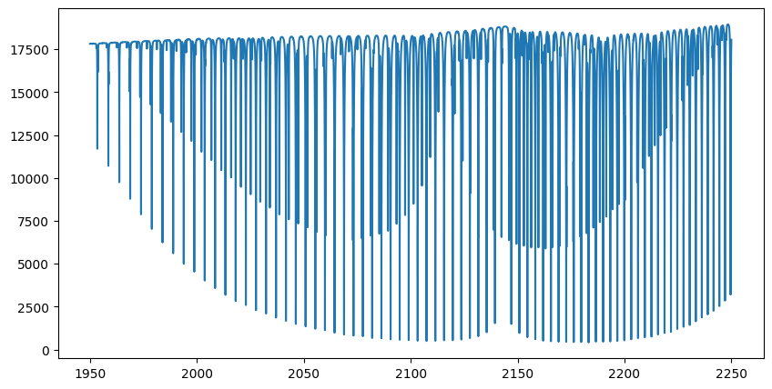
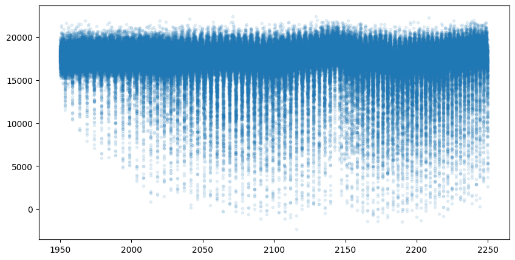
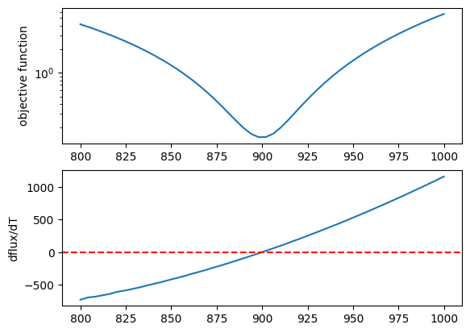
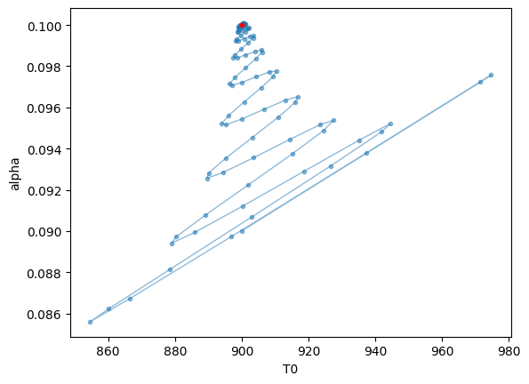
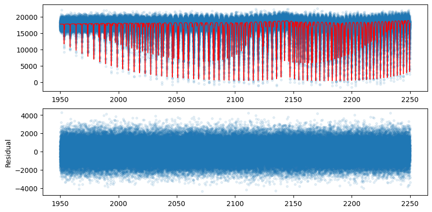

Getting Started with Opart; GPU memory-efficient Emission Spectrum
==================================================================

Last update: June 2026, Hajime Kawahara, for ExoJAX 2.5.0

This guide is a device-memory-efficient version of `Getting Started with
Emission Spectroscopy <get_started.html>`__. It uses ``opart``, which
combines opacity calculation and radiative transfer layer by layer.

Batch execution of this notebook has been tested on an 8 GB GPU. The
example uses about 2.4 GB of device memory, although actual usage
depends on the local JAX and CUDA setup.

This notebook enables 64-bit mode in JAX. This is useful for numerical
stability in retrieval examples, although 32-bit mode is often
sufficient and can be faster with lower device-memory use in production
workflows.

.. code:: ipython3

    #if you wanna monitor the device memory use, you can use jax_smi
    #from jax_smi import initialise_tracking
    #initialise_tracking()

.. code:: ipython3

    from jax import config
    config.update("jax_enable_x64", True)

One approach to reducing device memory usage is to calculate the opacity
layer by layer and advance the radiative transfer by one layer at a
time. To achieve this, it is necessary to integrate the opacity
calculator (``opa``) and the radiative transfer (``art``), leading to
the use of the ``opart`` class (opa + art). Here, we demonstrate the
calculation of a pure absorption emission spectrum using ``opart``.

1. Compute an Emission Spectrum with ``opart``
----------------------------------------------

Define an ``OpaLayer`` class that computes opacity for one atmospheric
layer. The class must define at least ``__init__`` and ``__call__``, and
it must set ``self.nu_grid``. In this example, each layer includes CO
molecular absorption and H2-H2 CIA continuum opacity. The ``__call__``
method receives layer parameters and returns the optical depth for that
layer.

If line wings need to be truncated, ``OpaPremodit`` can also use
`wavenumber stitching <Cross_Section_using_OpaStitch.html>`__.

.. code:: ipython3

    from exojax.database.exomol.api import MdbExomol
    from exojax.database.contdb  import CdbCIA
    from exojax.opacity import OpaPremodit
    from exojax.opacity import OpaCIA
    from exojax.rt.layeropacity import single_layer_optical_depth
    from exojax.rt.layeropacity import single_layer_optical_depth_CIA
    from exojax.utils.grids import wavenumber_grid
    from exojax.utils.astrofunc import gravity_jupiter
    
    
    class OpaLayer:
        # user defined class, needs to define self.nugrid
        def __init__(self, Nnus=150000):
            self.nu_grid, self.wav, self.resolution = wavenumber_grid(
                1950.0, 2250.0, Nnus, unit="cm-1", xsmode="premodit"
            )
            # sets mdb for CO
            self.mdb_co = MdbExomol(".database/CO/12C-16O/Li2015", nurange=self.nu_grid)
            snap = self.mdb_co.to_snapshot()
            self.molmass = self.mdb_co.molmass
            del self.mdb_co # mdb is no longer needed
            
            self.opa_co = OpaPremodit.from_snapshot(
                snap,
                self.nu_grid,
                auto_trange=[500.0, 1500.0],
                dit_grid_resolution=1.0,
                #nstitch=10, # nu-stitch option
                #cutwing=0.015, #nu-stitch option
                allow_32bit=True
            )
            # sets CIA
            self.cdb_cia = CdbCIA(".database/H2-H2_2011.cia",nurange=self.nu_grid)
            self.opa_cia = OpaCIA(self.cdb_cia, nu_grid=self.nu_grid)
            # other parameters (optiohal)        
            self.gravity = gravity_jupiter(1.0, 10.0)
            self.vmrH2 = 0.855 # VMR for H2
            self.mmw = 2.33 # mean molecular weight of the atmosphere
    
        def __call__(self, params):
            temperature, pressure, dP, mixing_ratio = params
            # computes CO opacity
            xsv_co = self.opa_co.xsvector(temperature, pressure)
            dtau_co = single_layer_optical_depth(
                dP, xsv_co, mixing_ratio, self.molmass, self.gravity
            )
            # computes CIA opacity
            logacia_vector = self.opa_cia.logacia_vector(temperature)
            dtau_cia = single_layer_optical_depth_CIA(temperature, pressure, dP, self.vmrH2, self.vmrH2, self.mmw, self.gravity, logacia_vector)
            return dtau_co + dtau_cia

For molecular opacity, this example computes a single-layer
cross-section vector with ``opa.xsvector`` and converts it into optical
depth using
`single_layer_optical_depth <../exojax/exojax.spec.html#exojax.spec.layeropacity.single_layer_optical_depth>`__.

For CIA continuum opacity, it uses
`single_layer_optical_depth_CIA <../exojax/exojax.spec.html#exojax.spec.layeropacity.single_layer_optical_depth_CIA>`__.
The H-minus and Rayleigh examples shown in the comments follow the same
pattern.

Do not place ``@partial(jit, static_argnums=(0,))`` on ``__call__``. It
is unnecessary here and can significantly slow down the workflow.

Next, the user will utilize the ``OpaLayer`` class in the ``Opart``
class. Here, since the goal is to calculate pure absorption emission,
the ``OpartEmisPure`` class will be used. (Remember that if ``opa`` and
``art`` are separated, the ``ArtEmisPure`` class would have been used
instead.)

.. code:: ipython3

    from exojax.rt import OpartEmisPure
    
    opalayer = OpaLayer(Nnus=150000)
    opart = OpartEmisPure(opalayer, pressure_top=1.0e-5, pressure_btm=1.0e1, nlayer=200, nstream=8)
    opart.change_temperature_range(400.0, 1500.0)

.. parsed-literal::

    /home/kawahara/exojax/src/exojax/utils/molname.py:197: FutureWarning: e2s will be replaced to exact_molname_exomol_to_simple_molname.
      warnings.warn(
    /home/kawahara/exojax/src/exojax/utils/molname.py:91: FutureWarning: exojax.utils.molname.exact_molname_exomol_to_simple_molname will be replaced to radis.api.exomolapi.exact_molname_exomol_to_simple_molname.
      warnings.warn(
    /home/kawahara/exojax/src/exojax/utils/molname.py:91: FutureWarning: exojax.utils.molname.exact_molname_exomol_to_simple_molname will be replaced to radis.api.exomolapi.exact_molname_exomol_to_simple_molname.
      warnings.warn(
    /home/kawahara/anaconda3/lib/python3.10/site-packages/radis/api/exomolapi.py:727: AccuracyWarning: The default broadening parameter (alpha = 0.07 cm^-1 and n = 0.5) are used for J'' > 80 up to J'' = 152
      warnings.warn(
    /home/kawahara/exojax/src/exojax/opacity/premodit/core.py:28: UserWarning: dit_grid_resolution is not None. Ignoring broadening_parameter_resolution.
      warnings.warn(

.. parsed-literal::

    xsmode =  premodit
    xsmode assumes ESLOG in wavenumber space: xsmode=premodit
    Your wavelength grid is in ***  descending  *** order
    The wavenumber grid is in ascending order by definition.
    Please be careful when you use the wavelength grid.
    HITRAN exact name= (12C)(16O)
    radis engine =  vaex
    Molecule:  CO
    Isotopologue:  12C-16O
    ExoMol database:  None
    Local folder:  .database/CO/12C-16O/Li2015
    Transition files: 
    	 => File 12C-16O__Li2015.trans
    Broadener:  H2
    Broadening code level: a0
    default elower grid trange (degt) file version: 2
    Robust range: 485.7803992045456 - 1514.171191195336 K
    max value of  ngamma_ref_grid : 21.998297968028478
    min value of  ngamma_ref_grid : 15.952820597839843
    ngamma_ref_grid grid : [15.95281982 21.99830055]
    max value of  n_Texp_grid : 0.671
    min value of  n_Texp_grid : 0.5
    n_Texp_grid grid : [0.49999997 0.67100006]

.. parsed-literal::

    uniqidx: 0it [00:00, ?it/s]

.. parsed-literal::

    Premodit: Twt= 1108.7151960064205 K Tref= 570.4914318566549 K
    Making LSD: 100%
    H2-H2

Define a small helper function to update one atmospheric layer. It calls
``update_layer`` inside ``opart`` and returns the layer output with
``None`` for use in ``jax.lax.scan``.

Keeping this function outside the class avoids repeated XLA
recompilation when parameters change.

.. code:: ipython3

    def layer_update_function(carry_tauflux, params):
        carry_tauflux = opart.update_layer(carry_tauflux, params)
        return carry_tauflux, None

Define the temperature and mixing-ratio profiles as in the standard
``art`` workflow, then calculate the flux. The ``layer_parameter`` input
is a list of per-layer parameters. The temperature profile must be the
first element, followed by the parameters expected by the user-defined
``OpaLayer``.

.. code:: ipython3

    temperature = opart.clip_temperature(opart.powerlaw_temperature(900.0, 0.1))
    mixing_ratio = opart.constant_mmr_profile(0.00001)
    layer_params = [temperature, opart.pressure, opart.dParr, mixing_ratio]
    flux = opart(layer_params, layer_update_function)

The spectrum has now been calculated. This example uses 200,000
wavenumber grid points and 200 atmospheric layers while keeping
device-memory use modest.

.. code:: ipython3

    import matplotlib.pyplot as plt
    
    fig = plt.figure(figsize=(10,5))
    ax = fig.add_subplot(111)
    plt.plot(opalayer.nu_grid, flux)
    plt.show()    

2. Optimization of ``opart`` using Forward-mode Differentiation
---------------------------------------------------------------

Next, we will perform gradient-based optimization using ``opart``.
First, let’s generate mock data.

.. code:: ipython3

    import numpy as np
    import matplotlib.pyplot as plt
    mock_spectrum = flux +  np.random.normal(0.0, 1000.0, len(opalayer.nu_grid))
    fig = plt.figure(figsize=(10,5))
    ax = fig.add_subplot(111)
    plt.plot(opalayer.nu_grid, mock_spectrum, ".", alpha=0.1)
    #plt.plot(opalayer.nu_grid, flux, lw=1, color="red")
    
    plt.show()    

Next, define the objective function.

This example optimizes two parameters of the temperature profile: ``T0``
and the power-law index ``alpha``. Gradient-based optimization requires
derivatives. Standard ``jax.grad`` uses reverse-mode differentiation,
which can consume substantial memory for this workflow, so we use
forward-mode differentiation instead.

The differences between forward-mode and reverse-mode differentiation
are summarized in the figure below. In short, forward-mode
differentiation is often efficient when the number of parameters is
smaller than the number of outputs.

.. code:: ipython3

    import jax.numpy as jnp
    fac = 1.e4
    
    
    def objective_fluxt_vector(params):
        T = params[0]*fac
        alpha = params[1]
        temperature = opart.clip_temperature(opart.powerlaw_temperature(T, alpha))
        mixing_ratio = opart.constant_mmr_profile(0.00001)
        layer_params = [temperature, opart.pressure, opart.dParr, mixing_ratio]
        flux = opart(layer_params , layer_update_function) 
        res = flux - mock_spectrum
        return jnp.dot(res,res)*1.0e-12
    
    from jax import jacfwd
    
    def dfluxt_jacfwd(params):
        return jacfwd(objective_fluxt_vector)(params)
    
    print(dfluxt_jacfwd([900.0/fac, 0.1]))

.. parsed-literal::

    [Array(0.27718641, dtype=float64), Array(0.04045218, dtype=float64)]

Alternatively, ``jax.jvp`` (Jacobian-vector product) can be used. It may
be slightly slower than ``jacfwd``, but it gives explicit control over
the derivative direction.

.. code:: ipython3

    
    import jax.numpy as jnp
    
    def objective_fluxt_each(T0,alpha):
        temperature = opart.clip_temperature(opart.powerlaw_temperature(T0, alpha))
        mixing_ratio = opart.constant_mmr_profile(0.00001)
        layer_params = [temperature, opart.pressure, opart.dParr, mixing_ratio]
        flux = opart(layer_params , layer_update_function) 
        res = flux - mock_spectrum
        return jnp.dot(res,res)*1.0e-12
    
    
    from jax import jvp
    fac = 1.e4
    
    def dfluxt_jvp(params):
        T = params[0]*fac
        alpha = params[1]
        return jnp.array([jvp(objective_fluxt_each, (T,alpha), (1.0,0.0))[1], jvp(objective_fluxt_each, (T,alpha), (0.0,1.0))[1]])
    
    print(dfluxt_jvp([900.0/fac, 0.1]))
    

.. parsed-literal::

    [2.77186406e-05 4.04521815e-02]

Let’s plot the objective function as a function of T.

.. code:: ipython3

    method = "jacfwd" # "jvp" for the jvp case
    
    import tqdm
    obj = []
    derivative = [] 
    tlist = np.linspace(800.0, 1000.0, 50)/fac
    for t in tqdm.tqdm(tlist):
        if method == "jacfwd":
            params = jnp.array([t, 0.1])
            value = objective_fluxt_vector(params) #jacfwd case
            df = dfluxt_jacfwd(params)
        elif method == "jvp":
            value = objective_fluxt_each(t*fac, 0.1) #jvp case
            df = dfluxt_jvp([t, 0.1]) #jvp case
        obj.append(value)
        derivative.append(df[0])

.. parsed-literal::

    100%|██████████| 50/50 [10:32<00:00, 12.66s/it]

.. code:: ipython3

    fig = plt.figure()
    ax = fig.add_subplot(211)
    plt.plot(tlist*fac, obj)
    plt.yscale("log")
    plt.ylabel("objective function")
    ax = fig.add_subplot(212)
    plt.plot(tlist*fac, derivative)
    plt.axhline(0.0, color="red", linestyle="--")
    plt.ylabel("dflux/dT")
    plt.show()

Let’s perform optimization using the gradient (JVP) with
`optax <https://github.com/google-deepmind/optax>`__\ ’s AdamW optimizer
(you can, of course, use Adam or other optimizers if preferred).

.. code:: ipython3

    import optax
    solver = optax.adamw(learning_rate=0.01)
    params = jnp.array([800.0/fac, 0.08])
    opt_state = solver.init(params)
    
    
    trajectory=[]
    for i in range(100):
        grad = dfluxt_jacfwd(params)
        updates, opt_state = solver.update(grad, opt_state, params)
        params = optax.apply_updates(params, updates)
        trajectory.append(params)
        if np.mod(i,10)==0:    
            print('Objective function: {:.2E}'.format(objective_fluxt_vector(params)), "T0: ", params[0]*fac, "alpha: ", params[1])

.. parsed-literal::

    Objective function: 1.99E-01 T0:  899.9991999987778 alpha:  0.08999991999873372
    Objective function: 3.49E-01 T0:  926.6924046684388 alpha:  0.0931610617973799
    Objective function: 1.68E-01 T0:  901.897371699816 alpha:  0.0922289341581765
    Objective function: 2.08E-01 T0:  895.2982801717703 alpha:  0.09354319749318145
    Objective function: 1.81E-01 T0:  896.1786576292948 alpha:  0.09562125862129014
    Objective function: 1.59E-01 T0:  898.0226257349213 alpha:  0.09746113862102375
    Objective function: 1.51E-01 T0:  899.7691070778741 alpha:  0.09882083369071266
    Objective function: 1.50E-01 T0:  901.0660142800502 alpha:  0.09967102377785796
    Objective function: 1.51E-01 T0:  901.2427246384227 alpha:  0.10004201129018957
    Objective function: 1.50E-01 T0:  900.3106409251709 alpha:  0.10006144102716251

Plot the optimization trajectory.

.. code:: ipython3

    trajectory = jnp.array(trajectory)
    import matplotlib.pyplot as plt
    plt.plot(trajectory[:,0]*fac, trajectory[:,1],".",alpha=0.5,lw=1, color="C0")
    plt.plot(trajectory[:,0]*fac, trajectory[:,1],alpha=0.5,lw=1, color="C0")
    plt.plot(900.0,0.1,".",color="red")
    plt.xlabel("T0")
    plt.ylabel("alpha")
    plt.show()

Let’s compare the model using the best-fit values with the mock data.

.. code:: ipython3

    def fluxt(T0, alpha):
        temperature = opart.clip_temperature(opart.powerlaw_temperature(T0, alpha))
        mixing_ratio = opart.constant_mmr_profile(0.00001)
        layer_params = [temperature, opart.pressure, opart.dParr, mixing_ratio]
        flux = opart(layer_params , layer_update_function) 
        return flux

.. code:: ipython3

    import numpy as np
    mock_spectrum = flux +  np.random.normal(0.0, 1000.0, len(opalayer.nu_grid))
    fig = plt.figure(figsize=(10,5))
    ax = fig.add_subplot(211)
    plt.plot(opalayer.nu_grid, mock_spectrum, ".", alpha=0.1)
    plt.plot(opalayer.nu_grid, fluxt(params[0]*fac, params[1]), lw=1, color="red")
    ax = fig.add_subplot(212)
    plt.plot(opalayer.nu_grid, mock_spectrum-fluxt(params[0]*fac, params[1]), ".", alpha=0.1)
    plt.ylabel("Residual")
    plt.show()    

This demonstrates gradient optimization with forward-mode
differentiation while keeping device-memory use low.

3. HMC-NUTS using forward differentiation
-----------------------------------------

Forward-mode differentiation is also needed for HMC-NUTS with this
memory-efficient workflow. In NumPyro’s NUTS, set
``forward_mode_differentiation=True``. The rest of the sampling setup is
the same as standard HMC-NUTS.

.. code:: ipython3

    def fluxt(T0, alpha):
        temperature = opart.clip_temperature(opart.powerlaw_temperature(T0, alpha))
        mixing_ratio = opart.constant_mmr_profile(0.00001)
        layer_params = [temperature, opart.pressure, opart.dParr, mixing_ratio]
        flux = opart(layer_params , layer_update_function) 
        return flux

.. code:: ipython3

    #PPL import
    from numpyro.infer import MCMC, NUTS
    import numpyro
    import numpyro.distributions as dist
    from jax import random

.. code:: ipython3

    def model_c(y1):
        T0 = numpyro.sample('T0', dist.Uniform(800.0, 1000.0))
        alpha = numpyro.sample('alpha', dist.Uniform(0.05, 0.15))
        mu =  fluxt(T0, alpha)
        sigmain = numpyro.sample('sigmain', dist.Exponential(0.001))
        numpyro.sample('y1', dist.Normal(mu, sigmain), obs=y1)
    

.. code:: ipython3

    rng_key = random.PRNGKey(0)
    rng_key, rng_key_ = random.split(rng_key)
    num_warmup, num_samples = 100, 200
    kernel = NUTS(model_c, forward_mode_differentiation=True) #forward-mode diff
    #kernel = NUTS(model_c, forward_mode_differentiation=False) #reverse-mode diff, might be failed due to OoM
    
    mcmc = MCMC(kernel, num_warmup=num_warmup, num_samples=num_samples)
    mcmc.run(rng_key_, y1=mock_spectrum)
    mcmc.print_summary()

.. parsed-literal::

    sample: 100%|██████████| 300/300 [51:28<00:00, 10.29s/it, 7 steps of size 2.28e-03. acc. prob=0.96]   

.. parsed-literal::

    
                    mean       std    median      5.0%     95.0%     n_eff     r_hat
            T0    899.81      0.15    899.83    899.57    900.05     30.21      1.00
         alpha      0.10      0.00      0.10      0.10      0.10     30.57      1.00
       sigmain    997.64      1.89    997.57    994.96   1000.80    227.09      1.00
    
    Number of divergences: 0

This completes the memory-efficient emission-spectrum workflow with
``opart``.

