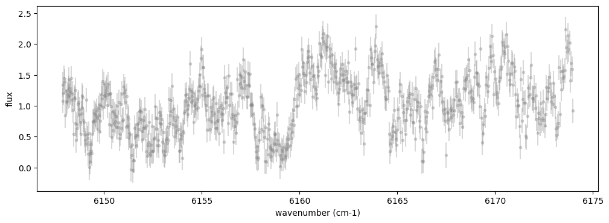
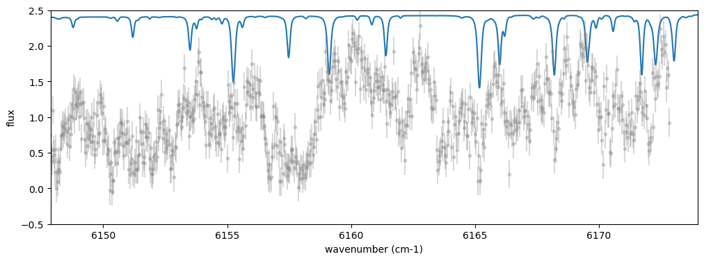
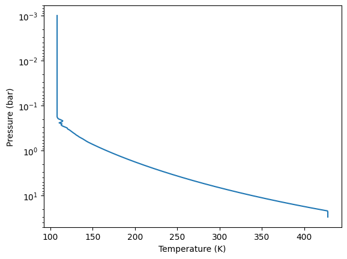
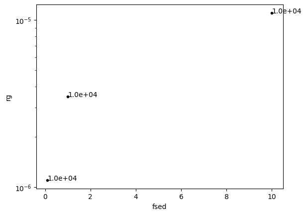
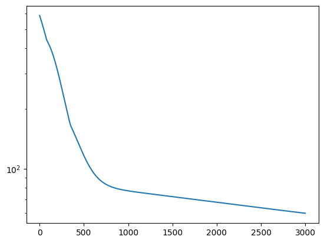
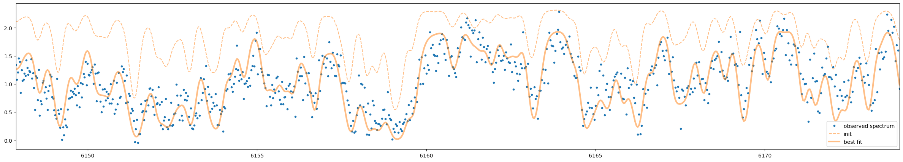
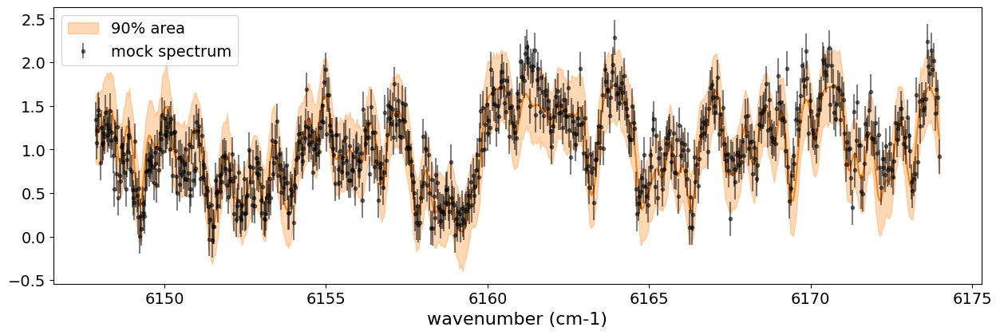
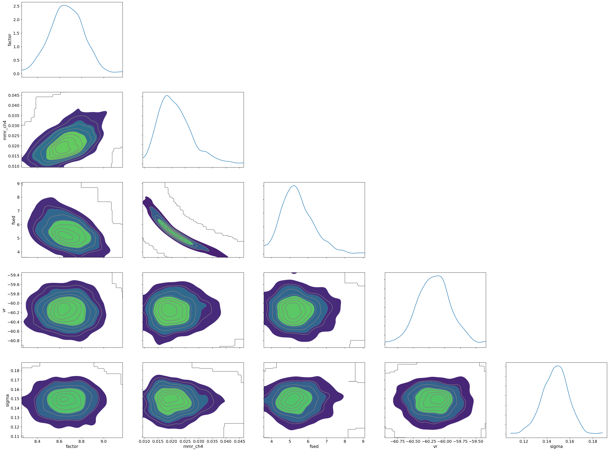

Getting Started with Reflection Spectroscopy
============================================

Hajime Kawahara 3/19 (2025)

In this tutorial, we analyze the high-resolution near-infrared
reflection spectrum of Jupiter. This is a simplified version of the
analysis performed in
`exojaxample_jupiter <https://github.com/HajimeKawahara/exojaxample_jupiter>`__.

In this *Getting Started* guide, we include a cloud model for reflected
light calculations, making it more detailed than other *Getting Started*
guides. It may be helpful to first read about `the Ackerman & Marley
cloud model <Ackerman_and_Marley_cloud_model.html>`__.

The spectrum to be analyzed is as follows. The absorption lines observed
in the spectrum are primarily due to methane. While a comprehensive line
database for methane in the visible range is still lacking (see
`here <https://secondearths.sakura.ne.jp/exojax/tutorials/jupiters/Jupiter_Hires_Modeling.html>`__),
the near-infrared range allows for a reasonable explanation of the
observed data. Additionally, since this is a reflection spectrum, the
original solar spectrum must also be taken into account.

.. code:: ipython3

    from jax import config
    
    config.update("jax_enable_x64", True)

.. code:: ipython3

    from exojax.test.emulate_spec import sample_reflection_spectrum
    import matplotlib.pyplot as plt
    
    nu_obs, flux, err_flux = sample_reflection_spectrum()
    
    fig = plt.figure(figsize=(12,4))
    plt.errorbar(nu_obs,flux,yerr=err_flux,fmt=".",color="gray", alpha=0.3)
    plt.xlabel("wavenumber (cm-1)")
    plt.ylabel("flux")
    plt.show()

I found very good one: High-resolution solar spectrum taken from Meftar
et al. (2023). Get the data.

-  10.21413/SOLAR-HRS-DATASET.V1.1_LATMOS
-  http://doi.latmos.ipsl.fr/DOI_SOLAR_HRS.v1.1.html
-  http://bdap.ipsl.fr/voscat_en/solarspectra.html

.. code:: ipython3

    from exojax.utils.grids import wav2nu
    import pandas as pd
    filename = "/home/kawahara/solar-hrs/Spectre_HR_LATMOS_Meftah_V1.txt"
    dat = pd.read_csv(filename, names=("wav","flux"), comment=";", delimiter="\t")
    dat["wav"] = dat["wav"]*10
    
    wav_solar = dat["wav"][::-1]
    solspec = dat["flux"][::-1]
    nus_solar = wav2nu(wav_solar,unit="AA")

.. code:: ipython3

    from exojax.utils.constants import c
    vrv = -55 #km/s
    fig = plt.figure(figsize=(12,4))
    plt.plot(nus_solar,solspec*10)
    plt.errorbar(nu_obs*(1 + vrv/c),flux,yerr=err_flux,fmt=".",color="gray", alpha=0.3)
    plt.xlim(nu_obs[0],nu_obs[-1])
    plt.ylim(-0.5,2.5)
    plt.xlabel("wavenumber (cm-1)")
    plt.ylabel("flux")
    plt.show()

Now, we will use ``ArtReflectPure`` for the radiative transfer of
reflected light.

.. code:: ipython3

    import numpy as np
    from exojax.utils.grids import wavenumber_grid
    from exojax.rt.atmrt import ArtReflectPure
    
    nus, wav, res = wavenumber_grid(
        np.min(nu_obs) - 5.0, np.max(nu_obs) + 5.0, 10000, xsmode="premodit", unit="cm-1"
    )
    
    art = ArtReflectPure(
            nu_grid=nus, pressure_btm=3.0e1, pressure_top=1.0e-3, nlayer=200
        )

.. parsed-literal::

    xsmode =  premodit
    xsmode assumes ESLOG in wavenumber space: xsmode=premodit
    Your wavelength grid is in ***  descending  *** order
    The wavenumber grid is in ascending order by definition.
    Please be careful when you use the wavelength grid.

.. parsed-literal::

    /home/kawahara/exojax/src/exojax/spec/dtau_mmwl.py:13: FutureWarning: dtau_mmwl might be removed in future.
      warnings.warn("dtau_mmwl might be removed in future.", FutureWarning)

Now, let’s use the temperature-pressure (T-P) profile of Jupiter
obtained by the Galileo probe. Please install
`jovispec <https://github.com/HajimeKawahara/jovispec>`__.

.. code:: ipython3

    from jovispec.tpio import read_tpprofile_jupiter
    dat = read_tpprofile_jupiter()
    torig = dat["Temperature (K)"]
    porig = dat["Pressure (bar)"]

Let’s interpolate the temperature grid to match the pressure grid of
``art``. For simplicity, we will assume an isothermal atmosphere in the
upper layers.

.. code:: ipython3

    Tarr_np = np.interp(art.pressure, porig, torig)
    i = np.argmin(Tarr_np)
    Tarr_np[0:i] = Tarr_np[i]
    
    # acutually, this just convert Tarr_np to jnp.array
    Tarr = art.custom_temperature(Tarr_np)

.. code:: ipython3

    plt.plot(Tarr,art.pressure)
    plt.yscale("log")
    plt.gca().invert_yaxis()
    plt.xlabel("Temperature (K)")
    plt.ylabel("Pressure (bar)")
    plt.show()

Set the mean molecular weight and gravity.

.. code:: ipython3

    from exojax.utils.astrofunc import gravity_jupiter
    mu = 2.22  # mean molecular weight NASA Jupiter fact sheet
    gravity = gravity_jupiter(1.0, 1.0)

In Jupiter’s atmosphere, the primary reflectors of sunlight are ammonia
clouds. Therefore, we retrieve ammonia from the ``PdbCloud`` database.
As the cloud model, we use the `Ackerman & Marley (AM)-like
model <Ackerman_and_Marley_cloud_model.html>`__, which can be accessed
via ``AmpAmcloud`` from ``atmphys``.

Whether a simple gray cloud model would suffice is worth considering.
Using an overly complex model for the data can obscure the assumptions
being made. However, since the cloud composition and the T-P profile of
Jupiter are well understood, using an AM model should not be excessive.

.. code:: ipython3

    from exojax.database.pardb  import PdbCloud
    from exojax.atm.atmphys import AmpAmcloud
    
    
    pdb_nh3 = PdbCloud("NH3")
    amp_nh3 = AmpAmcloud(pdb_nh3, bkgatm="H2")
    amp_nh3.check_temperature_range(Tarr)

.. parsed-literal::

    .database/particulates/virga/virga.zip  exists. Remove it if you wanna re-download and unzip.
    Refractive index file found:  .database/particulates/virga/NH3.refrind
    Miegrid file exists: .database/particulates/virga/miegrid_lognorm_NH3.mg.npz

.. parsed-literal::

    /home/kawahara/exojax/src/exojax/atm/atmphys.py:54: UserWarning: min temperature 107.99141615972869 K is smaller than min(vfactor t range) 179.10000000000002 K
      warnings.warn(

We calculate the condensate substance density of cloud particles. Based
on Jupiter’s observations, we assume an ammonia abundance three times
the solar composition. Finally, we define the mass mixing ratio of
ammonia at the cloud base.

.. code:: ipython3

    from exojax.utils.zsol import nsol
    from exojax.atm.atmconvert import vmr_to_mmr
    from exojax.database.molinfo  import molmass_isotope
    
    # condensate substance density
    rhoc = pdb_nh3.condensate_substance_density  # g/cc
    n = nsol("AG89")
    abundance_nh3 = 3.0 * n["N"]  # x 3 solar abundance
    molmass_nh3 = molmass_isotope("NH3", db_HIT=False)
    MMRbase_nh3 = vmr_to_mmr(abundance_nh3, molmass_nh3, mu)

.. parsed-literal::

    Database for solar abundance =  AG89
    Anders E. & Grevesse N. (1989, Geochimica et Cosmochimica Acta 53, 197) (Photospheric, using Table 2)

In the AM model, parameters are currently made differentiable by
creating a grid dataset called ``miegrid`` and interpolating it. The
parameters of ``miegrid`` are ``sigmag`` and ``rg`` in the AM model;
however, in this example, we fix ``sigmag`` and create a grid only for
``rg``. How should we determine the grid range for ``rg``? Let’s convert
the expected range of ``fsed`` (here 0.1 - 10) to ``rg`` and use that to
define the grid range.

.. code:: ipython3

    fsed_range = [0.1, 10.0]
    Kzz_fixed = 1.0e4
    sigmag_fixed = 2.0
    vrv_fixed = 0.0
    N_fsed = 3
    
    fsed_grid = np.logspace(np.log10(fsed_range[0]), np.log10(fsed_range[1]), N_fsed)
    
    rg_val = []
    for fsed in fsed_grid:
        rg_layer, MMRc = amp_nh3.calc_ammodel(
            art.pressure, Tarr, mu, molmass_nh3, gravity, fsed, sigmag_fixed, Kzz_fixed, MMRbase_nh3
        )
        rg_val.append(np.nanmean(rg_layer))
        plt.plot(fsed, np.nanmean(rg_layer), ".", color="black")
        plt.text(fsed, np.nanmean(rg_layer), f"{Kzz_fixed:.1e}")
    rg_val = np.array(rg_val)
    plt.yscale("log")
    plt.xlabel("fsed")
    plt.ylabel("rg")
    plt.show()

Through the above procedure, we found that ``rg`` should be gridded over
approximately one order of magnitude, ranging from (10^{-5}) to
(10^{-6}). The ``miegrid`` can be generated using ``generate_miegrid``
from ``pdb``. Once generated, it does not need to be regenerated for
future use.

This ``miegrid`` uses
`PyMieScatt <https://github.com/bsumlin/PyMieScatt>`__ as the backend.
If you installed it via pip, you might encounter an error with
``scipy.integrate.trapz``. In that case, clone the repository from
GitHub and install it using ``python setup.py install``.

https://github.com/bsumlin/PyMieScatt

.. code:: ipython3

    rg_range = [np.min(rg_val), np.max(rg_val)]
    N_rg = 10
    print("rg range=",rg_range)
        
    pdb_nh3.generate_miegrid(
            sigmagmin=sigmag_fixed,
            sigmagmax=sigmag_fixed,
            Nsigmag=1,
            log_rg_min=np.log10(rg_range[0]),
            log_rg_max=np.log10(rg_range[1]),
            Nrg=N_rg,
    )

.. parsed-literal::

    rg range= [1.1033197077960357e-06, 1.103319707796036e-05]
    sigmag arr =  [2.]

.. parsed-literal::

    100%|██████████| 10/10 [09:10<00:00, 55.05s/it]
    100%|██████████| 1/1 [09:10<00:00, 550.53s/it]

.. parsed-literal::

    miegrid_lognorm_NH3.mg  was generated.

.. parsed-literal::

    

If you have already generated *miegrid*, you can load it using
``load_miegrid``.

.. code:: ipython3

    pdb_nh3.load_miegrid()

.. parsed-literal::

    pdb.miegrid, pdb.rg_arr, pdb.sigmag_arr are now available. The Mie scattering computation is ready.

We assume that cloud scattering follows Mie scattering. The ``opa`` for
Mie scattering is ``OpaMie``.

.. code:: ipython3

    from exojax.opacity.opacont import OpaMie
    
    opa_nh3 = OpaMie(pdb_nh3, nus)

.. code:: ipython3

    from exojax.database.api  import MdbHitemp
    mdb_reduced = MdbHitemp("CH4", nurange=[nus[0], nus[-1]], isotope=1, elower_max=3300.0)

.. parsed-literal::

    radis engine =  pytables
    Login successful.
    Starting download from https://hitran.org/files/HITEMP/bzip2format/06_HITEMP2020.par.bz2 to 06_HITEMP2020.par.bz2
    Total size to download: 445562914 bytes

.. parsed-literal::

    06_HITEMP2020.par.bz2: 100%|██████████| 446M/446M [00:59<00:00, 7.49MB/s] 

.. parsed-literal::

    
    Download complete!

.. code:: ipython3

    import jax.numpy as jnp
    from exojax.opacity.opacalc import OpaPremodit
    
    opa = OpaPremodit(mdb_reduced, nu_grid=nus, allow_32bit=True, auto_trange=[80.0, 300.0])  
    
    ## Spectrum Model
    nusjax = jnp.array(nus)
    nusjax_solar = jnp.array(nus_solar)
    solspecjax = jnp.array(solspec)

.. parsed-literal::

    OpaPremodit: params automatically set.
    default elower grid trange (degt) file version: 2
    Robust range: 79.45501192821337 - 740.1245313998245 K
    OpaPremodit: Tref_broadening is set to  154.91933384829665 K
    OpaPremodit: gamma_air and n_air are used. gamma_ref = gamma_air/Patm
    # of reference width grid :  7
    # of temperature exponent grid : 4
    max value of  ngamma_ref_grid : 31.65553199866716
    min value of  ngamma_ref_grid : 13.8937057424919
    ngamma_ref_grid grid : [13.89370441 15.93761568 18.28220622 20.97171063 24.05686937 27.59588734
     31.65553474]
    max value of  n_Texp_grid : 1.13
    min value of  n_Texp_grid : 0.57
    n_Texp_grid grid : [0.56999993 0.75666667 0.94333333 1.13000011]

.. parsed-literal::

    uniqidx: 100%|██████████| 8/8 [00:00<00:00, 1644.10it/s]

.. parsed-literal::

    Premodit: Twt= 328.42341041740974 K Tref= 91.89455622053987 K
    Making LSD:|####################| 100%

.. parsed-literal::

    

.. parsed-literal::

    cross section (xsvector/xsmatrix) is calculated in the closed mode. The aliasing part cannnot be used.
    wing cut width =  [35.893247577590955, 36.31638492791535] cm-1

Encapsulate the methane opacity calculation into a function.

.. code:: ipython3

    molmass_ch4 = molmass_isotope("CH4", db_HIT=False)
    
    def methane_opacity(const_mmr_ch4):
        mmr_ch4 = art.constant_mmr_profile(const_mmr_ch4)
        xsmatrix = opa.xsmatrix(Tarr, art.pressure)
        dtau_ch4 = art.opacity_profile_xs(xsmatrix, mmr_ch4, molmass_ch4, gravity)
        return dtau_ch4

Oh, I almost forgot—this data was obtained from a test observation of
Jupiter using a 20 cm telescope before installing the IRD spectrograph
on the Subaru Telescope. For details, ask Takayuki Kotani. A spectral
resolution of around 25,000 seems appropriate.

.. code:: ipython3

    from exojax.postproc.specop import SopInstProfile
    
    # asymmetric_parameter = asymmetric_factor + np.zeros((len(art.pressure), len(nus)))
    reflectivity_surface = np.zeros(len(nus))
    sop = SopInstProfile(nus)
    
    broadening = 25000.0

Since we want to normalize the data for optimization, we encapsulate the
related operations into a function. This is not necessary if using only
HMC.

.. code:: ipython3

    def unpack_params(params):
            multiple_factor = jnp.array([1.0, 1.0, 1.0, 1.0, 1.0, 10000.0, 0.01, 1.0])
            par = params * multiple_factor
            log_fsed = par[0]
            sigmag = par[1]
            log_Kzz = par[2]
            vrv = par[3]
            vv = par[4]
            _broadening = par[5]
            const_mmr_ch4 = par[6]
            factor = par[7]
            fsed = 10**log_fsed
            Kzz = 10**log_Kzz
    
            return fsed, sigmag, Kzz, vrv, vv, _broadening, const_mmr_ch4, factor
    

Next, we define the long-awaited atmospheric model. The key point here
is that ``rg`` does not vary significantly across atmospheric layers, so
we use the average as the representative value.

We calculate *the Three Sacred Treasures* in `the two-stream
approximation for radiative transfer of reflected and scattered
light <../userguide/rtransfer_fbased.html>`__: opacity, single
scattering albedo, and the asymmetry parameter.

.. code:: ipython3

    
    def atmospheric_model(params):
            # unused parameters are marked with _
            fsed, _sigmag, _Kzz, _vrv, vv, _broadening, const_mmr_ch4, factor = (
                unpack_params(params)
            )
    
            broadening = 25000.0
            rg_layer, MMRc = amp_nh3.calc_ammodel(
                art.pressure,
                Tarr,
                mu,
                molmass_nh3,
                gravity,
                fsed,
                sigmag_fixed,
                Kzz_fixed,
                MMRbase_nh3,
            )
            rg = jnp.mean(rg_layer)
    
            sigma_extinction, sigma_scattering, asymmetric_factor = (
                opa_nh3.mieparams_vector(rg, sigmag_fixed)
            )
            dtau_cld = art.opacity_profile_cloud_lognormal(
                sigma_extinction, rhoc, MMRc, rg, sigmag_fixed, gravity
            )
            dtau_cld_scat = art.opacity_profile_cloud_lognormal(
                sigma_scattering, rhoc, MMRc, rg, sigmag_fixed, gravity
            )
    
            asymmetric_parameter = asymmetric_factor + np.zeros(
                (len(art.pressure), len(nus))
            )
    
            dtau_ch4 = methane_opacity(const_mmr_ch4)
            single_scattering_albedo = (dtau_cld_scat) / (dtau_cld + dtau_ch4)
            dtau = dtau_cld + dtau_ch4
            return (
                vv,
                factor,
                broadening,
                asymmetric_parameter,
                single_scattering_albedo,
                dtau,
            )

Next, we define the spectral model. Since the atmospheric model has been
defined separately, this definition remains concise.

.. code:: ipython3

    from exojax.utils.instfunc import resolution_to_gaussian_std
    
    def spectral_model(params):
        vv, factor, broadening, asymmetric_parameter, single_scattering_albedo, dtau = (
            atmospheric_model(params)
        )
        # velocity
        vpercp = (vrv_fixed + vv) / c
        incoming_flux = jnp.interp(nusjax, nusjax_solar * (1.0 + vpercp), solspecjax)
    
        Fr = art.run(
            dtau,
            single_scattering_albedo,
            asymmetric_parameter,
            reflectivity_surface,
            incoming_flux,
        )
    
        std = resolution_to_gaussian_std(broadening)
        Fr_inst = sop.ipgauss(Fr, std)
        Fr_samp = sop.sampling(Fr_inst, vv, nu_obs)
        return factor * Fr_samp

Optimization
------------

This model works with reverse-mode differentiation, but to accommodate
the use of *Opart* for reducing device memory, we implement optimization
in forward-mode as well. Yes, *Opart* can also be used for reflected
light calculations, using
`OpartReflectPure <../exojax/exojax.spec.html#exojax.spec.opart.OpartReflectPure>`__.

.. code:: ipython3

    from jax import jacfwd
    import jax.numpy as jnp
    
    
    def cost_function(params):
        return jnp.sum((flux - spectral_model(params)) ** 2)
    
    
    def dfluxt_jacfwd(params):
        return jacfwd(cost_function)(params)
    
    
    parinit = jnp.array(
        [jnp.log10(3.0), sigmag_fixed, jnp.log10(Kzz_fixed), -5.0, -55.0, 2.5, 1.0, 11.0]
    )

.. code:: ipython3

    
    import optax
    import tqdm
    
    solver = optax.adamw(learning_rate=1.e-3)
    
    params = np.copy(parinit)
    state = solver.init(params)
    val = []
    loss = []
    for _ in tqdm.tqdm(range(3000)):
        grad = dfluxt_jacfwd(params)
        updates, state = solver.update(grad, state, params)
        params = optax.apply_updates(params, updates)
        val.append(params)
        loss.append(cost_function(params))
    val = np.array(val)
    loss = np.array(loss)
    

.. parsed-literal::

    100%|██████████| 3000/3000 [14:00<00:00,  3.57it/s]

Nice L-curve!

.. code:: ipython3

    
    fig = plt.figure()
    ax = fig.add_subplot(111)
    plt.plot(loss)
    plt.yscale("log")
    plt.show()
    
    # res.params
    print("fsed, sigmag, Kzz, vrv, vr, _broadening, const_mmr_ch4, factor")
    print("init:", unpack_params(parinit))
    print("best:", unpack_params(params))
    
    print("fsed, sigmag, Kzz, vrv, vr, _broadening, const_mmr_ch4, factor")
    print("best (packed):", params)
    
    F_samp = spectral_model(params)
    F_samp_init = spectral_model(parinit)

.. parsed-literal::

    fsed, sigmag, Kzz, vrv, vr, _broadening, const_mmr_ch4, factor
    init: (Array(3., dtype=float64), Array(2., dtype=float64), Array(10000., dtype=float64), Array(-5., dtype=float64), Array(-55., dtype=float64), Array(25000., dtype=float64), Array(0.01, dtype=float64), Array(11., dtype=float64))
    best: (Array(8.53499414, dtype=float64), Array(1.99940009, dtype=float64), Array(9972.41124884, dtype=float64), Array(-4.99850022, dtype=float64), Array(-57.69619346, dtype=float64), Array(24992.50112451, dtype=float64), Array(0.01545952, dtype=float64), Array(9.98806778, dtype=float64))
    fsed, sigmag, Kzz, vrv, vr, _broadening, const_mmr_ch4, factor
    best (packed): [  0.93120323   1.99940009   3.99880018  -4.99850022 -57.69619346
       2.49925011   1.54595203   9.98806778]

The optimization seems to be working well.

.. code:: ipython3

    
    F_samp = spectral_model(params)
    F_samp_init = spectral_model(parinit)
    fig = plt.figure(figsize=(30, 5))
    ax = fig.add_subplot(111)
    plt.plot(nu_obs, flux, ".", label="observed spectrum")
    plt.plot(nu_obs, F_samp_init, alpha=0.5, label="init", color="C1", ls="dashed")
    plt.plot(nu_obs, F_samp, alpha=0.5, label="best fit", color="C1", lw=3)
    plt.legend()
    plt.xlim(np.min(nu_obs), np.max(nu_obs))
    plt.show()

.. code:: ipython3

    unpack_params(params) #fsed, _sigmag, _Kzz, _vrv, vv, _broadening, const_mmr_ch4, factor 
    params

.. parsed-literal::

    Array([  0.93120323,   1.99940009,   3.99880018,  -4.99850022,
           -57.69619346,   2.49925011,   1.54595203,   9.98806778],      dtype=float64)

HMC-NUTS retrieval
------------------

HMC-NUTS can be run in the same way as before. Here, I’ll take a
shortcut (I need to head to work soon!) and run it with only five
parameters.

.. code:: ipython3

    import numpyro
    import numpyro.distributions as dist
    
    def model_c(y1, y1err):
        log_fsed_n = numpyro.sample("log_fsed_n", dist.Uniform(0.0, 2.0))
        numpyro.deterministic("fsed", 10**log_fsed_n)
        vr = numpyro.sample("vr", dist.Uniform(-70.0, -50.0))
        log_molmass_ch4_n = numpyro.sample("log_MMR_CH4", dist.Uniform(-1, 1))
        molmass_ch4_n = 10**log_molmass_ch4_n
        numpyro.deterministic("mmr_ch4", molmass_ch4_n * 0.01)
        factor = numpyro.sample("factor", dist.Uniform(5.0, 15.0))
    
    
        params = jnp.array([  log_fsed_n,   2.0,   4.0,  -5.0, vr,   2.5,   molmass_ch4_n,   factor])
    
        mean = spectral_model(params)
        sigma = numpyro.sample("sigma", dist.Exponential(1.0))
        err_all = jnp.sqrt(y1err**2. + sigma**2.)
        numpyro.sample("y1", dist.Normal(mean, err_all), obs=y1)
    

.. code:: ipython3

    from numpyro.infer import MCMC, NUTS
    from jax import random
    
    rng_key = random.PRNGKey(0)
    rng_key, rng_key_ = random.split(rng_key)
    num_warmup, num_samples = 500, 1000
    kernel = NUTS(model_c) #put forward_differentiation = True when you use OpartReflectPure
    mcmc = MCMC(kernel, num_warmup=num_warmup, num_samples=num_samples)
    mcmc.run(rng_key_, y1=flux, y1err=err_flux)
    mcmc.print_summary()

.. parsed-literal::

    sample: 100%|██████████| 1500/1500 [41:00<00:00,  1.64s/it, 31 steps of size 8.39e-02. acc. prob=0.93]  

.. parsed-literal::

    
                       mean       std    median      5.0%     95.0%     n_eff     r_hat
           factor      8.67      0.15      8.67      8.43      8.92    382.42      1.01
      log_MMR_CH4      0.31      0.12      0.31      0.11      0.51    272.91      1.00
       log_fsed_n      0.73      0.07      0.73      0.63      0.85    309.07      1.00
            sigma      0.15      0.01      0.15      0.13      0.17    550.99      1.00
               vr    -60.17      0.26    -60.17    -60.55    -59.70    868.34      1.00
    
    Number of divergences: 0

.. parsed-literal::

    

.. code:: ipython3

    from numpyro.diagnostics import hpdi
    from numpyro.infer import Predictive
    
    posterior_sample = mcmc.get_samples()
    pred = Predictive(model_c, posterior_sample, return_sites=['y1'])
    predictions = pred(rng_key_, y1=None, y1err=err_flux)
    median_mu1 = jnp.median(predictions['y1'], axis=0)
    hpdi_mu1 = hpdi(predictions['y1'], 0.9)

.. code:: ipython3

    fig, ax = plt.subplots(nrows=1, ncols=1, figsize=(15, 4.5))
    ax.plot(nu_obs, median_mu1, color='C1')
    ax.fill_between(nu_obs,
                    hpdi_mu1[0],
                    hpdi_mu1[1],
                    alpha=0.3,
                    interpolate=True,
                    color='C1',
                    label='90% area')
    ax.errorbar(nu_obs, flux, err_flux, fmt=".", label="mock spectrum", color="black",alpha=0.5)
    plt.xlabel('wavenumber (cm-1)', fontsize=16)
    plt.legend(fontsize=14)
    plt.tick_params(labelsize=14)
    plt.show()

.. code:: ipython3

    import arviz
    pararr = ['factor', 'mmr_ch4', 'fsed', 'vr', 'sigma']
    arviz.plot_pair(arviz.from_numpyro(mcmc),
                    var_names=pararr,
                    kind='kde',
                    divergences=False,
                    marginals=True)
    plt.show()

That’s it!
