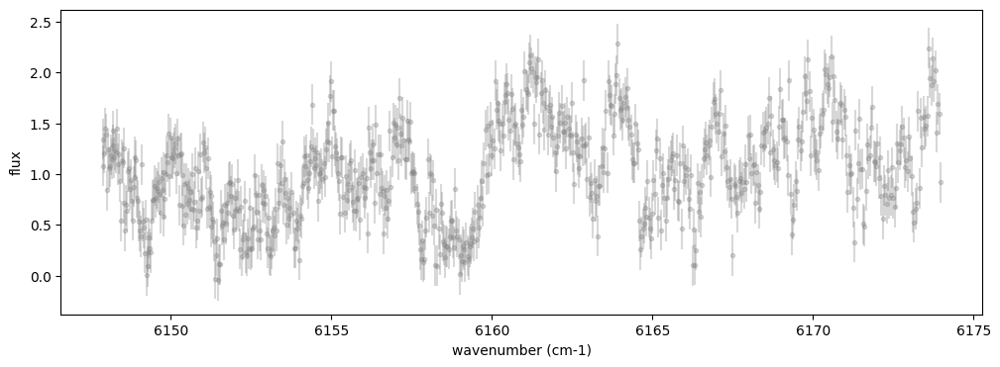
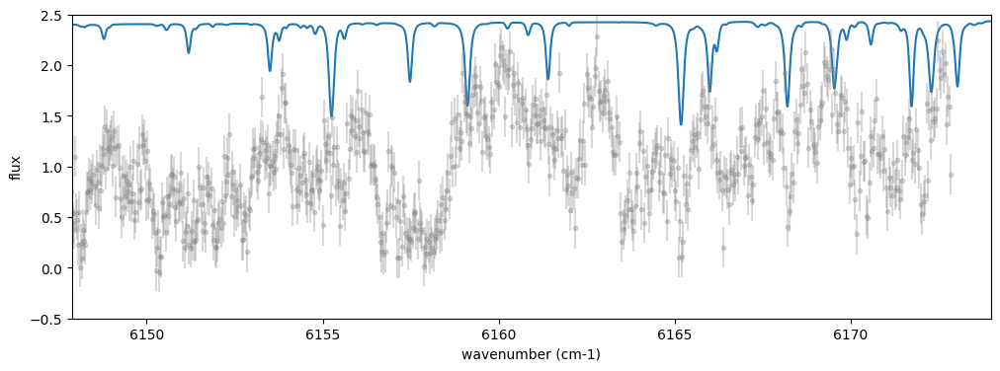
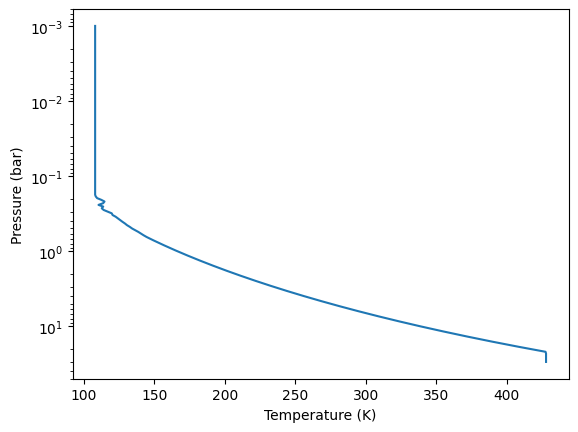
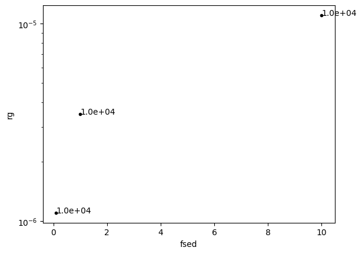
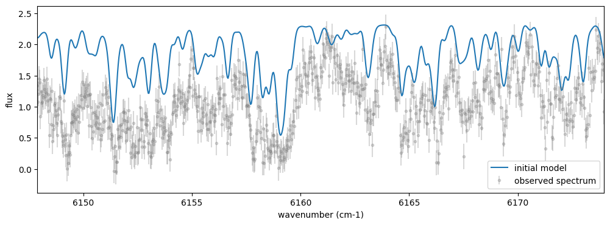

Getting Started with Reflection Spectroscopy
============================================

Last update: October 2026, Hajime Kawahara, for ExoJAX 2.6.0

This guide models a high-resolution near-infrared reflection spectrum of
Jupiter. It is a simplified version of the analysis in
`exojaxample_jupiter <https://github.com/HajimeKawahara/exojaxample_jupiter>`__.

Reflection spectroscopy requires additional ingredients compared with
the emission and transmission getting-started guides, especially a cloud
model and an incident stellar or solar spectrum. If you are new to the
cloud model used here, see the `Ackerman and Marley cloud
model <Ackerman_and_Marley_cloud_model.html>`__ first.

The observed spectrum is dominated by methane absorption. In this
near-infrared wavelength range, available methane data are sufficient
for this demonstration. Because this is a reflection spectrum, the
incident solar spectrum must also be included.

.. code:: ipython3

    from jax import config

    config.update("jax_enable_x64", True)

.. code:: ipython3

    from exojax.test.emulate_spec import sample_reflection_spectrum
    import matplotlib.pyplot as plt

    nu_obs, flux, err_flux = sample_reflection_spectrum()

    fig = plt.figure(figsize=(12,4))
    plt.errorbar(nu_obs,flux,yerr=err_flux,fmt=".",color="gray", alpha=0.3)
    plt.xlabel("wavenumber (cm-1)")
    plt.ylabel("flux")
    plt.show()

This example uses the high-resolution solar spectrum from Meftah et
al. (2023):

-  10.21413/SOLAR-HRS-DATASET.V1.1_LATMOS
-  http://doi.latmos.ipsl.fr/DOI_SOLAR_HRS.v1.1.html
-  http://bdap.ipsl.fr/voscat_en/solarspectra.html

The cell below downloads the public SOLAR-HRS file (about 67 MB) once.
Set ``EXOJAX_SOLAR_SPECTRUM`` to reuse a local copy.

.. code:: ipython3

    import os
    from pathlib import Path
    from urllib.request import urlretrieve

    from exojax.utils.grids import wav2nu
    import pandas as pd

    filename = Path(os.environ.get(
        "EXOJAX_SOLAR_SPECTRUM", ".database/Spectre_HR_LATMOS_Meftah_V1.txt"
    ))
    if not filename.exists():
        filename.parent.mkdir(parents=True, exist_ok=True)
        urlretrieve(
            "https://vizier.cfa.harvard.edu/ftp/cats/vi/159/sp/Spectre_HR_LATMOS_Meftah_V1.txt",
            filename,
        )
    dat = pd.read_csv(filename, names=("wav", "flux"), comment=";", sep=r"\s+")
    dat["wav"] = dat["wav"] * 10  # nm to Angstrom

    wav_solar = dat["wav"][::-1]
    solspec = dat["flux"][::-1]
    nus_solar = wav2nu(wav_solar, unit="AA")

.. code:: ipython3

    from exojax.utils.constants import c
    vrv = -55 #km/s
    fig = plt.figure(figsize=(12,4))
    plt.plot(nus_solar,solspec*10)
    plt.errorbar(nu_obs*(1 + vrv/c),flux,yerr=err_flux,fmt=".",color="gray", alpha=0.3)
    plt.xlim(nu_obs[0],nu_obs[-1])
    plt.ylim(-0.5,2.5)
    plt.xlabel("wavenumber (cm-1)")
    plt.ylabel("flux")
    plt.show()

Use ``ArtReflectPure`` for reflected-light radiative transfer.

.. code:: ipython3

    import numpy as np
    from exojax.utils.grids import wavenumber_grid
    from exojax.rt import ArtReflectPure

    nus, wav, res = wavenumber_grid(
        np.min(nu_obs) - 5.0, np.max(nu_obs) + 5.0, 10000, xsmode="premodit", unit="cm-1"
    )

    art = ArtReflectPure(
            nu_grid=nus, pressure_btm=3.0e1, pressure_top=1.0e-3, nlayer=200
        )

.. parsed-literal::

    xsmode =  premodit
    xsmode assumes ESLOG in wavenumber space: xsmode=premodit
    Your wavelength grid is in ***  descending  *** order
    The wavenumber grid is in ascending order by definition.
    Please be careful when you use the wavelength grid.

Use the Jupiter temperature-pressure profile measured by the Galileo
probe. This section requires
`jovispec <https://github.com/HajimeKawahara/jovispec>`__.

.. code:: ipython3

    from jovispec.tpio import read_tpprofile_jupiter
    dat = read_tpprofile_jupiter()
    torig = dat["Temperature (K)"]
    porig = dat["Pressure (bar)"]

Interpolate the temperature grid onto the pressure grid used by ``art``.
For simplicity, assume an isothermal atmosphere in the upper layers.

.. code:: ipython3

    Tarr_np = np.interp(art.pressure, porig, torig)
    i = np.argmin(Tarr_np)
    Tarr_np[0:i] = Tarr_np[i]

    # acutually, this just convert Tarr_np to jnp.array
    Tarr = art.custom_temperature(Tarr_np)

.. code:: ipython3

    plt.plot(Tarr,art.pressure)
    plt.yscale("log")
    plt.gca().invert_yaxis()
    plt.xlabel("Temperature (K)")
    plt.ylabel("Pressure (bar)")
    plt.show()

Set the mean molecular weight and gravity.

.. code:: ipython3

    from exojax.utils.astrofunc import gravity_jupiter
    mu = 2.22  # mean molecular weight NASA Jupiter fact sheet
    gravity = gravity_jupiter(1.0, 1.0)

In Jupiter’s atmosphere, ammonia clouds are major reflectors of
sunlight. We retrieve ammonia from the ``PdbCloud`` database and use an
`Ackerman and Marley-like
model <Ackerman_and_Marley_cloud_model.html>`__ through ``AmpAmcloud``
from ``atmphys``.

A simpler gray cloud model may be sufficient for some data. The more
detailed model used here is useful for demonstrating how composition and
particle-size assumptions enter the reflection spectrum.

.. code:: ipython3

    from exojax.database.pardb  import PdbCloud
    from exojax.atm.atmphys import AmpAmcloud

    pdb_nh3 = PdbCloud("NH3")
    amp_nh3 = AmpAmcloud(pdb_nh3, bkgatm="H2")
    amp_nh3.check_temperature_range(Tarr)

.. parsed-literal::

    .database/particulates/virga/virga.zip  exists. Remove it if you wanna re-download and unzip.
    Refractive index file found:  .database/particulates/virga/NH3.refrind
    Miegrid file exists: .database/particulates/virga/miegrid_lognorm_NH3.mg.npz

.. parsed-literal::

    /home/kawahara/exojax/src/exojax/atm/atmphys.py:55: UserWarning: min temperature 107.99141615972869 K is smaller than min(vfactor t range) 179.10000000000002 K
      warnings.warn(

We calculate the condensate substance density of cloud particles. Based
on Jupiter’s observations, we assume an ammonia abundance three times
the solar composition. Finally, we define the mass mixing ratio of
ammonia at the cloud base.

.. code:: ipython3

    from exojax.utils.zsol import nsol
    from exojax.atm.atmconvert import vmr_to_mmr
    from exojax.database.molinfo  import molmass_isotope

    # condensate substance density
    rhoc = pdb_nh3.condensate_substance_density  # g/cc
    n = nsol("AG89")
    abundance_nh3 = 3.0 * n["N"]  # x 3 solar abundance
    molmass_nh3 = molmass_isotope("NH3", db_HIT=False)
    MMRbase_nh3 = vmr_to_mmr(abundance_nh3, molmass_nh3, mu)

.. parsed-literal::

    Database for solar abundance =  AG89
    Anders E. & Grevesse N. (1989, Geochimica et Cosmochimica Acta 53, 197) (Photospheric, using Table 2)

In the AM model, differentiability is achieved by precomputing a grid
dataset called ``miegrid`` and interpolating within it. The AM model
parameters are ``sigmag`` and ``rg``; in this example, we fix ``sigmag``
and construct a grid only for ``rg``. To choose the grid range, convert
the expected ``fsed`` range, here 0.1-100, into ``rg``. This covers the
retrieval prior ``fsed = 1-100``.

.. code:: ipython3

    fsed_range = [0.1, 100.0]
    Kzz_fixed = 1.0e4
    sigmag_fixed = 2.0
    vrv_fixed = 0.0
    N_fsed = 3

    fsed_grid = np.logspace(np.log10(fsed_range[0]), np.log10(fsed_range[1]), N_fsed)

    rg_val = []
    for fsed in fsed_grid:
        rg_layer, MMRc = amp_nh3.calc_ammodel(
            art.pressure, Tarr, mu, molmass_nh3, gravity, fsed, sigmag_fixed, Kzz_fixed, MMRbase_nh3
        )
        rg_val.append(np.nanmean(rg_layer))
        plt.plot(fsed, np.nanmean(rg_layer), ".", color="black")
        plt.text(fsed, np.nanmean(rg_layer), f"{Kzz_fixed:.1e}")
    rg_val = np.array(rg_val)
    plt.yscale("log")
    plt.xlabel("fsed")
    plt.ylabel("rg")
    plt.show()

This gives an ``rg`` grid spanning approximately 1.1e-6 to 3.5e-5 cm.
The ``miegrid`` can be generated with ``generate_miegrid`` from ``pdb``
and reused after it has been created.

This ``miegrid`` uses `miepython <https://miepython.readthedocs.io/>`__
for single-particle scattering and ExoJAX for integration over the
lognormal size distribution.

For large grids, enable miepython’s Numba acceleration before the first
import of miepython, for example by starting Jupyter with
``MIEPYTHON_USE_JIT=1 jupyter lab``.

.. code:: ipython3

    rg_range = [np.min(rg_val), np.max(rg_val)]
    N_rg = 16
    print("rg range=",rg_range)

    pdb_nh3.generate_miegrid(
            sigmagmin=sigmag_fixed,
            sigmagmax=sigmag_fixed,
            Nsigmag=1,
            log_rg_min=np.log10(rg_range[0]),
            log_rg_max=np.log10(rg_range[1]),
            Nrg=N_rg,
    )

.. parsed-literal::

    rg range= [np.float64(1.1036325377533624e-06), np.float64(3.4899925191723945e-05)]
    sigmag arr =  [2.]

.. parsed-literal::

      0%|          | 0/1 [00:00<?, ?it/s]

      0%|          | 0/16 [00:00<?, ?it/s]

      6%|▋         | 1/16 [00:02<00:31,  2.13s/it]

     12%|█▎        | 2/16 [00:02<00:17,  1.23s/it]

     19%|█▉        | 3/16 [00:03<00:12,  1.06it/s]

     25%|██▌       | 4/16 [00:03<00:09,  1.21it/s]

     31%|███▏      | 5/16 [00:04<00:08,  1.31it/s]

     38%|███▊      | 6/16 [00:05<00:07,  1.35it/s]

     44%|████▍     | 7/16 [00:06<00:06,  1.36it/s]

     50%|█████     | 8/16 [00:06<00:05,  1.34it/s]

     56%|█████▋    | 9/16 [00:07<00:05,  1.30it/s]

     62%|██████▎   | 10/16 [00:08<00:04,  1.24it/s]

     69%|██████▉   | 11/16 [00:09<00:04,  1.20it/s]

     75%|███████▌  | 12/16 [00:10<00:03,  1.22it/s]

     81%|████████▏ | 13/16 [00:11<00:02,  1.19it/s]

     88%|████████▊ | 14/16 [00:12<00:01,  1.13it/s]

     94%|█████████▍| 15/16 [00:13<00:00,  1.05it/s]

    100%|██████████| 16/16 [00:14<00:00,  1.05s/it]
    100%|██████████| 16/16 [00:14<00:00,  1.10it/s]

    100%|██████████| 1/1 [00:14<00:00, 14.49s/it]
    100%|██████████| 1/1 [00:14<00:00, 14.49s/it]

.. parsed-literal::

    miegrid_lognorm_NH3.mg  was generated.

.. parsed-literal::

If you have already generated *miegrid*, you can load it using
``load_miegrid``.

.. code:: ipython3

    pdb_nh3.load_miegrid()

.. parsed-literal::

    pdb.miegrid, pdb.rg_arr, pdb.sigmag_arr are now available. The Mie scattering computation is ready.

We assume that cloud scattering follows Mie scattering. The ``opa`` for
Mie scattering is ``OpaMie``.

.. code:: ipython3

    from exojax.opacity import OpaMie

    opa_nh3 = OpaMie(pdb_nh3, nus)

.. code:: ipython3

    from exojax.database.hitemp.api import MdbHitemp

    # Downloading HITEMP requires a HITRAN account; an existing database can be reused.
    database_root = Path(os.environ.get("EXOJAX_DATABASE", ".database"))
    mdb_reduced = MdbHitemp(
        database_root / "CH4", nurange=[nus[0], nus[-1]], isotope=1, elower_max=3300.0
    )

.. parsed-literal::

    radis engine =  vaex

.. code:: ipython3

    import jax.numpy as jnp
    from exojax.opacity import OpaPremodit
    molmass = mdb_reduced.molmass # we use molmass later

    # one liner version
    #opa = OpaPremodit.from_mdb(mdb_reduced, nu_grid=nus, allow_32bit=True, auto_trange=[80.0, 300.0])

    # uses snap and delete mdb_reduced to save memory
    snap = mdb_reduced.to_snapshot() # extract snapshot from mdb
    del mdb_reduced # save the memory
    opa = OpaPremodit.from_snapshot(snap, nu_grid=nus, allow_32bit=True, auto_trange=[80.0, 300.0])

    ## Spectrum Model
    nusjax = jnp.array(nus)
    nusjax_solar = jnp.array(nus_solar)
    solspecjax = jnp.array(solspec)

.. parsed-literal::

    default elower grid trange (degt) file version: 2
    Robust range: 79.45501192821337 - 740.1245313998245 K
    OpaPremodit: gamma_air and n_air are used. gamma_ref = gamma_air/Patm
    max value of  ngamma_ref_grid : 31.65553199866716
    min value of  ngamma_ref_grid : 13.8937057424919
    ngamma_ref_grid grid : [13.89370441 15.93761568 18.28220622 20.97171063 24.05686937 27.59588734
     31.65553474]
    max value of  n_Texp_grid : 1.13
    min value of  n_Texp_grid : 0.57
    n_Texp_grid grid : [0.56999993 0.75666667 0.94333333 1.13000011]
    Premodit: Twt= 328.42341041740974 K Tref= 91.89455622053987 K

    Making LSD:|--------------------| 0%
    Making LSD:|#####---------------| 25%
    Making LSD:|##########----------| 50%
    Making LSD:|###############-----| 75%
    Making LSD:|####################| 100%

Encapsulate the methane opacity calculation into a function.

.. code:: ipython3

    molmass_ch4 = molmass_isotope("CH4", db_HIT=False)

    def methane_opacity(const_mmr_ch4):
        mmr_ch4 = art.constant_mmr_profile(const_mmr_ch4)
        xsmatrix = opa.xsmatrix(Tarr, art.pressure)
        dtau_ch4 = art.opacity_profile_xs(xsmatrix, mmr_ch4, molmass_ch4, gravity)
        return dtau_ch4

This spectrum comes from a Jupiter test observation with a 20 cm
telescope before the IRD spectrograph was installed on the Subaru
Telescope. A spectral resolution of about 25,000 is appropriate for this
dataset.

.. code:: ipython3

    from exojax.postproc.specop import SopInstProfile

    # asymmetric_parameter = asymmetric_factor + np.zeros((len(art.pressure), len(nus)))
    reflectivity_surface = np.zeros(len(nus))
    sop = SopInstProfile(nus)

    broadening = 25000.0

Since we want to normalize the data for optimization, we encapsulate the
related operations into a function. This is not necessary if using only
HMC.

.. code:: ipython3

    def unpack_params(params):
            multiple_factor = jnp.array([1.0, 1.0, 1.0, 1.0, 1.0, 10000.0, 0.01, 1.0])
            par = params * multiple_factor
            log_fsed = par[0]
            sigmag = par[1]
            log_Kzz = par[2]
            vrv = par[3]
            vv = par[4]
            _broadening = par[5]
            const_mmr_ch4 = par[6]
            factor = par[7]
            fsed = 10**log_fsed
            Kzz = 10**log_Kzz

            return fsed, sigmag, Kzz, vrv, vv, _broadening, const_mmr_ch4, factor

Next, define the atmospheric model. The key simplification is that
``rg`` is represented by its atmospheric average. The reflected-light
two-stream calculation uses three quantities from `radiative transfer of
reflected and scattered light <../userguide/rtransfer_fbased.html>`__:
opacity, single-scattering albedo, and asymmetry parameter.

.. code:: ipython3

    def atmospheric_model(params):
            # unused parameters are marked with _
            fsed, _sigmag, _Kzz, _vrv, vv, _broadening, const_mmr_ch4, factor = (
                unpack_params(params)
            )

            broadening = 25000.0
            rg_layer, MMRc = amp_nh3.calc_ammodel(
                art.pressure,
                Tarr,
                mu,
                molmass_nh3,
                gravity,
                fsed,
                sigmag_fixed,
                Kzz_fixed,
                MMRbase_nh3,
            )
            rg = jnp.mean(rg_layer)

            sigma_extinction, sigma_scattering, asymmetric_factor = (
                opa_nh3.mieparams_vector(rg, sigmag_fixed)
            )
            dtau_cld = art.opacity_profile_cloud_lognormal(
                sigma_extinction, rhoc, MMRc, rg, sigmag_fixed, gravity
            )
            dtau_cld_scat = art.opacity_profile_cloud_lognormal(
                sigma_scattering, rhoc, MMRc, rg, sigmag_fixed, gravity
            )

            asymmetric_parameter = asymmetric_factor + np.zeros(
                (len(art.pressure), len(nus))
            )

            dtau_ch4 = methane_opacity(const_mmr_ch4)
            single_scattering_albedo = (dtau_cld_scat) / (dtau_cld + dtau_ch4)
            dtau = dtau_cld + dtau_ch4
            return (
                vv,
                factor,
                broadening,
                asymmetric_parameter,
                single_scattering_albedo,
                dtau,
            )

Next, we define the spectral model. Since the atmospheric model has been
defined separately, this definition remains concise.

.. code:: ipython3

    from exojax.utils.instfunc import resolution_to_gaussian_std

    def spectral_model(params):
        vv, factor, broadening, asymmetric_parameter, single_scattering_albedo, dtau = (
            atmospheric_model(params)
        )
        # velocity
        vpercp = (vrv_fixed + vv) / c
        incoming_flux = jnp.interp(nusjax, nusjax_solar * (1.0 + vpercp), solspecjax)

        Fr = art.run(
            dtau,
            single_scattering_albedo,
            asymmetric_parameter,
            reflectivity_surface,
            incoming_flux,
        )

        std = resolution_to_gaussian_std(broadening)
        Fr_inst = sop.ipgauss(Fr, std)
        Fr_samp = sop.sampling(Fr_inst, vv, nu_obs)
        return factor * Fr_samp

Evaluate the forward model before running inference. This uses the
miepython grid for ammonia-cloud opacity and the observed solar spectrum
as incident light.

.. code:: ipython3

    parinit = jnp.array(
        [jnp.log10(3.0), sigmag_fixed, jnp.log10(Kzz_fixed), -5.0, -55.0, 2.5, 1.0, 11.0]
    )

    F_samp_init = spectral_model(parinit)
    fig, ax = plt.subplots(figsize=(12, 4))
    ax.errorbar(nu_obs, flux, yerr=err_flux, fmt=".", color="gray", alpha=0.3,
                label="observed spectrum")
    ax.plot(nu_obs, F_samp_init, label="initial model")
    ax.set(xlabel="wavenumber (cm-1)", ylabel="flux", xlim=(nu_obs[0], nu_obs[-1]))
    ax.legend()
    plt.show()

Optimization (optional)
-----------------------

This model supports reverse-mode differentiation. To keep the workflow
compatible with memory-efficient ``Opart`` calculations, this example
also demonstrates forward-mode optimization. ``Opart`` can be used for
reflected-light calculations through
`OpartReflectPure <../exojax/exojax.spec.html#exojax.spec.opart.OpartReflectPure>`__.

The following optional inference examples are left unexecuted in this
notebook. Run them after checking the forward model above.

.. code:: ipython3

    from jax import jacfwd
    import jax.numpy as jnp

    def cost_function(params):
        return jnp.sum((flux - spectral_model(params)) ** 2)

    def dfluxt_jacfwd(params):
        return jacfwd(cost_function)(params)

.. code:: ipython3

    import optax
    import tqdm

    solver = optax.adamw(learning_rate=1.e-3)

    params = np.copy(parinit)
    state = solver.init(params)
    val = []
    loss = []
    for _ in tqdm.tqdm(range(3000)):
        grad = dfluxt_jacfwd(params)
        updates, state = solver.update(grad, state, params)
        params = optax.apply_updates(params, updates)
        val.append(params)
        loss.append(cost_function(params))
    val = np.array(val)
    loss = np.array(loss)

The L-curve provides a useful diagnostic for the optimization path.

.. code:: ipython3

    fig = plt.figure()
    ax = fig.add_subplot(111)
    plt.plot(loss)
    plt.yscale("log")
    plt.show()

    # res.params
    print("fsed, sigmag, Kzz, vrv, vr, _broadening, const_mmr_ch4, factor")
    print("init:", unpack_params(parinit))
    print("best:", unpack_params(params))

    print("fsed, sigmag, Kzz, vrv, vr, _broadening, const_mmr_ch4, factor")
    print("best (packed):", params)

    F_samp = spectral_model(params)
    F_samp_init = spectral_model(parinit)

Compare the optimized model with the initial model and observations.

.. code:: ipython3

    F_samp = spectral_model(params)
    F_samp_init = spectral_model(parinit)
    fig = plt.figure(figsize=(30, 5))
    ax = fig.add_subplot(111)
    plt.plot(nu_obs, flux, ".", label="observed spectrum")
    plt.plot(nu_obs, F_samp_init, alpha=0.5, label="init", color="C1", ls="dashed")
    plt.plot(nu_obs, F_samp, alpha=0.5, label="best fit", color="C1", lw=3)
    plt.legend()
    plt.xlim(np.min(nu_obs), np.max(nu_obs))
    plt.show()

.. code:: ipython3

    unpack_params(params) #fsed, _sigmag, _Kzz, _vrv, vv, _broadening, const_mmr_ch4, factor
    params

HMC-NUTS retrieval
------------------

HMC-NUTS can be run with the same basic structure as in the other
getting-started guides. To keep this example compact, the retrieval
below uses five parameters. To run NUTS without the optional optimizer
or posterior plots, use the following command from the repository root
in a GPU-enabled Python environment with NumPyro and jovispec installed:

.. code:: bash

   JAX_PLATFORMS=cuda MIEPYTHON_USE_JIT=1 python documents/tutorials/run_reflection_mcmc.py --output output/reflection_mcmc/samples.npz

The defaults are 500 warmup steps, 1,000 posterior draws, and one chain.
The NPZ file stores posterior samples with ``(chain, draw)`` leading
dimensions, divergence flags, and the input spectrum. The same
``EXOJAX_DATABASE`` and ``EXOJAX_SOLAR_SPECTRUM`` settings used above
apply; HITEMP must be registered locally or downloaded with a HITRAN
account.

.. code:: ipython3

    import numpyro
    import numpyro.distributions as dist

    def model_c(y1, y1err):
        log_fsed_n = numpyro.sample("log_fsed_n", dist.Uniform(0.0, 2.0))
        numpyro.deterministic("fsed", 10**log_fsed_n)
        vr = numpyro.sample("vr", dist.Uniform(-70.0, -50.0))
        log_molmass_ch4_n = numpyro.sample("log_MMR_CH4", dist.Uniform(-1, 1))
        molmass_ch4_n = 10**log_molmass_ch4_n
        numpyro.deterministic("mmr_ch4", molmass_ch4_n * 0.01)
        factor = numpyro.sample("factor", dist.Uniform(5.0, 15.0))

        params = jnp.array([  log_fsed_n,   2.0,   4.0,  -5.0, vr,   2.5,   molmass_ch4_n,   factor])

        mean = spectral_model(params)
        sigma = numpyro.sample("sigma", dist.Exponential(1.0))
        err_all = jnp.sqrt(y1err**2. + sigma**2.)
        numpyro.sample("y1", dist.Normal(mean, err_all), obs=y1)

.. code:: ipython3

    from numpyro.infer import MCMC, NUTS
    from jax import random

    rng_key = random.PRNGKey(0)
    rng_key, rng_key_ = random.split(rng_key)
    num_warmup, num_samples = 500, 1000
    kernel = NUTS(model_c) #put forward_differentiation = True when you use OpartReflectPure
    mcmc = MCMC(kernel, num_warmup=num_warmup, num_samples=num_samples)
    mcmc.run(rng_key_, y1=flux, y1err=err_flux)
    mcmc.print_summary()

.. code:: ipython3

    from numpyro.diagnostics import hpdi
    from numpyro.infer import Predictive

    posterior_sample = mcmc.get_samples()
    pred = Predictive(model_c, posterior_sample, return_sites=['y1'])
    predictions = pred(rng_key_, y1=None, y1err=err_flux)
    median_mu1 = jnp.median(predictions['y1'], axis=0)
    hpdi_mu1 = hpdi(predictions['y1'], 0.9)

.. code:: ipython3

    fig, ax = plt.subplots(nrows=1, ncols=1, figsize=(15, 4.5))
    ax.plot(nu_obs, median_mu1, color='C1')
    ax.fill_between(nu_obs,
                    hpdi_mu1[0],
                    hpdi_mu1[1],
                    alpha=0.3,
                    interpolate=True,
                    color='C1',
                    label='90% area')
    ax.errorbar(nu_obs, flux, err_flux, fmt=".", label="mock spectrum", color="black",alpha=0.5)
    plt.xlabel('wavenumber (cm-1)', fontsize=16)
    plt.legend(fontsize=14)
    plt.tick_params(labelsize=14)
    plt.show()

.. code:: ipython3

    import arviz
    pararr = ['factor', 'mmr_ch4', 'fsed', 'vr', 'sigma']
    arviz.plot_pair(arviz.from_numpyro(mcmc),
                    var_names=pararr,
                    kind='kde',
                    divergences=False,
                    marginals=True)
    plt.show()

This completes the reflection-spectrum getting started workflow.
