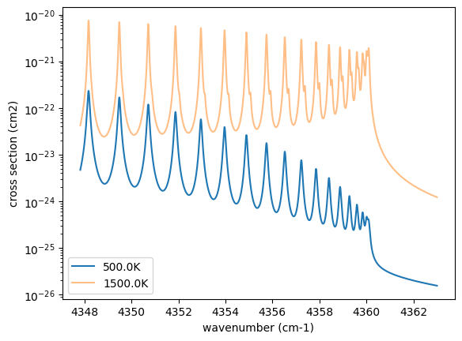
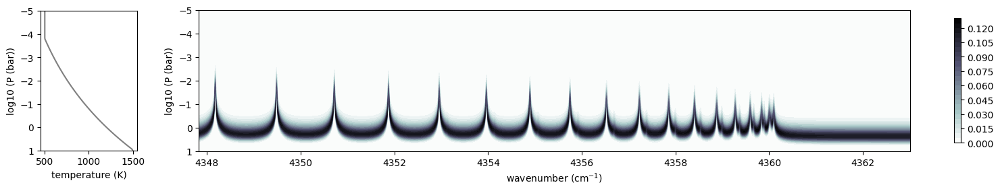
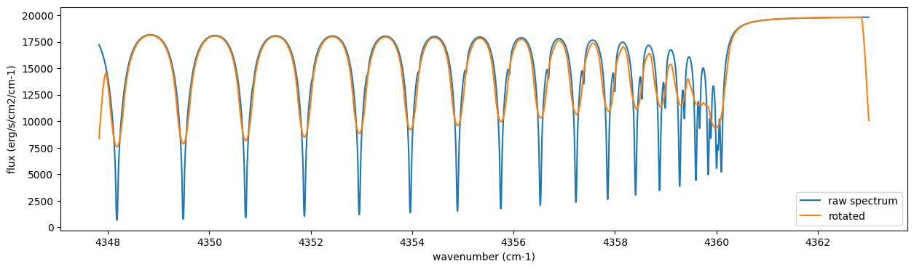
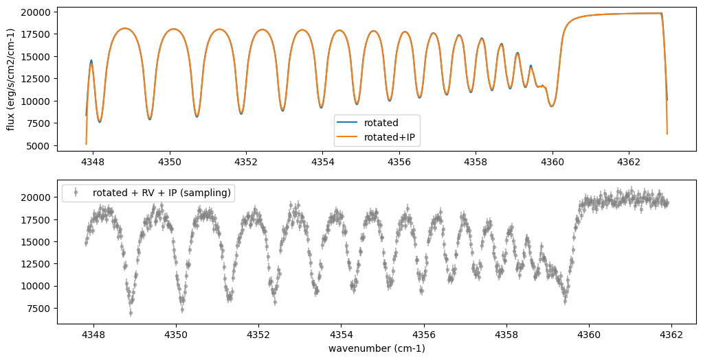
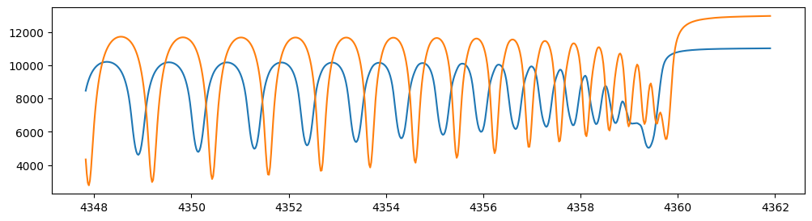
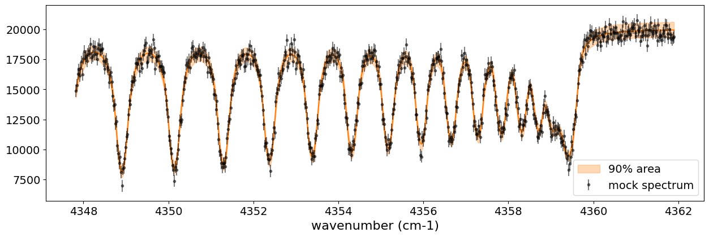
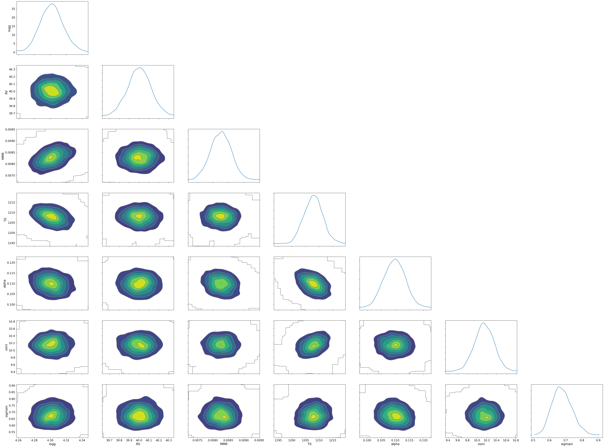
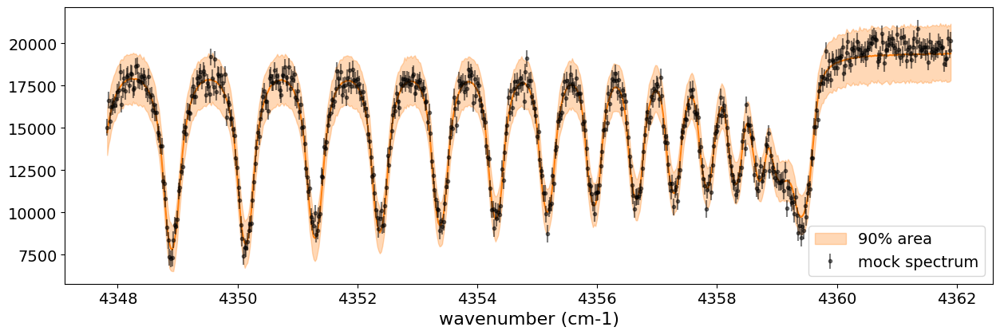
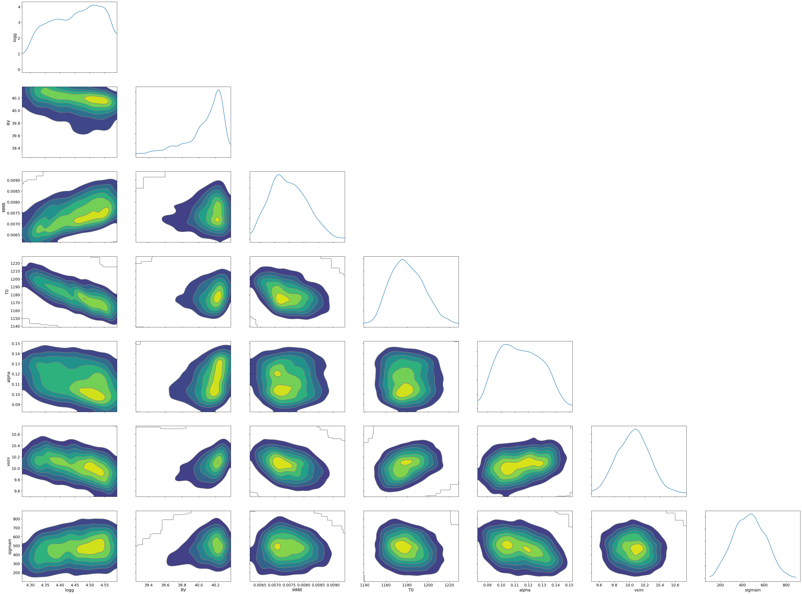

Stochastic Variational Inference with Auto Guide Generation of an Emission Spectrum Using NumPyro
=================================================================================================

Last update: August 2026, Hajime Kawahara, for ExoJAX 2.6.0

This guide performs retrieval of an emission spectrum using `stochastic
variational inference (SVI) <https://num.pyro.ai/en/latest/svi.html>`__
with automatic guide generation. It follows the same forward-modeling
workflow as `Getting Started with Emission
Spectroscopy <get_started.html>`__, but uses SVI instead of HMC-NUTS for
parameter inference.

This notebook enables 64-bit mode in JAX. This is useful for numerical
stability in retrieval examples, although 32-bit mode is often
sufficient and can be faster with lower device-memory use in production
workflows.

.. code:: ipython3

    from jax import config
    config.update("jax_enable_x64", True)

The schematic below summarizes the ExoJAX workflow:

1. load databases (``*db``),
2. compute opacity (``opa``),
3. run atmospheric radiative transfer (``art``), and
4. apply spectral operations (``sop``).

In this guide, CO and CIA provide the opacity sources. Their databases,
``mdb`` and ``cdb``, are converted by ``opa`` into layer opacities. The
radiative-transfer object ``art`` computes the raw spectrum, and ``sop``
applies rotational, instrumental, and velocity operations.

``mdb``/``cdb`` -> ``opa`` -> ``art`` -> ``sop`` -> spectrum

The same spectral model is later embedded in a probabilistic model for
retrieval.

.. figure:: https://secondearths.sakura.ne.jp/exojax/figures/exojax_get_started.png
   :alt: Figure. Structure of ExoJAX

   Figure. Structure of ExoJAX

1. Loading a molecular database using mdb
-----------------------------------------

ExoJAX provides molecular database APIs called ``mdb`` and atomic
database APIs called ``adb``. Define the wavenumber grid before loading
a database.

.. code:: ipython3

    from exojax.utils.grids import wavenumber_grid
    
    nu_grid, wav, resolution = wavenumber_grid(
        22920.0, 23000.0, 3500, unit="AA", xsmode="premodit"
    )
    print("Resolution=", resolution)

.. parsed-literal::

    xsmode =  premodit
    xsmode assumes ESLOG in wavenumber space: xsmode=premodit
    Your wavelength grid is in ***  descending  *** order
    The wavenumber grid is in ascending order by definition.
    Please be careful when you use the wavelength grid.
    Resolution= 1004211.9840291934

.. parsed-literal::

    /home/kawahara/exojax/src/exojax/utils/grids.py:85: UserWarning: Both input wavelength and output wavenumber are in ascending order.
      warnings.warn(

Next, load the molecular database. This example uses carbon monoxide
from ExoMol. The path ``CO/12C-16O/Li2015`` means
``molecule / isotopologue / database name``. Database names can be
checked on the `ExoMol website <https://www.exomol.com/>`__.

.. code:: ipython3

    from exojax.database.exomol.api import MdbExomol
    mdb = MdbExomol(".database/CO/12C-16O/Li2015", nurange=nu_grid)
    molmass = mdb.molmass

.. parsed-literal::

    HITRAN exact name= (12C)(16O)
    radis engine =  vaex
    Molecule:  CO
    Isotopologue:  12C-16O
    ExoMol database:  None
    Local folder:  .database/CO/12C-16O/Li2015
    Transition files: 
    	 => File 12C-16O__Li2015.trans
    Broadener:  H2
    Broadening code level: a0

.. parsed-literal::

    /home/kawahara/exojax/src/exojax/utils/molname.py:197: FutureWarning: e2s will be replaced to exact_molname_exomol_to_simple_molname.
      warnings.warn(
    /home/kawahara/exojax/src/exojax/utils/molname.py:91: FutureWarning: exojax.utils.molname.exact_molname_exomol_to_simple_molname will be replaced to radis.api.exomolapi.exact_molname_exomol_to_simple_molname.
      warnings.warn(
    /home/kawahara/exojax/src/exojax/utils/molname.py:91: FutureWarning: exojax.utils.molname.exact_molname_exomol_to_simple_molname will be replaced to radis.api.exomolapi.exact_molname_exomol_to_simple_molname.
      warnings.warn(
    /home/kawahara/anaconda3/lib/python3.10/site-packages/radis/api/exomolapi.py:727: AccuracyWarning: The default broadening parameter (alpha = 0.07 cm^-1 and n = 0.5) are used for J'' > 80 up to J'' = 152
      warnings.warn(

2. Computation of the Cross Section using opa
---------------------------------------------

ExoJAX provides several opacity calculator classes, collectively called
``opa``. Here we use the memory-efficient ``OpaPremodit`` calculator. We
set the temperature range used by the calculator to 500-1500 K.

.. code:: ipython3

    from exojax.opacity import OpaPremodit
    snap = mdb.to_snapshot()
    del mdb
    opa = OpaPremodit.from_snapshot(snap, nu_grid, auto_trange=[500.0, 1500.0], dit_grid_resolution=1.0)

.. parsed-literal::

    /home/kawahara/exojax/src/exojax/opacity/premodit/core.py:28: UserWarning: dit_grid_resolution is not None. Ignoring broadening_parameter_resolution.
      warnings.warn(

.. parsed-literal::

    default elower grid trange (degt) file version: 2
    Robust range: 485.7803992045456 - 1514.171191195336 K
    max value of  ngamma_ref_grid : 9.450919102366303
    min value of  ngamma_ref_grid : 7.881095721823979
    ngamma_ref_grid grid : [7.88109541 9.4509201 ]
    max value of  n_Texp_grid : 0.658
    min value of  n_Texp_grid : 0.5
    n_Texp_grid grid : [0.49999997 0.65800005]

.. parsed-literal::

    uniqidx: 0it [00:00, ?it/s]

.. parsed-literal::

    Premodit: Twt= 1108.7151960064205 K Tref= 570.4914318566549 K
    Making LSD: 100%

Compute cross sections at 500 K and 1500 K for a pressure of 1.0 bar
using ``opa.xsvector``.

.. code:: ipython3

    P = 1.0  # bar
    T_1 = 500.0  # K
    xsv_1 = opa.xsvector(T_1, P)  # cm2
    
    T_2 = 1500.0  # K
    xsv_2 = opa.xsvector(T_2, P)  # cm2

Plotting the cross sections shows that different lines dominate at
different temperatures.

.. code:: ipython3

    import matplotlib.pyplot as plt
    
    plt.plot(nu_grid, xsv_1, label=str(T_1) + "K")  # cm2
    plt.plot(nu_grid, xsv_2, alpha=0.5, label=str(T_2) + "K")  # cm2
    plt.yscale("log")
    plt.legend()
    plt.xlabel("wavenumber (cm-1)")
    plt.ylabel("cross section (cm2)")
    plt.show()

3. Atmospheric Radiative Transfer
---------------------------------

ExoJAX solves radiative transfer and returns the emission spectrum
through an ``art`` object. ``ArtEmisPure`` means atmospheric radiative
transfer for emission with pure absorption, without scattering. Here we
use 200 atmospheric layers, with the pressure ranging from 100 bar at
the bottom to 1.0e-5 bar at the top.

Since v1.5, ExoJAX supports both the flux-based two-stream solver
(``fbased2st``) and the intensity-based n-stream solver (``ibased``).
This example uses ``rtsolver="ibased"``.

.. code:: ipython3

    from exojax.rt import ArtEmisPure
    
    art = ArtEmisPure(
        nu_grid=nu_grid,
        pressure_btm=1.0e1,
        pressure_top=1.0e-5,
        nlayer=100,
        rtsolver="ibased",
        nstream=8,
    )

.. parsed-literal::

    rtsolver:  ibased
    Intensity-based n-stream solver, isothermal layer (e.g. NEMESIS, pRT like)

Assume a power-law temperature profile between 500 K and 1500 K:

:math:`T = T_0 P^{\alpha}`,

where :math:`T_0 = 1200` K and :math:`\alpha = 0.1`.

.. code:: ipython3

    art.change_temperature_range(500.0, 1500.0)
    Tarr = art.powerlaw_temperature(1200.0, 0.1)

Also, the mass mixing ratio of CO (MMR) should be defined.

.. code:: ipython3

    mmr_profile = art.constant_mmr_profile(0.01)

Surface gravity is another key atmospheric parameter. It depends on
planetary radius and mass. Here we assume 1 Jupiter radius and 10
Jupiter masses.

.. code:: ipython3

    from exojax.utils.astrofunc import gravity_jupiter
    
    gravity = gravity_jupiter(1.0, 10.0)

In addition to CO absorption, include `collision-induced
absorption <https://en.wikipedia.org/wiki/Collision-induced_absorption_and_emission>`__
(CIA) as continuum opacity. CIA data are handled with a ``cdb`` object.

.. code:: ipython3

    from exojax.database.contdb  import CdbCIA
    from exojax.opacity import OpaCIA
    
    cdb = CdbCIA(".database/H2-H2_2011.cia", nurange=nu_grid)
    opacia = OpaCIA(cdb, nu_grid=nu_grid)

.. parsed-literal::

    H2-H2

Before running radiative transfer, compute layer quantities:
``xsmatrix`` for CO and ``logacia_matrix`` for CIA. Strictly speaking,
CIA uses an absorption coefficient rather than a cross section because
its intensity is proportional to density squared. See `CIA
opacity <CIA_opacity.html>`__ for details.

.. code:: ipython3

    xsmatrix = opa.xsmatrix(Tarr, art.pressure)
    logacia_matrix = opacia.logacia_matrix(Tarr)

Convert the layer quantities into optical depth.

.. code:: ipython3

    dtau_CO = art.opacity_profile_xs(xsmatrix, mmr_profile, molmass, gravity)
    vmrH2 = 0.855  # VMR of H2
    mmw = 2.33  # mean molecular weight of the atmosphere
    dtaucia = art.opacity_profile_cia(logacia_matrix, Tarr, vmrH2, vmrH2, mmw, gravity)

Add the molecular and continuum optical depths.

.. code:: ipython3

    dtau = dtau_CO + dtaucia

Run the radiative-transfer solver to generate the emission spectrum. The
dense CO features near 4360 cm-1, or about 22940 AA, form a band head.
For the line-physics background, see `Quantum states of Carbon Monoxide
and Fortrat Diagram <Fortrat.html>`__.

.. code:: ipython3

    F = art.run(dtau, Tarr)
    
    fig = plt.figure(figsize=(15, 4))
    plt.plot(nu_grid, F)
    plt.xlabel("wavenumber (cm-1)")
    plt.ylabel("flux (erg/s/cm2/cm-1)")
    plt.show()

.. image:: get_started_svi_files/get_started_svi_35_0.png

The contribution function is useful for checking whether the dominant
emitting layers are inside the modeled pressure range. If not, adjust
``pressure_top`` or ``pressure_btm`` in ``ArtEmisPure``.

.. code:: ipython3

    from exojax.plot.atmplot import plotcf

.. code:: ipython3

    cf = plotcf(nu_grid, dtau, Tarr, art.pressure, art.dParr)

4. Spectral Operators
---------------------

Spectral operators apply effects such as rotational broadening,
instrumental broadening, Doppler velocity shifts, and sampling onto an
observational grid.

The spectrum produced by radiative transfer is the raw spectrum. ExoJAX
applies post-processing effects with spectral operators (``sop``).
First, apply rotational broadening from planetary spin.

.. code:: ipython3

    from exojax.postproc.specop import SopRotation
    
    sop_rot = SopRotation(nu_grid, vsini_max=100.0)
    
    vsini = 10.0
    u1 = 0.0
    u2 = 0.0
    Frot = sop_rot.rigid_rotation(F, vsini, u1, u2)

.. code:: ipython3

    fig = plt.figure(figsize=(15, 4))
    plt.plot(nu_grid, F, label="raw spectrum")
    plt.plot(nu_grid, Frot, label="rotated")
    plt.xlabel("wavenumber (cm-1)")
    plt.ylabel("flux (erg/s/cm2/cm-1)")
    plt.legend()
    plt.show()

Next, apply the instrumental profile and relative radial-velocity shift.
The computed spectrum must also be evaluated on the data grid; this
interpolation step is called ``sampling`` in ExoJAX. The result below is
a mock observation with added noise.

.. code:: ipython3

    from exojax.postproc.specop import SopInstProfile
    from exojax.utils.instfunc import resolution_to_gaussian_std
    
    sop_inst = SopInstProfile(nu_grid, vrmax=1000.0)
    
    RV = 40.0  # km/s
    resolution_inst =70000.0
    beta_inst = resolution_to_gaussian_std(resolution_inst)
    Finst = sop_inst.ipgauss(Frot, beta_inst)
    nu_obs = nu_grid[::5][:-50]
    
    
    from numpy.random import normal
    noise = 500.0
    Fobs = sop_inst.sampling(Finst, RV, nu_obs) + normal(0.0, noise, len(nu_obs))

.. code:: ipython3

    fig = plt.figure(figsize=(12, 6))
    ax = fig.add_subplot(211)
    plt.plot(nu_grid, Frot, label="rotated")
    plt.plot(nu_grid, Finst, label="rotated+IP")
    plt.ylabel("flux (erg/s/cm2/cm-1)")
    plt.legend()
    ax = fig.add_subplot(212)
    plt.errorbar(nu_obs, Fobs, noise, fmt=".", label="rotated + RV + IP (sampling)", color="gray",alpha=0.5)
    plt.xlabel("wavenumber (cm-1)")
    plt.legend()
    plt.show()

5. Retrieval of an Emission Spectrum
------------------------------------

Next, retrieve atmospheric parameters from the mock spectrum. Retrieval
estimates the posterior distribution of model parameters given the data.
The forward-modeling steps above are collected into the spectral model
below, which has six parameters.

.. code:: ipython3

    def fspec(T0, alpha, mmr, g, RV, vsini):
        #molecule
        Tarr = art.powerlaw_temperature(T0, alpha)
        xsmatrix = opa.xsmatrix(Tarr, art.pressure)
        mmr_arr = art.constant_mmr_profile(mmr)
        dtau = art.opacity_profile_xs(xsmatrix, mmr_arr, molmass, g)
        #continuum
        logacia_matrix = opacia.logacia_matrix(Tarr)
        dtaucH2H2 = art.opacity_profile_cia(logacia_matrix, Tarr, vmrH2, vmrH2,
                                            mmw, g)
        #total tau
        dtau = dtau + dtaucH2H2
        F = art.run(dtau, Tarr)
        Frot = sop_rot.rigid_rotation(F, vsini, u1, u2)
        Finst = sop_inst.ipgauss(Frot, beta_inst)
        mu = sop_inst.sampling(Finst, RV, nu_obs)
        return mu

Check that ``fspec`` generates spectra for different parameter sets.

.. code:: ipython3

    fig = plt.figure(figsize=(12, 3))
    
    plt.plot(nu_obs, fspec(1200.0, 0.09, 0.01, gravity_jupiter(1.0, 1.0), 40.0, 10.0),label="model")
    plt.plot(nu_obs, fspec(1100.0, 0.12, 0.01, gravity_jupiter(1.0, 10.0), 20.0, 5.0),label="model")

.. parsed-literal::

    [<matplotlib.lines.Line2D at 0x719f7c1aaef0>]

NumPyro is a probabilistic programming language (PPL), which requires
the definition of a probabilistic model. In the probabilistic model
``model_prob`` defined below, the prior distributions of each parameter
are specified. The previously defined spectral model is used within this
probabilistic model as a function that provides the mean :math:`\mu`.
The spectrum is assumed to be generated according to a Gaussian
distribution with this mean and a standard deviation :math:`\sigma`.
i.e. :math:`f(\nu_i) \sim \mathcal{N}(\mu(\nu_i; {\bf p}), \sigma^2 I)`,
where :math:`{\bf p}` is the spectral model parameter set, which are the
arguments of ``fspec``.

.. code:: ipython3

    import numpyro.distributions as dist
    import numpyro
    from jax import random
    

.. code:: ipython3

    def model_prob(spectrum):
    
        #atmospheric/spectral model parameters priors
        logg = numpyro.sample('logg', dist.Uniform(4.0, 5.0))
        RV = numpyro.sample('RV', dist.Uniform(35.0, 45.0))
        mmr = numpyro.sample('MMR', dist.Uniform(0.0, 0.015))
        T0 = numpyro.sample('T0', dist.Uniform(1000.0, 1500.0))
        alpha = numpyro.sample('alpha', dist.Uniform(0.05, 0.2))
        vsini = numpyro.sample('vsini', dist.Uniform(5.0, 15.0))
        mu = fspec(T0, alpha, mmr, 10**logg, RV, vsini)
    
        #noise model parameters priors
        sigmain = numpyro.sample('sigmain', dist.Exponential(1.e-3)) 
        numpyro.sample('spectrum', dist.Normal(mu, sigmain), obs=spectrum)

Here, perform retrieval with `stochastic variational inference
(SVI) <https://num.pyro.ai/en/latest/svi.html>`__ in NumPyro.

.. code:: ipython3

    from numpyro.infer import SVI
    from numpyro.infer import Trace_ELBO
    import numpyro.optim as optim

Variational inference uses a computationally convenient *guide
distribution* as an approximate posterior. Choosing a good guide can be
important, especially for complex models. This example uses NumPyro’s
`automatic guide
generation <https://num.pyro.ai/en/latest/autoguide.html#numpyro.infer.autoguide.AutoBNAFNormal>`__
instead of manually defining the guide.

5.1 Auto Guide with a Multivariate Normal Distribution
~~~~~~~~~~~~~~~~~~~~~~~~~~~~~~~~~~~~~~~~~~~~~~~~~~~~~~

First, use a multivariate normal guide.

.. code:: ipython3

    from numpyro.infer.autoguide import AutoMultivariateNormal
    guide = AutoMultivariateNormal(model_prob)
    optimizer = optim.Adam(0.01)
    svi = SVI(model_prob, guide, optimizer, loss=Trace_ELBO())

SVI is usually less expensive than HMC-NUTS or nested sampling. This
example should typically run within a few minutes.

.. code:: ipython3

    num_steps = 2000
    rng_key = random.PRNGKey(0)
    rng_key, rng_key_run = random.split(rng_key)
    svi_result = svi.run(rng_key_run, num_steps, spectrum=Fobs)

.. parsed-literal::

    100%|██████████| 2000/2000 [02:20<00:00, 14.21it/s, init loss: 2643771812.8775, avg. loss [1901-2000]: 616551.0235]

Use ``Predictive`` to generate spectrum predictions and inspect the
result.

.. code:: ipython3

    from numpyro.diagnostics import hpdi
    from numpyro.infer import Predictive
    import jax.numpy as jnp

.. code:: ipython3

    params = svi_result.params
    predictive = Predictive(
        model_prob,
        guide=guide,
        params=params,
        num_samples=2000,
        return_sites=("spectrum",),
    )
    predictions = predictive(rng_key, spectrum=None)
    median_mu1 = jnp.median(predictions["spectrum"], axis=0)
    hpdi_mu1 = hpdi(predictions["spectrum"], 0.9)

.. code:: ipython3

    
    fig, ax = plt.subplots(nrows=1, ncols=1, figsize=(15, 4.5))
    ax.plot(nu_obs, median_mu1, color='C1')
    ax.fill_between(nu_obs,
                    hpdi_mu1[0],
                    hpdi_mu1[1],
                    alpha=0.3,
                    interpolate=True,
                    color='C1',
                    label='90% area')
    ax.errorbar(nu_obs, Fobs, noise, fmt=".", label="mock spectrum", color="black",alpha=0.5)
    plt.xlabel('wavenumber (cm-1)', fontsize=16)
    plt.legend(fontsize=14)
    plt.tick_params(labelsize=14)
    plt.show()

To sample parameters, you need to set the ``return_sites`` argument in
``Predictive``.

.. code:: ipython3

    param_entries = ("logg", "RV", "MMR", "T0", "alpha", "vsini", "sigmain")
    predictive_posterior = Predictive(
        model_prob,
        guide=guide,
        params=params,
        num_samples=2000,
        return_sites=param_entries,
    )
    posterior_sample = predictive_posterior(rng_key, spectrum=None)

.. code:: ipython3

    import arviz
    idata = arviz.from_dict(posterior=posterior_sample)
    
    arviz.plot_pair(
        idata,
        var_names=param_entries,
        kind="kde",
        marginals=True,
    )
    plt.show()

5.2 Auto Guide for BNAF
~~~~~~~~~~~~~~~~~~~~~~~

As another example, use ``AutoBNAFNormal``, which uses Block Neural
Autoregressive Flow (BNAF), a normalizing-flow model built from
invertible neural-network transformations. It is more flexible than a
standard normal guide and can capture more complex posterior
dependencies.

.. code:: ipython3

    from numpyro.infer.autoguide import AutoBNAFNormal
    guide = AutoBNAFNormal(model_prob)
    optimizer = optim.Adam(0.01)
    svi = SVI(model_prob, guide, optimizer, loss=Trace_ELBO())

.. code:: ipython3

    num_steps = 10000
    rng_key = random.PRNGKey(0)
    rng_key, rng_key_run = random.split(rng_key)
    svi_result = svi.run(rng_key_run, num_steps, spectrum=Fobs)

.. parsed-literal::

    100%|██████████| 10000/10000 [01:10<00:00, 142.20it/s, init loss: 2630039212.8949, avg. loss [9501-10000]: 6351.8862]

.. code:: ipython3

    params = svi_result.params
    predictive = Predictive(
        model_prob,
        guide=guide,
        params=params,
        num_samples=2000,
        return_sites=("spectrum",),
    )
    predictions = predictive(rng_key, spectrum=None)
    median_mu1 = jnp.median(predictions["spectrum"], axis=0)
    hpdi_mu1 = hpdi(predictions["spectrum"], 0.9)

.. code:: ipython3

    fig, ax = plt.subplots(nrows=1, ncols=1, figsize=(15, 4.5))
    ax.plot(nu_obs, median_mu1, color='C1')
    ax.fill_between(nu_obs,
                    hpdi_mu1[0],
                    hpdi_mu1[1],
                    alpha=0.3,
                    interpolate=True,
                    color='C1',
                    label='90% area')
    ax.errorbar(nu_obs, Fobs, noise, fmt=".", label="mock spectrum", color="black",alpha=0.5)
    plt.xlabel('wavenumber (cm-1)', fontsize=16)
    plt.legend(fontsize=14)
    plt.tick_params(labelsize=14)
    plt.show()

.. code:: ipython3

    predictive_posterior = Predictive(
        model_prob,
        guide=guide,
        params=params,
        num_samples=2000,
        return_sites=param_entries,
    )
    posterior_sample = predictive_posterior(rng_key, spectrum=None)

.. code:: ipython3

    import arviz
    idata = arviz.from_dict(posterior=posterior_sample)
    
    arviz.plot_pair(
        idata,
        var_names=param_entries,
        kind="kde",
        marginals=True,
    )
    plt.show()

NumPyro provides several other `automatic
guides <https://num.pyro.ai/en/latest/autoguide.html#numpyro.infer.autoguide.AutoBNAFNormal>`__.
This completes the SVI getting-started workflow.
