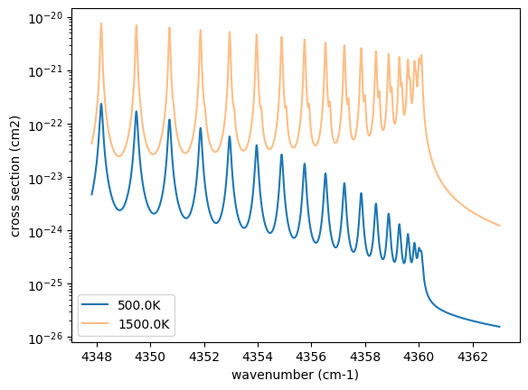
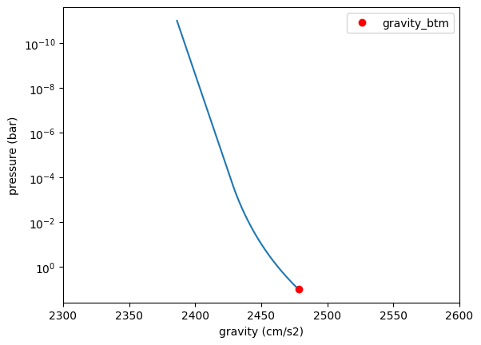
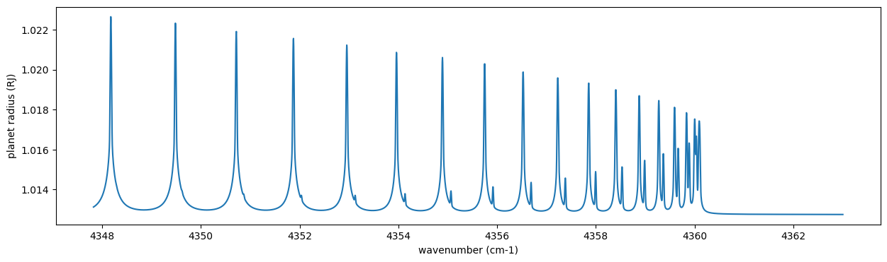
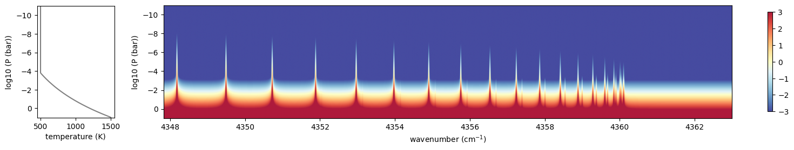
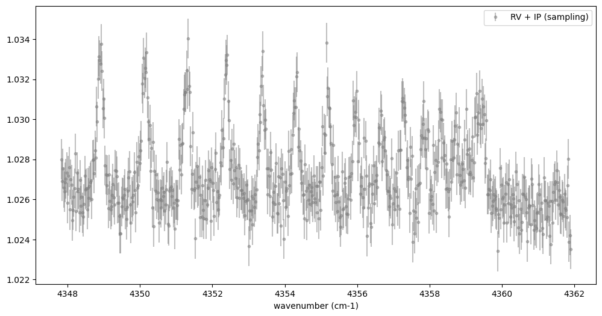
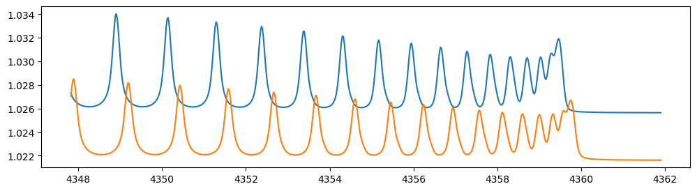
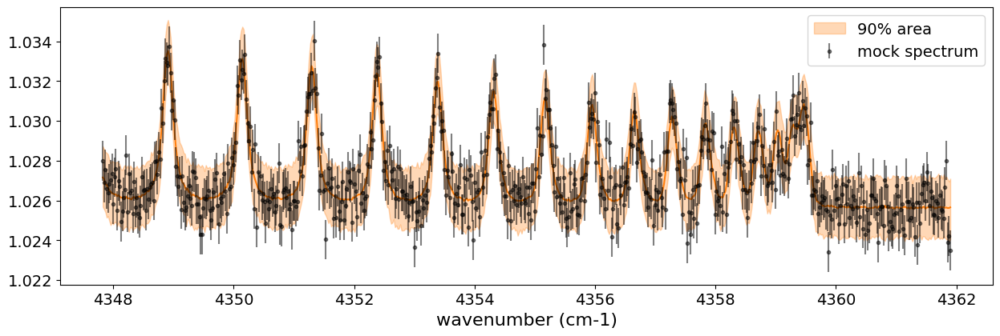
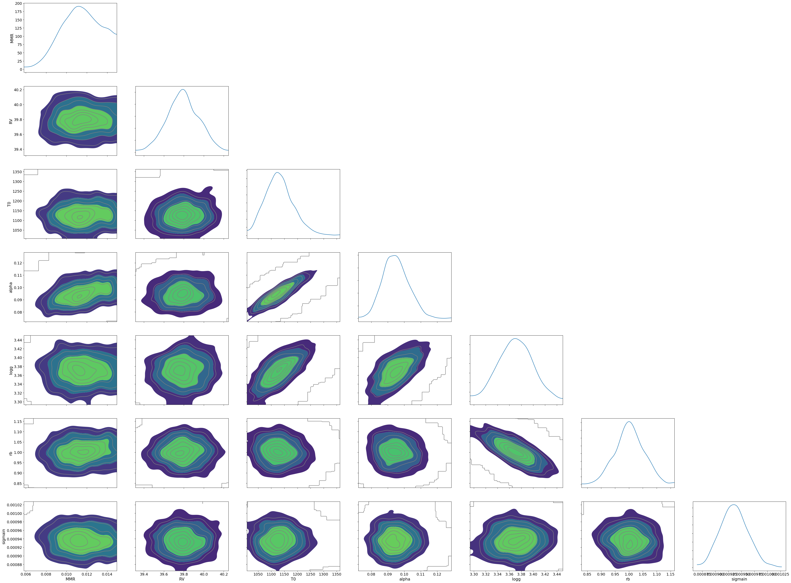

Getting Started with Simulating the Transmission Spectrum
=========================================================

Last update: March 15th (2025) Hajime Kawahara for v2.0

In this getting started guide, we will use ExoJAX to simulate a
high-resolution **transmission** spectrum from an atmosphere with CO
molecular absorption and hydrogen molecule CIA continuum absorption as
the opacity sources. We will then add appropriate noise to the simulated
spectrum to create a mock spectrum and perform spectral retrieval using
NumPyro’s HMC NUTS.

First, we recommend 64-bit if you do not think about numerical errors.
Use jax.config to set 64-bit. (But note that 32-bit is sufficient in
most cases. Consider to use 32-bit (faster, less device memory) for your
real use case.)

.. code:: ipython3

    from jax import config
    config.update("jax_enable_x64", True)

The following schematic figure explains how ExoJAX works; (1) loading
databases (``*db``), (2) calculating opacity (``opa``), (3) running
atmospheric radiative transfer (``art``), (4) applying operations on the
spectrum (``sop``)

In this “getting started” guide, there are two opacity sources, CO and
CIA. Their respective databases, ``mdb`` and ``cdb``, are converted by
``opa`` into the opacity of each atmospheric layer, which is then used
in the radiative transfer calculation performed by ``art``. Finally,
``sop`` convolves instrumental profiles, generating the emission
spectrum.

``mdb``/``cdb`` –> ``opa`` –> ``art`` –> ``sop`` —> spectrum

This spectral model is incorporated into the probabilistic model in
NumPyro, and retrieval is performed by sampling using HMC-NUTS.

.. figure:: https://secondearths.sakura.ne.jp/exojax/figures/exojax_get_started_transmission.png
   :alt: Figure. Structure of ExoJAX

   Figure. Structure of ExoJAX

1. Loading a molecular database using mdb
-----------------------------------------

ExoJAX has an API for molecular databases, called ``mdb`` (or ``adb``
for atomic datbases). Prior to loading the database, define the
wavenumber range first.

.. code:: ipython3

    from exojax.utils.grids import wavenumber_grid
    
    nu_grid, wav, resolution = wavenumber_grid(
        22920.0, 23000.0, 3500, unit="AA", xsmode="premodit"
    )
    print("Resolution=", resolution)

.. parsed-literal::

    xsmode =  premodit
    xsmode assumes ESLOG in wavenumber space: xsmode=premodit
    Your wavelength grid is in ***  descending  *** order
    The wavenumber grid is in ascending order by definition.
    Please be careful when you use the wavelength grid.
    Resolution= 1004211.9840291934

.. parsed-literal::

    /home/kawahara/exojax/src/exojax/spec/unitconvert.py:82: UserWarning: Both input wavelength and output wavenumber are in ascending order.
      warnings.warn(

Then, let’s load the molecular database. We here use Carbon monoxide in
Exomol. ``CO/12C-16O/Li2015`` means
``Carbon monoxide/ isotopes = 12C + 16O / database name``. You can check
the database name in the ExoMol website (https://www.exomol.com/).

.. code:: ipython3

    from exojax.spec.api import MdbExomol
    mdb = MdbExomol(".database/CO/12C-16O/Li2015", nurange=nu_grid)

.. parsed-literal::

    /home/kawahara/exojax/src/exojax/utils/molname.py:197: FutureWarning: e2s will be replaced to exact_molname_exomol_to_simple_molname.
      warnings.warn(
    /home/kawahara/exojax/src/exojax/utils/molname.py:91: FutureWarning: exojax.utils.molname.exact_molname_exomol_to_simple_molname will be replaced to radis.api.exomolapi.exact_molname_exomol_to_simple_molname.
      warnings.warn(
    /home/kawahara/exojax/src/exojax/utils/molname.py:91: FutureWarning: exojax.utils.molname.exact_molname_exomol_to_simple_molname will be replaced to radis.api.exomolapi.exact_molname_exomol_to_simple_molname.
      warnings.warn(

.. parsed-literal::

    HITRAN exact name= (12C)(16O)
    radis engine =  pytables
    		 => Downloading from http://www.exomol.com/db/CO/12C-16O/Li2015/12C-16O__Li2015.def
    		 => Downloading from http://www.exomol.com/db/CO/12C-16O/Li2015/12C-16O__Li2015.pf
    		 => Downloading from http://www.exomol.com/db/CO/12C-16O/Li2015/12C-16O__Li2015.states.bz2
    		 => Downloading from http://www.exomol.com/db/CO/12C-16O/12C-16O__H2.broad
    		 => Downloading from http://www.exomol.com/db/CO/12C-16O/12C-16O__He.broad
    		 => Downloading from http://www.exomol.com/db/CO/12C-16O/12C-16O__air.broad
    		 => Downloading from http://www.exomol.com/db/CO/12C-16O/12C-16O__self.broad
    Error: Couldn't download .broad file at http://www.exomol.com/db/CO/12C-16O/12C-16O__self.broad and save.
    		 => Downloading from http://www.exomol.com/db/CO/12C-16O/12C-16O__Ar.broad
    Error: Couldn't download .broad file at http://www.exomol.com/db/CO/12C-16O/12C-16O__Ar.broad and save.
    		 => Downloading from http://www.exomol.com/db/CO/12C-16O/12C-16O__CH4.broad
    Error: Couldn't download .broad file at http://www.exomol.com/db/CO/12C-16O/12C-16O__CH4.broad and save.
    		 => Downloading from http://www.exomol.com/db/CO/12C-16O/12C-16O__CO.broad
    Error: Couldn't download .broad file at http://www.exomol.com/db/CO/12C-16O/12C-16O__CO.broad and save.
    		 => Downloading from http://www.exomol.com/db/CO/12C-16O/12C-16O__CO2.broad
    Error: Couldn't download .broad file at http://www.exomol.com/db/CO/12C-16O/12C-16O__CO2.broad and save.
    		 => Downloading from http://www.exomol.com/db/CO/12C-16O/12C-16O__H2.broad
    		 => Downloading from http://www.exomol.com/db/CO/12C-16O/12C-16O__H2O.broad
    Error: Couldn't download .broad file at http://www.exomol.com/db/CO/12C-16O/12C-16O__H2O.broad and save.
    		 => Downloading from http://www.exomol.com/db/CO/12C-16O/12C-16O__N2.broad
    Error: Couldn't download .broad file at http://www.exomol.com/db/CO/12C-16O/12C-16O__N2.broad and save.
    		 => Downloading from http://www.exomol.com/db/CO/12C-16O/12C-16O__NH3.broad
    Error: Couldn't download .broad file at http://www.exomol.com/db/CO/12C-16O/12C-16O__NH3.broad and save.
    		 => Downloading from http://www.exomol.com/db/CO/12C-16O/12C-16O__NO.broad
    Error: Couldn't download .broad file at http://www.exomol.com/db/CO/12C-16O/12C-16O__NO.broad and save.
    		 => Downloading from http://www.exomol.com/db/CO/12C-16O/12C-16O__O2.broad
    Error: Couldn't download .broad file at http://www.exomol.com/db/CO/12C-16O/12C-16O__O2.broad and save.
    		 => Downloading from http://www.exomol.com/db/CO/12C-16O/12C-16O__NH3.broad
    Error: Couldn't download .broad file at http://www.exomol.com/db/CO/12C-16O/12C-16O__NH3.broad and save.
    		 => Downloading from http://www.exomol.com/db/CO/12C-16O/12C-16O__CS.broad
    Error: Couldn't download .broad file at http://www.exomol.com/db/CO/12C-16O/12C-16O__CS.broad and save.
    
    Summary of broadening files downloaded:
    	Success: ['H2' 'He' 'air' 'H2']
    	Fail: ['self' 'Ar' 'CH4' 'CO' 'CO2' 'H2O' 'N2' 'NH3' 'NO' 'O2' 'NH3' 'CS']
    
    Note: Caching states data to the pytables format. After the second time, it will become much faster.
    Molecule:  CO
    Isotopologue:  12C-16O
    ExoMol database:  None
    Local folder:  .database/CO/12C-16O/Li2015
    Transition files: 
    	 => File 12C-16O__Li2015.trans
    		 => Downloading from http://www.exomol.com/db/CO/12C-16O/Li2015/12C-16O__Li2015.trans.bz2
    		 => Caching the *.trans.bz2 file to the pytables (*.h5) format. After the second time, it will become much faster.
    		 => You can deleted the 'trans.bz2' file by hand.
    Broadener:  H2
    Broadening code level: a0

.. parsed-literal::

    /home/kawahara/miniconda3/lib/python3.12/site-packages/radis-0.16-py3.12.egg/radis/api/exomolapi.py:687: AccuracyWarning: The default broadening parameter (alpha = 0.07 cm^-1 and n = 0.5) are used for J'' > 80 up to J'' = 152
      warnings.warn(

2. Computation of the Cross Section using opa
---------------------------------------------

ExoJAX has various opacity calculator classes, so-called ``opa``. Here,
we use a memory-saved opa, ``OpaPremodit``. We assume the robust
tempreature range we will use is 500-1500K.

.. code:: ipython3

    from exojax.spec.opacalc import OpaPremodit
    opa = OpaPremodit(mdb, nu_grid, auto_trange=[500.0, 1500.0], dit_grid_resolution=1.0)

.. parsed-literal::

    /home/kawahara/exojax/src/exojax/spec/opacalc.py:348: UserWarning: dit_grid_resolution is not None. Ignoring broadening_parameter_resolution.
      warnings.warn(

.. parsed-literal::

    OpaPremodit: params automatically set.
    default elower grid trange (degt) file version: 2
    Robust range: 485.7803992045456 - 1514.171191195336 K
    OpaPremodit: Tref_broadening is set to  866.0254037844389 K
    # of reference width grid :  2
    # of temperature exponent grid : 2
    max value of  ngamma_ref_grid : 9.450919102366303
    min value of  ngamma_ref_grid : 7.881095721823979
    ngamma_ref_grid grid : [7.88109541 9.4509201 ]
    max value of  n_Texp_grid : 0.658
    min value of  n_Texp_grid : 0.5
    n_Texp_grid grid : [0.49999997 0.65800005]

.. parsed-literal::

    uniqidx: 0it [00:00, ?it/s]

.. parsed-literal::

    Premodit: Twt= 1108.7151960064205 K Tref= 570.4914318566549 K
    Making LSD:|####################| 100%
    cross section (xsvector/xsmatrix) is calculated in the closed mode. The aliasing part cannnot be used.
    wing cut width =  [15.12718787427093, 15.23298725175755] cm-1

.. parsed-literal::

    

Then let’s compute cross section for two different temperature 500 and
1500 K for P=1.0 bar. opa.xsvector can do that!

.. code:: ipython3

    P = 1.0  # bar
    T_1 = 500.0  # K
    xsv_1 = opa.xsvector(T_1, P)  # cm2
    
    T_2 = 1500.0  # K
    xsv_2 = opa.xsvector(T_2, P)  # cm2

Plot them. It can be seen that different lines are stronger at different
temperatures.

.. code:: ipython3

    import matplotlib.pyplot as plt
    
    plt.plot(nu_grid, xsv_1, label=str(T_1) + "K")  # cm2
    plt.plot(nu_grid, xsv_2, alpha=0.5, label=str(T_2) + "K")  # cm2
    plt.yscale("log")
    plt.legend()
    plt.xlabel("wavenumber (cm-1)")
    plt.ylabel("cross section (cm2)")
    plt.show()

3. Atmospheric Radiative Transfer
---------------------------------

ExoJAX can solve the radiative transfer and derive `the transmission
spectrum <../userguide/rtransfer_transmission.html>`__. To do so, ExoJAX
has ``art`` class. ``ArtTransPure`` means Atomospheric Radiative
Transfer for **Transmission** with Pure absorption. So, ``ArtTransPure``
does not include scattering. You can choose either the trapezoid or
Simpson’s rule as the integration scheme. The default setting is
``integration="simpson"``. We set the number of the atmospheric layer to
200 (nlayer) and the pressure at bottom and top atmosphere to 1 and
1.e-11 bar.

.. code:: ipython3

    from exojax.spec.atmrt import ArtTransPure
    
    art = ArtTransPure(
        pressure_btm=1.0e1,
        pressure_top=1.0e-11,
        nlayer=200,
    )

.. parsed-literal::

    integration:  simpson
    Simpson integration, uses the chord optical depth at the lower boundary and midppoint of the layers.

.. parsed-literal::

    /home/kawahara/exojax/src/exojax/spec/dtau_mmwl.py:13: FutureWarning: dtau_mmwl might be removed in future.
      warnings.warn("dtau_mmwl might be removed in future.", FutureWarning)
    /home/kawahara/exojax/src/exojax/spec/atmrt.py:53: UserWarning: nu_grid is not given. specify nu_grid when using 'run' 
      warnings.warn(

Let’s assume the power law temperature model, within 500 - 1500 K.

:math:`T = T_0 P^\alpha`

where :math:`T_0=1200` K and :math:`\alpha=0.1`.

.. code:: ipython3

    art.change_temperature_range(500.0, 1500.0)
    Tarr = art.powerlaw_temperature(1200.0, 0.1)

Also, the mass mixing ratio of CO (MMR) should be defined.

.. code:: ipython3

    mmr_profile = art.constant_mmr_profile(0.01)

Surface gravity is also important quantity of the atmospheric model,
which is a function of planetary radius and mass. Unlike in the case of
the emission spectrum, the transmission spectrum is affected by the
opacity from the lower to the upper layers of the atmosphere. Therefore,
it is better to calculate gravity as a function of altitude. To achieve
this, the gravity and radius at the bottom of the atmospheric layer are
specified as ``gravity_btm`` and ``radius_btm``, respectively, and the
layer-by-layer gravity profile is computed using
``art.gravity_profile``.

.. code:: ipython3

    import jax.numpy as jnp
    from exojax.utils.astrofunc import gravity_jupiter
    from exojax.utils.constants import RJ
    gravity_btm = gravity_jupiter(1.0, 1.0)
    radius_btm = RJ
    
    mmw = 2.33*jnp.ones_like(art.pressure)  # mean molecular weight of the atmosphere
    gravity = art.gravity_profile(Tarr, mmw, radius_btm, gravity_btm)

When visualized, it looks like this.

.. code:: ipython3

    
    plt.plot(gravity, art.pressure)
    plt.plot(gravity_btm, art.pressure[-1], "ro", label="gravity_btm")
    plt.yscale("log")
    plt.xlim(2300,2600)
    plt.gca().invert_yaxis()
    plt.xlabel("gravity (cm/s2)")
    plt.ylabel("pressure (bar)")
    plt.legend()
    plt.show()

In addition to the CO cross section, we would consider `collisional
induced
absorption <https://en.wikipedia.org/wiki/Collision-induced_absorption_and_emission>`__
(CIA) as a continuum opacity. ``cdb`` class can be used.

.. code:: ipython3

    from exojax.spec.contdb import CdbCIA
    from exojax.spec.opacont import OpaCIA
    
    cdb = CdbCIA(".database/H2-H2_2011.cia", nurange=nu_grid)
    opacia = OpaCIA(cdb, nu_grid=nu_grid)

.. parsed-literal::

    H2-H2

Before running the radiative transfer, we need cross sections for
layers, called ``xsmatrix`` for CO and ``logacia_matrix`` for CIA
(strictly speaking, the latter is not cross section but coefficient
because CIA intensity is proportional density square). See
`here <CIA_opacity.html>`__ for the details.

.. code:: ipython3

    xsmatrix = opa.xsmatrix(Tarr, art.pressure)
    logacia_matrix = opacia.logacia_matrix(Tarr)

Convert them to opacity

.. code:: ipython3

    
    
    dtau_CO = art.opacity_profile_xs(xsmatrix, mmr_profile, mdb.molmass, gravity)
    vmrH2 = 0.855  # VMR of H2
    dtaucia = art.opacity_profile_cia(logacia_matrix, Tarr, vmrH2, vmrH2, mmw[:, None], gravity)

Add two opacities.

.. code:: ipython3

    dtau = dtau_CO + dtaucia

.. code:: ipython3

    gravity_btm

.. parsed-literal::

    2478.57730044555

Then, run the radiative transfer. As you can see, the emission spectrum
has been generated. This spectrum shows a region near 4360 cm-1, or
around 22940 AA, where CO features become increasingly dense. This
region is referred to as the band head. If you’re interested in why the
band head occurs, please refer to `Quatum states of Carbon Monoxide and
Fortrat Diagram <Fortrat.html>`__.

.. code:: ipython3

    Rp2 = art.run(dtau, Tarr, mmw, radius_btm, gravity_btm)
    Rp = jnp.sqrt(Rp2)

.. code:: ipython3

    fig = plt.figure(figsize=(15, 4))
    plt.plot(nu_grid, Rp)
    plt.xlabel("wavenumber (cm-1)")
    plt.ylabel("planet radius (RJ)")
    plt.show()

To examine the contribution of each atmospheric layer to the
transmission spectrum, one can, for example, look at the optical depth
along the chord direction. This can be done as follows:

.. code:: ipython3

    from exojax.spec.opachord import chord_geometric_matrix
    from exojax.spec.opachord import chord_optical_depth
    
    normalized_height, normalized_radius_lower = art.atmosphere_height(Tarr, mmw, radius_btm, gravity_btm)        
    cgm = chord_geometric_matrix(normalized_height, normalized_radius_lower)
    dtau_chord = chord_optical_depth(cgm, dtau)

By plotting the data, it becomes clear that in the case of transmitted
light, information from a wide range of atmospheric layers, from the
upper to the lower layers, is included.

.. code:: ipython3

    from exojax.plot.atmplot import plottau
    plottau(nu_grid, dtau_chord, Tarr, art.pressure)

.. parsed-literal::

    /home/kawahara/exojax/src/exojax/plot/atmplot.py:51: SyntaxWarning: invalid escape sequence '\m'
      plt.xlabel("wavenumber ($\mathrm{cm}^{-1}$)")
    /home/kawahara/exojax/src/exojax/plot/atmplot.py:68: SyntaxWarning: invalid escape sequence '\m'
      labelx["um"] = "wavelength ($\mu \mathrm{m}$)"
    /home/kawahara/exojax/src/exojax/plot/atmplot.py:70: SyntaxWarning: invalid escape sequence '\A'
      labelx["AA"] = "wavelength ($\AA$)"
    /home/kawahara/exojax/src/exojax/plot/atmplot.py:71: SyntaxWarning: invalid escape sequence '\m'
      labelx["cm-1"] = "wavenumber ($\mathrm{cm}^{-1}$)"
    /home/kawahara/exojax/src/exojax/plot/atmplot.py:24: UserWarning: nugrid looks in log scale, results in a wrong X-axis value. Use log10(nugrid) instead.
      warnings.warn(

4. Spectral Operators:　instrumental profile, Doppler velocity shift and so on, any operation on spectra.
---------------------------------------------------------------------------------------------------------

The above spectrum is called “raw spectrum” in ExoJAX. The effects
applied to the raw spectrum is handled in ExoJAX by the spectral
operator (``sop``).

Then, the instrumental profile with relative radial velocity shift is
applied. Also, we need to match the computed spectrum to the data grid.
This process is called ``sampling`` (but just interpolation though).
Below, let’s perform a simulation that includes noise for use in later
analysis.

.. code:: ipython3

    from exojax.spec.specop import SopInstProfile
    from exojax.utils.instfunc import resolution_to_gaussian_std
    
    sop_inst = SopInstProfile(nu_grid, vrmax=1000.0)
    
    RV = 40.0  # km/s
    resolution_inst = 30000.0
    beta_inst = resolution_to_gaussian_std(resolution_inst)
    Rp2_inst = sop_inst.ipgauss(Rp2, beta_inst)
    nu_obs = nu_grid[::5][:-50]
    
    
    from numpy.random import normal
    noise = 0.001
    Fobs = sop_inst.sampling(Rp2_inst, RV, nu_obs) + normal(0.0, noise, len(nu_obs))

.. code:: ipython3

    fig = plt.figure(figsize=(12, 6))
    ax = fig.add_subplot(111)
    
    plt.errorbar(nu_obs, Fobs, noise, fmt=".", label="RV + IP (sampling)", color="gray",alpha=0.5)
    plt.xlabel("wavenumber (cm-1)")
    plt.legend()
    plt.show()

5. Retrieval of an Emission Spectrum
------------------------------------

Next, let’s perform a “retrieval” on the simulated spectrum created
above. Retrieval involves estimating the parameters of an atmospheric
model in the form of a posterior distribution based on the spectrum. To
do this, we first need a model. Here, we have compiled the forward
modeling steps so far and defined the model as follows. The spectral
model has six parameters.

.. code:: ipython3

    def fspec(T0, alpha, mmr, radius_btm, gravity_btm, RV):
        
        Tarr = art.powerlaw_temperature(T0, alpha)
        gravity = art.gravity_profile(Tarr, mmw, radius_btm, gravity_btm)
        
        #molecule
        xsmatrix = opa.xsmatrix(Tarr, art.pressure)
        mmr_arr = art.constant_mmr_profile(mmr)
        dtau = art.opacity_profile_xs(xsmatrix, mmr_arr, opa.mdb.molmass, gravity)
        #continuum
        logacia_matrix = opacia.logacia_matrix(Tarr)
        dtaucH2H2 = art.opacity_profile_cia(logacia_matrix, Tarr, vmrH2, vmrH2,
                                            mmw[:, None], gravity)
        #total tau
        dtau = dtau + dtaucH2H2
        Rp2 = art.run(dtau, Tarr, mmw, radius_btm, gravity_btm)
        Rp2_inst = sop_inst.ipgauss(Rp2, beta_inst)
    
        mu = sop_inst.sampling(Rp2_inst, RV, nu_obs)
        return mu

Let’s verify that spectra are being generated from ``fspec`` with
various parameter sets.

.. code:: ipython3

    fig = plt.figure(figsize=(12, 3))
    
    plt.plot(nu_obs, fspec(1200.0, 0.09, 0.01, RJ, gravity_jupiter(1.0, 1.0), 40.0),label="model")
    plt.plot(nu_obs, fspec(1400.0, 0.12, 0.01, RJ, gravity_jupiter(1.0, 1.3), 20.0),label="model")

.. parsed-literal::

    [<matplotlib.lines.Line2D at 0x745a21794980>]

NumPyro is a probabilistic programming language (PPL), which requires
the definition of a probabilistic model. In the probabilistic model
``model_prob`` defined below, the prior distributions of each parameter
are specified. The previously defined spectral model is used within this
probabilistic model as a function that provides the mean :math:`\mu`.
The spectrum is assumed to be generated according to a Gaussian
distribution with this mean and a standard deviation :math:`\sigma`.
i.e. :math:`f(\nu_i) \sim \mathcal{N}(\mu(\nu_i; {\bf p}), \sigma^2 I)`,
where :math:`{\bf p}` is the spectral model parameter set, which are the
arguments of ``fspec``.

.. code:: ipython3

    from numpyro.infer import MCMC, NUTS
    import numpyro.distributions as dist
    import numpyro
    from jax import random

.. parsed-literal::

    /home/kawahara/miniconda3/lib/python3.12/site-packages/tqdm/auto.py:21: TqdmWarning: IProgress not found. Please update jupyter and ipywidgets. See https://ipywidgets.readthedocs.io/en/stable/user_install.html
      from .autonotebook import tqdm as notebook_tqdm

.. code:: ipython3

    def model_prob(spectrum):
    
        #atmospheric/spectral model parameters priors
        logg = numpyro.sample('logg', dist.Uniform(3.0, 4.0))
        RV = numpyro.sample('RV', dist.Uniform(35.0, 45.0))
        mmr = numpyro.sample('MMR', dist.Uniform(0.0, 0.015))
        T0 = numpyro.sample('T0', dist.Uniform(1000.0, 1500.0))
        alpha = numpyro.sample('alpha', dist.Uniform(0.05, 0.2))
        radius_btm = numpyro.sample('rb', dist.Normal(1.0,0.05))
        
        mu = fspec(T0, alpha, mmr, radius_btm*RJ, 10**logg, RV)
    
        #noise model parameters priors
        sigmain = numpyro.sample('sigmain', dist.Exponential(1000.0)) 
    
        numpyro.sample('spectrum', dist.Normal(mu, sigmain), obs=spectrum)

Now, let’s define NUTS and start sampling.

.. code:: ipython3

    rng_key = random.PRNGKey(0)
    rng_key, rng_key_ = random.split(rng_key)
    num_warmup, num_samples = 500, 1000
    #kernel = NUTS(model_prob, forward_mode_differentiation=True)
    kernel = NUTS(model_prob, forward_mode_differentiation=False)

Since this process will take several hours, feel free to go for a long
lunch break!

.. code:: ipython3

    mcmc = MCMC(kernel, num_warmup=num_warmup, num_samples=num_samples)
    mcmc.run(rng_key_, spectrum=Fobs)
    mcmc.print_summary()

.. parsed-literal::

    sample: 100%|██████████| 1500/1500 [2:23:08<00:00,  5.73s/it, 127 steps of size 1.14e-02. acc. prob=0.94]  

.. parsed-literal::

    
                    mean       std    median      5.0%     95.0%     n_eff     r_hat
           MMR      0.01      0.00      0.01      0.01      0.01    309.22      1.00
            RV     39.79      0.16     39.79     39.53     40.05    709.96      1.00
            T0   1130.71     53.36   1126.14   1044.55   1215.44    396.74      1.00
         alpha      0.09      0.01      0.09      0.08      0.11    309.49      1.00
          logg      3.37      0.03      3.37      3.32      3.42    402.09      1.00
            rb      1.00      0.05      1.00      0.91      1.09    670.37      1.00
       sigmain      0.00      0.00      0.00      0.00      0.00    760.18      1.00
    
    Number of divergences: 0

.. parsed-literal::

    

After returning from your long lunch, if you’re lucky and the sampling
is complete, let’s write a predictive model for the spectrum.

.. code:: ipython3

    from numpyro.diagnostics import hpdi
    from numpyro.infer import Predictive
    import jax.numpy as jnp

.. code:: ipython3

    # SAMPLING
    posterior_sample = mcmc.get_samples()
    pred = Predictive(model_prob, posterior_sample, return_sites=['spectrum'])
    predictions = pred(rng_key_, spectrum=None)
    median_mu1 = jnp.median(predictions['spectrum'], axis=0)
    hpdi_mu1 = hpdi(predictions['spectrum'], 0.9)

.. code:: ipython3

    
    fig, ax = plt.subplots(nrows=1, ncols=1, figsize=(15, 4.5))
    ax.plot(nu_obs, median_mu1, color='C1')
    ax.fill_between(nu_obs,
                    hpdi_mu1[0],
                    hpdi_mu1[1],
                    alpha=0.3,
                    interpolate=True,
                    color='C1',
                    label='90% area')
    ax.errorbar(nu_obs, Fobs, noise, fmt=".", label="mock spectrum", color="black",alpha=0.5)
    plt.xlabel('wavenumber (cm-1)', fontsize=16)
    plt.legend(fontsize=14)
    plt.tick_params(labelsize=14)
    plt.show()

You can see that the predictions are working very well! Let’s also
display a corner plot. Here, we’ve used ArviZ for visualization.

.. code:: ipython3

    import arviz
    pararr = ['T0', 'alpha', 'logg', 'MMR', 'radius_btm', 'RV']
    arviz.plot_pair(arviz.from_numpyro(mcmc),
                    kind='kde',
                    divergences=False,
                    marginals=True)
    plt.show()

Further Information
-------------------

Correlated noise can be introduced using a Gaussian process, and
parameter estimation can be performed using SVI or Nested Sampling, just
as in the case of emission spectra. See below for details.

-  `Including GP in an emission
   spectrum <get_started.html#modeling-correlated-noise-with-a-gaussian-process>`__
-  `SVI for an emission spectrum <get_started_svi.html>`__
-  `Neste Sampling for an emission spectrum <get_started_ns.html>`__

Not enough GPU device memory? In that case, you can perform wavenumber
splitting. See below for details.

-  `wavenumber stitching <Cross_Section_using_OpaStitch.html>`__

Want to analyze JWST data? The Gallery and the following repositories
may be helpful.

-  `ExoJAX gallery <../examples/index.html>`__
-  `exojaxample_WASP39b <https://github.com/sh-tada/exojaxample_WASP39b>`__
   by Shotaro Tada (@sh-tada)

That’s it.

