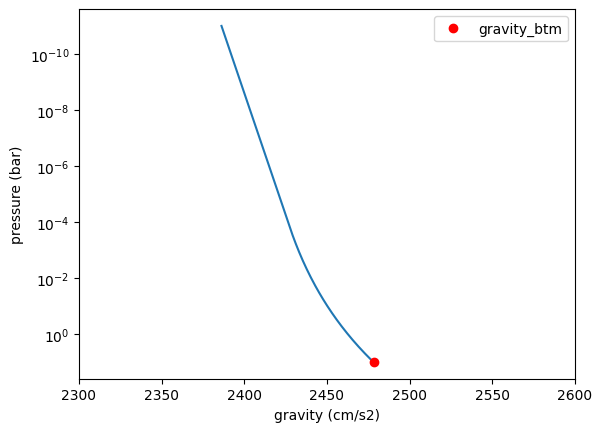
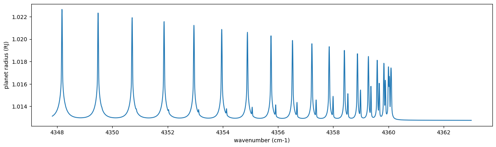
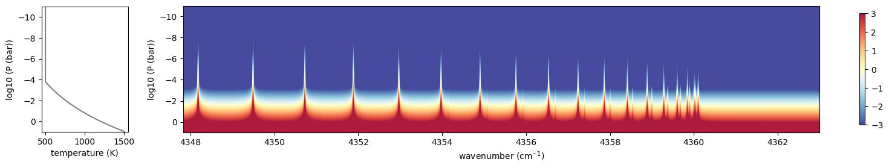
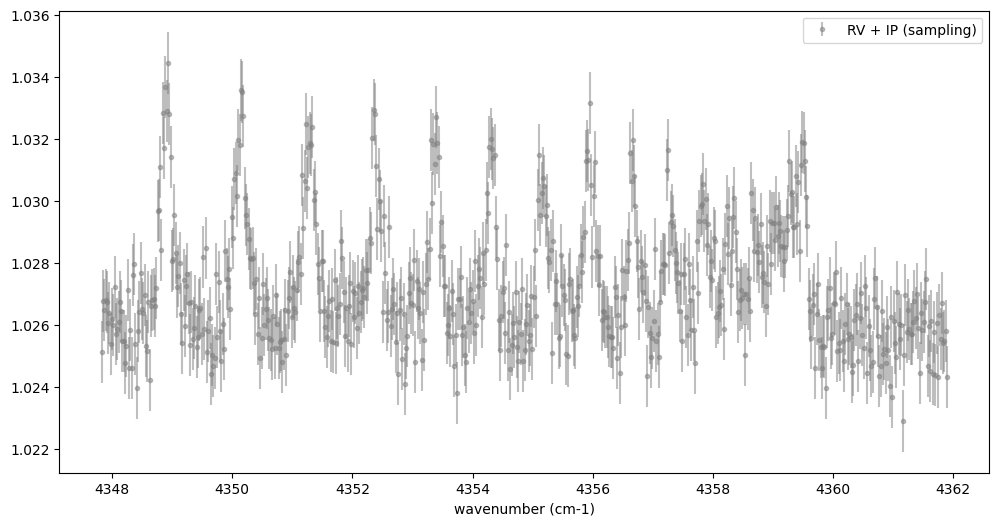
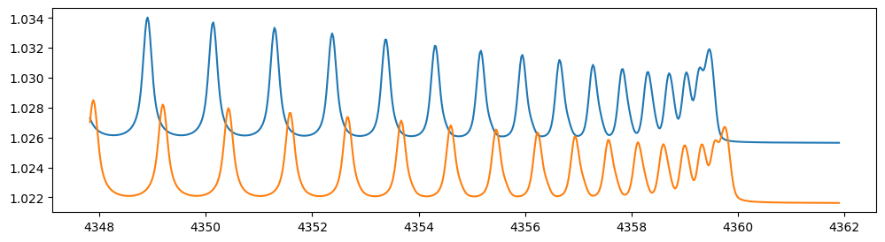
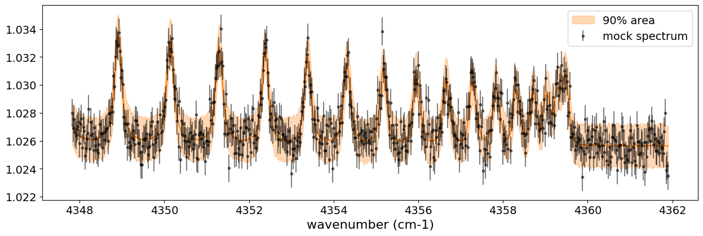
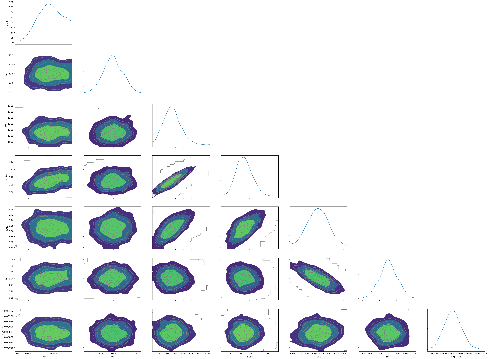

Getting Started with Transmission Spectroscopy
==============================================

Last update: June 2026, Hajime Kawahara, for ExoJAX 2.5.0

This guide builds a high-resolution transmission spectrum for an
atmosphere with CO molecular absorption and H2-H2 CIA continuum opacity.
It then adds mock noise and performs a retrieval with NumPyro’s HMC-NUTS
sampler.

The structure follows the emission getting-started guide, but the
radiative-transfer step uses transmission geometry.

This notebook enables 64-bit mode in JAX. This is useful for numerical
stability in retrieval examples, although 32-bit mode is often
sufficient and can be faster with lower device-memory use in production
workflows.

.. code:: ipython3

    from jax import config
    config.update("jax_enable_x64", True)

The schematic below summarizes the ExoJAX workflow:

1. load databases (``*db``),
2. compute opacity (``opa``),
3. run atmospheric radiative transfer (``art``), and
4. apply spectral operations (``sop``).

In this guide, CO and CIA provide the opacity sources. Their databases,
``mdb`` and ``cdb``, are converted by ``opa`` into layer opacities. The
radiative-transfer object ``art`` computes the raw transmission
spectrum, and ``sop`` applies instrumental and velocity operations.

``mdb``/``cdb`` -> ``opa`` -> ``art`` -> ``sop`` -> spectrum

The same spectral model is later embedded in a NumPyro probabilistic
model for HMC-NUTS retrieval.

.. figure:: https://secondearths.sakura.ne.jp/exojax/figures/exojax_get_started_transmission.png
   :alt: Figure. Structure of ExoJAX

   Figure. Structure of ExoJAX

1. Loading a molecular database using mdb
-----------------------------------------

ExoJAX provides molecular database APIs called ``mdb`` and atomic
database APIs called ``adb``. Define the wavenumber grid before loading
a database.

.. code:: ipython3

    from exojax.utils.grids import wavenumber_grid
    
    nu_grid, wav, resolution = wavenumber_grid(
        22920.0, 23000.0, 3500, unit="AA", xsmode="premodit"
    )
    print("Resolution=", resolution)

.. parsed-literal::

    xsmode =  premodit
    xsmode assumes ESLOG in wavenumber space: xsmode=premodit
    Your wavelength grid is in ***  descending  *** order
    The wavenumber grid is in ascending order by definition.
    Please be careful when you use the wavelength grid.
    Resolution= 1004211.9840291934

.. parsed-literal::

    /home/kawahara/exojax/src/exojax/utils/grids.py:85: UserWarning: Both input wavelength and output wavenumber are in ascending order.
      warnings.warn(

Next, load the molecular database. This example uses carbon monoxide
from ExoMol. The path ``CO/12C-16O/Li2015`` means
``molecule / isotopologue / database name``. Database names can be
checked on the `ExoMol website <https://www.exomol.com/>`__.

.. code:: ipython3

    from exojax.database.exomol.api import MdbExomol
    mdb = MdbExomol(".database/CO/12C-16O/Li2015", nurange=nu_grid)

.. parsed-literal::

    /home/kawahara/exojax/src/exojax/utils/molname.py:197: FutureWarning: e2s will be replaced to exact_molname_exomol_to_simple_molname.
      warnings.warn(
    /home/kawahara/exojax/src/exojax/utils/molname.py:91: FutureWarning: exojax.utils.molname.exact_molname_exomol_to_simple_molname will be replaced to radis.api.exomolapi.exact_molname_exomol_to_simple_molname.
      warnings.warn(
    /home/kawahara/exojax/src/exojax/utils/molname.py:91: FutureWarning: exojax.utils.molname.exact_molname_exomol_to_simple_molname will be replaced to radis.api.exomolapi.exact_molname_exomol_to_simple_molname.
      warnings.warn(

.. parsed-literal::

    HITRAN exact name= (12C)(16O)
    radis engine =  vaex
    Molecule:  CO
    Isotopologue:  12C-16O
    ExoMol database:  None
    Local folder:  .database/CO/12C-16O/Li2015
    Transition files: 
    	 => File 12C-16O__Li2015.trans
    Broadener:  H2
    Broadening code level: a0

.. parsed-literal::

    /home/kawahara/anaconda3/lib/python3.10/site-packages/radis/api/exomolapi.py:727: AccuracyWarning: The default broadening parameter (alpha = 0.07 cm^-1 and n = 0.5) are used for J'' > 80 up to J'' = 152
      warnings.warn(

2. Computation of the Cross Section using opa
---------------------------------------------

ExoJAX provides several opacity calculator classes, collectively called
``opa``. Here we use the memory-efficient ``OpaPremodit`` calculator. We
set the temperature range used by the calculator to 500-1500 K.

.. code:: ipython3

    from exojax.opacity import OpaPremodit
    molmass = mdb.molmass # we use molmass later
    snap = mdb.to_snapshot() # extract snapshot from mdb
    del mdb # save the memory
    opa = OpaPremodit.from_snapshot(snap, nu_grid, auto_trange=[500.0, 1500.0], dit_grid_resolution=1.0)

.. parsed-literal::

    /home/kawahara/exojax/src/exojax/opacity/premodit/core.py:28: UserWarning: dit_grid_resolution is not None. Ignoring broadening_parameter_resolution.
      warnings.warn(

.. parsed-literal::

    default elower grid trange (degt) file version: 2
    Robust range: 485.7803992045456 - 1514.171191195336 K
    max value of  ngamma_ref_grid : 9.450919102366303
    min value of  ngamma_ref_grid : 7.881095721823979
    ngamma_ref_grid grid : [7.88109541 9.4509201 ]
    max value of  n_Texp_grid : 0.658
    min value of  n_Texp_grid : 0.5
    n_Texp_grid grid : [0.49999997 0.65800005]

.. parsed-literal::

    uniqidx: 0it [00:00, ?it/s]

.. parsed-literal::

    Premodit: Twt= 1108.7151960064205 K Tref= 570.4914318566549 K
    Making LSD: 100%

Compute cross sections at 500 K and 1500 K for a pressure of 1.0 bar
using ``opa.xsvector``.

.. code:: ipython3

    P = 1.0  # bar
    T_1 = 500.0  # K
    xsv_1 = opa.xsvector(T_1, P)  # cm2
    
    T_2 = 1500.0  # K
    xsv_2 = opa.xsvector(T_2, P)  # cm2

Plotting the cross sections shows that different lines dominate at
different temperatures.

.. code:: ipython3

    import matplotlib.pyplot as plt
    
    plt.plot(nu_grid, xsv_1, label=str(T_1) + "K")  # cm2
    plt.plot(nu_grid, xsv_2, alpha=0.5, label=str(T_2) + "K")  # cm2
    plt.yscale("log")
    plt.legend()
    plt.xlabel("wavenumber (cm-1)")
    plt.ylabel("cross section (cm2)")
    plt.show()

.. image:: get_started_transmission_files/get_started_transmission_16_0.png

3. Atmospheric Radiative Transfer
---------------------------------

ExoJAX solves radiative transfer and returns `the transmission
spectrum <../userguide/rtransfer_transmission.html>`__ through an
``art`` object. ``ArtTransPure`` means atmospheric radiative transfer
for transmission with pure absorption, without scattering. The
integration scheme can be either trapezoid or Simpson’s rule; the
default is ``integration="simpson"``. Here we use 200 atmospheric
layers whose representative pressures range from 1.0e-11 bar at the
top to 10 bar at the bottom.

.. code:: ipython3

    from exojax.rt import ArtTransPure
    
    art = ArtTransPure(
        pressure_btm=1.0e1,
        pressure_top=1.0e-11,
        nlayer=200,
    )

.. parsed-literal::

    integration:  simpson
    Simpson integration, uses the chord optical depth at the lower boundary and midppoint of the layers.

.. parsed-literal::

    /home/kawahara/exojax/src/exojax/rt/common.py:40: UserWarning: nu_grid is not given. specify nu_grid when using 'run' 
      warnings.warn(

Assume a power-law temperature profile between 500 K and 1500 K:

:math:`T = T_0 P^{\alpha}`,

where :math:`T_0 = 1200` K and :math:`\alpha = 0.1`.

.. code:: ipython3

    art.change_temperature_range(500.0, 1500.0)
    Tarr = art.powerlaw_temperature(1200.0, 0.1)

Also, the mass mixing ratio of CO (MMR) should be defined.

.. code:: ipython3

    mmr_profile = art.constant_mmr_profile(0.01)

Surface gravity is important for transmission spectra. Unlike emission
spectra, transmission spectra probe opacity along slant paths from lower
to upper atmospheric layers. It is therefore useful to calculate gravity
as a function of altitude. This is done by specifying ``gravity_btm``
and ``radius_btm`` at the lower boundary of the bottom layer and using
the layer boundaries in the transmission geometry.

.. code:: ipython3

    import jax.numpy as jnp
    from exojax.utils.astrofunc import gravity_jupiter
    from exojax.utils.constants import RJ
    gravity_btm = gravity_jupiter(1.0, 1.0)
    radius_btm = RJ
    
    mmw = 2.33*jnp.ones_like(art.pressure)  # mean molecular weight of the atmosphere
    gravity = art.gravity_profile(Tarr, mmw, radius_btm, gravity_btm)

When visualized, it looks like this.

.. code:: ipython3

    
    plt.plot(gravity, art.pressure)
    plt.plot(gravity_btm, art.pressure_btm_boundary, "ro", label="gravity_btm")
    plt.yscale("log")
    plt.xlim(2300,2600)
    plt.gca().invert_yaxis()
    plt.xlabel("gravity (cm/s2)")
    plt.ylabel("pressure (bar)")
    plt.legend()
    plt.show()

In addition to CO absorption, include `collision-induced
absorption <https://en.wikipedia.org/wiki/Collision-induced_absorption_and_emission>`__
(CIA) as continuum opacity. CIA data are handled with a ``cdb`` object.

.. code:: ipython3

    from exojax.database.contdb  import CdbCIA
    from exojax.opacity import OpaCIA
    
    cdb = CdbCIA(".database/H2-H2_2011.cia", nurange=nu_grid)
    opacia = OpaCIA(cdb, nu_grid=nu_grid)

.. parsed-literal::

    H2-H2

Before running radiative transfer, compute layer quantities:
``xsmatrix`` for CO and ``logacia_matrix`` for CIA. Strictly speaking,
CIA uses an absorption coefficient rather than a cross section because
its intensity is proportional to density squared. See `CIA
opacity <CIA_opacity.html>`__ for details.

.. code:: ipython3

    xsmatrix = opa.xsmatrix(Tarr, art.pressure)
    logacia_matrix = opacia.logacia_matrix(Tarr)

Convert the layer quantities into optical depth.

.. code:: ipython3

    
    
    dtau_CO = art.opacity_profile_xs(xsmatrix, mmr_profile, molmass, gravity)
    vmrH2 = 0.855  # VMR of H2
    dtaucia = art.opacity_profile_cia(logacia_matrix, Tarr, vmrH2, vmrH2, mmw[:, None], gravity)

Add the molecular and continuum optical depths.

.. code:: ipython3

    dtau = dtau_CO + dtaucia

.. code:: ipython3

    gravity_btm

.. parsed-literal::

    2478.57730044555

Run the radiative-transfer solver to generate the transmission spectrum.
The dense CO features near 4360 cm-1, or about 22940 AA, form a band
head. For the line-physics background, see `Quantum states of Carbon
Monoxide and Fortrat Diagram <Fortrat.html>`__.

.. code:: ipython3

    Rp2 = art.run(dtau, Tarr, mmw, radius_btm, gravity_btm)
    Rp = jnp.sqrt(Rp2)

.. code:: ipython3

    fig = plt.figure(figsize=(15, 4))
    plt.plot(nu_grid, Rp)
    plt.xlabel("wavenumber (cm-1)")
    plt.ylabel("planet radius (RJ)")
    plt.show()

To examine the contribution of each atmospheric layer to the
transmission spectrum, one can, for example, look at the optical depth
along the chord direction. This can be done as follows:

.. code:: ipython3

    from exojax.rt.chord import chord_geometric_matrix
    from exojax.rt.chord import chord_optical_depth
    
    normalized_height, normalized_radius_lower = art.atmosphere_height(Tarr, mmw, radius_btm, gravity_btm)        
    cgm = chord_geometric_matrix(normalized_height, normalized_radius_lower)
    dtau_chord = chord_optical_depth(cgm, dtau)

By plotting the data, it becomes clear that in the case of transmitted
light, information from a wide range of atmospheric layers, from the
upper to the lower layers, is included.

.. code:: ipython3

    from exojax.plot.atmplot import plottau
    plottau(nu_grid, dtau_chord, Tarr, art.pressure)

.. parsed-literal::

    /home/kawahara/exojax/src/exojax/plot/atmplot.py:24: UserWarning: nugrid looks in log scale, results in a wrong X-axis value. Use log10(nugrid) instead.
      warnings.warn(

4. Spectral Operators
---------------------

Spectral operators apply effects such as instrumental broadening,
Doppler velocity shifts, and sampling onto an observational grid.

The spectrum produced by radiative transfer is the raw spectrum. ExoJAX
applies post-processing effects with spectral operators (``sop``).

Next, apply the instrumental profile and relative radial-velocity shift.
The computed spectrum must also be evaluated on the data grid; this
interpolation step is called ``sampling`` in ExoJAX. The result below is
a mock observation with added noise.

.. code:: ipython3

    from exojax.postproc.specop import SopInstProfile
    from exojax.utils.instfunc import resolution_to_gaussian_std
    
    sop_inst = SopInstProfile(nu_grid, vrmax=1000.0)
    
    RV = 40.0  # km/s
    resolution_inst = 30000.0
    beta_inst = resolution_to_gaussian_std(resolution_inst)
    Rp2_inst = sop_inst.ipgauss(Rp2, beta_inst)
    nu_obs = nu_grid[::5][:-50]
    
    
    from numpy.random import normal
    noise = 0.001
    Fobs = sop_inst.sampling(Rp2_inst, RV, nu_obs) + normal(0.0, noise, len(nu_obs))

.. code:: ipython3

    fig = plt.figure(figsize=(12, 6))
    ax = fig.add_subplot(111)
    
    plt.errorbar(nu_obs, Fobs, noise, fmt=".", label="RV + IP (sampling)", color="gray",alpha=0.5)
    plt.xlabel("wavenumber (cm-1)")
    plt.legend()
    plt.show()

5. Retrieval of a Transmission Spectrum
---------------------------------------

Next, retrieve atmospheric parameters from the mock transmission
spectrum. Retrieval estimates the posterior distribution of model
parameters given the data. The forward-modeling steps above are
collected into the spectral model below, which has six parameters.

.. code:: ipython3

    def fspec(T0, alpha, mmr, radius_btm, gravity_btm, RV):
        """ computes planet radius sqaure spectrum
        
        Args:
            T0 (float): temperature at 1 bar
            alpha (float): power law index of temperature
            mmr (float): Mass mixing ratio of CO
            radius_btm (float): radius at the bottom in cm
            gravity_btm (float): gravity at the bottom in cm/s2
            RV (float): radial velocity in km/s
    
        Returns:
            _type_: _description_
        """
        
        Tarr = art.powerlaw_temperature(T0, alpha)
        gravity = art.gravity_profile(Tarr, mmw, radius_btm, gravity_btm)
        
        #molecule
        xsmatrix = opa.xsmatrix(Tarr, art.pressure)
        mmr_arr = art.constant_mmr_profile(mmr)
        dtau = art.opacity_profile_xs(xsmatrix, mmr_arr, molmass, gravity)
        #continuum
        logacia_matrix = opacia.logacia_matrix(Tarr)
        dtaucH2H2 = art.opacity_profile_cia(logacia_matrix, Tarr, vmrH2, vmrH2,
                                            mmw[:, None], gravity)
        #total tau
        dtau = dtau + dtaucH2H2
        Rp2 = art.run(dtau, Tarr, mmw, radius_btm, gravity_btm)
        Rp2_inst = sop_inst.ipgauss(Rp2, beta_inst)
    
        mu = sop_inst.sampling(Rp2_inst, RV, nu_obs)
        return mu

Check that ``fspec`` generates spectra for different parameter sets.

.. code:: ipython3

    fig = plt.figure(figsize=(12, 3))
    
    plt.plot(nu_obs, fspec(1200.0, 0.09, 0.01, RJ, gravity_jupiter(1.0, 1.0), 40.0),label="model")
    plt.plot(nu_obs, fspec(1400.0, 0.12, 0.01, RJ, gravity_jupiter(1.0, 1.3), 20.0),label="model")

.. parsed-literal::

    [<matplotlib.lines.Line2D at 0x738810660250>]

NumPyro is a probabilistic programming language (PPL), which requires
the definition of a probabilistic model. In the probabilistic model
``model_prob`` defined below, the prior distributions of each parameter
are specified. The previously defined spectral model is used within this
probabilistic model as a function that provides the mean :math:`\mu`.
The spectrum is assumed to be generated according to a Gaussian
distribution with this mean and a standard deviation :math:`\sigma`.
i.e. :math:`f(\nu_i) \sim \mathcal{N}(\mu(\nu_i; {\bf p}), \sigma^2 I)`,
where :math:`{\bf p}` is the spectral model parameter set, which are the
arguments of ``fspec``.

.. code:: ipython3

    from numpyro.infer import MCMC, NUTS
    import numpyro.distributions as dist
    import numpyro
    from jax import random

.. code:: ipython3

    def model_prob(spectrum):
    
        #atmospheric/spectral model parameters priors
        logg = numpyro.sample('logg', dist.Uniform(3.0, 4.0))
        RV = numpyro.sample('RV', dist.Uniform(35.0, 45.0))
        mmr = numpyro.sample('MMR', dist.Uniform(0.0, 0.015))
        T0 = numpyro.sample('T0', dist.Uniform(1000.0, 1500.0))
        alpha = numpyro.sample('alpha', dist.Uniform(0.05, 0.2))
        radius_btm = numpyro.sample('rb', dist.Normal(1.0,0.05))
        
        mu = fspec(T0, alpha, mmr, radius_btm*RJ, 10**logg, RV)
    
        #noise model parameters priors
        sigmain = numpyro.sample('sigmain', dist.Exponential(1000.0)) 
    
        numpyro.sample('spectrum', dist.Normal(mu, sigmain), obs=spectrum)

Now define NUTS and start sampling.

.. code:: ipython3

    rng_key = random.PRNGKey(0)
    rng_key, rng_key_ = random.split(rng_key)
    num_warmup, num_samples = 500, 1000
    #kernel = NUTS(model_prob, forward_mode_differentiation=True)
    kernel = NUTS(model_prob, forward_mode_differentiation=False)

This sampling step can take several hours, depending on the machine and
sampler settings.

.. code:: ipython3

    mcmc = MCMC(kernel, num_warmup=num_warmup, num_samples=num_samples)
    mcmc.run(rng_key_, spectrum=Fobs)
    mcmc.print_summary()

.. parsed-literal::

    sample: 100%|██████████| 1500/1500 [2:23:08<00:00,  5.73s/it, 127 steps of size 1.14e-02. acc. prob=0.94]  

.. parsed-literal::

    
                    mean       std    median      5.0%     95.0%     n_eff     r_hat
           MMR      0.01      0.00      0.01      0.01      0.01    309.22      1.00
            RV     39.79      0.16     39.79     39.53     40.05    709.96      1.00
            T0   1130.71     53.36   1126.14   1044.55   1215.44    396.74      1.00
         alpha      0.09      0.01      0.09      0.08      0.11    309.49      1.00
          logg      3.37      0.03      3.37      3.32      3.42    402.09      1.00
            rb      1.00      0.05      1.00      0.91      1.09    670.37      1.00
       sigmain      0.00      0.00      0.00      0.00      0.00    760.18      1.00
    
    Number of divergences: 0

After sampling finishes, define a predictive model for the spectrum.

.. code:: ipython3

    from numpyro.diagnostics import hpdi
    from numpyro.infer import Predictive
    import jax.numpy as jnp

.. code:: ipython3

    # SAMPLING
    posterior_sample = mcmc.get_samples()
    pred = Predictive(model_prob, posterior_sample, return_sites=['spectrum'])
    predictions = pred(rng_key_, spectrum=None)
    median_mu1 = jnp.median(predictions['spectrum'], axis=0)
    hpdi_mu1 = hpdi(predictions['spectrum'], 0.9)

.. code:: ipython3

    
    fig, ax = plt.subplots(nrows=1, ncols=1, figsize=(15, 4.5))
    ax.plot(nu_obs, median_mu1, color='C1')
    ax.fill_between(nu_obs,
                    hpdi_mu1[0],
                    hpdi_mu1[1],
                    alpha=0.3,
                    interpolate=True,
                    color='C1',
                    label='90% area')
    ax.errorbar(nu_obs, Fobs, noise, fmt=".", label="mock spectrum", color="black",alpha=0.5)
    plt.xlabel('wavenumber (cm-1)', fontsize=16)
    plt.legend(fontsize=14)
    plt.tick_params(labelsize=14)
    plt.show()

The predictive spectra match the mock data well. We also show a corner
plot using ArviZ.

.. code:: ipython3

    import arviz
    pararr = ['T0', 'alpha', 'logg', 'MMR', 'radius_btm', 'RV']
    arviz.plot_pair(arviz.from_numpyro(mcmc),
                    kind='kde',
                    divergences=False,
                    marginals=True)
    plt.show()

Further Information
-------------------

Correlated noise can be introduced with a Gaussian process, and
parameter estimation can also be performed with SVI or nested sampling,
as in the emission-spectrum workflow.

-  `Including GP in an emission
   spectrum <get_started.html#modeling-correlated-noise-with-a-gaussian-process>`__
-  `SVI for an emission spectrum <get_started_svi.html>`__
-  `Nested sampling for an emission spectrum <get_started_ns.html>`__

If GPU device memory is limited, see:

-  `wavenumber stitching <Cross_Section_using_OpaStitch.html>`__

An applied HMC-NUTS analysis of a WASP-39b transmission spectrum
observed with JWST/NIRSpec G395H is available in the gallery:

-  `WASP-39b transmission spectrum
   example <../examples/WASP39b_transmission_JWST-NIRSpec.html#sphx-glr-examples-wasp39b-transmission-jwst-nirspec-py>`__

