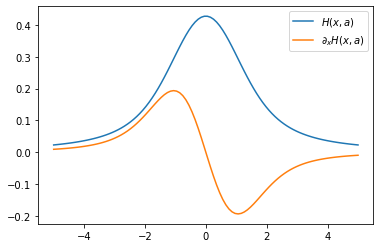

Voigt-Hjerting Function
------------------------
*Update: May 10/2021, Hajime Kawahara*

The Voigt-Hjerting function is the real part of `the Faddeeva function <https://en.wikipedia.org/wiki/Faddeeva_function>`_, defined as

:math:`H(x,a) = \frac{a}{\pi}`
:math:`\int_{-\infty}^{\infty}`
:math:`\frac{e^{-y^2}}{(x-y)^2 + a^2} dy` .

In exojax,
*hjert*
provides the Voigt-Hjerting function.

.. code:: ipython3

    from exojax.spec import hjert
    hjert(1.0,1.0)

.. parsed-literal::

    DeviceArray(0.3047442, dtype=float32)

We can differentiate the Voigt-Hjerting function by :math:`x`.
:math:`\partial_x H(x,a)` is given by

.. code:: ipython3

    from jax import grad
    dhjert_dx=grad(hjert,argnums=0)
    dhjert_dx(1.0,1.0)

.. parsed-literal::

    DeviceArray(-0.1930505, dtype=float32)

hjert is compatible to JAX. So, when you want to use array as input, you
need to wrap it by jax.vmap.

.. code:: ipython3

    import jax.numpy as jnp
    from jax import vmap
    import matplotlib.pyplot as plt
    
    #input vector
    x=jnp.linspace(-5,5,100)
    
    #vectorized hjert H(x,a)
    vhjert=vmap(hjert,(0,None),0)
    
    #vectroized dH(x,a)/dx
    vdhjert_dx=vmap(dhjert_dx,(0,None),0)
    
    plt.plot(x, vhjert(x,1.0),label="$H(x,a)$")
    plt.plot(x, vdhjert_dx(x,1.0),label="$\\partial_x H(x,a)$")
    plt.legend()

