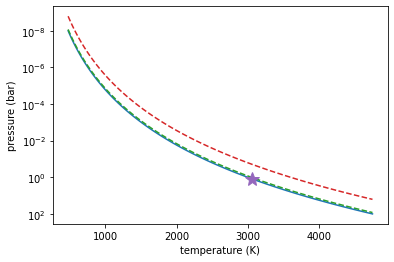
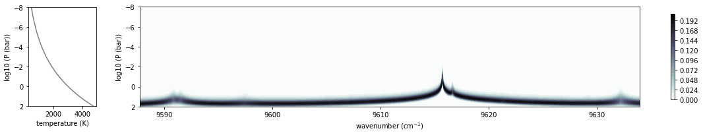
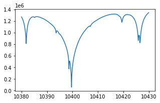
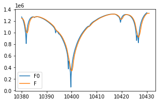

.. container::
   :name: toc

Forward modeling of the emission spectrum using VALD3
=====================================================

| Tako Ishikawa, Hajime Kawahara last update: 2021/12/02
| created: : 2021/07/20

.. raw:: html

   <!-- 
   written with reference to :  
   "exojax/examples/tutorial/Forward\ modeling.ipynb"  
   "ghR/exojax_0/examples/testlines/line_strength_CO.py"  

   cd ~/work

   -->

This example provides how to use VALD3 for forward modeling of the
emission spectrum.

.. code:: ipython3

    from exojax.spec.rtransfer import nugrid
    from exojax.spec.rtransfer import pressure_layer 
    from exojax.spec import moldb, molinfo, contdb
    from exojax.spec import atomll
    from exojax.spec.exomol import gamma_exomol
    from exojax.spec import SijT, doppler_sigma
    from exojax.spec import planck
    import matplotlib.pyplot as plt
    import jax.numpy as jnp
    from jax import vmap, jit
    import numpy as np

A T-P profile

.. code:: ipython3

    #Assume ATMOSPHERE                                                                     
    NP=100
    T0=3000. #10000. #3000. #1295.0 #K
    Parr, dParr, k=pressure_layer(NP=NP)
    H_He_HH_VMR = [0.0, 0.16, 0.84] #typical quasi-"solar-fraction"
    Tarr = T0*(Parr)**0.1
    
    PH = Parr* H_He_HH_VMR[0]
    PHe = Parr* H_He_HH_VMR[1]
    PHH = Parr* H_He_HH_VMR[2]
    
    fig=plt.figure(figsize=(6,4))
    plt.plot(Tarr,Parr)
    plt.plot(Tarr, PH, '--'); plt.plot(Tarr, PHH, '--'); plt.plot(Tarr, PHe, '--')
    plt.plot(Tarr[80],Parr[80], marker='*', markersize=15)
    plt.yscale("log")
    plt.xlabel("temperature (K)")
    plt.ylabel("pressure (bar)")
    plt.gca().invert_yaxis()
    plt.show()

Set a wavenumber grid...

.. code:: ipython3

    #We set a wavenumber grid using nugrid.
    nus,wav,res = nugrid(10380, 10430, 4500, unit="AA") 

.. parsed-literal::

    xsmode assumes ESLOG: mode= lpf

Load a database of atomic lines from VALD3.

.. code:: ipython3

    #Loading a database of a few atomic lines from VALD3  #BU: CO and CIA (H2-H2)...     
    valdlines = 'HiroyukiIshikawa.4214450.gz'
    adbFe = moldb.AdbVald(valdlines, nus)

Some notes on VALD3 data
------------------------------
    - ``valdlines`` should be   fullpath to the input line list obtained from `VALD3 <http://vald.astro.uu.se/>`_:
      
VALD data access is free but requires registration through `the Contact form <http://vald.astro.uu.se/~vald/php/vald.php?docpage=contact.html>`_. After the registration, you can login and choose the ``Extract Element`` mode. For a example in this notebook, the request form of ``Extract All`` mode was filled as:

.. code:: 

              Extract All
                Starting wavelength :    10380
                Ending wavelength :    10430
                Extraction format :    Long format
                Retrieve data via :    FTP
                (Hyperfine structure:    N/A)
                (Require lines to have a known value of :    N/A)
                Linelist configuration :    Default
                Unit selection:    Energy unit: eV - Medium: vacuum - Wavelength unit: angstrom - VdW syntax: default
		
Please assign the fullpath of the output file sent by VALD ([user_name_at_VALD].[request_number_at_VALD].gz;  ``HiroyukiIshikawa.4214450.gz`` in the above code) to the variable ``valdlines``. Note that the number of spectral lines that can be extracted in a single request is limited to 1000 in  `VALD <https://www.astro.uu.se/valdwiki/Restrictions%20on%20extraction%20size>`_.

.. warning::
   
   Just for this tutorial, ``HiroyukiIshikawa.4214450.gz`` can be found `here <http://secondearths.sakura.ne.jp/exojax/data/>`_. Note that if you use Windows or Mac, .gz might be unziped when downloading despite no renaming. I mean, the same name with .gz, but unziped!  In this case, download ``extradata.tar`` and untar it.

Relative partition function is given by

.. code:: ipython3

    #Computing the relative partition function,
    
    qt_284=vmap(adbFe.QT_interp_284)(Tarr)
    qt = np.zeros([len(adbFe.QTmask), len(Tarr)])
    #qt = np.empty_like(adbFe.QTmask, dtype='object')
    for i, mask in enumerate(adbFe.QTmask):
        qt[i] = qt_284[:,mask]  #e.g., qt_284[:,76] #Fe I
    qt = jnp.array(qt)

Here are the pressure and natural broadenings (Lorentzian width).

.. code:: ipython3

    gammaLMP = jit(vmap(atomll.gamma_vald3,(0,0,0,0,None,None,None,None,None,None,None,None,None,None,None)))\
            (Tarr, PH, PHH, PHe, adbFe.ielem, adbFe.iion, \
                    adbFe.dev_nu_lines, adbFe.elower, adbFe.eupper, adbFe.atomicmass, adbFe.ionE, \
                    adbFe.gamRad, adbFe.gamSta, adbFe.vdWdamp, 1.0)  

and Doppler broadening,

.. code:: ipython3

    sigmaDM=jit(vmap(doppler_sigma,(None,0,None)))\
        (adbFe.nu_lines, Tarr, adbFe.atomicmass)

and Line strength.

.. code:: ipython3

    SijM=jit(vmap(SijT,(0,None,None,None,0)))\
        (Tarr, adbFe.logsij0, adbFe.nu_lines, adbFe.elower, qt.T)

This is the initialization of LPF.

.. code:: ipython3

    from exojax.spec.initspec import init_lpf
    numatrix=init_lpf(adbFe.nu_lines,nus)

Computing dtau for each atomic species (or ion) in a SEPARATE array.

.. code:: ipython3

    def get_unique_list(seq):
        seen = []
        return [x for x in seq if x not in seen and not seen.append(x)]
    
    uspecies = get_unique_list(jnp.vstack([adbFe.ielem, adbFe.iion]).T.tolist())

Set the stellar/planetary parameters

.. code:: ipython3

    #Parameters of Objects
    Rp = 0.36*10 #R_sun*10    #Rp=0.88 #[R_jup]
    Mp = 0.37*1e3 #M_sun*1e3    #Mp=33.2 #[M_jup]
    g = 2478.57730044555*Mp/Rp**2
    print('logg: '+str(np.log10(g))) #check

.. parsed-literal::

    logg: 4.849799190511717

Calculating delta tau...

.. code:: ipython3

    #For now, ASSUME all atoms exist as neutral atoms. 
    #In fact, we can't ignore the effect of molecular formation e.g. TiO (」゜□゜)」
    
    from exojax.spec.lpf import xsmatrix
    from exojax.spec.rtransfer import dtauM
    
    from exojax.spec.atomllapi import load_atomicdata
    ipccd = load_atomicdata()
    ieleml = jnp.array(ipccd['ielem'])
    Narr = jnp.array(10**(12+ipccd['solarA'])) #number density
    massarr = jnp.array(ipccd['mass']) #mass of each neutral atom
    Nmassarr = Narr * massarr #mass of each neutral species
    
    dtaual = np.zeros([len(uspecies), len(Tarr), len(nus)])
    maskl = np.zeros(len(uspecies)).tolist()
    
    for i, sp in enumerate(uspecies):
        maskl[i] = (adbFe.ielem==sp[0])\
                        *(adbFe.iion==sp[1])
        
        #Currently not dealing with ionized species yet... (#tako %\\\\20210814)
        if sp[1] > 1:
            continue
         
        #Providing numatrix, thermal broadening, gamma, and line strength, we can compute cross section.  
        xsm=xsmatrix(numatrix[maskl[i]], sigmaDM.T[maskl[i]].T, gammaLMP.T[maskl[i]].T, SijM.T[maskl[i]].T)
        #Computing delta tau for atomic absorption
        MMR_X_I = Nmassarr[ jnp.where(ieleml==sp[0])[0][0] ] / jnp.sum(Nmassarr)
        mass_X_I = massarr[ jnp.where(ieleml==sp[0])[0][0] ] #MMR and mass of neutral atom X (if all elemental species are neutral)
        dtaual[i] = dtauM(dParr, xsm, MMR_X_I*np.ones_like(Tarr), mass_X_I, g)
        
    
Compute delta tau for CIA

.. code:: ipython3

    cdbH2H2=contdb.CdbCIA('.database/H2-H2_2011.cia', nus)
    
    from exojax.spec.rtransfer import dtauCIA
    mmw=2.33 #mean molecular weight
    mmrH2=0.74
    molmassH2=molinfo.molmass("H2")
    vmrH2=(mmrH2*mmw/molmassH2) #VMR
    dtaucH2H2=dtauCIA(nus,Tarr,Parr,dParr,vmrH2,vmrH2,\
                mmw,g,cdbH2H2.nucia,cdbH2H2.tcia,cdbH2H2.logac)

.. parsed-literal::

    H2-H2

The total delta tau is like that.

.. code:: ipython3

    dtau = np.sum(dtaual, axis=0) + dtaucH2H2

Plotting a contribution function

.. code:: ipython3

    from exojax.plot.atmplot import plotcf
    plotcf(nus,dtau,Tarr,Parr,dParr)
    plt.show()

Perfomring a radiative transfer

.. code:: ipython3

    from exojax.spec import planck
    from exojax.spec.rtransfer import rtrun
    sourcef = planck.piBarr(Tarr, nus)
    F0=rtrun(dtau, sourcef)

.. code:: ipython3

    fig=plt.figure(figsize=(5, 3))
    plt.plot(wav[::-1],F0)
    plt.show()

.. code:: ipython3

    #Check line species
    print(np.unique(adbFe.ielem))

.. parsed-literal::

    [10 12 13 14 17 18 20 21 22 24 25 26 27 28 29 32 38 59 64 65 66 70 90]

Finally, we apply the rotational & instrumental broadenings.

.. code:: ipython3

    from exojax.spec import response
    from exojax.utils.constants import c #[km/s]
    import jax.numpy as jnp
    
    wavd=jnp.linspace(10380, 10450,500) #observational wavelength grid
    nusd = 1.e8/wavd[::-1]
    
    RV=10.0 #RV km/s
    vsini=20.0 #Vsini km/s
    u1=0.0 #limb darkening u1
    u2=0.0 #limb darkening u2
    
    R=100000.
    beta=c/(2.0*np.sqrt(2.0*np.log(2.0))*R) #IP sigma need check 
    
    Frot=response.rigidrot(nus,F0,vsini,u1,u2)
    F=response.ipgauss_sampling(nusd,nus,Frot,beta,RV)

.. code:: ipython3

    fig=plt.figure(figsize=(5, 3))
    plt.plot(wav[::-1],F0, label='F0')
    plt.plot(wavd[::-1],F, label='F')
    plt.legend()
    plt.show()

