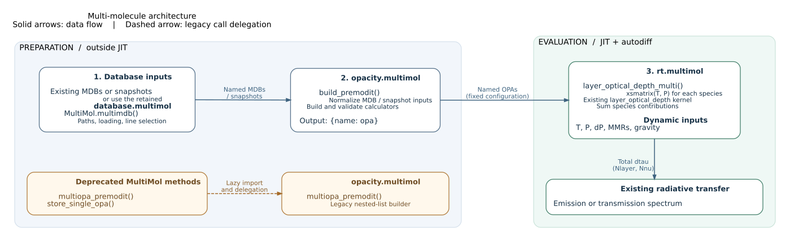

Multiple molecules
==================

Use molecule names as dictionary keys to connect databases, opacity calculators,
and abundances. ``build_premodit`` creates a dictionary of opacity calculators;
``layer_optical_depth_multi`` combines their line absorption into the optical
depth matrix consumed by the radiative-transfer solver.

How the three stages fit together
------------------------------------

Database preparation, opacity construction, and optical-depth evaluation live in
separate modules:

.. list-table::
   :header-rows: 1
   :widths: 28 47 25

   * - Module
     - Responsibility
     - Output
   * - ``exojax.database.multimol``
     - Discover and load databases, select lines, and export snapshots.
     - MDB collections or snapshots
   * - ``exojax.opacity.multimol``
     - Normalize MDB/snapshot inputs, build named opacity calculators, and
       validate their grids and metadata.
     - ``{name: opa}``
   * - ``exojax.rt.multimol``
     - Evaluate each named calculator and sum molecular optical depths using
       the existing ``layer_optical_depth`` kernel.
     - ``dtau`` with shape ``(Nlayer, Nnu)``

   Solid arrows show data flow through preparation and evaluation. The dashed
   arrow shows the deprecated legacy methods delegating to the opacity layer.

The database module is retained. New code can supply MDB objects or snapshots
directly to ``build_premodit`` without creating a ``MultiMol`` instance, as in
the example below. Existing ``MultiMol.multiopa_premodit`` and
``MultiMol.store_single_opa`` calls issue deprecation warnings and import the
opacity builder when called. A database-to-opacity dependency therefore remains
in these compatibility paths.

Loading and opacity construction run before ``jax.jit``. The forward model
captures the prepared calculators, names, and grids as fixed configuration;
temperature, pressure, layer pressure intervals, MMRs, and gravity can vary as
JAX inputs. The RT helper also checks fixed calculator metadata on the host,
including during tracing, while dynamic input checks use array shapes.

Within this organization, ``_load_single_mdb`` centralizes backend construction,
and ``MultiMol`` updates selection metadata only after loading all segments
successfully. ``_normalize_mdb`` exports a snapshot once when the MDB supports
it, so named and legacy opacity builders share the same input conversion.

Two molecules on one grid
-------------------------

This example computes an emission spectrum with H2O and CO absorption near
2.3 micrometers and differentiates it with respect to temperature and abundance.
The model includes molecular lines only; continuum absorption can be added to
the optical depth before radiative transfer.

First, prepare the databases and opacity calculators. The explicit ExoMol paths
select the isotopologues and line lists. The first run can download substantial
line-list data; use the paths to your existing datasets to reuse local files.
See :doc:`../userguide/exomol` for database setup.

.. code-block:: python

    from jax import config

    config.update("jax_enable_x64", True)

    import jax
    import jax.numpy as jnp

    from exojax.database import MdbExomol
    from exojax.opacity.multimol import build_premodit
    from exojax.rt import ArtEmisPure
    from exojax.rt.multimol import layer_optical_depth_multi
    from exojax.utils.grids import wavenumber_grid

    nu_grid, wavelength, resolution = wavenumber_grid(
        22920.0, 23000.0, 2000, unit="AA", xsmode="premodit"
    )
    paths = {
        "H2O": ".database/H2O/1H2-16O/POKAZATEL",
        "CO": ".database/CO/12C-16O/Li2015",
    }
    mdbs = {
        name: MdbExomol(path, nurange=nu_grid, gpu_transfer=False)
        for name, path in paths.items()
    }
    opas = build_premodit(
        mdbs,
        nu_grid,
        auto_trange=(500.0, 1500.0),
        broadening_resolution={"mode": "manual", "value": 0.2},
    )
    del mdbs

``build_premodit`` also accepts ``MDBSnapshot`` values, such as those returned by
``mdb.to_snapshot()``. Its keyword options are passed to ``OpaPremodit``. Each
calculator remains accessible by name, for example ``opas["CO"].xsmatrix(T, P)``.

Now define the atmosphere and the spectrum. ``mmr`` contains mass mixing ratios:
each value can be a scalar or a profile with shape ``(Nlayer,)``. The keys must
match the opacity dictionary. The abundances are used as supplied, without
normalization; the remaining mass can belong to background gases.

.. code-block:: python

    art = ArtEmisPure(
        nu_grid=nu_grid,
        pressure_top=1.0e-3,
        pressure_btm=10.0,
        nlayer=30,
    )
    gravity = 1.0e5  # cm s-2

    @jax.jit
    def spectrum(T0, log_mmr):
        temperature = T0 * (art.pressure / 1.0) ** 0.05
        mmr = {name: 10.0**value for name, value in log_mmr.items()}
        dtau = layer_optical_depth_multi(
            opas,
            temperature,
            art.pressure,
            art.dParr,
            mmr=mmr,
            gravity=gravity,
        )
        return art.run(dtau, temperature)

    log_mmr = {"H2O": -3.0, "CO": -3.0}
    flux = spectrum(1000.0, log_mmr)

``dtau`` has shape ``(Nlayer, Nnu)`` and is the sum of the individual molecular
optical depths. Each molecule uses the mass stored in its opacity calculator,
so no separately ordered molecular-mass array is needed. Pressures and pressure
intervals are in bar, temperatures in K, and gravity in cm s\ :sup:`-2`.

Differentiate a scalar observable, here the mean spectral flux:

.. code-block:: python

    dmean_dT, dmean_dlog_mmr = jax.grad(
        lambda T0, abundances: jnp.mean(spectrum(T0, abundances)),
        argnums=(0, 1),
    )(1000.0, log_mmr)

    print(dmean_dT)
    print(dmean_dlog_mmr["H2O"], dmean_dlog_mmr["CO"])

Keep database loading and opacity construction outside ``jax.jit`` and
``jax.grad``. The prepared calculators and their molecule keys stay fixed while
temperature and abundance values vary. All layer temperatures must remain
within the configured ``auto_trange``.

Reusing calculators and extending the model
--------------------------------------------

Already-created or restored opacity calculators can be passed directly to
``layer_optical_depth_multi``. Validate their common wavenumber grid once before
compiling the forward model:

.. code-block:: python

    from exojax.opacity.multimol import validate_opacity_grids

    validate_opacity_grids(opas)

Calculators must be prepared (``ready=True``) and provide
``xsmatrix(temperature, pressure)`` with dynamic temperature and pressure inputs,
``nu_grid``, and ``molmass`` on the calculator itself, as ``OpaPremodit`` does.
The current ``OpaDiffgrid`` fixed-pressure interface is not supported.
A dictionary can contain PreMODIT calculators constructed with different
per-molecule options. ``build_premodit``
is a convenience for the common case where all molecules use the same options.

For volume mixing ratios, convert each molecule with
``exojax.atm.atmconvert.vmr_to_mmr(vmr, molecular_mass, mean_molecular_weight)``.
The mean molecular weight must describe the full atmosphere, including
background gases such as H2 and He. A molecule without lines in a spectral
interval can still contribute to this atmospheric composition.

Empty line selections raise an error by default. If an MDB or snapshot already
contains an empty selection, ``build_premodit(..., on_empty="zero")`` retains its
name and molecular mass with zero line opacity. This option does not suppress
database-loading errors.

For multiple wavelength intervals, prepare one opacity dictionary per grid and
store them in an outer dictionary, for example with ``"spectroscopy"`` and
``"photometry"`` keys. Call ``layer_optical_depth_multi`` separately for each
interval, using that interval's molecule keys. Different intervals may have
different grid lengths.

The helper preserves each calculator's pressure-broadening model. Passing
abundances weights absorption; it does not add composition-dependent broadening.
Add CIA, clouds, and other continuum contributions with their existing opacity
functions. Correlated-k tables require a separate mixing prescription, such as
``exojax.opacity.ckd.mixing.mix_ckd_rorr``, rather than the line-by-line helper.

Migrating from ``MultiMol``
----------------------------

``MultiMol`` remains available for database discovery and loading.
``MultiMol.multiopa_premodit`` is deprecated; use ``build_premodit`` in the opacity
layer. For an existing single-segment database collection, bind the selected
names to the returned databases:

.. code-block:: python

    # mul is an existing MultiMol instance configured for one segment.
    multimdb = mul.multimdb(nu_grid)
    mdbs = dict(zip(mul.masked_molmulti[0], multimdb[0]))
    opas = build_premodit(mdbs, nu_grid, auto_trange=(500.0, 1500.0))

Use unique keys when combining distinct isotopologues or other separately
parameterized absorbers. Database and opacity dictionaries keep these labels;
they do not infer chemical identity from the key.

For existing nested opacity lists, the builder is also available as
``exojax.opacity.multimol.multiopa_premodit`` with the legacy arguments.
The ``SAMPLE`` mock database backend has been removed from ``MultiMol``;
tests can pass synthetic snapshots or explicitly constructed mock MDBs to the
opacity builder instead.
