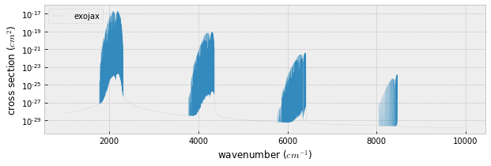
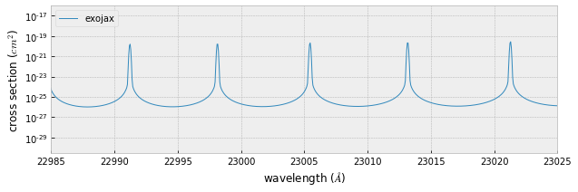

computing CO cross section using HITRAN
---------------------------------------

This tutorial demonstrates how to compute the opacity of CO using HITRAN
steb by step.

.. code:: ipython3

    %load_ext autoreload
    %autoreload 2
    from exojax.spec import xsection
    from exojax.spec.hitran import SijT, doppler_sigma, gamma_hitran, gamma_natural
    from exojax.spec import moldb
    import numpy as np
    import seaborn as sns
    import matplotlib.pyplot as plt
    plt.style.use('bmh')

.. parsed-literal::

    /home/kawahara/anaconda3/lib/python3.7/site-packages/statsmodels/tools/_testing.py:19: FutureWarning: pandas.util.testing is deprecated. Use the functions in the public API at pandas.testing instead.
      import pandas.util.testing as tm

First of all, set a wavenumber bin in the unit of wavenumber (cm-1) and
call moldb instance with the path of par file. If the par file does not
exist, moldb will try to download it from HITRAN website.

.. code:: ipython3

    # Setting wavenumber bins and loading HITRAN database
    nus=np.linspace(1000.0,10000.0,900000,dtype=np.float64) #cm-1
    mdbCO=moldb.MdbHit('/home/kawahara/exojax/data/CO/05_hit12.par',nus)

.. code:: ipython3

    Mmol=28.010446441149536 # molecular weight
    Tfix=1000.0 # we assume T=1000K
    Pfix=1.e-3 # we compute P=1.e-3 bar
    Ppart=Pfix #partial pressure of CO. here we assume a 100% CO atmosphere. 

partition function ratio qt

:math:`q(T) = Q(T_{ref})/Q(T)`; :math:`T_{ref}`\ =296 K

Here, we use the partition function from HAPI

.. code:: ipython3

    qt=mdbCO.Qr_line(Tfix)

Line strength S(T) at temperature of Tfix.

$S (T;s_0,:raw-latex:`\nu`\_0,E_l,q(T)) = S_0
:raw-latex:`\frac{Q(T_\mathrm{ref})}{Q(T)}`
:raw-latex:`\frac{e^{- h c E_l /k_B T}}{e^{- h c E_l /k_B T_\mathrm{ref}}}`
:raw-latex:`\frac{1- e^{- h c \nu /k_B T}}{1-e^{- h c \nu /k_B T_\mathrm{ref}}}`=
:raw-latex:`\frac{ \exp{ \left\{ s_0 - c_2 E_l (T^{-1} - T_\mathrm{ref}^{-1}) \right\}} }{q(T)}`
:raw-latex:`\frac{1- e^{- c_2 \nu_0/ T}}{1-e^{- c_2 \nu_0/T_\mathrm{ref}}}`,
$

:math:`s_0=\log_{10} S_0` : logsij0

:math:`\nu_0`: nu_lines

:math:`E_l` : elower

.. code:: ipython3

    Sij=SijT(Tfix,mdbCO.logsij0,mdbCO.nu_lines,mdbCO.elower,qt)

gamma factor (pressure+natural broadening)

:math:`\gamma_L = \gamma^p_L + \gamma^n_L`

where the pressure broadning

$ :raw-latex:`\gamma`\ *L^p = :raw-latex:`\left`(
:raw-latex:`\frac{T}{296 \mathrm{K}}`
:raw-latex:`\right`)^{-n*\ :raw-latex:`\mathrm{air}`}
:raw-latex:`\left[ \alpha_\mathrm{air} \left( \frac{P - P_\mathrm{part}}{P_\mathrm{atm}}\right) + \alpha_\mathrm{self} \frac{P_\mathrm{part}}{P_\mathrm{atm}} \right] `$

:math:`P_\mathrm{atm}`: 1 atm in the unit of bar (i.e. = 1.01325)

and the natural broadening

$ :raw-latex:`\gamma`\_L^n = :raw-latex:`\frac{A}{4 \pi c}`$

.. code:: ipython3

    gammaL = gamma_hitran(Pfix,Tfix, Ppart, mdbCO.n_air, \
                          mdbCO.gamma_air, mdbCO.gamma_self) \
    + gamma_natural(mdbCO.A) 

Thermal broadening

:math:`\sigma_D^{t} = \sqrt{\frac{k_B T}{M m_u}} \frac{\nu_0}{c}`

.. code:: ipython3

    # thermal doppler sigma
    sigmaD=doppler_sigma(mdbCO.nu_lines,Tfix,Mmol)

.. code:: ipython3

    #line center
    nu0=mdbCO.nu_lines
    
    #Use below if you wanna include a slight pressure line shift
    #nu0=mdbCO.nu_lines+mdbCO.delta_air*Pfix 

.. code:: ipython3

    xsv=xsection(nus,nu0,sigmaD,gammaL,Sij,memory_size=30) #use 30MB GPU MEMORY for numax

.. parsed-literal::

    100%|██████████| 456/456 [00:02<00:00, 161.14it/s]

.. code:: ipython3

    fig=plt.figure(figsize=(10,3))
    ax=fig.add_subplot(111)
    plt.plot(nus,xsv,lw=0.1,label="exojax")
    plt.yscale("log")
    plt.xlabel("wavenumber ($cm^{-1}$)")
    plt.ylabel("cross section ($cm^{2}$)")
    plt.legend(loc="upper left")
    plt.savefig("co_hitran.pdf", bbox_inches="tight", pad_inches=0.0)
    plt.show()

.. code:: ipython3

    fig=plt.figure(figsize=(10,3))
    ax=fig.add_subplot(111)
    plt.plot(1.e8/nus,xsv,lw=1,label="exojax")
    plt.yscale("log")
    plt.xlabel("wavelength ($\AA$)")
    plt.ylabel("cross section ($cm^{2}$)")
    plt.xlim(22985.,23025)
    plt.legend(loc="upper left")
    plt.savefig("co_hitran.pdf", bbox_inches="tight", pad_inches=0.0)
    plt.show()

Important Note
~~~~~~~~~~~~~~

Use float64 for wavenumber bin and line center.

Below, we see the difference of opacity between float64 case and float
32.

.. code:: ipython3

    xsv_32=xsection(np.float32(nus),np.float32(nu0),sigmaD,gammaL,Sij,memory_size=30) 

.. parsed-literal::

      2%|▏         | 9/456 [00:00<00:05, 84.97it/s]

.. parsed-literal::

    Warning!: Type is not np.float64 but  float32
    Warning!: Type is not np.float64 but  float32
    Warning!: Type is not np.float64 but  float32
    Warning!: Type is not np.float64 but  float32
    Warning!: Type is not np.float64 but  float32
    Warning!: Type is not np.float64 but  float32
    Warning!: Type is not np.float64 but  float32
    Warning!: Type is not np.float64 but  float32
    Warning!: Type is not np.float64 but  float32
    Warning!: Type is not np.float64 but  float32
    Warning!: Type is not np.float64 but  float32
    Warning!: Type is not np.float64 but  float32
    Warning!: Type is not np.float64 but  float32
    Warning!: Type is not np.float64 but  float32
    Warning!: Type is not np.float64 but  float32
    Warning!: Type is not np.float64 but  float32
    Warning!: Type is not np.float64 but  float32
    Warning!: Type is not np.float64 but  float32
    Warning!: Type is not np.float64 but  float32
    Warning!: Type is not np.float64 but  float32
    Warning!: Type is not np.float64 but  float32
    Warning!: Type is not np.float64 but  float32
    Warning!: Type is not np.float64 but  float32
    Warning!: Type is not np.float64 but  float32
    Warning!: Type is not np.float64 but  float32
    Warning!: Type is not np.float64 but  float32
    Warning!: Type is not np.float64 but  float32
    Warning!: Type is not np.float64 but  float32
    Warning!: Type is not np.float64 but  float32
    Warning!: Type is not np.float64 but  float32
    Warning!: Type is not np.float64 but  float32
    Warning!: Type is not np.float64 but  float32
    Warning!: Type is not np.float64 but  float32
    Warning!: Type is not np.float64 but  float32
    Warning!: Type is not np.float64 but  float32
    Warning!: Type is not np.float64 but  float32

.. parsed-literal::

      8%|▊         | 35/456 [00:00<00:04, 101.30it/s]

.. parsed-literal::

    Warning!: Type is not np.float64 but  float32
    Warning!: Type is not np.float64 but  float32
    Warning!: Type is not np.float64 but  float32
    Warning!: Type is not np.float64 but  float32
    Warning!: Type is not np.float64 but  float32
    Warning!: Type is not np.float64 but  float32
    Warning!: Type is not np.float64 but  float32
    Warning!: Type is not np.float64 but  float32
    Warning!: Type is not np.float64 but  float32
    Warning!: Type is not np.float64 but  float32
    Warning!: Type is not np.float64 but  float32
    Warning!: Type is not np.float64 but  float32
    Warning!: Type is not np.float64 but  float32
    Warning!: Type is not np.float64 but  float32
    Warning!: Type is not np.float64 but  float32
    Warning!: Type is not np.float64 but  float32
    Warning!: Type is not np.float64 but  float32
    Warning!: Type is not np.float64 but  float32
    Warning!: Type is not np.float64 but  float32
    Warning!: Type is not np.float64 but  float32
    Warning!: Type is not np.float64 but  float32
    Warning!: Type is not np.float64 but  float32
    Warning!: Type is not np.float64 but  float32
    Warning!: Type is not np.float64 but  float32
    Warning!: Type is not np.float64 but  float32
    Warning!: Type is not np.float64 but  float32
    Warning!: Type is not np.float64 but  float32
    Warning!: Type is not np.float64 but  float32
    Warning!: Type is not np.float64 but  float32
    Warning!: Type is not np.float64 but  float32
    Warning!: Type is not np.float64 but  float32
    Warning!: Type is not np.float64 but  float32
    Warning!: Type is not np.float64 but  float32
    Warning!: Type is not np.float64 but  float32
    Warning!: Type is not np.float64 but  float32
    Warning!: Type is not np.float64 but  float32
    Warning!: Type is not np.float64 but  float32
    Warning!: Type is not np.float64 but  float32
    Warning!: Type is not np.float64 but  float32
    Warning!: Type is not np.float64 but  float32
    Warning!: Type is not np.float64 but  float32
    Warning!: Type is not np.float64 but  float32
    Warning!: Type is not np.float64 but  float32
    Warning!: Type is not np.float64 but  float32
    Warning!: Type is not np.float64 but  float32
    Warning!: Type is not np.float64 but  float32
    Warning!: Type is not np.float64 but  float32
    Warning!: Type is not np.float64 but  float32
    Warning!: Type is not np.float64 but  float32
    Warning!: Type is not np.float64 but  float32
    Warning!: Type is not np.float64 but  float32
    Warning!: Type is not np.float64 but  float32
    Warning!: Type is not np.float64 but  float32
    Warning!: Type is not np.float64 but  float32
    Warning!: Type is not np.float64 but  float32
    Warning!: Type is not np.float64 but  float32
    Warning!: Type is not np.float64 but  float32
    Warning!: Type is not np.float64 but  float32
    Warning!: Type is not np.float64 but  float32
    Warning!: Type is not np.float64 but  float32
    Warning!: Type is not np.float64 but  float32
    Warning!: Type is not np.float64 but  float32
    Warning!: Type is not np.float64 but  float32
    Warning!: Type is not np.float64 but  float32

.. parsed-literal::

     14%|█▍        | 66/456 [00:00<00:03, 121.61it/s]

.. parsed-literal::

    Warning!: Type is not np.float64 but  float32
    Warning!: Type is not np.float64 but  float32
    Warning!: Type is not np.float64 but  float32
    Warning!: Type is not np.float64 but  float32
    Warning!: Type is not np.float64 but  float32
    Warning!: Type is not np.float64 but  float32
    Warning!: Type is not np.float64 but  float32
    Warning!: Type is not np.float64 but  float32
    Warning!: Type is not np.float64 but  float32
    Warning!: Type is not np.float64 but  float32
    Warning!: Type is not np.float64 but  float32
    Warning!: Type is not np.float64 but  float32
    Warning!: Type is not np.float64 but  float32
    Warning!: Type is not np.float64 but  float32
    Warning!: Type is not np.float64 but  float32
    Warning!: Type is not np.float64 but  float32
    Warning!: Type is not np.float64 but  float32
    Warning!: Type is not np.float64 but  float32
    Warning!: Type is not np.float64 but  float32
    Warning!: Type is not np.float64 but  float32
    Warning!: Type is not np.float64 but  float32
    Warning!: Type is not np.float64 but  float32
    Warning!: Type is not np.float64 but  float32
    Warning!: Type is not np.float64 but  float32
    Warning!: Type is not np.float64 but  float32
    Warning!: Type is not np.float64 but  float32
    Warning!: Type is not np.float64 but  float32
    Warning!: Type is not np.float64 but  float32
    Warning!: Type is not np.float64 but  float32
    Warning!: Type is not np.float64 but  float32
    Warning!: Type is not np.float64 but  float32
    Warning!: Type is not np.float64 but  float32
    Warning!: Type is not np.float64 but  float32
    Warning!: Type is not np.float64 but  float32
    Warning!: Type is not np.float64 but  float32
    Warning!: Type is not np.float64 but  float32
    Warning!: Type is not np.float64 but  float32
    Warning!: Type is not np.float64 but  float32
    Warning!: Type is not np.float64 but  float32
    Warning!: Type is not np.float64 but  float32
    Warning!: Type is not np.float64 but  float32
    Warning!: Type is not np.float64 but  float32
    Warning!: Type is not np.float64 but  float32
    Warning!: Type is not np.float64 but  float32
    Warning!: Type is not np.float64 but  float32
    Warning!: Type is not np.float64 but  float32
    Warning!: Type is not np.float64 but  float32
    Warning!: Type is not np.float64 but  float32
    Warning!: Type is not np.float64 but  float32
    Warning!: Type is not np.float64 but  float32
    Warning!: Type is not np.float64 but  float32
    Warning!: Type is not np.float64 but  float32
    Warning!: Type is not np.float64 but  float32
    Warning!: Type is not np.float64 but  float32
    Warning!: Type is not np.float64 but  float32
    Warning!: Type is not np.float64 but  float32
    Warning!: Type is not np.float64 but  float32
    Warning!: Type is not np.float64 but  float32
    Warning!: Type is not np.float64 but  float32
    Warning!: Type is not np.float64 but  float32

.. parsed-literal::

     21%|██▏       | 98/456 [00:00<00:02, 135.05it/s]

.. parsed-literal::

    Warning!: Type is not np.float64 but  float32
    Warning!: Type is not np.float64 but  float32
    Warning!: Type is not np.float64 but  float32
    Warning!: Type is not np.float64 but  float32
    Warning!: Type is not np.float64 but  float32
    Warning!: Type is not np.float64 but  float32
    Warning!: Type is not np.float64 but  float32
    Warning!: Type is not np.float64 but  float32
    Warning!: Type is not np.float64 but  float32
    Warning!: Type is not np.float64 but  float32
    Warning!: Type is not np.float64 but  float32
    Warning!: Type is not np.float64 but  float32
    Warning!: Type is not np.float64 but  float32
    Warning!: Type is not np.float64 but  float32
    Warning!: Type is not np.float64 but  float32
    Warning!: Type is not np.float64 but  float32
    Warning!: Type is not np.float64 but  float32
    Warning!: Type is not np.float64 but  float32
    Warning!: Type is not np.float64 but  float32
    Warning!: Type is not np.float64 but  float32
    Warning!: Type is not np.float64 but  float32
    Warning!: Type is not np.float64 but  float32
    Warning!: Type is not np.float64 but  float32
    Warning!: Type is not np.float64 but  float32
    Warning!: Type is not np.float64 but  float32
    Warning!: Type is not np.float64 but  float32
    Warning!: Type is not np.float64 but  float32
    Warning!: Type is not np.float64 but  float32
    Warning!: Type is not np.float64 but  float32
    Warning!: Type is not np.float64 but  float32
    Warning!: Type is not np.float64 but  float32
    Warning!: Type is not np.float64 but  float32
    Warning!: Type is not np.float64 but  float32
    Warning!: Type is not np.float64 but  float32
    Warning!: Type is not np.float64 but  float32
    Warning!: Type is not np.float64 but  float32
    Warning!: Type is not np.float64 but  float32
    Warning!: Type is not np.float64 but  float32
    Warning!: Type is not np.float64 but  float32
    Warning!: Type is not np.float64 but  float32
    Warning!: Type is not np.float64 but  float32
    Warning!: Type is not np.float64 but  float32
    Warning!: Type is not np.float64 but  float32
    Warning!: Type is not np.float64 but  float32
    Warning!: Type is not np.float64 but  float32
    Warning!: Type is not np.float64 but  float32
    Warning!: Type is not np.float64 but  float32
    Warning!: Type is not np.float64 but  float32
    Warning!: Type is not np.float64 but  float32
    Warning!: Type is not np.float64 but  float32
    Warning!: Type is not np.float64 but  float32
    Warning!: Type is not np.float64 but  float32
    Warning!: Type is not np.float64 but  float32
    Warning!: Type is not np.float64 but  float32
    Warning!: Type is not np.float64 but  float32
    Warning!: Type is not np.float64 but  float32
    Warning!: Type is not np.float64 but  float32
    Warning!: Type is not np.float64 but  float32
    Warning!: Type is not np.float64 but  float32
    Warning!: Type is not np.float64 but  float32
    Warning!: Type is not np.float64 but  float32
    Warning!: Type is not np.float64 but  float32

.. parsed-literal::

     29%|██▊       | 130/456 [00:00<00:02, 145.80it/s]

.. parsed-literal::

    Warning!: Type is not np.float64 but  float32
    Warning!: Type is not np.float64 but  float32
    Warning!: Type is not np.float64 but  float32
    Warning!: Type is not np.float64 but  float32
    Warning!: Type is not np.float64 but  float32
    Warning!: Type is not np.float64 but  float32
    Warning!: Type is not np.float64 but  float32
    Warning!: Type is not np.float64 but  float32
    Warning!: Type is not np.float64 but  float32
    Warning!: Type is not np.float64 but  float32
    Warning!: Type is not np.float64 but  float32
    Warning!: Type is not np.float64 but  float32
    Warning!: Type is not np.float64 but  float32
    Warning!: Type is not np.float64 but  float32
    Warning!: Type is not np.float64 but  float32
    Warning!: Type is not np.float64 but  float32
    Warning!: Type is not np.float64 but  float32
    Warning!: Type is not np.float64 but  float32
    Warning!: Type is not np.float64 but  float32
    Warning!: Type is not np.float64 but  float32
    Warning!: Type is not np.float64 but  float32
    Warning!: Type is not np.float64 but  float32
    Warning!: Type is not np.float64 but  float32
    Warning!: Type is not np.float64 but  float32
    Warning!: Type is not np.float64 but  float32
    Warning!: Type is not np.float64 but  float32
    Warning!: Type is not np.float64 but  float32
    Warning!: Type is not np.float64 but  float32
    Warning!: Type is not np.float64 but  float32
    Warning!: Type is not np.float64 but  float32
    Warning!: Type is not np.float64 but  float32
    Warning!: Type is not np.float64 but  float32
    Warning!: Type is not np.float64 but  float32
    Warning!: Type is not np.float64 but  float32
    Warning!: Type is not np.float64 but  float32
    Warning!: Type is not np.float64 but  float32
    Warning!: Type is not np.float64 but  float32
    Warning!: Type is not np.float64 but  float32
    Warning!: Type is not np.float64 but  float32
    Warning!: Type is not np.float64 but  float32
    Warning!: Type is not np.float64 but  float32
    Warning!: Type is not np.float64 but  float32
    Warning!: Type is not np.float64 but  float32
    Warning!: Type is not np.float64 but  float32
    Warning!: Type is not np.float64 but  float32
    Warning!: Type is not np.float64 but  float32
    Warning!: Type is not np.float64 but  float32
    Warning!: Type is not np.float64 but  float32
    Warning!: Type is not np.float64 but  float32
    Warning!: Type is not np.float64 but  float32
    Warning!: Type is not np.float64 but  float32
    Warning!: Type is not np.float64 but  float32
    Warning!: Type is not np.float64 but  float32
    Warning!: Type is not np.float64 but  float32
    Warning!: Type is not np.float64 but  float32
    Warning!: Type is not np.float64 but  float32
    Warning!: Type is not np.float64 but  float32
    Warning!: Type is not np.float64 but  float32
    Warning!: Type is not np.float64 but  float32
    Warning!: Type is not np.float64 but  float32
    Warning!: Type is not np.float64 but  float32
    Warning!: Type is not np.float64 but  float32
    Warning!: Type is not np.float64 but  float32
    Warning!: Type is not np.float64 but  float32
    Warning!: Type is not np.float64 but  float32
    Warning!: Type is not np.float64 but  float32

.. parsed-literal::

     36%|███▌      | 164/456 [00:01<00:01, 154.17it/s]

.. parsed-literal::

    Warning!: Type is not np.float64 but  float32
    Warning!: Type is not np.float64 but  float32
    Warning!: Type is not np.float64 but  float32
    Warning!: Type is not np.float64 but  float32
    Warning!: Type is not np.float64 but  float32
    Warning!: Type is not np.float64 but  float32
    Warning!: Type is not np.float64 but  float32
    Warning!: Type is not np.float64 but  float32
    Warning!: Type is not np.float64 but  float32
    Warning!: Type is not np.float64 but  float32
    Warning!: Type is not np.float64 but  float32
    Warning!: Type is not np.float64 but  float32
    Warning!: Type is not np.float64 but  float32
    Warning!: Type is not np.float64 but  float32
    Warning!: Type is not np.float64 but  float32
    Warning!: Type is not np.float64 but  float32
    Warning!: Type is not np.float64 but  float32
    Warning!: Type is not np.float64 but  float32
    Warning!: Type is not np.float64 but  float32
    Warning!: Type is not np.float64 but  float32
    Warning!: Type is not np.float64 but  float32
    Warning!: Type is not np.float64 but  float32
    Warning!: Type is not np.float64 but  float32
    Warning!: Type is not np.float64 but  float32
    Warning!: Type is not np.float64 but  float32
    Warning!: Type is not np.float64 but  float32
    Warning!: Type is not np.float64 but  float32
    Warning!: Type is not np.float64 but  float32
    Warning!: Type is not np.float64 but  float32
    Warning!: Type is not np.float64 but  float32
    Warning!: Type is not np.float64 but  float32
    Warning!: Type is not np.float64 but  float32
    Warning!: Type is not np.float64 but  float32
    Warning!: Type is not np.float64 but  float32
    Warning!: Type is not np.float64 but  float32
    Warning!: Type is not np.float64 but  float32
    Warning!: Type is not np.float64 but  float32
    Warning!: Type is not np.float64 but  float32
    Warning!: Type is not np.float64 but  float32
    Warning!: Type is not np.float64 but  float32
    Warning!: Type is not np.float64 but  float32
    Warning!: Type is not np.float64 but  float32
    Warning!: Type is not np.float64 but  float32
    Warning!: Type is not np.float64 but  float32
    Warning!: Type is not np.float64 but  float32
    Warning!: Type is not np.float64 but  float32
    Warning!: Type is not np.float64 but  float32
    Warning!: Type is not np.float64 but  float32
    Warning!: Type is not np.float64 but  float32
    Warning!: Type is not np.float64 but  float32
    Warning!: Type is not np.float64 but  float32
    Warning!: Type is not np.float64 but  float32
    Warning!: Type is not np.float64 but  float32
    Warning!: Type is not np.float64 but  float32
    Warning!: Type is not np.float64 but  float32
    Warning!: Type is not np.float64 but  float32
    Warning!: Type is not np.float64 but  float32
    Warning!: Type is not np.float64 but  float32
    Warning!: Type is not np.float64 but  float32
    Warning!: Type is not np.float64 but  float32
    Warning!: Type is not np.float64 but  float32
    Warning!: Type is not np.float64 but  float32
    Warning!: Type is not np.float64 but  float32
    Warning!: Type is not np.float64 but  float32
    Warning!: Type is not np.float64 but  float32
    Warning!: Type is not np.float64 but  float32

.. parsed-literal::

     43%|████▎     | 198/456 [00:01<00:01, 158.89it/s]

.. parsed-literal::

    Warning!: Type is not np.float64 but  float32
    Warning!: Type is not np.float64 but  float32
    Warning!: Type is not np.float64 but  float32
    Warning!: Type is not np.float64 but  float32
    Warning!: Type is not np.float64 but  float32
    Warning!: Type is not np.float64 but  float32
    Warning!: Type is not np.float64 but  float32
    Warning!: Type is not np.float64 but  float32
    Warning!: Type is not np.float64 but  float32
    Warning!: Type is not np.float64 but  float32
    Warning!: Type is not np.float64 but  float32
    Warning!: Type is not np.float64 but  float32
    Warning!: Type is not np.float64 but  float32
    Warning!: Type is not np.float64 but  float32
    Warning!: Type is not np.float64 but  float32
    Warning!: Type is not np.float64 but  float32
    Warning!: Type is not np.float64 but  float32
    Warning!: Type is not np.float64 but  float32
    Warning!: Type is not np.float64 but  float32
    Warning!: Type is not np.float64 but  float32
    Warning!: Type is not np.float64 but  float32
    Warning!: Type is not np.float64 but  float32
    Warning!: Type is not np.float64 but  float32
    Warning!: Type is not np.float64 but  float32
    Warning!: Type is not np.float64 but  float32
    Warning!: Type is not np.float64 but  float32
    Warning!: Type is not np.float64 but  float32
    Warning!: Type is not np.float64 but  float32
    Warning!: Type is not np.float64 but  float32
    Warning!: Type is not np.float64 but  float32
    Warning!: Type is not np.float64 but  float32
    Warning!: Type is not np.float64 but  float32
    Warning!: Type is not np.float64 but  float32
    Warning!: Type is not np.float64 but  float32
    Warning!: Type is not np.float64 but  float32
    Warning!: Type is not np.float64 but  float32
    Warning!: Type is not np.float64 but  float32
    Warning!: Type is not np.float64 but  float32
    Warning!: Type is not np.float64 but  float32
    Warning!: Type is not np.float64 but  float32
    Warning!: Type is not np.float64 but  float32
    Warning!: Type is not np.float64 but  float32
    Warning!: Type is not np.float64 but  float32
    Warning!: Type is not np.float64 but  float32
    Warning!: Type is not np.float64 but  float32
    Warning!: Type is not np.float64 but  float32
    Warning!: Type is not np.float64 but  float32
    Warning!: Type is not np.float64 but  float32
    Warning!: Type is not np.float64 but  float32
    Warning!: Type is not np.float64 but  float32
    Warning!: Type is not np.float64 but  float32
    Warning!: Type is not np.float64 but  float32
    Warning!: Type is not np.float64 but  float32
    Warning!: Type is not np.float64 but  float32
    Warning!: Type is not np.float64 but  float32
    Warning!: Type is not np.float64 but  float32
    Warning!: Type is not np.float64 but  float32
    Warning!: Type is not np.float64 but  float32
    Warning!: Type is not np.float64 but  float32
    Warning!: Type is not np.float64 but  float32
    Warning!: Type is not np.float64 but  float32
    Warning!: Type is not np.float64 but  float32
    Warning!: Type is not np.float64 but  float32
    Warning!: Type is not np.float64 but  float32
    Warning!: Type is not np.float64 but  float32
    Warning!: Type is not np.float64 but  float32

.. parsed-literal::

     51%|█████     | 232/456 [00:01<00:01, 161.32it/s]

.. parsed-literal::

    Warning!: Type is not np.float64 but  float32
    Warning!: Type is not np.float64 but  float32
    Warning!: Type is not np.float64 but  float32
    Warning!: Type is not np.float64 but  float32
    Warning!: Type is not np.float64 but  float32
    Warning!: Type is not np.float64 but  float32
    Warning!: Type is not np.float64 but  float32
    Warning!: Type is not np.float64 but  float32
    Warning!: Type is not np.float64 but  float32
    Warning!: Type is not np.float64 but  float32
    Warning!: Type is not np.float64 but  float32
    Warning!: Type is not np.float64 but  float32
    Warning!: Type is not np.float64 but  float32
    Warning!: Type is not np.float64 but  float32
    Warning!: Type is not np.float64 but  float32
    Warning!: Type is not np.float64 but  float32
    Warning!: Type is not np.float64 but  float32
    Warning!: Type is not np.float64 but  float32
    Warning!: Type is not np.float64 but  float32
    Warning!: Type is not np.float64 but  float32
    Warning!: Type is not np.float64 but  float32
    Warning!: Type is not np.float64 but  float32
    Warning!: Type is not np.float64 but  float32
    Warning!: Type is not np.float64 but  float32
    Warning!: Type is not np.float64 but  float32
    Warning!: Type is not np.float64 but  float32
    Warning!: Type is not np.float64 but  float32
    Warning!: Type is not np.float64 but  float32
    Warning!: Type is not np.float64 but  float32
    Warning!: Type is not np.float64 but  float32
    Warning!: Type is not np.float64 but  float32
    Warning!: Type is not np.float64 but  float32
    Warning!: Type is not np.float64 but  float32
    Warning!: Type is not np.float64 but  float32
    Warning!: Type is not np.float64 but  float32
    Warning!: Type is not np.float64 but  float32
    Warning!: Type is not np.float64 but  float32
    Warning!: Type is not np.float64 but  float32
    Warning!: Type is not np.float64 but  float32
    Warning!: Type is not np.float64 but  float32
    Warning!: Type is not np.float64 but  float32
    Warning!: Type is not np.float64 but  float32
    Warning!: Type is not np.float64 but  float32
    Warning!: Type is not np.float64 but  float32
    Warning!: Type is not np.float64 but  float32
    Warning!: Type is not np.float64 but  float32
    Warning!: Type is not np.float64 but  float32
    Warning!: Type is not np.float64 but  float32
    Warning!: Type is not np.float64 but  float32
    Warning!: Type is not np.float64 but  float32
    Warning!: Type is not np.float64 but  float32
    Warning!: Type is not np.float64 but  float32
    Warning!: Type is not np.float64 but  float32
    Warning!: Type is not np.float64 but  float32
    Warning!: Type is not np.float64 but  float32
    Warning!: Type is not np.float64 but  float32
    Warning!: Type is not np.float64 but  float32
    Warning!: Type is not np.float64 but  float32
    Warning!: Type is not np.float64 but  float32
    Warning!: Type is not np.float64 but  float32
    Warning!: Type is not np.float64 but  float32
    Warning!: Type is not np.float64 but  float32
    Warning!: Type is not np.float64 but  float32
    Warning!: Type is not np.float64 but  float32
    Warning!: Type is not np.float64 but  float32
    Warning!: Type is not np.float64 but  float32
    Warning!: Type is not np.float64 but  float32
    Warning!: Type is not np.float64 but  float32

.. parsed-literal::

     58%|█████▊    | 266/456 [00:01<00:01, 163.13it/s]

.. parsed-literal::

    Warning!: Type is not np.float64 but  float32
    Warning!: Type is not np.float64 but  float32
    Warning!: Type is not np.float64 but  float32
    Warning!: Type is not np.float64 but  float32
    Warning!: Type is not np.float64 but  float32
    Warning!: Type is not np.float64 but  float32
    Warning!: Type is not np.float64 but  float32
    Warning!: Type is not np.float64 but  float32
    Warning!: Type is not np.float64 but  float32
    Warning!: Type is not np.float64 but  float32
    Warning!: Type is not np.float64 but  float32
    Warning!: Type is not np.float64 but  float32
    Warning!: Type is not np.float64 but  float32
    Warning!: Type is not np.float64 but  float32
    Warning!: Type is not np.float64 but  float32
    Warning!: Type is not np.float64 but  float32
    Warning!: Type is not np.float64 but  float32
    Warning!: Type is not np.float64 but  float32
    Warning!: Type is not np.float64 but  float32
    Warning!: Type is not np.float64 but  float32
    Warning!: Type is not np.float64 but  float32
    Warning!: Type is not np.float64 but  float32
    Warning!: Type is not np.float64 but  float32
    Warning!: Type is not np.float64 but  float32
    Warning!: Type is not np.float64 but  float32
    Warning!: Type is not np.float64 but  float32
    Warning!: Type is not np.float64 but  float32
    Warning!: Type is not np.float64 but  float32
    Warning!: Type is not np.float64 but  float32
    Warning!: Type is not np.float64 but  float32
    Warning!: Type is not np.float64 but  float32
    Warning!: Type is not np.float64 but  float32
    Warning!: Type is not np.float64 but  float32
    Warning!: Type is not np.float64 but  float32
    Warning!: Type is not np.float64 but  float32
    Warning!: Type is not np.float64 but  float32
    Warning!: Type is not np.float64 but  float32
    Warning!: Type is not np.float64 but  float32
    Warning!: Type is not np.float64 but  float32
    Warning!: Type is not np.float64 but  float32
    Warning!: Type is not np.float64 but  float32
    Warning!: Type is not np.float64 but  float32
    Warning!: Type is not np.float64 but  float32
    Warning!: Type is not np.float64 but  float32
    Warning!: Type is not np.float64 but  float32
    Warning!: Type is not np.float64 but  float32
    Warning!: Type is not np.float64 but  float32
    Warning!: Type is not np.float64 but  float32
    Warning!: Type is not np.float64 but  float32
    Warning!: Type is not np.float64 but  float32
    Warning!: Type is not np.float64 but  float32
    Warning!: Type is not np.float64 but  float32
    Warning!: Type is not np.float64 but  float32
    Warning!: Type is not np.float64 but  float32
    Warning!: Type is not np.float64 but  float32
    Warning!: Type is not np.float64 but  float32
    Warning!: Type is not np.float64 but  float32
    Warning!: Type is not np.float64 but  float32
    Warning!: Type is not np.float64 but  float32
    Warning!: Type is not np.float64 but  float32
    Warning!: Type is not np.float64 but  float32
    Warning!: Type is not np.float64 but  float32
    Warning!: Type is not np.float64 but  float32
    Warning!: Type is not np.float64 but  float32
    Warning!: Type is not np.float64 but  float32
    Warning!: Type is not np.float64 but  float32

.. parsed-literal::

     66%|██████▌   | 300/456 [00:01<00:00, 163.78it/s]

.. parsed-literal::

    Warning!: Type is not np.float64 but  float32
    Warning!: Type is not np.float64 but  float32
    Warning!: Type is not np.float64 but  float32
    Warning!: Type is not np.float64 but  float32
    Warning!: Type is not np.float64 but  float32
    Warning!: Type is not np.float64 but  float32
    Warning!: Type is not np.float64 but  float32
    Warning!: Type is not np.float64 but  float32
    Warning!: Type is not np.float64 but  float32
    Warning!: Type is not np.float64 but  float32
    Warning!: Type is not np.float64 but  float32
    Warning!: Type is not np.float64 but  float32
    Warning!: Type is not np.float64 but  float32
    Warning!: Type is not np.float64 but  float32
    Warning!: Type is not np.float64 but  float32
    Warning!: Type is not np.float64 but  float32
    Warning!: Type is not np.float64 but  float32
    Warning!: Type is not np.float64 but  float32
    Warning!: Type is not np.float64 but  float32
    Warning!: Type is not np.float64 but  float32
    Warning!: Type is not np.float64 but  float32
    Warning!: Type is not np.float64 but  float32
    Warning!: Type is not np.float64 but  float32
    Warning!: Type is not np.float64 but  float32
    Warning!: Type is not np.float64 but  float32
    Warning!: Type is not np.float64 but  float32
    Warning!: Type is not np.float64 but  float32
    Warning!: Type is not np.float64 but  float32
    Warning!: Type is not np.float64 but  float32
    Warning!: Type is not np.float64 but  float32
    Warning!: Type is not np.float64 but  float32
    Warning!: Type is not np.float64 but  float32
    Warning!: Type is not np.float64 but  float32
    Warning!: Type is not np.float64 but  float32
    Warning!: Type is not np.float64 but  float32
    Warning!: Type is not np.float64 but  float32
    Warning!: Type is not np.float64 but  float32
    Warning!: Type is not np.float64 but  float32
    Warning!: Type is not np.float64 but  float32
    Warning!: Type is not np.float64 but  float32
    Warning!: Type is not np.float64 but  float32
    Warning!: Type is not np.float64 but  float32
    Warning!: Type is not np.float64 but  float32
    Warning!: Type is not np.float64 but  float32
    Warning!: Type is not np.float64 but  float32
    Warning!: Type is not np.float64 but  float32
    Warning!: Type is not np.float64 but  float32
    Warning!: Type is not np.float64 but  float32
    Warning!: Type is not np.float64 but  float32
    Warning!: Type is not np.float64 but  float32
    Warning!: Type is not np.float64 but  float32
    Warning!: Type is not np.float64 but  float32
    Warning!: Type is not np.float64 but  float32
    Warning!: Type is not np.float64 but  float32
    Warning!: Type is not np.float64 but  float32
    Warning!: Type is not np.float64 but  float32
    Warning!: Type is not np.float64 but  float32
    Warning!: Type is not np.float64 but  float32
    Warning!: Type is not np.float64 but  float32
    Warning!: Type is not np.float64 but  float32
    Warning!: Type is not np.float64 but  float32
    Warning!: Type is not np.float64 but  float32
    Warning!: Type is not np.float64 but  float32
    Warning!: Type is not np.float64 but  float32
    Warning!: Type is not np.float64 but  float32
    Warning!: Type is not np.float64 but  float32

.. parsed-literal::

     73%|███████▎  | 334/456 [00:02<00:00, 160.99it/s]

.. parsed-literal::

    Warning!: Type is not np.float64 but  float32
    Warning!: Type is not np.float64 but  float32
    Warning!: Type is not np.float64 but  float32
    Warning!: Type is not np.float64 but  float32
    Warning!: Type is not np.float64 but  float32
    Warning!: Type is not np.float64 but  float32
    Warning!: Type is not np.float64 but  float32
    Warning!: Type is not np.float64 but  float32
    Warning!: Type is not np.float64 but  float32
    Warning!: Type is not np.float64 but  float32
    Warning!: Type is not np.float64 but  float32
    Warning!: Type is not np.float64 but  float32
    Warning!: Type is not np.float64 but  float32
    Warning!: Type is not np.float64 but  float32
    Warning!: Type is not np.float64 but  float32
    Warning!: Type is not np.float64 but  float32
    Warning!: Type is not np.float64 but  float32
    Warning!: Type is not np.float64 but  float32
    Warning!: Type is not np.float64 but  float32
    Warning!: Type is not np.float64 but  float32
    Warning!: Type is not np.float64 but  float32
    Warning!: Type is not np.float64 but  float32
    Warning!: Type is not np.float64 but  float32
    Warning!: Type is not np.float64 but  float32
    Warning!: Type is not np.float64 but  float32
    Warning!: Type is not np.float64 but  float32
    Warning!: Type is not np.float64 but  float32
    Warning!: Type is not np.float64 but  float32
    Warning!: Type is not np.float64 but  float32
    Warning!: Type is not np.float64 but  float32
    Warning!: Type is not np.float64 but  float32
    Warning!: Type is not np.float64 but  float32
    Warning!: Type is not np.float64 but  float32
    Warning!: Type is not np.float64 but  float32
    Warning!: Type is not np.float64 but  float32
    Warning!: Type is not np.float64 but  float32
    Warning!: Type is not np.float64 but  float32
    Warning!: Type is not np.float64 but  float32
    Warning!: Type is not np.float64 but  float32
    Warning!: Type is not np.float64 but  float32
    Warning!: Type is not np.float64 but  float32
    Warning!: Type is not np.float64 but  float32
    Warning!: Type is not np.float64 but  float32
    Warning!: Type is not np.float64 but  float32
    Warning!: Type is not np.float64 but  float32
    Warning!: Type is not np.float64 but  float32
    Warning!: Type is not np.float64 but  float32
    Warning!: Type is not np.float64 but  float32
    Warning!: Type is not np.float64 but  float32
    Warning!: Type is not np.float64 but  float32
    Warning!: Type is not np.float64 but  float32
    Warning!: Type is not np.float64 but  float32
    Warning!: Type is not np.float64 but  float32
    Warning!: Type is not np.float64 but  float32
    Warning!: Type is not np.float64 but  float32
    Warning!: Type is not np.float64 but  float32
    Warning!: Type is not np.float64 but  float32
    Warning!: Type is not np.float64 but  float32
    Warning!: Type is not np.float64 but  float32
    Warning!: Type is not np.float64 but  float32
    Warning!: Type is not np.float64 but  float32
    Warning!: Type is not np.float64 but  float32
    Warning!: Type is not np.float64 but  float32
    Warning!: Type is not np.float64 but  float32

.. parsed-literal::

     80%|████████  | 367/456 [00:02<00:00, 159.69it/s]

.. parsed-literal::

    Warning!: Type is not np.float64 but  float32
    Warning!: Type is not np.float64 but  float32
    Warning!: Type is not np.float64 but  float32
    Warning!: Type is not np.float64 but  float32
    Warning!: Type is not np.float64 but  float32
    Warning!: Type is not np.float64 but  float32
    Warning!: Type is not np.float64 but  float32
    Warning!: Type is not np.float64 but  float32
    Warning!: Type is not np.float64 but  float32
    Warning!: Type is not np.float64 but  float32
    Warning!: Type is not np.float64 but  float32
    Warning!: Type is not np.float64 but  float32
    Warning!: Type is not np.float64 but  float32
    Warning!: Type is not np.float64 but  float32
    Warning!: Type is not np.float64 but  float32
    Warning!: Type is not np.float64 but  float32
    Warning!: Type is not np.float64 but  float32
    Warning!: Type is not np.float64 but  float32
    Warning!: Type is not np.float64 but  float32
    Warning!: Type is not np.float64 but  float32
    Warning!: Type is not np.float64 but  float32
    Warning!: Type is not np.float64 but  float32
    Warning!: Type is not np.float64 but  float32
    Warning!: Type is not np.float64 but  float32
    Warning!: Type is not np.float64 but  float32
    Warning!: Type is not np.float64 but  float32
    Warning!: Type is not np.float64 but  float32
    Warning!: Type is not np.float64 but  float32
    Warning!: Type is not np.float64 but  float32
    Warning!: Type is not np.float64 but  float32
    Warning!: Type is not np.float64 but  float32
    Warning!: Type is not np.float64 but  float32
    Warning!: Type is not np.float64 but  float32
    Warning!: Type is not np.float64 but  float32
    Warning!: Type is not np.float64 but  float32
    Warning!: Type is not np.float64 but  float32
    Warning!: Type is not np.float64 but  float32
    Warning!: Type is not np.float64 but  float32
    Warning!: Type is not np.float64 but  float32
    Warning!: Type is not np.float64 but  float32
    Warning!: Type is not np.float64 but  float32
    Warning!: Type is not np.float64 but  float32
    Warning!: Type is not np.float64 but  float32
    Warning!: Type is not np.float64 but  float32
    Warning!: Type is not np.float64 but  float32
    Warning!: Type is not np.float64 but  float32
    Warning!: Type is not np.float64 but  float32
    Warning!: Type is not np.float64 but  float32
    Warning!: Type is not np.float64 but  float32
    Warning!: Type is not np.float64 but  float32
    Warning!: Type is not np.float64 but  float32
    Warning!: Type is not np.float64 but  float32
    Warning!: Type is not np.float64 but  float32
    Warning!: Type is not np.float64 but  float32
    Warning!: Type is not np.float64 but  float32
    Warning!: Type is not np.float64 but  float32
    Warning!: Type is not np.float64 but  float32
    Warning!: Type is not np.float64 but  float32
    Warning!: Type is not np.float64 but  float32
    Warning!: Type is not np.float64 but  float32
    Warning!: Type is not np.float64 but  float32
    Warning!: Type is not np.float64 but  float32
    Warning!: Type is not np.float64 but  float32
    Warning!: Type is not np.float64 but  float32

.. parsed-literal::

     88%|████████▊ | 400/456 [00:02<00:00, 159.57it/s]

.. parsed-literal::

    Warning!: Type is not np.float64 but  float32
    Warning!: Type is not np.float64 but  float32
    Warning!: Type is not np.float64 but  float32
    Warning!: Type is not np.float64 but  float32
    Warning!: Type is not np.float64 but  float32
    Warning!: Type is not np.float64 but  float32
    Warning!: Type is not np.float64 but  float32
    Warning!: Type is not np.float64 but  float32
    Warning!: Type is not np.float64 but  float32
    Warning!: Type is not np.float64 but  float32
    Warning!: Type is not np.float64 but  float32
    Warning!: Type is not np.float64 but  float32
    Warning!: Type is not np.float64 but  float32
    Warning!: Type is not np.float64 but  float32
    Warning!: Type is not np.float64 but  float32
    Warning!: Type is not np.float64 but  float32
    Warning!: Type is not np.float64 but  float32
    Warning!: Type is not np.float64 but  float32
    Warning!: Type is not np.float64 but  float32
    Warning!: Type is not np.float64 but  float32
    Warning!: Type is not np.float64 but  float32
    Warning!: Type is not np.float64 but  float32
    Warning!: Type is not np.float64 but  float32
    Warning!: Type is not np.float64 but  float32
    Warning!: Type is not np.float64 but  float32
    Warning!: Type is not np.float64 but  float32
    Warning!: Type is not np.float64 but  float32
    Warning!: Type is not np.float64 but  float32
    Warning!: Type is not np.float64 but  float32
    Warning!: Type is not np.float64 but  float32
    Warning!: Type is not np.float64 but  float32
    Warning!: Type is not np.float64 but  float32
    Warning!: Type is not np.float64 but  float32
    Warning!: Type is not np.float64 but  float32
    Warning!: Type is not np.float64 but  float32
    Warning!: Type is not np.float64 but  float32
    Warning!: Type is not np.float64 but  float32
    Warning!: Type is not np.float64 but  float32
    Warning!: Type is not np.float64 but  float32
    Warning!: Type is not np.float64 but  float32
    Warning!: Type is not np.float64 but  float32
    Warning!: Type is not np.float64 but  float32
    Warning!: Type is not np.float64 but  float32
    Warning!: Type is not np.float64 but  float32
    Warning!: Type is not np.float64 but  float32
    Warning!: Type is not np.float64 but  float32
    Warning!: Type is not np.float64 but  float32
    Warning!: Type is not np.float64 but  float32
    Warning!: Type is not np.float64 but  float32
    Warning!: Type is not np.float64 but  float32
    Warning!: Type is not np.float64 but  float32
    Warning!: Type is not np.float64 but  float32
    Warning!: Type is not np.float64 but  float32
    Warning!: Type is not np.float64 but  float32
    Warning!: Type is not np.float64 but  float32
    Warning!: Type is not np.float64 but  float32
    Warning!: Type is not np.float64 but  float32
    Warning!: Type is not np.float64 but  float32
    Warning!: Type is not np.float64 but  float32
    Warning!: Type is not np.float64 but  float32
    Warning!: Type is not np.float64 but  float32
    Warning!: Type is not np.float64 but  float32
    Warning!: Type is not np.float64 but  float32
    Warning!: Type is not np.float64 but  float32

.. parsed-literal::

     95%|█████████▍| 432/456 [00:02<00:00, 153.62it/s]

.. parsed-literal::

    Warning!: Type is not np.float64 but  float32
    Warning!: Type is not np.float64 but  float32
    Warning!: Type is not np.float64 but  float32
    Warning!: Type is not np.float64 but  float32
    Warning!: Type is not np.float64 but  float32
    Warning!: Type is not np.float64 but  float32
    Warning!: Type is not np.float64 but  float32
    Warning!: Type is not np.float64 but  float32
    Warning!: Type is not np.float64 but  float32
    Warning!: Type is not np.float64 but  float32
    Warning!: Type is not np.float64 but  float32
    Warning!: Type is not np.float64 but  float32
    Warning!: Type is not np.float64 but  float32
    Warning!: Type is not np.float64 but  float32
    Warning!: Type is not np.float64 but  float32
    Warning!: Type is not np.float64 but  float32
    Warning!: Type is not np.float64 but  float32
    Warning!: Type is not np.float64 but  float32
    Warning!: Type is not np.float64 but  float32
    Warning!: Type is not np.float64 but  float32
    Warning!: Type is not np.float64 but  float32
    Warning!: Type is not np.float64 but  float32
    Warning!: Type is not np.float64 but  float32
    Warning!: Type is not np.float64 but  float32
    Warning!: Type is not np.float64 but  float32
    Warning!: Type is not np.float64 but  float32
    Warning!: Type is not np.float64 but  float32
    Warning!: Type is not np.float64 but  float32
    Warning!: Type is not np.float64 but  float32
    Warning!: Type is not np.float64 but  float32
    Warning!: Type is not np.float64 but  float32
    Warning!: Type is not np.float64 but  float32
    Warning!: Type is not np.float64 but  float32
    Warning!: Type is not np.float64 but  float32
    Warning!: Type is not np.float64 but  float32
    Warning!: Type is not np.float64 but  float32
    Warning!: Type is not np.float64 but  float32
    Warning!: Type is not np.float64 but  float32
    Warning!: Type is not np.float64 but  float32
    Warning!: Type is not np.float64 but  float32
    Warning!: Type is not np.float64 but  float32
    Warning!: Type is not np.float64 but  float32
    Warning!: Type is not np.float64 but  float32
    Warning!: Type is not np.float64 but  float32
    Warning!: Type is not np.float64 but  float32
    Warning!: Type is not np.float64 but  float32
    Warning!: Type is not np.float64 but  float32
    Warning!: Type is not np.float64 but  float32
    Warning!: Type is not np.float64 but  float32
    Warning!: Type is not np.float64 but  float32
    Warning!: Type is not np.float64 but  float32
    Warning!: Type is not np.float64 but  float32
    Warning!: Type is not np.float64 but  float32
    Warning!: Type is not np.float64 but  float32
    Warning!: Type is not np.float64 but  float32
    Warning!: Type is not np.float64 but  float32
    Warning!: Type is not np.float64 but  float32
    Warning!: Type is not np.float64 but  float32
    Warning!: Type is not np.float64 but  float32
    Warning!: Type is not np.float64 but  float32

.. parsed-literal::

    100%|██████████| 456/456 [00:02<00:00, 153.59it/s]

.. parsed-literal::

    Warning!: Type is not np.float64 but  float32
    Warning!: Type is not np.float64 but  float32
    Warning!: Type is not np.float64 but  float32
    Warning!: Type is not np.float64 but  float32
    Warning!: Type is not np.float64 but  float32
    Warning!: Type is not np.float64 but  float32
    Warning!: Type is not np.float64 but  float32
    Warning!: Type is not np.float64 but  float32
    Warning!: Type is not np.float64 but  float32
    Warning!: Type is not np.float64 but  float32
    Warning!: Type is not np.float64 but  float32
    Warning!: Type is not np.float64 but  float32
    Warning!: Type is not np.float64 but  float32
    Warning!: Type is not np.float64 but  float32
    Warning!: Type is not np.float64 but  float32
    Warning!: Type is not np.float64 but  float32
    Warning!: Type is not np.float64 but  float32
    Warning!: Type is not np.float64 but  float32
    Warning!: Type is not np.float64 but  float32
    Warning!: Type is not np.float64 but  float32
    Warning!: Type is not np.float64 but  float32
    Warning!: Type is not np.float64 but  float32
    Warning!: Type is not np.float64 but  float32
    Warning!: Type is not np.float64 but  float32
    Warning!: Type is not np.float64 but  float32
    Warning!: Type is not np.float64 but  float32
    Warning!: Type is not np.float64 but  float32
    Warning!: Type is not np.float64 but  float32
    Warning!: Type is not np.float64 but  float32
    Warning!: Type is not np.float64 but  float32
    Warning!: Type is not np.float64 but  float32
    Warning!: Type is not np.float64 but  float32
    Warning!: Type is not np.float64 but  float32
    Warning!: Type is not np.float64 but  float32
    Warning!: Type is not np.float64 but  float32
    Warning!: Type is not np.float64 but  float32
    Warning!: Type is not np.float64 but  float32
    Warning!: Type is not np.float64 but  float32
    Warning!: Type is not np.float64 but  float32
    Warning!: Type is not np.float64 but  float32

.. parsed-literal::

    

.. code:: ipython3

    fig=plt.figure(figsize=(10,6))
    ax=fig.add_subplot(211)
    plt.plot(1.e8/nus,xsv,".",lw=1,label="64",markersize=1)
    plt.plot(1.e8/nus,xsv_32,".",lw=1,label="32",markersize=1)
    plt.xlim(22985.,23025)
    plt.yscale("log")
    plt.ylabel("xsv $cm^{2}$")
    ax=fig.add_subplot(212)
    plt.plot(1.e8/nus,(xsv_32-xsv)/xsv,lw=1,label="difference")
    plt.xlabel("wavelength ($\AA$)")
    plt.ylabel("Difference")
    plt.xlim(22985.,23025)
    plt.legend(loc="upper left")
    plt.show()

We found ~ 10 % error when using float32 as an wavenumber and line
center

