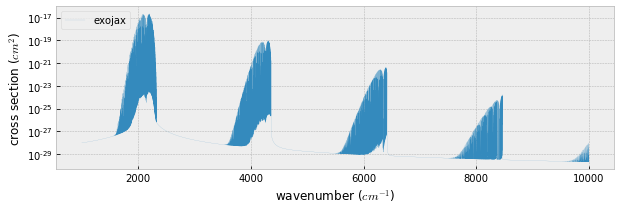
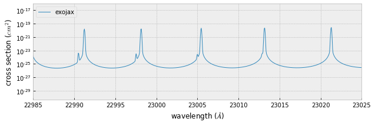

CO cross section using ExoMol
---------------------------------------

This tutorial demonstrates how to compute the opacity of CO using ExoMol
step by step.

.. code:: ipython3

    from exojax.spec import xsection
    from exojax.spec import SijT, doppler_sigma,  gamma_natural
    from exojax.spec.exomol import gamma_exomol
    from exojax.spec import moldb
    import numpy as np
    import seaborn as sns
    import matplotlib.pyplot as plt
    plt.style.use('bmh')

First of all, set a wavenumber bin in the unit of wavenumber (cm-1).
Here we set the wavenumber range as :math:`1000 \le \nu \le 10000`
(1/cm) with the resolution of 0.01 (1/cm).

We call moldb instance with the path of exomole files.

.. code:: ipython3

    # Setting wavenumber bins and loading HITRAN database
    nus=np.linspace(1000.0,10000.0,900000,dtype=np.float64) #cm-1
    emf='/home/kawahara/exojax/data/exomol/CO/12C-16O/Li2015/12C-16O__Li2015'
    mdbCO=moldb.MdbExomol(emf,nus)

.. parsed-literal::

    Mol mass= 28.0101
    gamma width= 0.07
    T exponent= 0.5

Define molecular weight of CO (:math:`\sim 12+16=28`), temperature (K),
and pressure (bar). Also, we here assume the 100 % CO atmosphere,
i.e. the partial pressure = pressure.

.. code:: ipython3

    Mmol=28.010446441149536 # molecular weight
    Tfix=1000.0 # we assume T=1000K
    Pfix=1.e-3 # we compute P=1.e-3 bar

partition function ratio :math:`q(T)` is defined by

:math:`q(T) = Q(T)/Q(T_{ref})`; :math:`T_{ref}`\ =296 K

Here, we use the partition function from the interpolation of partition function

.. code:: ipython3

    qt=mdbCO.qr_interp(Tfix)

Let us compute the line strength S(T) at temperature of Tfix.

:math:`S (T;s_0,\nu_0,E_l,q(T)) = S_0 \frac{Q(T_{ref})}{Q(T)} \frac{e^{- h c E_l /k_B T}}{e^{- h c E_l /k_B T_{ref}}} \frac{1- e^{- h c \nu /k_B T}}{1-e^{- h c \nu /k_B T_{ref}}}= q_r(T)^{-1} e^{ s_0 - c_2 E_l (T^{-1} - T_{ref}^{-1})} \frac{1- e^{- c_2 \nu_0/ T}}{1-e^{- c_2 \nu_0/T_{ref}}}`

:math:`s_0=\log_{e} S_0` : logsij0

:math:`\nu_0`: nu_lines

:math:`E_l` : elower

Why the input is :math:`s_0 = \log_{e} S_0` instead of :math:`S_0` in
SijT? This is because the direct value of :math:`S_0` is quite small and
we need to use float32 for jax.

.. code:: ipython3

    Sij=SijT(Tfix,mdbCO.logsij0,mdbCO.nu_lines,mdbCO.elower,qt)

Then, compute the Lorentz gamma factor (pressure+natural broadening)

:math:`\gamma_L = \gamma^p_L + \gamma^n_L`

where the pressure broadning

:math:`\gamma^p_L = \alpha_{ref} ( T/T_{ref})^{-n_{texp}} (P/P_{ref})`

and the natural broadening

:math:`\gamma^n_L = \frac{A}{4 \pi c}`

.. code:: ipython3

    gammaL = gamma_exomol(Pfix,Tfix,mdbCO.n_Texp,mdbCO.alpha_ref)\
    + gamma_natural(mdbCO.A) 

Thermal broadening

:math:`\sigma_D^{t} = \sqrt{\frac{k_B T}{M m_u}} \frac{\nu_0}{c}`

.. code:: ipython3

    # thermal doppler sigma
    sigmaD=doppler_sigma(mdbCO.nu_lines,Tfix,Mmol)

Then, the line center…

.. code:: ipython3

    #line center
    nu0=mdbCO.nu_lines

Although it depends on your GPU, you might need to devide the
computation into multiple loops because of the limitation of the GPU
memory. Here we assume 30MB for GPU memory (not exactly, memory size for
numatrix).

.. code:: ipython3

    xsv=xsection(nus,nu0,sigmaD,gammaL,Sij,memory_size=30) #use 30MB GPU MEMORY for numax

.. parsed-literal::

    100%|██████████| 8572/8572 [00:54<00:00, 158.12it/s]

Plot it!

.. code:: ipython3

    fig=plt.figure(figsize=(10,3))
    ax=fig.add_subplot(111)
    plt.plot(nus,xsv,lw=0.1,label="exojax")
    plt.yscale("log")
    plt.xlabel("wavenumber ($cm^{-1}$)")
    plt.ylabel("cross section ($cm^{2}$)")
    plt.legend(loc="upper left")
    plt.savefig("co_exomol.pdf", bbox_inches="tight", pad_inches=0.0)
    plt.show()

.. code:: ipython3

    fig=plt.figure(figsize=(10,3))
    ax=fig.add_subplot(111)
    plt.plot(1.e8/nus,xsv,lw=1,label="exojax")
    plt.yscale("log")
    plt.xlabel("wavelength ($\AA$)")
    plt.ylabel("cross section ($cm^{2}$)")
    plt.xlim(22985.,23025)
    plt.legend(loc="upper left")
    plt.savefig("co_exomol.pdf", bbox_inches="tight", pad_inches=0.0)
    plt.show()

