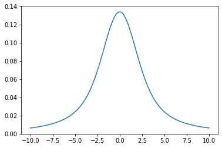
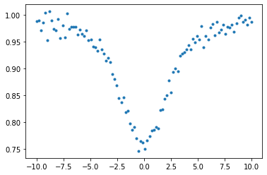
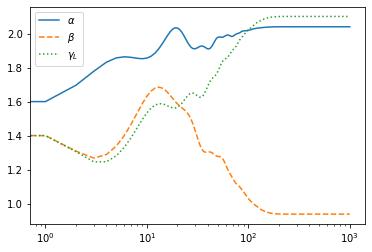
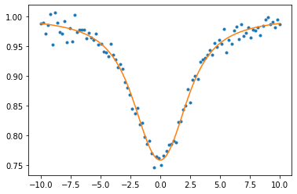
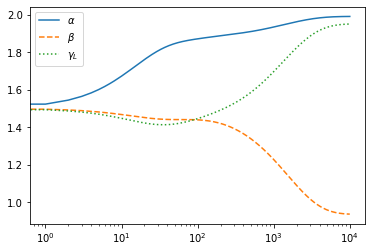

Optimization of a Voigt profile
===============================

*Update: June 12/2021, Hajime Kawahara*

.. code:: ipython3

    from exojax.spec.rlpf import rvoigt
    import jax.numpy as jnp
    import matplotlib.pyplot as plt

Let’s optimize the Voigt function :math:`V(\nu, \beta, \gamma_L)` using
exojax! :math:`V(\nu, \beta, \gamma_L)` is a convolution of a Gaussian
with a STD of :math:`\beta` and a Lorentian with a gamma parameter of
:math:`\gamma_L`.

Note that we use `spec.rlpf.rvoigt <../exojax/exojax.spec.html#exojax.spec.rlpf.rvoigt>`_ instead of spec.voigt. This function
is a voigt profile with VJP while voigt is JVP defined one. For some
reason, we do not use rvoigt as a default function of the voigt profile.
But in future, we plan to replace the VJP version as a default one.

.. code:: ipython3

    nu=jnp.linspace(-10,10,100)
    plt.plot(nu, rvoigt(nu,1.0,2.0)) #beta=1.0, gamma_L=2.0

optimization of a simple absorption model
-----------------------------------------

Next, we try to fit a simple absorption model to mock data. The
absorption model is

:math:`f= e^{-a V(\nu,\beta,\gamma_L)}`

.. code:: ipython3

    def absmodel(nu,a,beta,gamma_L):
        return jnp.exp(-a*rvoigt(nu,beta,gamma_L))

Adding a noise…

.. code:: ipython3

    from numpy.random import normal
    data=absmodel(nu,2.0,1.0,2.0)+normal(0.0,0.01,len(nu))
    plt.plot(nu,data,".")

Let’s optimize the multiple parameters

.. code:: ipython3

    from jax import grad, vmap

We define the objective function as :math:`obj = |d - f|^2`

.. code:: ipython3

    # loss or objective function
    def obj(a,beta,gamma_L):
        f=data-absmodel(nu,a,beta,gamma_L)
        g=jnp.dot(f,f)
        return g

.. code:: ipython3

    #These are the derivative of the objective function
    h_a=grad(obj,argnums=0)
    h_beta=grad(obj,argnums=1)
    h_gamma_L=grad(obj,argnums=2)
    print(h_a(2.0,1.0,2.0),h_beta(2.0,1.0,2.0),h_gamma_L(2.0,1.0,2.0))

.. parsed-literal::

    -0.0052589616 -0.0037011264 -0.0044463067

.. code:: ipython3

    from jax import jit
    
    @jit
    def step(t,opt_state):
        a,beta,gamma_L=get_params(opt_state)
        value=obj(a,beta,gamma_L)
        
        grads_a = h_a(a,beta,gamma_L)
        grads_beta = h_beta(a,beta,gamma_L)
        grads_gamma_L = h_gamma_L(a,beta,gamma_L)
    
        grads=jnp.array([grads_a,grads_beta,grads_gamma_L])
        
        opt_state = opt_update(t, grads, opt_state)
        return value, opt_state
    
    def doopt(r0,opt_init,get_params,Nstep):
        opt_state = opt_init(r0)
        traj=[r0]
        for t in range(Nstep):
            value, opt_state = step(t, opt_state)
            p=get_params(opt_state)
            traj.append(p)
        return traj, p

Here, we use the ADAM optimizer.

.. code:: ipython3

    #adam
    from jax.experimental import optimizers
    opt_init, opt_update, get_params = optimizers.adam(1.e-1)
    r0 = jnp.array([1.5,1.5,1.5])
    trajadam, padam=doopt(r0,opt_init,get_params,1000)

Optimized values are given in padam

.. code:: ipython3

    padam

.. parsed-literal::

    Buffer([2.0401988, 0.9381701, 2.1008859], dtype=float32)

.. code:: ipython3

    traj=jnp.array(trajadam)
    plt.plot(traj[:,0],label="$\\alpha$")
    plt.plot(traj[:,1],ls="dashed",label="$\\beta$")
    plt.plot(traj[:,2],ls="dotted",label="$\\gamma_L$")
    plt.xscale("log")
    plt.legend()
    plt.show()

.. code:: ipython3

    plt.plot(nu,data,".",label="data")
    plt.plot(nu,absmodel(nu,padam[0],padam[1],padam[2]),label="optimized")
    plt.show()

Using SGD instead…, you need to increase the number of iteration for
convergence

.. code:: ipython3

    #sgd
    from jax.experimental import optimizers
    opt_init, opt_update, get_params = optimizers.sgd(1.e-1)
    r0 = jnp.array([1.5,1.5,1.5])
    trajsgd, psgd=doopt(r0,opt_init,get_params,10000)

.. code:: ipython3

    traj=jnp.array(trajsgd)
    plt.plot(traj[:,0],label="$\\alpha$")
    plt.plot(traj[:,1],ls="dashed",label="$\\beta$")
    plt.plot(traj[:,2],ls="dotted",label="$\\gamma_L$")
    plt.xscale("log")
    plt.legend()
    plt.show()

