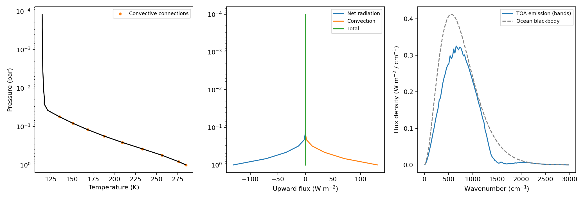
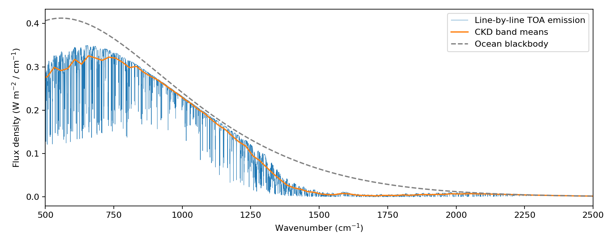

Forward RCE for an N2--H2O Ocean Planet
=======================================

This example solves for an atmospheric temperature profile and ocean
temperature under present-day solar forcing. ExoJAX computes water line
absorption from HITRAN transitions, compresses it into correlated-k (CKD)
tables, and uses the resulting spectral radiation field in the
radiative-convective equilibrium (RCE) iteration. The outputs include
:math:`T(P)`, the energy budget, and the outgoing thermal spectrum. The
example saves CKD band averages and can recompute a separate line-by-line
spectrum at the converged temperature profile.

The model is a saturated nitrogen--water Earth analogue. The surface
temperature is an unknown: the initial value of 288 K is only a numerical
guess. See :doc:`../userguide/rce` for the general solver contract.

Water thermodynamics and convective gradients are defined in
:download:`rce_earth_physics.py <../../examples/rce_earth_physics.py>`.
:download:`rce_earth.py <../../examples/rce_earth.py>` assembles the spectral
column and liquid-ocean domain check, and explicitly supplies
``neutral_gradient`` to ``solve_rce``. Interface-temperature reconstruction
and radiation routines live in ``exojax.rt.flux``.

Prepare the opacity and run
---------------------------

Use an environment with this ExoJAX checkout installed, for example with
``python -m pip install -e .``, and run from its root directory. The
preparation step downloads the main water isotopologue from HITRANonline
and evaluates its temperature-dependent line
strengths and Voigt profiles with ExoJAX. It saves the CKD table and its
metadata for subsequent offline calculations:

.. code-block:: console

   python examples/rce_earth_opacity.py --data-dir .database/rce_earth --check-ng 80

The default table samples 80--340 K every 20 K and nine pressures from
10\ :sup:`-4` to 1 bar. Its line spectrum covers 20--30000 cm\ :sup:`-1`,
with 25 cm\ :sup:`-1` thermal bands below 4000 cm\ :sup:`-1` and
100 cm\ :sup:`-1` bands above. ``--resolution 1000000`` sets the minimum
resolving power: a band uses
:math:`N_b=\lceil R\Delta\tilde\nu_b/\tilde\nu_{b,\mathrm{low}}\rceil`
equally spaced midpoint samples. The default 40-point k quadrature has
eight Gauss--Legendre points in each interval delimited by
:math:`g=[0,0.9,0.99,0.999,0.9999,1]`, resolving the strongest absorption
tail. Sorted spectral samples have empirical cumulative probabilities
:math:`(j+1/2)/N_b`, starting at :math:`j=0`. The command also saves
``water_ckd_ng80.npz`` from the same line evaluations for a quadrature
check. Building the table is the expensive step; preserve its accompanying
metadata files and inspect ``--help`` before changing the preparation.

Download the small MT_CKD 4.3 water continuum table and its license into a
separate cache:

.. code-block:: console

   PYTHONPATH=examples python - <<'PY'
   from rce_earth_continuum import download_data
   print(download_data(".database/rce_earth/mt_ckd_4.3"))
   PY

The helper checks the SHA-256 hashes of both files. The AER data license
permits scientific and research use and specifies conditions on commercial
use. The downloaded data and license remain in the cache; they are not
bundled with this tutorial.

The forward calculation then reads the prepared data without network access:

.. code-block:: console

   MPLBACKEND=Agg python examples/rce_earth.py \
       --table .database/rce_earth/water_ckd.npz \
       --continuum .database/rce_earth/mt_ckd_4.3/absco-ref_wv-mt-ckd.nc \
       --line-data .database/rce_earth/water.par \
       --output rce_earth_output

Use ``JAX_PLATFORMS=cpu`` if a GPU is unavailable. The script enables JAX
64-bit arithmetic, reports convergence and the energy residual, and saves
``rce_earth.png`` and ``rce_earth.npz``. A failed solve raises an error;
inspect its status before interpreting a temperature profile. The NPZ
contains pressure, temperature, water abundance, the convective mask,
interface fluxes, band edges, and band-averaged spectra.

With ``--line-data``, the script also evaluates the original HITRAN lines
and continuum at the converged profile over 500--2500 cm\ :sup:`-1`.
It saves ``rce_earth_line_spectrum.png`` and
``rce_earth_line_spectrum.npz``. The default sampling interval is
``--line-dnu 0.02`` cm\ :sup:`-1`. This gives a coarsely sampled line
spectrum; reduce the interval to check narrow-line sampling.
This extra radiation calculation keeps the solved temperature profile
fixed and overlays the CKD band means for comparison. Omit ``--line-data``
to produce only the band spectra and RCE diagnostics.

The live HITRAN endpoint does not identify a database release in its
response. Preparation records the retrieval time, source URL, isotope,
line count, and SHA-256 digest instead of assigning an unverified release
name. Retain that cached response when reproducing a run. The line table
uses the HITRAN terrestrial abundance convention for H2-16O.

Example result and numerical checks
-----------------------------------

The following run uses 24 layers, 40 k points, four positive angular
quadrature points, and the inputs above. The ocean reaches about 285 K,
with outgoing thermal flux 272.2 W/m2. Convective transport extends from
the ocean to the interface near 0.046 bar. The much colder upper region
is radiative. Orange points mark the deeper endpoints of convective
connections, including the connection to the ocean.

   Spectral RCE for the idealized nitrogen--water ocean planet. Net
   radiation includes the downward stellar flux. The upward convective
   flux balances it, giving zero total net flux at every interface.

   A separate ExoJAX line-by-line calculation at the solved profile,
   sampled every 0.02 cm\ :sup:`-1`. The CKD points describe band means;
   they retain the absorption bands but not the order of individual lines.

For the reference HITRAN response (293,947 lines), the SHA-256 digest is
``d97cd37cfc174d4cbeb65c4fa0478bbaf7059df7992121c24b374ede11e15c97``.
The figure cache retains 135,109 lines selected at 120--340 K. Selection
over the preparer's full 80--340 K grid adds 137 extremely weak lines for
this response; their summed intensity is below 3\ :math:`\times10^{-10}`
of the total at 80 and 100 K. The opacity metadata records the selection.
The default solve took 14 Newton steps and two convective active sets.
Its maximum total-flux residual was 3.7\ :math:`\times10^{-12}` W/m2.
This residual measures the discrete energy balance, not model accuracy.

.. list-table:: Sensitivity of the ocean temperature
   :header-rows: 1

   * - Layers
     - k points
     - Ocean temperature (K)
   * - 24
     - 40
     - 284.754
   * - 24
     - 80
     - 284.765
   * - 32
     - 40
     - 283.712
   * - 48
     - 40
     - 282.946

Refinement runs start from the converged 24-layer profile, interpolated
in log temperature and log pressure, and solve the temperatures again.
The 24-layer example is **not vertically converged**: doubling the layers
changes the ocean temperature by 1.81 K and the integrated absolute
difference in outgoing band spectra by 1.36% of the outgoing flux.
The separate line spectrum and CKD band means agree in their integrated
flux over the common complete bands, 520--2495 cm\ :sup:`-1`, to about
0.07%; this is a limited spectral check at one atmospheric state.

Upper layers need a separate accuracy check. They contain so little water
that a small absolute flux residual can coexist with an inaccurate
temperature. For this default run, a fixed-water, optically thin upper-layer
heating check gave local temperature corrections below 0.01 K. A different
initial profile passed the same total-flux tolerance while leaving upper
temperatures about 14 K lower; its local heating remained unbalanced.
Thus a successful status alone does not guarantee upper-temperature
accuracy for arbitrary initial guesses or changed parameters.

Solar forcing and the unknown ocean temperature
-----------------------------------------------

The input solar constant and prescribed planetary albedo are
:math:`S_0=1361\ \mathrm{W\,m^{-2}}` and :math:`A=0.20`. The absorbed
global mean incident flux is

.. math::

   F_{\star,0}=\frac{(1-A)S_0}{4}
   =272.2\ \mathrm{W\,m^{-2}}.

These inputs can be changed with ``--solar-constant`` and ``--albedo``.
The albedo is a prescribed parameter for exploring a liquid-ocean state
of this cloud-free analogue; it is not calculated from scattering or
clouds, or chosen to reproduce the observed present-day Earth climate.

The factor of four is the ratio of the sphere's surface area to its
intercepting disk. A 5772 K blackbody supplies the stellar spectral shape,
normalized to this bolometric flux. The direct beam uses :math:`\mu_0=0.5`
for its attenuation path. Its top flux already includes global averaging;
do not multiply it by :math:`\mu_0` again. The prescribed albedo removes
reflected energy before the beam enters the column.

Thermal radiation comes from every atmospheric layer and the black ocean
boundary. The internal heat flux is set to zero. Thus the ocean temperature
and layer temperatures must together produce outgoing thermal radiation
equal to the absorbed solar input. Water absorption determines where
stellar energy is deposited and which levels emit to space.

Water abundance and the cold trap
---------------------------------

The ocean supplies saturated water vapor. The saturation law uses a
temperature-dependent latent heat with constant heat capacities:

.. math::

   L(T)&=L_0+(c_{pv}-c_{pl})(T-T_0),\\
   e_s(T)&=e_0\left(\frac{T_0}{T}\right)^{(c_{pl}-c_{pv})/R_v}
   \exp\left[\frac{L_0}{R_vT_0}-\frac{L(T)}{R_vT}\right].

Here :math:`T_0=273.16` K, :math:`e_0=611.657` Pa,
:math:`L_0=2.501\times10^6` J/kg, :math:`c_{pv}=1850` J/kg/K, and
:math:`c_{pl}=4180` J/kg/K. This construction satisfies
:math:`d\ln e_s/dT=L(T)/(R_vT^2)`.

With pressure expressed in the same units as :math:`e_s`, the saturation
mole fraction is :math:`x_s=e_s/P`. Nodes are ordered from top to bottom,
including the ocean node :math:`N`. The prescribed water profile is

.. math::

   x_i=\min_{j\geq i}\frac{e_s(T_j)}{P_j}.

This follows ascending vapor that loses condensate immediately and retains
the smallest saturation mole fraction encountered. Above the cold trap,
water remains at that depleted abundance. The cold trap is a minimum of
:math:`e_s/P`, which need not coincide exactly with the temperature minimum.

.. literalinclude:: ../../examples/rce_earth_physics.py
   :language: python
   :pyobject: water_vmr

The saturation curve is for liquid water, extended to supercooled liquid
in the cold atmosphere. The ocean is restricted to the liquid regime;
ice, freezing, and condensate opacity are omitted.

Pseudoadiabatic convection
--------------------------

For a saturated parcel, the water mass mixing ratio relative to dry
nitrogen is :math:`r_s=\epsilon x_s/(1-x_s)`, where
:math:`\epsilon=R_d/R_v`. The gas constants use nitrogen and water molecular
masses, and :math:`c_{pd}=7R_d/2`. Immediate removal of condensed water
gives the pseudoadiabatic gradient

.. math::

   \nabla_{\rm ps}\equiv\frac{d\ln T}{d\ln P}
   =\frac{(R_d+r_sR_v)\left(1+\dfrac{Lr_s}{R_dT}\right)}
   {c_{pd}+r_sc_{pv}
    +\dfrac{L^2r_s}{R_vT^2}\left(1+\dfrac{r_s}{\epsilon}\right)}.

Its dry limit is :math:`R_d/c_{pd}=2/7`. The latent heat term reduces the
temperature drop of an ascending saturated parcel. At each connection,
thermodynamic quantities are evaluated at geometric mean pressure and
temperature. If vapor available from the deeper node cannot reach
saturation there, the neutral gradient is instead the unsaturated mixture
value :math:`(R_d+rR_v)/(c_{pd}+rc_{pv})`.

The solver compares this state-dependent neutral gradient,
:math:`\nabla_{*,i}`, with

.. math::

   \nabla_i=\frac{\ln T_{i+1}-\ln T_i}
   {\ln P_{i+1}-\ln P_i}.

A radiative connection becomes convective when
:math:`\nabla_i>\nabla_{*,i}`. Active connections enforce
:math:`\nabla_i=\nabla_{*,i}` and carry the residual energy flux
:math:`F^{\rm conv}_{i+1}=F_{\rm int}-F^{\rm rad}_{i+1}`. If that flux
becomes negative, the connection returns to the radiative set. Inactive
connections carry no convective flux and must be stable. Numerical
tolerances apply to both comparisons.

Here :math:`F^{\rm conv}` represents the total nonradiative energy transport,
including sensible and latent heat in this closure. Do not add another
latent heat flux to the energy budget.

Spectral radiation inside the iteration
---------------------------------------

At every trial temperature profile, the calculation follows this loop:

1. Recompute saturation, the cold-trapped water profile, and neutral gradients.
2. Interpolate the ExoJAX line CKD table at each layer's current temperature
   and pressure, and recompute self and foreign continuum absorption.
3. Solve the upward and downward thermal radiation and attenuate the
   direct stellar spectrum through the resulting optical depths.
4. Integrate the spectral fluxes, take a damped Newton temperature step,
   and update the convective connections after solving the fixed-mask equations.

The short radiation callback illustrates where the spectrum enters RCE:

.. literalinclude:: ../../examples/rce_earth.py
   :language: python
   :pyobject: EarthColumn.radiative_flux

With k quadrature weights :math:`w_g` and band widths
:math:`\Delta\tilde\nu_b`, the net radiative flux is

.. math::

   F_j^{\rm rad}=\sum_b\Delta\tilde\nu_b\sum_g w_g
   \left(F^\uparrow_{jgb}-F^\downarrow_{jgb}
   -F^\star_{jgb}\right).

Convergence requires :math:`F_j^{\rm rad}+F_j^{\rm conv}=F_{\rm int}=0`
at every interface, together with the convective inequalities above.
The example uses erg/s/cm2 internally; its default absolute flux tolerance
is 10\ :sup:`-6` erg/s/cm2, or 10\ :sup:`-9` W/m2, set by ``--flux-atol``.
The saved diagnostics convert
to W/m2 by dividing by 1000. The reported energy residual is the maximum
absolute total-flux imbalance over all interfaces. It is not a temperature
step or just a top-of-atmosphere check.

The continuum is evaluated at band centers and added to every k point in
that band, assuming that it varies slowly across the band. Planck sources
also use band centers. Spectral tails outside the line table complete the
bolometric integration without additional line absorption. The local
Voigt contributions use a 25 cm\ :sup:`-1` cutoff with the Lorentz
pedestal subtracted, consistent with the continuum convention.
The CKD calculation also assumes correlated absorption ranks between
layers; the line-by-line spectrum provides an independent check of this
approximation at the converged state.

What to inspect and refine
---------------------------

Compare the solved temperature profile with the convective mask, inspect
the separate radiative and convective fluxes, and locate water absorption
bands in the outgoing spectrum. The spectral points in ``rce_earth.png``
are **band-averaged flux densities**, in W/m2 per cm\ :sup:`-1`.
``rce_earth_line_spectrum.png`` adds the separate line-by-line calculation
at its stated sampling interval. Sorting absorption into k space loses
the original order of individual lines, so k points cannot be treated as
wavenumbers to recover the line spectrum.

Refine the line sampling, strength cutoff, k quadrature, atmospheric
layers, angular quadrature, and temperature/pressure table grids when
quantitative accuracy is needed. Check changes in ocean temperature,
the convective boundary, and outgoing band fluxes as well as the energy
residual. The explicit table-domain guard prevents interpolation outside
the prepared temperature and pressure range.

Total surface pressure is fixed at 1 bar. Consequently, this example does
not conserve a prescribed nitrogen inventory exactly as atmospheric water
changes. HITRAN air broadening approximates nitrogen collisions; line
self broadening is omitted, while continuum self absorption is included.
There is no CO2, O3, cloud opacity, explicit scattering, ice feedback, or
ocean heat storage. The imposed planetary albedo and saturated humidity
are closures, and the resulting profile is not a prediction of the
observed present-day Earth climate.

Without ozone heating, a non-gray atmosphere can have a much colder upper
region than Earth's stratosphere. Kasting et al. (2015, p. 3) found upper
temperatures near 100 K or lower in an ozone-free model containing some
CO2. That provides a precedent for cold upper layers, rather than a
validation of this CO2-free example. The table extends to 80 K so that
the calculation does not impose a warm stratospheric temperature.

References
----------

* `Ambaum (2020) <https://doi.org/10.1002/qj.3899>`_: the thermodynamically
  consistent liquid-water saturation relation.
* `Ding and Pierrehumbert (2016) <https://doi.org/10.3847/0004-637X/822/1/24>`_:
  the pseudoadiabatic gradient with immediate condensate removal.
* `HITRAN MT_CKD documentation <https://hitran.org/mtckd/>`_: continuum
  definitions, line-cutoff convention, official data, and citation policy.
* `Kasting et al. (2015) <https://doi.org/10.1088/2041-8205/813/1/L3>`_:
  cold upper atmospheres in non-gray calculations without ozone.
