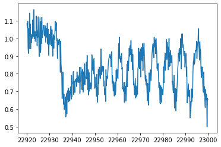
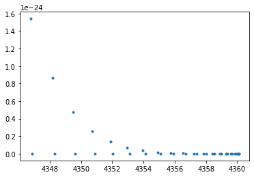
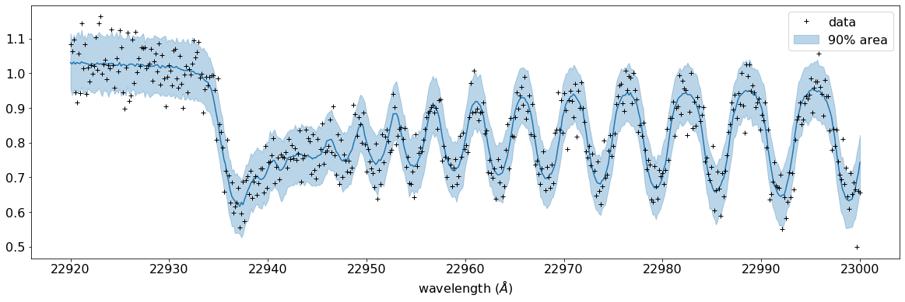
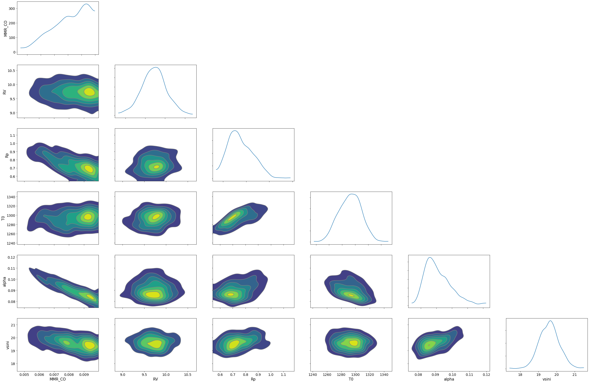

Reverse Modelling of an Emission Spectrum
===========================================
*Update: June 1/2021, Hajime Kawahara*

.. code:: ipython3

    import pandas as pd
    import numpy as np
    import matplotlib.pyplot as plt
    import jax.numpy as jnp

Here, we use the mock spectrum generated by ":doc:`forward_modeling`".

.. code:: ipython3

    dat=pd.read_csv("spectrum.txt",delimiter=",",names=("wav","flux"))

We add Gaussian noise to data. nusd is the observing wavenumber grid.

.. code:: ipython3

    wavd=dat["wav"].values
    flux=dat["flux"].values
    nusd=jnp.array(1.e8/wavd[::-1])
    sigmain=0.05
    norm=40000
    nflux=flux/norm+np.random.normal(0,sigmain,len(wavd))
    plt.plot(wavd[::-1],nflux)

.. code:: ipython3

    from exojax.spec.lpf import xsmatrix
    from exojax.spec.exomol import gamma_exomol
    from exojax.spec.hitran import SijT, doppler_sigma, gamma_natural, gamma_hitran
    from exojax.spec.hitrancia import read_cia, logacia
    from exojax.spec.rtransfer import rtrun, dtauM, dtauCIA, nugrid
    from exojax.spec import planck, response
    from exojax.spec.lpf import xsvector
    from exojax.spec import molinfo
    from exojax.utils.constants import RJ, pc, Rs, c

The model is almost same as the forward modeling, but we will infer here
Rp, RV, MMR_CO, T0, alpha, and Vsini.

.. code:: ipython3

    from exojax.spec import rtransfer as rt
    NP=100
    Parr, dParr, k=rt.pressure_layer(NP=NP)
    Nx=1500
    nus,wav,res=nugrid(np.min(wavd)-5.0,np.max(wavd)+5.0,Nx,unit="AA")
    
    R=100000.
    beta=c/(2.0*np.sqrt(2.0*np.log(2.0))*R)
    
    molmassCO=molinfo.molmass("CO")
    mmw=2.33 #mean molecular weight
    mmrH2=0.74
    molmassH2=molinfo.molmass("H2")
    vmrH2=(mmrH2*mmw/molmassH2) #VMR
    
    Mp = 33.2 #fixing mass...

Loading the molecular database of CO and the CIA

.. code:: ipython3

    from exojax.spec import moldb, contdb
    mdbCO=moldb.MdbExomol('.database/CO/12C-16O/Li2015',nus,crit=1.e-46)
    cdbH2H2=contdb.CdbCIA('.database/H2-H2_2011.cia',nus)

.. parsed-literal::

    Background atmosphere:  H2
    Reading transition file
    Broadening code level= a0
    H2-H2

We have only 39 CO lines.

.. code:: ipython3

    plt.plot(mdbCO.nu_lines,mdbCO.Sij0,".")

Again, numatrix should be precomputed prior to HMC-NUTS.

.. code:: ipython3

    from exojax.spec import make_numatrix0
    numatrix_CO=make_numatrix0(nus,mdbCO.nu_lines)

.. code:: ipython3

    #reference pressure for a T-P model                                             
    Pref=1.0 #bar
    ONEARR=np.ones_like(Parr)

.. code:: ipython3

    import jax.numpy as jnp
    from jax import random
    from jax import vmap, jit
    
    import numpyro.distributions as dist
    import numpyro
    from numpyro.infer import MCMC, NUTS
    from numpyro.infer import Predictive
    from numpyro.diagnostics import hpdi

Now we write the model, which is used in HMC-NUTS.

.. code:: ipython3

    def model_c(nu1,y1):
        Rp = numpyro.sample('Rp', dist.Uniform(0.5,1.2))
        RV = numpyro.sample('RV', dist.Uniform(5.0,15.0))
        MMR_CO = numpyro.sample('MMR_CO', dist.Uniform(0.0,0.01))
        T0 = numpyro.sample('T0', dist.Uniform(1000.0,1500.0))
        alpha=numpyro.sample('alpha', dist.Uniform(0.05,0.2))
        vsini = numpyro.sample('vsini', dist.Uniform(15.0,25.0))
        g=2478.57730044555*Mp/Rp**2 #gravity                                        
        u1=0.0
        u2=0.0
        #T-P model//                                                                
        Tarr = T0*(Parr/Pref)**alpha
    
        #line computation CO                                                        
        qt_CO=vmap(mdbCO.qr_interp)(Tarr)
    
        def obyo(y,tag,nusd,nus,numatrix_CO,mdbCO,cdbH2H2):
            #CO                                                                     
            SijM_CO=jit(vmap(SijT,(0,None,None,None,0)))\
                (Tarr,mdbCO.logsij0,mdbCO.dev_nu_lines,mdbCO.elower,qt_CO)
            gammaLMP_CO = jit(vmap(gamma_exomol,(0,0,None,None)))\
                (Parr,Tarr,mdbCO.n_Texp,mdbCO.alpha_ref)
            gammaLMN_CO=gamma_natural(mdbCO.A)
            gammaLM_CO=gammaLMP_CO+gammaLMN_CO[None,:]
            
            sigmaDM_CO=jit(vmap(doppler_sigma,(None,0,None)))\
                (mdbCO.dev_nu_lines,Tarr,molmassCO)
            xsm_CO=xsmatrix(numatrix_CO,sigmaDM_CO,gammaLM_CO,SijM_CO)
            dtaumCO=dtauM(dParr,xsm_CO,MMR_CO*ONEARR,molmassCO,g)
            #CIA                                                                    
            dtaucH2H2=dtauCIA(nus,Tarr,Parr,dParr,vmrH2,vmrH2,\
                              mmw,g,cdbH2H2.nucia,cdbH2H2.tcia,cdbH2H2.logac)
            dtau=dtaumCO+dtaucH2H2
            sourcef = planck.piBarr(Tarr,nus)
            F0=rtrun(dtau,sourcef)/norm
            
            Frot=response.rigidrot(nus,F0,vsini,u1,u2)
            mu=response.ipgauss_sampling(nusd,nus,Frot,beta,RV)
            numpyro.sample(tag, dist.Normal(mu, sigmain), obs=y)
        
        obyo(y1,"y1",nu1,nus,numatrix_CO,mdbCO,cdbH2H2)
    

Run a HMC-NUTS. It took ~37min using my gaming laptop (razer blade 15, GTX 1080 Max-Q). Here, the number of warmup sampling is only 300, and that of real sampling is only 600, because the time when the draft on arxiv will be released is very soon and I am writing this eating breakfast (in June 1st 2021 morning in JST!). Note that we here use forward mode (forward differentiation) by 'forward_mode_differentiation=True' in NUTS. Since ExoJAX v1.1, we can also use the reverse mode 'forward_mode_differentiation=False' in NUTS.

.. code:: ipython3

    rng_key = random.PRNGKey(0)
    rng_key, rng_key_ = random.split(rng_key)
    num_warmup, num_samples = 300, 600
    kernel = NUTS(model_c,forward_mode_differentiation=True)
    mcmc = MCMC(kernel, num_warmup, num_samples)
    mcmc.run(rng_key_, nu1=nusd, y1=nflux)

.. parsed-literal::

    sample: 100%|██████████| 900/900 [37:05<00:00,  2.53s/it, 127 steps of size 3.88e-02. acc. prob=0.90]   

Plotting a prediction and 90% area with the data... looks good.

.. code:: ipython3

    posterior_sample = mcmc.get_samples()
    pred = Predictive(model_c,posterior_sample,return_sites=["y1"])
    predictions = pred(rng_key_,nu1=nusd,y1=None)
    median_mu1 = jnp.median(predictions["y1"],axis=0)
    hpdi_mu1 = hpdi(predictions["y1"], 0.9)                                      
    fig, ax = plt.subplots(nrows=1, ncols=1, figsize=(20,6.0))
    ax.plot(wavd[::-1],median_mu1,color="C0")
    ax.plot(wavd[::-1],nflux,"+",color="black",label="data")
    ax.fill_between(wavd[::-1], hpdi_mu1[0], hpdi_mu1[1], alpha=0.3, interpolate=True,color="C0",label="90% area")
    plt.xlabel("wavelength ($\AA$)",fontsize=16)
    plt.legend(fontsize=16)
    plt.tick_params(labelsize=16)

`Arviz <https://arviz-devs.github.io/arviz/>`_ is useful to visualize the corner plot. For the above reasons, I haven’t been checkingthe results properly. Ah, the range of prior looks too narrow for some parameters. But I have to take the boy to kindergarten soon. Try to change the priors and to run a HMC-NUTS again, with maybe longer chains! The rest is up to you.

.. code:: ipython3

    import arviz
    pararr=["Rp","T0","alpha","MMR_CO","vsini","RV"]
    arviz.plot_pair(arviz.from_numpyro(mcmc),kind='kde',divergences=False,marginals=True)
    plt.show()

For fitting to the real spectrum, we may need a more well-considered model and a better GPU, such as V100 or A100. Read the next section ":doc:`fitbd`" in detail.
